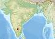

# Indian Deep Space Network
> 2019.05.12 [🚀](../index/index.md) [despace](index.md) → [ISRO](zz_isro.md), **[НС](scs.md)**

[TOC]

---

> <small>**Indian Deep Space Network (IDSN)** — англоязычный термин, не имеющий аналога в русском языке. **Индийская сеть дальней космической связи** — дословный перевод с английского на русский.</small>

**Indian Deep Space Network (IDSN)** is a network of large antennas and communication facilities operated by the [Indian Space Research Organisation](zz_isro.md) to support the interplanetary spacecraft missions of India. Its hub is located at Byalalu, a village about 25 ㎞ from Bangalore, India. It was inaugurated on 17 October 2008 by the former ISRO chairman G. Madhavan Nair. The main tracking antenna was designed and commissioned by Hyderabad‑based Electronics Corporation of India Limited at a cost of ₹65 crore (about US$13 million).

| |
|:--|
||

The network consists of the ISRO Telemetry, Tracking and Command Network (ISTRAC), augmented by a fully steerable 18 m and a 32 m DSN antenna which improves the visibility duration when compared with the existing ISTRAC system. The Indian Deep Space Network implements a baseband system[clarification needed] adhering to [Consultative Committee for Space Data Systems (CCSDS)](ccsds.md) Standards, thus facilitating cross‑support among the Telemetry Tracking Command (TTC) agencies.

**Telescopes:**

   - 32‑meter DSN Antenna — Deep Space Tracking Antenna. [Bands](rf.md): **S** (↑/↓), **X** (↑/↓).
   - 18‑meter DSN Antenna — Deep Space Tracking Antenna. [Bands](rf.md): <mark>TBD</mark>
   - 11‑meter DSN Antenna — Terminal Tracking Antenna. [Bands](rf.md): <mark>TBD</mark>

 

## Docs & links (TRANSLATEME ALREADY)
|Navigation|
|:--|
|**[FAQ](faq.md)**, **[Cable](cable.md)**·БКС, **[Camera](cam.md)**·Камера, **[Comms](comms.md)**·Радио, **[CON](contact.md)·[Pers](person.md)**·Контакт, **[Control](control.md)**·Упр., **[Doc](doc.md)**·Док., **[Doppler](doppler.md)**·ИСР, **[DS](ds.md)**·ЗУ, **[EB](eb.md)**·ХИТ, **[ECO](ecology.md)**·Экол., **[EF](ef.md)**·ВВФ, **[ElC](elc.md)**·ЭКБ, **[EMC](emc.md)**·ЭМС, **[Error](error.md)**·Ошибки, **[Event](event.md)**·События, **[FS](fs.md)**·ТЭО, **[Fuel](fuel.md)**·Топливо, **[GNC](gnc.md)**·БКУ, **[GS](scs.md)**·НС, **[HF&E](hfe.md)**·Эрго., **[IU](iu.md)**·Гиро., **[KT](kt.md)**·КТЕХ, **[LAG](lag.md)**·ПУC, **[LES](les.md)**·САСП, **[LS](ls.md)**·СЖО, **[LV](lv.md)**·РН, **[MCC](mcc.md)**·ЦУП, **[Model](model.md)**·Модель, **[MSC](sc.md)**·ПКА, **[N&B](nnb.md)**·БНО, **[NR](nr.md)**·ЯР, **[OBC](obc.md)**·ЦВМ, **[OE](oe.md)**·БА, **[Pat.](патент.md)**·Патент, **[Proj.](project.md)**·Проект, **[PS](ps.md)**·ДУ, **[QA](qa.md)**·БКНР, **[R&D](rnd.md)**·НИОКР, **[Robot](robotics.md)**·Робот, **[Rover](rover.md)**·Ровер, **[RTG](rtg.md)**·РИТЭГ, **[SARC](sarc.md)**·ПСК, **[SE](se.md)**·СЭ, **[Sens.](sensor.md)**·Датч., **[SC](sc.md)**·КА, **[SCS](scs.md)**·КК, **[SGM](sgm.md)**·КММ, **[SI](si.md)**·СИ, **[Soft](soft.md)**·ПО, **[SP](sp.md)**·БС, **[Spaceport](spaceport.md)**·Космодр., **[SPS](sps.md)**·СЭС, **[SSS](sss.md)**·ГЗУ, **[TCS](tcs.md)**·СОТР, **[Test](test.md)**·ЭО, **[Timeline](timeline.md)**·ЦГМ, **[TMS](tms.md)**·ТМС, **[TOR](tor.md)**·ТЗ, **[TRL](trl.md)**·УГТ|
|*Sections & pages*|
|**`Наземная станция (НС):`**  …    [CDSN](cdsn.md)┊ [DSN](dsn.md)┊ [ESTRACK](estrack.md)┊ [IDSN](idsn.md)┊ [SSC_GGSN](ssc_ggsn.md)┊ [UDSC](udsc.md)|

   1. Docs: …
   1. Notable interwikies — …
   1. <https://en.wikipedia.org/wiki/Indian_Deep_Space_Network>
   1. <http://www.isro.gov.in/about-isro/isro-telemetry-tracking-and-command-network-istrac>

