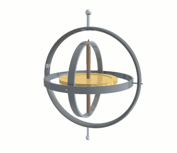
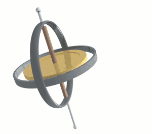

# Гироскоп
> 2019.05.12 ┊ **[🚀](../index/index.md) [despace](index.md)** → [GNC](gnc.md), **[Гироскоп](imu.md)**

[TOC]

---

> <small>*Термины:* **Гироскоп** — русскоязычный термин. **Gyroscope / Inertial measurement unit (IMU)** — англоязычный эквивалент.</small>  
> <small>**Гиростабилизатор** — русскоязычный термин. **Gyroscope / Inertial measurement unit (IMU)** — англоязычный эквивалент.</small>  
> <small>**Волоконно‑оптический гироскоп (ВОГ)** — русскоязычный термин. **Fibre optic gyroscope (FOG)** — англоязычный эквивалент.</small>  
> <small>**Гироскопический измеритель вектора угловой скорости (ГИВУС)** — русскоязычный термин. **Angular rate sensor (ARS)** — англоязычный эквивалент.</small>

**Гироскоп** *(от др.‑греч. γῦρος — круг + σκοπέω — смотрю)* — устройство, способное реагировать на изменение углов ориентации тела, на котором оно установлено, относительно инерциальной системы отсчёта. Простейший пример гироскопа — юла (волчок).

## Описание
**Разновидности:**

   - **Гироскоп** [КА](sc.md) предназначен для определения положения КА в инерциальной системе отсчёта.
   - **Гиростабилизатор** — гироскопическое устройство, предназначенное для стабилизации отдельных объектов или приборов, а также для определения угловых отклонений объектов.
   - **Волоконно‑оптический гироскоп (ВОГ)**, англ. **Fibre optic gyroscope** — оптико‑электронный прибор, измеряющий абсолютную (относительно инерциального пространства) угловую скорость. Как и у всех оптических гироскопов, принцип работы основан на эффекте Саньяка. Луч света в ВОГе проходит через катушку оптоволокна, отсюда и название. Для повышения чувствительности гироскопа используют световод большой длины (порядка 1 км), уложенный витками. В отличие от кольцевого лазерного гироскопа, в ВОГ обычно используется свет с очень маленькой длиной когерентности, что необходимо для увеличения точности гироскопа до удовлетворительного уровня. В качестве источника света может использоваться не лазерный прибор, а, например, светодиод.
   - **Бесплатформенный инерциальный блок (БИБ)** — разновидность ВОГ.

| <small>Иллюстрация к основному свойству 3‑степенного гироскопа — гироскопа в кардановом подвесе. При нулевом моменте, воздействующем на ось гироскопа, её направление в пространстве остаётся неизменным.</small>  | <small>Анимация прецессии механического гироскопа. Опрокидывающий момент вызывает прецессию, перпендикулярную к вектору момента.</small>  |
|:--|:--|
|   |   |

## Разновидности
|*Страна*|*[Фирма](contact.md)*|*Актуальные <small>(масса, кг)</small>*|*Исторические <small>(масса, кг)</small>*|
|:--|:--|:--|:--|
|*Европа*| <small>[ADS](zz_ads.md)</small>  | <small>[Astrix 1090](astrix_1090.md) (4.8)</small>  |  |
|*Россия*| <small>[НПП Антарес](zz_npp_antares.md)</small>  | <small>[ИУС-ВОА](ius_voa.md) (15.1) ┊ [БИУС-М](bius_m.md) (5.1)</small>  |  |
| | <small>[НПО ИТ](zz_npoit.md)</small>  | <small>[БИБ-ФГ](bib_fg.md) (1.36) ┊ [МБИНС](mbins.md) (1.34)</small>  | <small>[БИБ-ИГ](bib_ig.md) (3.6)</small>  |
| | <small>[НПЦАП](zz_npcap.md)</small>  | <small>[БИУС-Л](bius_l.md) (10)</small>  |  |
|*США*| <small>[Northrop Grumman](zz_northrop_grumman.md)</small>  | <small>[LN-200](ln_200.md) (1.25)</small>  |  |

## Производители
   - **Европа:**
      1. [ADS](zz_ads.md)
   - **РФ:**
      1. [НИИКП](zz_niicom.md)
      1. [НПП Антарес](zz_npp_antares.md) — не очень опытные в своём деле. <small>(на 2017 ‑ 2018 гг)</small>
      1. [НПО ИТ](zz_npoit.md)
      1. [НПЦАП](zz_npcap.md)
   - **США:**
      1. [Northrop Grumman](zz_northrop_grumman.md)

 

## Docs & links (TRANSLATEME ALREADY)
|…°·•¹²³±×÷≤≥≈≠ ‑ −— ⎆✉ ❐“”’«»✔→✘☐☑├┕┆ 1 lb = 0.453592 kg; 1 g = 9.80665 m/s²|
|:--|
|<small>**[FAQ](faq.md)**, **[Cable](cable.md)**·БКС, **[Camera](camera.md)**·Камера, **[Comms](comms.md)**·Радиосв., **[Contact](contact.md)**·Контакт, **[Control](control.md)**·Управ., **[Doc](doc.md)**·Док., **[Doppler](doppler.md)**·ИСР, **[DS](ds.md)**·ЗУ, **[EB](eb.md)**·ХИТ, **[ECO](ecology.md)**·Экол., **[EF](ef.md)**·ВВФ, **[ElC](elc.md)**·ЭКБ, **[EMC](emc.md)**·ЭМС, **[Errors](error.md)**·Ошибки, **[Events](event.md)**·События, **[FS](fs.md)**·ТЭО, **[Fuel](fuel.md)**·Топливо, **[GNC](gnc.md)**·БКУ, **[GS](scs.md)**·НС, **[HF&E](hfe.md)**·Эргоном., **[IMU](imu.md)**·Гироскоп, **[Incubator](incubator.md)**·Инкуб., **[KT](kt.md)**·КТЕХ, **[LAG](lag.md)**·ПУC, **[LES](les.md)**·САСП, **[LS](ls.md)**·СЖО, **[LV](lv.md)**·РН, **[MAG](mag.md)**·Магнитом., **[MCC](mcc.md)**·ЦУП, **[Model](model.md)**·Модель, **[MSC](sc.md)**·ПКА, **[N&B](nnb.md)**·БНО, **[NR](nr.md)**·ЯР, **[OBC](obc.md)**·ЦВМ, **[OE](oe.md)**·БА, **[Patent](патент.md)**·Патент, **[Project](project.md)**·Проект, **[PS](ps.md)**·ДУ, **[QA](quality.md)**·QA, **[R&D](rnd.md)**·НИОКР, **[RAMS](rams.md)**·НиБ, **[Risk](risk.md)**·Риск, **[Robot](robotics.md)**·Робот, **[Rover](rover.md)**·Планетоход, **[RTG](rtg.md)**·РИТЭГ, **[RW](rw.md)**·ДМ, **[SARC](sarc.md)**·ПСК, **[Sensor](sensor.md)**·Датчик, **[SC](sc.md)**·КА, **[SCS](scs.md)**·КК, **[SGM](sgm.md)**·КММ, **[SI](si.md)**·СИ, **[Soft](soft.md)**·ПО, **[SP](sp.md)**·БС, **[Spaceport](spaceport.md)**·Космодром, **[SPS](sps.md)**·СЭС, **[SSS](sss.md)**·ГЗУ, **[TCS](tcs.md)**·СОТР, **[Test](test.md)**·ЭО, **[Timeline](timeline.md)**·Циклограмма, **[TMS](tms.md)**·ТМС, **[TOR](tor.md)**·ТЗ, **[TRL](trl.md)**·УГТ</small>|
|*Sections & pages*|
|**`Бортовой комплекс управления (БКУ):`**  [АСН, САН](ans.md) ┊ [БНО](nnb.md) ┊ [БАППТ](acup.md) ┊ [БКС](cable.md) ┊ [БУ](sp.md) ┊ [БШВ](time.md) ┊ [Гироскоп](imu.md) ┊ [Дальномер](doppler.md) (ИСР) ┊ [ДМ](rw.md) ┊ [ЗД](sensor.md) ┊ [Компьютер](obc.md) (ЦВМ, БЦВМ) ┊ [Магнитометр](mag.md) ┊ [МИХ](mic.md) ┊ [МКО](mil_std_1553b.md) ┊ [ПО](soft.md) ┊ [ПНА, ПОНА, ПСНА](aiad.md) ┊ [СД](sensor.md) ┊ [Система координат](coord_sys.md) ┊ [СОСБ](spos.md) |
|**`Гироскоп:`**  … • • •  **Европа:** [Astrix 1090](astrix_1090.md) (4.8)  ▮  **РФ:** [ИУС-ВОА](ius_voa.md) (15.1) ┊ [БИУС-Л](bius_l.md) (10) ┊ [БИУС-М](bius_m.md) (5.1) ┊ [БИБ-ФГ](bib_fg.md) (1.36) ┊ [МБИНС](mbins.md) (1.34) ··· *([БИБ-ИГ](bib_ig.md) (3.6))*  ▮  **США:** [LN-200](ln_200.md) (1.25) |

   1. Docs: …
   1. Notable interwikies — …
   1. <http://polyorbite.ca/satellites/attitude-determination-and-control-system-adcs/>
   1. <https://en.wikipedia.org/wiki/Fibre_optic_gyroscope>
   1. <https://en.wikipedia.org/wiki/Gyroscope>
   1. <https://en.wikipedia.org/wiki/Inertial_measurement_unit>
   1. <https://ru.wikipedia.org/wiki/Гироскоп>
   1. <https://ru.wikipedia.org/wiki/Гиростабилизатор>
   1. <https://ru.wikipedia.org/wiki/Волоконно‑оптический_гироскоп>
   1. <https://ru.wikipedia.org/wiki/Гиростабилизатор>

