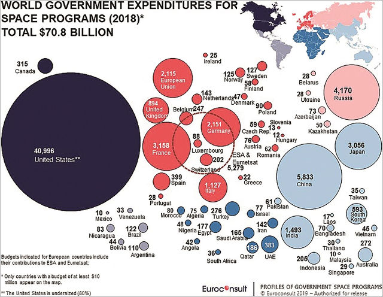

# Инкубатор
> 2019.11.29 ┊ **🚀 [despace](index.md)** → **[Don’t Panic](dont_panic.md)**

[TOC]

---

> <small>*Термины:*</small>  
> <small>**Аналитика** — русскоязычный термин. **Analytics** — англоязычный эквивалент.</small>  
> <small>**Инкубатор** — русскоязычный термин. **Incubator** — англоязычный эквивалент.</small>

Ниже приведена **аналитическая сводка** состояния космической отрасли в мире, а также перспективные проекты, находящиеся в **инкубаторе despace**.

Предназначены для:

   - понимания куда двигается мировая космическая отрасль, отдельные страны, фирмы, направления и, возможно, личности;
   - отслеживания перспективных разработок, помощи и интеграции их в реальные проекты;
   - планирования дальнейших разработок.

По мере наполнения, обновления и устаревания информации оная должна переноситься в профильные разделы. Например, данные о пусках [Falcon Heavy](falcon.md) должны переноситься на страницу [Falcon Heavy](falcon.md) в общем виде, а здесь оставаться последние новости.

 

## Инкубатор
Перспективные технологии хранятся в инкубаторе до достижения ими [TRL 3 ‑ 4](trl.md) (3: Analytical & experimental critical function and/or characteristic proof‑of‑concept, 4: Component and/or breadboard validation in laboratory environment).

|*Дата помещения*|*Описание*|
|:--|:--|
|2020.02.11| **[Капиллярное хранение газов](cgs.md).**  Технология позволяет хранить водород и, теоретически, прочие газы в стеклянных капиллярах при высоком давлении и плотности, по расчётам позволяя упаковать в тот же объём бака больше массы газа. На момент помещения в инкубатор технология проигрывала существующим композитным бакам высокого давления и имела TRL 1. |
|2020.02.10| **[Баумана, ПУСМ с краш-опорами ❐](f/lag/lags_2020baumana.pdf).**  Сминаемые опоры без направляющих. На момент помещения в инкубатор технология имела TRL 1 и была диссертационным проектом Луковкина Романа и его руководителя [Г.А. Щеглова](zz_scheglov1.md). |

---

 

## Аналитика
<mark>TBD</mark>

   - 2017.11.17 Китай планирует занять доминирующую позицию в космосе к 2045 году. (<http://www.chinadaily.com.cn/china/2017-11/17/content_34653486.htm>)

 

### Деньги

**Таблица.** Затраты на космос различных стран в 2018 году. (<https://spacenews.com/op-ed-global-government-space-budgets-continues-multiyear-rebound/>, [Редактируемый файл ❐](f/incubator/cost_world.xlsx))

<small>

|*Страна*|*Млн. \$*|*%*|•|*Страна*|*Млн. \$*|*%*|
|:--|:--|:--|:--|:--|:--|:--|
| **Итого:** | **70 766** | **100** |•|**—**|**—**|**—**|
| США | 40 996 | 57,93 || Марокко | 80 | 0,113 |
| Китай | 5 833 | 8,243 || Израиль | 77 | 0,109 |
| Россия | 4 170 | 5,893 || Австрия | 76 | 0,107 |
| Франция | 3 158 | 4,463 || Алжир | 75 | 0,106 |
| Япония | 3 056 | 4,318 || Азер&shy;байджан | 73 | 0,103 |
| Германия | 2 151 | 3,040 || Бангладеш | 70 | 0,099 |
| Евросоюз | 2 115 | 2,989 || Румыния | 62 | 0,088 |
| Индия | 1 493 | 2,110 || Пакистан | 61 | 0,086 |
| Италия | 1 127 | 1,593 || Чехия | 59 | 0,083 |
| Велико&shy;британия | 894 | 1,263 || Финляндия | 58 | 0,082 |
| Северная Корея | 593 | 0,838 || Казахстан | 50 | 0,071 |
| Испания | 399 | 0,564 || Нигерия | 48 | 0,068 |
| ОАЭ | 383 | 0,541 || Дания | 47 | 0,066 |
| Канада | 315 | 0,445 || Вьетнам | 45 | 0,064 |
| Турция | 276 | 0,390 || Боливия | 44 | 0,062 |
| Австралия | 272 | 0,384 || Ангола | 42 | 0,059 |
| Бельгия | 247 | 0,349 || Северная Африка | 36 | 0,051 |
| Индонезия | 205 | 0,290 || Тайвань | 35 | 0,049 |
| Швейцария | 202 | 0,285 || Венесуэла | 33 | 0,047 |
| Катар | 186 | 0,263 || Таиланд | 30 | 0,042 |
| Египет | 177 | 0,250 || Сингапур | 29 | 0,041 |
| Саудовская Аравия | 165 | 0,233 || Беларусь | 28 | 0,040 |
| Нидер&shy;ланды | 143 | 0,202 || Португалия | 28 | 0,040 |
| Иран | 142 | 0,201 || Украина | 28 | 0,040 |
| Швеция | 127 | 0,179 || Ирландия | 25 | 0,035 |
| Норвегия | 125 | 0,177 || Греция | 22 | 0,031 |
| Бразилия | 122 | 0,172 || Лаос | 17 | 0,024 |
| Аргентина | 110 | 0,155 || Словения | 13 | 0,018 |
| Польша | 90 | 0,127 || Венгрия | 12 | 0,017 |
| Люксем&shy;бург | 88 | 0,124 || Малайзия | 10 | 0,014 |
| Никарагуа | 83 | 0,117 || Мексика | 10 | 0,014 |

</small>

<mark>TBD</mark>

 

### Солнечная система

   - 2018.06.12 ESA объявило конкурс на разработку дешёвого выведения грузов на НОО с выдачей призов в 2021. (<http://ec.europa.eu/research/eic/index.cfm?pg=prizes_space>)

#### Венера
   - C 2009 г США ведёт разработку высокотемпературных компонентов в программе HotTech.

#### Луна
   - 2019.06.01 NASA планирует отправлять грузы на Луну с 2020 года. (<https://www.ctvnews.ca/sci-tech/nasa-plans-to-send-equipment-to-moon-from-2020-1.4447466>)
   - 2019.11.01 Китай подумывает об $ 10 трлн экономической зоне Земля‑Луна. (<http://www.globaltimes.cn/content/1168698.shtml>)

 

### Страны

#### РФ
   - 2019.12.05 Роскосмос воспринимает NASA как соперника и снижает приоритет науки в космосе. (<http://kosmolenta.com/index.php/1510?id=1510>)
   - Ситуация с «Северным потоком‑2» может привести к снижению финансирования космоса с конца 2019 г.

 

---

### Аэрокомические агентства

<mark>TBD</mark>

#### Европа

Бюджет ЕКА на 2020 ‑ 2022 гг предполагается в € 12.5 млрд. (<http://kosmolenta.com/index.php/1507?id=1507>)

#### Китай

   - Китай испытал систему связи с КА в дальнем космосе. ([2019.11.22 ⎆](http://kosmolenta.com/index.php/1504?id=1504))

#### США

   - **[SpaceX ⎆](https://www.spacex.com/):**
      - [Falcon 9 ⎆](https://www.spacex.com/falcon9)
         - Удачный запуск РН и посадка 1 ступени [(2019 12 16) ⎆](https://www.spacex.com/webcast)
      - [Falcon Heavy ⎆](https://www.spacex.com/falcon-heavy)
         - 3-й пуск. Запуск 24-х спутников [(2019 06 25) ⎆](https://www.space.com/spacex-falcon-heavy-stp2-launch-success.html)
      - [Dragon ⎆](https://www.spacex.com/dragon)
         - 19-й пуск на МКС [(2019 12 05) ⎆](https://www.spacex.com/news/2019/12/05/dragon‑resupply-mission-crs-19-launch)
      - [Starship ⎆](https://blogs.nasa.gov/spacestation/)
         - Тест двигателя Mk1 и пробный "прыжок" Starship [(2019 11 19) ⎆](https://www.space.com/spacex-starship-mk1-test-campaign-begins.html)
   - **[NASA ⎆](https://www.nasa.gov/):**
      - [ISS ⎆](https://www.nasa.gov/)
         - NASA предложило закупить места для краткосрочных коммерческих полетов  [(2019 11 28) ⎆](https://spacenews.com/nasa-proposes-to-buy-seat-on-short-duration-commercial-iss-flight/)
      - [Hubble Space Telescope ⎆](https://www.nasa.gov/mission_pages/hubble/main/index.html)
         - Зафиксирована галлактика в форме "летающего блюдца" (НЛО) [(2019 12 24)](https://thedigitalweekly.com/2019/12/26/ufo-like-flying-saucer-detected-by-nasas-hubble-telescope/)
      - [Curiosity Rover ⎆](https://www.nasa.gov/mission_pages/msl/index.html)
         - На Марсе найдены круглые образования (камни) [(2019 12 05)](https://www.cnet.com/news/nasa-curiosity-rover-spots-fascinating-little-round-items-on-mars/)
      - [InSight Mars Lander ⎆](https://www.nasa.gov/mission_pages/insight/main/index.html)
         - Продолжается копание при помощи "Крота‑робота" [(2019 12 23)](https://twitter.com/NASAInSight/status/1209165458881908736)
      - [Parker Solar Probe ⎆](https://www.nasa.gov/content/goddard/parker-solar-probe)
      - [ARTEMIS ⎆](https://www.nasa.gov/specials/artemis/)
      - [OSIRIS-REx ⎆](https://www.nasa.gov/osiris-rex)
      - [James Webb Space Telescope ⎆](https://www.nasa.gov/mission_pages/webb/main/index.html)
      - [New Horizons ⎆](https://www.nasa.gov/mission_pages/newhorizons/main/index.html)
      - [Mars 2020 Rover](https://mars.nasa.gov/mars2020/) ⎆
   - **[Bigelow Aerospace ⎆](https://bigelowaerospace.com/):**
      - [BEAM ⎆](https://bigelowaerospace.com/pages/beam/)
      - [B330 ⎆](https://bigelowaerospace.com/pages/b330/)
      - [First Base ⎆](https://bigelowaerospace.com/pages/firstbase/)
   - **[Virgin Galactic ⎆](https://www.virgingalactic.com/):**
      - [SpaceShipTwo ⎆](https://www.virgingalactic.com/learn/)
   - **[Blue Origin ⎆](https://www.blueorigin.com/):**
      - [New Shepard ⎆](https://www.blueorigin.com/new-shepard/)
      - [New Glenn ⎆](https://www.blueorigin.com/new-glenn/)
      - [BLUE MOON ⎆](https://www.blueorigin.com/blue-moon)
      - [Rocket engines ⎆](https://www.blueorigin.com/engines/)
   - **[Lockheed Marti ⎆n](https://www.lockheedmartin.com/en-us/index.html), [Lockheed Martin Space Explorations ⎆](https://www.lockheedmartin.com/en-us/capabilities/space/human-exploration.html):**
      - [Orion ⎆](https://www.lockheedmartin.com/en-us/products/orion.html)
      - [Lunar Lander ⎆](https://www.lockheedmartin.com/en-us/capabilities/space/human-exploration.html)
      - [Gateway ⎆](https://www.lockheedmartin.com/en-us/capabilities/space/human-exploration.html)
      - [NextSTEP Lunar Habitat ⎆](https://www.lockheedmartin.com/en-us/capabilities/space/human-exploration.html)
      - [Mars Base Camp ⎆](https://www.lockheedmartin.com/en-us/products/mars-base-camp.html)

 

## Docs & links (TRANSLATEME ALREADY)
|…°·•¹²³±×÷≤≥≈≠ ‑ −— ⎆✉ ❐“”’«»✔→✘☐☑├┕┆ 1 lb = 0.453592 kg; 1 g = 9.80665 m/s²|
|:--|
|<small>**[FAQ](faq.md)**, **[Cable](cable.md)**·БКС, **[Camera](camera.md)**·Камера, **[Comms](comms.md)**·Радиосв., **[Contact](contact.md)**·Контакт, **[Control](control.md)**·Управ., **[Doc](doc.md)**·Док., **[Doppler](doppler.md)**·ИСР, **[DS](ds.md)**·ЗУ, **[EB](eb.md)**·ХИТ, **[ECO](ecology.md)**·Экол., **[EF](ef.md)**·ВВФ, **[ElC](elc.md)**·ЭКБ, **[EMC](emc.md)**·ЭМС, **[Errors](error.md)**·Ошибки, **[Events](event.md)**·События, **[FS](fs.md)**·ТЭО, **[Fuel](fuel.md)**·Топливо, **[GNC](gnc.md)**·БКУ, **[GS](scs.md)**·НС, **[HF&E](hfe.md)**·Эргоном., **[IMU](imu.md)**·Гироскоп, **[Incubator](incubator.md)**·Инкуб., **[KT](kt.md)**·КТЕХ, **[LAG](lag.md)**·ПУC, **[LES](les.md)**·САСП, **[LS](ls.md)**·СЖО, **[LV](lv.md)**·РН, **[MAG](mag.md)**·Магнитом., **[MCC](mcc.md)**·ЦУП, **[Model](model.md)**·Модель, **[MSC](sc.md)**·ПКА, **[N&B](nnb.md)**·БНО, **[NR](nr.md)**·ЯР, **[OBC](obc.md)**·ЦВМ, **[OE](oe.md)**·БА, **[Patent](патент.md)**·Патент, **[Project](project.md)**·Проект, **[PS](ps.md)**·ДУ, **[QA](quality.md)**·QA, **[R&D](rnd.md)**·НИОКР, **[RAMS](rams.md)**·НиБ, **[Risk](risk.md)**·Риск, **[Robot](robotics.md)**·Робот, **[Rover](rover.md)**·Планетоход, **[RTG](rtg.md)**·РИТЭГ, **[RW](rw.md)**·ДМ, **[SARC](sarc.md)**·ПСК, **[Sensor](sensor.md)**·Датчик, **[SC](sc.md)**·КА, **[SCS](scs.md)**·КК, **[SGM](sgm.md)**·КММ, **[SI](si.md)**·СИ, **[Soft](soft.md)**·ПО, **[SP](sp.md)**·БС, **[Spaceport](spaceport.md)**·Космодром, **[SPS](sps.md)**·СЭС, **[SSS](sss.md)**·ГЗУ, **[TCS](tcs.md)**·СОТР, **[Test](test.md)**·ЭО, **[Timeline](timeline.md)**·Циклограмма, **[TMS](tms.md)**·ТМС, **[TOR](tor.md)**·ТЗ, **[TRL](trl.md)**·УГТ</small>|
|*Sections & pages*|
|**`Don’t Panic!:`**  [Don’t Panic!](dont_panic.md) ┊ [Аналитика](incubator.md) ┊ [Конценсус](consensus.md) ┊ [НПОЛ процессы](zz_нпол_п.md) ┊ [Словоблудие](verbiage.md) |

**Docs:**

   1. …

**Links:**

   1. Notable interwikies — …
   1. <…>
