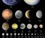
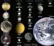
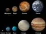

# despace
> 2021.05.21 [🚀](../index/index.md) [despace](index.md)

|Navigation|
|:--|
|**[FAQ](faq.md)**【**[SCS](scs.md)**·КК, **[SC (OE+SGM)](sc.md)**·КА】**[CON](contact.md)·[Pers](person.md)**·Контакт, **[Ctrl](control.md)**·Упр., **[Doc](doc.md)**·Док., **[Drawing](drawing.md)**·Чертёж, **[EF](ef.md)**·ВВФ, **[Error](error.md)**·Ошибки, **[Event](event.md)**·События, **[FS](fs.md)**·ТЭО, **[HF&E](hfe.md)**·Эрго., **[KT](kt.md)**·КТ, **[N&B](nnb.md)**·БНО, **[Project](project.md)**·Проект, **[QM](qm.md)**·БКНР, **[R&D](rnd.md)**·НИОКР, **[SI](si.md)**·СИ, **[Test](test.md)**·ЭО, **[TRL](trl.md)**·УГТ, **[Way](way.md)**·Пути|

[TOC]

---

The **universe** is all of space, time & their contents, incl. planets, stars, galaxies, & all other forms of matter & energy.

   - [Apparent magnitude](app_mag.md)
   - [Blue Marble](earth.md)・ [Pale Blue Dot](earth.md)・ [Point Nemo](earth.md)・ [Silver Snoopy award](silver_snoopy_award.md)
   - [Cosmic rays](ion_rad.md)
   - [Ecliptic](ecliptic.md)
   - [Escape velocity](esc_vel.md)
   - [Hill sphere](hill_sphere.md)
   - [Information](info.md)
   - [Lagrangian points](l_points.md)
   - [Near space](near_space.md)
   - [Parallax](parallax.md)
   - [Solar constant](solar_const.md)
   - [Solar day](solar_day.md)
   - [Spacecraft (SC)](sc.md)・ [Spacecraft system (SCS)](scs.md)
   - [Stars & planets](aob.md)
   - [Stellar classification](aob.md)
   - [Terminator](terminator.md)
   - [Time](time.md)・ [Timezones](time.md)
   - [Wormhole](wormhole.md)
   - **Distant objects** — [Betelgeuse](betelgeuse.md)・ [Sirius](sirius.md)
   - **Manned** — [Health](health.md)
   - **Solar system** — [Sun](sun.md) & others — [Ceres](ceres.md)・ [Eris](eris.md)・ [Haumea](haumea.md)・ [Makemake](makemake.md)・ [Nibiru](nibiru.md)・ [Planet 9](planet_9.md)・ [Pluto](pluto.md)・ [Sedna](sedna.md)
      1. [Mercury](mercury.md)
      1. [Venus](venus.md)
      1. [Earth](earth.md) & satellite — [Moon](moon.md)
      1. [Mars](mars.md) & satellites — [Deimos](deimos.md)・ [Phobos](phobos.md)
      1. [Jupiter](jupiter.md) & satellites — [Europa](europa.md)・ [Ganymede](ganymede.md)・ [Io](io.md)・ [Callisto](callisto.md)・ 63 smaller ones
      1. [Saturn](saturn.md) & satellites — [Enceladus](enceladus.md)・ [Iapetus](iapetus.md)・ [Rhea](rhea.md)・ [Titan](titan.md)・ 59 smaller ones
      1. [Uranus](uranus.md) & satellites — [Ariel](ariel.md)・ [Oberon](oberon.md)・ [Titania](titania.md)・ [Umbriel](umbriel.md)・ 23 smaller ones
      1. [Neptune](neptune.md) & satellites — [Nereid](nereid.md)・ [Proteus](proteus.md)・ [Triton](triton.md)・ 11 smaller ones

|  |
|:--|
|**【[Space](index.md)】**  [Apparent magnitude](app_mag.md)・ [Astro.object](aob.md)・ [Blue Marble](earth.md)・ [Cosmic rays](ion_rad.md)・ [Ecliptic](ecliptic.md)・ [Escape velocity](esc_vel.md)・ [Health](health.md)・ [Hill sphere](hill_sphere.md)・ [Information](info.md)・ [Lagrangian points](l_points.md)・ [Near space](near_space.md)・ [Pale Blue Dot](earth.md)・ [Parallax](parallax.md)・ [Point Nemo](earth.md)・ [Silver Snoopy award](silver_snoopy_award.md)・ [Solar constant](solar_const.md)・ [Terminator](terminator.md)・ [Time](time.md)・ [Wormhole](wormhole.md) ┊ ··•·· **Solar system:** [Ariel](ariel.md)・ [Callisto](callisto.md)・ [Ceres](ceres.md)・ [Deimos](deimos.md)・ [Earth](earth.md)・ [Enceladus](enceladus.md)・ [Eris](eris.md)・ [Europa](europa.md)・ [Ganymede](ganymede.md)・ [Haumea](haumea.md)・ [Iapetus](iapetus.md)・ [Io](io.md)・ [Jupiter](jupiter.md)・ [Makemake](makemake.md)・ [Mars](mars.md)・ [Mercury](mercury.md)・ [Moon](moon.md)・ [Neptune](neptune.md)・ [Nereid](nereid.md)・ [Nibiru](nibiru.md)・ [Oberon](oberon.md)・ [Phobos](phobos.md)・ [Pluto](pluto.md)・ [Proteus](proteus.md)・ [Rhea](rhea.md)・ [Saturn](saturn.md)・ [Sedna](sedna.md)・ [Solar day](solar_day.md)・ [Sun](sun.md)・ [Titan](titan.md)・ [Titania](titania.md)・ [Triton](triton.md)・ [Umbriel](umbriel.md)・ [Uranus](uranus.md)・ [Venus](venus.md)|

 

## Glossary

Here is the common terminology & abbreviation for the space sector with the EN‑RU conversions. There are almost no abbreviations for [organizations](contact.md), payload & terms within a single project. Marks:

   - An approximate number of EN‑RU terms: **1 174** × 2. *(Note. How to count = a number of lines − 49 − 27×9)*
   - ≈ terms are partial equivalents, use with caution;
   - ↔ just literal translation with no matches.

<small>

| |*En*|*Ru*|
|:--|:--|:--|
|**°**|**3-DOF** — three‑degrees of freedom| |
| |**[5D optical data storage](ds.md)**|≠ 5‑мерное хранилище информации|
| |**6-DOF** — six‑degrees of freedom| |
|**A**|**[A‑Team](jpl_if.md)**|≠ Команда А|
| |**ACS** — [attitude control system](acs.md)| |
| |**[Ad hoc](ad_hoc.md)**|Специально для этого|
| |**ADCS** — attitude determination & control system| |
| |**ADRA** — [archives, development, research, administration](adra.md)|≠ **ХРИП** — хранение, разработка, исследования, планирование|
| |**AIT** — assembly, integration, testing|≠ Сборка, интеграция, отработка|
| |**AIV** — assembly, integration, validation|≠ Сборка, интеграция, проверка|
| |**AMBR** — [advanced material bipropellant rocket](engine_lst.md)|≠ **AMBR** — двухкомпонентный двигатель из передовых материалов|
| |**ASAP** — as soon as possible|≠ Как можно скорее|
| |**ASP** — [Ames stereo pipeline](ames_stereo_pipeline.md)|≠ Стереотруба центра Эймса|
| |**Atmosphere**|Атмосфера|
| |**AVEC** — [APL’s Venus environment chamber](avec.md)|≠ **АВЕК** — камера условий на Венере Лаборатории прикладной физики|
|**B**|**BBM** — broadband mode|**ШР** — широкополосный режим|
| |**[Blender](blender.md)**|Блендер|
| |**[Blue paper](colour_papers.md)**|Синяя книга|
|**C**|**[C](c.md)**|Си|
| |**CCSDS** — [consultative committee for space data systems](ccsds.md)|≠ **CCSDS** — международный Консультативный Комитет по космическим системам передачи данных|
| |**CDF** — concurrent desigh facility|**[НИР](rnd_0.md)** в [ESA](contact/esa.md)|
| |**C&DH** — [command & data handling](c_n_dh.md)|≈ **БКУ** — бортовой комплекс управления|
| |**CDR** — critical design review|≠ Критическое рассмотрение проекта|
| |**CDSN** — [Chinese deep space network](cdsn.md)|≠ **ДКСК** — сеть дальней космической связи Китая|
| |**CEO** — [chief executive officer](mgmt.md)|Генеральный директор|
| |**CET** — [central European time](time.md)|Средне‑европейское время. MSK+1 летом, MSK+2 зимой|
| |**[Change notice](ch_notice.md)**|Журнал изменений|
| |**CML** — [concept maturity levels](cml.md)|**УЗК** — уровни зрелости концепта|
| |**CONOPS** — [concept of operations](conops.md)|Концепция эксплуатации|
| |**Cold gas**|Азот|
| |**COO** — [chief operating officer](mgmt.md)|Главный инженер|
| |**[Cosmographia](cosmographia.md)**|≠ Космография|
| |**[COSPAR ID / International designator / NSSDC ID](spaceid.md)**|Номер полёта|
| |**CTO** — [chief technical officer](mgmt.md)|Главный инженер; технический директор|
|**D**|**DEM** — [digital elevation model](drawing.md)|≠ **ЦМР** — цифровая модель рельефа|
| |**[Don’t Panic!](faq.md)**|≠ Без паники|
| |**[DOORS](doors.md)**|≠ ДОРС|
| |**DR** — [design review](design_review.md)|≠ Проверка проекта|
| |**DSG** — [deep space gateway](deep_space_gateway.md)|≠ **ВГК** — ворота глубокого космоса|
| |**DSN** — [NASA deep space network](dsn.md)|≠ **ДКСН** — сеть дальней космической связи НАСА|
| |・**[Dragon](dragon.md)**|≠ Дракон|
|**E**|**EB** — [electric battery](eb.md)|**ХИТ** — химический источник тока|
| |**ECSS** — European cooperation for space standardization| |
| |**EDLS** — entry, descent & landing system| |
| |**[Elevator pitch/speech](elevator_pitch.md)**|Презентация для лифта|
| |**EMI** — [electromagnetic interference](emi.md)|Помехи|
| |**EOM** — end of mission| |
| |**ESA** — [European Space Agency](contact/esa.md)|**ЕКА** — Европейское космическое агентство|
| |**ESOC** — European space operations centre| |
| |**ESTRACK** — [European space tracking network](estrack.md)|≠ Европейская сеть космического слежения|
| |**EVT** — Engineering validation test| |
| |・**[EnVision](envision.md)**|≠ **ЭнВижен**|
|**F**|**FDIR** — fault detection, isolation & recovery| |
| |**FIT** — [failures in time](qm.md)| |
| |**[Flagship Mission](fs.md)**|Флагманская миссия|
| |**[Flight unit](flight_unit.md)**|≠ **ШИ** — штатное изделие;  **ШО** — штатный образец|
| |**FLPP** — [future launchers preparatory programme](flpp.md)|≠ **ПРПУ** — программа разработки перспективных пусковых установок|
| |**FR** — [frequency reuse](comms.md)|= Повторное использование частот|
| |**FSS** — [fixed‑satellite service](sc.md)|= **ФСС** — фиксированная спутниковая служба|
| |**FTA** — fault tree analysis| |
|**G**|**g** — [gravitational acceleration](g.md)|Ускорение свободного падения|
| |**GEER** — [Glenn extreme environment eig](geer.md)|≠ **ГИИР** — устройство для экстремальных условий Гленна|
| |**GIMP** — [GNU image manipulation program](gimp.md)|≠ **Гимп** — программа для манипулирования изображениями от ГНУ|
| |**[Git](git.md)**|≠ Гит|
| |**[Green paper](colour_papers.md)**|Зелёная книга|
|**H**|**[Heat capacity ratio](heat_cr.md)**|Показатель адиабаты|
| |**HiPAT** — [high performance liquid apogee thruster](engine_lst.md)|≠ **ВЖАД** — высокопроизводительный жидкостной апогейный двигатель|
| |**Hmel** — [base unit of opponent filtration](si.md))|≠ **Хмель** — единица фильтрации оппонента|
| |**HP** — [heat pipe](hp.md)|**АТТ** — аксиальная тепловая труба|
| |**HTAE** — [high thrust apogee engine](htae.md)|≠ **АДВТ** — апогейный двигатель с высокой тягой;  ≈ Here, there, & everywhere (песня Beatles)|
| |**HTPB** — [hydroxyl-terminated polybutadiene](ps.md)|**ПКГГ** — полибутадиен с концевыми гидроксильными группами|
| |**HSI** — Human Systems Integration| |
| |**HTS** — [high-throughput satellite](sc.md)|≠ **ВПС** — высокопроизводительный спутник|
|**I**|**I/F** — [interface](interface.md)| |
| |**ICD** — [interface control document](interface.md)| |
| |**IDSN** — [Indian deep space network](idsn.md)|≠ **ДКСИ** — сеть дальней космической связи Индии|
| |**IRD** — [interface requirement document](interface.md)| |
| |**[Ing](ing.md)**|**ИПТ** — импульс последействия|
| |**[International designator / NSSDC ID / COSPAR ID](spaceid.md)**|Номер полёта|
| |**ISBN** — [international standard book number](isbn.md)|Международный стандартный книжный номер|
| |**ISIS** — [information storage & retrieval systems](isis.md)| |
| |**ISRU** — [in‑situ resource utilization](isru.md)|≠ Использование местных ресурсов|
| |**ITAR** — [international traffic in arms regulations](itar.md)|≠ Правила международной торговли оружием|
|**J**|**JPL IF** — [JPL Innovation Foundry](jpl_if.md)|≠ Инновационный цех JPL|
| |**JT** — [jupiter tessellation](cad_f.md)| |
|**L**|**LDO** — [Leonardo](leonardo.md)| |
| |**LEOP** — launch & early orbit phase| |
| |**LOC** — local organization comitee|≠ Местный организационный комитет|
| |**LPR** — [liquid-propellant rocket / liquid rocket](ps.md)|**ЖРД** — жидкостный ракетный двигатель|
| |**LPRP** — [Lunar precursor robotic program](lprp.md)|≠ Предварительная программа по изучению Луны автоматами|
| |**LPRS** — liquid-propellant rocket propulsion system / liquid rocket propulsion system|**ЖРДУ** — жидкостная ракетная двигательная установка|
|**M**|**MAIT** — manufacturing, assembly, integration, testing|≠ Производство, сборка, интеграция, отработка|
| |**MBSE** — [model based systems engineering](se.md)|Системное проектирование на основе моделей|
| |**MCC** — [mission control center](scs.md)|**ЦУП** — центр управления полётами|
| |**[MIL-STD-1553](mil_std_1553.md)**|**МКИО** — мультиплексный канал информационного обмена;  **МКО** — мультиплексный канал обмена|
| |**[Mission proposal](proposal.md)**|≠ Предложение миссии|
| |**MML** — [modeling maturity mevels](mml.md)|**УЗУ** — уровни зрелости управления|
| |**MOC** — [mission operation center](scs.md)|**ЦУП** — центр управления полётами|
| |**MOE** — measures of effectiveness| |
| |**MOP** — measures of performance| |
| |**MRD** — [mission requirements document](mrd.md)| |
| |・**[MarCO](marco.md)**|≠ **МарКО**|
| |・**MCO** — [Mars climate orbiter](mars_climate_orbiter.md)|≠ **МКО** — Марс климат орбитер|
| |・**MGS** — [Mars global surveyor](mars_global_surveyor.md)|≠ **МГС** — Марс глобал сервейор|
| |・**MCSB** — [modular common spacecraft bus](mcsb.md)|≠ **КПОН** — космическая платформа общего назначения|
| |・**[MetNet](metnet.md)**|≠ **МетСеть**|
|**N**|**NASA PSL** — [NASA Parts Selection List](nasa_psl.md)|≠ Список NASA по выбору составных частей|
| |**NER** — nuclear electric rocket|**ЯЭДУ** — ядерная электродвигательная установка|
| |**NFPA 704** ​— [standard system for the identification of the hazards of materials for emergency response](nfpa_704.md)​ ​|Стандарт по определению степени опасности материалов ​|
| |**NGO** ​— [need, goals, objectives](rnd.md)|≠ НГО ​— цель, вопросы, задачи|
| |**NGT** ​— [NeoGeography Toolkit](neogeography_toolkit.md)|≠ НеоГеографический набор инструментов|
| |**NIAC** ​— [NASA Innovative Advanced Concepts](niac_program.md)|≠ **НИАК** ​— Инновационные передовые концепты НАСА|
| |**NICM** ​— [NASA Instrument Cost Model](nicm.md)|≠ Модель стоимость инструментов НАСА|
| |**NMLO** — NASA Moscow liaison office| |
| |**NR** — [nuclear reactor](nr.md)|**ЯР** — ядерный реактор|
| |**[NSSDC ID / COSPAR ID / International designator](spaceid.md)**|Номер полёта|
| |**NTR** — [nuclear thermal rocket](ps.md)|**ЯРДУ** — ядерная ракетная двигательная установка|
| |**NTRS** ​— [NASA Technical Reports Server](nasa_sti.md)|≠ **СТОН** ​— сервер технических отчётов НАСА|
| |**NX** — [Siemens NX](nx.md) (CAD/CAM/CAE‑system)| |
| |・**[Nautilus-X](nautilus_x.md)**|≠ Наутилус‑Икс|
|**O**|**[GNU Octave](gnu_octave.md)**|≠ ГНУ Октава|
|**P**|**P.Eng** — professional engineer|Профессиональный инженер|
| |**[Paper size](si.md)**|Формат бумаги|
| |**PC** — [primary cell](eb.md)|**ХИТ** — химический источник тока|
| |**PDD** — [payload definition document](pdd.md)| |
| |**PDF** — [portable document format](pdf.md)| |
| |**PDR** — preliminary design review|≠ **PDR** — предварительное рассмотрение проекта|
| |**PhSR** — Phobos sample return| |
| |**PI** — [principal investigator](principal_investigator.md)|≠ Ответственный исследователь|
| |**PL** — [product lifecycle](pl.md) (see PLM)|**ЖЦИ** — жизненный цикл изделия|
| |**PLM** — product lifecycle management| |
| |**PNT** — positioning, navigation, & timing|≠ Позиционирование, навигация и синхронизация |
| |**PPD** — [planetary protection document](ppd.md)| |
| |**PSDS** — [Planetary Science Decadal Survey](us_psds.md)|≠ Десятилетний обзор планетарной науки|
| |**[Python](python.md)**|Питон|
|**R**|**[R](r.md)**|≠ **R**|
| |**RFI** — [radio frequency interference](emi.md)|Помехи|
|**S**|**SAR** — [synthetic-aperture radar](cam.md)|**РСА** — радар с синтезированной апертурой|
| |**SciRD** — [science requirements document](scird.md)| |
| |**SCN** — [satellite catalog number](spaceid.md)|Номер по спутниковому каталогу|
| |**SE** — [systems engineering](se.md)|**СИ** —  системная инженерия|
| |**[SpaceID](spaceid.md)**|Идентификатор космического объекта|
| |**SPICE** — [spacecraft planet instrument C‑matrix events](spice.md)|≠ Космический аппарат, планета, прибор, ориентация, события|
| |**SRRQ** — [safety, reliability, risk, quality](qm.md)|≠ Безопасность, надёжность, риск, качество|
| |**SSC GGSN** — [Swedish Space Corporation’s global ground station network](ssc_ggsn.md)|Глобальная сеть наземных станций Шведской Космической Корпорации|
| |**SSME** — [Space Shuttle main engine](engine_lst.md)|Главный двигатель космического челнока, он же двигатель RS-25|
| |**SSR** — [solid state recorder](ds_lst.md)|Твердотельное записывающее устройство|
| |**STEM** — [science, technology, engineering, & mathematics](stem.md)|≠ **НТИМ** — наука, технология, инженерия и математика|
| |**STEP** — [standard for exchange of product model data](cad_f.md)|Стандарт обмена данными модели изделия|
| |**STI** — [scientific & technical information program](nasa_sti.md)|≠ **ПНТИ** — программа научной и технической информации|
| |**STL** — [Systems Tool Kit](stk.md)|≠ **СТЛ** — набор системных инструментов|
| |**SUEM** — spin‑up & eject mechanism|≠ Механизм закрутки и отделения|
| |**SVT** — system validation & testing| |
| |**SysML** — [Systems Modeling Language](sysml.md)|Язык моделирования систем|
| |・**[Shukrayaan-1](shukrayaan_1.md)**|≠ **Шакраян‑1**|
|**T**|**TALOS** — [thruster advancement for low‑temperature operation in space](talos.md)|≠ **ТАЛОС** — улучшения двигателей для низкотемпературной работы в космосе|
| |**TBA** — to be announced|≠ Требуется объявить|
| |**TBC** — to be confirmed​|≠ Требуется подтвердить|
| |**TBD** — to be determined|≠ Требуется определить|
| |**[Team X](jpl_if.md)**|≠ Команда Икс|
| |**[Teamcenter](teamcenter.md)** (PLM‑система)|≠ Тимцентр|
| |**[Tennis racket theorem](tr_theorem.md), Dzhanibekov effect**|Эффект Джанибекова|
| |**Timescale / [Timeline](timeline.md)**|**ШВ** — шкала времени|
| |**TMI** — [trans‑Mars injection](nnb.md#tmi)|Выход на орбиту Марса|
| |**TPM** — technical performance measures| |
| |**[Tradespace](tradespace.md)**|Определение границ|
| |**TTC, TT&C** — telemetry tracking command| |
|**U**|**UDSC** — [Usuda deep space center](udsc.md)|≠ **ДКСУ** — центр дальней космической связи Усуда|
| |**USFDD** — unified system for design documentation|≠ **ЕСКД** — [единая система конструкторской документации](eskd.md)|
| |**USFPD** — unified system for program socumentation|≠ **ЕСПД** — [единая система программной документации](espd.md)|
| |**USOTD** — unified system of technological documentation|≠ **ЕСТД** — [единая система технологической документации](estd.md)|
| |**USOTPP** — unified system of technological preparation of production|≠ **ЕСТПП** — [единая система технологической подготовки производства](estpp.md)|
|**V**|**[V‑model](v_model.md), Systems engineering V**|≠ Ви-модель|
| |**V&V** — [verification & validation](vnv.md)|Верификация и валидация|
| |**[Venus](venus.md)**|Венера|
| |・**VFM** — [Venus Flagship Mission](venus_flagship_mission.md)|≠ **ВФМ** — венерианская флагманская миссия|
| |・**VME** — [Venus Mobile Explorer](venus_mobile_explorer.md)|≠ **ВМИ** — венерианский мобильный исследователь|
| |・**VOS** — [Venus Observing System](venus_observing_system.md)|≠ **ВОС** — венерианская обзорная система|
| |・**[Voyager](voyager.md)**|≠ **Вояджер**|
| |・**VSRM** — [Venus Sample Return Mission](venus_sample_return_mission.md)|≠ **ВМВГ** — венерианская миссия по возврату грунта|
|**W**|**Warm gas**|Тёплый газ. 2‑компонентный газовый двигатель|
| |**WBS** — [work breakdown structure](plan.md)|≠ **ЕСП** — единый сквозной план|
| |**[White paper](colour_papers.md)**|Белая книга|
|**X**|**XRF** — [X‑ray fluorescence](xrf.md)|**РФА** — рентгенофлуоресцентный анализ|
| |・**[Xcraft](xcraft.md)**|≠ **Икскрафт**|
|**Y**|**YARUD** — yet another rapid unscheduled disassembly|≠ **ПОБНР** — очередная быстрая незапланированная разборка|
| |**[Yellow paper](colour_papers.md)**|Жёлтая книга|
|**Z**|**ZTJ** — 3rd Generation Triple-Junction [solar cell](sp.md)|≠ **МСЭ** — 3‑е поколение трёхкаскадных солнечных элементов|

</small>

 

## А,Б,В,Г,Д

<small>

| |*Ru*|*En*|
|:--|:--|:--|
|**А**|**АБ** — [аккумуляторная батарея](eb.md)|**RB** — rechargeable battery / storage battery / secondary cell / accumulator|
| |**АВПКО** — [анализ видов, последствий и критичности отказов](fmeca.md)|**FMECA** — failure modes effects criticality analysis|
| |**АВПО** — [анализ видов и последствий отказов](fmeca.md)|**FMECA** — failure modes effects criticality analysis|
| |**АВН** — [авторский надзор](des_spv.md)|Designer’s supervision|
| |**АД** — [астродатчик](sensor.md)|**ST** — star tracker|
| |**АЕ** — [астрономическая единица](si.md)|**AU** — astronomical unit|
| |**АИ** — [автономные испытания](аи.md)|Component test|
| |**АКА** — [автоматический космический аппарат](sc.md)|**SC** — spacecraft|
| |**АКС** — [авиационно‑космическая система](sc.md)|Aerospace system|
| |**[Альбедо](albedo.md)**|Albedo|
| |**[АМг6](aluminium.md)**|AMg6|
| |**[Аналог](analogue.md)**|Analogue|
| |**[Антенна](antenna.md)**|Antenna|
| |**АОБ** — [астрономический объект](aob.md)|**AOB** — Astronomical object / Celestial object|
| |**АОЛС** — [атмосферная оптическая линия связи](fso.md)|**FSO** — [free‑space optics](fso.md)|
| |**АП** — [техническое предложение (аванпроект)](rnd_ap.md)|Phase A|
| |**[Апоцентр](apopericentre.md)**|Apocenter|
| |**АПС** — [аппаратные и программные средства](hns.md)|**H&S** — hardware & software|
| |**АРМ** — автоматизированное рабочее место|≠ Computer workstation|
| |**АРН** — аппаратура радионавигации|≠ **RNU** — radionavigation unit|
| |**АС** — антенная система|**ANSM** — antenna system|
| |**АСВ** — [адаптация средств выведения](асв.md)|≠ **LVA** — launch vehicle adaptation|
| |**АСКИД** — автоматизированная система контроля исполнения документации|≠ Automated workflow control system|
| |**АСН** — [автономная система навигации](ans.md)|**ANS** — autonomous navigation system|
| |**[Астрономический период](astroperiod.md)**|Astronomical period|
| |**АСУ** — автоматические системы управления|**A/PS** — autopilot system|
| |**АСУП** — автоматизированная система управления полётом|**FCS** — flight control system|
| |**АСЭС** — автоматизированная система электронного согласования договорных документов|≠ Automated contract approval system|
| |**АТ** — [азотный тетраоксид](nto.md)|**NTO** — dinitrogen tetroxide / nitrogen tetroxide|
| |┕|≈ **MON** — mixed oxides of nitrogen|
| |**АТ + НДМГ** — [азотный тетраоксид и несимметричный диметил гидразин](nto_plus.md)|**NTO + UDMH** — dinitrogen tetroxide + unsymmetrical dimethylhydrazine|
| |**АФС** — [антенно‑фидерная система](afdev.md)|**AFDEV** — antenna feeder device|
| |**АФУ** — [антенно‑фидерное устройство](afdev.md) (see [Радиосвязь](comms.md))|**AFDEV** — antenna feeder device|
| |**АЦП** — аналого‑цифровой преобразователь|**ADC** — analog‑to‑digital converter|
| |・**[Аракс](araks.md)** (…)|≠ **Araks** (…)|
| |・**[Арктика‑М](арктика_м.md)** (…)|≠ **Arktika-M** (…)|
|**Б**|**БА** — [бортовая аппаратура](sc.md)|**OE** — onboard equipment|
| |**БА КИС** — [бортовая аппаратура командно‑измерительной системы](comms.md)|≠ **C&MSOE** — command & measurement system onboard equipment|
| |**БАК** — [блок автоматики и коммутации](eas.md)|≠ **ACUC** — commutation & automatic control unit|
| |**[Балансовая комиссия](outccom.md)**|≠ Outcomes commission|
| |**БАППТ** — [блок автоматики и подрыва пиротехники](eas.md)|≠ **ACUP** — pyrotechnics & automatic control unit|
| |**БАС** — [блок автоматики и стабилизации](eas.md)|≠ **ACUER** — electric regulation & automatic control unit|
| |**БВК** — [бортовой вычислительный комплекс](obc.md)|Computer|
| |**БВС** — бортовая вычислительная сеть|≠ **OBCN** — onboard computer network|
| |**БДПТ** — бесконтактный двигатель постоянного тока|≠ **NCDCM** — noncontacting direct current motor|
| |**[Безопасность](qm.md)**|Safety|
| |**[Бережливое производство](lean_man.md)**|Lean manufacturing / Lean production|
| |**БИБ** —[ бесплатформенный инерциальный блок](iu.md)|≠ **SDIRU** — strap down inertial reference unit|
| |**БИВК** — [бортовой информационный вычислительный комплекс](obc.md)|Computer|
| |**БИК** — бортовой измерительный комплекс|≠ Onboard measuring complex|
| |**БИУС** — блок измерения угловых скоростей|≠ Rotation sensing unit|
| |**БКН** — блок коммутации нагревателей|≠ Heater switch unit|
| |**БКНА** — [бортовой комплекс научной аппаратуры](sc.md)|**PL** — payload|
| |**БКС** — [бортовая кабельная сеть](cable.md)|[Cables](cable.md)|
| |**БКУ** — [бортовой комплекс управления](cable.md)|≈ **GNC** — [guidance, navigation, control](gnc.md)|
| |**БМСВ** — быстрый монитор солнечного ветра|≠ Fast solar wind monitor|
| |**БМСС** — базовый модуль служебных систем|≠ **HKSBM** — housekeeping systems base module|
| |**БНО** — [баллистико‑навигационное обеспечение](nnb.md)|Navigation & ballistics|
| |**БОКЗ** — [блок определения координат звёзд](sensor.md)|**ST** — star tracker|
| |**[Болото](swamp.md)**|Swamp|
| |**[Бритва Оккама](faq.md)**|Occam’s razor|
| |**БОС** — базовая операционная система|**BOS** — basic operating system|
| |**БРД** — блок ретрансляции данных|Retransmission unit|
| |**БРК** — [бортовой радиокомплекс](comms.md)|[Communications / Comms](comms.md)|
| |**[БРКЗ](nrs.md)** — безракетный космический запуск|**NRS** — non‑rocket spacelaunch|
| |**БРС** — [бортовые системы](sc.md)|**OE** — onboard equipment|
| |**БРСП** — блок распределения силового питания|≠ **PSDU** — power supply distribution unit|
| |**БРТК** — [бортовой радиотехнический комплекс](comms.md)|[Communications / Comms](comms.md)|
| |**БС** — [батарея солнечная](sp.md)|**SP** — solar panel|
| |**БСК** — базовая система координат|**BCNS** — base coordinate system|
| |**БССД** — бортовая система сбора данных|**ADAC** — airborne data acquisition system|
| |**БССК** — базовая строительная система координат|**BSCS** — base structural coordinate system|
| |**БСР** — блок системы регистрации|≠ Recording system unit|
| |**БУ** — [блок управления](sp.md)|**CM** — control module|
| |**БУНИ** — [блок управления научной информацией](eas.md)|≠ **SDCM** — scientific data control module|
| |**БУст** — [буровая установка](sss.md)|**DR** — drilling rig|
| |**БУС** — блок усилителя сигнала|≠ **SAMM** — signal amplifier module|
| |**БФ** — [батарея фотоэлектрическая](sp.md)|**SC** — solar cell|
| |**БФК** — блок формирования кодов|≠ **CSHU** — code shaping unit|
| |**БЦ** — [баллистический центр](scs.md)|**BAC** — ballistic analysis center|
| |**БЦВМ** — [бортовая цифровая вычислительная машина](obc.md)|Computer|
| |**БЦВК** — [бортовой центральный вычислительный комплекс](obc.md)|Computer|
| |**БШВ** — [бортовая шкала времении](time.md)|≠ Onboard timescale / Onboard timeline|
| |**БЭ** — блок электроники|**ELMO** — electronics module|
| |**БЭК** — [безэховая камера](ach.md)|**ACH** — anechoic chamber|
| |**БЭКГ** — [безэховая газовая камера](ach.md)|**ACHG** — anechoic gas chamber|
|**В**|**ВА** — возвращаемый аппарат (see [СхД](drawing.md))|**REVE** — reentry vehicle / return vehicle|
| |**[ВБР](qm.md)** — вероятность безотказной работы|Reliability|
| |**ВБУ КТ** — [внутрибаковое устройство капиллярного типа](cinu.md)|≠ **CITD** — capillary innertank device|
| |**ВВТ** — вооружение и военная техника|≠ **WAMEQ** — weapons & military equipment|
| |**ВВФ** — [внешние воздействующие факторы](ef.md)|**EF** — external factors|
| |**ВГ** — [ветрогенератор](wt.md)|**WT** — wind turbine|
| |**ВГГИ** — выборка из гелиогеофизической информации|≠ **HPDSE** — heliophysical data selection|
| |**ВГКС** — высокоэллиптическая гидрометеорологическая космическая система|≠ **HEHMSS** — high‑elliptical hydrometeorological space system|
| |**ВД** — [видимый диапазон](comms.md)|**VS** — visible spectrum|
| |**ВЕД** — [ведомость документации](liod.md)|≠ **LIOD** — list of documentation|
| |**[Ведомство](agency.md)**|≈ Agency|
| |**[Вето](veto.md)**|Veto|
| |**ВДМ** — [вибродинамическая модель](drawing.md)|≠ Vibrodynamic model|
| |**ВЗВ** — [видимая звёздная величина](app_mag.md)|Apparent magnitude|
| |**ВЗЧ** — [высокоэнергетичные заряженные частицы](ion_rad.md)|**HECP** — high‑energy charged particles|
| |**ВИ** — видео информация|**VIN** — video information|
| |**ВИРК** — [высокоинформативный радиокомплекс](comms.md)|≠ **HIRC** — high‑informative radiocomplex|
| |**ВИС** — ведомая измерительная система|≠ **GMRS** — guided measurement system|
| |**ВК** — входной контроль|**II** — incoming inspection|
| |**ВКИ** — выдача корректирующего импульса|**DVMA** — delta‑velocity maneuver|
| |**ВНС** — внешний сигнал|**EXS** — external signal|
| |**ВОГ** — [волоконно‑оптический гироскоп](iu.md)|**FOG** — fibre optic gyroscope|
| |**ВОЛП** — [волоконно‑оптическая линия передачи](ofts.md)|**OFTS** — optical fiber transmission system|
| |**ВОЛС** — [волоконно‑оптическая линия связи](ofts.md)|**OFTS** — optical fiber transmission system|
| |**ВП** — [военное представительство](contact/milro.md)|**MILRO** — military representative office|
| |**ВП МО РФ** — [военное представительство](contact/milro.md) министерства обороны РФ|≠ **MODR MILRO** — Ministry of Defence of the Russian Federation military representative office|
| |**ВПЗУ** — воспроизведение [запоминающегося устройства](ds.md)|≠ **DSPB** — data storage playback|
| |**[Временные зоны](time.md)**|Timezones|
| |**[Время](time.md)**|Time|
| |**ВРЛ** — [высокоинформативная радиолиния](comms.md)|≠ **HIRL** — high‑informative radioline|
| |**ВС** — вооружённые силы|Military / Armed force|
| |**ВСИ** — вибростатические испытания|≠ **VST** — vibrostatic test|
| |**ВСК** — визирная система координат|≠ **SCNS** — sight coordinate system|
| |**ВСОТР** — внешние средства обеспечения теплового режима|≠ **XTCS** — external thermal control system|
| |**ВСЧОКР** — [ведомость СЧ ОКР](lordsac.md)|≠ **LORDSAC** — list of R&D systems & components|
| |**ВТ** — [военная техника](milh.md)|**MILH** — military hardware|
| |**ВУ** — [внешние условия](ef.md)|External conditions|
| |**ВФ** — вредные факторы|≠ **HFF** — harmful factors|
| |**ВЦДКС** — восточный центр дальней космической связи|**ECDSC** — East Center for Deep Space Communications|
| |**[Выводимая масса](throw_weight.md)**|Throw‑weight|
| |**Выходная мощность**|Radiated power|
| |**ВЭД** — ведомость эксплуатационной документации|≠ **LOOI** — list of operating instructions|
| |**ВЭП** — [высокоэнергетические протоны](ion_rad.md)|**FPT** — fast protons|
| |**ВЭПР** — [ведомость эскизного проекта](lordsac.md)|≠ **LOPB** — list of phase B documents|
| |**ВЭО** — [высокая эллиптическая орбита](nnb.md)|**HEO** — highly elliptical orbit|
| |**ВЭУ** — [ветроэлектрическая установка / ветрогенератор](wt.md)|**WT** — wind turbine|
| |・**[ВГВ](hptc_vgv.md)** (…)|≠ **VGV** (…)|
| |・**[Венера‑Д](venera_d.md)** (…)|**Venera-D** (…)|
|**Г**|**ГБ** — [головной блок](lv.md)|≠ **SHU** — space head unit|
| |**ГБРД** — [гибридный ракетный двигатель](гбрд.md)|**HPL** — hybrid-propellant rocket|
| |**ГГ КК** — геостационарный гидрометеорологический космический комплекс|≠ **GSHMSS** — geostationary hydro-meteorological space system|
| |**ГГАК** — гелиогеофизический аппаратурный комплекс|≠ **GGAK** — heliogeophysical instrument complex|
| |**Гермоконтейнер**|Pressurized container|
| |**ГГИ** — гелиогеофизическая информация|≠ Heliogeophysical information|
| |**ГЗК** — [грунтозаборный комплекс](sss.md)|**SSS** — soil sampling system|
| |**ГЗУ** — [грунтозаборное устройство](sss.md)|**SSS** — soil sampling system|
| |**[Гиродин](iu.md)**|**CMG** — control moment gyroscope|
| |**[Гироскоп](iu.md)**|**Gyroscope** / **IMU** — inertial measurement unit|
| |**[Гиростабилизатор](iu.md)**|**IMU** — inertial measurement unit|
| |**ГИВУС** — [гироскопический измеритель вектора угловой скорости](iu.md)|**ARS** — angular rate sensor|
| |**ГИС** — главная измерительная система|≠ **MAMS** — major measurement system|
| |**ГК** — генеральный конструктор|≠ General designer|
| |**ГК, ГСК** — [государственный контракт](contract.md)|Public contract|
| |**ГКЛ** — [галактические космические лучи](ion_rad.md)|**GCR** — galactic cosmic rays|
| |**ГКНПЦ** — государственный космический научно‑производственный центр|≠ **SRPSC** — state research & production space center|
| |**ГКП** — [главный конструктор проекта](mgmt.md)|≠ Project’s chief designer|
| |**ГЛК** — [главный конструктор](mgmt.md)|≠ Chief designer|
| |**ГЛОНАСС** — глобальная навигационная спутниковая система|**GLONASS** — global navigation satellite system|
| |**ГММ** — габаритно‑массовый макет|≠ **MADM** — mass-dimensional model|
| |**[ГНИО](hrorsi.md)**|≠ **HRORSI** — head research organization of the Russian space industry|
| |**ГНИО РКП** — [головная научно‑исследовательская организация российской космической промышленности](hrorsi.md)|≠ **HRORSI** — head research organization of the Russian space industry|
| |**ГНСС** — глобальная навигационная спутниковая система|**GNSS** — global navigation satellite system|
| |**ГО** — [головной обтекатель](lv.md)|**PLF** — payload fairing / fairing|
| |┕|≈ **NC** — nose cone|
| |**ГОГУ** — [главная оперативная группа управления](hotg.md)|≠ **HOTG** — head operational task group|
| |**ГОСИ** — головная организация по системе информации|≠ **HOIS** — head organization of information system|
| |**ГОСТ** — государственный стандарт|**GOST** — Russian state standard|
| |**ГПВ** — [государственная программа вооружения](plan_sa.md)|≠ State Armament Plan|
| |**ГПИ** — головная организация‑изготовитель|≠ Lead manufacturer|
| |**ГПО** — [геопереходная орбита](nnb.md)|**GTO** — geosynchronous transfer orbit / geostationary transfer orbit|
| |**ГПР** — головная организация‑разработчик|≠ Lead designer|
| |**[Гравитационные волны](gravwave.md)**|Gravitational wave|
| |**[Гравитационный манёвр](gravass.md)**|Gravity assist / Gravity turn / Zero‑lift turn|
| |**ГРД** — [газовый ракетный двигатель](ps.md)|**CGT** — cold gas thruster|
| |**ГС** — гиростабилизация|Gyrostabilization|
| |**ГСИ** — [государственная система обеспечения единства измерений](sseum.md)|≠ **SSEUM** — state system for ensuring the uniformity of measurements|
| |**ГСО** — [геосинхронная орбита](nnb.md)|**GSO** — geosynchronous orbit|
| |**ГСО, ГСТО** — [геостационарная орбита](nnb.md)|**GEO** — geostationary orbit / geostationary Earth orbit / geosynchronous equatorial orbit)|
| |**ГСС** — Государственная система стандартизации|≠ **SSOST** — state system of standardization|
| |**ГСХ** — гарантийный срок хранения|**GSL** — guaranteed shelf life|
| |**ГТ** — [главный технолог](mgmt.md)|**CPE** — chief process engineer|
| |**[Гусь](faq.md)**|**Goose**|
| |**ГЦ ПОД** — главный центр приёма и обработки данных|≠ **HDPC** — head data processing center|
| |**ГЦО** — [геоцентрическая орбита](nnb.md)|**GCOR** — geocentric orbit|
| |**ГЧ** — [габаритный чертёж](drawing.md)|**MICD** — mechanical interface control drawing / **DIDR** — dimensional drawing|
| |**ГШ** — генератор шума|**NGE** — noise generator|
| |**ГЭЭ** — государственная экологическая экспертиза|**SECE** — state ecological expertise|
| |・**[Гамма‑400](гамма_400.md)** (…)|≠ **Gamma-400** (…)|
|**Д**|**ДАВ** — давление верхнее|**UPPR** — upper pressure|
| |**[Дальномер](doppler.md)**|Range scope|
| |**ДАН** — давление нижнее|**LOPR** — lower pressure|
| |**[Датчик](sensor.md)**|Sensor|
| |**ДБК** — [двигательный блок коррекции](ps.md)|≠ **COEA** — corrections engine assembly|
| |**ДБС** — [двигательный блок стабилизации](ps.md)|≠ **STEA** — stabilizations engine assembly|
| |**ДВУ** — долгота восходящего узла|**LOAN** — longitude of the ascending node|
| |**ДГ** — [директивный график](plan.md)|Milestones|
| |**ДДА** — датчик давления аналоговый|**ANPS** — analogue pressure sensor|
| |**ДЕК** — день качества|Quality day|
| |**ДЕК** — [дно качества](faq.md)|≠ Quantity day|
| |**ДЕМ** — делитель мощности|Power splitter|
| |**ДЗЗ** — [дистанционное зондирование Земли](eob.md)|Earth observation|
| |**ДИ** — доводочные испытания|Developmental test|
| |**ДИ, ДПИ** — дополнительные испытания|Penalty test|
| |**[Диапазоны частот](comms.md)**|**RF** — radio frequency|
| |**ДИН** — [должностная инструкция](дин.md)|Duty regulation|
| |**ДИЗВ** — [дополнительное извещение](ch_notice.md)|Additional change notice|
| |**ДИСД** — [доплеровский измеритель скорости и дальности](doppler.md)|Doppler|
| |**ДК** — [двигатель коррекции](ps.md)|≠ **CEN** — correction engine|
| |**ДКА** — дальний космический аппарат|≠ **LDSC** — long-distance spacecraft|
| |**ДМ** — [двигатель‑маховик](iu.md)|**RW** — reaction wheel|
| |**ДМВ** — [декретное московское время](time.md)|≠ Decree Moscow time|
| |**ДМТ** — [двигатель малой тяги](ps.md)|**LTEN** — low thrust engine|
| |**ДН** — [диаграмма направленности](antenna.md)|**RP** — radiation pattern / antenna pattern / far-field pattern|
| |**ДНК** — диагностический неразрушающий контроль|**NDT** — nondestructive testing|
| |**[Договор](contract.md)**|Contract|
| |**ДОК** — [дорожная карта](plan.md)|Roadmap|
| |**[Докладная](report_int.md)**|≈ Internal report|
| |**[Документ](doc.md)**|Document / Material|
| |**[Документация](doc.md)**|Documentation|
| |**[Документ планирования](plan.md)**|Plan|
| |**ДСЕ** — детали и сборочные единицы|≠ **PAAU** — parts & assembly units|
| |**ДСП** — [для служебного пользования](confident.md)|Confidential / For official use only|
| |**ДСТ** — [двигатель стабилизации](ps.md)|**STEN** — stabilization engine|
| |**ДСЭ** — длительный срок эксплуатации|≠ **LLF** — long lifetime|
| |**ДТБ** — дополнительный топливный бак|≠ Additional fuel tank|
| |**ДУ** — [двигательная установка](ps.md)|**PS** — propulsion system|
| |**ДУС** — датчик угловой скорости|**ARS** — angular rate sensor|
| |**ДУ СОЗ** — двигательная установка стабилизации, ориентации и обеспечения запуска|≠ **PSOSMS** — propulsion system for orientation, stabilization & main engines start|
| |**ДЭП** — дополнение к эскизному проекту|Phase B|
| |・**[Двина‑ТМ](двина_тм.md)** (…)|≠ **Dvina-TM** (…)|
| |・**[ДСВСД](hptc_dsvsd.md)** (…)|≠ **DSVSD** (…)|

</small>

 

## Е,Ж,З,И,К

<small>

| |*Ru*|*En*|
|:--|:--|:--|
|**З**|**[Задел](margin.md)**|Margin|
| |**[Заключение на этап ОКР](report_rndc.md)**|≠ Conclusion report for R&D phase|
| |**[Законы развития техники](td_laws.md)**|Technology derivative laws|
| |**ЗД** — [звёздный датчик](sensor.md)|**ST** — star tracker|
| |**ЗИП** — запасные части, инструменты, принадлежности|**SPRK** — spare parts kit|
| |**ЗПГ** — зона полезного груза|≠ Payload zone|
| |**[Зрение](view.md)**|View|
| |**ЗНС** — заправочная насосная станция|Propellant filling station|
| |**ЗРВ** — зона радиовидимости|**RCOZ** — radio coverage zone|
| |**ЗРУ** — зарядно‑разрядное устройство|≠ **CDCU** — charge-discharge unit|
| |**ЗС** — заправочная станция|Propellant filling station|
| |**ЗУ** — [запоминающее устройство](ds.md)|**DS** — data storage|
|**И**|**ИАЧТ** — имитатор абсолютно чёрного тела|**BBI** — black body imitator|
| |**ИБД** — имитация бурной деятельности|**HAWA** — hand‑waving|
| |**ИВК** — инструкция входного контроля|**INIM** — incoming inspection manual|
| |**ИВЭП** — источник вторичного электропитания|**SEPS** — secondary power source|
| |**ИД** — [исходные данные](init_data.md)|Initial data / Baseline information|
| |**[Изделие](unit.md)**|Unit|
| |**ИИ** — [извещение об изменении](ch_notice.md)|Change notice|
| |**ИИ КП** — [ионизирующее излучение космического пространства](ion_rad.md)|**OSIRA** — outer space ionizing radiation|
| |**ИИЗ** — [ионизирующее излучение](ion_rad.md)|**IRA** — ionizing radiation|
| |**ИИИ** — [источник ионизирующего излучения](ion_rad.md)|**IRSO** — ionizing radiation source|
| |**ИК** —  инфракрасный диапазон|**IR** — infra‑red|
| |**ИКА** — информационная карта|Information Card|
| |**ИКК** — измерительный комплекс космодрома|**MCIC** — measuring complex in cosmodrome|
| |**ИМС** — имитационно‑моделирующий стенд|Simulation stand|
| |**[Индексы проектов НПОЛ](contact/lav.md)**|≠ Lavochkin projects indexes|
| |**Идентификатор космического объекта**|[SpaceID](spaceid.md)|
| |**[Индустриальная археология](ind_arch.md)**|Industrial archaeology|
| |**[Инженер](se.md)**|Engineer|
| |**[Инженерная записка](eng_report.md)**|≠ Engineering note|
| |**ИНО** — инерциальная ориентация|**INAV** — inertial navigation|
| |**Инопланетянин**|**ET** — extra-terrestrial|
| |**ИНП** — [индустриальные помехи](emi.md)|Industrial noise|
| |**[Инструкция](instruction.md)**|Instruction|
| |**[Интерфейс](interface.md)**|Interface|
| |**[Интерферометр](interferometer.md)**|Interferometer|
| |**[Информативность](bitrate.md)**|≠ [Bitrate](bitrate.md)|
| |**[Информация](info.md)**|Data / Information|
| |**ИО** — итоговый отчёт|Summary report|
| |**ИОД** — [ионный двигатель](иод.md)|Ion thruster|
| |**ИП** — измерительный пункт|Tracking station|
| |**ИПТ** — [импульс последействия тяги](ing.md)|**Ing** — residual impulse|
| |**ИСВ** — искусственный спутник Венеры|**VSat** — Venus satellite|
| |**ИСЗ** — искусственный спутник Земли|**ESat** — Earth satellite|
| |**ИСЛ** — искусственный спутник Луны|**LSat** — Lunar satellite|
| |**ИСМ** — искусственный спутник Марса|**MSat** — Mars satellite|
| |**[Испарение материалов](matc.md)**|Matherial sublimation|
| |**[Test](test.md)**|Test|
| |**ИСО** — Международная организация по стандартизации|**ISO** — International Organization for Standardization|
| |**ИСР** — [измеритель скорости и расстояния](doppler.md)|Doppler|
| |**[Project](project.md)**|Research|
| |**ИТНП** — измерение текущих навигационных параметров|≠ **MOCNP** — measurements of current navigation parameters|
| |**ИТО** — информационно‑телеметрическое обеспечения задач управления|**ITSCT** — information-telemetry support of control tasks|
| |**ИТР** — иностранная техническая разведка|≠ **FTIN** — foreign technology intelligence|
| |**ИТЦ** — испытательный технический центр|≠ Testing engineering center|
| |**ИФК** — информация функционального контроля|≠ **FCIN** — functional check information|
| |**ИФКТ** — информация функционального контроля телеизмерений|≠ **TFCIN** — telemetry functional check information|
| |・**[Интергелиозонд](интергелиозонд.md)** (…)|≠ **Intergeliozond** (…)|
|**К**|**КА** — [комический аппарат](faq.md)|≠ …|
| |**КА** — [космический аппарат](sc.md)|**SC** — spacecraft|
| |**КА ДФ** — космический аппарат длительного функционирования|≠ **LLSC** — long‑lived spacecraft|
| |**[Кавитация](cavitation.md)**|Cavitation|
| |**КАИ** — калибровочная информация|≠ Calibration data|
| |**[Камера](cam.md)**|Camera|
| |**КАОК** — комплекс аппаратно‑программных средств контроля качества космической информации и работы бортовой целевой аппаратуры|≠ **CSDPAC** — control complex for space data & payload activity|
| |**[Карат](карат.md)**|≠ Karat|
| |**[Каротаж](sss.md)**|Logging|
| |**КАС** — [комплекс автоматики и стабилизации](eas.md)|≠ **ERACU** — electric regulation & automatic control unit|
| |**[Качество](qm.md)**|Quality|
| |**КБ** — конструкторское бюро|≠ Design studio / Drawing office|
| |**КБУст** — [каротажно‑буровая установка](sss.md)|**DR** — drilling rig|
| |**[Квази](quasi.md)**|Quasi|
| |**[Кворум](quorum.md)**|Quorum|
| |**КВП** — коаксиально‑волноводный переход|**CTWT** — coaxial-to-waveguide transducer|
| |**КГО** — [квази‑геостационарная орбита](nnb.md)|**HEO** — highly elliptical orbit|
| |**кгс** — [килограмм‑сила](si.md)|**㎏f** — ㎏‑force|
| |**КГЧ** — [космическая головная часть](lv.md)|Integrated payload unit|
| |**КГЭ** — канал геометрического эталона|≠ Channel of geometric etalon|
| |**КД** — [конструкторская документация](doc.md)|**DDM** — design documentation|
| |**КДИ** — конструкторско‑доводочные испытания|**DDET** — design developmental test|
| |**КДО** — конструкторско‑доводочный образец|≠ Design finishing sample|
| |**[Кеплеровы элементы](keplerian.md)**|Kepler orbit|
| |**КЗ** — короткое замыкание|**s/c** — short circuit|
| |**КЗУ** — [капиллярное заборное устройство](cinu.md)|≠ **CINU** — capillar intake unit|
| |**КИ** — квалификационные испытания|Qualification test|
| |**КИА** — контрольно‑измерительная аппаратура|≠ **CAME** — control & measuring equipment|
| |**КИК** — [командно‑измерительный комплекс](scs.md)|≠ **CAMC** — command & measurement complex|
| |**КИМП** — комплектующее изделие межотраслевого применения|General-use component|
| |**КИС** — [командно‑измерительная система](scs.md)|≠ **COMES** — command measurement system|
| |**КИСВ** — комплекс измерительных средств|≠ **METCO** — measuring tools complex|
| |**КИСД** — комплексно‑испытательный стенд|Test facilities|
| |**КИСТ** — контрольно‑измерительная станция|Check station|
| |**КК** — [комический комплекс](faq.md)|≠ …|
| |**КК** — [космический комплекс](scs.md), в т.ч. космическая система, многоразовый космический комплекс, авиационно‑космический комплекс|**SS** — [spacecraft system](scs.md)|
| |**ККА** — [композитный космический аппарат](sc.md)|**CSC** — composite spacecraft|
| |**ККИА** — комплексная контрольно‑испытательная аппаратура|≠ **ICATE** — integrated control & testing equipment|
| |**КЛ** — [космические лучи](ion_rad.md)|**CR** — [cosmic rays](ion_rad.md)|
| |**[Класс опасности](danger_goods.md)**|Dangerous goods|
| |**КЛУВЭ** — [космические лучи ультравысоких энергий](ion_rad.md)|≠ **UHECR** — ultra‑high energy cosmic rays|
| |**КЛЧ** — [класс чистоты](clean_lvl.md)|[Cleanliness level](clean_lvl.md)|
| |**КМ** — [космический мусор](sdeb.md)|**SDEB** — space debris|
| |**КММ** — [конструктивные элементы, механизмы, материалы](sc.md)|≠ **SGM** — structures, gears, materials|
| |**КМН** — комплексная межсистемная наладка|≠ **ICSA** — integrated cross‑system alignment|
| |**КНА** — [комплекс научной аппаратуры](sc.md)|**PL** — payload|
| |**КНД** — [коэффициент направленного действия](directivity.md)|Directivity|
| |**КНС** — космическая навигационная станция|Space positioning station|
| |**КНТО** — комплекс наземного технологического оборудования|**GSEQC** — ground support equipment complex|
| |**КнТТ** — контурная тепловая труба|**HP** — heat pipe|
| |**КО** — контакт отделения|Separation contact|
| |**КОБ** — [космический объект](aob.md)|[Astronomical object](aob.md) / Celestial object|
| |**КОИ** — конструкторско‑отработочные испытания|≠ Development-performed tests|
| |**[Командировка](business_travel.md)**|Business travel|
| |**[Компетентность](competence.md)**|Competence|
| |**[Компетенция](competence.md)**|Competence|
| |**[Конкурс на ОКР (СЧ ОКР)](pubprocom.md)**|Public procurement competition|
| |**[Консенсус](consensus.md)**|Consensus|
| |**[Конструкция](sc.md)**|Structures|
| |**[Контейнеры для транспортировки](ship_contain.md)**|Shipping containeer|
| |**Контрольный экземпляр**|Reference copy|
| |**КОПИ** — комплексные испытания|Integrated test|
| |**КОРС** — [коды Рида‑Соломона](rsco.md)|**RSCO** — Reed–Solomon codes|
| |**[Космическая скорость](esc_vel.md)**|Escape velocity|
| |**[Космические города‑бублики](rwss.md)**|≠ Rotating wheel space station|
| |**[Космический лифт](space_elev.md)**|≠ Space elevator|
| |**[Космодром](spaceport.md)**|Spaceport / Cosmodrome|
| |**КП** — контакт подъёма|Lift‑off contact|
| |**КПА** — контрольно‑проверочная аппаратура|Test equipment|
| |**КПД** — коэффициент полезного действия|Efficiency factor|
| |**КПДА** — [КПД антенны](antenna.md)|Antenna aperture|
| |**КПИ** — командно‑программная информация|≠ Command & programming data|
| |**КПНИ** — комплекс приёма научной информации|≠ Complex for receiving target information|
| |**КПО** — командно‑программная обработка|≠ Command-software processing|
| |**КПСМ** — комбинированный пористый сетчатый материал|≠ Porous‑net compound|
| |**КПТС РОАРИ** — комплекс программно‑технических средств регистрации, обработки, архивирования и распространения информации|≠ **HSCDRPAD** — hardware & software complex for data registration, processing, archivation & distribution|
| |**КПТС УТС** — комплекс программно‑технических средств управления техническими средствами|≠ **HSCHSM** — hardware & software complex for hardware & software management|
| |**КПЭО** — [комплексная программа экспериментальной отработки](ctpr.md)|**CTPR** — complex test program|
| |**КРБ** — [комплекс разгонного блока](lv.md)|≠ **USTC** — upper stage complex|
| |**[Крейцкопф](crosshead.md)**|[Crosshead](crosshead.md)|
| |**КРК** — [космический ракетный комплекс](lv.md)|≠ Space rockets complex|
| |**КРН** — [комплекс ракеты‑носителя](lv.md)|≠ **LVCO** — launch vehicle complex|
| |**[Кротовая нора](wormhole.md)**|Wormhole|
| |**КРР** — карта рабочих режимов|≠ Operating condition map|
| |**КРТ** — компонент ракетного топлива|Propellant component|
| |**КРТЕ** — компонент рабочего тела|Components of working substance|
| |**КРУ** — коммутационно‑распределительное устройство|≠ Switch-distributing gear|
| |**КРЭ** — [критичные элементы](sens_elem.md)|≠ Sensitive elements|
| |**КС** — [космическая система](scs.md)|≠ Space systems|
| |**КСБ** — [контрольная сборка](contr_asm.md)|Controlled assembly|
| |**КСВ** — [коэффициент стоячей волны](swr.md)|**SWR** — [standing wave ratio](swr.md)|
| |**КСВН** — коэффициент стоячей волны по напряжению|**VSWR** — voltage standing wave ratio|
| |**КСВО** — комплекс структурного восстановления|≠ Constitutional recovery complex|
| |**КСЗУ** — кольцевое статическое запоминающее устройство|≠ Cyclic static memory|
| |**КСИСО** — [комплекс средств измерений сбора и обработки](scs.md)|≠ **SMIDAP** — system of measuring instruments, data acquisition & processing|
| |**КСКК** — комплексная система контроля качества|≠ Integrated test quality system|
| |**КСНА** — комплексный стенд испытаний научной аппаратуры|≠ **SFPLT** — system for payload tests|
| |**КСО** — [конструктивное совершенство](con_vel.md)|≠ Constructive perfection|
| |**КСОТТ** — комплексная система общих требований|≠ System for general constraints|
| |**КСПР** — комплекс средств погрузки ракет|≠ System for launch vehicle mounting|
| |**КСС** — [конструктивно‑силовая схема](ксс.md)|Structural design|
| |**КТ** — космическая техника|Space technology|
| |**КТЕХ** — [критические технологии](kt.md)|**KT** — [key technologies](kt.md)|
| |**КТД** — корректирующий тормозной двигатель (see двигатель С5.154)|≠ Correcting brake engine|
| |**КТДУ** — корректирующая тормозная двигательная установка|≠ Correcting brake propulsion system|
| |**КТС** — космический телескоп|Space telescope|
| |**КУ** — [коэффициент усиления антенны](ку.md)|**AG** — [antenna gain](ку.md)|
| |**КУБ** — комплекс управления безопасностью|≠ Safety control system|
| |**[Кубсат](sc.md)**|Cubesat|
| |**КУДМ** — комплекс управляющих двигателей‑маховиков|**SOCMG** — system of control moment gyroscope|
| |**КУК** — комплекс управления и координации работы аппаратно‑программных средств|≠ Hardware & software coordination system|
| |**КУП** — команда управления|Control command|
| |**[Куратор](curator.md)**|Curator|
| |**КУРБ** — комплекс универсального разгонного блока|≠ Universal upper stage complex|
| |**КХГ** — [капиллярное хранилище газов](cgs.md)|Capillary gas storage|
| |**КЦА** — [комплекс целевой аппаратуры](sc.md)|**PL** — payload|
| |**КЭ** — космический эксперимент|Space experiment|
| |**КЭД** — [контрольный экземпляр документа](contcopy.md)|Controlled copy|
| |**КЭЛ** — коэффициент эллиптичности|Ellipticity ratio|
| |**КЭМ** — конечно‑элементная модель|**FEMO** — finite-element model|

</small>

 

## Л,М,Н

<small>

| |*Ru*|*En*|
|:--|:--|:--|
|**Л**|**ЛВВ** — [лазерный высотомер‑вертикант](doppler.md)|**LA&RS** — laser altimeter & roll stabilizer|
| |**ЛВС** — локальная вычислительная сеть|**LAN** — local area network|
| |**ЛЗ** — [лист запуска](ch_notice.md)|Change notice|
| |**ЛИ** — [лётные испытания](rnd_e.md)|Phase E|
| |**ЛИА** — литий‑ионный аккумулятор|**LIBA** — lithium‑ion battery / li‑ion battery|
| |**ЛИАБ** — литий‑ионная аккумуляторная батарея|**LIBA** — lithium‑ion battery / li‑ion battery|
| |**ЛИГП** — литий‑ионный герметичный призматический (аккумулятор)|≠ **ELIPB** — encapsulated lithium‑ion prism battery|
| |**[Лимит](limit.md)**|≠ [Limit](limit.md)|
| |**[Лицензия на ПО](soft.md)**|Software license|
| |**ЛКВ** — летучее конденсирующееся вещество|≠ Fugitive condensate matter|
| |**ЛКС** — [лазерная космическая связь](fso.md)|**FSO** — [free‑space optics](fso.md)|
| |**ЛКИ** — [лётные комплексные испытания](rnd_e.md)|Phase E|
| |**ЛКП** — лако‑красочное покрытия|Lacquer coating|
| |**ЛОИ** — лабораторно‑отработочные испытания|Laboratory workout test|
| |**ЛОС** — лунная орбитальная станция|**LOP** — Lunar Orbital Platform|
| |**ЛПОЭ** — линейные потери энергии|**LELO** — linear energy loss|
| |**ЛПЭ** — линейная передача энергии|**LET** — linear energy transfer|
| |**ЛСЗУ** — линейное статическое запоминающее устройство|Linear static memory|
| |・**[Лаплас‑П](лаплас_п.md)** (…)|≠ **Laplas‑P** (…)|
| |・**[Luna‑25](луна_25.md)** (Луна‑Глоб, …)|≠ **Luna-Glob** (Luna-25, …)|
| |・**[Luna‑26](луна_26.md)** (Луна‑Ресурс‑1 (ОА), …)|≠ **Luna‑resurs-1 (OA)** (Luna-26, …)|
| |・**[Luna‑27](луна_27.md)** (Луна‑Ресурс‑1 (ПА), …)|≠ **Luna‑resurs-1 (PA)** (Luna-27, …)|
| |・**[Луна‑28](luna_28.md)** (Луна‑Грунт, …)|≠ **Luna-Grunt** (Luna-28, …)|
| |・**[Лунагрузик](hptc_lunagruzik.md)** (2019)|≠ **Lunagruzik** (…)|
|**М**|**Магнитное поле**|[Magnetic field](mag_field.md)|
| |**[Магнитометр](sensor.md)**|**MAG** — [magnetometer](sensor.md)|
| |**МАК** — модуль автоконфигурации|Autoconfiguration module|
| |**[Маскот](contact/lav.md)**|Mascot|
| |**[Матрица квалификации](matrix_qual.md)**|Qualification matrix|
| |**[Матрица соответствия](matrix_compl.md)**|Compliance matrix|
| |**МБР** — [межконтинентальная баллистическая ракета](icbm.md)|**ICBM** — intercontinental ballistic missile|
| |**МВД** — московское декретное время|≠ Decree Moscow time|
| |**МВИ** — межведомственные испытания|Interdepartmental test|
| |**МВВФИИКП** — модель внешних воздействующих факторов ионизирующих излучений космического пространства|≠ **MEFOSIR** — model of external factors outer space ionizing radiation|
| |**МВК** — межведомственная комиссия|Interdepartmental commission|
| |**МВКС** — межведомственный координационный совет|≠ Interdepartmental coordinative council|
| |**МГ** — [мятый газ](exhsteam.md)|Exhaust steam|
| |**МГКА** — [морская группировка космических аппаратов](mgsc.md)|≠ Marine group of spacecrafts|
| |**МД** — [маршевый двигатель](ps.md)|Main engine|
| |**МДУ** — [маршевая двигательная установка](ps.md)|Main propulsion system|
| |**[Межотраслевая документация](doc.md)**|Interindustry documentation|
| |**[Менеджмент знаний](control.md)**|Knowledge management|
| |**[Метод Шульце](schulze_method.md)**|Schulze method|
| |**[Метрология](metrology.md)**|Metrology|
| |**МИ** — метеорологическая информация|Meteorological information / weather information|
| |**МИК** — монтажно‑испытательный корпус|Assembly & testing facility|
| |**МИС** — методика испытания|Test procedure|
| |**МИХ** — [массово‑инерционные характеристики](mic.md)|**MICH** — mass‑inertia characteristics|
| |**МК** — [менеджер по качеству](mgmt.md)|Quality assurance manager|
| |**МКА** — [многоразовый космический аппарат](sc.md)|Re‑entry space vehicle|
| |**МКВ** — менеджмент качества|**QM** — quality management|
| |**МКС** — [многоразовая космическая система](scs.md)|≠ Reusable space system|
| |**МКУ** — матричная команда управления|≠ Matrix steering signal|
| |**МКТС** — [многоразовая космическая транспортная система](sc.md)|Reusable space transport system|
| |**ММБ** — многоразовый межорбитальный буксир|Reusable orbital transfer vehicle|
| |**ММГ** — [монометилгидразин](mmh.md)|**MMH** — monomethylhydrazine|
| |**МНА** — [малонаправленная антенна](antenna.md)|**LGA** — low gain antenna|
| |**МО** — метрологическое обеспечение|Metrological assurance|
| |**МО РФ, МО** — Министерство обороны Российской Федерации|≠ **MODORF** — Ministry of Defence of the Russian Federation|
| |**МОБ** — межорбитальный буксир|Orbital transfer vehicle|
| |**МОВ** — [меморандум о взаимопонимании](contract.md)|**MoU** — [memorandum of understanding](contract.md)|
| |**[Модель](drawing.md)**|Model|
| |**[Мозговой штурм](meeting.md)**|Brainstorming|
| |**МПИ** — [магистральный параллельный интерфейс](mil_std_1553.md)|[MIL-STD-1553](mil_std_1553.md)|
| |**МПТ** — модуль пиротехники|Pyrotechnical device|
| |**МС** — [матрица соответствия](matrix_compl.md)|Compliance matrix|
| |**МСП** — многоцелевая служебная платформа|≠ Multipurpose service platform|
| |**МССПД** — мультисервисная система связи и передачи данных|≠ **MCADS** — multiservice communications & data system|
| |**МСУ** — многозональное сканирующее устройство|**MUSS** — multispectral scanner|
| |**МСУ ГС** — многозональное сканирующее устройство гидро‑метеорологического назначения|**HMMUSS** — hydrometeorological multispectral scanner|
| |**МТКС** — [многоразовая транспортная космическая система](sc.md)|Reusable space transport system|
| |**МУБС** — механическое устройство раскрытия солнечной батареи|≠ **SPMDD** — solar panel mechanical deployment device|
| |**МЦИ** — массив цифровой информации|≠ Digital data array|
| |**МШУ** — малошумящий усилитель|Low‑noise amplifier|
| |**МЧ** — [монтажный чертёж](drawing.md)|Installation drawing|
| |**МЭ** — [электромонтажный чертёж](drawing.md)|Electric assembly drawing|
| |**МЭК** — межведомственная экспертная комиссия|≠ Interdepartmental expert committee|
| |・**[MEAEM](hptc_meaem.md)** (…)|≠ **MEAEM** (…)|
| |・**МКА-ФКИ** — [малый космический аппарат для фундаментальных космических исследований](мка_фки.md) (…)|≠ **MKA-FKI** — small spacecraft for fundamental space investigations (…)|
|**Н**|**НА** — [научная аппаратура](sc.md)|**PL** — [payload](sc.md)|
| |**НА** — направленная антенна (устар., see СНА)|**MGA** — medium gain antenna|
| |**[Надёжность](qm.md)**|Reliability|
| |**НАКУ** — [наземный автоматизированный комплекс управления КК (ПКК)](scs.md)|Ground automated control complex|
| |**[Напряжение / Напряжение электрическое](sps.md)**|Voltage|
| |**НАС** — наземный сегмент|**GS** — ground segment|
| |**[Нафтил](o_plus.md)**|≠ Naftil|
| |**[Начальник](manager.md)**|Executive / Manager|
| |**НВСОТР** — наземно‑воздушная система обеспечения температурно‑влажностного режима|≠ **GACCSS** — ground‑air climate conditioning supply system|
| |**НГ** — нагреватель (электронагреватель)|Heater / Electric heater|
| |**НГВМ** — натурно‑габаритный весовой макет|≠ **FZMDM** — full‑size mass-dimensional model|
| |**НГММ** — натурно‑габаритно‑массовый макет|≠ **FZMDM** — full‑size mass-dimensional model|
| |**НГСО** — [наклонная геосинхронная орбита](nnb.md)|≠ **IGSO** — inclined geosynchronous orbit|
| |**НД** — [нормативная документация](doc.md)|[Standarts](standarts.md) / Reference documentation|
| |**НДМГ** — [несимметричный диметилгидразин](udmh.md)|**UDMH** — unsymmetrical dimethylhydrazine|
| |**НДС** — налог на добавочную стоимость|**VAT** — value‑added tax|
| |**НДСХ** — низкочастотная динамическая схема (НДСа, see [ВДМ](drawing.md))|≠ Low frequency dynamic design|
| |**НДФС** — напряжённо‑деформированное состояние|Stress‑strain state|
| |**[Невозвратные затраты](sunk_cost.md)**|[Sunk cost](sunk_cost.md)|
| |**[Нейтрализация КРТ](нейтрализация_крт.md)**|Decontamination of fuel|
| |**[Несущая частота](carrwave.md)**|Carrier wave / Carrier signal / Carrier|
| |**[Несущий сигнал](carrwave.md)**|Carrier wave / Carrier signal / Carrier|
| |**НИ** — научная информация|Scientific data|
| |**НИИ** — научно‑исследовательский институт|**RI** — research institute|
| |**НИК** — [наземный измерительный комплекс](lm_sys.md)|Land-measurement system|
| |**НИО** — научно‑исследовательская организация|Research organization|
| |**НИОБ** — наземное испытательное оборудование|Ground test equipment|
| |**НИОКР** — [научно‑исследовательские и опытно‑конструкторские работы](rnd.md)|**R&D** — [research & development](rnd.md)|
| |**НИП** — [наземный измерительный пункт](scs.md)|Ground telemetry station|
| |**НИР** — [научно‑исследовательская работа](rnd_0.md)|pre‑Phase A|
| |**[Нитрон](acryl_fiber.md)**|Acrylic fiber|
| |**НКПОР** — [наземный комплекс приёма, обработки и распространения информации](scs.md)|≠ **GCDRPD** — ground‑based complex for data receiving, processing & distribution|
| |**НК** — [наземный комплекс](scs.md)|≠ Ground‑based complex|
| |**НКА** — навигационный космический аппарат|Navigation spacecraft|
| |**НКИ** — наземно‑космическая инфраструктура|Ground‑based space infrastructure|
| |**НКО** — [некоммерческая организация](nonprof_org.md)|Nonprofit organization|
| |**НКУ** — [наземный комплекс управления](scs.md)|≈ **GS** — [ground segment](gs.md)|
| |**ННК** — [наземный научный комплекс](scs.md)|≈ **US** — [user segment](us.md) / **PDGS** — [payload data ground segment](pdgs.md)|
| |**ННК** — [неземной научный комплекс](faq.md)|≠ payload data unearthly segment|
| |**[Nautilus-X](nautilus_x.md)**|≠ Наутилус‑Икс|
| |**[Номер по спутниковому каталогу](spaceid.md)**|**SCN** — satellite catalog number|
| |**[Номер полёта](spaceid.md)**|International designator / COSPAR ID / NSSDC ID|
| |**[Номинал](nominal.md)**|Nominal|
| |**[Номинальное напряжение](sps.md)**|Nominal voltage|
| |**НОО** — [низкая опорная орбита](nnb.md)|**LEO** — [low Earth orbit](nnb.md)|
| |**[Нормальные условия](sctp.md)**|**SCTP** — standard conditions for temperature & pressure|
| |**Нормо‑час** (see [Оценка стоимости работ](contact/lav.md))|Standard hour|
| |**НП** — непосредственная передача|Live transmission|
| |**НПЛО** — неопознанный плавающий объект|Unidentified submerged object|
| |**НПО** — [научно‑производственное объединение](spo.md)|**NPO** — scientific production association|
| |**НПР** — нижний переходник|≠ Lower adapter|
| |**НРТК** — наземный радиотехнический комплекс|Ground radio engineering complex|
| |**НС** — [наземная станция](scs.md)|**GS** — [ground station](scs.md) / **ES** — [Earth station](scs.md) / **ET** — [Earth terminal](scs.md)|
| |**НСК** — наземный специальный комплекс|≠ Ground special complex|
| |**НСПИ** — [наземная станция приёма информации](scs.md)|≠ Ground station for information reception|
| |**НСПНИ** — [наземная станция приёма научной информации](scs.md)|≠ Ground station for scientific information reception|
| |**Нст** — [нестабилизированное напряжение](sps.md)|Unregulated voltage|
| |**НСУ** — [наземная станция управления](scs.md)|Ground control station|
| |**НСЭН** — научного и социально‑экономического назначения|≠ For scientific, social & economical purposes|
| |**НТД** — [научно‑техническая деятельность](st_act.md)|Scientific & technological activities|
| |**НТДОК** — нормативно‑техническая документация|Reference documentation|
| |**НТК** — научно‑технический комитет|Scientific & Technical Committee|
| |**НТО** — [научно‑технический отчёт](report_st.md)|Scientific technical report|
| |**НТОБ** — наземное технологическое оборудование|Ground technological equipment|
| |**НТП** — [научно‑техническая продукция](st_act.md)|R&D deliverables|
| |**НТС** — [научно‑технический совет](satc.md)|**SATC** — scientific & technical council|
| |**НТСП** — [научно‑техническое сопровождение](rnd_support.md)|R&D support|
| |**НТУ** — [научно‑технические услуги](st_act.md)|Scientific & technical service|
| |**НУ** — начальные условия|Initial data / Initial condition|
| |**НУП** — нулевое положение|Zero position|
| |**НЦВК** — наземный цифровой вычислительный комплекс|≠ Ground digital computer system|
| |**НЦПЭ** — научный центр планирования экспериментов|≠ Research center for planning of experiments|
| |**НЧ** — низкая частота|Low frequency|
| |**НШС** — [нештатная ситуация](emergency.md)|Emergency|
| |**НЭО** — [наземная экспериментальная отработка](test.md)|≠ Ground tests|
| |**НЭСТ** — нагреватель электрический стеклопластиковый тонкослойный|≠ **EFTLH** — electric fiberglass thin‑layer heater|
| |**НЭФ** — нагреватель электрический фольговый|≠ Electric foil heater|
| |・**[Навигатор](навигатор.md)** (…)|≠ **Navigator** (…)|
| |・**[Нивелир](nivelir.md)** (…)|≠ **Nivelir** (…)|
| |・**[НСДАЕМ](hptc_nsdaem.md)** (…)|≠ **NSDAEM** (…)|

</small>

 

## О,П,Р,С,Т

<small>

| |*Ru*|*En*|
|:--|:--|:--|
|**О**|**ОА** — орбитальный аппарат|Orbiter|
| |**[ОТБКС](cable.md)** — обжимная технология кабелей|Crimp technology for cables|
| |**[Образование](edu.md)**|Education|
| |**[Объяснительная](report_int.md)**|**LoE** — letter of explanation|
| |**ОВ** — орбита выведения|Injection orbit|
| |**ОВОС** — оценка воздействия на окружающую среду|**EIA** — environmental impact assessment|
| |**[Одно окно](sw_sys.md)**|Single‑window system|
| |**ОДУ** — объединённая двигательная установка|≠ United propulsion system|
| |**ОЗУ** — оперативное запоминающее устройство|**RAM** — random access memory|
| |**ОИ** — опытное изделие|Pilot product|
| |**ОИС** — объекты интеллектуальной собственности|Intellectual capital|
| |**ОИСЛ** — орбита искусственного спутника Луны|**LSatO** — Lunar satellite orbit|
| |**ОИСП** — отбраковочные испытания|Go‑no‑go tests|
| |**ОК** — оперативный контроль|Operational inspection|
| |**ОКА** — обеспечение качества|**QA** — [quality assurance](qm.md)|
| |**ОКБ** — опытно‑конструкторское бюро|≠ Development design studio|
| |**ОКИ** — объекты космической инфраструктуры|≠ Space infrastructures objects|
| |**ОКИН** — оперативно‑контрольная информация|≠ On‑line check information|
| |**Околоземный объект**|**NEO** — near‑Earth object|
| |**ОКП** — [околоземное космическое пространство](near_space.md)|Near space|
| |**ОКР** — [опытно‑конструкторская работа](rnd.md)|**R&D** — research & development|
| |**ОМ** — орбитальный модуль|Orbiter|
| |**ОМИ** — обработанная метеорологическая информация|≠ Worked meteorological information|
| |**ОНА** — [остронаправленная антенна](antenna.md)|**HGA** — high gain antenna|
| |**ОНТД** — отчётная научно‑техническая документация|≠ Summary reference documentation|
| |**ОО** — [опытный образец](pilot_sample.md)|Pilot sample|
| |**ООКИ** — обработка оперативно‑контрольной информации|≠ On‑line check information processing|
| |**ОПО** — общее программное обеспечение|General software|
| |**ОПЦИ** — обеспечение привязки целевой информации|≠ Target information connection supply|
| |**ОР** — организация‑разработчик|Manufacturer|
| |**[Орбита](nnb.md)**|[Orbit](nnb.md)|
| |**[Орбита Лиссажу](nnb.md)**|Lissajous orbit|
| |**ОС** — операционная система|**OS** — operating system|
| |**ОСА** — [организационная структура](orgstruct.md)|Organizational structure|
| |**[Освещённость](illum.md)**|Illuminance|
| |**ОСИ** — орбитальная система|Orbital system|
| |**ОСТ** — отраслевой стандарт|Industry standard|
| |**[Осциллятор](oscillator.md)**|Oscillator|
| |**ОТК** — отдел технического контроля|**QC** — quality control|
| |**[Отчёт](report.md)**|Report|
| |**[Отчёт о доработке этапа ОКР](report_rnd_pc.md)**|≠ R&D phase correction report|
| |**[Отчёт о патентных исследованиях](report_pi.md)**|≠ Patent research report|
| |**ОТТ** — общие технические требования|General specifications|
| |**ОТУ** — отдельные технические условия|Partial specifications|
| |**ОФ** — опасные факторы|Hazard|
| |**[Оформление документации](doc.md)**|Paperwork|
| |**[Оценка стоимости работ](contact/lav.md)**|=|
| |**ОЧ** — отделяющаяся часть|Jettisoned parts|
| |・**[ОЧБПЛИЕГ](hptc_ochbplieg.md)** (…)|≠ **OChBPLIEG** (…)|
|**П**|**ПА** — посадочный аппарат|Lander|
| |**ПАО** — программно‑аналитическое обеспечение|≠ Software-analytical procurement|
| |**[Параллакс](parallax.md)**|Parallax|
| |**Парашют**|Parachute|
| |**[Патент](patent.md)**|Patent|
| |**ПБП** — приборная панель|Instrument board|
| |**ПВ** — переключатель волноводный|**WG-SW** — waveguide switch|
| |**ПГС** — [пневмо‑гидравлическая схема](пгс.md)|Hydraulic & pneumatic diagram|
| |**ПГТ** — посёлок городского типа|Urban‑type settlement|
| |**ПД** — программная документация|Program documentation|
| |**ПДСП** — [подготовка документации для серийного производства](пдсп.md)|≠ **DPFSP** — documentation preparation for the serial production|
| |**[Перечень документации](list_doc.md)**|List of documentation|
| |**[Перечень (комплектность) конструкторской документации](list_ddoc.md)**|≠ List of design documentation|
| |**Перечень методик проведения испытаний и их оценки**|≠ List of testing techniques & their assessment|
| |**[Перечень СЧ, на которые должны быть выданы ТЗ](перечень_счтз.md)**|≠ List of systems & components & their Terms of Reference|
| |**[Перечень ТЗ, согласуемых с Заказчиком](list_torc.md)**|≠ List of Terms of Reference agreed with the customer|
| |**[Pericentre](apopericentre.md)**|Pericenter|
| |**ПЕФ** — переключатель фильтра|Filter selector|
| |**ПЗ** — [пояснительная записка](report.md)|≠ Explanatory note / Report|
| |**ПЗР** — [поле зрения](fov.md)|**FOV** — field of view|
| |**ПЗС** — прибор с зарядовой связью|Charge-injection device|
| |**ПЗУ** — постоянное запоминающее устройство|**ROM** — read‑only memory|
| |**ПИ** — [патентные исследования](patent.md)|Patent research|
| |**ПИК** — полигонный измерительный комплекс|**LSDAMS** — launch‑site data acquisition & measurements system|
| |**ПИЛВ** — протокол информационно‑логического взаимодействия|Communication protocol|
| |**ПИМ** — программа и методика|≠ Program & methods|
| |**ПИМС** — [программа и методика испытаний](pmot.md)|≠ Procedure & methods of tests|
| |**[Письмо](letter.md)**|Letter|
| |**пк** — [парсек](si.md)|**PC** — parsec|
| |**ПК** — программа качества|Quality program / Quality plan|
| |**ПКА** — [пилотируемый космический аппарат](sc.md)|**MSC** — manned spacecraft|
| |**ПкИ** — программа качества|Quality program / Quality plan|
| |**ПКК** — [пилотируемый космический корабль](sc.md)|**MSC** — manned spacecraft|
| |**ПКП** — [пилотируемый космический полёт](manned_sf.md)|**MSF** — manned spaceflight|
| |**ПКрЭ** — перечень критичных элементов|List of critical elements|
| |**План совместных работ**|Collaboration plan|
| |**[Rover](robot.md)**|[Rover](robot.md) / ATV — all terrain vehicle|
| |**ПЛЗ** — [планетарная защита](ecology.md)|**PP** — planetary protection|
| |**ПЛИ** — программа лётных испытаний|Phase E program|
| |**ПЛИС** — [программируемая логическая интегральная схема](плис.md)|**PLD** — programmable logic device|
| |**ПЛМ** — [протолётная модель](pfm.md)|**PFM** — [proto flight model](pfm.md)|
| |**ПЛНА** — плита научной аппаратуры|≠ Payload’s plate|
| |**ПЛСР** — план собственных работ|≠ Internal activity plan|
| |**ПМ** — перелётный модуль|Orbiter|
| |**ПМЕ** — посадочное место|Mounting seat|
| |**ПМИ** — [перечень методик испытаний](list_tp.md)|≠ List of test procedures|
| |**ПМО** — программно‑математическое обеспечение|Software|
| |**ПН** — полезная нагрузка|**PL** — payload|
| |**ПНА** — [привод направленной антенны](devd.md)|≠ **AND** — antenna drive|
| |**ПНИ** — программа научных исследований|**MSP** — master science plan|
| |**ПО** — [программное обеспечение](soft.md)|Software|
| |**[ПО для космоса](soft.md)**|Software for space|
| |**ПОБ** — [программа обеспечения безопасности](qm.md)|Safety assurance program|
| |**ПОЗ** — [полётное задание](fp.md)|**FP** — flight profile|
| |**Показатель адиабаты**|Heat capacity ratio / Adiabatic index / Ratio of specific heats / Poisson constant|
| |**ПОН** — [программа обеспечения надёжности](qm.md)|Safety assurance program|
| |**ПОНА** — привод остронаправленной антенны|≠ **HGAD** — high gain antenna drive|
| |**[Поручение](errand.md)**|Pericenter|
| |**[Последняя миля](last_mile.md)**|Last mile|
| |**ПОС** — пилотируемая орбитальная станция|Manned orbital station|
| |**ПОСП** — [положение о структурном подразделении](state_of_dept.md)|≠ State of department|
| |**ПОСТ** — [программа обеспечения стойкости](qm.md)|≠ Resistibility assurance program|
| |**Постановление**|Decree|
| |**ПОЭМС** — [программа обеспечения электромагнитной совместимости](eccap.md)|**ECCAP** — electromagnetic compatibility circuit analysis program|
| |**ПП** — [план‑проспект выпуска](plan.md)|Phase development plan|
| |**ППА** — приёмно‑передающая аппаратура|Transceiver|
| |**ППЗУ** — программируемое постоянно‑запоминающее устройство|**PROM** — programmable read‑only memory|
| |**ППИ** — пункт приёма информации|≠ Data receiving point|
| |**ППКН** — программа поддержания качества и надёжности|≠ Quality & reliability support program|
| |**ППН** — программа поддержания надёжности|≠ Reliability support program|
| |**ППП** — платформа прецизионных приборов|≠ Precision instruments plate|
| |**ППТ** — пиропатрон|Pyrocartridge|
| |**ППУ** — приёмо‑передающее устройство|Transceiver|
| |**[Презентация для лифта](elevator_pitch.md)**|[Elevator pitch/speech](elevator_pitch.md)|
| |**ПРИ** — предварительные испытания|Preliminary test|
| |**Приказ**|Decree|
| |**[Принцип Питера](peter_principle.md)**|Peter principle|
| |**ПРЗ** — представитель заказчика|Customer’s representative|
| |**ПРНА** — программа работы научной аппаратуры|≠ Payload schedule|
| |**[Протокол](meeting.md)**|Protocol|
| |**[Прототип](prototype.md)**|[Prototype](prototype.md)|
| |**ПРП** — [протокол разрешения применения](eapr.md)|≠ **EAPR** — employment allowance protocol|
| |**ПРЦА** — программа работы целевой аппаратуры|≠ Payload schedule|
| |**ПСД** — платформа сбора данных|Data Collection Platform|
| |**ПСД ПН** — подсистема сбора данных полезной нагрузки|≠ Payload data collection subsystem|
| |**ПСИ** — приёмо‑сдаточные испытания|Approval test|
| |**ПСК** — [поисково‑спасательный комплекс](sarc.md)|**SARC** — search & rescue complex|
| |**ПСМ** — посадочный модуль|Lander|
| |**ПСНА** — привод средненаправленной антенны (устар., ㎝. ПСНА)|≠ **MGAD** — medium gain antenna drive|
| |**ПСО** — постоянная солнечная ориентация|≠ Constant solar orientation|
| |**ПСП** — псевдослучайная последовательность|Pseudorandom sequence|
| |**ПСР** — перечень собственных работ|≠ Internal activity list|
| |**ПТ** — пиротехника|Pyrotechnics|
| |**ПТС** — программно‑технические средства|Software & hardware tools|
| |**ПУ** — пусковое устройство|Initiating device|
| |**ПУС** — [посадочное устройство](пуc.md)|**LAG** — landing gear|
| |**ПУСМ** — [посадочное устройство сминаемое](пуc.md)|≠ **LAGS** — squash landing gear|
| |**ПУСН** — [посадочное устройство надувное](пуc.md)|≠ **LAGP** — pneumatic landing gear|
| |**ПУСТ** — [посадочное устройство торовое](пуc.md)|≠ **LAGT** — torus landing gear|
| |**ПУО** — панель уголковых отражателей|≠ Optical reflector panel / Corner reflector panel|
| |**ПФ** — поражающие факторы|Damage effects|
| |**ПхО** — [переходный отсек](lv.md)|**SCA** — spacecraft adapter|
| |**ПхФ** — переходная ферма|**SCA** — spacecraft adapter|
| |**ПЭ** — пункт эксплуатации|≠ Operational point|
| |**ПРЭ** — [приём в эксплуатацию](прэ.md)|≠ Operational point|
| |**ПЭО** — [программа эргономического обеспечения](ermap.md)|≠ Ergonomic management program|
| |**ПЭФС** — протокол электрофизического сопряжения|≠ Electrophysical connections protocol|
|**Р**|**Р** — [расчёт](calc.md)|Calculation|
| |**[Рабочий процесс](workflow.md)**|Workflow|
| |**[Радиатор](радиатор.md)**|Radiator|
| |**[Радиация](ion_rad.md)**|Radiation|
| |**[Радиосвязь](comms.md)**|Radiolink|
| |**[Рамановская спектроскопия](raman_spsc.md)**|Raman spectroscopy|
| |**РАП** — рабочий процесс|Workflow|
| |**Распоряжение**|Decree|
| |**[Расчёт рад.стойкости](calc.md)**|≠ Radiation resistance calculation|
| |**РБ** — [разгонный блок](lv.md)|**UST** — upper stage|
| |**РБФ** — разгонный блок «Фрегат» (see [НПОЛ ИП](contact/lav.md))|Fregat|
| |**РВ** — разрабатывается вновь|≠ Newly developed|
| |**РВСН** — ракетные войска стратегического назначения|Strategic Rocket Forces|
| |**РГ** — [рабочая группа](wg.md)|**WG** — working group|
| |**РД** — [рабочая документация](doc.md)|Operational documentation|
| |**РДТТ** — [ракетный двигатель твёрдого топлива](ps.md)|**SPR** — solid-propellant rocket|
| |**[Резерв](reserve.md)**|Reserve|
| |**[Резервирование](qm.md)**|Redundancy|
| |**РЕК** — регистрационная карта|≈ Registration card|
| |**[Рекурсия](recurs.md)**|Recursion|
| |**Решение**|Solution / Decree|
| |**[Решение о корректировке ТЗ](решение_корр_тз.md)**|≠ Terms of reference correction decree|
| |**[Решение о порядке защиты](review_proc_decree.md)**|≠ Review procedure decree|
| |**РИ** — ресурсные испытания|Life‑cycle test|
| |**РИВ** — разработка и выпуск (при планировании работ)|≠ Designing & launching|
| |**РИД** — [результат интеллектуальной деятельности](intel_deliv.md)|Intellectual deliverables|
| |**[Риск](qm.md)**|Risk|
| |**РИТ** — [радионуклидный источник тепла](rtg.md)|**RHU** — radioisotope heater unit|
| |**РИТЭГ** — [радионуклидный изотопный термоэлектрический генератор](rtg.md)|**RTG** — [radioisotope thermoelectric generator](rtg.md)|
| |**РК** — [радикомплекс](comms.md)|[Communications / Comms](comms.md)|
| |**РКА** — Российское космическое агентство|**RSA** — Russian Space Agency|
| |**РКД** —  [разработка конструкторской документации](rnd_rkd.md)|Phase C|
| |**РКДОК** — [рабочая конструкторская документация](doc.md)|≠ Operational design documentation|
| |**РКК** — [ракетно‑космический комплекс](lv.md)|≠ Rocket & space complex|
| |**РКК КН** — ракетно‑космический комплекс коммерческого назначения|≠ Commercial rocket & space complex|
| |**РКЛ** — [ракетный комплекс](ркл.md)|≈ Missile system|
| |**РКМ** — расчётно‑калькуляционные материалы|≠ Expected cost-accounting|
| |**РКН** — [ракета космического назначения](lv.md)|≈|
| |**РКНИ** — релейная команда непосредственного исполнения|≠ Direct execution relay command|
| |**РКО** — радиоконтроль орбиты|Orbit radio tracking|
| |**РКП** — ракетно‑космическая промышленность|Aerospace industry|
| |**РКТ** — ракетно‑космическая техника|≠ Aerospace equipment|
| |**РЛК** — [радиолокационный комплекс](рлс.md)|Position-radar station|
| |**РЛКМ** — релейная команда|Relay command|
| |**РЛС** — радиолокационная станция|Position-radar station|
| |**РН** — [ракета‑носитель](lv.md)|**LV** — launch vehicle / launcher / carrier rocket / expendable launch vehicle|
| |**РНИ** — [расчёт надёжности](qm.md)|Reliability prediction|
| |**РНЛК** — [ракета‑носитель лёгкого класса](lv.md)|**SSLV** — standard small launch vehicle (LV)|
| |**РНСК** — [ракета‑носитель среднего класса](lv.md)|**MLV** — medium launch vehicle (LV)|
| |**РНСЛК** — [ракета‑носитель сверхлёгкого класса](lv.md)|**ULLV** — ultralight launch vehicle (LV)|
| |**РНСТК** — [ракета‑носитель сверхтяжёлого класса](lv.md)|**SHLV** — super‑heavy launch vehicle (LV)|
| |**РНТК** — [ракета‑носитель тяжёлого класса](lv.md)|**HLV** — heavy launch vehicle (LV)|
| |**РНТД** — [результаты научно‑технической деятельности](st_act.md)|R&D deliverables|
| |**[Робототехника](robot.md)**|[Robotics](robot.md)|
| |**[Ротор](iu.md)**|Rotor|
| |**РП** — рабочий план|Work schedule|
| |**РПЗ** — [радиационные пояса Земли](ion_rad.md)|Van Allen belt’s / Earth radiation belt|
| |**РПР** — [руководитель проекта](mgmt.md)|Project supervisor|
| |**РПТ** — рабочий план по теме|Project work schedule|
| |**РР** — [регламент радиосвязи](comms.md)|**RR** — [ITU Radio Regulations](comms.md)|
| |**РРД** — [разработка рабочей документации](rnd_rkd.md)|Phase C|
| |**РСА** — [радар с синтезированной апертурой](cam.md)|**SAR** — synthetic-aperture radar|
| |**РСВ** — разработка, согласование и выпуск (применительно к планированию работ)|≠ Designing, agreeing & launching|
| |**РТ** — радиотелескоп|Radiotelescope|
| |**РТО** — радиационный теплообменник‑охладитель|Radiative heat exchanger|
| |**РТЯ** — регулятор тяги|Thrust regulator|
| |**РУ** — [радиопередающее устройство](comms.md)|[Communications / Comms](comms.md)|
| |**РУ ПНИ** — [радиоустройство передачи научной информации](comms.md)|[Communications / Comms](comms.md)|
| |**[Руководитель](manager.md)**|Executive / Manager|
| |**[Руководство ОКР](mgmt.md)**|R&D management|
| |**РФА** — разрушающий физический анализ|Destructive physical analysis|
| |**РЭ** — руководство по эксплуатации|Operations manual|
| |**РЭА** — радиоэлектронная аппаратура|Radio-electronic means|
| |**РЭС** — радиоэлектронные средства|Radio-electronic means|
| |・**[Резонанс](резонанс.md)** (…)|≠ **Rezonans** (…)|
|**С**|**С** — [секретно](confident.md)|Secret / Confidential|
| |**СА** — служебная аппаратура|Service equipment|
| |**САН** — [система автономной навигации](ans.md)|**ANS** — autonomous navigation system|
| |**САСП** — [система аварийного спасения](les.md)|**LES** — launch escape system|
| |**САС** — [срок активного существования](lifetime.md)|Lifetime|
| |**СБ** — светлое будущее|Bright future / Better tomorrow|
| |**СБ** — [солнечная батарея](sp.md)|**SP** — solar panel|
| |**СБИ** — система бортовых измерений|Flight measurement system|
| |**СБК** — сборка кабельная|Cable assembly|
| |**СБН** — система безопасности носителя|≠ Launcher safety system|
| |**[Сборочный чертёж](drawing.md)**|Assembly drawing|
| |**СВ** — [средства выведения](lv.md)|≈ **LV** — launch vehicle / launcher / carrier rocket / expendable launch vehicle|
| |**СВА** — собственная внешняя атмосфера|Own atmosphere|
| |**СВВ** — соединение волноводное вращающееся|≠ Waveguide rotative joint|
| |**[Сводка отзывов](resp_sum.md)**|≠ Responses summary|
| |**СВИНИ** — средства выведения и наземная инфраструктура|≠ **LV&GS** — launch vehicle & ground segment|
| |**СВЧ** — [сверхвысокие частоты](comms.md)|**SHF** — super‑high frequencies / microwaves|
| |**СВЧД** — [сверхвысокочастотный диапазон радиоволн](comms.md)|**SHF** — super‑high frequencies / microwaves|
| |**СГИ** — сетевой график исполнителя|≠ Executive network diagram|
| |**СГИП** — система государственных испытаний продукции|≠ State system of testing products|
| |**СГК** — [сектор главного конструктора](cd_segm.md)|≠ Chief designer’s segment|
| |**СГК, СГКО** — [совет главных конструкторов](cocd.md)|≠ Council of chief designers|
| |**СД** — [солнечный датчик](sensor.md)|**SS** — sun sensor|
| |**СДП** — [солнечный датчик положения](sensor.md)|**SS** — sun sensor|
| |**СЕВ** — система единого времени|Timing system|
| |**[Секвестр](budget_seq.md)**|Budget sequestration|
| |**[Секретность](confident.md)**|Confidentiality|
| |**СЖО** — [система жизнеобеспечения](ls.md)|**LS** — life support|
| |**СЗ** — [служебная записка](report_int.md)|Internal memo / Memo|
| |**СЗПУП** — [свод знаний по управлению проектами](pmbok.md)|**PMBoK** — project management body of knowledge|
| |**СЗУ** — статическое запоминающее устройство|Static data storage|
| |**СИ** — [международная система единиц СИ](si.md)|**SI** — International System of Units|
| |**СИ** — система измерений|**MMST** — measurement system|
| |**СИВН** — средства измерения военного назначения|≠ Military-oriented measuring equipment|
| |**[Сидерический период](astroperiod.md)**|Sidereal period|
| |**СИЛК** — система измерения Лунных координат|≠ Lunar coordinater masurement system|
| |**Синдром неприятия чужой разработки**|**NIH** — [not invented here](nih.md)|
| |**[Система управления версиями](vcs.md)**|**VCS** — version control system|
| |**[Ситуационное лидерство](situ_leadership.md)**|Situational leadership|
| |**[Сборочный чертёж](drawing.md)**|Assembly drawing|
| |**СК** — [стартовый комплекс](lp.md)|**LP** — launch pad|
| |**СКВТ** — синусно‑косинусный вращающийся трансформатор|**ANCS** — angle-component solver|
| |**СКЗ** — [спектральный класс звёзд](aob.md)|Stellar classification|
| |**СКЛ** — [солнечные космические лучи](ion_rad.md)|Solar cosmic ray|
| |**СКО** — среднеквадратическое отклонение|Standard deviation|
| |**Скоростной напор**|Velocity head|
| |**СКПМТТ** — система контроля параметров метеорно‑техногенных тел|≠ System for control of meteor-technogenic objects characteristics|
| |**СКС** — станция космической связи|≠ Space communications station|
| |**СКС-Р** — региональная станция космической связи|≠ Regional space communications station|
| |**СКС-Ц** — центральная станция космической связи|≠ Central space communications station|
| |**СКТ** — [система координат](coord_sys.md)|Coordinate system|
| |**[Скунсовая фабрика](se.md)**|Skunk works|
| |**СКЭ** — [система контроля электризации](elmsys.md)|≠ Electrification monitoring system|
| |**[Слайс](слайс.md)**|Slice|
| |**СЛИН** — служебная информация|≠ Service data|
| |**СЛС** — служебные системы|Service equipment|
| |**[Словоблудие](verbiage.md)**|Verbiage|
| |**СМ** — спускаемый модуль|Lander|
| |**СМК** — [система менеджмента качества](qms.md)|**QMS** — quality management system|
| |**СН** — стабилизатор напряжения|Voltage regulator|
| |**СН** — [стабилизированное напряжение](sps.md)|Regulated voltage|
| |**СНА** — [средненаправленная антенна](antenna.md)|**MGA** — medium gain antenna|
| |**СНАГ** — согласованная нагрузка|Tuned load|
| |**СНиП** — санитарные нормы и правила|≠ Sanitary norms & regulations|
| |**СО** — [синхронная орбита](nnb.md)|**SO** — synchronous orbit|
| |**СОА** — [солнечная активность](solar_ph.md)|Solar phenomena|
| |**[Событие](event.md)**|Event|
| |**СОВ** — [систематическая ошибка выжившего](error.md)|**SB** — survivorship bias (or survival bias)|
| |**[Совещание](meeting.md)**|Meeting|
| |**СОЗ** — [система обеспечения запуска](соз.md)|**STSY** — starting system|
| |**СОЗУ** — угол Солнце‑объект‑Земля|Phase angle Sun‑object‑Earth|
| |**СОИ** — сопроводительная информация|Supporting information|
| |**СОИН** — сопроводительная информация|≠ Accompanying information|
| |**СОИС** — [система ориентации и стабилизации](соис.md)|… — Attitude control|
| |**[Солнечная постоянная](solar_const.md)**|Solar constant|
| |**[Солнечная система](солнечная_система.md)**|Solar System|
| |**[Солнечные сутки](solar_day.md)**|Solar day|
| |**СОН** — сообщение о неисправности|Failure report|
| |**СОНР** — [соглашение о неразглашении](nda.md)|**NDA** — [non-disclosure agreement](nda.md)|
| |**СОР** — солнечная ориентация|Sun orientation|
| |**Соотношение карты и территории**|Map–territory relation|
| |**СОСБ** — [система ориентации солнечных батарей](devd.md)|Solar panels orientation system|
| |**СОТР** — [средства обеспечения теплового режима](tcs.md)|**STC** — spacecraft thermal control / **TCS** — Thermal control system|
| |**СП** — [серийное производство](сп.md)|Serial production|
| |**СПА** — спускаемый аппарат|Lander|
| |**СПД** — стационарный плазменный двигатель|**SPT** — stational plazma thruster|
| |**СПДП** — станция приёма данных с платформ|≠ Station’s data receiving station|
| |**СПДС** — [система проектной документации для строительства](sddfc.md)|≠ **SDDFC** — system of design documents for construction|
| |**Специспытания**|Special test|
| |**[Спецификация](specification.md)**|Specification|
| |**СППИ** — [скорость приёма и передачи информации](bitrate.md)|[Bitrate](bitrate.md)|
| |**СПИ АБ** — станция приёма информации с аварийных радиобуев|≠ Emergency beacon’s data receiving station|
| |**СПК** — средства подготовки космонавтов (для ПКК)|≠ Cosmonaut preparation means|
| |**СПКИ** — станция приёма космической информации|≠ Space data receiving station|
| |**СПНИ** — станция приёма научной информации|≠ Scientific data receiving station|
| |**СПО** — свободное программное обеспечение|Free software|
| |**СПОИ** — станция приёма и обработки информации|≠ Data receiving & processing station|
| |**СППО** — специальное программное обеспечение|≠ Special software|
| |**[Спутник](sc.md)**|Satellite|
| |**СР** — средства разделения|≠ Separation means|
| |**СРПП** — [система разработки и постановки на производство](spdlim.md)|≠ **SPDLIM** — system of product development & launching into manufacture|
| |**СРПП ВТ** — [система разработки и постановки на производство военной техники](spdlim.md)|≠ **SPDLIM** — system of military product development & launching into manufacture|
| |**СС** — [совершенно секретно](confident.md)|Top secret / Highly classified|
| |**ССБТ** — система стандартов безопасности труда|≠ Occupational safety standards system|
| |**ССИТД** — [система сбора информации технологических датчиков](tsdcs.md)|≠ Technologic sensor’s data collection system|
| |**ССК** — связанная система координат|Bound coordinate system|
| |**ССО** — [солнечно‑синхронная орбита](nnb.md)|**SSO** — Sun-synchronous orbit|
| |**ССПД** — [средства связи и передачи данных](mcntd.md)|Means of communication & transmission of data|
| |**ССЭТО** — система стандартов «Эргономические требования и эргономическое обеспечение»|≠ System of standart documents “Ergomonical requirements & management”|
| |**СТВВД** — система термостатирования воздухом высокого давления|≠ High pressure air thermostatic system|
| |**Стеклонитрон**  (see [Нитрон](acryl_fiber.md))|Acrylic fiber|
| |**СТК** — сверхтяжёлый класс|Super‑heavy class|
| |**СТО** — стандарт организации|Company standard|
| |**[Стоимость грамма КА](sc_price.md)**|≠ Price for 1 g of a spacecraft|
| |**СТП** — стандарт предприятия (see стандарт организации)|Company standard|
| |**СТР** — [система терморегулирования](tcs.md)|**STC** — spacecraft thermal control|
| |**[Стратификация](sss.md)**|Stratification / Layering|
| |**СТС** — служебная телевизионная система|Service television system|
| |**[Стэнфордский тор](stanford_torus.md)**|Stanford torus|
| |**СУ** — [система управления](cs.md)|**CS** — control system|
| |**СУ ЦМ** — согласующее устройство с цифровыми массивами|≠ Tuner with digital arrays|
| |**СУД** — система управления движением|Motion control system|
| |**СУРТ** — система управления расхода топлива|Fuel scheduling system|
| |**СУТД** — [стандартные условия для температуры и давления](sctp.md)|**SCTP** — standard conditions for temperature & pressure|
| |**[Сфера Бернала](bernal_sphere.md)**|Bernal sphere|
| |**[Сфера Дайсона](dyson_sphere.md)**|Dyson sphere|
| |**[Сфера Хилла](hill_sphere.md)**|Hill sphere|
| |**СхД** — [схема деления](drawing.md)|≈ **UDS** — unit decomposition scheme|
| |**[Схема](doc.md)**|Diagram / Chart|
| |**[Схема осцилляторов](drawing.md)**|Oscillator circuit|
| |**[Схема полей зрения](drawing.md)**|≠ Field of view draft|
| |**СхЧ** — [схема членения](drawing.md)|≠ Unit decomposition diagram|
| |**СхЭ** — [схема электрическая](drawing.md)|Electrical interconnect diagram|
| |**СЧ** — [составная часть](sui.md)|**SUI** — sub‑item|
| |**СЧМ** — система стандартов «Человек‑машина»|≠ System of standart documents “Man‑machine system”|
| |**СЭ** — [солнечный элемент](sp.md)|**SP** — solar panel|
| |**СЭА** — [система электроавтоматики](eas.md)|≠ Electro-automatic system|
| |**СЭК** — система эксплуатации|≠ System of production activity|
| |**СЭП** — [система электропитания](sps.md)|**SPS** — power system / spacecraft power system|
| |**СЭС** — [система электроснабжения](sps.md)|**SPS** — power system / spacecraft power system|
| |・**[Спектр‑М](спектр_м.md)** (…)|≠ **Spektr-M** (…)|
| |・**[Спектр‑Р](спектр_р.md)** (2011)|≠ **Spektr-R** (2011)|
| |・**[Спектр‑РГ](спектр_рг.md)** (2019)|≠ **Spektr-RG** (2019)|
| |・**[Спектр‑УФ](спектр_уф.md)** (…)|≠ **Spektr-UF** (…)|
|**Т**|**ТА** — [тепловой аккумулятор](heat_bank.md)|**SH** — storage heater|
| |**[Таблица](table.md)**|Table|
| |**ТБ** — тепловой блок|**RHU** — radioisotope heater unit|
| |**ТВИ** — тепловакуумные испытания|**TVT** — thermal vacuum test|
| |**ТВС** — текущий вектор состояния|≠ **CSV** — current status vector|
| |**ТВСИ** — телевизионная система|**TVSS** — television system|
| |**ТД** — техническая документация|**TD** — technical documentation|
| |**ТДД** — [трудовой договор](contract.md)|Employment contract|
| |**ТДСС** — технологические данные сеанса связи|**CSEI** — communication session engineering information|
| |**ТЕК** — тепловой коллектор|≠ Thermal collector|
| |**Телеметрия**|Telemetry|
| |**Теплопроводность**|[Thermal conductivity](thermal_chars.md)|
| |**[Теория заговора](consp_theory.md)**|[Conspiracy theory](consp_theory.md)|
| |**[Терминатор](terminator.md)**|Terminator / Twilight zone|
| |**[Техническое совершенство](tech_excell.md)**|Engineering excellence|
| |**[Технологическая карта](process_chart.md)**|Process chart|
| |**ТЗ** — [техническое задание](tor.md)|**TOR** — [terms of reference](tor.md)|
| |**ТЗА** — транспортно‑заправочный агрегат|≠ **TPRU** — transporting refueling unit|
| |**ТЗП** — [теплозащитное покрытие](hs.md)|**HS** — heat shield|
| |**ТЗЧ** — тяжёлые заряженные частицы|Heavy ions|
| |**[Типичные ошибки](error.md)**|≠ Typical mistakes in documents|
| |**[Типичные формы КА](sc.md)**|≠ Typical spacecrafts shapes|
| |**Типовые даты разработки документации**|≠ Typical duration of documentation development|
| |**[Типографика](faq.md)**|Typography|
| |**ТК** — [технический комплекс](tech_complex.md)|Technical complex|
| |**ТК РФ** — [трудовой кодекс РФ](labour_code_ru.md)|Labour code|
| |**ТЛ** — [точка Лагранжа](l_points.md)|[Lagrangian points](l_points.md) / Lagrange points / L‑points / Libration points|
| |**ТЛД** — технологическая документация|**TLDM** — technological documentation|
| |**ТМИ** — телеметрическая информация|Telemetry data|
| |**ТМО** — телеметрическая обработка|Telemetry data processing|
| |**ТМС** — [телеметрическая система](tms.md)|**TMS** — telemetry system|
| |**ТН** — [точка Немо](earth.md)|**PN** — [point Nemo](earth.md)|
| |**ТНА** — [турбонасосный агрегат](turbopump.md)|Turbopump|
| |**ТО** — [технический отчёт](tr.md)|**TR** — technical report|
| |**ТО** — [техническое описание](specification.md)|Specification|
| |**ТОБ** — технологический образец|Engineering unit|
| |**[Топливо](ps.md)**|[Fuel](ps.md)|
| |**ТП, АП** — [техническое предложение](rnd_ap.md)|≈ Phase A|
| |**ТП** — [технический проект](rnd_tp.md)|≈ Phase B|
| |**ТПО** — типовая полётная операция|≠ Standart flight action|
| |**ТППТП** — теплопоглощающая поверхность термопасты|≠ **TCHAS** — thermal compound heat-absorbing surface|
| |**ТР** — технологические работы|≠ Process operation|
| |**ТРД** — турбо‑реактивный двигатель|Turbojet|
| |**ТРИЗ** — [теория решения изобретательских задач](triz.md)|**TRIZ** — theory of the resolution of invention-related tasks|
| |**ТС** — технические средства|**H&S** — hardware & software|
| |**ТСП** — [тепловая сотопанель](tsp.md)|**TSP** — thermal sandwich panel|
| |**ТСПЛ** — термостабилизированная платформа|≠ **TSBP** — thermostabilized platform|
| |**ТСУ** — техническая сварочная установка|≠ Technical welding unit|
| |**ТТ** — [тепловая труба](hp.md)|**HP** — heat pipe|
| |**ТТЗ** — [тактико‑техническое задание](tor.md)|**TOR** — terms of reference|
| |**ТТР** — [технические требования](specification.md)|Specifications / Technical requirements|
| |**ТУ** — [технические условия](specification.md)|Specifications|
| |**ТХСЧ** — [технические характеристики составной части](suitc.md)|≠ **SUITC** — sub‑item technical characteristics|
| |**ТШ** — [тепловая штора](thermal_curtain.md)|Thermal curtain|
| |**ТЧ** — [теоретический чертёж](drawing.md)|Sheer drawing|
| |**ТЭ** — топливный элемент|**F/C** — fuel cell|
| |**ТЭК** — тепловой эквивален|**TEQ** — thermal equivalent|
| |**ТЭМ** — термоэлектрический модуль|**TEG** — thermoelectric generator|
| |**ТЭМХ** — [термоэлектрический модуль холодильный](элемент_пельтье.md)|**TEC** — thermoelectric cooler|
| |**ТЭО** — [технико‑экономическое обоснование](fs.md)|**FS** — feasibility study|
| |**[Тяговооружённость](ttwr.md)**|**T/W / TWR** — thrust‑to‑weight ratio|
| |**ТЯРД** — [термоядерный ракетный двигатель](тярд.md)|Fusion rocket|

</small>

 

## У,Ф,Х,Ц,Ч,Ш,Э,Я

<small>

| |*Ru*|*En*|
|:--|:--|:--|
|**У**|**УАККиС** — Управление автоматическими космическими комплексами и системами|≠ **AOASS** — Administration of automatic spacesystems|
| |**УГТ** — [уровень готовности технологии](trl.md)|**TRL** — [technology readiness levels](trl.md)|
| |**УДК** — [универсальная десятичная классификация](udc.md)|**UDC** — universal decimal classification|
| |**УДМ** — [управляющий двигатель‑маховик](iu.md)|**CMG** — control moment gyroscope|
| |**[Узел орбиты](nnb.md)**|Orbital node|
| |**УИ** — [удельный импульс](ps.md)|**Isp** — specific impulse|
| |**[Указание](instruction.md)**|Instruction|
| |**УКа** — управление качеством|**QC** — quality control|
| |**УКВ** — [ультракороткие волны](comms.md)|**VHF** — very high frequency|
| |**УКНА** — устройство контроля напряжения аккумулятора|**SVSV** — supply voltage supervisor|
| |**УМ НТК СИ** — универсальное место наземного технологического комплекса системы измерений|≠ **UW** — univeral workplace of the technological complex measurement system|
| |**[Унификация](commonality.md)**|Commonality|
| |**УР** — узкополосный режим|**NBM** — narrow band mode|
| |**УРи** — [управление рисками](qm.md)|**RMAS** — [risk management, assessment system](qm.md) / **CRM** — continuous risk management|
| |**УСК** — устройство стабилизации и контроля|≠ Stabilization & control unit|
| |**УТС** — управление техническими средствами|Management of technology|
| |**УО** — устройство отделения|**SPRS** — separation system|
| |**УОТ** — уголковый отражатель|Optical reflector / Corner reflector|
| |**УТК** — универсальный технический комплекс|≠ Universal technical complex|
| |**УТМ** — унифицированный транспортный модуль|≠ Universal transport module|
| |**УУ** — узел управления|≠ Control unit / Control post|
| |**УЧ** — [упаковочный чертёж](drawing.md)|≈ Packing drawing|
| |**УЭ** — [учтённый экземпляр](rec_copy.md)|≠ Recorded copy|
|**Ф**|**[Фактор автобуса](bus_factor.md)**|[Bus factor](bus_factor.md)|
| |**ФАПСИ** — федеральное агентство правительственной связи и информации|**FAPSI, FAGCI** — Federal Agency of Government Communications & Information|
| |**ФГУП** — федеральное государственное унитарное предприятие|≠ Unitary enterprise|
| |**ФЗ** — [федеральный закон](fed_law.md)|Federal law|
| |**[Фидер](feeder.md)**|[Feeder](feeder.md)|
| |**ФКП** — [федеральная космическая программа](fed_sp.md)|≠ Federal Space Program|
| |**ФКПР** — [федеральная космическая программа России](fed_sp.md)|≠ Federal Space Program|
| |**[Формуляр](tnodc.md)**|Technical & operation data card|
| |**ФПАГ** — фотопреобразователь арсенид‑галлиевый|≠ **GAPC** — gallium arsenide photoconverter|
| |**ФСС КТ** — федеральная система сертификации космической техники|≠ Federal space technology certification system|
| |**ФЦП** — [федеральная целевая программа](fed_tp.md)|≠ Federal Target Program|
| |**ФЭП** — [фотоэлектрический преобразователь](sp.md)|**SC** — solar cell|
| |・**[Фобос‑Грунт](фобос_грунт.md)** (…)|≠ **Phobos-Grunt** (…)|
| |・**[Фрегат](fregat.md)** (…)|≠ **Fregat** (…)|
|**Ц**|**ЦА** — [целевая аппаратура](sc.md)|**PL** — payload|
| |**ЦА** — целевая аудитория|Target audience|
| |**ЦБ** — центральный блок|≠ Central unit|
| |**ЦВМ** — [цифровая вычислительная машина](obc.md)|**OBC** — on‑board computer|
| |**ЦГМ** — [циклограмма](timeline.md)|≈ Timeline|
| |**ЦДСК** — центр дальней космической связи|**DSCC** — deep‑space communication centers|
| |**ЦИ** — целевая информация|≠ **TAI** — target information|
| |**[Цилиндр О’Нилла](oneill_cyl.md)**|O’Neill cylinder|
| |**ЦКУ** — цифровая команда управления|≠ Digital directive|
| |**ЦКЭР** — центр координации эксплуатации и развития|≠ Operations Coordination & Development Center|
| |**ЦМ** — [центр масс](mic.md)|**GoM** — center of mass|
| |**ЦМР** — цифровая модель рельефа|**DTM** — digital terrain model|
| |**ЦОНИ** — центр обработки научной информации|≠ Scientific data processing center|
| |**ЦПК** — Научно‑исследовательский испытательный центр подготовки космонавтов имени Ю. А. Гагарина|**GCTC** — Yuri A. Gagarin State Scientific Research-and-Testing Cosmonaut Training Center|
| |**ЦСАКП** — центр стационарного анализа, координации и планирования|≠ Center for in‑patient analysis, coordination & planning|
| |**ЦСКТ** — центр сертификации ракетно‑космической техники|≠ Center for Space Technology|
| |**ЦТ** — [центр тяжести](mic.md)|**CoG** — center of gravity|
| |┕|≈ **LCC** — launch control center|
|**Ч**|**ЧаВо** — [частые вопросы](faq.md)|**FAQ** — [frequently asked questions](faq.md)|
| |**Человеко‑час** (see [Оценка стоимости работ](contact/lav.md))|Man‑hour / Person‑hour|
| |**ЧОВ** — [чертёж общего вида](drawing.md)|≈ **TD** — technical drawing (drafting / drawing)|
| |・**[Чибис‑М](чибис_м.md)** (…)|≠ **Chibis-M** (…)|
|**Э**|**ЭВМ** — [электронная вычислительная машина](obc.md)|Computer|
| |**ЭВТИ** — [экранно‑вакуумная теплоизоляция](mli.md)|**MLI** — multi‑layer insulation|
| |**ЭД** — [эксплуатационная документация](doc.md)|Operational documentation|
| |**ЭДО** — электронный документооборот|Document automation / Document assembly|
| |**ЭКБ, ЭКБО** — экспериментальное конструкторское бюро|≠ Experimental design studio|
| |**ЭКБ** — [электронная компонентная база](elc.md)|**EC** — electronic components (ElC)|
| |**ЭКБ ИП** — [электронная компонентная база иностранного производства](elc.md)|≠ **EC FM** — electronic components foreign manufacture (ElC FM)|
| |**ЭКБ ОП** — [электронная компонентная база отечественного производства](elc.md)|≠ **EC DM** — electronic components domestic manufacture (ElC DM)|
| |**ЭКБВТ** — [электронная компонентная база высокотемпературная](elc.md)|**HTEC** — high temperature electronic components (ElC)|
| |**ЭКБЭУ** — [электронная компонентная база для экстремальных условий](elc.md)|**EEEC** — extreme environment electronic components|
| |**[Экология](ecology.md)**|Ecology|
| |**[Электрическая отдача](charge_eff.md)**|Charge efficiency|
| |**[Элемент Пельтье](элемент_пельтье.md)**|**TEC** — thermoelectric cooler|
| |**ЭМ** — [электронный модуль](elc.md)|Electronic unit|
| |**ЭМБ** — электромагнитный блок|≠ Electromagnetic unit|
| |**ЭМХБ** — электромеханический блок|≠ Electromechanic unit|
| |**ЭМД** — [электронная модель детали](drawing.md)|≠ Component’s electronic model|
| |**ЭМИ** — электромагнитное излучение|**EMR** — electromagnetic radiation|
| |**ЭМИЗ** — [электронная модель изделия](drawing.md)|≠ **EMOP** — electronic model of product|
| |**ЭМИП** — электромагнитный импульс|**EMP** — electromagnetic pulse|
| |**ЭМП** — электромагнитное поле|**EMF** — electromagnetic field|
| |**ЭМС** — [электромагнитная совместимость](emc.md)|**EMC** — electromagnetic compatibility|
| |**ЭП** — [эскизный проект](rnd_ep.md)|≈ Phase B|
| |**ЭО** — [экспериментальная отработка](test.md)|Testing|
| |**ЭОП** — электронно‑оптический преобразователь|**IIT** — image intensifier tube / image intensifier|
| |**ЭРИ** — [электрорадиоизделия](elc.md)|**EC** — electronic components (ElC)|
| |**ЭРД** — [электроракетный двигатель](ps.md)|**EPSP** — electrically-powered spacecraft propulsion|
| |**ЭРДУ** — электроракетная двигательная установка|**EPSP** — electrically-powered spacecraft propulsion|
| |**[Эргономика](hfe.md)**|**HF&E** — human factors & ergonomics|
| |**ЭРТИ** — электрорадиотехнические испытания|**EST** — electrical safety test|
| |**ЭСИ** — [электронная структура изделия](pes.md)|≠ Product electronic structure|
| |**ЭСК** — экваториальная система координат|**ECS** — equatorial coordinate system|
| |**ЭСР** — электростатический разряд|**ESD** — electrostatic discharge|
| |**ЭТ** — эквивалент тепловой|Thermal equivalent|
| |**[Этапы ОКР](rnd.md)**|**R&D** — research & development|
| |**ЭТМ** — [экспериментально‑теоретический (опытно‑теоретический) метод](etetm.md)|≠ **ETETM** — experimental-theoretical (experimental-theoretical) method|
| |**ЭЦП** — [электронная цифровая подпись](esig.md)|**DS** — [digital signature](esig.md)|
| |**ЭЭ** — эквивалент электрический|Electrical equivalent|
| |・**[ЭкзоМарс‑2016](экзомарс_2016.md)** (…)|**ExoMars-2016** (…)|
| |・ **[ЭкзоМарс‑2020](экзомарс_2020.md)** (…)|**ExoMars-2020** (…)|
| |・**[Экспедиция‑М](экспедиция_м.md)** (…)|≠ **Expedition-M** (…)|
| |・**[Электро‑Л](электро_л.md)** (…)|≠ **Electro-L** (…)|
| |・**[Электро‑М](электро_м.md)** (…)|≠ **Electro-M** (…)|
| |・**[Эллипс‑ВКК](эллипс_вкк.md)** (…)|≠ **Ellips-VVK** (…)|

</small>
