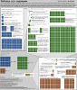

# Ионизирующее излучение
> 2019.05.12 [🚀](../index/index.md) [despace](index.md) → [EF](ef.md), [Space](index.md), [Надёжность](qa.md)

[TOC]

---

> <small>• **Ионизирующее излучение** — русскоязычный термин. **Ionizing radiation** — англоязычный эквивалент.  ・**Ионизирующее излучение космического пространства** — русскоязычный термин. **Outer space ionizing radiation** — англоязычный эквивалент.  ・**Радиация** — русскоязычный термин. **Radiation** — англоязычный эквивалент.</small>

**Ионизи́рующее излуче́ние (ИИ)** — потоки фотонов, элементарных частиц или осколков деления атомов, способные ионизировать вещество.

К ионизирующему излучению не относят видимый свет и ультрафиолетовое излучение, которые в отдельных случаях могут ионизировать вещество. Инфракрасное излучение и излучение радиодиапазонов не являются ионизирующим, поскольку их энергии недостаточно для ионизации атомов и молекул в основном состоянии.

Природные источники ионизирующего излучения:

   - Спонтанный радиоактивный распад радионуклидов.
   - Термоядерные реакции, например на [Солнце](sun.md).
   - Индуцированные ядерные реакции в результате попадания в ядро [высокоэнергетичных элементарных частиц](космические_лучи.md) или слияния ядер.
   - [Космические лучи](космические_лучи.md).

Искусственные источники ионизирующего излучения:

   - Искусственные радионуклиды.
   - Ядерные реакторы.
   - Ускорители элементарных частиц (генерируют потоки заряженных частиц, а также тормозное фотонное излучение).
   - Рентгеновский аппарат как разновидность ускорителей, генерирует тормозное рентгеновское излучение.

**Наведённая радиоактивность.**  
Многие стабильные атомы в результате облучения и соответствующей индуцированной ядерной реакции превращаются в нестабильные изотопы. В результате такого облучения стабильное вещество становится радиоактивным, причем тип вторичного ионизирующего излучения будет отличаться от первоначального облучения. Наиболее ярко такой эффект проявляется после нейтронного облучения.

**Цепочка ядерных превращений.**  
В процессе ядерного распада или синтеза возникают новые нуклиды, которые также могут быть нестабильны. В результате возникает цепочка ядерных превращений. Каждое превращение имеет свою вероятность и свой набор ионизирующих излучений. В результате интенсивность и характер излучений радиоактивного источника может значительно меняться со временем.

## Измерение ИИ

**Методы измерения**

В качестве датчиков излучения в быту и промышленности наибольшее распространение получили дозиметры на базе счётчиков Гейгера. Счетчик Гейгера — газоразрядный прибор, в котором ионизация газа излучением превращается в электрический ток между электродами. Как правило, такие приборы корректно регистрируют только гамма‑излучение. Некоторые приборы снабжаются специальным фильтром, преобразующим бета‑излучение в гамма‑кванты за счёт тормозного излучения. Счетчики Гейгера плохо селектируют излучения по энергии, для этого используют другую разновидность газоразрядного счетчика, т.н. пропорциональный счётчик.

Существуют полупроводниковые датчики ионизирующего излучения. Принцип их действия [аналогичен](analogue.md) газоразрядным приборам с тем отличием, что ионизируется объём полупроводника между двумя электродами. В простейшем случае это обратносмещённый полупроводниковый диод. Для максимальной чувствительности такие детекторы имеют значительные размеры.

Широкое применение в науке получили сцинтилляторы. Эти приборы преобразуют энергию излучения в видимый свет за счет поглощения излучения в специальном веществе. Вспышка света регистрируется фотоэлектронным умножителем. Сцинтилляторы хорошо разделяют излучение по энергиям.

Для исследования потоков элементарных частиц применяют множество других методов, позволяющих полнее исследовать их свойства, например пузырьковая камера, камера Вильсона.

**Единицы измерения**

Эффективность взаимодействия ионизирующего излучения с веществом зависит от типа излучения, энергии частиц и сечения взаимодействия облучаемого вещества. Важные показатели взаимодействия ионизирующего излучения с веществом: ➀ линейная передача энергии (ЛПЭ), показывающая, какую энергию излучение передаёт среде на единице длины пробега при единичной плотности вещества; ➁ поглощённая доза излучения, показывающая, какая энергия излучения поглощается в единице массы вещества.

   - В Международной системе единиц СИ единицей поглощённой дозы является **грэй** (рус. **Гр**, междунар. **㏉**), численно равный поглощённой энергии в 1 Дж на 1 ㎏ массы вещества.
   - Иногда встречается устаревшая внесистемная единица **рад** (рус. **рад**; междунар. **rad**): доза, соответствующая поглощённой энергии 100 эрг на 1 грамм вещества. **1 рад = 0.01 Гр**. Не путайте поглощённую дозу с эквивалентной поглощённой дозой.
   - **Зиверт** (рус. **Зв**, междунар. **Sv**) — единица измерения СИ эффективной и эквивалентной доз ионизирующего излучения. 1 зиверт — количество энергии, поглощённое килограммом биологической ткани, равное по воздействию поглощённой дозе 1 Гр.  1 Зв = 1 Дж/кг = 1 м²/с² (для излучений с коэффициентом качества, равным 1.0).
   - Широко применяется устаревающее понятие экспозиционная доза излучения — величина, показывающая, какой заряд создаёт фотонное (гамма‑ или рентгеновское) излучение в единице объёма воздуха. Для этого обычно используют внесистемную единицу экспозиционной дозы **рентген** (рус. **Р**; междунар. **R**): доза фотонного излучения, образующего ионы с зарядом в 1 ед. заряда СГСЭ ((1/3)×10⁻⁹ кулон) в 1 ㎝³ воздуха. В системе СИ используется единица **кулон на килограмм** (рус. **Кл/кг**; междунар. **C/㎏**): 1 Кл/кг = 3 876 Р; 1 Р = 2.57976×10⁻⁴ Кл/кг.
   - Активность радиоактивного источника ионизирующего излучения определяется как среднее количество распадов ядер в единицу времени. Соответствующая единица в  СИ **беккерель** (рус. **Бк**; междунар. **Bq**) обозначает количество распадов в секунду. Применяется также внесистемная единица **кюри** (рус. **Ки**; междунар. **Ci**). 1 Ки = 3.7×10¹⁰ Бк. Первоначальное определение этой единицы соответствовало активности 1 г радия‑226.
   - Корпускулярное ионизирующее излучение также характеризуется кинетической энергией частиц. Наиболее распространена внесистемная единица **электронвольт** (рус. **эВ**, междунар. **eV**). Как правило радиоактивный источник генерирует частицы с определённым спектром энергий. Датчики излучений также имеют неравномерную чувствительность по энергии частиц.

## Свойства и воздействие
По механизму взаимодействия с веществом выделяют непосредственно потоки заряженных частиц и косвенно ионизирующее излучение (потоки нейтральных элементарных частиц — фотонов и нейтронов). По механизму образования — первичное (рождённое в источнике) и вторичное (образованное в результате взаимодействия излучения другого типа с веществом) ионизирующее излучение.

Энергия частиц ионизирующего излучения лежит в диапазоне от нескольких сотен электронвольт (рентгеновское излучение, бета‑излучение некоторых радионуклидов) до 10¹⁵ ‑ 10²⁰ и выше электронвольт (протоны космического излучения, для которых не обнаружено верхнего предела по энергии).

Длина пробега и проникающая способность сильно различаются — от микрометров в конденсированной среде (альфа‑излучение радионуклидов, осколки деления) до многих километров (высокоэнергетические мюоны космических лучей).

### Воздействие на конструкцию
Длительное воздействие корпускулярных излучений или фотонных излучений сверхвысоких энергий может существенно изменять свойства конструкционных материалов. Изучением этих изменений занимается инженерная дисциплина радиационное материаловедение. Раздел физики, занимающийся исследованием поведения твердых тел под облучением, получил название радиационная физика твердого тела. Наиболее значимыми типами радиационных повреждений является:

   - разрушение кристаллической решетки вследствие выбивания атомов из узлов;
   - ионизация диэлектриков;
   - изменение химического состава веществ вследствие ядерных реакций.

Учёт радиационных повреждений инженерных конструкций наиболее актуален для ядерных реакторов и полупроводниковой электроники, рассчитанной на работу в условиях радиации.

### Воздействие на полупроводники
Современные полупроводниковые технологии чувствительны к ионизирующей радиации. Тем не менее они широко применяются в военной и космической технике, в ядерной индустрии. При этом используется ряд технологических, схемотехнических и программных решений, уменьшающих последствия радиационного воздействия.

Основные типы радиационных повреждений, приводящих к разовым или необратимым отказам полупроводников:

   - Накопление электрического заряда в подзатворных диэлектриках вследствие ионизации. Приводит к смещению порога открывания полевых транзисторов и долговременному отказу. Уменьшение топологических норм увеличивает стойкость к такого типа повреждениям.
   - Стекание заряда в EEPROM и Flash памяти вследствие ионизации диэлектрика «кармана». Приводит к потере данных. Борются резервированием, избыточным кодированием и использованием других видов памяти.
   - Фотоэффект на p‑n переходах (аналогично солнечным батареям). Увеличивает паразитные утечки и ложные сигналы. Для борьбы с этим явлением используются специальные технологии, например изоляция компонентов диэлектриком.
   - Космические тяжелые заряженные частицы (ТЗЧ) высоких энергий, ионизируя атомы, рождают в полупроводнике лавину электронов. Это может приводить к изменению состояния цифровых схем и мощным помехам в аналоговых схемах. В худшем случае к пробою изоляторов или тиристорному защелкиванию приборов с изоляцией p‑n переходом. С последним борются изоляцией диэлектриком; изоляцией двумя p‑n переходами (triple‑well процесс); контролем тока потребления узлов с перезапуском по аварийному росту потребления.
    Разрушение кристаллической структуры и изменение химического состава полупроводниковых приборов.

### Химическое действие
Ионизирующее излучение может вызывать химические превращения вещества. Такие превращения изучает радиационная химия. Под действием ионизирующего излучения происходят следующие превращения:

   - Превращение молекул кислорода в молекулы озона, из‑за чего металлы быстро окисляются.
   - Разложение воды на кислород и водород с образованием некоторого количества перекиси водорода.
   - Превращение аллотропических модификаций в более устойчивые: белого фосфора в красный, белого олова в серое, алмаза в графит.
   - Разложение на простые вещества газов — углекислого газа, сернистого газа, сероводорода, хлороводорода, аммиака.
   - Полимеризация соединений, содержащих двойные и тройные связи.

### Биовоздействие ИИ
Разные типы ионизирующего излучения обладают разным разрушительным эффектом и разным способом воздействия на биологические ткани. Соответственно, одной и той же поглощённой дозе соответствует разная биологическая эффективность излучения. Поэтому для описания воздействия излучения на живые организмы вводят понятие относительной биологической эффективности излучения, которая измеряется с помощью коэффициента качества. Для рентгеновского, гамма‑ и бета‑излучений коэффициент качества принят за 1. Для альфа‑излучения и осколков ядер коэффициент качества 10 ‑ 20. Нейтроны — 3 ‑ 20 в зависимости от энергии. Для заряженных частиц биологическая эффективность прямо связана с линейной передачей энергии данного типа частиц (средняя потеря энергии частицей на единицу длины пробега частицы в ткани).

Для учёта биологического эффекта поглощённой дозы была введена эквивалентная поглощённая доза ионизирующего излучения, численно равная произведению поглощённой дозы на коэффициент биологической эффективности. В системе СИ эффективная и эквивалентная поглощенная доза измеряется в **зивертах** (русское обозначение: **Зв**; международное: **㏜**).

Ранее широко применялась единица измерения эквивалентной дозы бэр (от биологический эквивалент рентгена для гамма‑излучения; русское обозначение: бэр; международное: rem). Первоначально единица определялась как доза ионизирующего излучения, производящего такое же биологическое действие, как и доза рентгеновского или гамма‑излучения, равная 1 Р. После принятия системы СИ под бэром стали понимать единицу, равную 0.01 Дж/кг. 1 бэр = 0.01 Зв = 100 эрг/г.

Помимо биологической эффективности, необходимо учитывать проникающую способность излучений. Например, тяжёлые ядра атомов и альфа‑частицы имеют крайне малую длину пробега в сколько‑нибудь плотном веществе, поэтому радиоактивные альфа‑источники опасны при попадании внутрь организма. Наоборот, гамма‑излучение обладает значительной проникающей способностью.

Некоторые радиоактивные изотопы способны встраиваться в процесс обмена веществ живого организма, замещая неактивные элементы. Это приводит к удержанию и накоплению радиоактивного вещества непосредственно в живых тканях, что существенно увеличивает опасность контакта. Например, широко известны йод‑131, изотопы стронция, плутония и т.п. Для характеристики этого явления используется понятие период полувыведения изотопа из организма.

**Механизмы биовоздействия**

Прямое действие ионизирующих излучений — это прямое попадание в биологические молекулярные структуры клеток и в жидкие (водные) среды организма.

Непрямое или косвенное действие — действие свободных радикалов, возникающих в результате ионизации, создаваемой излучением в жидких средах организма и клеток. Свободные радикалы вызывают разрушения целостности цепочек макромолекул (белков и нуклеиновых кислот), что может привести как к массовой гибели клеток, так и канцерогенезу и мутагенезу. Наиболее подвержены воздействию ионизирующего излучения активно делящиеся (эпителиальные, стволовые, также эмбриональные) клетки.

После действия излучения на организм в зависимости от дозы могут возникнуть детерминированные и стохастические радиобиологические эффекты. Например, порог появления симптомов острой лучевой болезни у человека составляет 1 ‑ 2 Зв на всё тело.

В отличие от детерминированных, стохастические эффекты не имеют чёткого дозового порога проявления. С увеличением дозы облучения возрастает лишь частота проявления этих эффектов. Проявиться они могут как спустя много лет после облучения (злокачественные новообразования), так и в последующих поколениях (мутации).

Основным источником информации о стохастических эффектах воздействия ионизирующего излучения являются данные наблюдений за здоровьем людей, переживших атомные бомбардировки или радиационные аварии. Специалисты наблюдали 87 500 человек, переживших атомные бомбардировки. Средняя доза их облучения составила 240 миллизиверт. При этом прирост онкологических заболеваний за последующие годы составил 9 %. При дозах менее 100 миллизиверт отличий между ожидаемой и наблюдаемой в реальности заболеваемостью никто в мире не установил.

**Гигиеническое нормирование ИИ**

Нормирование осуществляется по санитарным правилам и нормативам СанПин 2.6.1.2523‑09 «Нормы радиационной безопасности (НРБ‑99/2009)». Устанавливаются дозовые пределы эффективной дозы для следующих категорий лиц:

   - персонал — лица, работающие с техногенными источниками излучения (группа А) или находящиеся по условиям работы в сфере их воздействия (группа Б);
   - всё население, включая лиц из персонала, вне сферы и условий в их производственной деятельности.

Основные пределы доз и допустимые уровни облучения персонала группы Б равны четверти значений для персонала группы А.

Эффективная доза для персонала не должна превышать за период трудовой деятельности (50 лет) 1 000 мЗв, а для обычного населения за всю жизнь — 70 мЗв. Планируемое повышенное облучение допускается только для мужчин старше 30 лет при их добровольном письменном согласии после информирования о возможных дозах облучения и риске для здоровья.

| |
|:--|
||

 

## Docs & links (TRANSLATEME ALREADY)
|Navigation|
|:--|
|**[FAQ](faq.md)**, **[Cable](cable.md)**·БКС, **[Camera](cam.md)**·Камера, **[Comms](comms.md)**·Радио, **[CON](contact.md)·[Pers](person.md)**·Контакт, **[Control](control.md)**·Упр., **[Doc](doc.md)**·Док., **[Doppler](doppler.md)**·ИСР, **[DS](ds.md)**·ЗУ, **[EB](eb.md)**·ХИТ, **[ECO](ecology.md)**·Экол., **[EF](ef.md)**·ВВФ, **[ElC](elc.md)**·ЭКБ, **[EMC](emc.md)**·ЭМС, **[Error](error.md)**·Ошибки, **[Event](event.md)**·События, **[FS](fs.md)**·ТЭО, **[Fuel](fuel.md)**·Топливо, **[GNC](gnc.md)**·БКУ, **[GS](scs.md)**·НС, **[HF&E](hfe.md)**·Эрго., **[IU](iu.md)**·Гиро., **[KT](kt.md)**·КТЕХ, **[LAG](lag.md)**·ПУC, **[LES](les.md)**·САСП, **[LS](ls.md)**·СЖО, **[LV](lv.md)**·РН, **[MCC](mcc.md)**·ЦУП, **[Model](model.md)**·Модель, **[MSC](sc.md)**·ПКА, **[N&B](nnb.md)**·БНО, **[NR](nr.md)**·ЯР, **[OBC](obc.md)**·ЦВМ, **[OE](oe.md)**·БА, **[Pat.](патент.md)**·Патент, **[Proj.](project.md)**·Проект, **[PS](ps.md)**·ДУ, **[QA](qa.md)**·БКНР, **[R&D](rnd.md)**·НИОКР, **[Robot](robotics.md)**·Робот, **[Rover](rover.md)**·Ровер, **[RTG](rtg.md)**·РИТЭГ, **[SARC](sarc.md)**·ПСК, **[SE](se.md)**·СЭ, **[Sens.](sensor.md)**·Датч., **[SC](sc.md)**·КА, **[SCS](scs.md)**·КК, **[SGM](sgm.md)**·КММ, **[SI](si.md)**·СИ, **[Soft](soft.md)**·ПО, **[SP](sp.md)**·БС, **[Spaceport](spaceport.md)**·Космодр., **[SPS](sps.md)**·СЭС, **[SSS](sss.md)**·ГЗУ, **[TCS](tcs.md)**·СОТР, **[Test](test.md)**·ЭО, **[Timeline](timeline.md)**·ЦГМ, **[TMS](tms.md)**·ТМС, **[TOR](tor.md)**·ТЗ, **[TRL](trl.md)**·УГТ|
|*Sections & pages*|
|**··• [External factors (EF)](ef.md) •··**  [Astro.object](aob.md)┊ [Atmosphere](atmosphere.md)┊ [Atmosphere of Earth](earth.md)┊ [Cosmic rays](cr.md)┊ [EMI](emi.md)┊ [Grav.waves](gravwave.md)┊ [Ion.radiation](ion_rad.md)┊ [Radio frequency](rf.md)┊ [Solar phenomena](solar_ph.md)┊ [Space debris](sdeb.md)┊ [Standart conditions](sctp.md)┊ [Time](time.md)┊ [VA radiation belts](varb.md)|

   1. Docs: …
   1. Notable interwikies — …
   1. <https://en.wikipedia.org/wiki/Dosimetry>
   1. <https://en.wikipedia.org/wiki/Ionizing_radiation>
   1. <https://ru.wikipedia.org/wiki/Доза_излучения>
   1. <https://ru.wikipedia.org/wiki/Ионизирующее_излучение>
   1. <https://habr.com/ru/post/440916/>
