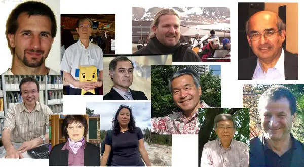
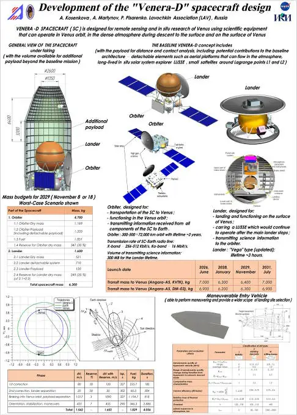

# IVC 2019
> 2019.05.21 [🚀](../index/index.md) [despace](index.md) → [IVC](ivc.md), [Venus](venus.md), **[Events](event.md)**

[TOC]

---

> <small>**International Venus Conference. Fujihara Seminar 74** — англоязычный термин, не имеющий аналога в русском языке. **Международная конференция по Венере. 74-й семинар Фудзихара** — дословный перевод с английского на русский.</small>

**The IVC2019** is the successor of previous series of Venus conferences (La Thuile, Aussois, Sicily, & Oxford), & will be organized by the Akatsuki team & the community in Japan. The conference is intended to cover all areas of Venus science with special focus on new results obtained from Japan’s Venus Climate Orbiter «Akatsuki». Results from previous missions, ground‑based observations, numerical computations, & theoretical works are all welcome.

|*IVC2019*|<https://www.cps-jp.org/~akatsuki/venus2019/>;  [Постер IVC2019 ❐](f/event/ivc/ivc2019_poster.pdf)|
|:--|:--|
|Date|May 31 (Fr) - June 3 (Mo), 2019|
|Venue|[Hilton Niseko Village ⎆](http://www3.hilton.com/en/hotels/japan/hilton-niseko-village-CTSNVHI/maps-directions/index.html)|
|Host Org.|International Venus Conference 2019 Organizing committee|
|Co‑host Org.|PLANET‑C Project Team / Japan Aerospace Exploration Agency;  [Center for Planetary Science ⎆](https://www.cps-jp.org/)|
|Supported by|[The Fujihara Foundation of Science ⎆](http://www.fujizai.or.jp/e_gaiyo.htm)|
|Accepted by|[NASA](contact/nasa.md).md;  [Japan Geoscience Union (JpGU)](jpgu.md);  [The Society of Geomagnetism & Earth, Planetary & Space Sciences (SGEPSS) ⎆](http://www.sgepss.org/sgepss/index-e.html);  [The Japanese Society of Planetary Sciences (JSPS) ⎆](https://www.wakusei.jp/)|
|Content|Oral & Poster Presentations|
|Focus|Covering all areas of Venus science with special focus on new results obtained from Japan’s Venus Climate Orbiter «Akatsuki»|
|Reg. Fee|Student: 5 000 JPY (participating full days, registration by Feb. 25);  Regular: 30 000 JPY|
|Attendees|100|
|Related Mtg.|[JpGU2019](jpgu_2019.md), May 26 ‑ May 30, 2019, Makuhari, Chiba, Japan|
|Contact|<akatsuki-ivc2019inquiries@cps-jp.org> ✉|

**Science Organizing committee:**

   - **[Yoshi-Yuki Hayashi](person.md)** (Kobe Univ., JP)
   - Martha Gilmore (Wesleyan University, USA)
   - [Sanjay Limaye](person.md) (University of Wisconsin-Madison, USA)
   - Yoshihisa Matsuda (Tokyo Gakugei University, Japan)
   - [Kevin McGouldrick](person.md) (University of Colorado Boulder, USA)
   - [Masato Nakamura](person.md) (ISAS/JAXA, Japan)
   - Agustin Sánchez-Lavega (Universidad del Pais Vasco / Euskal Herriko Unibertsitatea, Spain)
   - [Takehiko Satoh](person.md) (ISAS/JAXA, Japan)
   - [Thomas Widemann](person.md) (Paris Obs., France)
   - [Colin Wilson](person.md) (Oxford Univ., UK)
   - [Ludmila Zasova](person.md) (IKI, Russia)

**Local Organizing committee:**

   - Hiroki Andou (Kyoto Sangyo Univ.)
   - George L. Hashimoto (Okayama Univ.)
   - [Yoshi-Yuki Hayashi](person.md) (CPS/Kobe Univ.)
   - Takeshi Horinouchi (Hokkaido Univ.)
   - [Takeshi Imamura](person.md) (Tokyo Univ.)
   - Masaki Ishiwatari (Hokkaido Univ.)
   - Hiroki Kashimura (CPS/Kobe Univ.)
   - Takeshi Kuroda (NICT)
   - Yoshihisa Matsuda (Tokyo Gakugei Univ.)
   - [Shin-ya Murakami](person.md) (ISAS/JAXA)
   - [Masato Nakamura](person.md) (ISAS/JAXA)
   - Masatsugu Odaka (Hokkaido Univ.)
   - Kazunori Ogohara (Shiga Prefecture Univ.)
   - [Takehiko Satoh](person.md) (ISAS/JAXA)
   - Norihiko Sugimoto (Keio Univ.)
   - [Koichiro Sugiyama](person.md) (National Institute of Technology, Matsue College)
   - Masahiro Takagi (Kyoto Sangyo Univ.)
   - Seiko Takagi (Hokkaido Univ.)
   - Yukihiro Takahashi (Hokkaido Univ.)
   - Yoshiyuki Takahashi (Kobe Univ.)
   - Masaru Yamamoto (Kyushu Univ.)

**Secretariat:**

   - Masako Hashimoto (CPS/Kobe Univ.)
   - Mariko Kida (e-side inc.)
   - Scott Macdonald (e-side inc.)
   - Yuriko Murayama (e-side inc.)
   - Naoko Nakanishi (CPS/Kobe Univ.)

## Итоги IVC 2019

The 74th Fujihara Seminar / International Venus Conference 2019 проходила в отеле Hilton г. Нисеко, Хоккайдо, Япония. Наиболее активные дни были с 31 мая по 3 июня 2019 года. Фактическое количество участников с указанием стран, количества докладов и постеров приведено в таблице ниже.

**Таблица.** Количество участников, докладов и постеров. (упорядочено по убыванию)

|*Страна*|*Участники*|*Презентации*|*Постеры*|
|:--|:--|:--|:--|
|США|36 <small>(12 [NASA](contact/nasa.md)/JPL, 24 университеты)</small>|25|16|
|Япония|35 <small>(2 JAXA, 33 университеты)</small>|18|21|
|Европа|25|19|11|
|Россия|7 <small>(2 НПОЛ, 5 университеты)</small>|4|2|
|Австралия|1|1|1|
|Индия|1|—|2|
|**Итого**|**105**|**67**|**53**|

На конференции присутствовали различные должности и звания, начиная от студентов последних курсов и до директоров космических агентств, однако яркого визуального и поведенческого различия между ними и их презентациями не было. Помимо прочих, на конференции присутствовали нынешние участники JSDT — Дмитрий Горинов, Sanjay Limaye, Tibor Kremic, а также бывшие участники и те, кто участвует(овал) опосредованно — James Cutts, Larry Esposito, Lori Glaze, Shannon Ewan. Также на конференции присутствовали разработчики европейской миссии к Венере EnVision (старт в 2032 году).

Дни проведения конференции представляли собой последовательные 12‑15‑минутные доклады с утра до вечера с перерывами для обсуждения. В два дня были выделено по 1 часу 45 минут для выступления и обсуждения постеров; кроме того, постеры обсуждались в перерывах и любое другое удобное время. Основная масса докладов и постеров касалась анализа данных предыдущих миссий (в основном, Венера Экспресс, Акацуки), включала моделирование атмосферы, магнитосферы и поверхностных слоёв Венеры, попытки понять историю и эволюцию Венеры и применить полученные знания и опыт к пониманию эволюции Земли (пути развития). Всего 4 доклада и постера (США и Индия) касались технических вопросов освоения Венеры, в т.ч. надувных баллонов, глайдеров. При этом в сумме был заявлен 61 постер, из которых в итоге отсутствовали 8 (№ 1, 4, 5, 27, 32, 37, 49, 51).

АО «НПО Лавочкина» представляли зам. нач. о. 512 А.Б. Мартынов и инженер‑конструктор 3 категории о. 511 А.В. Косенкова (объявляла постер 01.06.2019). Презентационным материалом был постер формата А0 на английском языке с краткой информацией о проекте «Венера‑Д» и предложениями НПОЛ по проекту, а также маневренному спуску в атмосфере Венеры. Материалы постера представляют собой выжимку из выпущенного JSDT Отчёта № 2, опубликованного в открытом доступе в начале 2019 года на сайтах ИКИ РАН и VEGAX.

Деятельность представителей НПОЛ включала в себя изучение и анализ докладов и постеров, обсуждение с участниками докладов и постеров, накопление информации, ознакомление участников конференции с проектом, ролью НПОЛ в нём, видом деятельности предприятия, реклама НПОЛ в целом и Венеры‑Д в частности; были намечены пути возможного развития проекта и возможные связи, повышена заинтересованность проектом. В ходе обсуждения постера НПОЛ говорилось ровно то, что написано на постере, только разными словами, плюс по ситуации информация из выпущенного и опубликованного в открытом доступе Отчёта № 2. Всего удалось описать проект Венера‑Д примерно 40 участникам конференции в объёме, достаточном для понимания, запоминания и появления «огонька в глазах», и ориентировочно стольким же — описать мимоходом.

В целом присутствующее научное сообщество выражало большую заинтересованность как в тех немногочисленных результатах, полученных в ходе миссии Акацуки, и уже давних результатах миссии «Venux Express», а также старых данных аппаратов серии «Венера» и «Вега», так и большую надежду на дальнейшее исследование Венеры. Много частично исследованных вопросов и частично построенных моделей. Ораторами заявлялось, что данных для анализа мало и хотелось бы побольше и поточнее. Венера‑Д, её предполагаемая аппаратура и спектр возможностей были встречены очень тепло: народ как‑то даже просыпался, когда выступали представители JSDT и рассказывали про перспективы и возможности, охотно подходил к нашему постеру. Хотя и было видно, что учёные с трудом разбираются в технике, но они старались изложить какие эксперименты им были бы интересны, предоставив реализацию этого инженерам.

**Рисунок.** Постер НПОЛ на IVC2019

 

**Таблица.** Общие участники с ближайшими конференциями.

|*Конференция*|*Участники*|
|:--|:--|
|**[2019 VD Workshop](vdws2019.md)**|[James Cutts](person.md), [Larry Esposito](person.md), [Dmitry Gorinov](person.md), [David Grinspoon](person.md), Anastasia Kosenkova, [Tibor Kremic](person.md), [Sanjay Limaye](person.md), Alexey Martynov, [Satoshi Sasaki](person.md), [Grzegorz Słowik](person.md), [Michael Way](person.md)|
|**[MSSS, 10th](msss_10.md)**|Anastasia Kosenkova, Alexey Martynov|
|**[VEXAG, 17th](vexag_2019.md)**| |

**Таблица.** Презентации, постеры и прочие участники.  
<small>(Толстым выделены новые интересные личности)</small>

<small>

|°|*Имя*|*Орг.*|*Название*|
|:--|:--|:--|:--|
|—|**`Презентации`**|—|—|
|**AU**|Franklin Mills|[ANU](contact/anu.md) & SSI|Modeling the Distribution of Sulfur Species in the Atmosphere of Venus|
|EU|**[Aymeric Spiga](person.md)**|[Sorbonne Univ.](sorbonne_univ.md), [LMD](lmd.md)|New mesoscale model for Venus’ atmo & its application to bow‑shaped structures|
|EU|Cedric Gillmann|ULB|The early & long term evolution of Venus & its atmosphere|
|EU|**[Colin F Wilson](person.md)**|[Oxford Univ.](oxford_univ.md)|Envision M5 Venus Orbiter, Status & Opportunities|
|EU|**[Ehouarn Millour](person.md)**|[LMD](lmd.md)|Towards a (GCM‑based) Venus Climate Database|
|EU|**[Emmanuel Marcq](person.md)**|[LATMOS](contact/latmos.md) / [UVSQ](uvsq.md)|SPICAV‑UV,VEx nadir observations, SO₂, O₃ & UV absorber|
|EU|**[Gourav Mahapatra](person.md)**|[TU Delft](tu_delft.md)|Studying the polarization in CO₂ absorption bands of Venus atmosphere|
|EU|[Jorn Helbert](person.md)|DLR|Spectroscopy of the surface of Venus — in the lab & from orbit|
|EU|Kerstin S. Peter|RIU-Planetary|Small‑scale disturbances in the lower dayside ionosphere of Venus|
|EU|Machado Pedro I.|[Paris Obs.](paris_obs.md)|Meridional & Zonal winds at Venus atmo from Cloud tracking, Doppler techniques & comparison with modelling|
|EU|Martin Paetzold|RIU-Planetary|The Venus Ionosphere as seen by the Akatsuki Radio Science Experiment|
|EU|**[Maxence Lefevre](person.md)**|[Oxford Univ.](oxford_univ.md)|Organization of the convection in the Venusian cloud layer|
|EU|Moa Persson|[IRF](contact/icomms.md)|H⁺O⁺ escape rates in Venus magnetotail, their dependence on upstream conditions|
|EU|Nicolas Rambaux|IMCCE, [Paris Obs.](paris_obs.md)|Rotational motion of Venus & Envision determination|
|EU|[Pascal Rosenblatt](person.md)|Geoazur|Gravity & ephemeris experiment with EnVision|
|EU|**[Peter Read](person.md)**|[Oxford Univ.](oxford_univ.md)|Venus in context, exploring atmospheric circulation regimes for slow & fast rotators|
|EU|**[Ruben Gonçalves](person.md)**|IA, Portugal|Akatsuki (cloud‑tracking) & TNG, HARPS‑N (Doppler velocimetry) coordinated wind measurements of cloud top Venus atmosphere|
|EU|**[Sebastien Lebonnois](person.md)**|[LMD](lmd.md)/IPSL, CNRS|Investigations below the clouds of Venus with the IPSL Venus GCM|
|EU|Sruthi Uppalapati|Oslo Univ.|Role of Mantle Dynamics in Rejuvenation of Venus’ surface, insights from 3D modelling|
|EU|Yoshifumi Futaana|[IRF](contact/icomms.md)|Upper atmosphere of Venus & impact from solar wind plasma (from Venus Express)|
|**JP**|[George L. Hashimoto](person.md)|Okayama Univ.|Climate control on Venus, Connections among clouds, UV absorber, surface chemical reaction, & atmospheric circulation|
|**JP**|Hiroki Kashimura|Kobe Univ.|Planetary‑scale streak structure in high‑res simulations of Venus atmosphere|
|**JP**|Hironori Iwase|Fujihara Foundation of Science|Profile of The Fujihara Foundation of Science|
|**JP**|[Javier Peralta](person.md)|ISAS (JAXA)|Complex features & dynamics of nightside clouds of Venus (Akatsuki, Venus Express)|
|**JP**|Makoto Kobayashi|KEK|Opening Address|
|**JP**|Masahiro Takagi|KSU|Numerical modeling of the Venus atmosphere|
|**JP**|**[Masaki Ogawa](person.md)**|[Tokyo Univ.](contact/tokyo_univ.md)|A two‑stage evolution model of Venusian mantle & its implications for the Earth|
|**JP**|Masataka Imai|AIST|Continuous monitoring of planetary‑scale waves in the Venus cloud top|
|**JP**|Masaru Yamamoto|Kyushu Univ.|Atmospheric simulations using Venus AORI general circulation models|
|**JP**|Pushkar Kopparla|[Tokyo Univ.](contact/tokyo_univ.md)|Principal Components of UV Albedo Variability in Venus’ Atmo as seen at 283 nm|
|**JP**|[Satoshi Sasaki](person.md)|[Tokyo Univ.](contact/tokyo_univ.md)|Microscope for Life Detection in Venus Clouds|
|**JP**|Shinichiro Kawase|Rikkyo Univ.|Comparison of horizontal distributions of temp. & UV absorbers at Venus cloud‑tops|
|**JP**|Takao Sato|HIU|Mapping of Venus’ cloud top altitude from Akatsuki,IR2 dayside images|
|**JP**|Takeshi Horinouchi|Hokkaido Univ.|Venus atmosphere dynamics revealed by cloud tracking using images from Akatsuki|
|**JP**|[Takeshi Imamura](person.md)|[Tokyo Univ.](contact/tokyo_univ.md)|Localtime‑dependent structures in Venusian atmo (Akatsuki radio occultation measures)|
|**JP**|Takeshi Kuroda|Tohoku Univ.|Maintenances of Venusian Sulfuric Acid Clouds due to Chemistry & Dynamics Simulated by a General Circulation Model|
|**JP**|Toru Kouyama|AIST|Detection of large stationary grav. waves over 10 Venusian solar days seen in LIR imgs|
|**JP**|[Yeon Joo Lee](person.md)|TUB|Long‑term variations of Venus’ 365 nm albedo|
|RU|Alexander V. Rodin|MIPT| |
|RU|**[Daria Evdokimova](person.md)**|[IKI RAS](contact/iki_ras.md), LATMOS|Variations of lower clouds & water vapor amount in deep Venus atmosphere|
|RU|[Dmitry Gorinov](person.md)|[IKI RAS](contact/iki_ras.md)|Circulation of Venusian atmo at 90‑110 km (apparent motions of O₂ 1.27 um nightglow)|
|RU|Mikhail Luginin|[IKI RAS](contact/iki_ras.md)|Retrieval of upper haze aerosol properties from SPICAV‑UV & ‑IR data|
|**US**|**[Abhinav Jindal](person.md)**|[Cornell Univ.](cornell_univ.md)|Unveiling the Interior of Venus, Using tectonic deformations along canali to constrain lithospheric structure & mantle convection|
|**US**|Amanda Susanne Brecht|[NASA](contact/nasa.md)|Understanding the Impact of Waves on Venus’ Upper Atmosphere through General Circulation Model Simulations|
|**US**|**[Armin Kleinboehl](person.md)**|[JPL](contact/jpl.md)|Venus Climate Sounder, A Limb Infrared Radiometer for Middle Atmosphere of Venus|
|**US**|Candace Leah Gray|Apache Obs.|Variability of the Venusian & Martian nightside ionosphere after solar storms|
|**US**|Carver Jay Bierson|UCSC|Fully coupled photochemical‑condensation model of Venus atmosphere|
|**US**|**[Christopher Parkinson](person.md)**|[Michigan Univ.](contact/michigan_univ.md)|Modeling of Observations of the OH Nightglow in the Venusian Mesosphere|
|**US**|**[David Grinspoon](person.md)**|[PSI](contact/psi.md)|The Evolution of Climate & a Possible Biosphere on Venus|
|**US**|Eliot Young|[SWRI](contact/swri.md)|Spectral Properties of Unusual Nightside Cloud Features on Venus|
|**US**|**[Erika Kohler](person.md)**|[NASA](contact/nasa.md) GSFC|Measuring spectral properties of candidate minerals, Apps to Venus radar anomalies|
|**US**|Jonathan Grandidier|[JPL](contact/jpl.md)|Solar Spectrum & Intensity Analysis Under Venus Atmosphere Conditions for Photovoltaics Operation|
|**US**|[Joseph O'Rourke](person.md)|[Arisona Univ.](arisona_univ.md)|Detectability & Scientific Implications of Crustal Remanent Magnetism on Venus|
|**US**|[Kevin McGouldrick](person.md)|[LASP](contact/lasp.md)|Cytherometeorology|
|**US**|[Lori S Glaze](person.md)|[NASA](contact/nasa.md) GSFC| |
|**US**|Martha Gilmore|Wesleyan Univ.|Contrasts Between Low Emissivity Tessera & Plains Materials On Venus Mountaintops|
|**US**|**[Michael Radke](person.md)**|[J.Hopkins Univ.](contact/jhu.md)|Optical Properties of Venus Aerosol Analogues|
|**US**|**[Michael Way](person.md)**|[NASA](contact/nasa.md)/GISS|Modeling Venus‑like Worlds, habitable zone, evolution of Venus’ atmosphere|
|**US**|**[Ralph Lorenz](person.md)**|[JHUAPL](contact/jhuapl.md)|The Dust Cycle on Venus|
|**US**|Richard A Hart|UCLA EPSS|Whistler‑mode Waves at Venus Generated Below the Ionosphere|
|**US**|[Sanjay Limaye](person.md)|[Wisconsin Univ.](contact/wisconsin_univ.md)|Puzzling Cloud Cover of Venus|
|**US**|[Sanjay Limaye](person.md)|[Wisconsin Univ.](contact/wisconsin_univ.md)|VENERA‑D, Mission for long‑term study of atmo, surface, structure & solar wind|
|**US**|Sara Taeko Port|Arkansas Univ.|Lead Minerals under Simulated Venus Conditions|
|**US**|Stephen Bougher|[Michigan Univ.](contact/michigan_univ.md)|Investigation of Solar Wind Influence on Venus Upper Atmosphere Structure, Dynamics|
|**US**|**[Suzanne Smrekar](person.md)**|[JPL](contact/jpl.md)|Venus Interior & Surface Today|
|**US**|**[Thomas F Bristow](person.md)**|[NASA](contact/nasa.md)|CheMin‑V, A Definitive Mineralogy Instrument for the Venera‑D Mission|
|**US**|[Tibor Kremic](person.md)|[GRC](contact/grc.md)|Preparing for Venus Surface Exploration|
|•|・  •   •   •   •   •   •   •|・ •  •|・ •  •|
|—|**`Постеры`**|—|—|
|**AU**|**[Franklin Mills](person.md)**|[ANU](contact/anu.md) & SSI|Simulations of Vertical Profiles of Sulfur Oxides in Venus’ Mesosphere|
|EU|**[Grzegorz Slowik](person.md)**|[Zielona Univ.](contact/zielona_univ.md)|Measuring the properties of acidophilic bacteria under Venus cloud conditions|
|EU|Janusz Oschlisniok|RIU|Sulfuric acid vapor in atmo of Venus (Venus Express Radio Science Experiment VeRa)|
|EU|Martin Paetzold|RIU-Planetary|Research Eight years of VEX‑VeRa radio sounding of the Venus ionosphere|
|EU|Moa Persson|[IRF](contact/icomms.md)|Heavy ion flows in the upper ionosphere of the Venusian North Pole|
|EU|**[Neil Tamas Lewis](person.md)**|[Oxford Univ.](oxford_univ.md)|Modelling super‑rotation in Venus‑like atmospheres with Isca|
|EU|[Sebastien Lebonnois](person.md)|LMD/IPSL, CNRS|An experiment to investigate Venus’s deep atmosphere|
|EU|[Sebastien Lebonnois](person.md)|LMD/IPSL, CNRS|Composition & clouds, some insights & questions from the coupled IPSL Venus GCM|
|EU|[Sebastien Lebonnois](person.md)|LMD/IPSL, CNRS|Interactions between the topography & the atmosphere on Venus|
|EU|Silvia A. Tellmann|RIU|Eight years of VEX‑VeRa radio sounding of the Venus atmosphere|
|EU|Silvia A. Tellmann|RIU|Radio Sounding of the Venusian Atmosphere & Ionosphere with EnVision|
|EU|**[Thomas Widemann](person.md)**|[Paris Obs.](paris_obs.md)|Clouds Top Wind Measurements & Thermal Properties near Beta Regio (25N, 283E)|
|**IN**|**[Adhithiyan Neduncheran](person.md)**|[UPES](contact/upes.md)|A review of photochemical reactions & electrical discharge in the atmosphere of Venus with special focus on lightning in the cloud region|
|**IN**|[Adhithiyan Neduncheran](person.md)|[UPES](contact/upes.md)|Remote sensing studies of our sister planet, Exploring Venus using planetary glider & CubeSat constellation|
|JP|Asako Hosono|Toshimagaoka Women H.School|The study on the reproducibility of cold collar assuming radio occultation measurement by small satellites|
|JP|Choon Wei Vun|SOKENDAI|Akatsuki IR2 Nightside Photometry Restoration by Deconvolution 2.26, 1.735um filters|
|JP|Hideo Sagawa|Sangyo Univ.|Doppler‑wind observ. of Venus mesosphere, Comparison (new GCM experiments)|
|JP|Hiroki Andou|Sangyo Univ.|Venusian cloud physics investigated by a general circulation model|
|JP|Kensuke Nakajima|Kyushu Univ.|Development of a Venus’ cloud formation scheme for a convection resolving model|
|JP|Kiichi Fukuya|[Tokyo Univ.](contact/tokyo_univ.md)|Stationary wavy features & Banded structures at Venusian cloud top (LIR images)|
|JP|Kosuke Takami|PAT|Temperature & wind variations in Venusian mesosphere & lower thermosphere by mid‑infrared heterodyne spectrometer in 2018|
|JP|Makoto Taguchi|Rikkyo Univ.|Spectroscopic observation of Venus atmosphere by circumpolar stratotelescope FUJIN|
|JP|Masahiro Akiba|Rikkyo gr. school|3D structure of a thermal tide in the Venus atmosphere|
|JP|Masataka Imai|AIST|Cosmic rays detected by LAC on board Akatsuki|
|JP|Naomoto Iwagami|[Tokyo Univ.](contact/tokyo_univ.md)|Cloud morphology & wind measurements by the Akatsuki 1‑micrometer camera|
|JP|Norihiko Sugimoto|Keio Univ.|The Venus AFES LETKF Data Assimilation System (VALEDAS)|
|JP|Ryota Mori|[Tokyo Univ.](contact/tokyo_univ.md)|Gravity wave packets detected in radio occultation temp. profiles of Venus atmosphere|
|JP|Seiko Takagi|Hokkaido Univ.|The global variation of Venus cloud investigated from IR1 onboard AKATSUKI|
|JP|[Takehiko Satoh](person.md)|ISAS/JAXA|Enormous cloud cover as seen by Akatsuki, IR2 on the night‑side disk of Venus|
|JP|Takeshi Horinouchi|Hokkaido Univ.|A novel cloud tracking method & results from Akatsuki|
|JP|Takeshi Horinouchi|Hokkaido Univ.|Understanding the formation of super‑rotation under zonally symmetric thermal forcing|
|JP|Tetsuya Fukuhara|Rikkyo Univ.|Local‑time variation of the zonal wave number spectra derived from the Venus cloud‑top Temperature observed by Akatsuki LIR|
|JP|Toru Kouyama|AIST|Venusian yearly‑scale variation of super rotation seen in Akatsuki observations|
|JP|Yukihiro Takahashi|Hokkaido Univ.|Search for lightning discharge in Venus with Akatsuki,LAC & Pirka telescope|
|JP|Yoshiyuki O. Takahashi|Kobe Univ.|Zonal mean structure of Venus atmosphere observed in a Venus general circulation model, DCPAM, with explicit radiative transfer calculation|
|**RU**|Anastasia Kosenkova|LAV|Development of the Venera‑D Spacecraft Design|
|**RU**|**Marina Patsaeva**|[IKI RAS](contact/iki_ras.md)|Solar related variations of the cloud top circulation above Aphrodite Terra from VMC, Venus Express wind fields. Comparison with Akatsuki (first results)|
|US|[Christopher Parkinson](person.md)|[Michigan Univ.](contact/michigan_univ.md)|Photochemical Control of the Distribution of Venusian Water & and Sulphuric Acid Aerosols in the Clouds & Upper Haze of Venus|
|US|[Christopher Parkinson](person.md)|[Michigan Univ.](contact/michigan_univ.md)|The Impact of Venus Middle Atmosphere Aerosol Heating upon SO2 & CO Density Distributions through GCM Model Simulations|
|US|**[Chuanfei Dong](person.md)**|[Princeton Univ.](princeton_univ.md)|Role of a Weak Planetary Dipole Moment on Venusian Upper Atmo & Near Space Env.|
|US|Eliot Young|[SWRI](contact/swri.md)|Observing Venus with [NASA](contact/nasa.md)’s Terrestrial Balloon Program|
|US|Eliot Young|[SWRI](contact/swri.md)|Venus Cloud Top Chemistry, Convective Activity & Topography, Perspective from HST|
|US|Helen F. Parish|UCLA|Influence of Wave Variations on Venus’ Cloud‑level Atmosphere (Middle Atmo Model)|
|US|**[James Cutts](person.md)**|[JPL](contact/jpl.md)|Exploration of Venus with Aerial Platforms|
|US|Jeremy Brossier|Wesleyan Univ.|Low radar emissivity signatures on coronae|
|US|Martha Gilmore|Wesleyan Univ.|Thirty Days On Venus, Chemical & Electrical Changes Minerals Exposed To The Glenn Extreme Environment Rig (GEER)|
|US|[Ralph Lorenz](person.md)|[JHUAPL](contact/jhuapl.md)|A Lightweight Imaging‑Altimeter Radar for Venus Exploration|
|US|**[Ryan McCabe](person.md)**|[Hampton Univ.](hampton_univ.md)|Tracking the Venus Y‑Feature During Venus Express & Ground‑based Observing|
|US|Sara Taeko Port|Arkansas Univ.|The Emissivity of Pyrrhotite‑Basalt Mixtures at Venusian Temperatures|
|US|Stephen A Ledvina|Space Sciences Lab, Berkeley|Simulations of Ion Flow & Energy Transfer in the Venus Environment|
|US|[Suzanne Smrekar](person.md)|[JPL](contact/jpl.md)|VERITAS (Venus Emissivity, Radio Science, Insar, Topography & Spectroscopy), A Proposed Discovery Mission|
|US|Tatiana M Bocanegra Baha|[JPL](contact/jpl.md)|Radio‑holographic methods for inversion of radio occultation experiments of past Venus’ spacecraft|
|US|**[Valeriy Tenishev](person.md)**|[Michigan Univ.](contact/michigan_univ.md)|Toward Development of Coupled Kinetic‑Fluid Model of Venus Thermosphere‑Exosphere System Interacting with the Ambient Solar Wind|
|•|・  •   •   •   •   •    •|・ •  •|・ •  •|
|—|**`Прочие`**|—|—|
|**RU**|Alexey Martynov|LAV|—|
|US|**[Kunio Sayanagi](person.md)**|[Hampton Univ.](hampton_univ.md)|Relationship between wind shear & eddy momentum forcing in atmo super‑rotation|
|US|**[Larry Esposito](person.md)**|[LASP](contact/lasp.md)|—|
|US|[Shannon Ewan](person.md)|[NASA](contact/nasa.md)|—|

</small>

 

## Docs & links (TRANSLATEME ALREADY)
|Navigation|
|:--|
|**[FAQ](faq.md)**【**[SCS](scs.md)**·КК, **[SC (OE+SGM)](sc.md)**·КА】**[CON](contact.md)·[Pers](person.md)**·Контакт, **[Ctrl](control.md)**·Упр., **[Doc](doc.md)**·Док., **[Drawing](drawing.md)**·Чертёж, **[EF](ef.md)**·ВВФ, **[Error](error.md)**·Ошибки, **[Event](event.md)**·События, **[FS](fs.md)**·ТЭО, **[HF&E](hfe.md)**·Эрго., **[KT](kt.md)**·КТ, **[N&B](nnb.md)**·БНО, **[Project](project.md)**·Проект, **[QM](qm.md)**·БКНР, **[R&D](rnd.md)**·НИОКР, **[SI](si.md)**·СИ, **[Test](test.md)**·ЭО, **[TRL](trl.md)**·УГТ, **[Way](way.md)**·Пути|
|*Sections & pages*|
|**【[Events](event.md)】**  **Meetings:** [AGU](agu.md)・ [CGMS](cgms.md)・ [COSPAR](contact/cospar.md)・ [DPS](dps.md)・ [EGU](egu.md)・ [EPSC](epsc.md)・ [FHS](fhs.md)・ [IPDW](ipdw.md)・ [IVC](ivc.md)・ [JpGU](jpgu.md)・ [LPSC](lpsc.md)・ [MAKS](maks.md)・ [MSSS](msss.md)・ [NIAC](niac_program.md)・ [VEXAG](vexag.md)・ [WSI](wsi.md) ┊ ··•·· **Contests:** [Google Lunar X Prize](google_lunar_x_prize.md)|

   1. Docs:
      - [Архив материалов ❐](f/event/ivc/ivc2019.7z)
   1. <https://www.cps-jp.org/~akatsuki/venus2019/>
