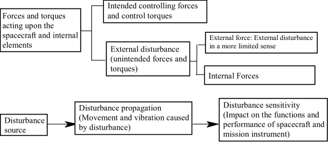
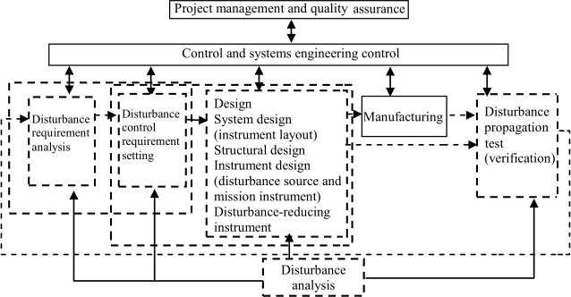
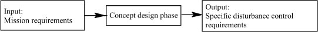
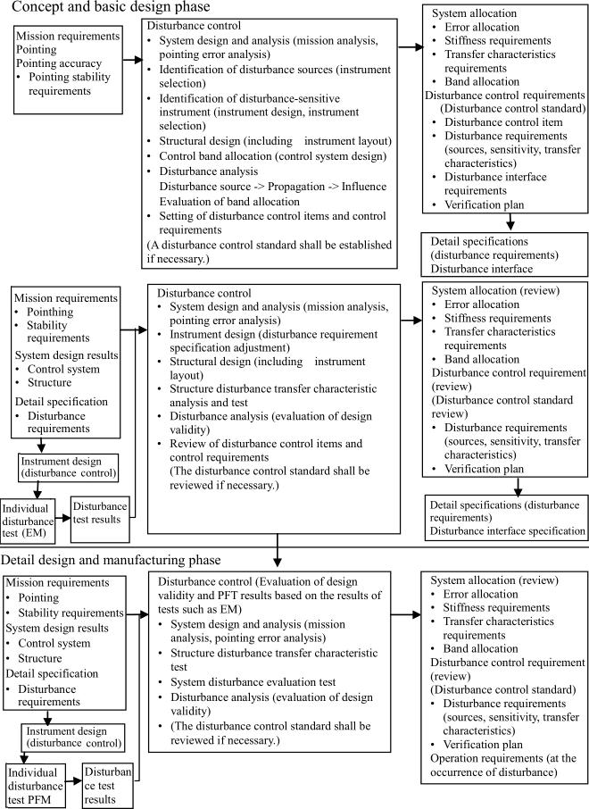

# JERG-2-152
> 2012.05.10 [🚀](../index/index.md) [despace](index.md) → [Doc](doc.md), [R&D](rnd.md)

[TOC]

---

> <small>**JERG-2-152 Disturbance Control Standard** — EN term. **ЖЕРГ-2-152 Стандарт контроля возмущений** — literal RU translation.</small>

JERG-2-152A  
DISTURBANCE CONTROL STANDARD  
May 10 , 2012 Revision A  
[Japan Aerospace Exploration Agency](contact/jaxa.md)

This is an English translation of JERG-2-152A. Whenever there is anything ambiguous in this document, the original document (the Japanese version) shall be used to clarify the intent of the requirement.

*Disclaimer*  
The information contained herein is for general informational purposes only. JAXA makes no warranty, express or implied, including as to the accuracy, usefulness or timeliness of any information herein. JAXA will not be liable for any losses relating to the use of the information.

Published by  
Japan Aerospace Exploration Agency  
Safety & Mission Assurance Department  
2-1-1 Sengen Tsukuba-shi,Ibaraki 305-8505, Japan

## 1. General Provisions

**1.1 Purpose**  
This standard specifies the disturbance control of artificial spacecrafts & interplanetary probes developed by JAXA.

**1.2 Scope**  
When being applied to specific projects, the standard shall be tailored according to the conditions of each project.

**1.3 Related documents**

   1. JERG-2-500 — Control System Design Standard
   1. JERG-2-510 — Attitude Control System Design Standard
   1. JERG-2-151 — Mission & Orbit Design Standard

**References**  
Artificial Spacecraft Dynamics & Attitude Control Handbook, published by Baifukan in 2007

## 2. Philosophy of disturbance control

### 2.1 Spacecraft & disturbance

The forces that act upon the spacecraft & spacecraft's internal elements can be classified as shown in Figure 1. Of which change the spacecraft attitude, mission instrument functions & performance (including pointing accuracy) & affect the micro‑ vibration environment within the spacecraft, internal forces other than intended controlling force & control torque shall be defined as internal disturbance (disturbance for short). Internal forces are the general term for interacting forces & torques between elements in the spacecraft.

  
*Figure 1 Definition of disturbance*

The movement of a mass generating disturbance or the instrument including the moving mass shall be defined as a disturbance source. The generated disturbance causes movement (including vibration) of the spacecraft or mission instrument (referred to as disturbance propagation) & affects the functions & performance. When the functions & performance of a spacecraft & instrument are affected by disturbance‑induced movement (vibration), the spacecraft & instrument are disturbance‑sensitive.

This design standard specifies the process for controlling the disturbance sources, disturbance propagation & disturbance‑sensitive instrument to achieve the functions & performance of the required spacecraft & mission instrument when there is a disturbance source inside the spacecraft & the spacecraft has disturbance‑sensitive instrument.

Examples of disturbance sources are as given in Table 1.

*Table 1 Examples of disturbance sources*

|*Type*|*Disturbance source*|*Operation frequency*|
|:--|:--|:--|
|External disturbance (reference) (ED)|Solar radiation pressure torque|Torque almost static|
|ED|Residual magnetic torque|Torque almost static|
|ED|Gravity gradient torque|Torque almost static|
|Stationary disturbance (SD)|Wheel for attitude control|10 ‑ 200 ㎐|
|SD|Gyro|155 ㎐ (in the case of rotating at 9 300 rpm)|
|SD|Solar cell paddle drive| |
|SD|Mechanical scanning antenna|1 ‑ 10 ㎐|
|SD|Cooler|15 ‑ 200 ㎐|
|SD|Mission instrument drive| |
|Transient disturbance (TD)|Mission instrument drive| |
|TD|Solar cell paddle drive| |
|TD|Wheel zero‑cross| |
|TD|Deployment & extension of instrument| |
|TD|Robot arm drive| |
|TD|Thermal snap| |

### 2.2 Influence & classification of disturbances

**(1) Classification by disturbance band**

The attitude angle shall be the angle of the spacecraft. The pointing angle shall be the three‑axis angle of the instrument installed in the spacecraft. When the disturbance has a low frequency & causes only rigid motion, the on‑board instrument moves as one with the spacecraft. Thus, the attitude angle is the same as the pointing angle (low‑frequency domain). For a flexible structure attached to the spacecraft, when the disturbance frequency reaches the domain which excites the vibration of the flexible structure, the flexible structure & the coupled frame will vibrate. In the frequency domain (intermediate frequency domain), the attitude angle of the body is influenced by the flexible structure. When the instrument is installed in a rigid body, the pointing angle can be regarded as being equal to the attitude angle. When the disturbance frequency is in the domain of a few dozens ㎐ or more, in which the spacecraft & on‑board instrument generate structural vibration (high‑frequency domain), the pointing angle shall be determined mainly by the deformation caused by the local vibration of the spacecraft & on‑board instrument. In low & intermediate frequency domains, the influence of disturbance to the attitude system shall be controlled. In the high‑frequency domain, the structural characteristics & disturbance propagation characteristics of the frame (including the layout of disturbance sources) shall be controlled. The classification by the disturbance band (relationship between attitude angle & pointing angle) is shown in Table 2.

*Table 2 Classification by the disturbance band (relationship between attitude angle & pointing angle)*

|*Frequency (Order)*|*Low frequency domain  Order of 0.01 ㎐ or less*|*Intermediate frequency domain  Order of 0.01 ‑ 10 ㎐*|*High frequency domain  Order of 10 ㎐ or more*|
|:--|:--|:--|:--|
|Attitude angle & pointing angle|Attitude angle = Pointing angle|Attitude angle = Pointing angle|Attitude angle ≠ Pointing angle|
|Remarks|The spacecraft can be regarded as a rigid body as a whole.|The spacecraft structure which can be regarded as a rigid body is provided with a flexible structure. When the on‑board instrument is installed on the flexible structure side, attitude angle ≠ pointing angle.|Local vibrations which transfer the structure are the principal component of disturbance.|
| | | |In the frequency band, the pointing angle is determined by local deformation.|
| |When pointing control is performed, the attitude angle need not be equal to the pointing angle.|When pointing control is performed, the attitude angle need not be equal to the pointing angle.| |

**(2) Other classifications**

Some spacecrafts which carry out missions in the stationary state steadily produce disturbance, with an instrument like a reaction wheel. Such disturbance is referred to as stationary disturbance. As mentioned in the previous section, stationary disturbance can be classified & controlled in the frequency band. Of internal disturbances, disturbances associated with the deployment & extension of solar cell paddles & antennas temporarily (deployment disturbance) have a significant impact on the spacecraft attitude.

Such disturbances are referred to as “transient disturbances.” In the solar cell paddle drive, transient disturbances are regularly produced by the stepping motor. Disturbances shall be regarded as transitional for pulse‑by‑pulse response. Disturbances shall be regarded as stationary when focusing on the macroscopic influence on pulse strings as a whole. In intermittently‑driven instrument, disturbance is transitional from a macroscopic viewpoint. However, short‑term behavior during driving must be regarded as a stationary disturbance.

Classification by waveform of disturbance is shown in Table 3. Extremely micro disturbance shall be referred to as “micro‑disturbance.” Micro‑disturbance is generally vibrational disturbance in many cases & is referred to as micro‑vibration in some cases.

*Table 3 Classification by waveform of disturbance*

|*Classification*|*Features & examples*|
|:--|:--|
|Line spectrum disturbance|Steady state frequency, harmonics & subharmonics of instrument.  Vibration source in which the transfer rate increases sharply due to resonance produced by the structure & mount.|
|Random disturbance|Noise vibration, non‑negligible background noise|
|Disturbance to be regulated in time domain (transitional)|Disturbance in which waveforms are regulated (torque or angular momentum variation) in time domain|

### 2.3 Necessity for disturbance control
When mission requirements are evaluated & high pointing accuracy & pointing stability are required in the initial phase of spacecraft development, disturbance control shall be performed as part of the system design. When there is a large disturbance source inside the spacecraft, disturbance control must be performed as part of the system design. For disturbance control to be performed as part of the system design, guidance with regard to pointing accuracy, pointing stability requirements, & intensity of disturbance is as given in Table 4.

When a device with sensitivity to the acceleration environment is installed in the spacecraft, disturbance control must be performed in consideration of the acceleration environment. When the on‑board instrument must be under a micro‑acceleration environment of the order of 0.0001 m/s2 to 0.001 m/s2 (1 mG to 10 mG) or less, it is generally required that disturbance control is to be performed.

It is required that large disturbance produced by the deployment of solar paddles is to becontrolled to satisfy the basic functions & performance of the instrument & that the effect on the spacecraft operation be evaluated & controlled. In such cases, it is required to control only the operations associated with the deployment of the instrument such as solar paddles. Disturbance control may be performed even though it is not indispensable as part of the system design from the initial phase of the spacecraft development.

This design standard specifies the process of disturbance control to be performed as part of the system design from the initial phase of the spacecraft development. 

*Table 4 Guide on whether to perform disturbance control*

|*Requirement*|*Requirement*|*Value*| |
|:--|:--|:--|:--|
|When high accuracy is required|Pointing accuracy|0.01 to 0.001° or less|Value shall be determined depending on the mission.|
|When high accuracy is required|Pointing stability|0.001 to 0.0001° (specified time) or less|Value shall be determined depending on the mission.|
|When there is a severe disturbance|Magnitude of disturbance source|Disturbance which either equals or surpasses 1/5 of the controlling force, control torque & angular momentum produced by the control instrument.| |
|Acceleration environment| |0.0001 ㎧² to 0.001 ㎧² (1 mG to 10 mG) or less| |

### 2.4 Details of disturbance control
Disturbance control shall be performed as part of the system design & include the control of disturbance sources, disturbance propagation (including instrument layout) & disturbance sensitivity. The details are as follows. The relationship between operations is shown in Figure 2. Disturbance control operations are surrounded by thick dotted lines in the figure.

  
*Figure 2 Process flow*

   1. **Disturbance requirement analysis.** Disturbance requirement analysis in which mission requirements or system requirements are broken down
   1. **Setting of disturbance control requirements.** Basic disturbance control policy (including allocation to the following items)
      - Disturbance control items & disturbance requirements for disturbance‑sensitive instrument
      - Disturbance control items & disturbance requirements for disturbance sources
      - Requirements (frequency, band) for structure & control systems
   1. **Design related to disturbance instrument.** The following designs shall be performed for instrument which acts as a disturbance source & disturbance‑sensitive instrument:
      - System design (instrument layout)
      - Structural design
      - Instrument design (disturbance source & mission instrument)
      - Disturbance‑reducing instrument (such as isolator & damper)
   1. **Disturbance propagation test.**
   1. **Disturbance analysis**

## 3. Process of disturbance control

Disturbance control processes differ depending on the spacecraft development phase. This chapter explains the disturbance requirement analysis & disturbance control requirement setting which are disturbance control processes in the initial development phase.

### 3.1 Disturbance requirement analysis in accordance with mission requirements

The process shall be started with disturbance requirement analysis. Possible disturbance sources & instrument (disturbance‑sensitive instrument) which are likely to be affected by disturbance shall be listed in accordance with the mission requirements.

   1. **Listing disturbance sources.** Disturbance sources are as shown in Table 1 in Paragraph 2. To facilitate control, classification may be performed as shown in Table 2 & Table 3 in Paragraph 2.
   1. **Listing disturbance‑sensitive instrument.** Various types of mission instrument shall be listed as disturbance‑sensitive instrument.

### 3.2 Disturbance control requirement setting
Mission requirements are specified as baseline requirements for system disturbance control. In concept designs, specific disturbance control requirements shall be specified as outputs using the baseline requirements as basic inputs.

  
*Figure 3 Input/output during concept design*

The outputs should be put into document form to the extent possible. This standard recommends that the output be documented as a project‑specific disturbance control standard or a disturbance control requirement (document).

For subsystem‑ & instrument‑specific disturbance requirements, specific disturbance characteristic specifications shall be defined in accordance with the requirements specified in the document. The design results in each phase shall be validated in a design review meeting.

## 4. Disturbance control in each phase of spacecraft development

  
*Figure 4 Disturbance control flow in each phase of spacecraft development*

Figure 4 shows the flow of disturbance control in spacecraft design. The overview of disturbance control process in each phase & precautions in performing disturbance control are shown in the next chapter. This standard shows the overview of disturbance control to be performed in the system. Similar control can be performed in subsystems & instrument. The baseline requirements for disturbance control of subsystems & instrument shall not be regarded as mission requirements & system requirements but as individual disturbance requirements.

This chapter describes the disturbance control processes to be performed in each phase of spacecraft design in accordance with the flow of spacecraft development. In spacecraft development, a disturbance control plan shall be established with an eye to the input & output to disturbance control process.

### 4.1 Concept & preliminary design (conceptual design) phase

   1. **System design & analysis.**  It shall be required to break down the mission requirements & evaluate the basic disturbance requirements (whether pointing error allocation assigned to disturbance causes problems). If the on‑board instrument has a significant source of disturbance, it is required to perform a brief evaluation of the effects on the missions & determine the policy for controlling disturbances. In the control policy, it is required to clearly identify the instrument which must be free from the influence of the disturbance by imposing operational restrictions such as paddle deployment.  In the policy for controlling disturbances, it is required to clarify the concept of what analyses & tests are necessary for design & verification. It shall be required to estimate resources including budgetary measures without missing large test instrument or events. Depending on the circumstances, a BBM phase may be added (such as disturbance measurement test in the concept — preliminary design phase). (The policy for controlling disturbances shall be organized as a disturbance control standard when needed.) Allocation design is of importance in the phase of system design & analysis. It shall be required to control the allocation & summation & define the aggregation method at the time of allocation. When there are many newly developed items related to disturbance control & orbital verification is necessary, it is required to make an orbital verification plan in this phase & develop orbital disturbance measuring instrument in the artificial spacecraft development process.
   1. **Understanding of disturbance sources & disturbance‑sensitive instrument.**  First of all, it is necessary to check what on‑board instrument is installed. In addition to bus instrument such as wheels, it is required to review whether the mission‑system instruments such as coolers & compressors are possible sources of disturbance. It is necessary to regard non‑stationary disturbances, including deployment disturbances, as disturbance sources. For any instruments identified as disturbance sources, it is required to temporarily specify the control items & values so that the instrument can be evaluated through disturbance analysis. When disturbance control standard is specified, it is required to evaluate in line with the disturbance control standard whether the instruments & systems meet the conditions. If the conditions are not met, feedback on the instrument design (including instrument selection) or system design (system allocation) shall be given. The disturbance‑sensitive instrument shall be understood similarly. It shall be required to check bus‑system instruments such as sensors (inertia sensors, optical sensors) & accelerometers as well as mission instrument for disturbance sensitivity. For any instruments identified as disturbance sensitive based on the investigation results, it is required, as in the case with disturbance sources, to temporarily specify the control items & values so that the instrument can be evaluated through disturbance analysis. It is of importance, in this phase, to determine the interfaces between the disturbance sources & disturbance‑sensitive instrument & frame (including instrument‑specific disturbance test environment). The interface shall be a disturbance control item when needed.
   1. **Structural design & allocation of control band.**  Based on the characteristics of disturbance sources & disturbance‑sensitive instrument understood in the previous section (including frequency characteristics), it is required in this phase to perform a preliminary disturbance analysis (evaluate the disturbance influence), instrument layout & band allocation to the control system. It is important in this phase to estimate the disturbance transfer rate based on empirical values & specify structural design requirements & instrument layout requirements as disturbance requirements. When a disturbance control standard is specified, it is necessary to evaluate whether the structural design results meet the stiffness requirements & damping requirements of the disturbance control standard.  A control band shall be allocated to the control system to avoid interference with the results of the above structural analysis & disturbance characteristics (disturbance frequency) of each instrument. As a goal, the control system should be separated from the disturbance source by a decade or more when possible. If this goal cannot be achieved, the control system shall be designed so that phase stability is ensured in the disturbance frequency band.
   1. **Disturbance analysis.**  The purpose of analysis is to evaluate the effect of disturbance & understand whether the mission requirements can be satisfied. In this phase, enough information of disturbance control items is not available in many cases. However, analysis shall be performed using empirical values. If analysis results show that mission requirements are not satisfied, feedback shall be given to the mission analysis & disturbance control standard. If analysis results show that mission requirements are satisfied, the disturbance control items & the values are validated. Thus, disturbance control requirements will be specified.
   1. **Setting of disturbance control requirements.**  The disturbance control items & the values established up to the previous section shall be organized as disturbance requirements. For each disturbance control item, verification requirements up to the flight shall be included. When instrument design (instrument selection) is not finished in this phase, it is required to establish a disturbance control standard & perform instrument design & instrument selection continually.
   1. **Design reviews.**  In design reviews (system requirement reviews (SRR)), the above process results (disturbance control) shall be evaluated for validity in line with the mission requirements. In this phase, it is important to check whether the policy for controlling disturbances (disturbance control standard) is established according to the disturbance control level & whether rational disturbance control items are specified.

### 4.2 Basic design review (EM phase)

   1. **System design & analysis.**  According to the design results based on the disturbance control requirements specified in the concept design & preliminary design phases (disturbance control standard), it is required to perform pointing error analysis in the system & evaluate the disturbance control for validity in the basic design phase. When needed, the policy for controlling disturbances (such as disturbance control standard) shall be reviewed.
   1. **Subsystem/instrument design, specification adjustment.**  The subsystems (structure & control systems) & instrument shall be designed according to the disturbance requirements specified in the previous phase. As part of instrument design, it is required in the system to perform evaluation of whether the design of instrument & subsystems is performed according to the disturbance control requirements (or disturbance control standard). When instrument selection is performed in this phase, it is required to perform evaluation of whether the disturbance characteristics of instrument are valid in line with the disturbance control standard. In this phase, it is required to perform a disturbance measurement test on some instruments to provide results with regard to system analysis & disturbance analysis. Accordingly, it is required to adjust the disturbance requirement specifications & review the disturbance requirements if necessary.
   1. **Disturbance characteristic test on instrument (test using EM).**  Conducting testing to understand disturbance characteristics is technically difficult & large scale. Thus, it is necessary to make an elaborate test plan considering the related fields. To prevent discrepancies in interfaces, coordination shall be made properly with the system side before testing is conducted. It is desirable that test results shall be evaluated in a review meeting by related divisions including the system division.
   1. **Structure disturbance transfer characteristic test.**  When necessary, structure disturbance transfer characteristic tests shall be conducted (using a system structure model, etc.) on the results of structural designs in the system to evaluate the disturbance transfer characteristics. If the disturbance transfer characteristics cannot meet the disturbance requirements, the structural design including the disturbance isolator shall be reviewed. In conducting disturbance transfer characteristic tests in the system, disturbance sources that are hard to evaluate individually & disturbance‑sensitive instruments are installed in some cases to understand the disturbance transfer characteristics of the structure including instrument. Conducting disturbance transfer characteristic tests in the system is technically difficult & large scale. Thus, it is necessary to make an elaborate test plan considering the related fields.
   1. **Disturbance analysis.**  Various types of disturbance characteristic data (disturbance sources, disturbance transfer characteristics, disturbance sensitivity) as EM (including structure models) trial results are available in this phase. Using the data validity for disturbance control & system feasibilty shall be checked. If analysis results show that mission requirements are not satisfied, feedback shall be given with regard to the mission analysis & disturbance control standard. If analysis results show that mission requirements are satisfied, the disturbance control items & the values are validated. Thus, disturbance control requirements will be specified.
   1. **Reviewing of disturbance control requirements.**  According to the process results up to the previous section, it is required, if necessary, to review the disturbance control requirements as well as the disturbance‑related requirements for subsystems & individual instrument.
   1. **Design reviews.**  The following items shall be reviewed:
      - *Subsystems & instrument PDR.* It shall be required to perform validation of the disturbance characteristics of subsystems & instrument & interface parameters, & confirmation of the unit verification/test plan. When any testing such as BBM is conducted, it is required to perform validation of the test results.
      - *System PDR.* The validity of disturbance‑related system design (including structural design & control system design) shall be evaluated based on the results of system analysis & disturbance analysis.

### 4.3 Detail design & manufacturing phase (PFM phase)
EM test results are available in this phase & thus it is possible to perform a realistic design review to some extent. First, the design baseline shall be checked with respect to disturbance control items through CDR. Based on the results, shift to the manufacturing phase. When the EM test results require changes in the disturbance requirements, it is necessary to perform validation of the changes through analysis. After the disturbance requirements are found to be valid, shift to the manufacturing phase in accordance with the disturbance control requirements (disturbance control standard) & individual disturbance requirement specifications. Basically, similar processes mentioned in Section (2) of the previous paragraph shall be performed in the following steps.

   1. **System design & analysis.**  According to the design results & EM test results based on the disturbance control requirements specified in the basic design phases (disturbance control standard), it is required to perform pointing error analysis in the system & evaluate the disturbance control for validity in the detail design phase. When necessary, the policy for controlling disturbances (such as disturbance control standard) shall be reviewed. When the policy must be changed in this phase, design validation shall be performed again through EM. When operational restrictions are imposed due to disturbance in this phase, information shall be transferred to the operation phase as operation requirements (such as deployment & antenna slew.
   1. **Subsystem/instrument design, specification adjustment.**  It shall be required to perform disturbance design validation including EM & carry out detail design of subsystems & instrument. As part of instrument design, it is required in the system to perform evaluation of whether the design of instrument & subsystems is performed according to the disturbance control requirements (or disturbance control standard).
   1. **Disturbance characteristic test of subsystems & instrument (PFM test).**  Conducting testing to understand disturbance characteristics is technically difficult & large scale. Thus, it is necessary to make an elaborate test plan considering related fields. To prevent discrepancy in interfaces, coordination shall be made properly with the system side before conducting testing. It is desirable that test results be evaluated in a debriefing session by related divisions including the system division.
   1. **Structure disturbance transfer characteristic test & integrated disturbance characteristic test (PFM test).**  When needed, structure disturbance transfer characteristic tests shall be conducted (using a system structure model, etc.) on the results of structural designs in the system to evaluate disturbance transfer characteristics. It shall be required to perform an integrated disturbance characteristic test on the system when needed & evaluate the disturbance control performance for validity. Conducting disturbance characteristic tests in the system is technically difficult & large scale. Thus, it is necessary to make an elaborate test plan considering related fields.
   1. **Disturbance analysis.**  Different types of disturbance characteristic data (disturbance sources, disturbance transfer characteristics, & disturbance‑sensitivity) as PFM test results are available in this phase. Disturbance control shall be checked for validity & system feasibility using the data. If analysis results show that mission requirements are not satisfied, feedback shall be given with regard to the mission analysis & disturbance control standard.
   1. **Reviewing of disturbance control requirements.**  According to the process results up to the previous section, it is required, if necessary, to review the disturbance control requirements as well as the disturbance‑related specifications for subsystems & individual instrument.
   1. **Design reviews.**  The following items shall be reviewed:
      - *Subsystems & instrument CDR.* The instrument disturbance characteristics & interface parameters shall be checked for validity. The unit verification & test plan shall be checked. When any testing such as BBM is conducted, it is required to perform validation of the test results.
      - *System CDR.* The validity of disturbance‑related system design (including structural design & control system design) shall be evaluated based on the results of system analysis & disturbance analysis.
      - *PQR.* When the disturbance test is conducted through PFT, the design & operational restrictions shall be evaluated for validity in accordance with the results. Operational restrictions shall be reviewed if necessary.

### 4.4 Orbital operation phase

Occurrence of disturbance in orbit may lead to operational restrictions. First, it is necessary to check whether the operational restrictions related to disturbances specified in the design phase are reflected in the operational procedures (including the time required before solar paddle deployment disturbance & thermal snap‑induced vibration are stable.).

In the orbit, it shall be confirmed that the conclusion in the design & manufacturing phases are correct through checkout (such as initial inspection). Just in case, avoidance shall be attempted in operation.

   1. **Operational restrictions**.  Operational restrictions, such as stabilization of paddle deployment disturbance, disturbance during antenna slew & thermal snap vibration, are imposed in many cases. It shall be required to identify the disturbance‑related operational restrictions & check that the restrictions are reflected in the operational procedures. The operational procedures shall be checked for validity through operation analysis in light of the restrictions.
   1. **Checkout.**  This is an operation check in the initial operation stage. In accordance with the telemetry & system performance (circuit quality as for the communication system, shot image as for the imaging system), the expected performance shall be checked for. If necessary, operation for understanding disturbance characteristics shall be performed with the orbital‑disturbance‑measuring instrument installed. As a sensor measuring disturbance in the orbit, IRU is used as bus instrument in many places. A dedicated accelerometer or jitter sensor may be installed to measure disturbances associated with the deployment of paddles & antennas. Conducting testing to understand disturbance characteristics in the orbit (checkout) is technically difficult. Thus, it is necessary to make an elaborate test plan considering related fields.
   1. **Nonconformance investigations.**  If the expected performance cannot be obtained, investigation shall be made as to whether disturbance is the cause of the nonconformance. It shall be required to check if the instrument which is a probable disturbance source is turned on or off & in the case of wheels, examine the correlation with the rotation speed. Avoidance shall be attempted in operation.
   1. **Obtaining & evaluating field proven data.**  Important on‑orbit data can be obtained in some cases if an accelerometer or an attitude sensor is used. If obtained & evaluated, such data will be useful in the next design.

 

## Docs & links
|Navigation|
|:--|
|**[FAQ](faq.md)**【**[SCS](scs.md)**·КК, **[SC (OE+SGM)](sc.md)**·КА】**[CON](contact.md)·[Pers](person.md)**·Контакт, **[Ctrl](control.md)**·Упр., **[Doc](doc.md)**·Док., **[EF](ef.md)**·ВВФ, **[Error](error.md)**·Ошибки, **[Event](event.md)**·События, **[FS](fs.md)**·ТЭО, **[HF&E](hfe.md)**·Эрго., **[KT](kt.md)**·КТ, **[Model](model.md)**·Модель, **[N&B](nnb.md)**·БНО, **[Project](project.md)**·Проект, **[QM](qm.md)**·БКНР, **[R&D](rnd.md)**·НИОКР, **[SI](si.md)**·СИ, **[Test](test.md)**·ЭО, **[TRL](trl.md)**·УГТ, **[Way](way.md)**·Пути|
|*Sections & pages*|
|**【】**  <mark>NOCAT</mark>|

   1. Docs: ([PDF ❐](f/doc/jp/jerg_2_152.pdf))
   1. Notable interwikies — …
   1. <…>
