# JERG-2-400
> 2013.03.29 [🚀](../index/index.md) [despace](index.md) → [Doc](doc.md), [R&D](rnd.md)

[TOC]

---

> <small>**JERG-2-400 Communications Design Standard** — EN term. **ЖЕРГ-2-400 Стандарт проектирования связи** — literal RU translation.</small>

JERG-2-400 A  
DESIGN STANDARD  
COMMUNICATIONS  
Mar 29, 2013 RevA  
[Japan Aerospace Exploration Agency](contact/jaxa.md)

This is an English translation of JERG-2-400A. Whenever there is anything ambiguous in this document, the original document (the Japanese version) shall be used to clarify the intent of the requirement.

*Disclaimer*  
The information contained herein is for general informational purposes only. JAXA makes no warranty, express or implied, including as to the accuracy, usefulness or timeliness of any information herein. JAXA will not be liable for any losses relating to the use of the information.

Published by  
Japan Aerospace Exploration Agency  
Safety & Mission Assurance Department  
2-1-1 Sengen Tsukuba-shi,Ibaraki 305-8505, Japan

## 1. Scope
This Communications Design Standard (called the “Design Standard” hereinafter) specifies the basic requirements for communications design for remote information transmission by an end‑to‑end space communication system.

Information‑related requirements are specified by other standards (JERG-2-700 Operation Design Standard) & are not treated in this standard.

## 2. Related documents

**2.1 Applicable documents**  
The documents below are applied within the scope referred to in this Design Standard and, if there is a discrepancy, this Design Standard has priority unless otherwise specified.

**2.1.1 CCSDS Recommendations**

   1. CCSDS 131.0-B-2 (Issue 2. August 2011) — TM Synchronization & Channel Coding
   1. CCSDS 133.0-B-1 (Issue 1. September 2003) — Space Packet Protocol
   1. CCSDS 135.0-B-4 (Issue 4. October 2009) — Space Link Identifiers
   1. CCSDS 231.0-B-2 (Issue 2. September 2010) — TC Synchronization & Channel Coding
   1. CCSDS 232.0-B-2 (Issue 2. September 2010) — TC Space Data Link Protocol
   1. CCSDS 232.1-B-2 (Issue 2. September 2010) — Communications Operation Procedure-1
   1. CCSDS 401.0-B-21 (Issue 21. July 2011) — Radio Frequency & Modulation Systems — Part 1: Earth Stations & Spacecraft
   1. CCSDS 732.0-B-2 (Issue 2. July 2006) — AOS Space Data Link Protocol
   1. CCSDS 910.4-B-2 (Issue 2. October 2005) — Cross Support Reference Model — Part 1: Space Link Extension Service
   1. CCSDS 911.1-B-3 (Issue 3. January 2010) — Space Link Extension — Return All Frames Service Specification
   1. CCSDS 911.5-B-2 (Issue 2. January 2010) — Space Link Extension — Return Operational Control Fields Service Specification
   1. CCSDS 912.1-B-3 (Issue 3. July 2010) — Space Link Extension — Forward & CLTU Service Specification

**2.1.2 JAXA documents**

   1. JERG-2-420 — RF Telecommunications Link Design Standard
   1. MAS-120001 NC — Tracking Control System Telemetry & Telecommand Interface Conditions
   1. OSO 500-1.1 — DIOSA Interface Specification: Space Data Transfer Protocol (SDTP) (Common specifications)
   1. OSO 501-3.1 — DIOSA Interface Specification: Space Data Transfer Protocol (SDTP) (Individual specifications)

**2.2 References**

   1. JERG-2-700 — Spacecraft Operation Design Standard

## 3. Definitions of terms & abbreviations

**3.1 Definitions of terms**  
The definitions of terms related to this Design Standard are shown below.

   1. ARQ (Automatic Repeat reQuest) — A mechanism that, when the receiving side detects a transmission error, automatically requests the sender to retransmit.
   1. HK (housekeeping) data — Data indicating the condition or status of onboard equipment (payload & subsystem).
   1. Architecture — The term architecture used in this Design Standard refers to the design concept or configuration of space communication systems.
   1. Internet protocol — At present, the protocol to connect multiple networks is the TCP/IP protocol suite as a de facto standard. As such, the term “Internet protocol” is generally referred to as IP of the TCP/IP protocol suite. In this Design Standard, the Internet protocol means IP (Internet Protocol) of the TCP/IP protocol suite.
   1. End‑to‑end protocol — The protocol, used for space communications, to connect multiple networks (onboard subnetwork, space link subnetwork, & ground subnetwork) including the spacecraft network. The ground subnetwork takes a configuration in which an end‑to‑end protocol exists on top of IP of the TCP/IP protocol suite. In this Design Standard, the protocol applied as an end‑to‑end protocol is the CCSDS space packet protocol.
   1. Octet — A unit of data length. A data set separated by 8 bits is called “octet” (8 bits × N data is N data octets). The minimum data transmission unit in this Design Standard is 1 octet.
   1. Onboard data link — The interface used in onboard subnetworks & serving the functions of the bottom two layers of the OSI reference model. Includes [MIL-STD-1553B](mil_std_1553.md), [SpaceWire](spacewire.md), etc.
   1. Command — The instruction to a spacecraft.
   1. Service — The functionality of a certain layer (N layer) & the layers below it, provided to the (N+1) layer at the boundary between that layer (N layer) & the (N+1) layer.
   1. Subnetwork — An open system that has the relay function & can establish a network connection. A space communication system consists of the three subnetworks of onboard subnetwork, space link subnetwork & ground subnetwork.
   1. Simplex — One‑way communication from a data source (data transmission source) to data destination (data transmission target).
   1. Time stamp — Time data added to the information to indicate the time of occurrence of the information. A telemetry packet adds the time of occurrence of the packet in the secondary header.
   1. Channel coding — Refers to the data sending side adding an error detection code or an error correction code to the information & the receiving side doing transmission error detection & correction in order to ensure data transmission quality against the noise on the transmission line
   1. Telecommand — tele (telecommunication) + command. Telecommunication of commands (from the ground to a spacecraft)
   1. Telemetry — tele (telecommunication + metry (measurement). Telecommunication (from a spacecraft to the ground) of metry. Metry means measurement & refers to HK data & payload data.
   1. Network — Refers to a computer network.
   1. Node — Refers to the node making up a network. In a space communication system, this corresponds to the payload, subsystems, onboard communications & data processing system, ground station facilities, & ground users.
   1. Packet — The Packet used in this Design Standard refers to Space Packet defined by the applicable document CCSDS Recommendation (2). It is not an ISO packet. Space Packet is the minimum transmission data unit (variable length) flowing through the space communication system. This Design Standard uses Packet & Space Packet as synonyms.
   1. Protocol — Refers to a set of procedures, conventions, etc. to transmit data on a network.
   1. Payload — Refers to the equipment on board the spacecraft that is necessary for a specific purpose (observation instrument, space experiment apparatus, communication equipment, etc.).
   1. Payload data — Refers to the measurement data, experiment data, etc. acquired by the payload.
   1. Point‑to‑point — Refers to communications from one sender to one recipient.
   1. Point‑to‑multipoint — Refers to communications from one sender to N recipients.
   1. Randomization — For the data receiving side to surely acquire & keep bit synchronization, the data is modulated by a PN (Pseudo Noise) code (spread spectrum code having the nature of noise) to ensure the necessary Bit Transition Density (a sequence of alternating ones & zeros gives the maximum transition density).
   1. Spacecraft operation control — Refers to the function of monitoring & controlling a spacecraft (Spacecraft Monitor & Control)
   1. Space communication system — Refers to the network made up of multiple subnetworks present between the spacecraft end‑user & ground end‑user (apparently one network).
   1. Error detection — Refers to the sending side adding an error detection code to the information & the receiving side detecting a transmission error occurring on the transmission line. If a transmission error is detected, a request for re‑transmission is made to the sending side. Used for telecommand.
   1. Error correction — Refers to the sending side adding an error correction code to the information & the receiving side correcting transmission errors occurring on the transmission line. Used for telemetry.
   1. Mutual support (cross support) — Refers to the interconnection between different space agencies. Refer to the applicable document CCSDS (9).
   1. Ground node — Refers to the computer & hardware entities present on the ground & mutually connected by standard communications protocols.
   1. Communications — Communications used in this Design Standard refers to the mechanism to transmit telemetries & telecommands.
   1. Onboard node — Refers to the computer & hardware entities present in a spacecraft & mutually connected by standard communications protocols.
   1. Logical data path — Refers to the logical path for space packets from one application source to one or multiple application destinations via one or multiple subnetworks. Refer to the applicable document CCSDS Recommendation (2).

**3.2 Abbreviations**  
The abbreviations related to this Design Standard are shown below.

   - AOS — Advanced Orbiting Systems
   - ARQ — Automatic Repeat Request
   - CCSDS — Consultative Committee for Space Data Systems
   - CLCW — Communications Link Control Word
   - CLTU — Communications Link Transmission Unit
   - COP — Communications Operation Procedure
   - CPU — Central Processing Unit
   - CRC — Cyclic Redundancy Check
   - DIOSA — Distributed Operations System Architecture
   - EMC — Electro‑Magnetic Compatibility
   - HK — House Keeping
   - ID — Identification
   - IETF — Internet Engineering Task Force
   - ISO — International Organization for Standardization
   - JAXA — Japan Aerospace Exploration Agency
   - LAN — Local Area Network
   - LDPC — Low Density Parity Check
   - MOD — Moduration
   - OCF — Operationnal Control Field
   - OSI — Open System Interconnection
   - PLOP — Physical Layer Operations Procedure
   - RAF — Return All Frames
   - RF — Radio Frequency
   - RFC — Request for Comment
   - SDTP — Space Data Transfer Protocol
   - SDU — Service Data Unit
   - SEC — Single Error Correction
   - SLE — Space Link Extension
   - SM&C — Spacecraft Monitor & Control Protocol
   - SOIS — Spacecraft Onboard Interface Services
   - TC — Telecommand
   - TCP/IP — Transmission Control Protocol/Internet Protocol
   - TED — Triple Error Detection
   - TM — Telemetry
   - VCID — Virtual Channel Identification
   - WAN — Wide Area Network

## 4. Communications overview

### 4.1 Background
Communications means remote transmission of information between a ground end‑user & spacecraft end‑user (end‑to‑end).

Information is the commands & HK data for spacecraft operation control, & payload dada obtained by the payload. Remote transmission of a command is called “Telecommand” & remote transmission of HK data & payload data is called “Telemetry”.

Besides these, spacecraft time calibration information for the ground side to exactly know the spacecraft time is also transmitted. This is classified as a Telecommand or Telemetry from the viewpoint of transmission.

Requirements for Telecommand & for Telemetry are different.

For Telecommand, no transmission error is basically allowed for the purpose of transmitting a command. Therefore, it is general practice that the receiving side (spacecraft) does error detection & makes a repeat request to the sending side (ground side) if an error is detected. In addition, it is also required to surely keep the transmission sequence.

Because Telemetry involves transmission of HK data & payload data, it is given priority to transmit a large amount of data. Therefore, it is general practice that the receiving side (ground side) does error correction only.

Telecommand & Telemetry formerly used the multiplex method of TDM (Time Division Multiplex); however, technical limitations & increases in time & cost of development, operation, maintenance, etc. gave rise to an issue common to the space agencies of the world. At present, the packet method recommended by CCSDS (Consultative Committee for Space Data Systems) inaugurated in 1982 is used by space agencies, etc. of the world. The CCSDS recommendations are all the international standards established as an ISO (International Organization for Standardization) standard.

The space communications according to the CCSDS recommendations is an extension to outer space of the OSI (Open System Interconnection) reference model which makes the base of the protocol established in 1977 by ISO to connect multiple networks. Figure 4.1-1 shows the layers of the OSI reference model & the layers of CCSDS space communications. JAXA uses only space packets for end‑to‑end communications & does not use the application layer & transport layer. The recommendation defines the services of each layer & specifies their protocol.

The CCSDS Space Communications Recommendation consists of the three subnetworks (onboard subnetwork, space link subnetwork, & ground subnetwork) between the ground & a spacecraft & the end‑to‑end protocol to connect them each other.

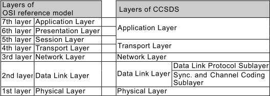  
*Figure 4.1-1 Layers of OSI Reference Model & CCSDS Recommendation for Space Communications*

Besides this, there are the SLE (Space Link Extension) recommendation for mutually supporting & connecting ground facilities & the SOIS (Spacecraft Onboard Interface Services) specifying the services of onboard subnetworks.

JAXA has so far developed spacecraft according to the CCSDS recommendations.

Including the above, communications standardization takes place to realize the following.

   - For the communications user, onboard equipment, test equipment, written procedures, ground facilities, etc. can be used in the same way even for a different spacecraft (cost & time saving).
   - By forming a logical data path between the ground end‑user & spacecraft end‑user, the user of the communications can transmit data whenever he wants without being affected by other users.
   - Mutual support (cross support) is possible (expansion of the network, support at an emergency of the spacecraft, etc., & cost & time saving in coordination work).
   - Ensuring availability, ensuring reliability & safety, & considering cost effectiveness.

### 4.2 Architecture
**4.2.1 Space communication system**
The general configuration (major communication nodes & connections) of a space communication system is shown in Figures 4.2.1-1 & 4.2.1-2. Figure 4.2.1-1 is a configuration diagram focusing on the physical configuration & Figure 4.2.1-2 is a configuration diagram focusing on the network.

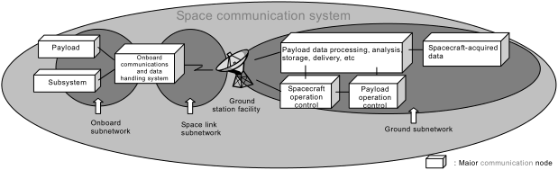  
*Figure 4.2.1-1 General configuration focusing on physical configuration*

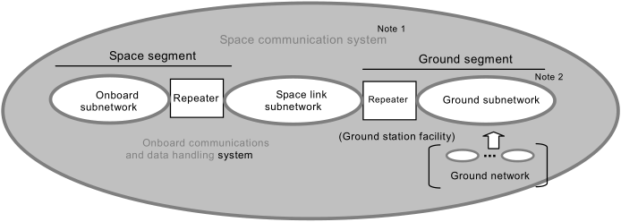  
<small>Note 1: One network formed by multiple subnetworks connected by an end‑to‑end protocol.  Note 2: The ground subnetwork is an Internet network formed by multiple ground networks connected by an Internet protocol.</small>  
*Figure 4.2.1-2 General configuration focusing on network*

Space communications consist of many different networks which can be classified into ground network, ground‑spacecraft network & spacecraft network as shown in Figure 4.2.1-1. Each network classified is a subnetwork.

   1. **Ground subnetwork:** Connection between ground nodes such as a ground station facility, spacecraft operation control, payload operation control, payload data processing, user institute, etc.
   1. **Space link subnetwork:** Connection between ground node & spacecraft node.
   1. **Onboard subnetwork:** Connection between onboard nodes such as an onboard communications & data processing system, payload, & subsystem.

These three different subnetworks are connected by an end‑to‑end protocol to make one network. This network is called a space communication system.

**4.2.2 Ground subnetwork.**  
The ground subnetwork is a network with nodes of communications for operation control of the spacecraft, operation control of the payload, processing of data acquired by the payload (data processing, analysis, archiving, delivery, etc.) & the user institute. One node on this network is a ground station (repeater).  
A ground subnetwork generally consists of multiple different networks. These multiple different networks are generally connected by IP of the TCP/IP protocol suite.  
On this ground subnetwork, an end‑to‑end protocol functions.  
In addition, a ground subnetwork needs a standard protocol (SLE, etc.) for efficient transmission & reception of packets, etc. between nodes in the ground subnetwork.

**4.2.3 Space link subnetwork.**  
The link to connect a repeater (ground station facility) of the ground subnetwork & a node repeater (onboard communications & data processing system) of the onboard subnetwork.  
This link is a radio link made of two simplexes (transmission from spacecraft to ground & transmission from ground to spacecraft). The radio link from a spacecraft to the ground is called a downlink (or a return link), & the radio link from the ground to a spacecraft is called an uplink (or a forward link). A downlink transmits telemetries & an uplink transmits telecommands. The reason for taking simplexes is there is the need to monitor the satellite even if there is no uplink & there is the need to transmit commands even if there is no downlink.  
Telecommand transmission has ARQ (automatic repeat request) or another mechanism to maintain data integrity; however, a repeat request is transmitted through another simplex (downlink). In preparation for spacecraft or link abnormalities, the telecommand transmission must be able to take place even if there is no downlink (ARQ not available), & this is a requirement.  
Connection takes place in the form of point‑to‑point or point to multipoint.  
There are cases where a relay satellite intervenes between the ground station facility & the onboard communications & data processing system. In such a case, the relay satellite functions as a repeater (signal regeneration or relay supported only by the physical layer).  
Because the space link subnetwork is a radio link of great distance, its link quality is inferior to a ground subnetwork or onboard subnetwork. Therefore, it needs a special channel coding or transmission procedure.

**4.2.4 Onboard subnetwork.**  
The onboard subnetwork is a network within the spacecraft with its subsystems & payload being nodes of communications. One node on this network is the onboard communications & data processing system (repeater).  
The number of onboard subnetworks is not limited to one either, & there are cases where a subnetwork is in turn made up of multiple subnetworks. If there are multiple subnetworks, they are connected by repeaters.

**4.2.5 Protocol architecture**

As shown in Figure 4.2.6-1, a space communication system is made up nodes connected by a standard protocol.

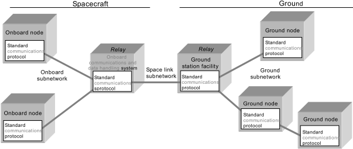  
*Figure 4.2.6-1 Space Communication System Architecture*

If modeled, Figure 4.2.6-1 can be represented by four nodes as shown in Figure 4.2.6-2.

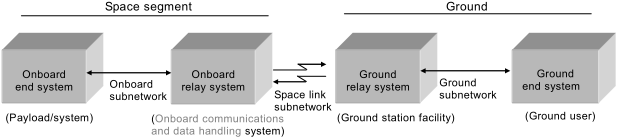  
*Figure 4.2.6-2 Model of Space Communication System*

Figure 4.2.6-2, if described based on communications protocols according to the OSI reference model, becomes a diagram as shown in Figure 4.2.6-3.

In Figure 4.2.6-3, the higher protocol is for operation (Spacecraft Monitor & Control Protocol: SM&C), & it is specified in reference document (1).

This Communications Design Standard provides the following four standard protocols as shown in Figure 4.2.6-3.

   - Ground subnetwork protocol
   - Space link subnetwork protocol
   - Onboard subnetwork protocol
   - End‑to‑end protocol

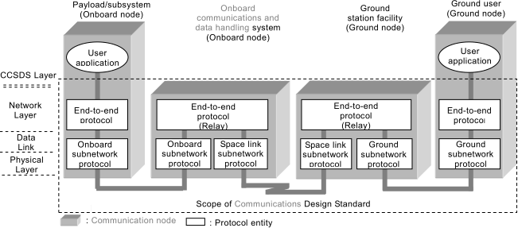  
*Figure 4.2.6-3 Communications Protocol Architecture of Space Communication System*

## 5. Requirements

### 5.1 General requirements

   1. Considering a spacecraft attitude abnormality & other kind of abnormality, the telemetry & telecommand transmission shall be ensured the required transmission link quality.
   1. Transmitted data includes the event trigger type (command, upload/download data, etc.) & the time trigger type (HK data, etc.). It shall be transmitted these data with high efficiency.
   1. A telemetry packet generated in the spacecraft shall have a time stamp of the data acquisition time.
   1. A telemetry link & command link are not always established. At an occurrence of a spacecraft abnormality, etc., the communications shall take place even with either link alone.
   1. If so required, it shall be possible to change over the type or frequency of occurrence of telemetry to be transmitted or accumulate telemetry data & transmit such data afterwards according to the operation mode or communications link condition.

### 5.2 Standard protocol

The protocols to be applied in this Communications Design Standard are shown in Table 5.2-1.

*Table 5.2-1 Standard Protocol*

|*Protocol*|*Specification name*|*Specification number*|
|:--|:--|:--|
|Ground subnetwork protocol (GSP)|TCP/IP protocol suite|RFC of IETF.|
|GSP|H-II Protocol|MAS-120001 (Note 1)|
|GSP|Space Data Transfer Protocol (SDTP)|DIOSA OSO500-1.1 (Note 2),  DIOSA OSO501-3.1 (Note 3)|
|GSP|Space Link Extension (SLE)|CCSDS910.4-B,  CCSDS 911.1-B,  CCSDS 911.5-B,  CCSDS 912.1-B|
|Space link subnetwork protocol (SSP)|(TC) TC Space Data Link Protocol|CCSDS 232.0-B|
|SSP|(TC) Communications Operation Procedure-1 (COP-1)|CCSDS 232.1-B|
|SSP|(TC) TC Sync. & Channel Coding|CCSDS 231.0-B|
|SSP|(TM) AOS Space Data Link Protocol|CCSDS 732.0-B|
|SSP|(TM) TM Sync. & Channel Coding|CCSDS 131.0-B|
|SSP|(RF) RF & Modulation|CCSDS 401.0-B|
|SSP|(RF) RF Communication System Design Standard|JERG-2-410|
|SSP|(RF) RF Link Design Standard|JERG-2-420|
|Onboard subnetwork protocol|TBD|JERG-2-430s|
|End‑to‑end|Space Packet Protocol|CCSDS 133.0-B|
<small>IETF: Internet Engineering Task Force. RFC: Request for Comment  Note 1: Applicable document 2.1.2(3)  Note 2: Applicable document 2.1.2(4)  Note 3: Applicable document 2.1.2(5)</small>

### 5.3 Ground subnetwork protocol

   1. The standard protocols used in a ground subnetwork are shown in Figure 5.3-1. To the networks on the ground, an end‑to‑end protocol for end‑to‑end connection between the ground & a spacecraft is applied on the Internet protocols (TCP/IP protocol suite) for connection between ground networks. In addition to these two protocols, the SLE (Space Link Extension) recommendations of CCSDS (applicable documents: CCSDS recommendations (9) to (12)) are applied as a protocol for mutual support (cross support) when sending & receiving packets or frames between ground institutes.
   1. In regard to application of the SLE recommendation: Before SLE recommendation was established, JAXA had developed & used JAXA‑specific H-II protocol (applicable document: JAXA document (3)) & SDTP (Space Data Transfer Protocol) (applicable document: JAXA documents (4) & (5)). To the connection with other institutes, the SLE recommendation is applied as standard; however, between pieces of equipment within JAXA, the H-II protocol & SDTP are also JAXA standard.
   1. When applying the SLE recommendation of CCSD, it shall be applied the RAF service to the telemetry transfer service & the CLTU service to the TeleCommand transfer service.

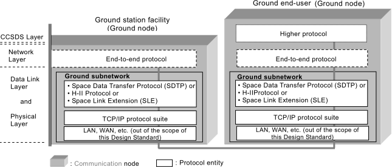  
*Figure 5.3-1 Architecture & Standard Protocols of Ground Subnetwork*

### 5.4 Space link subnetwork protocol
The standard protocols used on the space link subnetwork are shown in Figure 5.4-1.

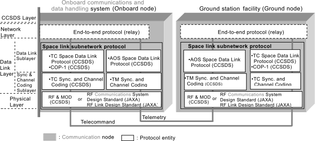  
*Figure 5.4-1 Architecture & Standard Protocols of Space Link Subnetwork*

**5.4.1 Physical layer.**  
RF & Modulation (applicable document: CCSDS Recommendation (7)) of CCSDS, the RF Communications System Design Standard (applicable document: JAXA document (1)) & the RF Link Design Standard (applicable document: JAXA document (1)) shall be applied.

**5.4.2 Telecommand synchronization & channel coding sublayer**

   1. CCSDS TC Sync. & Channel Coding (applicable document: CCSDS Recommendation (4)) shall be applied.
   1. Multiple packets can be transmitted in one CLTU; however, note that the throughput can lower when transmitting multiple packets per CLTU.
   1. As the decoding mode, the two modes shown in Table 5.4.2-1 are available. These two modes differ in transmission quality (CLTU discard rate, undetected error rate & throughput). For each spacecraft, it shall be made a selection based on the required transmission quality.
   1. Whether or not to apply randomization depends on the bit synchronization characteristics of the command receiver. In general, it is desirable to apply it.
   1. PLOP (Physical Layer Operations Procedure) includes PLOP1 & PLOP2. PLOP2 shall be used.

*Table 5.4.2-1 Decoding mode*

|*Decoding mode*|*Start sequence detection mode*|*Start sequence detection mode*|*BCH decoding mode*|*BCH decoding mode*|*Frame error control mode (CRC)*|
|:--|:--|:--|:--|:--|:--|
| |**All bit agreement**|**1‑bit error allowed**|**Triple Error Detection (TED)**|**Single Error Correction (SEC)**| |
|Error‑Detecting|◯|—|◯|—|No|
|Error Correcting|—|◯|—|◯|Yes|

**5.4.3 Telecommand data link protocol sublayer**

   1. The TC Space Data Link Protocol (applicable document: CCSDS Recommendation (5)) shall be applied.
   1. There are seven services. Apply them with an understanding of their use. Commonly used services are the Virtual Channel Packet (VCP) service & COP Management service.
   1. In case of the Error Correcting mode (Table 5.4.2.2-1), the frame error control (CRC) shall be used (otherwise, undetected errors increase).
   1. VCID shall use 0 or 0 & 1 (in case of changing over the main & subordinate systems) only.
   1. For the operation procedure, CCSDS Communications Operation Procedure-1 (COP-1) (applicable document: CCSDS Recommendation (6)) shall be applied.

**5.4.4 Telemetry synchronization & channel coding sublayer**

   1. TM Sync. & Channel Coding (applicable document: CCSDS Recommendation (1)) shall be applied.
   1. The transmission control code is generally used in the combinations shown in Figure 5.4.4-1. Different combinations differ in coding gain. For each spacecraft, make a selection based on the required coding gain.
   1. Whether or not to apply randomization depends on the bit synchronization characteristics of the telemetry receiver. In general, it is desirable to apply it.

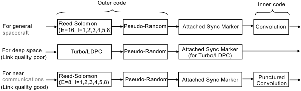  
*Figure 5.4.4-1 General code usage*

**5.4.5 Telemetry data link protocol sublayer**

   1. The AOS Space Data Link Protocol (applicable document: CCSDS Recommendation (8)) shall be applied.
   1. There are seven services. Apply them with an understanding of their use. Commonly used services are the Packet service & Virtual Channel Operational Control Field (VC_OCF) service.
   1. When transmitting CLCW, CLCW shall be transmitted in VC_OCF (Presence of Operational Control Field).

### 5.5 Onboard subnetwork protocol

**5.5.1 Protocol architecture**

The protocol architecture & the protocols of an onboard subnetwork are shown in Figure 5.5-1.

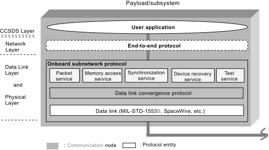  
*Figure 5.5-1 Architecture of Onboard Subnetwork*

A data link of an onboard subnetwork uses the protocol (for example, MIL-STD-1883B, [SpaceWire](spacewire.md), etc.) with functions corresponding to the bottom two layers of the OSI reference model.

An onboard subnetwork interfaces with an upper application with five standardized services. (Note 1)

The data convergence protocol of an onboard subnetwork is the function for standardizing the services for various data links. A data link is required of the six functions shown in Section 5.5.2; however, all protocols used for a data link do not necessarily provide these six functions. If the protocol used lacks these functions, these are made up for by the data convergence protocol. (Note 2)

   - Note 1: When an upper application is interfaced with a data link, it is influenced by the protocol used for the data link. Therefore, a standard service independent of the protocol used for the data link has been established.
   - Note 2: When implementing, the three independent standard protocols (service, convergence & data link) are not generally used in combination. A protocol for the service (including the convergence function) exists corresponding to the data link. The interface with an upper application is the same even for a different data link.

**5.5.2 Data link**

The requirements for a data link are the following six functions. It is desirable that all data links satisfy these six requirements.

   1. Redundant function: The function to transmit data from a source end point to a destination end point in one network through a redundant transmission line. The transmission lines in the main system shall be independent of the transmission lines in the subordinate system.
   1. Retransmission function: The function of resending data if the transmitted data could not reach the destination because of loss or a transmission error.
   1. Segmentation function: The function of the sending side dividing & transmitting the data from an upper application & the receiving side joining & the divided data & transmitting the joined data to the upper application. This function is used in the following cases. (a) In the case where the data length of an upper application exceeds the maximum data length that can be transmitted on the data link, & (b) in the case where long data transmission of an upper application causes an unnecessary delay in short data transmission of another upper application.
   1. Traffic management: In general, one of the following. (a) without transmission band assignment & with the retransmission function, (b) without transmission band assignment & without the retransmission function, (c) with transmission band assignment & without the retransmission function, & (d) with transmission band assignment & with the retransmission function.
   1. Priority control: The function of transmitting high‑priority data preferentially.
   1. Protocol multiplexing function: The function of multiple networks or an upper layer to access a service of a subnetwork layer by the protocol identification capability unique to the subnetwork.

**5.5.3 Service**

The services interfacing with an upper application are shown below.

   1. Packet service: The packet service of an onboard subnetwork transfers packets (octet data (data of a variable length of an integer multiple of 8 bits)) from an end point of the onboard subnetwork to another end point of the same onboard subnetwork.
   1. Memory access service: The memory access service of an onboard subnetwork reads or writes data from or to a memory in a node of the onboard subnetwork.
   1. Synchronization service: The synchronization service of an onboard subnetwork synchronizes the time commonly used in subnetworks.
   1. Device service: The device service of an onboard subnetwork notifies the users in the onboard subnetwork of the presence of a device.
   1. Test service: The test service of an onboard subnetwork tests the functionality or connectivity of the subnetwork.

### 5.6 End‑to‑end protocol

   1. Apply the Space Packet Protocol (applicable document: CCSDS Recommendation (2)).
   1. Be sure to enter a time stamp indicating the data acquisition time in the secondary header of the telemetry packet.

(For reference) Outline of Space Packet Service  
The space packet protocol transmits space packets from one source user application to one or more destination user applications by unidirectional data transmission through one or more subnetworks. The path of this transmission is called “Logical Data Path (LDP)” & the identifier of this path (Path ID) is called APID (Application Process Identifier). (Figure 5.6-1)

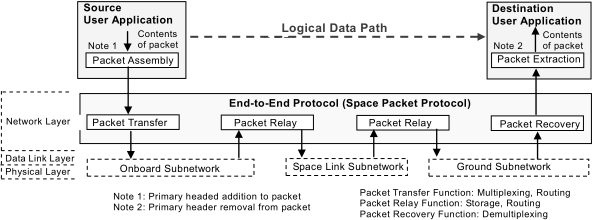  
*Figure 5.6-1 Space Packet Service*

## 6. Verification requirements

### 6.1 Verification types & purpose
It is a matter of course to verify that the fabricated product conforms to the required specifications (quality verification); here, a compatibility test to verify as a communication system is specified. As shown in Table 6.1-1, the compatibility test includes three types.

*Table 6.1-1 Verification of Communication System*

|*Test name*|*Purpose*|*Remarks*|
|:--|:--|:--|
|Subsystem/Payload Compatibility Test|In addition to verifying the onboard data bus protocol, verify the compatibility of the subsystems/payload with the various databases of the operation control system.| |
|RF Compatibility Test|Verify the compatibility of the physical interfaces between the ground & spacecraft.| |
|End‑to‑end Test|Data through test| |

### 6.2 Subsystem/payload compatibility test

   1. The test system is shown in Figure 6.2-1.
   1. Verify the compatibility of the subsystem/payload with the onboard subnetwork protocol & the upper protocol (for operation) of the spacecraft operation control system (shown by the arrows in Figure 6.2-1(a)), according to the test configuration example in Figure 6.2-1(b).
   1. As a general rule, this test shall be done before mounting the subsystem or payload on the spacecraft.

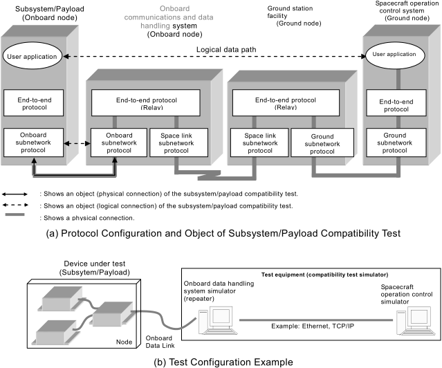  
*Figure 6.2-1 Subsystem/Payload Compatibility Test*

### 6.3 RF compatibility test

   1. The test system is shown in Figure 6.3-1.
   1. The object of the test is the physical layer (solid arrow in Figure 6.3-1) of the space link subnetwork protocol. Include the data link layer if necessary (dashed arrow in Figure 6.3-1).
   1. Coordinate the test method & test schedule with the groung station which uses the communications.

  
*Figure 6.3-1 Protocol configuration & object of RF compatibility test*

### 6.4 End‑to‑end test
   1. The test system is shown in 6.4-1.
   1. This is a data through test (physical connection confirmation test) between the spacecraft & spacecraft operation control system. (Figure 6.4-1)
   1. This test shall be conducted before the launch of the spacecraft.

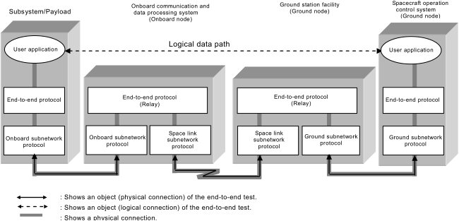  
*Figure 6.4-1 Protocol Configuration & End‑to‑end Test*

 

## Docs & links
|Navigation|
|:--|
|**[FAQ](faq.md)**【**[SCS](scs.md)**·КК, **[SC (OE+SGM)](sc.md)**·КА】**[CON](contact.md)·[Pers](person.md)**·Контакт, **[Ctrl](control.md)**·Упр., **[Doc](doc.md)**·Док., **[EF](ef.md)**·ВВФ, **[Error](error.md)**·Ошибки, **[Event](event.md)**·События, **[FS](fs.md)**·ТЭО, **[HF&E](hfe.md)**·Эрго., **[KT](kt.md)**·КТ, **[Model](model.md)**·Модель, **[N&B](nnb.md)**·БНО, **[Project](project.md)**·Проект, **[QM](qm.md)**·БКНР, **[R&D](rnd.md)**·НИОКР, **[SI](si.md)**·СИ, **[Test](test.md)**·ЭО, **[TRL](trl.md)**·УГТ, **[Way](way.md)**·Пути|
|*Sections & pages*|
|**【[Documents](doc.md)】**  **Схема:** [КСС](ксс.md)・ [ПГС](пгс.md)・ [ПЛИС](плис.md)・ [СхД](draft_model.md)・ [СхО](draft_model.md)・ [СхПЗ](draft_model.md)・ [СхЧ](draft_model.md)・ [СхЭ](draft_model.md)  [Interface](interface.md)・ [Mission proposal](proposal.md)|

   1. Docs: [PDF ❐](f/doc/jp/jerg_2_400.pdf)
   1. <…>
