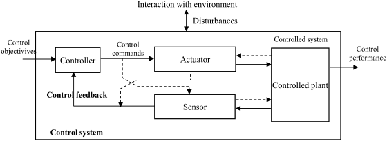
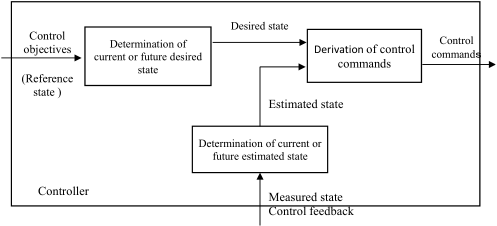
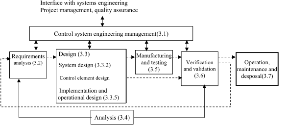
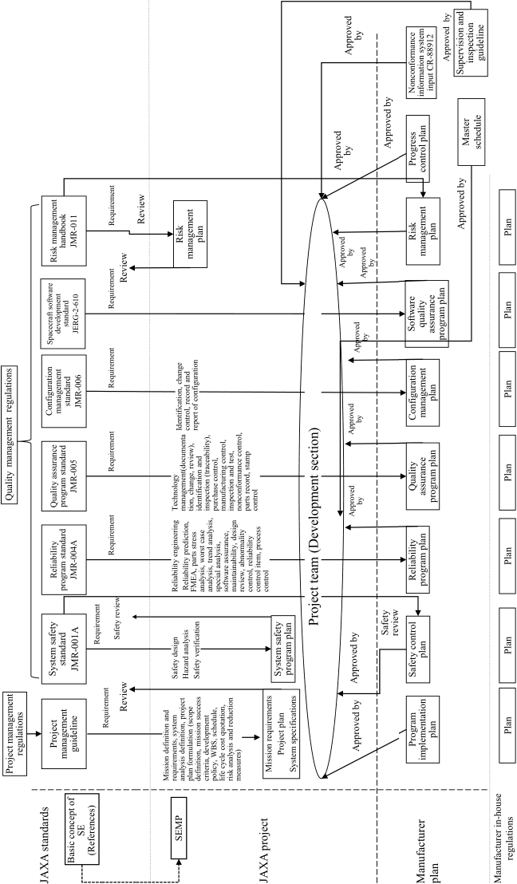

# JERG-2-500
> 2014.03.14 [🚀](../index/index.md) [despace](index.md) → [Doc](doc.md), [R&D](rnd.md)

[TOC]

---

> <small>**JERG-2-500 Control System Design Standard** — EN term. **ЖЕРГ-2-500 Стандарт проектирования системы управления** — literal RU translation.</small>

JERG-2-500A  
DESIGN STANDARD  
CONTROL SYSTEM  
Mar 17,2014  
[Japan Aerospace Exploration Agency](zz_jaxa.md)

This is an English translation of JERG-2-500A. Whenever there is anything ambiguous in this document, the original document (the Japanese version) shall be used to clarify the intent of the requirement.

*Disclaimer*  
The information contained herein is for general informational purposes only. JAXA makes no warranty, express or implied, including as to the accuracy, usefulness or timeliness of any information herein. JAXA will not be liable for any losses relating to the use of the information.

Published by  
Japan Aerospace Exploration Agency  
Safety & Mission Assurance Department  
2-1-1 Sengen Tsukuba-shi,Ibaraki 305-8505, Japan  

## 1. General Provisions

### 1.1 Purpose

Developing control systems applied to space systems requires cooperation with multi‑disciplinary technology field. Control system is often comprised of a large system integration of these technology fields. The development also requires cooperation with higher level systems & the systems engineering method. The systems engineering related to control systems development of space system s is called control engineering (CE) (general technology activities related to control system development process).

The purpose of this standard is to provide general design guidelines for the entire life cycle in control systems development including the systems engineering method required for developing control systems applicable to space systems.

The analysis, design & implementation of more complex (end‑to‑end) control systems have important aspects of system engineering, electrical & electronic engineering, mechanical engineering, software engineering, communications, ground systems & operations — all of which have their own dedicated Japan Aerospace Exploration Agency (hereinafter referred to as “JAXA”) standards. For the relevant aspects, these standards shall apply & the Control Engineering Standard does not intend to duplicate them.

This standard provides a structured set of systematic engineering guidelines how to apply these standards to control development. In other words, this standard aims at realizing a systematic use of the standards appropriate to control engineering‑specific items as systematic technology means referring to various standards. For rapid progress in control engineering & de facto standards (industry standards) of related fields, we have not reached a satisfactory level to apply this standard directly for designing specific control systems, control equipment or describing interface specifications. The third level standard is prepared for these purposes. This standard specifies which standard is to be applied to control systems design & control equipment design in specific fields.

This standard is not a text book for theory & technology related to control systems. Such material has excluded intentionally. The fourth level handbooks are prepared for such purpose. Please refer to these handbooks.

### 1.2 Scope
This standard deals with control systems developed as part of the space project. The standard applies to all elements of space systems including space segment, ground segment & launch service segment.

This standard covers all fields & life cycles of space systems development including requirement definition, analysis, design, manufacturing, verification, validation, transfer, spacecraft system test, operation & maintenance.

This standard covers all aspects of space‑related control engineering. This standard defines the scope of the space control engineering process & its interfaces with project management & product assurance, & explains how they apply to the control engineering process.

If the standard is applied to a specific project, the requirements specified in this standard shall be tailored in accordance with the project conditions.

### 1.3 Related documents
**1.3.1 Document system**

This standard is a second level document of the JAXA's spacecraft (spacecrafts & probes) technical standard. The system of documents related to control system design standard shall be shown in Appendix I (including system of related documents).

**1.3.2 Applicable documents**

The documents applicable to this standard shall be as follows. The following documents shall be part of this standard in the range specified in the standard. If the standard conflicts with any of the applicable documents, this standard shall prevail unless otherwise specified. It is recommended that the user of this standard review the application of the latest version of applicable documents.

   1. Basic concept of systems engineering, First edition
   1. Project Management Guideline
   1. JMR-001B — System Safety Standard
   1. JMR-004C — Reliability Program Standard
   1. JMR-005A — Quality Assurance Program Standard
   1. JMR-006 — Configuration Control Standard
   1. JERG-2-610 — Software Development Standard for Spacecraft
   1. JERG-2-700 — Operation Design Standard

**1.3.3 References**

   1. JMR-011 — Risk Management Handbook
   1. ECSS-E-60A — Control engineering (14 September 2004)
   1. The handbooks & manuals related to this standard shall be as follows: (Third & fourth level documents)
      - JERG-2-510A — Attitude Control System Design Standard
      - JERG-2-151 — Mission & Orbit Design Standard
      - JERG-2-153 — Pointing Control Standard
      - JERG-2-152 — Internal Disturbance Control Standard
      - Mission & Orbit Design Handbook
      - Internal Disturbance Control Manual
      - Standard Coordinate System & Time System Usage Manual
      - Basic Manual for Attitude Kinematics & Dynamics of Spacecrafts
      - Attitude Control System Technology Handbook
      - Attitude Control System Component Technology Handbook
      - Attitude Control System Verification Technology Handbook

### 1.4 Terminology & Abbreviation

**1.4.1 Terminology**

Some of following terms are quotation from ECSS-E-60A & may differ from general definitions.

   1. Actuator: Technical system or device which converts commands from the controller into physical effects on the controlled plant.
   1. Autonomy: Capability of a system to perform its functions in the absence of certain resources. It is differentiated from automatic operation by automatic commands.
   1. Control: Function of the controller to derive control commands to match the current or future estimated state with the desired state. NOTE In narrow sense, control is defined as above in this standard. In broad sense, it refers to all functions to match the current or future estimated state to the desired state.
   1. Control command: Output of the controller to the actuators & the sensors. NOTE This definition is applicable to sensors with command interface.
   1. Control component: Element of control systems which is used in part or in total to achieve the control objectives.
   1. Control feedback: Input to the controller from the sensors & the actuators. NOTE This definition is applicable to actuators with status feedback.
   1. Control function: Group of related control actions (or activities) contributing to achieving some of the control objectives. NOTE A control function describes what the controller does, usually by specifying the necessary inputs, boundary conditions & expected outputs.
   1. Control mode: Temporary operational configuration of control systems implemented through a unique set of sensors, actuators & controller algorithms acting upon a given plant configuration.
   1. Transition of control mode: Passage or change from one control mode to another.
   1. Control objective: Goal that the controlled system is supposed to achieve. NOTE Control objectives are issued as requests to the controller, to give the controlled plant a specified control performance despite the disturbing influences of the environment. Depending on the complexity of the control problem, control objectives can range from very low level commands to high level mission goals.
   1. Control performance: Quantified capabilities of a controlled system. NOTE 1 The control performance is usually the quantified output of the controlled plant. NOTE 2 The control performance is shaped by the controller through sensors & actuators.
   1. Control system: Part of a controlled system which is designed to give the controlled plant the specified control objectives. NOTE Control systems shall include all functions related to the controller, sensor & actuator.
   1. Controllability: System which is described in the equation of linear state & property of a given plant to be steered from a given state to any other given state. NOTE This mainly refers to linear systems, even if it applies also to nonlinear ones.
   1. Controlled plant: Physical system, or one of its parts, which is the target of the control problem. NOTE 1 The control problem is to modify & shape the intrinsic behavior of the plant such that it yields the control performance despite its (uncontrolled other) interactions with its environment. For space systems, the controlled plant can be a launcher rocket, a satellite, a cluster of satellites, a payload pointing system, a robot arm, a rover, a laboratory facility, or any other technical system. NOTE 2 The controlled plant is also referred as the plant.
   1. Controlled system: Control relevant part of a system to achieve the specified control objectives. NOTE This includes control systems & the controlled plant.
   1. Controller: Control component designed to give the controlled plant a specified control performance. NOTE The controller interacts with the controlled plant through sensors & actuators. In its most general form, a controller can include hardware, software, & human operations. Its implementation can be distributed over the space segment & the ground segment.
   1. Desired state (quantity): Set of variables or parameters describing the controller internal reference for derivation of the control commands. NOTE 1 The desired state is typically determined from the reference state, e.g. by generation of a profile. NOTE 2 The difference between desired state & estimated state is typically used for the derivation of the control commands (See Figure 2-1).
   1. Disturbance: Physical effect affecting the control performance that can act onto all components of the controlled system. NOTE The source of the disturbance can be internal (if generated inside the controlled system) or external (if coming from the environment).
   1. Environment: Set of external physical effects that interact with the controlled system. NOTE The environment can act as disturbance on the plant but also on sensors, actuators & the controller.
   1. Estimated state (quantity): Set of variables or parameters describing the controller internal knowledge of the controlled system & environment.
   1. Estimator: Algorithm to determine the current or future state (estimated state) of a dynamic system from the measured state.
   1. Guidance: Function of the controller to define the current or future desired state. NOTE The desired state may be determined outside the controller, which is defined as a guidance function in a broad sense.
   1. Implementation: Actual realization of a specific function in terms of algorithms, hardware, software, or human operations.
   1. Mathematical model: Mathematical description of the behavior of the plant, a control system component or the environment. NOTE This consists of algorithms, formulas & parameters.
   1. Measured state (quantity): Set of variables or parameters derived from physical measurements. Note This is based on the control feedback of sensors & actuators.
   1. Navigation: Function of the controller to determine the current or future estimated state from the measured state.
   1. Observablity: A property of determining the initial state based on the time response of input & output at any given time in a system described in the equation of linear state.
   1. Quantization: Process by which system variables are converted to the multiple of the minimum unit (discrete finite unit). When applied to analogue‑digital conversion, the accuracy of quantization becomes better, if smaller minimum unit (physical quantity corresponding to LSB) is selected.
   1. Reference state (quantity): Set of variables or parameters describing the control objectives for a controlled system.
   1. Robustness: Property of a controlled system to achieve the control objectives in spite of uncertainties. NOTE 1 The uncertainty can be divided into • Signal uncertainty, when disturbances acting on the controlled system are not fully known in advance. • Model uncertainty, when the parameters of the controlled system are not well known. NOTE 2 Robustness is achieved using suitable control algorithms that act against these disturbances or are insensitive to controlled system parameter variations (e.g. inertia, stiffness).
   1. Sensor: Device that measures states of the controlled plant & provides them as feedback inputs to the controller.
   1. Simulation: Execution of a mathematical model in an environment to calculate the behavior of the model. NOTE It is usually implemented by use of a computer program.
   1. Stability: Property that defines the state quantity describing the system limits of the finite range (no divergence). NOTE In a strict sense, stability is defined such as asymptotically stable or asymptotically stable in the large & so on. Asymptotically stable in the large which finally converges to the origin or objective regardless of the initial state may be required. In control system design, it shall be necessary to consider the stability of dynamic systems in addition to the stability of control systems in a broad sense.
   1. State (quantity): Set of variables or parameters describing the dynamic behavior of the controlled system at a given time. NOTE 1 State is also referred to as state vector. NOTE 2 The state can describe the true, reference, desired, measured or estimated behavior (See Figure 2-1).
   1. True state: Set of variables or parameters defining the actual behavior of the controlled system & environment. NOTE 1 The true state is not known. NOTE 2 In a simulation, the true state is the simulated state of the sensors, actuators, plant & environment excluding any measurement error of the sensors.
   1. De‑orbit: Putting a spacecraft out of the operational orbit to protect the orbit environment after the mission is completed. If a spacecraft may drop to the ground, disaster prevention measures shall be taken.

**1.4.2 Abbreviation.**  
Key abbreviations used in this standard shall be as follows:

   - 3D — Three‑Dimensional
   - A/D — Analogue‑Digital Conversion
   - AOCS — Attitude & Orbit Control System
   - A&D — Automation & Robotics
   - BOL — Beginning‑of‑Life
   - CAD — Computer Aided Design
   - CAE — Computer Aided Engineering
   - CAS — Control Algorithm Specification
   - CE — Control Engineering
   - D/A — Digital‑Analogue Conversion
   - EGSE — Electrical Ground Support Equipment
   - EOL — End‑of‑Life
   - FDIR — Failure Detection, Isolation & Recovery (or Reconfiguration)
   - EM — Engineering Mode
   - FOV — Field of View
   - GNC — Guidance, Navigation & Control
   - GPS — Global Positioning System
   - H/W — Hardware
   - I/F — Interface
   - ICD — Interface Control Document
   - LOS — Line of Sight
   - MGSE — Mechanical Ground Support Equipment
   - MMI — Man‑Machine Interface
   - PA — Product Assurance
   - PDR — Preliminary Design Review
   - PPP — Phased Project Planning
   - PSD — Power Spectral Density
   - RMS — Root Mean Square
   - SE — Systems Engineering
   - SEMP — Systems Engineering Management Plan
   - STM — Structural & Thermal Model
   - S/W — Software
   - TBD — To Be Defined
   - TT&C — Telemetry, Tracking & Command
   - SOOH — Spacecraft On‑orbit Operations Handbook
   - SOCP — Spacecraft On‑orbit Checkout Procedure
   - SOP — Spacecraft Operations Procedure

### 1.5 Unit
International system of units (SI) shall be used. (If it is difficult to use SI in a common fashion, conventional units shall be included.)

## 2. Procedures of control system design

### 2.1 General

**2.1.1 Configuration of control system**

To indicate the scope of control engineering which this standard applies, the structure of a general control system is shown in Figure 2-1.

Control systems shall refer to the "control‑relevant part of system in for achieving control objectives" & consist of control system (including control elements such as controller, sensors & actuators for achieving control objectives) & controlled plant.

Control systems always includes a certain type of feedback loop. A controlled plant is a physical system which cannot meet its expected performance unless the behavior or output is controlled (corrected or formed). The scope of this standard in the space field shall include the following controlled plant which has specific dynamic characteristics because the controlled plant is placed in the space or other celestial bodies.

   - Spacecraft (its attitude, orbit) or a cluster of satellites
   - Reentry, landing, rendezvous or docking of spacecraft
   - Pointing control
   - Robot arm system
   - Rover
   - Automated payload & laboratory facility
   - Any other technical system involving control

“Thermal Control System Design Standard” (JERG-2-310) includes details of thermal control including active control. Thus, it shall be out of the scope of this standard.

Launch rockets shall be out of the scope of this standard because they differ from satellites.

  
*Figure 2-1 Structure of general control system*  
ECSS-E-60A Control engineering (14 September 2004)

The purpose of control engineering is to allow controlled plant to achieve control objectives under disturbances from the environment (achieve desired control performances) & to develop control systems necessary to achieve.

For this purpose, proper equipment such as actuators (a system or an equipment for converting controller's commands into physical effects in a controlled plant) & sensors (equipment for measuring the state quantity of a plant & provide control feedback to the controller) shall be used. The above‑mentioned basic information flows (classical‑style feedback loop) are shown in continuous lines in Figure 2-1. Secondary information flows or physical responses are shown in dashed lines.

In a complex system, cross‑coupled portions exist in signals between sensorｓ & actuatorｓ. In other words, feedback signals from the sensors are compensated with control commands (the configuration of sensor parameters is changed for compensation) & signals from the actuators directly compensate the control feedback. The movement of a plant brings physical effects to the sensors & actuators incidentally & allows the sensor action (function) to provide feedback to the plant. Control objectives (as reference input to the controller) shall cover a wide range from lower level commands to mission objectives (such as soft landing on the surface of Mars). In the latter case, the controller, sensors, actuators & controlled plant are composed of many levels & divided into lower levels properly & include information flow from lower level control to higher level control.

Control performances vary from lower level to higher level. Accordingly, the controllers vary greatly in terms of structure, including simple & extremely complex devices. Generally, controllers are considered as follows;

   - Digital or analog electronic equipment, software & human operation
   - Elements of space segment & ground segment (when the control loop is closed via the ground)
   - Plan (off‑line command generation) & execution (on‑line operation)
   - Nominal & backup control (exception handling, FDIR (Fault Detection, Isolation & Recovery))

For the concept of these controllers, the functions of controllers in control systems are defined using terms in automatic control.

In a particular phase or mode of the mission, the allocation of control functions among hardware, software & human operation, between space segment & ground segment, between command planning & execution shall be determined by trade‑offs of status predictability (availability of reliable model), response time, usable resource of onboard computer, usable telecommunication bandwidth & coverage, complexity in decision making, development & operational cost & allowable risks, & so on.

Human operation & ground system are necessary elements to achieve control performances as higher level controllers. It is important to consider these elements. Refer to “Operation Design Standard” (JERG-2-700) for operation & ground segment. This standard describes only specific requirements of control system.

In a classical‑style control theory, controllers shall have an internal function structure as shown below (See Figure 2-2).

   - Determination of current or future desired state
   - Determination of current or future estimated state
   - Derivation of control commands

  
*Figure 2-2 Example of controller composition*  
ECSS-E-60A Control engineering (14 September 2004)

This functional concept can be applicable not only to controllers in which are some of the functions are absent, when the desired state is identical with the reference state but also to complex controllers determining the current & future desired state including calculations on the entire orbit, & so on. In the guidance, navigation & control (GNC) system, the three functions of controllers shown in Figure 2-2 shall correspond to the following classical‑style guidance, navigation & control functions.

   - Determination of current or future desired state ↔ Guidance function
   - Determination of current or future estimated state ↔ Navigation function
   - Derivation of control commands ↔ Control function

In addition to the functional structure of a classical‑style controller as shown in Figure 2-2, controllers applicable to this standard shall include functions such as control mode switching (internal controllers, sensors & actuators), monitoring of control system & controlled plants state, updating of models & FDIR.

**2.1.2 Control system design activities (design technology overview)**

According to the structure of a general control system as mentioned in the previous paragraph, control engineering includes the following activities as a minimum.

   - Analysis of mission objectives to define the control objectives
   - Analysis of controlled plant modeling & interaction with the environment
   - Modeling of sensors & actuators (configuration & characteristics) & analysis related to control requirements
   - Requirement analysis & specification, design & configuration of the controller
   - Verification of the control performances
   - Ground operation & verification test related to control systems

As a result, control engineering is defined as systems engineering activities integrating the following engineering fields.

   - The technology requires multidimensional knowledge including mechanics, dynamics, space environment & its effects, digital, analog electronic equipment, control theory, computer systems & networks, software engineering & operations.
   - It is technology which has a system aspect & therefore a significant level of interaction with the systems engineering process.

### 2.2 Definition of control engineering process
Control engineering applied to control systems development shall be part of systems engineering & performed in close cooperation with systems engineering. “Phased Project Planning” (PPP) is employed for reliable & efficient development of large‑scale systems such as control systems with high quality. In PPP, it shall be required to divide the entire development into some phases & define activities to be performed in each phase in phases. The results in each phase shall be evaluated through review. Phases shall be advanced by making go/no‑go decision of transition to next phase. This flow shall be referred to as project life cycle & generally divided into the following phases;

   - Phase 0 to Phase A — Definition of mission requirements, determination of system requirements, Conceptual design.
   - Phase B — Preliminary design & prototyping of systems, subsystems & components, Preliminary/architectural design.
   - Phase C — Detailed design of systems, subsystems & components. (including EM/STM test & assessment in the case of satellite). Detailed design.
   - Phase D — Manufacturing, integration testing. Maintenance design.
   - Phase E — Launch, operation.
   - Phase F — Post‑operational phase, disposal.

In each phase, control engineering consists of the following activities;

   1. Control systems engineering management (integration & control). Activities for integrating control‑related fields through all project phases to define & realize the entire control system.
   1. Design. In each design phase, design activities shall consist of the following operations:
      1. Requirement analysis. Proper interpretation of mission & system requirements, derivation of proper control requirements with consistency, requirement definition of lower level components, continual monitoring of state & traceability of these requirements.
      1. Analysis. Analysis at all levels or in all fields to solve problems concerning functional & performance requirements related control. Including alternative solution assessment, control performance verification, & test supplement, & so on.
      1. Design (system design & control element design). Activities to design physical control architecture & controllers which satisfy control requirements while receiving proper support of analysis & trade‑offs. Design includes activities to evaluate all functions & performances & allocate as control system requirements by using a proper method in accordance with margin policies. Design process includes the following activities;
         - System design:
            - Architectural design (including trade‑offs)
            - Configuration & functional design
         - Control element design:
            - Controller design
            - Component design
         - Implementation & operational design
      1. Manufacturing & testing
      1. Verification & validation. It shall be required to demonstrate that control systems conforms to the control objectives & requirements.
      1. Operation, maintenance & disposal

These activities related to control engineering shall be performed in parallel to support interactively under proper development of control system & its component in various phases in system development. The interactions are shown in Figure 2-3.

  
Numbers in parentheses ( ) are section numbers in this standard corresponding to each activity  
*Figure 2-3 Interaction among control engineering activities (control system design standard)*

The processes performed in each control engineering tasks are summarized in Table 2-1.

*Table 2-1 Summary of control engineering tasks*

|*Control engineering activities*|*Control engineering tasks*|
|:--|:--|
|Control systems  engineering management  (integration & management)|• Control engineering plan management: Organization & planning of control engineering activities.  ・Document & database management: Data supplied to systems engineering database.  ・Interface control: Interface management & activities (such as procurement control & quality assurance) with other fields (such as electrical, mechanical & software engineering).  ・Human engineering: Coordination with human engineering domain as part of the controller.  ・Allocation & margin control: policy of allocation & margin for control.  ・Assessment related to cost effectiveness: Assessment of control engineering & cost effectiveness (preliminary assessment).  ・Risk management.  ・Procurement management: Engineering support to control system component procurement.  ・Configuration management & change control: Engineering change control related to control including in‑flight maintenance.  ・Design ability & resource control: Assessment of ability & resource related to control engineering (preliminary assessment).  ・Safety control, reliability control & quality assurance.|
|Requirements analysis|• Generation of control requirements based on mission & system requirements.  ・Coordination between control requirements & system requirements.  ・Requirements allocation to lower level elements & components of control systems.  ・Definition of software requirements.  ・Definition of interface requirements among control system components.  ・Definition of control system operational requirements.  ・Definition of control system verification requirements (including design requirements enabling verification test).|
|Analysis|• Selection of adequate analysis tools & analysis methods.  ・Refinement of requirements assessment & budgets breakdown.  ・Disturbance assessment.  ・Numeric trade studies to support the definition of control systems configuration from the viewpoint of requirements including program constraints such as cost, schedule, & risks.  ・Numerical analysis to support control system design.  ・Performance verification analysis (including simulation).  ・Numerical analysis to support in‑flight evaluation.|
|Design (system  design & control  system elements  design)|(1) System design of control system  ・Architectural design (system trade‑offs).  ・Functional & configuration design: configuration definition of control system function (including functional interface).  ・Operational mode design: Definition of operational configuration (modes).  ・Component requirements design.  ・Interface design.  ・Design enabling ground verification test.  ・System configuration control support.  ・Design error prevention.  (2) Control system elements design  ・Controller design: Definition of physical architecture (H/W, S/W, human operation).  ・Control concept, algorithm design.  ・Control system trade‑offs.  ・Support to procurement of control system components.|
|Verification  & demonstration|• Definition of strategy related to verification & validation (including specification of test environment requirements).  ・Preliminary performance verification using analysis or prototyping.  ・Final functional & performances verification by analysis.  ・Final verification & validation of control system (H/W, S/W, human operation) by hardware‑in‑the‑loop tests.  ・In‑flight validation of control system behavior.|
|Operation, maintenance  & disposal|• Setting of operational, maintenance & disposal requirements.  ・Summarize the information necessary for operation according to operational requirements.  ・Support to preparation of operational documents, operation & maintenance management.  ・Support to disposal operation including de‑orbit, & so on.|

After the functional specifications of controllers are specified, design & development (or procurement) activities such as software, hardware & ground verification tests & operational support shall be performed as control engineering processes by some divisions in parallel or systematically. After all, control engineering processes are as follows;

   - Interactive processes between systems engineering & lower level parts or components engineering. The purpose of control engineering processes is to implement these interactive processes.
   - Processes from preliminary design to verification & in‑flight validation. Normal control engineering activities & input/output with respect to time series phases in the project are shown in Section 2.3.
   - Particularly interactive processes of requirement analysis, function & composition design, verification, validation & analysis.

### 2.3 Control engineering tasks per project phase
The primary control engineering tasks & main input/output in each phase of the project shall be shown in Table 2-2 to Table 2-5 (including Quotation from ECSS-E-60A Control engineering (14 September 2004))

*Table 2-2 Definition of control engineering tasks & input/output, Phase 0 & A (conceptual design)*

| |*Control engineering management (integration & control)*|*Requirements analysis*|*Analysis*|*Design (control system & elements design)*|*Verification & demonstration*|*Operation, maintenance & disposal*|
|:--|:--|:--|:--|:--|:--|:--|
|Inputs|• System development schedule  ・System development policy & constraints|• System objectives  ・Mission requirements  ・System performance requirements  ・Ground verification test requirements|• Control system objectives  ・Conceptual control system requirements|• Control system design concept of similar space system|• System verification & validation approach|• Operation, maintenance & management requirements|
|Tasks|• First assessment of control system development cost & schedule  ・Generation of inputs with respect to system development policy  ・Identification of usable control system technology (maturity assessment)|• Translation from system & mission requirements to control objectives in conceptual design phase  ・Definition of control requirements in conceptual design phase  ・Definition of control system life cycle  ・Consideration with respect to the ground verification test items (including spacecraft system level)|• Feasibility analysis of control requirements related to control system alternative solution  ・Disturbance analysis in conceptual design phase  ・Performance assessment in conceptual design phase  ・Initial sensitivity analysis  ・Identification of critical aspects|• Establishment of control system design concept & trade‑offs  ・Establishment of baseline of control system design (including FDIR concept in conceptual design phase)|• Support by control engineering for definition of verification & validation policies • Definition of control system verification & validation methods & strategies in conceptual design phase|• Translation of operation, maintenance & control requirements to control objectives in conceptual design phase|
|Outputs|• Input to project plan & systems engineering plan (SEMP)  ・Input to cost & schedule quotation  ・Input to technology development plan|• Input to system requirement documents|• Control system analysis results|• Control system design & analysis report in conceptual design phase|• Input to development & verification plan|• Input to system requirement documents|

*Table 2-3 Definition of control engineering operations & input/output, Phase B (preliminary/architectural design)*

| |*Control engineering management (integration & control)*|*Requirements analysis*|*Analysis*|*Design (control system & elements design)*|*Verification & demonstration*|*Operation, maintenance & disposal*|
|:--|:--|:--|:--|:--|:--|:--|
|Inputs|• Phase 0 & A project plan & cost estimates  ・Control life cycle Phase 0 & A|• System objectives  ・System test plan  ・Mission requirements  ・Objectives & requirements of control system|• Phase 0 & A simulation model  ・Phase 0 & A control analysis|• Phase 0 & A control system design|• System verification plan  ・Phase 0 & A control system verification plan|• Operation, maintenance & management requirements|
|Tasks|• Update of input from control system to systems engineering management plan & cost estimates (including risk management)  ・Review of conformity between control system & system design & constraints|• System requirement analysis (including requirements design from ground verification test before launch)  ・Generation of control system requirements  ・Allocate controlled system requirements to subsystems & components  ・Check traceability of control requirements with respect to system requirements|• Analysis of control requirements for subsystems & components  ・Disturbance assessment  ・Control system performance analysis  ・Control system sensitivity analysis  ・Assessment of control technologies for early prototyping|• Definition of control system baseline  ・Allocation of control system functions to H/W, S/W & human operations (in‑flight & on ground)  ・Definition of control system interface  ・Preliminary design of controller (control laws)  ・Definition of control related FDIR in preliminary design phase  ・Selection of control system components & technologies  ・Establishment of control related budgets & margins|• Prepare controlled system verification plan  ・Input to lower level management plan  ・Support for Phase C & D verification plan|• Analysis of operation, maintenance & control requirements  ・Disposal function design if required|
|Outputs|• Input to project plan & systems engineering management plan (SEMP)  ・Input to cost & schedule estimates|• Input to system, subsystem technical specifications  ・Input to lower level technical specifications  ・Requirement database input  ・Input to interface control documents|• Control system analysis report (including simulation models description)|• Control system design & analysis report (including design justification)  ・Control laws specifications in preliminary/ architectural design phase  ・Control system budgets in preliminary/ architectural design phase|• Control system verification plan  ・Verification report in control system preliminary/ architectural design|• Input to system, & subsystem technical specifications|

*Table 2-4 Definition of control engineering operations & input/output, Phase C & D (detailed design & maintenance design)*

| |*Control engineering management (integration & control)*|*Requirements analysis*|*Analysis*|*Design (control system & elements design)*|*Verification & demonstration*|*Operation, maintenance & disposal*|
|:--|:--|:--|:--|:--|:--|:--|
|Inputs|• Phase B project plan & cost estimates  ・Phase B control life cycle|• Phase B control objectives & requirements  ・Phase B control component specification|• Phase B simulation model  ・Phase B control analysis|• Justification of Phase B control design & design|• Phase B control system verification plan|• Operation, maintenance & control requirements  ・System & subsystem technical specifications|
|Tasks|• Support of systems engineering & project management (including risk management)  ・Control system change management  ・Support of operations  ・Data package review  ・Support to Phase E & F plan & cost estimates|• Update of specifications  ・Assessment & review of system requirement change related to control system  ・Assessment & review of system requirement change related to control system|• Detailed performance analysis of control system  ・Update of sensitivity analysis  ・Support to verification process  ・Support to in‑flight verification process definition|• Update of control system design baseline  ・Finalization of function  architecture & interface in control system  ・Detailed design of controllers (control law) & optimization of controller parameters  ・Detailed design of control system‑related FDIR  ・Review of control budget & margin analysis related to control system|• Co‑ordinate & monitor controlled system & lower level verification  ・Monitor lower level verification acceptance activities  ・Support & monitor lower level qualification & acceptance tests  ・Perform controlled system qualification & acceptance tests|• Documentation of operational requirements into operational manual in accordance with operation, maintenance & control requirements  ・Support to generation of operational document|
|Outputs|• Update inputs to project plan & systems engineering management plan  ・Inputs to SE database  ・Inputs to operation handbook or user's manual  ・Updated inputs to cost estimates for Phase E & F|• Update inputs to system, subsystem technical specifications  ・Update inputs to lower level technical specifications  ・Update inputs to interface control documents|• Control system analysis report  ・Input to definition of the strategies regarding in‑flight calibration & performance analysis|• Detailed design control system design report  ・Detailed design control algorithm specification (including control system TT&C specification)  ・Detailed design control system budgets|• Control system verification report  ・Input to in‑flight verification plan|• Operation manual  ・Operational documents|

*Table 2-5 Definition of control engineering operations & input/output, Phase E & F (operation, post operational usage, & disposal)*

| |*Control engineering management (integration & control)*|*Requirements analysis*|*Analysis*|*Design (control system & elements design)*|*Verification & demonstration*|*Operation, maintenance & disposal*|
|:--|:--|:--|:--|:--|:--|:--|
|Inputs|• System operation plan & spacecraft system test plan|• System specifications & lower level specifications in detailed design & maintenance design|• Control system requirements  ・Control system in‑flight data  ・In‑flight data analysis policy|• Detailed design control system design report|• In‑flight verification plan|• Operational documents|
|Tasks|• Support of system operation plan  ・Support of spacecraft system test plan  ・Controller change management  ・Support by control engineering during system disposal  ・Generation of lessons learnt for control engineering|• Comparison of control system performances & control objectives, & requirements  ・Clarify control objectives & requirements changes during operation|• Analysis of controlled system operational performance  ・Analysis of required controller changes|• Update of controller (control law) design (in case of required changes)|• Support for control system operation performance verification  ・Support for system review|• Support for operation, maintenance & disposal|
|Outputs|• Input to system disposal plan|• New control related operational requirements|• Inputs to control system operational performance analysis report  ・Update of control system analysis report  ・Inputs to payload data assessment|• Controller (control law) design updates (updated control system design report)|• Inputs to in‑flight acceptance report  ・Inputs to periodic mission reports|• Operational report|

## 3. Control system design process Requirements
This standard defines only basic & general operational requirements so that detailed requirements can be defined separately. If control objectives are clarified & the requirements are specified by lower level design standards, the lower level documents may be applied. The application guideline of control system design standard by reliability requirements & technology readiness levels with respect to control system are be shown in Appendix II.

### 3.1 Control engineering management (integration & management)
Control engineering management in each phase is a management activity for integration of control system development. It shall be performed in accordance with the systems engineering management. Management documents shall be in accordance with the documents required in systems engineering management. Figure 3-1 shows documents required as systems engineering management.

This section describes control systems‑specific systems engineering management requirements in control engineering management.

  
*Figure 3-1 Relation between primary documents required in systems engineering management & other JAXA standards*

**3.1.1 General.**  
For the control engineering management, systems engineering activities shall be performed in accordance with “Basic Concept of Systems Engineering”.  
When there are requirements from the systems engineering management, it shall be required to perform control engineering management in cooperation with & support to systems engineering management activities from the viewpoint of control engineering. The control engineering management shall be consistent with the systems engineering management plan (SEMP) & integration & control requirements related to systems engineering.

**3.1.2 Control engineering plan management (organization & planning of activities).**  
A control engineering management plan which describes the basic tasks & plan of control engineering activities shall be established. If there are requirements from the systems engineering management, the following operations shall be included in the control engineering management activities.

   1. Planning, organization & definition of all control engineering activities necessary for achieving required control performances.
   1. Supporting the systems engineering management plan (SEMP) if there are requirements from the systems engineering.
   1. The control engineering shall participate to main project reviews to assess the system design & design changes from the viewpoint of control system.

**3.1.3 Engineering data management (data provision to systems engineering database).**  
If the systems engineering database is specified & there are requirements from the system, the following activities shall be performed as control engineering management.

   1. The control engineering shall provide the controller data to the systems engineering database.
   1. The control engineering shall provide sensors & actuators data concerning controller to the systems engineering database.
   1. The control engineering shall provide a consistent set of control‑related documents including general system documents in accordance with all development processes.

**3.1.4 Interface control with other fields (such as mechanical engineering, software engineering)**

   1. The control engineering shall define & review related system parameters, constrains & interfaces. The following shall be included as interfaces with other fields (for examples).
      1. Electrical interface
      1. Mechanical interface
      1. Thermal interface
      1. Software interface
      1. Ground segment interface (including interface with ground verification test equipment)
      1. Operational interface (including requirements to orbit)
      1. TT&C interface
      1. Field of View interface
   1. Control‑related system parameters, constraints & interfaces shall be approved at system level.

**3.1.5 Human‑machine interface control as part of the control loop.**  
The control engineering shall support human engineering activities in the case human are part of the control loop. The following items shall be reviewed in such system.

   1. Human function characteristics & capabilities;
   1. Human‑machine interface
   1. Training of control operation

**3.1.6 Requirements allocation & margin control philosophy.**  
When a control system is composed of two or more elements, a summation rules according to the design process shall be defined for the requirements allocation to each element. It shall be required to set margins to be controlled in each design process & a margin policy shall be established & applied.

**3.1.7 Assessment of control engineering & cost effectiveness (preliminary assessment).**  
Basically, assessment shall be performed as Phase 0 & A.

   1. Cost control shall be performed in accordance with “Project Management Guideline”
   1. Assessment concerning the technology readiness level
      1. Analysis & assessment shall be performed on program risks concerning the technology readiness level.
      1. The above assessment shall be performed on the following items
         - Controllers (such as hardware, software, human operations)
         - Sensors & actuators
   1. Assessment shall be performed on the tasks (such as cost & risks) for verification related to control objectives & requirements.

**3.1.8 Risk management.**  
Risk management shall be performed in accordance with “Risk Management Handbook” The control engineering shall support the system risk assessment from an engineering viewpoint.

**3.1.9 Engineering support for control system components procurement.**  
The control engineering shall provide engineering support for the procurement of control system components (including software).

**3.1.10 Configuration management (control‑related change management including in‑flight maintenance).**  
Configuration control items shall be identified & performed in accordance with “Configuration Control Standard” (JMR-006).

**3.1.11 Assessment of capabilities & resource related to control engineering (preliminary assessment).**  
Basically, assessment shall be performed as Phase 0 & A.

   1. Resource management shall be performed in accordance with “Project Management Guideline”.
   1. The control engineering shall evaluate the engineer's control‑related capabilities & experiences.
   1. The control engineering shall perform control‑related resource management as below
      1. Human resources
      2. Method, tool & data

**3.1.12 Safety control.**  
Safety control shall be performed in accordance with “System Safety Standard” (JMR-001) specified in 1.3.2 (3).

**3.1.13 Reliability control.**  
Reliability control shall be performed in accordance with “Reliability Program Standard” (JMR-004) specified in 1.3.2 (4).

**3.1.14 Quality assurance**

   1. Quality assurance shall be performed in accordance with “Quality Assurance Program Standard” (JMR-005) specified in 1.3.2 (5).
   1. For software, quality assurance shall be performed in accordance with “Spacecraft Software Development Standard” (JERG-2-610) specified in 1.3.2 (7).

### 3.2 Requirements analysis & requirements management

**3.2.1 General**

The activity for managing requirements analysis & requirements items is defined as requirements engineering. This section defines the requirements for activities of requirements engineering related to control engineering.

Control requirements applied to requirements engineering can be divided into the following three categories;

   1. Requirements & design constrains from system: Control system shall directly implement missions & system requirements (including interface conditions, operational requirements, & ground verification test requirements). The system configuration may be design constraints for control systems. It shall be required to analysis these requirements for support of the system & manage requirements to be satisfied by control systems as below.
   1. Requirements to be satisfied by control systems: The requirements shall be derived from the system level objectives & shall include the following items (These requirements may be derived from specified control objectives or other constrains (verification of control system)):
      1. Requirements applied to controllers
      1. Requirements applied to sensors & actuators
      1. Requirements applied to controlled plants (such as field of view requirements or mass properties)
   1. Requirements or constrains imposed on ground operations by control systems, such as ground processing requirements, in particular.

In the processes of managing requirements analysis & requirements items, it shall be required to perform analysis on the requirements in (1) above , develop them as requirements for control systems & support the change management performed by control engineering management in each phase defined in Table 2-2 to Table 2-5 of control system development.

In performing requirements analysis, proven analysis methods shall be used. In the analysis of requirements for control system, the references in 1.3.3 shall be available.

In cooperation with the system design operation, it shall be required to perform activities in (2) & (3) above & shall generate & control the requirements & specifications. Coordination between control requirements & system requirements shall be performed as needed.

The requirements analysis & requirements management in control engineering shall include the following activities;

   1. System‑level requirements analysis
      1. Support for mission requirements analysis
      1. Support for system requirements analysis
      1. Analysis of reliability requirements & FDIR requirements
   1. Subsystem‑level requirements analysis
      1. The above system‑level requirements shall be translated into control system requirements.
   1. Generation of control requirements (Generation of specifications & conditions)

**3.2.2 Requirements analysis**

   1. System‑level requirements analysis
      1. Support for mission requirements analysis: Analysis shall be performed on the mission requirements & support to the definition of system requirements for control systems shall be performed. System support activities in Phase 0 & A shall be performed. Analysis shall be conducted on the mission requirements related to attitude & orbit by the methods specified in “Mission & Orbit Design Standard” (JERG-2-151) in 1.3.3 (2) (b).
      1. Support for system requirements analysis: Analysis shall be performed on the system requirements (including interface conditions, operational requirements, & ground verification test requirements) & support to the activities for establishing requirements for control systems shall be performed. System support activities shall be performed in Phases A & B.
      1. Analysis of reliability requirements & FDIR requirements: Analysis shall be performed on missions & system requirements (including safety requirements) to define the basic reliability requirements & FDIR requirements for control systems. These activities shall be performed as system support operations in Phase A & B. The primary reliability requirements & FDIR requirements defined in these phases are included as follows (examples)
         - a. Concept of single point of failure
         - b. Operability during double failure
         - c. Primary concept of failure tolerance (such as One Fail Operational, Two Fail Safe)
   1. Subsystem‑level requirement analysis
      1. The system‑level requirements above shall be translated into control system requirements.

**3.2.3 Generation of control requirements**

Control requirements shall be documented as control system specifications in accordance with the requirements analysis in the previous section. Although, the control requirements may be directly derived from the missions & system requirements. Control requirements shall consider constrains imposed from other systems (such as electrical power, mechanical configuration, thermal conditions & operation).

   1. Allocation of requirements: The system‑level requirements shall be allocated to control systems & their components. In allocating control requirements, the following items shall be considered. The allocation of requirements to lower levels shall be normally iterative process & performed repeatedly through the design phase.
      1. Control requirements shall be allocated to lower level requirements with respect to control system components (such as controller, sensors & actuators). Interface requirements among control system components shall be defined. Software requirements shall be defined also.
      1. The following shall be incorporated for allocation in [1] above.
         - a. Analysis (analysis focused on the allocation & simulation)
         - b. Test (test using existing equipment or bread board)
   1. Requirements traceability: Control requirements shall be specified so that the conformity with system requirements can be checked.
   1. FDIR requirements: Control requirements shall consider the definition of system FDIR requirements & failure control.
   1. Support for system requirements generation: As management of control system requirements, conflicts among requirements, ambiguities in requirements, conflicts between requirements & environment elements or between requirements & design constrains shall be specified & resolved in support of system requirement engineering.
   1. Definition of verification requirements for control systems: The method to check that control systems meet the requirements in a ground verification test & the validity of verification method caused by the in‑flight difference shall be considered.
   1. Documentation of requirements: As a control engineering activity, requirements for control systems shall be documented (such as specifications, design conditions, ICD) & authorized. Special system constrains to control system (such as minimum allowable thruster tilt angle for plume effect limitation, sensor field of view, actuator operating range, alignment, mechanical stiffness,, eigenfrequencies.) shall be documented as proper documents (such as ICD).

### 3.3 Control System Design
**3.3.1 General.**  
The design process in control engineering shall be comprised of the following activities.

   1. System design of control systems
   2. Design of control components

After design of control systems, detailed design of the control components shall be performed. Generally, these activities are performed in Phase C of the project or later; however, for the control components which are assessed in system design to have high development risks, prototypes can be designed in Phase B. Followings are the parts of control systems design.

   1. Controller design
   1. Control components design
   1. Implementation & operational design

In designing control systems, proven design methods should be applied. Section 1.3.2 suggests some referenced documents for design methods.

**3.3.2 System design**

**3.3.2.1 General.**  
In the initial phase of the project (Phase 0 & A), the basic system configuration shall be established to satisfy the function & the performance requirements of controlled system, specified as the results of requirement analysis. In Phase B & later, detailed system configuration shall be designed, with allocating the functions & the performances to each component. For system design, the following activities should be performed:

   1. Control architecture design (including trade‑offs)
   1. Control algorithm design
   1. Operational mode design
   1. Configuration design
   1. Functional design
   1. Component requirements design
   1. Interface design

**3.3.2.2 Architectural definition.**  
It shall be performed as part of control engineering from the initial phases (Phase 0 & A) of the project, to support control engineering management. In the initial phase, it cooperates with various activities, which are part of control engineering management process, & makes trade‑offs of several possible architectures (basic control architecture & system configuration), & select the optimal one. Architectural definition includes the following activities:

   - Analyzing functions necessary for achieving control requirements, & developing a plan for functional architecture & system configuration to implement the functions.
   - Designing the functional & operational architecture of control systems, such as control concept of control systems & interface with controlled plants. To support this design task, such methods as analysis, simulation or preliminary physical implementation (prototyping) can be applied.
   - Allocating control functions among control hardware, control software & human operation (including allocation between ground functions & on‑board functions) in accordance with operational requirements, both for preparation & utilization.
   - Detailed design of control systems physical architecture, defining the implementation of all functions in hardware & software.

In principle, the above procedures are executed sequentially, however, in some cases, iterative processes may be also used. If there are system constrains, parts of these procedures can be omitted (for example, by reuse of existing designs or test results).  
In Phase B (preliminary design phase), the selection of concept & architecture is supported by trade‑offs to enable the optimization of performance, cost, schedule, risk, & so forth.

**3.3.2.3 Control algorithm design.**  
Control architecture, control theory & control algorithm shall be determined in the process of control engineering system design, & it characterizes the controlled system. Control architecture, control theory & control algorithm are inseparably related with operational mode & control systems configuration. In the initial phase of control systems design, trade‑offs shall be studied for the combined systems. After control architecture is defined, a control algorithm to satisfy control requirements shall be established for each operational mode. The results of control algorithm design establishes the design conditions of operational mode as well as the control component design requirements (for example, controller).

**3.3.2.4 Operational mode design.**  
Operational architecture shall be defined in the process of control engineering system design. This operational architecture consists of a set of control modes & transitions between control modes, covering all nominal & non‑nominal operational conditions. In operational mode design, functions necessary for satisfying control requirements shall be divided into several control modes. The function configuration & the allocation of functions to control mode can be based on the existing knowledge (including flight experience) about the use of sensors, actuators, controller & other operational items. The following items should be implemented as a part of operational mode design:

   1. Definition of mode function. For each control mode, relevant functions shall be defined & allocated to configuration items (hardware, software, operators, ground equipment, on‑board equipment). Also the validation conditions of control mode should be specified.
   1. Definition of the conditions of mode transition
      1. Transition between control modes shall be specified.
         - a. Starting conditions (previous mode & specific conditions)
         - b. When transition occurs (trigger conditions)
         - c. End‑conditions (subsequent mode & specific conditions)
      1. The functions to be executed at transition shall be defined.

**3.3.2.5 Functional design.**  
Functional design process is also referred to as "functional analysis" & shall be comprised of the operations of translating control objectives into control systems functions. To achieve this, the process of developing functions from higher level control objectives & functional requirements to lower level functional requirements shall be used.  
Functional architecture or operational architecture, which is comprised of a set of control modes & transition among control modes, shall be developed from the logical construction of functions.

**3.3.2.6 Configuration design.**  
System configuration (physical architecture) refers to a set of components (comprised of sensors, actuators, controllers, controlled plants, software & hardware) to be used to achieve control objectives. In control systems design, control engineering shall take the limitation of these physical elements into consideration & achieve a feasible design. Furthermore, in control engineering, the physical characteristics of these components shall be used to design controller. Since these operations often affect other domains & vice versa, it is expected that such operations on a complex system are in coordination with systems engineering. In configuration design, the configuration of sensors & actuators shall be determined to achieve all control objectives in terms of performance, redundancy, observability, controllability & operability.

**3.3.2.7 Component design.**  
Based on the results of configuration design, basic requirements shall be defined for the components of control systems, to achieve the functions & performances of the controlled system, & to be consistent with the system design. The activities for components as part of control systems design shall include the followings:

   1. Definition of sensor configuration & basic requirements for each sensor.
   1. Definition of actuator configuration & basic requirements for each actuator.
   1. Contribution to design the controlled plant with respect to system dynamics & kinematics, which affect control performance.
   1. Verification of conformity between control systems design & the physical configuration of designed controlled plants.
   1. Contribution to the electrical system architectural design with respect to electrical interface, which affect control performance.
   1. Contribution to the on‑board data processing architectural design with respect to processing capability, data speed, input/output & memory, which affect control performance.
   1. Verification of the compatibility of the control component design with the predicted failure or degradation of the control components (BOL & EOL), especially caused by the environmental conditions.

**3.3.2.8 Interface design.**  
When control systems include the ground facility or other spacecraft within the control loop, control engineering shall define these interfaces. Control engineering shall also verify that control objectives are achievable with such definition of interfaces, including the ground equipment & other spacecraft in the control loop.  
*Example: ground ranging facility & so on as ground facility, & global positioning system (GPS) & so on as other spacecrafts.*  
When GPS and/or other facilities are included within the control loop, interface with GPS shall be defined. Some equipment such as GPS simulator can be used for the verification of the interface.

**3.3.2.9 Design to support ground verification test.**  
Control systems shall be designed in such a way that all functions & performances can be verified by ground verification test without difficulty, at spacecraft system level, at controlled system level & at component level. In the verification at spacecraft system level, the interfaces with test equipment, jigs & tools shall be ensured so that the verification can be conducted with maintaining the integrity of the integrated system.

**3.3.2.10 Design error prevention.**  
In order to prevent design error in control systems design, “Artificial Satellite Design Error Prevention Standard” shall be referred.  
Since any design error for polarity, phase or unit may cause a catastrophic failure in the controlled system, managing items shall be clearly defined from the initial phase.

**3.3.3 Control components design — Controller design**

**3.3.3.1 General.**  
As shown in Figure 2-1, based on measured values of the sensors & the commands to the controller (for example, reference input), a control algorithm in the controller generates & sends a commands into the actuators & controls the controlled plants in order to achieve control objectives. The controller includes algorithms for controlling, & these algorithms shall be designed in such a way that control objectives can be achieved while maintaining robustness against the uncertainty of the controlled system (controlled plants or control components) & expected characteristic changes. In addition, the controller can also have an algorithm designed to deal with possible (predicted) faults in a control system component or plant (fault detection, isolation, & reconfiguration (FDIR) function). Control algorithms can be executed both in digital or analog formats. Hardware & software included in the controller shall be consistent with the design standards of commonly used for electronic equipment & on‑board software. Also, in order to prevent design error in the control systems design, “Artificial Satellite Design Error Prevention Standard” shall be referred.

**3.3.4 Control components design — Controller design**

**3.3.4.1 Sensor.**  
Based on the results of configuration design, sensor requirements shall be detailed with trade‑off, & the requirements shall be documented as development specifications.

   1. Contribute to the definition of a sensor configuration.
   1. Verify that the selected sensor configuration is compatible with control systems design.
   1. Contribute to the sensor procurement.

**3.3.4.2 Actuator.**  
Based on the results of configuration design, actuator requirements shall be detailed with trade‑off, & the requirements shall be documented as development specifications.

   1. Contribute to the definition of an actuator configuration.
   1. Verify that the selected actuator configuration is compatible with control systems design.
   1. Contribute to the actuator procurement.

**3.3.4.3 On‑board software.**  
Based on the requirements of control algorithm design & controller design, control systems‑specific requirements shall be detailed & documented as software development specifications. General requirements shall be consistent with “Software Development Standard for Spacecraft” (JERG-2-610).

**3.3.5 Implementation & operational design**

**3.3.5.1 General.**  
Implementation design of each control components shall be performed in accordance with the system design in Section 3.2, & electrical & mechanical parts which are necessary for the implementation shall be designed. The design results shall be documented & managed as product specifications, ICD and/or procedure, & so on. If there are subsystem‑level requirements for verification, subsystem‑level implementation & integration activities shall be performed in accordance with these documents, & verification at subsystem shall be performed. Also if there are requirements from the system, control engineering should contribute to the system implementation.

**3.3.5.2 Control systems implementation method into the operational system.**  
For the following items, implementation methods including verification methods shall be coordinated with the system as interface design, & documented as ICD and/or operational manual. Also if there are requirements from the system, documentation of implementation procedures into the operational system & system implementation support shall be performed.

   1. Implementation of on‑board software (in particular, in‑flight reprogramming)
   1. Alignment management
   1. Polarity management

### 3.4 Analysis

**3.4.1 General**

Analysis is a fundamental activity to be implemented in all phases of control systems development, & comprised of the following activities. Although the analyses related to control systems design shall be conducted in cooperation with system analysis, the following items related directly to mission requirements & system requirements shall be conducted as system analysis.

   - Regarding "analysis for requirement analysis," mission analysis, disturbance analysis & pointing error analysis, etc.
   - Regarding "system performance analysis," pointing error analysis, etc.

Regarding control engineering, the targets of analysis shall be controller; sensors, actuators, plant & environment (see Figure 2-1).

   1. Analysis for requirement analysis
      1. Missions & system requirements shall be analyzed, & their validity & compatibility with the control requirements shall be assessed. It shall be implemented as mission analysis & system analysis support.
      1. The functions & performances of control systems shall be assessed, & compatibility with the control requirements shall be assessed.
      1. The allocation of requirements into various control functions shall be supported.
   1. Analysis for design
      1. In system design, the following analyses shall be performed:
         - a. Actual functional or physical control architecture & its implementation method shall be selected.
         - b. Trade‑offs between alternative control solutions shall be performed.
         - c. Design risk factors shall be identified.
      1. In component design, the following analyses shall be performed:
         - a. The functions & performances of each control system element which comprise of control systems shall be assessed, & compatibility with control requirements shall be assessed.
   1. Analysis for verification
      1. The relationship between the performances & requirements of control systems shall be verified, & also the performances in applied environment shall be verified.
      1. Based on control systems test result, compatibility between control systems requirements & the functions / performances of control systems shall be assessed.
      1. Based on the in‑flight results, compatibility between control system requirements & the functions / performances of the control system shall be assessed.  Note 1 Analysis process supports the whole control engineering process as depicted in Figure 2-3.  Note 2 Analysis process has interacts strongly with all the other control engineering activities.  Note 3 The purpose of control system elements analysis is to assess whether the control objectives for the whole control system are properly allocated into the control functions & performances.

For control system analysis, proven models & analysis methods shall be used. When proven models & methods are available, Section 3.4.2 shall be deemed to have been applied by assessing the validity of applying these models & methods. When unproven models or methods are used, such models or methods shall be managed in accordance with Section 3.4.2.  
In control system analysis, the references in Section 1.3.3 shall be available.

**3.4.2 Analysis models, analysis methods & analysis tools**

**3.4.2.1 General.**  
Analytical methods & tools shall be used for each process of control engineering & each phase of control system development, & these methods & tools shall be adopted for individual analysis tasks (for each project phase). The list of usual analysis methods & tools are shown in Table 3-1.

*Table 3-1: Analysis tasks for supporting control engineering process*

|*Control engineering activity*|*Analysis tasks*|*Usual method & tool*|
|:--|:--|:--|
|Analysis for requirements analysis|• Analysis of requirements  ・Requirements feasibility assessment  ・Disturbance quantification  ・Error source identification & relevant numerical figures allocation to budgets|• Mission analysis & orbit designing tools  ・Analytical relationships & models  ・Spreadsheet analysis tools  ・Control CAE tools  ・Control, environment, sensors, actuators & plant models|
|Design|• Numerical trade‑off studies in support of control architecture definition  ・Numerical analysis to supporting control design  ・Disturbance effects detailed analysis  ・Stability  ・Robustness  ・Sensitivity to additional or parametric disturbances  ・Performance against applicable requirements  ・Control budget numerical figures consolidation|• Analytical relationships & models (ECSS-E-60A Control engineering (14 September 2004) except)  ・Spreadsheet analysis tools  ・3D CAD system models  ・Control CAE tools  ・Closed‑loop simulation (including detailed control, environment, sensors, actuators & plant models))  ・Simulation data analysis tools (for example, statistical methods)  ・Time‑frequency domain method  ・Linear & non‑linear methods|
|Verification|• Performance analysis  ・Test data analysis resulting from H/W‑, S/W‑, human‑in‑the‑loop tests  ・In‑flight data analysis  ・Support to payload data evaluation|• Closed‑loop simulation (including detailed models of control, environment, sensors, actuators & applicable plants to be controlled)  ・Test data evaluation tools (for example, statistical methods)  ・Telemetry data processing tools  ・Control CAE tools|

**3.4.2.2 Definition of analysis model.**  
For analysis, proven models shall be used, & analysis models for mission & system analysis shall be specified for system interface conditions. The targets of modeling shall be all the components of a control system as shown in Figure 2-1, & shall include the following.

   - Control system (controller, sensors & actuators)
   - Plants
   - External environment

According to the purpose of analysis & the development phase, an adequate precision model shall be used, & the following models shall be defined as needed. The number of models & detailed specifications shall be determined in accordance with a project.

   1. Simplified model
      1. In the initial phase of the project (Phase 0, A & B), simplified analysis models shall be developed to enable preliminary assessment of control performance.
      1. By using these simplified models, input data shall be provided for viability assessment of control requirements & breakdown of control error budget.
      1. By using these simplified models, numerical trade‑offs shall be supported, alternative control architecture & control concept (algorithm) shall be assessed, & selection shall be made from various control components.
   1. Mathematical models for performance analysis. Mathematical models for performance analysis shall be developed & used. These models shall provide all output data for the assessment of the control system performance by using the following methods.
      1. Output shall be directly evaluated in time domain.
      1. Input/output data shall be post‑processed.
   1. Disturbance model. Forces & signals which act as disturbances from control system & plants as well as environment to the control system (hereafter, disturbances from external environment shall be merely referred to as "disturbances," & disturbances originated from control system & plants shall be referred to as "internal disturbances") shall be modeled. Noises, such as noise from sensors, shall also be modeled as disturbances.
      1. Source of internal disturbances (inside of the whole control system). Included in sensors, actuators, controller, or plant models. Internal disturbances (for example, actuators, vibration, friction & noise) shall be modeled using verified parameters (for example, manufacturer data) or parameters identified by dedicated tests.
      1. Source of external disturbances (from environment). Included in sensors, actuators, controller, or plant models.
      1. Error sources. Model for error analysis. Error sources & its impact on performance shall be modeled.
   1. Simulation model. In Phase C & D, in order to optimize the design of control system & perform the verification process of control system, detailed closed‑loop simulation model (including environment, plant, sensors, actuators, & controller, etc.) shall be developed.
      1. Mathematical models for detailed simulation of the control system shall include the following.
         - a. Model of the controlled plants
         - b. Model of the sensors
         - c. Model of the actuators
         - d. Model of the controller hardware
         - e. Model of the controller functions (on‑board software)
         - f. Model of the sources of related disturbances & internal disturbances
         - g. Model of the environment (control‑related effects on the whole control system shall be modeled)
         - h. Model of the control signal interface
      1. The models defined in [1] above shall be calculated with numerical precision compatible with control problem.

**3.4.2.3 Analysis methods & analysis tools.**  
According to each phase of control engineering process, one analysis method or combination of two or more analysis methods shall be selected & used. The validity of analysis tools shall be evaluated & managed in appropriate ways.

**3.4.3 Analysis for requirements analysis**

**3.4.3.1 General.**  
In system analysis, mission & system analysis shall be supported in accordance with mission requirements & system requirements. Within the framework of requirement analysis of which outline is explained in Section 3.2, analysis shall be used extensively, & the following activities shall be supported along with the hierarchical flow.

   1. A higher level mission objective (customer needs) shall be broken down into feasible control objectives.
   1. Numerical requirements for control systems shall be defined.
   1. Requirements for the whole control system shall be allocated to lower level requirements for various control components (controller, sensors & actuators) & plants as shown in Figure 2-1.
   1. Control requirements shall be derived from the results of disturbances & internal disturbances analysis.
   1. By analysis, the feasibility of the requirements allocated to various control components shall be assessed.

**3.4.3.2 Support for missions analysis, system analysis & control engineering requirements analysis.**  
In each phase of the project defined in Tables 2-2 through 2-5, analysis related to system requirements for orbit, attitude & pointing control, for which mission requirements or system requirements directly become control system requirements, shall be supported, & based on the results, detailed control error budget shall be defined & used as input data to technical specifications of control components. Allocation of control error budget shall be supported by analysis. Also in each phase, mission analysis & system analysis of these system requirements shall be supported, & the compatibility between the analysis results & control systems requirements shall be assessed. For mission analysis, Mission & Orbit Design Standard (JERG-2-151) & “Mission & Orbit Design Handbook” (JERG-2-151-HB 001) in 1.3.3 (2) can be referred to. For pointing error analysis, “Pointing Control Standard” (JERG-2-153) in 1.3.3 (2) can be referred to.

**3.4.3.3 Disturbance & internal disturbance analysis.**  
In control engineering, in accordance with the definition in Figure 2-1, analysis for defining disturbances & internal disturbances to control systems shall be supported.  
Disturbances which originate in a plant shall be defined based on system requirements. When disturbances & internal disturbances are system requirements, they shall be implemented as system analysis support, & the compatibility between the analysis results & control systems requirements shall be assessed. Analysis shall be implemented with the degree of precision required in each phase of the project; however, it may be omitted if the robustness of control system against disturbances & internal disturbances has been verified by worst‑case analysis & so forth.

**3.4.4 Control system performance analysis**

**3.4.4.1 General.**  
Control system performance analysis shall be performed as part of control system design for determining the parameters which specify control system performance. Also in each phase of the project, it shall be assessed whether consistency is ensured between the whole control system performance & the following requirements.

   - a. Control objectives generated by mission & system analysis from mission & system requirements
   - b. Numerical requirements defined by analysis for requirements analysis

Performance analysis to be performed in each phase of the project of control system development process shall be as follows.

   1. The initial phases of the project (Phase 0, A & B)
      1. Simplified analysis models shall be developed to perform preliminary assessment of control performance.
      1. By using these simplified models, input data shall be provided to feasible assessment of control requirements & error budget breakdown.
      1. By using these simplified models, numerical trade‑offs shall be supported, alternative control architecture & control concept (algorithm) shall be assessed, & selection among different control components shall be performed.
   1. Phase C & D & later. By using detailed mathematical models, it shall be reviewed whether functions & performances required for control systems are satisfied. In this phase, performance assessment shall be performed by simulation analysis & so on, including backup mode & FDIR function.

**3.4.4.2 Error budget analysis.**  
The error source & error analysis methods defined in Section 3.4.2.2 shall be used to analyze the error for control objectives, & it shall be assessed whether the allocated requirements are satisfied.  
If a control target is attitude or pointing control, Pointing Control Standard (JERG-2-153) in 1.3.3 (2) can be referred to.  
If a control target is orbit or in‑flight position, “Mission & Orbit Design Standard” (JERG-2-151) & “Mission & Orbit Design Handbook” in 1.3.3 (2) can be referred to.

**3.4.4.3 Stability analysis & robustness analysis.**  
The model defined in Section 3.4.2.2 shall be used to assess whether the allocated margin is satisfied.

**3.4.5 Verification analysis**

As finalized performance verification, performance analysis with mission operational scenarios shall be performed based on mathematical models, & the degree of achievement of control system requirements shall be assessed from the following viewpoints.

Different verification analysis tools shall be used if needed, to avoid the dependence on analysis tools.

In Phase C & D, verification of control systems shall be performed with the optimized control system design. Also in the final phase of development, verification shall be performed, including backup mode & FDIR function, by simulation analysis & so on.

   1. Time domain requirements
      1. Response to a reference signals (for example, response time, setting time, tracking error on command profiles)
      1. Accuracy & stability errors in the presence of disturbances
      1. Measurement errors (for example, attitude information)
   1. Frequency domain requirements (for example, bandwidth)

### 3.5 Manufacturing & testing
Manufacturing & testing process in control engineering is part of system manufacturing, testing & verification process, it shall have consistency with manufacturing & testing defined in “Basic Concept of Systems Engineering”. Testing & other activities shall be conducted in accordance with the development plan established in the initial phase as part of the control engineering management, & the verification & validation requirements specified in Section 3.6 shall be applied to testing.

### 3.6 Verification & validation

**3.6.1 General**

Verification & validation process in control engineering is part of system verification & validation process, & thus, it shall have consistency with verification requirements defined in “Basic Concept of Systems Engineering”, “Reliability Program Standard” (JMR-004), “Quality Assurance Program Standard” (JMR-005), & “Software Development Standard for Spacecraft” (JERG-2-610).

Verification of control requirements has already started in the earliest phase when a feasible concept is specified & the concept of control systems is selected. The important part of verification of control requirements shall be performed in control systems design process. In this phase, verification shall be repeated in order to ensure that requirements including margin are satisfied. After that, actual control system hardware & software components shall be verified. Following that, different components shall be integrated, tested together, & verified at the system level. Finally, additional verification may be performed in‑flight because it is difficult that all control performance requirements are completely verifiable on the ground.

In the initial phase of the project (Phase 0 & A), the verification policy & verification plan shall be established, including verification to be performed in design process & during manufacturing & testing of components & systems which makes up control systems. When design responsibility is transferred during the initial phase of the project, consistency of verification must be ensured. According to this verification plan, the following control systems verification shall be performed.

   1. Preliminary performance verification — Verification at BBM & EM levels to be performed in Phase B & C.
   1. Final functions & performance verification — Verification at PFM level to be performed in Phase C & D.

**3.6.2 Planning of control systems verification plan**

**3.6.2.1 General.**  
In control engineering verification process, the following shall be performed.

   - To verify that control System is capable to satisfy requirements for whole control systems.
   - To verify that control system is capable to satisfy requirements for the sub control systems which is allocated the functions & performances.
   - To verify that sontrol system is capable to satisfy requirements for the components & software including & prepare the procedure for operation.
   - To validate that control system is capable to satisfy requirements for whole control systems after a specified phase of project life cycle (for example, pre‑launch & in‑flight).

In order to surely verify control requirements, verification & validation policy shall be established in the initial phase, control systems verification plan shall be established, & verification shall be performed in accordance with the plan. However, when control systems verification shall be performed as part of a system verification, the control verification plan can be made into part of the system verification plan.

The progress of verification shall be evaluated based on technology readiness level of control systems & in‑flight experience. In addition, verification policy includes the verification of capability to demonstrate that all requirements for whole control system are satisfied. The verification plan shall include the following:

   - Logic relation between different control verification levels (control components level, control system level & whole control system level)
   - Methods used to verify the requirements (for example, reduced or full performance simulation, equipment level testing, open‑loop & closed‑loop testing with or without H/W‑in‑the‑loop)
   - Description of verification & validation tasks in control engineering
   - Resources, responsibilities & schedule
   - Description of procedures, tools & facilities for verification
   - Policies to models (models for verification shall include a development models with hardware & a simulation models)

Verification tasks in control engineering shall be ensured to be consistent with the tasks for the verification of the lower levels (components & sub control system) & higher levels (whole control systems level). Verification plan shall be defined the models & tools in order to verify the requirements for whole control systems.

**3.6.3 Preliminary verification of performance (verification in Phase A, B & C)**

**3.6.3.1 General.**  
In order to reduce risks, verification process shall be started in the initial phase of the project, as control concept & design become available, they shall be verified.  
Particularly important characteristics shall be verified in the design & the development phase by using a simulation models or a development models (for example, breadboard model, engineering model & prototype).  
It shall be evaluate that fidelity of simulation models & validity of tools to verify.  
Note This process can repeat according to the maturity of design.

**3.6.4 Final functional & performance verification**

**3.6.4.1 General.**  
In order to verify that all requirements for whole control systems are satisfied, verification task shall be performed at the following levels

   1. Verification by analysis
   1. Verification of on‑board hardware & software
   1. In‑flight validation

**3.6.4.2 Verification by analysis.**  
By using detailed models specified in Section 3.4, verification shall be performed by simulation & other analysis. Final function & performance verification shall include the following.

   1. Performance of the whole control systems shall be demonstrated with respect to defined worst‑case scenarios in terms of system dynamical & geometrical conditions, including FDIR operation.
   1. Verification shall be performed all configurations including each control modes & operational modes for sensors & actuators, redundant configurations.
   1. It shall be verified compatibility with the hardware test when analysis for hardware was conducted.

**3.6.4.3 Verification by on‑board hardware & software.**  
The verification shall be implemented with end‑to‑end test by using on‑board hardware & software. Verification shall include the following.

   1. The function & performance of on‑board hardware of control systems shall be verified.
   1. The calculation accuracy of software installed on‑board hardware (or emulator) shall be verified.  Note The calculation accuracy can be verified in comparison with hardware‑in‑the‑loop test or numerical simulation.
   1. Control verification process shall include the validation of function by closed‑loop test with on‑board software & hardware models or models equivalent to on‑board models.
   1. Input shall be given to actual sensors from EGSE.  Note Input may be electric (test connector) or physical (detector level).
   1. Mode transition including FDIR operations shall be tested & verified in accordance with the verification plan.
   1. After final integration, the polarity of the sensors & the actuators shall be verified.

**3.6.5 In‑flight validation**

When initial checkout is required, information necessary for in‑flight validation shall be specified in operation manual and/or ICD in accordance with the in‑flight validation requirements in the design phase. In addition, if there are requirements, operational documents for in‑flight validation (for example, SOOH & SOCP) shall be prepared in the design phase. The ground observation of the controlled system shall be capable of enabling validation.

In order to validate that control systems meets requirements of functions, performances & life, in‑flight validation shall be performed after launch & on‑orbit.  
Requirements for in‑flight validation shall be clearly defined & clearly specified in operational documents (for example, SOOH & SOCP) in design phase. Sensors, attitude control software & telemetry commands shall be so designed to enable in‑flight validation.

In principle, the following standard & handbook shall be referred to.

   - JERG-2-510A — Attitude Control System Design Standard
   - JERG-2-510-HB003 — Attitude Control System Verification Technology Handbook

### 3.7 Operation, maintenance, & disposal
**3.7.1 General**

Information necessary for operation (including the information for operation at abnormal condition) shall be described in operational manual and/or ICD in accordance with the operational requirements in the design phase. If there are requirements, operational documents shall be prepared, & operation & maintenance shall be supported.

**3.7.2 Operation & maintenance**

   1. Operational documents. Operational documents (for example, SOOH & SOP) required for control system operation shall be prepared in the design phase, & verified in the test verification & initial checkout phases.
   1. Operation & maintenance. In the operation & maintenance phases, flight data of control system shall be obtained, function of control system & performance degradation shall be monitored, & operation assessment analysis shall be performed. These shall be used for improving subsequent control system design as needed.

**3.7.3 Disposal**

If disposal operation including de‑orbit becomes necessary, analysis for disposal operation necessary for de‑orbit shall be supported, & control system function necessary for disposal operation shall be included in the design phase. If disposal operation including de‑orbit becomes necessary, required support shall be implemented.

## Appendix I. System of documents related to control system design standard

## Appendix II. The application guidelines for control system design process requirements
The scope of control systems to which this standard be applied is related to control of an artificial satellite & is diverse as described below, covering from the definition phase of the mission (Phase 0) to its disposal. However, mission requirements, reliability requirements, technology readiness level & types of contract, requirements to apply & the level of application for design process are not always the same, & it is necessary to specify them in accordance with reliability requirement, technology readiness level & so forth. In order to meet all of these diverse requirements, this control systems design standard only defines basically & general activity requirements so that detailed requirements can be specified individually (detailed third level standards shall be developed in due order). In development of control systems, it is important to specify the requirements to apply & the level of application in the initial phase of development in consideration of mission requirements, reliability level, technology readiness level & so forth. The guidelines for effectively applying this standard & lower‑level standards to these diverse requirements are shown in Appendix II. In control engineering, although results of the activites are required to be managed in the form of documents, this standard does not require specific documents (as shown in Figure 3-1, the documents required for systems engineering are applied with necessary modification). These documents shall also be specified individually in accordance with required reliability level, technology readiness level & so forth.

   1. Types of control systems. The scope of this standard in the space field shall include the following controlled plant which has specific dynamic characteristics because the controlled plant is placed in the space or other celestial bodies.  “Thermal Control System Design Standard” (JERG-2-310) includes details of thermal control including active control. Thus, it shall be out of the scope of this standard. Launch rockets shall be out of the scope of this standard because they differ from satellites.
      - Artificial satellite (its attitude, orbit) or satellite cluster
      - Reentry, landing, rendezvous or docking of artificial satellite
      - Pointing control
      - Robot arm system
      - [Rover](rover.md)
      - Automation of payload & experiment facility
      - All technology systems, including other controls
      - In addition to above, control systems are classified in accordance to reliability requirements & [technology readiness levels](TRL.md) against control systems as follows.
   1. Reliability requirements for control systems
      - Reliability Level I: Long‑term mission with High‑level reliability requirements from user (applications satellite & deep space exploration without backup)
      - Reliability Level II: Short‑term mission with High‑level reliability requirements from user (engineering test satellite)
      - Reliability Level III: Medium‑level reliability requirements. A cost requirement is prior to the reliability requirements(low‑cost‑technology test satellite with short‑term mission)
      - Reliability Level IV: Low‑level reliability requirements (low‑cost‑engineering development satellite or amateur satellite)
   1. Technology Readiness Level (TRL). Based on the indication of technology readiness levels of NASA, JAXA sets the classification shown in Attached Figure II-1 to assess the technology readiness levels, in order to implement development in accordance with each technology readiness levels.  The classification of technology readiness levels shall follow the definition specified by the project; however, The Control System Design Standard divides the classification of Figure II-1 into the one shown below & sets the application guidelines of design standard in accordance with individual readiness levels.  The classification of technology readiness levels shall follow the definition specified by the project; however, The Control System Design Standard divides the technology readiness level classification into the one shown below & sets the application guidelines of design standard in accordance with individual reliability requirements.
      - **TRL I**: New mission & new control technology — JAXA-TRL 1, 2, 3, 4, & 5
      - **TRL II**: Modification of existing technology — JAXA-TRL 6 & 7
      - **TRL III**: Full existing technology — JAXA-TRL 8 & 9
      - **Figure II-1: JAXA Technology Readiness Level (TRL) Classification:**
         - *TRL9* — Actual model "flight proven" through successful mission operations (space)
         - *TRL8* — Actual model "flight qualified" through test & demonstration (ground or space)
         - *TRL7* — Fight Model demonstration (space) ⁽¹⁾
         - *TRL6* — Prototype Model demonstration (ground or space) ⁽²⁾
         - *TRL5* — Engineering Model validation (in relevant environment)
         - *TRL4* — Breadboard Model validation (in laboratory environment)
         - *TRL3* — Analytical & experimental critical function and/or characteristic proof‑of‑concept
         - *TRL2* — Technology concept and/or application formulated
         - *TRL1* — Basic principles observed & reported
         - **(1)** An environment near to space environment which is expected in actual operation (for example, orbit & equipment conditions)
         - **(2)** A level at which an environment similar to space, such as thermal vacuum environment, is secured at minimum (Space environment is required only in space, such as microgravity over a long period of time)  (Note) Each level shall be determined only after all the activities are completely completed.
   4. Contract type. This standard specifies requirements for control engineering process in the development of the control systems to which this standard applies, regardless the contract type. In case when control systems development‑related operations be segmented into multiple contractors, or in case when any contractor is changed from the one in the development phase, operations shall be overlapped appropriately so that falling out or omission will not occur. The followings are guidelines to use this standard according to contract type below.
      1. The following are possible contract type, in each case, 1) systems engineering management activities & control engineering management activities, & 2) activities assignment for requirement analysis & requirement management shall be segmented properly.
         - a. Package Contract of developing an artificial satellite or a spacecraft system including control systems. It is possible to implement control engineering activities as part of systems engineering. However, it is necessary to define the content of support activities performed as control engineering.
         - b. Contract of developing only control systems, independent from artificial satellite or spacecraft system. Activities performed as systems engineering & performed as control engineering must be properly overlapped so that falling out or omission will not occur. In addition, it is necessary to define the content of support activities performed as systems engineering. Note that the management of requirements, such as mission requirements, is especially important. (This standard does not assume that such requirements as mission requirements are directly managed by control engineering).
         - c. Sub‑contract of developing only control system from the contractor of artificial satellite or spacecraft system (such contract also includes management of requirements). Activities performed as systems engineering & performed as control engineering must be properly overlapped so that falling out or omission will not occur. In addition, it is necessary to define the content of support activities performed as systems engineering.
   2. Even when control systems development activities are divided into multiple contracts, it shall be assumed that a contractor of 1) control engineering management activities, & 2) requirement analysis & requirement management activities will be specified, & the contractor who will be in charge of these activities shall be the sub system contractor of control systems. Even when activities concerning control engineering process, such as design, analysis, manufacturing & test, are divided, the sub system contractor of control system shall take responsibility for this standard to be applied to all these activities.

The application guideline for control system design standard in accordance to the required reliability levels & technology readiness levels required for control system is shown in Table II-1, by using the attitude control system of an artificial satellite as an example.

*Table II-1: Application guideline for Control System Design Standard by reliability requirements & technology readiness levels*

|*Reliability Level*|*Readiness Level I*|*Readiness Level II*|*Readiness Level III*|
|:--|:--|:--|:--|
|Reliability Level I  (Typical example: Applications satellite)|(1) Control engineering management: Basically all the CE management shall be applied from Phase 0.  (2) Requirements analysis & requirements management: Basically all the requirements analysis activities shall be applied from Phase 0.  (3) Control system design: All of system design, control system elements design & operational implementation design shall be applied from Phase 0. Specific activities shall be performed in accordance with “Attitude Control System Design Standard and” other standards.  (4) Analysis: All analysis activities shall be applied from Phase 0. However, when a proven analysis tool is used, verification of tool can be omitted.  (5) Verification: Verification from Phase 0 shall be applied.|(1) Control engineering management: CE shall be applied in the activities to adapt modified portion to the mission.  (2) Requirements analysis & requirements management: The activities can be limited to changed portion only.  (3) Control system design: The activities can be limited to changed potion only.  (4) Analysis: The activities can be limited to changed portion only.  (5) Verification: For the development phase, the activities can be limited to changed portion only.|The operations of Phases A & B may be not applicable.|
|Reliability Level II  (Typical example: Engineering test satellite)| Basically the same as Reliability Level I; however, the following activities may be reduced in accordance with reliability requirements & other factors.  (1) Control engineering management: The activities may be reduced depending on reliability requirements.  (2) Requirements analysis & requirements management: The activities for redundancy & FDIR requirements may be reduced.  (3) Control system design: The activities may be omitted depending on system complexity & reliability requirements.  (4) Analysis: The activities may be omitted depending on system complexity & reliability requirements.  (5) Verification: The activities may be omitted depending on system complexity & reliability requirements.|(1) Control engineering management: CE shall be applied in the activities to adapt modified portion to the mission.  (2) Requirements analysis & requirements management: The activities can be limited to changed portion only.  (3) Control system design: The activities can be limited to changed portion only.  (4) Analysis: The activities can be limited to changed portion only.  (5) Verification: For the development phase, the activities can be limited to changed portion only.|The operations of Phases A & B may be not applicable.|
|Reliability Level III  (Typical example: Short‑term mission & low‑cost engineering test satellite)|Basically the same as Reliability Level I; however, the following activities may be reduced in accordance with reliability requirements & other factors.  (1) Control engineering management: The activities may be reduced depending on reliability requirements.  (2) Requirements analysis & requirement management: The activities for redundancy & FDIR requirements may be reduced.  (3) Control system design: The activities may be omitted depending on system complexity & reliability requirements.  (4) Analysis: The activities may be omitted depending on system complexity & reliability requirements.  (5) Verification: The activities may be omitted depending on system complexity & reliability requirements.|CE shall be applied in the activities to adapt modified portion to the mission.|The operations of Phases A & B may be not applicable.|
|Reliability Level IV  (Typical example: Low‑cost engineering development satellite or amateur satellite)|Only necessary portions shall be performed in accordance with “Attitude Control System Design Standard” & other standards. Documents can be omitted.|CE management operations may be not applicable.|CE management operations may be not applicable.|

 

## Docs & links
|Navigation|
|:--|
|**[FAQ](faq.md)**【**[SCS](scs.md)**·КК, **[SC](sc.md)**·КА, **[OE](oe.md)**·БА, **[SGM](sgm.md)**·КММ】**[CON](contact.md)·[Pers](person.md)**·Контакт, **[Ctrl](control.md)**·Упр., **[Doc](doc.md)**·Док., **[EF](ef.md)**·ВВФ, **[Error](error.md)**·Ошибки, **[Event](event.md)**·События, **[FS](fs.md)**·ТЭО, **[HF&E](hfe.md)**·Эрго., **[KT](kt.md)**·КТ, **[Model](model.md)**·Модель, **[N&B](nnb.md)**·БНО, **[Patent](патент.md)**·Патент, **[Project](project.md)**·Проект, **[QM](qm.md)**·БКНР, **[R&D](rnd.md)**·НИОКР, **[SI](si.md)**·СИ, **[Test](test.md)**·ЭО, **[Timeline](timeline.md)**·ЦГМ, **[TRL](trl.md)**·УГТ|
|*Sections & pages*|
|**【[Documents](doc.md)】**  **Схема:** [КСС](ксс.md)・ [ПГС](пгс.md)・ [ПЛИС](плис.md)・ [СхД](draft_model.md)・ [СхО](draft_model.md)・ [СхПЗ](draft_model.md)・ [СхЧ](draft_model.md)・ [СхЭ](draft_model.md)  [Interface](interface.md)・ [Mission proposal](proposal.md)|

   1. Docs: [PDF ❐](f/doc/jp/jerg_2_500.pdf)
   1. Notable interwikies — …
   1. <…>
