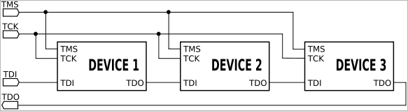
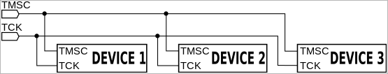

# JTAG
> 2021.01.15 [🚀](../index/index.md) [despace](index.md) → [Cable](cable.md), [Doc](doc.md), [GNC](gnc.md), [Test](test.md)

[TOC]

---

> <small>**JTAG** — EN term. **Джитаг** — literal RU translation.</small>

**JTAG** (named after the Joint **Test Action Group** which codified it) is an industry standard for verifying designs & testing printed circuit boards after manufacture.

JTAG implements standards for on‑chip instrumentation in electronic design automation (EDA) as a complementary tool to digital simulation. It specifies the use of a dedicated debug port implementing a serial communications interface for low‑overhead access without requiring direct external access to the system address & data buses. The interface connects to an on‑chip Test Access Port (TAP) that implements a stateful protocol to access a set of test registers that present chip logic levels & device capabilities of various parts.  
The Joint Test Action Group formed in 1985 to develop a method of verifying designs & testing printed circuit boards after manufacture. In 1990 the Institute of Electrical & Electronics Engineers codified the results of the effort in IEEE Standard 1149.1‑1990, entitled Standard Test Access Port & Boundary‑Scan Architecture.  
The JTAG standards have been extended by many semiconductor chip manufacturers with specialized variants to provide vendor‑specific features.

**Boundary scan testing.**  
JTAG boundary scan technology provides access to many logic signals of a complex integrated circuit, including the device pins. The signals are represented in the boundary scan register (BSR) accessible via the TAP. This permits testing as well as controlling the states of the signals for testing & debugging. Therefore, both software & hardware (manufacturing) faults may be located & an operating device may be monitored.  
When combined with built‑in self‑test (BIST), the JTAG scan chain enables a low overhead, embedded solution to test an IC for certain static faults (shorts, opens, & logic errors). The scan chain mechanism does not generally help diagnose or test for timing, temperature or other dynamic operational errors that may occur. Test cases are often provided in standardized formats such as SVF, or its binary sibling XSVF, & used in production tests. The ability to perform such testing on finished boards is an essential part of Design For Test in today's products, increasing the number of faults that can be found before products ship to customers.

**Electrical characteristics.**  
A JTAG interface is a special interface added to a chip. Depending on the version of JTAG, two, four, or five pins are added. The four & five pin interfaces are designed so that multiple chips on a board can have their JTAG lines daisy‑chained together if specific conditions are met. The two pin interface is designed so that multiple chips can be connected in a star topology. In either case a test probe need only connect to a single “JTAG port” to have access to all chips on a circuit board. The connector pins are:

   1. **TDI** (Test Data In)
   1. **TDO** (Test Data Out)
   1. **TCK** (Test Clock)
   1. **TMS** (Test Mode Select)
   1. **TRST** (Test Reset) optional. The TRST pin is an optional active‑low reset to the test logic, usually asynchronous, but sometimes synchronous, depending on the chip. If the pin is not available, the test logic can be reset by switching to the reset state synchronously, using TCK & TMS. Note that resetting test logic doesn't necessarily imply resetting anything else. There are generally some processor‑specific JTAG operations which can reset all or part of the chip being debugged.

Since only one data line is available, the protocol is serial. The clock input is at the TCK pin. One bit of data is transferred in from TDI, & out to TDO per TCK rising clock edge. Different instructions can be loaded. Instructions for typical ICs might read the chip ID, sample input pins, drive (or float) output pins, manipulate chip functions, or bypass (pipe TDI to TDO to logically shorten chains of multiple chips).

As with any clocked signal, data presented to TDI must be valid for some chip‑specific Setup time before & Hold time after the relevant (here, rising) clock edge. TDO data is valid for some chip‑specific time after the falling edge of TCK.

The maximum operating frequency of TCK varies depending on all chips in the chain (the lowest speed must be used), but it is typically 10 ‑ 100 ㎒ (100 ‑ 10 ns per bit). Also TCK frequencies depend on board layout & JTAG adapter capabilities & state. One chip might have a 40 ㎒ JTAG clock, but only if it is using a 200 ㎒ clock for non‑JTAG operations; & it might need to use a much slower clock when it is in a low power mode. Accordingly, some JTAG adapters have adaptive clocking using an RTCK (Return TCK) signal. Faster TCK frequencies are most useful when JTAG is used to transfer much data, such as when storing a program executable into flash memory.

Clocking changes on TMS steps through a standardized JTAG state machine. The JTAG state machine can reset, access an instruction register, or access data selected by the instruction register.

JTAG platforms often add signals to the handful defined by the IEEE 1149.1 specification. A System Reset (SRST) signal is quite common, letting debuggers reset the whole system, not just the parts with JTAG support. Sometimes there are event signals used to trigger activity by the host or by the device being monitored through JTAG; or, perhaps, additional control lines.

Even though few consumer products provide an explicit JTAG port connector, the connections are often available on the printed circuit board as a remnant from development prototyping and/or production. When exploited, these connections often provide the most viable means for reverse engineering.

**Reduced pin count JTAG (IEEE 1149.7).**  
Reduced pin count JTAG uses only two wires, a clock wire & a data wire. This is defined as part of the IEEE 1149.7 standard. It is called cJTAG for compact JTAG. The two wire interface reduced pressure on the number of pins, & devices can be connected in a star topology. The star topology enables some parts of the system to be powered down, while others can still be accessed over JTAG; a daisy chain requires all JTAG interfaces to be powered. Other two-wire interfaces exist, such as Serial Wire Debug. The connector pins are:

   - TMSC (Test Serial Data)
   - TCKC (Test Clock)

  
*Example of JTAG with reduced pin count.*

## Джитаг (RU)
**JTAG** (сокращение от англ. **Joint Test Action Group**; произносится «джи‑тáг») — название рабочей группы по разработке стандарта IEEE 1149. Позднее это сокращение стало прочно ассоциироваться с разработанным этой группой специализированным аппаратным интерфейсом на базе стандарта IEEE 1149.1. Официальное название стандарта Standard Test Access Port & Boundary‑Scan Architecture. Интерфейс предназначен для подключения сложных цифровых микросхем или устройств уровня печатной платы к стандартной аппаратуре тестирования и отладки. На текущий момент интерфейс стал промышленным стандартом. Практически все сколько‑нибудь сложные цифровые микросхемы оснащаются этим интерфейсом для:

   - выходного контроля микросхем при производстве
   - тестирования собранных печатных плат
   - прошивки микросхем с памятью
   - отладочных работ при проектировании аппаратуры и программного обеспечения

Метод тестирования, реализованный в стандарте, получил название Boundary Scan (граничное сканирование). Название отражает первоначальную идею процесса: в микросхеме выделяются функциональные блоки, входы которых можно отсоединить от остальной схемы, подать заданные комбинации сигналов и оценить состояние выходов каждого блока. Весь процесс производится специальными командами по интерфейсу JTAG, при этом никакого физического вмешательства не требуется. Разработан стандартный язык управления данным процессом — Boundary Scan Description Language (BSDL).

Стандарт предусматривает возможность подключения большого количества устройств (микросхем) через один физический порт (разъем).

Порт тестирования (TAP — Test Access Port) представляет собой 4 или 5 выделенных выводов микросхемы: ТСК, TMS, TDI, TDO и, опционально, TRST. Функциональное назначение этих линий:

   - **TDI** (test data input — «вход тестовых данных») — вход последовательных данных периферийного сканирования. Команды и данные вводятся в микросхему с этого вывода по переднему фронту сигнала TCK;
   - **TDO** (test data output — «выход тестовых данных») — выход последовательных данных. Команды и данные выводятся из микросхемы с этого вывода по заднему фронту сигнала TCK;
   - **TCK** (test clock — «тестовое тактирование») — тактирует работу встроенного автомата управления периферийным сканированием. Максимальная частота сканирования периферийных ячеек зависит от используемой аппаратной части и на данный момент ограничена 25 ‑ 40 ㎒;
   - **TMS** (test mode select — «выбор режима тестирования») — обеспечивает переход схемы в/из режима тестирования и переключение между разными режимами тестирования.
   - **TRST** (Test Reset) — опционально — для инициализации порта тестирования, что необязательно, так как инициализация возможна путём подачи определённой последовательности сигналов на вход TMS.

 

## Docs & links
|Navigation|
|:--|
|**[FAQ](faq.md)**, **[Cable](cable.md)**·БКС, **[Camera](cam.md)**·Камера, **[Comms](comms.md)**·Радио, **[CON](contact.md)·[Pers](person.md)**·Контакт, **[Control](control.md)**·Упр., **[Doc](doc.md)**·Док., **[Doppler](doppler.md)**·ИСР, **[DS](ds.md)**·ЗУ, **[EB](eb.md)**·ХИТ, **[ECO](ecology.md)**·Экол., **[EF](ef.md)**·ВВФ, **[ElC](elc.md)**·ЭКБ, **[EMC](emc.md)**·ЭМС, **[Error](error.md)**·Ошибки, **[Event](event.md)**·События, **[FS](fs.md)**·ТЭО, **[Fuel](fuel.md)**·Топливо, **[GNC](gnc.md)**·БКУ, **[GS](scs.md)**·НС, **[HF&E](hfe.md)**·Эрго., **[IU](iu.md)**·Гиро., **[KT](kt.md)**·КТЕХ, **[LAG](lag.md)**·ПУC, **[LES](les.md)**·САСП, **[LS](ls.md)**·СЖО, **[LV](lv.md)**·РН, **[MCC](mcc.md)**·ЦУП, **[Model](model.md)**·Модель, **[MSC](sc.md)**·ПКА, **[N&B](nnb.md)**·БНО, **[NR](nr.md)**·ЯР, **[OBC](obc.md)**·ЦВМ, **[OE](oe.md)**·БА, **[Pat.](патент.md)**·Патент, **[Proj.](project.md)**·Проект, **[PS](ps.md)**·ДУ, **[QA](qa.md)**·БКНР, **[R&D](rnd.md)**·НИОКР, **[Robot](robotics.md)**·Робот, **[Rover](rover.md)**·Ровер, **[RTG](rtg.md)**·РИТЭГ, **[SARC](sarc.md)**·ПСК, **[SE](se.md)**·СЭ, **[Sens.](sensor.md)**·Датч., **[SC](sc.md)**·КА, **[SCS](scs.md)**·КК, **[SGM](sgm.md)**·КММ, **[SI](si.md)**·СИ, **[Soft](soft.md)**·ПО, **[SP](sp.md)**·БС, **[Spaceport](spaceport.md)**·Космодр., **[SPS](sps.md)**·СЭС, **[SSS](sss.md)**·ГЗУ, **[TCS](tcs.md)**·СОТР, **[Test](test.md)**·ЭО, **[Timeline](timeline.md)**·ЦГМ, **[TMS](tms.md)**·ТМС, **[TOR](tor.md)**·ТЗ, **[TRL](trl.md)**·УГТ|
|*Sections & pages*|
|**··• [Test](test.md) •··**  [JTAG](jtag.md)┊ [Proto fligt model](pfm.md)┊ [Безэховая камера](ach.md)┊ [Валидация](val_ver.md)┊ [Класс чистоты](clean_lvl.md)┊ [КПЭО](ctpr.md)┊ [Перечень методик испытаний](list_tp.md)┊ [Программа и методика испытаний](pmot.md)┊ [Опытный образец](pilot_sample.md)┊ [Циклограмма](obc.md)┊ [Штатный образец](flight_unit.md)┊ [ЭО](test.md)┊ [Экспериментально‑теоретический метод](etetm.md)|

   1. Docs: …
   1. Notable interwikies — …
   1. <https://grouper.ieee.org/groups/1149/1/> — official site
   1. <http://hri.sourceforge.net/tools/jtag_faq_org.html> — JTAG FAQ
   1. <https://en.wikipedia.org/wiki/JTAG>
