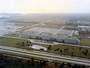
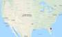
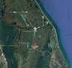

# Kennedy
> 2019.04.30 ┊ **🚀 [despace](index.md)** → **[Spaceport](spaceport.md)**

[TOC]

---

> <small>*Термины:* **Kennedy** — англоязычный термин, не имеющий аналога в русском языке. **Кеннеди** — дословный перевод с английского на русский.</small>

**Космический центр имени Джона Фицджеральда Кеннеди** *(англ. John F. Kennedy Space Center)* — космодром, находящийся поблизости от [мыса Канаверал](canaveral.md), на полпути от Майами до Джексонвилля. На данный момент лишь 9 % площади космодрома эксплуатируется по назначению, остальная территория представляет собой заповедник дикой природы; основные достопримечательности этого места: Лагуна москитов, Индейская река, Национальный заказник дикой природы остров Мерритт и национальное побережье Канаверал. На эту территорию приходится больше ударов молний, чем какое‑либо другое место в США, вынуждая НАСА тратить миллионы долларов для предотвращения ударов молниями во время запусков.

|*Characteristic*|*[Value](si.md)*|
|:--|:--|
| Активность  |**Активен** (1962 ‑ …)  |
| [Запускаемые РН](lv.md)  | [Falcon](falcon.md) ┊ [Shuttle](shuttle.md) ┊ [SLS](sls.md)  |
| Оператор  | [NASA](03_nasa.md)  |
| Расположение  | 28°31′26.61″N 80°39′3.06″W  остров Мерритт, округ Бревард, штат Флорида, США  |
| Расстояние  | 3 400 км — до экватора;  11 000 км — до [LAV](03_lav.md);  3 700 км — до [JPL](03_jpl.md)  |
| Стартовых столов  | 2  |
||        |
||  <small>*Мировая карта космодромов*</small>  |

 

---

## Docs & links (TRANSLATEME ALREADY)
|…°·•¹²³±×÷≤≥≈≠ ‑ −— ⎆✉ ❐“”’«»✔→✘☐☑├┕┆ 1 lb = 0.453592 kg; 1 g = 9.80665 m/s²|
|:--|
|<small>**[FAQ](faq.md)**, **[Cable](cable.md)**·БКС, **[Camera](camera.md)**·Камера, **[Comms](comms.md)**·Радиосв., **[Contact](contact.md)**·Контакт, **[Control](control.md)**·Управ., **[Doc](doc.md)**·Док., **[Doppler](doppler.md)**·ИСР, **[DS](ds.md)**·ЗУ, **[EB](eb.md)**·ХИТ, **[ECO](ecology.md)**·Экол., **[EF](ef.md)**·ВВФ, **[ElC](elc.md)**·ЭКБ, **[EMC](emc.md)**·ЭМС, **[Errors](error.md)**·Ошибки, **[Events](event.md)**·События, **[FS](fs.md)**·ТЭО, **[Fuel](fuel.md)**·Топливо, **[GNC](gnc.md)**·БКУ, **[GS](scs.md)**·НС, **[HF&E](hfe.md)**·Эргоном., **[IMU](imu.md)**·Гироскоп, **[Incubator](incubator.md)**·Инкуб., **[KT](kt.md)**·КТЕХ, **[LAG](lag.md)**·ПУC, **[LES](les.md)**·САСП, **[LS](ls.md)**·СЖО, **[LV](lv.md)**·РН, **[MAG](mag.md)**·Магнитом., **[MCC](mcc.md)**·ЦУП, **[Model](model.md)**·Модель, **[MSC](sc.md)**·ПКА, **[N&B](nnb.md)**·БНО, **[NR](nr.md)**·ЯР, **[OBC](obc.md)**·ЦВМ, **[OE](oe.md)**·БА, **[Patent](патент.md)**·Патент, **[Project](project.md)**·Проект, **[PS](ps.md)**·ДУ, **[QA](quality.md)**·QA, **[R&D](rnd.md)**·НИОКР, **[RAMS](rams.md)**·НиБ, **[Risk](risk.md)**·Риск, **[Robot](robotics.md)**·Робот, **[Rover](rover.md)**·Планетоход, **[RTG](rtg.md)**·РИТЭГ, **[RW](rw.md)**·ДМ, **[SARC](sarc.md)**·ПСК, **[Sensor](sensor.md)**·Датчик, **[SC](sc.md)**·КА, **[SCS](scs.md)**·КК, **[SGM](sgm.md)**·КММ, **[SI](si.md)**·СИ, **[Soft](soft.md)**·ПО, **[SP](sp.md)**·БС, **[Spaceport](spaceport.md)**·Космодром, **[SPS](sps.md)**·СЭС, **[SSS](sss.md)**·ГЗУ, **[TCS](tcs.md)**·СОТР, **[Test](test.md)**·ЭО, **[Timeline](timeline.md)**·Циклограмма, **[TMS](tms.md)**·ТМС, **[TOR](tor.md)**·ТЗ, **[TRL](trl.md)**·УГТ</small>|

**Docs:**

   1. …

**Links:**

   1. Notable interwikies — …
   1. <https://en.wikipedia.org/wiki/Kennedy_Space_Center>
   1. <https://ru.wikipedia.org/wiki/Космический_центр_Кеннеди>

|*Sections & pages*|
|:--:|
|**··• [Spaceport](spaceport.md) •··**  …  • • •  **Brazil:** [Alcantara](alcantara.md) (260) ┊ **China:** [Jiuquan](jiuquan.md) (5 000), [Taiyuan](taiyuan.md) (4 500), [Wenchang](wenchang.md) (2 200), [Xichang](xichang.md) (3 200) ┊ **EU:** [Kourou](kourou.md) (650), (inactive: [San Marco](san_marco.md) (300), [Woomera](woomera.md) (3 300)) ┊ **India:** [Sriharikota](sriharikota.md) (1 600) ┊ **Int.:** …, (inactive: [Sea Launch](sea_launch.md) (0)) ┊ **Iran:** [Semnan](semnan.md) (4 300)) ┊ **Iraq:** …, (inactive: [Al Anbar](al_anbar.md) (3 700)) ┊ **Israel:** [Palmachim](palmachim.md) (3 700) ┊ **Japan:** [Taiki](taiki.md) (4 700), [Tanegashima](tanegashima.md) (3 400), [Uchinoura](uchinoura.md) (3 700) ┊ **Korea N.:** [Sohae](sohae.md) (4 900), [Tonghae](tonghae.md) (4 700) ┊ **Korea S.:** [Naro](naro.md) (4 000) ┊ **RF,CIF:** [Baikonur](baikonur.md) (5 200), [Dombarovsky](dombarovsky.md) (5 500), [Kapustin Yar](kapustin_yar.md) (5 400), [Plesetsk](plesetsk.md) (7 400), [Vostochny](vostochny.md) (5 500), (inactive: [Svobodny](svobodny.md) (5 500)) ┊ **USA:** [Rocket Lab LC1](rocket_lab_lc1.md) (4 700), [SpaceX STLS](spacex_stls.md) (2 800), [America](america.md) (3 900), [Canaveral](canaveral.md) (3 400), [Kennedy](kennedy.md) (3 400), [Kodiak](kodiak.md) (6 600), [Kwajalein](kwajalein.md) (1 000), [Vandenberg](vandenberg.md) (4 200), [Wallops](wallops.md) (4 500)|
