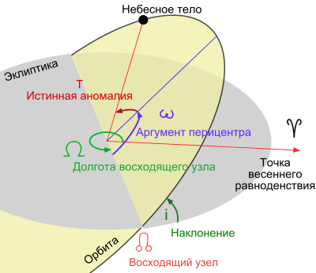
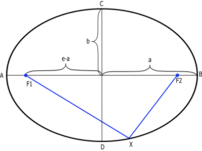
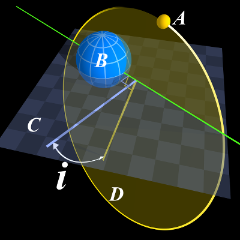
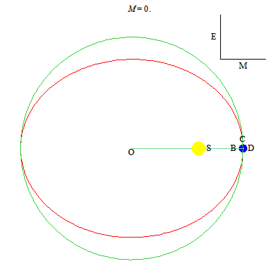
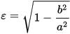

# Кеплеровы элементы
> 2019.05.03 [🚀](../index/index.md) [despace](index.md) → **[БНО](nnb.md)**

[TOC]

---

> <small>**Кеплеровы элементы** — русскоязычный термин. **Kepler orbit** — англоязычный эквивалент.</small>

**Кеплеровы элементы** — шесть элементов орбиты, определяющих положение небесного тела в пространстве в задаче двух тел:

   1. аргумент [перицентра](apopericentre.md) (**ω**, Argument of periapsis)
   1. большая полуось (**a**, Semimajor axis)
   1. долгота [восходящего узла](nnb.md) (**Ω**, Longitude of the ascending node)
   1. наклонение (**i**, Inclination)
   1. средняя аномалия (**Mₒ**, True anomaly)
   1. эксцентриситет (**e**, Eccentricity)

Первые два определяют форму орбиты, третий, четвёртый и пятый — ориентацию плоскости орбиты по отношению к базовой системе координат, шестой — положение тела на орбите.

|Кеплеровские элементы орбиты, включая аргумент перицентра (рис.1)|
|:--|
||
|···|
|**Части эллипса (рис.2)**|
||

## Аргумент перицентра
> <small>**Аргумент перицентра** — русскоязычный термин. **Argument of periapsis** — англоязычный эквивалент.</small>

**Аргуме́нт перице́нтра** — определяется как угол между направлениями из притягивающего центра на восходящий узел орбиты и на перицентр (ближайшую к притягивающему центру точку орбиты спутника), или угол между линией узлов и линией апсид. Отсчитывается из притягивающего центра в направлении движения спутника, обычно выбирается в пределах 0-360°.

При исследовании экзопланет и двойных звёзд в качестве базовой используют картинную плоскость — плоскость, проходящую через звезду и перпендикулярную лучу наблюдения звезды с Земли. Орбита экзопланеты, в общем случае случайным образом ориентированная относительно наблюдателя, пересекает эту плоскость в двух точках. Точка, где планета пересекает картинную плоскость, приближаясь к наблюдателю, считается восходящим узлом орбиты, а точка, где планета пересекает картинную плоскость, удаляясь от наблюдателя, считается нисходящим узлом. В этом случае аргумент перицентра отсчитывается из притягивающего центра против часовой стрелки.

Обозначается (**ω**).

Вместо аргумента перигелия часто используется другой угол, долгота перигелия, обозначаемый как ω. Он определяется как сумма долготы восходящего узла и аргумента перигелия. Это — несколько необычный угол, так как он измеряется частично вдоль эклиптики, а частично — вдоль орбитальной плоскости. Однако часто он более практичен, чем аргумент перигелия, так как хорошо определен даже когда наклонение орбиты близко к нулю, когда направление на восходящий узел становится неопределенным.

## Большая полуось
> <small>**Большая полуось** — русскоязычный термин. **Semimajor axis** — англоязычный эквивалент.</small>

**Большая полуось** — это половина главной оси эллипса **|AB|** (обозначена на рис.2 как **a**). В астрономии характеризует максимальное расстояние небесного тела от центра эллиптической орбиты.

## Долгота восходящего узла
> <small>**Долгота восходящего узла** — русскоязычный термин. **Longitude of the ascending node** — англоязычный эквивалент.</small>

**Долгота́ [восходя́щего узла́](nnb.md)** — один из основных элементов орбиты, используемый для математического описания ориентации плоскости орбиты относительно базовой плоскости. Определяет угол в базовой плоскости, образуемый между базовым направлением на нулевую точку и направлением на точку восходящего узла орбиты, в которой орбита пересекает базовую плоскость в направлении с юга на север. Для определения восходящего и нисходящего узла выбирают некоторую (так называемую базовую) плоскость, содержащую притягивающий центр. В качестве базовой обычно используют плоскость эклиптики (движение планет, комет, астероидов вокруг Солнца), плоскость экватора планеты (движение спутников вокруг планеты) и т. д. Нулевая точка — Первая точка Овна (точка весеннего равноденствия). Угол измеряется от направления на нулевую точку против часовой стрелки.

Восходящий узел обозначается **☊**, или **Ω**.

## Наклонение
> <small>**Наклонение** — русскоязычный термин. **Inclination** — англоязычный эквивалент.</small>

**Наклонение орбиты** (накло́н орбиты, накло́нность орбиты, наклоне́ние) небесного тела — это угол между плоскостью его орбиты и плоскостью отсчёта (базовой плоскостью). Обычно обозначается буквой **i** (от англ. inclination). Наклонение измеряется в угловых градусах, минутах и секундах:

   - 0° < i < 90° — движение небесного тела называется прямым.
   - 90° < i < 180° — движение небесного тела называется обратным.

|<small>A — Объект  B — Центральный объект  C — Плоскость отсчёта  D — Плоскость орбиты  i — Наклонение</small>|
|:--|
||

Зная наклонение двух орбит к одной плоскости отсчёта и долготы их восходящих узлов, можно вычислить угол между плоскостями этих двух орбит — их взаимное наклонение, по формуле косинуса угла.
   - В применении к Солнечной системе, за плоскость отсчёта обычно выбирают плоскость орбиты Земли (плоскость эклиптики). Плоскости орбит других планет Солнечной системы и Луны отклоняются от плоскости эклиптики лишь на несколько градусов.
   - Для искусственных спутников Земли за плоскость отсчёта обычно выбирают плоскость экватора Земли.
   - Для спутников других планет Солнечной системы за плоскость отсчёта обычно выбирают плоскость экватора соответствующей планеты.
   - Для экзопланет и двойных звёзд за плоскость отсчёта принимают картинную плоскость.

## Средняя аномалия
> <small>**Средняя аномалия** — русскоязычный термин. **True anomaly** — англоязычный эквивалент.</small>

|Анимация, иллюстрирующая истинную аномалию, эксцентрическую аномалию,  среднюю аномалию и решение уравнения Кеплера.|
|:--|
||
|···|
|**Аномалии (рис.3)**|
||

**Средняя аномалия** для тела, движущегося по невозмущённой орбите — произведение его среднего движения и интервала времени после прохождения перицентра. Таким образом, средняя аномалия есть угловое расстояние от перицентра гипотетического тела, движущегося с постоянной угловой скоростью, равной среднему движению.

Обозначается буквой **M** (от англ. mean anomaly).  
В звёздной динамике **средняя аномалия** M вычисляется по следующим формулам:

M = M₀ + n (t − t₀), где:

   - M₀ — средняя аномалия на эпоху t₀,
   - t₀ — начальная эпоха,
   - t — эпоха, на которую производятся вычисления,
   - n — среднее движение.

Либо через уравнение Кеплера:
M = E − e • sin⁡ E, где:

   - E — это эксцентрическая аномалия (E на рис.3),
   - e — это эксцентриситет.

## Эксцентриситет
> <small>**Эксцентриситет** — русскоязычный термин. **Eccentricity** — англоязычный эквивалент.</small>

**Эксцентрисите́т** (обозначается «**e**» или «**ε**») — числовая характеристика конического сечения. Эксцентриситет инвариантен относительно движений плоскости и преобразований подобия. Эксцентриситет характеризует «сжатость» орбиты. Он выражается по формуле:

, где b — малая полуось (см. рис.2)

Можно разделить внешний вид орбиты на пять групп:

   - ε = 0 — окружность
   - 0 < ε < 1 — эллипс
   - ε = 1 — парабола
   - 1 < ε < ∞ — гипербола
   - ε = ∞ — прямая (вырожденный случай)

 

## Docs & links (TRANSLATEME ALREADY)
|Navigation|
|:--|
|**[FAQ](faq.md)**【**[SCS](scs.md)**·КК, **[SC](sc.md)**·КА, **[OE](oe.md)**·БА, **[SGM](sgm.md)**·КММ】**[CON](contact.md)·[Pers](person.md)**·Контакт, **[Ctrl](control.md)**·Упр., **[Doc](doc.md)**·Док., **[EF](ef.md)**·ВВФ, **[Error](error.md)**·Ошибки, **[Event](event.md)**·События, **[FS](fs.md)**·ТЭО, **[HF&E](hfe.md)**·Эрго., **[KT](kt.md)**·КТ, **[Model](model.md)**·Модель, **[N&B](nnb.md)**·БНО, **[Patent](патент.md)**·Патент, **[Project](project.md)**·Проект, **[QM](qm.md)**·БКНР, **[R&D](rnd.md)**·НИОКР, **[SI](si.md)**·СИ, **[Test](test.md)**·ЭО, **[Timeline](timeline.md)**·ЦГМ, **[TRL](trl.md)**·УГТ|
|*Sections & pages*|
|**`Баллистико‑навигационное обеспечение (БНО):`**  [SPICE](spice.md)・ [Апоцентр и перицентр](apopericentre.md)・ [Гравманёвр](gravass.md)・ [Кеплеровы элементы](keplerian.md)・ [Космическая скорость](esc_vel.md)・ [Сфера Хилла](hill_sphere.md)・ [Терминатор](terminator.md)・ [Точки Лагранжа](l_points.md)・ [Эффект Оберта](oberth_eff.md)|

   1. Docs: …
   1. Notable interwikies — …
   1. <https://en.wikipedia.org/wiki/Kepler_orbit>
   1. <https://ru.wikipedia.org/wiki/Кеплеровы_элементы_орбиты>

