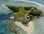
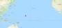
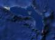

# Kwajalein
> 2019.05.14 ┊ **🚀 [despace](index.md)** → **[Spaceport](spaceport.md)**

[TOC]

---

> <small>*Термины:* **Kwajalein** — англо�зычный термин, не име�щий аналога в ру��ком �зыке. **Кваджалейн** — до�ловный перевод � англий�кого на ру��кий.</small>

**Ква�джалейн (Куазьлень)** *(англ. Kwajalein [ˈkwɑ�dʒəlɨn], марш. Kuwajleen [kʷuɒ͡æzʲ(æ)lʲɛ�nʲ])* — атолл из 93 о�тровов и одноименный о�тров (3.1 km²) в �о�таве �того атолла в Тихом океане в цепи Ралик (Маршалловы ��трова). Крупнейший на�елённый пункт атолла — город Эбьз� (Эбейе, Ибай), ра�положенный на одноимённом о�трове. Ме�то ра�положени� военно‑воздушной и военно‑мор�кой баз СШ�, ракетного полигона и ко�модрома.

|*|*Characteristic*|*[Value](si.md)*||:--|:--|
| �ктивно�ть  |**�ктивен** (1960 ‑ …)  |
| [Запу�каемые Р�](lv.md)  | [Falcon 1](falcon.md) ┊ **различные МБР**  |
| �ператор  | ВВС СШ� |
| Ра�положение  | 8°43′N 167°44′E  Маршалловы о�трова |
| Ра��то�ние  | 1 000 км — до �кватора;  14 300 км — до [LAV](03_lav.md);  8 300 км — до [JPL](03_jpl.md)  |
| Стартовых �толов  | 3:  Illeginni Island (9.08631°N 167.47303°E)  Roi-Namur Island (9.4012°N 167.4663°E)  Kwajalein Drop Zone (7.6500°N 167.7000°E)  |
||       |
||  <small>*Мирова� карта ко�модромов*</small>  |

 

---

#### Docs & links (TRANSLATEME ALREADY)|…°·•¹²³±×÷≤≥≈≠ ‑ −— �✉ �“�’«»✔→✘�☑├┕┆ 1 lb = 0.453592 kg; 1 g = 9.80665 m/s²|
|:--|
|*|— [DOCS](doc.md) ┊ [R&D](rnd.md) ┊ [TOR](tor.md) ┊ [TRL](trl.md); — **[SCS](scs.md), SC:** [Robotics](robotics.md) ┊ [Structures](structures.md)  ▮  **MSF:** ; ||*|*|R|**[FAQ](faq.md)**, **[Cable](cable.md)**·БКС, **[Camera](camera.md)**·Камера, **[Chart](c(doc.md*·Схема, **[Comms](comms.md)**·Радио�в�зь, **[Contact](contact.md)**·Контакт, **[Control](control.md)**·Управ., **[СS](cs.md)**·СУ, **[Doc](doc.md)**·Док., **[Doppler](doppler.md)**·ИСР, **[DS](ds.md)**·ЗУ, **[EB](eb.md)**·ХИТ, **[Ecology](ecology.md)**·Экологи�, **[EF](ef.md)**·ВВФ, **[ElC](elc.md)**·ЭКБ, **[EMC](emc.md)**·ЭМС, **[Errors](error.md)**·�шибки, **[Events](event.md)**·Событи�, **[FS](fs.md)**·ТЭ�, **[Fuel](fuel.md)**·Топливо, **[GNC](gnc.md)**·БКУ, **[GS](scs.md)**·�С, **[HF&E](hfe.md)**·Эргоном., **[IMU](imu.md)**·Гиро�коп, **[Incubator](incubator.md)**·Инкубатор, **[KT](kt.md)**·КТЕХ, **[LAG](lag.md)**·ПУC, **[LES](les.md)**·С�СП, **[LS](ls.md)**·СЖ�, **[LV](lv.md)**·Р�/РБ/Г�/Пх�, **[MAG](mag.md)**·Магнитометр, **[MCC](mcc.md)**·ЦУП, **[Model](model.md)**·Модель, **[MSC](sc.md)**·ПК�, **[N&B](nnb.md)**·Б��, **[NR](nr.md)**·ЯР, **[OBC](obc.md)**·ЦВМ, **[OE](oe.md)**·Б�/К��, **[Patent](патент.md)**·Патент, **[Project](project.md)**·Проекты, **[PS](ps.md)**·ДУ, **[Quality](quality.md)**·Каче�тво, **[R&D](rnd.md)**·�И�КР, **[Reliability](r(rams.md*·�адёжн., **[Research](r(project.md*·И��лед., **[Risk](risk.md)**·Ри�к, **[Robotics](robotics.md)**·Робот, **[Rover](rover.md)**·Планетоход, **[RTG](rtg.md)**·РИТЭГ, **[RW](rw.md)**·ДМ, **[Safety](s(rams.md*·Безоп., **[SARC](sarc.md)**·ПСК, **[Sensor](sensor.md)**·Датчик, **[SC](sc.md)**·К�, **[SCS](scs.md)**·КК, **[SGM](sgm.md)**·КММ, **[SI](si.md)**·СИ, **[Software](soft.md)**·П�, **[SP](sp.md)**·БС, **[Spaceport](spaceport.md)**·Ко�модром, **[SPS](sps.md)**·СЭС, **[SSS](sss.md)**·ГЗУ, **[TCS](tcs.md)**·С�ТР, **[Test](test.md)**·И�пыт., **[Timeline](timeline.md)**·Циклограмма, **[TMS](tms.md)**·ТМС, **[TOR](tor.md)**·ТЗ, **[TRL](trl.md)**·УГТ|Документы:**

   1. …

**Links:**

   1. Notable interwikies — …
   1. <https://en.wikipedia.org/wiki/Kwajalein_Atoll>
   1. <https://ru.wikipedia.org/wiki/Кваджалейн>
   1. 2013.07.27 [Трущобы Тихого �кеана �](https://masterok.livejournal.com/1205140.html)

|*|*|*Sections & pages*|--:|
|**`КоÑ�модром:`**  …  • • •  **БразилиÑ�:** [Ğ�лкантара](alcantara.md) (260)  ▮  **Европа:** [Куру](kourou.md) (650) ··· *([Вумера](woomera.md) (3 300) ┊ [Сан‑Марко](san_marco.md) (300))*  ▮  **Израиль:** [Пальмахим](palmachim.md) (3 700)  ▮  **Ирак:** … ··· *([Ğ�ль‑Ğ�нбар](al_anbar.md) (3 700))*  ▮  **Иран:** [Семнан](semnan.md) (4 300))  ▮  **ИндиÑ�:** [Шрихарикота](sriharikota.md) (1 600) / **Китай:** [Ğ’Ñ�ньчан](wenchang.md) (2 200) ┊ [Сичан](xichang.md) (3 200) ┊ [ТайÑ�ань](taiyuan.md) (4 500) ┊ [ЦзÑ�цÑ�ань](jiuquan.md) (5 000)  ▮  **КореÑ� Ñ�.:** [ТонхÑ�](tonghae.md) (4 700) ┊ [СохÑ�](sohae.md) (4 900)  ▮  **КореÑ� Ñ�.:** [Ğ�аро](naro.md) (4 000)  ▮  **Международные:** [МорÑ�кой Ñ�тарт](sea_launch.md) (0)  ▮  **РФ, СĞ�Ğ“:** [Байконур](Ğ(baikonur.md€¯(5 200) ┊ [ВоÑ�точный](Ğ(vostochny.md€¯(5 500) ┊ [КапуÑ�тин Яр](Ğ(kapustin_yar.md€¯(5 400) ┊ [ПлеÑ�ецк](plesetsk.md) (7 400) ┊ [ЯÑ�ный](dombarovsky.md) (5 500) ··· *([Свободный](svobodny.md) (5 500))*  ▮  **СШĞ�:** [Rocket Lab LC1](rocket_lab_lc1.md) (4 700) ┊ [SpaceX STLS](spacex_stls.md) (2 800) ┊ [Ğ�мерика](america.md) (3 900) ┊ [Ванденберг](vandenberg.md) (4 200) ┊ [КадьÑ�к](kodiak.md) (6 600) ┊ [Канаверал](canaveral.md) (3 400) ┊ [Кваджалейн](kwajalein.md) (1 000) ┊ [Кеннеди](kennedy.md) (3 400) ┊ [УоллопÑ�](wallops.md) (4 500)  ▮  **ЯпониÑ�:** [ТанÑ�гаÑ�има](tanegashima.md) (3 400) ┊ [Утиноура](uchinoura.md) (3 700) |
