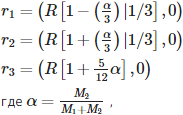
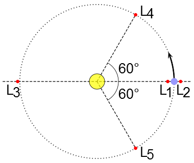
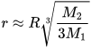
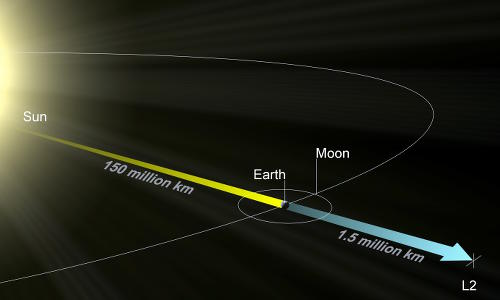
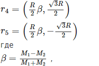
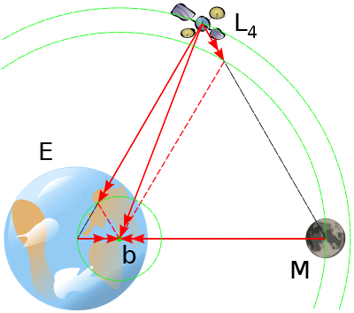
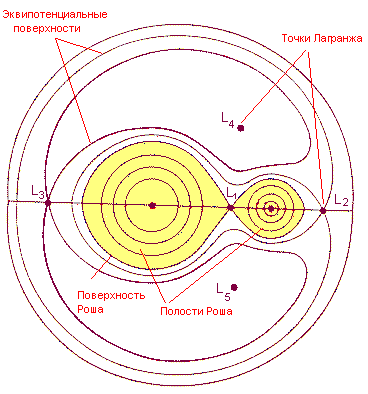

# Точки Лагранжа
> 2019.05.05 [🚀](../index/index.md) [despace](index.md) → **[БНО](nnb.md)**, [Space](index.md)

[TOC]

---

> <small>**Точки Лагранжа** — русскоязычный термин. **Lagrangian point** — англоязычный эквивалент.</small>

**Точки Лагра́нжа, точки либра́ции** (**ТЛ**, лат. *librātiō* — раскачивание) или **L-точки** — точки в системе из двух массивных тел, в которых третье тело с пренебрежимо малой массой, не испытывающее воздействие никаких других сил, кроме гравитационных, со стороны двух первых тел, может оставаться неподвижным относительно этих тел.

Более точно точки Лагранжа представляют собой частный случай при решении так называемой ограниченной задачи трёх тел — когда орбиты всех тел являются круговыми и масса одного из них намного меньше массы любого из двух других. В этом случае можно считать, что два массивных тела обращаются вокруг их общего центра масс с постоянной угловой скоростью. В пространстве вокруг них существуют пять точек, в которых третье тело с пренебрежимо малой массой может оставаться неподвижным во вращающейся системе отсчёта, связанной с массивными телами. В этих точках гравитационные силы, действующие на малое тело, уравновешиваются центробежной силой.

|*Точки Лагранжа и эквипотенциальные поверхности  системы двух тел (с учётом центробежного потенциала)*|
|:--|
||

## Расположение точек Лагранжа
Все точки Лагранжа лежат в плоскости орбит массивных тел и обозначаются заглавной латинской буквой L с числовым индексом от 1 до 5. Первые три точки расположены на линии, проходящей через оба массивных тела. Эти точки Лагранжа называются коллинеарными и обозначаются L1, L2 и L3. Точки L4 и L5 называются треугольными или троянскими.

|*Система*|*L1, км*|*L2, км*|*L3, км*|*L4, км*|*L5, км*|
|:--|:--|:--|:--|:--|:--|
|Венера‑Солнце|1 011 150|1 011 150||||
|Земля‑Луна||||||
|Земля‑Солнце|1 496 524|1 496 524||||
|Марс‑Солнце||||||

L1 находится между двумя телами системы, ближе к менее массивному телу, L2 — снаружи, за менее массивным телом и L3 — за более массивным. Расстояния от центра масс системы до этих точек в первом приближении по α рассчитываются с помощью следующих формул:

R — расстояние между телами,  
M1 — масса более массивного тела,  
M2 — масса второго тела.

|*Схема пяти лагранжевых точек в системе двух тел, когда  одно тело намного массивнее другого (Солнце и Земля). В такой системе точки L3, L4, L5 показаны на самой орбите,   хотя фактически они будут находиться немного за ней.*|
|:--|
||

 

### L1
Точка L1 лежит на прямой, соединяющей два тела с массами M1 и M2 (M1 > M2), и находится между ними, вблизи второго тела. Её наличие обусловлено тем, что гравитация тела M2 частично компенсирует гравитацию тела M1. При этом чем больше M2, тем дальше от него будет располагаться эта точка.

**Пример:** Объекты, которые движутся вокруг Солнца ближе, чем Земля, как правило, имеют меньшие орбитальные периоды, чем у Земли, если они не входят в зону влияния земного притяжения. Если объект находится непосредственно между Землёй и Солнцем, то действие земной силы тяжести отчасти компенсирует влияние гравитации Солнца, за счёт этого происходит увеличение орбитального периода объекта. Причём чем ближе к Земле находится объект, тем сильнее этот эффект. И наконец, на определённом приближении к планете — в точке L1 — действие земной силы тяжести уравновешивает влияние солнечной гравитации настолько, что период обращения объекта вокруг Солнца становится равным периоду обращения Земли. Для нашей планеты расстояние до точки L1 составляет около 1,5 млн ㎞. Притяжение Солнца здесь (118 мкм/с²) на 2 % сильнее, чем на орбите Земли (116 мкм/с²), тогда как снижение требуемой центростремительной силы вдвое меньше (59 мкм/с²). Сумма этих двух эффектов уравновешивается притяжением Земли, которое составляет здесь также 177 мкм/с².

**Использование**

В системе Солнце ‑ Земля точка L1 может быть идеальным местом для размещения космической обсерватории для наблюдения Солнца, которое в этом месте никогда не перекрывается ни Землёй, ни Луной. Первым аппаратом, работавшим вблизи этой точки, был запущенный в августе 1978 года аппарат ISEE-3. Аппарат вышел на периодическую гало‑орбиту вокруг этой точки 20 ноября 1978 года и был сведён с этой орбиты 10 июня 1982 года (для исполнения новых задач). На такой же орбите с мая 1996 года работает аппарат SOHO. Аппараты ACE, WIND и DSCOVR находятся на квази‑периодических [орбитах Лиссажу́](nnb.md) близ этой же точки, соответственно, с 12 декабря 1997, 16 ноября 2001 и 8 июня 2015 года.

Лунная точка L1 (в системе Земля ‑ Луна) может стать идеальным местом для строительства космической пилотируемой орбитальной станции, которая, располагаясь на «полпути» между Землёй и Луной, позволила бы легко добраться до Луны с минимальными затратами топлива и стать ключевым узлом грузового потока между Землёй и её спутником.

 

### L2
Точка L2 лежит на прямой, соединяющей два тела с массами M1 и M2 (M1 > M2), и находится за телом с меньшей массой. Точки L1 и L2 располагаются на одной линии и в пределе M1 ≫ M2 симметричны относительно M2. В точке L2 гравитационные силы, действующие на тело, компенсируют действие центробежных сил во вращающейся системе отсчёта.

**Пример:** у объектов, расположенных за орбитой Земли, орбитальный период почти всегда больше, чем у Земли. Но дополнительное влияние на объект силы тяжести Земли, помимо действия солнечной гравитации, приводит к увеличению скорости вращения и уменьшению времени оборота вокруг Солнца, в результате в точке L2 орбитальный период объекта становится равным орбитальному периоду Земли.

Точка L2 в системе Солнце ‑ Земля является идеальным местом для строительства орбитальных космических обсерваторий и телескопов. Поскольку объект в точке L2 способен длительное время сохранять свою ориентацию относительно Солнца и Земли, производить его экранирование и калибровку становится гораздо проще. Однако эта точка расположена немного дальше земной тени (в области полутени), так что солнечная радиация блокируется не полностью. В этой точке уже находятся аппараты американского и европейского космических агентств — WMAP, «Планк», «Гершель» и Gaia, а в 2018 должен присоединиться «Джеймс Уэбб». Точка L2 в системе Земля ‑ Луна может быть использована для обеспечения спутниковой связи с объектами на обратной стороне Луны, а также быть удобным местом для размещения заправочной станции для обеспечения грузопотока между Землёй и Луной

Если M2 много меньше по массе, чем M1, то точки L1 и L2 находятся на примерно одинаковом расстоянии r от тела M2, равном радиусу сферы Хилла:

  
где R — расстояние между компонентами системы.

Это расстояние можно описать как радиус круговой орбиты вокруг M2, для которой период обращения в отсутствие M1 √3 ≈ 1.73 в раз меньше, чем период обращения M2 вокруг M1.

Примеры:

   - В системе Солнце ‑ Земля: 1 500 000 ㎞ от Земли
   - Земля ‑ Луна: 61 500 ㎞ от Луны

|*Точка L2 в системе Солнце ‑ Земля, располагающаяся далеко за пределами орбиты Луны.*|
|:--|
||

 

### L3
Точка L3 лежит на прямой, соединяющей два тела с массами M1 и M2 (M1 > M2), и находится за телом с большей массой. Так же, как для точки L2, в этой точке гравитационные силы компенсируют действие центробежных сил.

**Пример:** Точка L3 в системе Солнце ‑ Земля находится за Солнцем, на противоположной стороне земной орбиты. Однако, несмотря на свою небольшую гравитацию (по сравнению с гравитацией Солнца), Земля всё же оказывает на него небольшое влияние, поэтому точка L3 находится не на самой орбите Земли, а чуть дальше от Солнца, чем Земля, так как вращение происходит не вокруг Солнца, а вокруг барицентра). В результате в этой точке L3 достигается такое сочетание гравитации Солнца и Земли, что объекты, находящиеся в этой точке, движутся с таким же орбитальным периодом, как и наша планета.

До начала космической эры среди писателей‑фантастов была очень популярна идея о существовании на противоположной стороне земной орбиты в точке L3 другой аналогичной ей планеты, «Противоземли», которая из‑за своего расположения была недоступна для прямых наблюдений. Однако на самом деле из‑за гравитационного влияния других планет точка L3 в системе Солнце ‑ Земля является крайне неустойчивой. Так, во время гелиоцентрических соединений Земли и Венеры по разные стороны Солнца, которые случаются каждые 20 месяцев, Венера находится всего в 0,3 а. е. от точки L3 и таким образом оказывает очень серьёзное влияние на её расположение относительно земной орбиты. Кроме того, из‑за несбалансированности центра тяжести системы Солнце ‑ Юпитер относительно Земли и эллиптичности земной орбиты, так называемая «Противоземля» всё равно время от времени была бы доступна для наблюдений и обязательно была бы замечена. Ещё одним эффектом, выдающим её существование, была бы её собственная гравитация: влияние тела размером уже порядка 150 ㎞ и более на орбиты других планет было бы заметно. С появлением возможности производить наблюдения с помощью космических аппаратов и зондов было достоверно показано, что в этой точке нет объектов размером более 100 м.

Орбитальные космические аппараты и спутники, расположенные вблизи точки L3, могут постоянно следить за различными формами активности на поверхности Солнца, в частности, о появлении новых пятен или вспышек, и оперативно передавать информацию на Землю (например, в рамках системы раннего предупреждения о космической погоде NOAA Space Weather Prediction Center). Кроме того, информация с таких спутников может быть использована для обеспечения безопасности дальних пилотируемых полётов, например к Марсу или астероидам. В 2010 году были изучены несколько вариантов запуска подобного спутника

|*Три из пяти точек Лагранжа расположены на одной оси, соединяющей два тела.*|
|:--|
||

 

### L4 и L5
Если на основе линии, соединяющей оба тела системы, построить два равносторонних треугольника, две вершины которых соответствуют центрам тел M1 и M2, то точки L4 и L5 будут соответствовать положению третьих вершин этих треугольников, расположенных в плоскости орбиты второго тела в 60° впереди и позади него.

Наличие этих точек и их высокая стабильность обусловливается тем, что, поскольку расстояния до двух тел в этих точках одинаковы, то силы притяжения со стороны двух массивных тел соотносятся в той же пропорции, что их массы, и таким образом результирующая сила направлена на центр масс системы; кроме того, геометрия треугольника сил подтверждает, что результирующее ускорение связано с расстоянием до центра масс той же пропорцией, что и для двух массивных тел. Так как центр масс является одновременно и центром вращения системы, результирующая сила точно соответствует той, которая нужна для удержания тела в точке Лагранжа в орбитальном равновесии с остальной системой. (На самом деле, масса третьего тела и не должна быть пренебрежимо малой). Данная треугольная конфигурация была обнаружена Лагранжем во время работы над задачей трёх тел. Точки L4 и L5 называют треугольными (в отличие от коллинеарных).

Также точки называют троянскими: это название происходит от троянских астероидов Юпитера, которые являются самым ярким примером проявления этих точек. Они были названы в честь героев Троянской войны из «Илиады» Гомера, причём астероиды в точке L4 получают имена греков, а в точке L5 — защитников Трои; поэтому их теперь так и называют «греками» (или «ахейцами») и «троянцами».

Расстояния от центра масс системы до этих точек в координатной системе с центром координат в центре масс системы рассчитываются по следующим формулам:

  
R — расстояние между телами,  
M1 — масса более массивного тела,  
M2 — масса второго тела.

**Примеры**
   - В 2010 году в системе Солнце ‑ Земля в троянской точке L4 обнаружен астероид. В L5 пока не обнаружено троянских астероидов, но там наблюдается большое скопление межпланетной пыли.
   - По некоторым наблюдениям, в точках L4 и L5 системы Земля ‑ Луна находятся очень разрежённые скопления межпланетной пыли — облака Кордылевского.
   - В системе Солнце ‑ Юпитер в окрестностях точек L4 и L5 находятся так называемые троянские астероиды. На момент 2010.10.21 известно около 4 500 астероидов в точках L4 и L5.
   - Троянские астероиды в точках L4 и L5 есть не только у Юпитера, но и у других планет‑гигантов.
   - Другим интересным примером является спутник Сатурна Тефия, в точках L4 и L5 которой находятся два небольших спутника — Телесто и Калипсо. Ещё одна пара спутников известна в системе Сатурн ‑ Диона: Елена в точке L4 и Полидевк в точке L5. Тефия и Диона в сотни раз массивнее своих «подопечных», и гораздо легче Сатурна, что делает систему стабильной.
   - Один из сценариев модели ударного формирования Луны предполагает, что гипотетическая протопланета (планетезималь) Тейя, в результате столкновения которой с Землёй образовалась Луна, сформировалась в точке Лагранжа L4 или L5 системы Солнце ‑ Земля. Первоначально считалось, что в системе KOI-730 две из четырёх планет обращаются вокруг своего солнца по одной орбите. Вдоль общей орбиты эти два мира постоянно разделяют 60 градусов дистанции. Однако дальнейшие исследования показали, что данная система не содержит коорбитальных планет.

|*Гравитационное ускорение в точке L4*|
|:--|
||

 

## Равновесие в точках Лагранжа
Изображение двойной звезды Мира (омикрон Кита), сделанное телескопом «Хаббл» в ультрафиолетовом диапазоне. На фотографии виден поток материи, направленный от основного компонента — красного гиганта — к компаньону — белому карлику. Массообмен осуществляется через окрестности точки L1.

Тела, помещённые в коллинеарных ТЛ, находятся в неустойчивом равновесии. Например, если объект в точке L1 слегка смещается вдоль прямой, соединяющей два массивных тела, сила, притягивающая его к тому телу, к которому оно приближается, увеличивается, а сила притяжения со стороны другого тела, наоборот, уменьшается. В результате объект будет всё больше удаляться от положения равновесия.

Такая особенность поведения тел в окрестностях точки L1 играет важную роль в тесных двойных звёздных системах. Полости Роша компонент таких систем соприкасаются в точке L1, поэтому, когда одна из звёзд‑компаньонов в процессе эволюции заполняет свою полость Роша, вещество перетекает с одной звезды на другую именно через окрестности точки Лагранжа L1.

Несмотря на это, существуют стабильные замкнутые орбиты (во вращающейся системе координат) вокруг коллинеарных ТЛ, по крайней мере, в случае задачи трёх тел. Если на движение влияют и другие тела (как это происходит в Солнечной системе), вместо замкнутых орбит объект будет двигаться по квазипериодическим орбитам, имеющим форму [фигур Лиссажу](nnb.md). Несмотря на неустойчивость такой орбиты, космический аппарат может оставаться на ней в течение длительного времени, затрачивая относительно небольшое количество топлива.

В отличие от коллинеарных ТЛ, в троянских точках обеспечивается устойчивое равновесие, если **M1/M2 > 24.96**. При смещении объекта возникают силы Кориолиса, которые искривляют траекторию, и объект движется по устойчивой орбите вокруг ТЛ.

## Практическое применение
|*Полости Роша для двойной звёздной системы (обозначены жёлтым)*|
|:--|
||

Исследователи в области космонавтики давно уже обратили внимание на точки Лагранжа. Например, в точке L1 системы Земля ‑ Солнце удобно разместить космическую солнечную обсерваторию — она никогда не будет попадать в тень Земли, а значит, наблюдения могут вестись непрерывно. Точка L2 подходит для космического телескопа — здесь Земля почти полностью заслоняет солнечный свет, да и сама не мешает наблюдениям, поскольку обращена к L2 неосвещенной стороной. Точка L1 системы Земля ‑ Луна удобна для размещения ретрансляционной станции в период освоения Луны. Она будет находиться в зоне прямой видимости для большей части обращённого к Земле полушария Луны, а для связи с ней понадобятся передатчики в десятки раз менее мощные, чем для связи с Землёй.

В настоящее время несколько космических аппаратов, в первую очередь, астрофизических обсерваторий, размещены или планируются к размещению в различных точках Лагранжа Солнечной системы:

Точка L1 системы Земля ‑ Солнце:

   - КА WIND, предназначенный для исследования солнечного ветра (запущен в 1994 году).
   - SOHO (Solar & Heliospheric Observatory, «Солнечная и гелиосферная обсерватория») (пуск в 1995 г).
   - Advanced Composition Explorer (запущен в 1997 году).

Точка L2 системы Земля ‑ Солнце:

   - КА НАСА WMAP, изучающий реликтовое излучение (запущен в 2001 году).
   - Космические телескопы «Гершель» и «Планк», (запущены в 2009 году).
   - Европейский телескоп «Gaia» (запущен в 2013 году).
   - Космический телескоп «Джеймс Уэбб» на смену телескопу «Хаббл». Запуск планируется на 2021 год.
   - В 2017 году НПОЛ планирует разместить в точке L2 космическую обсерваторию [Спектр‑РГ](спектр_рг.md).
   - В 2024 году ЕКА планирует также разместить в точке L2 космический телескоп «PLATO».

Другие точки Лагранжа:

   - в сентябре‑октябре 2009 года два аппарата STEREO совершили транзит через точки L4 и L5.
   - JIMO (Jupiter Icy Moons Orbiter) — отменённый проект NASA по исследованию спутников Юпитера, который должен был использовать систему точек Лагранжа для перехода от одного спутника к другому с минимальными затратами топлива. Этот манёвр получил название «лестница Лагранжа».

## Колонизация точек Лагранжа
**Колонизация точек Лагранжа** является гипотетическим проектом создания автономных поселений в одной (или нескольких) из пяти точек равновесия на орбите планеты или её спутника, известных как точки Лагранжа. Ближайшими кандидатами являются точки Лагранжа в системе Земля ‑ Луна и Солнце ‑ Земля. Идеи об этом высказывал, в частности, Джерард О’Нил, а также различные общественные объединения, включая «сообщество L5» (L5 Society), «Республика Лагранжия» (Republic of Lagrangia) и «Национальное космическое сообщество» (National Space Society).

### ТЛ «Земля ‑ Луна»
Космическая станция, расположенная в точке L1 системы «Земля ‑ Луна» может стать идеальным местом для мониторинга и координации перелётов и коммуникаций между Землёй и Луной. Корабль, запущенный из L1, сможет достичь любой точки на поверхности Луны в течение нескольких часов, максимум — одного дня. Поэтому данная точка идеальна для создания «антикризисной станции» для решения неотложных проблем, возникших на Луне. Также станция в данной точке может стать пересадочным узлом для космонавтов и для космических туристов, путешествующих на Луну. В станции в точке L1 можно создать сборочный и ремонтный центр для космических кораблей в Солнечной системе.

Точка L2 (на обратной стороне Луны) полностью закрыта Луной от Земли, поэтому это идеальное место для размещения радиотелескопа из‑за естественной защиты от помех с Земли. Из‑за синхронного вращения Луны с Землёй местность, расположенная на поверхности обратной стороны Луны, также может стать хорошим местом для размещения радиотелескопа, однако аппарат, размещённый в точке L2, в отличие от расположенного на поверхности спутника, будет защищён от лунотрясений.

Точки L1 и L2 потребуют активного позиционирования станции на орбите, так как эти точки не являются полностью стабильными. Небольшие корректировки положения космических станций, расположенных на них, потребуются как минимум раз в две недели. Станции, расположенные в точках L4 и L5, будут стабильны без активного позиционирования. Их можно использовать в качестве промежуточных станций для путешествий в окололунном пространстве и вовне.

### ТЛ «Солнце ‑ Земля»
Точка L1 в системе «Солнце ‑ Земля» идеально подходит для наблюдений Солнца из‑за близости к Земле и постоянной видимости Солнца. Также здесь можно разместить солнечные батареи для сбора энергии.

Точка L2, напротив, всегда находится в тени Земли, поэтому она подходит для размещения космических телескопов. Точки L4 и L5 в системе «Солнце ‑ Земля» могут использоваться как пересадочные станции для космических путешествий.

### Проблемы
Обитаемые поселения в космосе, в частности, в ТЛ, сталкиваются с проблемой негативного влияния солнечного ветра, а также иных космических лучей на организм человека. В системе «Земля ‑ Луна» колонии, расположенные в точках L3 ‑ L5, будут находиться вне пределов защиты земной магнитосферы на протяжении примерно двух третей времени. Колонии в точках L1 (между Землёй и Луной) будут испытывать этот эффект в меньшей степени, тогда как в точке L2 (позади Луны) этот эффект будет ещё более сильным. Также все точки Лагранжа системы «Земля ‑ Луна» (как и вся Луна) подвергаются слабо пока что изученному воздействию плазмы в экваториальной плоскости магнитосферы Земли.

В системе «Солнце ‑ Земля» точки L1 и L3 ‑ L5 находятся вне защиты магнитосферы Земли. Точка L2 периодически подвергается воздействию магнитосферы Земли, её плазменного хвоста и солнечного ветра.

В связи с этим космические поселения и пилотируемые станции в точках Лагранжа потребуют специальных систем защиты от космической радиации.

В связи с отсутствием гравитации постоянные космические поселения в точках Лагранжа потребуют создания искусственной силы тяжести.

 

## Docs & links (TRANSLATEME ALREADY)
|Navigation|
|:--|
|**[FAQ](faq.md)**, **[Cable](cable.md)**·БКС, **[Camera](cam.md)**·Камера, **[Comms](comms.md)**·Радио, **[Contact](contact.md)**·Контакт, **[Control](control.md)**·Упр., **[Doc](doc.md)**·Док., **[Doppler](doppler.md)**·ИСР, **[DS](ds.md)**·ЗУ, **[EB](eb.md)**·ХИТ, **[ECO](ecology.md)**·Экол., **[EF](ef.md)**·ВВФ, **[ElC](elc.md)**·ЭКБ, **[EMC](emc.md)**·ЭМС, **[Error](error.md)**·Ошибки, **[Event](event.md)**·События, **[FS](fs.md)**·ТЭО, **[Fuel](fuel.md)**·Топливо, **[GNC](gnc.md)**·БКУ, **[GS](scs.md)**·НС, **[HF&E](hfe.md)**·Эрго., **[IU](iu.md)**·Гиро., **[KT](kt.md)**·КТЕХ, **[LAG](lag.md)**·ПУC, **[LES](les.md)**·САСП, **[LS](ls.md)**·СЖО, **[LV](lv.md)**·РН, **[MCC](mcc.md)**·ЦУП, **[Model](model.md)**·Модель, **[MSC](sc.md)**·ПКА, **[N&B](nnb.md)**·БНО, **[NR](nr.md)**·ЯР, **[OBC](obc.md)**·ЦВМ, **[OE](oe.md)**·БА, **[Pat.](патент.md)**·Патент, **[Proj.](project.md)**·Проект, **[PS](ps.md)**·ДУ, **[R&D](rnd.md)**·НИОКР, **[Robot](robotics.md)**·Робот, **[Rover](rover.md)**·Ровер, **[RTG](rtg.md)**·РИТЭГ, **[SARC](sarc.md)**·ПСК, **[Sensor](sensor.md)**·Датчик, **[SC](sc.md)**·КА, **[SCS](scs.md)**·КК, **[SGM](sgm.md)**·КММ, **[SI](si.md)**·СИ, **[Soft](soft.md)**·ПО, **[SP](sp.md)**·БС, **[Spaceport](spaceport.md)**·Космодр., **[SPS](sps.md)**·СЭС, **[SRRQ](srrq.md)**·БКНР, **[SSS](sss.md)**·ГЗУ, **[TCS](tcs.md)**·СОТР, **[Test](test.md)**·ЭО, **[Timeline](timeline.md)**·ЦГМ, **[TMS](tms.md)**·ТМС, **[TOR](tor.md)**·ТЗ, **[TRL](trl.md)**·УГТ|
|*Sections & pages*|
|**`Баллистико‑навигационное обеспечение (БНО):`**  [SPICE](spice.md) ┊ [Апоцентр и перицентр](apopericentre.md) ┊ [Гравманёвр](gravass.md) ┊ [Кеплеровы элементы](keplerian.md) ┊ [Космическая скорость](esc_vel.md) ┊ [Сфера Хилла](hill_sphere.md) ┊ [Терминатор](terminator.md) ┊ [Точки Лагранжа](l_points.md) ┊ [Эффект Оберта](oberth_eff.md)|
|**··• [Space](index.md) •··**  [Apparent magnitude](app_mag.md) ┊ [Astro.object](aob.md) ┊ [Blue Marble](earth.md) ┊ [Cosmic rays](cr.md) ┊ [Ecliptic](ecliptic.md) ┊ [Escape velocity](esc_vel.md) ┊ [Health](health.md) ┊ [Hill sphere](hill_sphere.md) ┊ [Information](info.md) ┊ [Lagrangian points](l_points.md) ┊ [Near space](near_space.md) ┊ [Pale Blue Dot](earth.md) ┊ [Parallax](parallax.md) ┊ [Point Nemo](earth.md) ┊ [Silver Snoopy award](silver_snoopy_award.md) ┊ [Solar constant](solar_const.md) ┊ [Terminator](terminator.md) ┊ [Time](time.md) ┊ [Wormhole](wormhole.md) ┊ ··•·· **Solar system:** [Ariel](ariel.md) ┊ [Callisto](callisto.md) ┊ [Ceres](ceres.md) ┊ [Deimos](deimos.md) ┊ [Earth](earth.md) ┊ [Enceladus](enceladus.md) ┊ [Eris](eris.md) ┊ [Europa](europa.md) ┊ [Ganymede](ganymede.md) ┊ [Haumea](haumea.md) ┊ [Iapetus](iapetus.md) ┊ [Io](io.md) ┊ [Jupiter](jupiter.md) ┊ [Makemake](makemake.md) ┊ [Mars](mars.md) ┊ [Mercury](mercury.md) ┊ [Moon](moon.md) ┊ [Neptune](neptune.md) ┊ [Nereid](nereid.md) ┊ [Nibiru](nibiru.md) ┊ [Oberon](oberon.md) ┊ [Phobos](phobos.md) ┊ [Pluto](pluto.md) ┊ [Proteus](proteus.md) ┊ [Rhea](rhea.md) ┊ [Saturn](saturn.md) ┊ [Sedna](sedna.md) ┊ [Solar day](solar_day.md) ┊ [Sun](sun.md) ┊ [Titan](titan.md) ┊ [Titania](titania.md) ┊ [Triton](triton.md) ┊ [Umbriel](umbriel.md) ┊ [Uranus](uranus.md) ┊ [Venus](venus.md)|
|**`Циклограмма (ЦГМ):`**  [Точки Лагранжа](l_points.md)|

   1. Docs: …
   1. Notable interwikies — …
   1. <https://en.wikipedia.org/wiki/Lagrangian_point>
   1. <https://en.wikipedia.org/wiki/Lagrange_point_colonization>
   1. <https://ru.wikipedia.org/wiki/Колонизация_точек_Лагранжа>
   1. <https://ru.wikipedia.org/wiki/Точки_Лагранжа>
