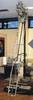
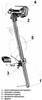

# ЛБ-09
> 2019.05.12 [🚀](../index/index.md) [despace](index.md) → **[ГЗУ](sss.md)**

[TOC]

---

> <small>**ЛБ-09** — русскоязычный термин, не имеющий аналога в английском языке. **LB-09** — дословный перевод с русского на английский.</small>

**ЛБ‑09** — буровая установка производства <mark>TBD</mark>.  
Разработчик . Разработано в 1975 году 

|*Characteristics*|*[Value](si.md)  (ЛБ-09)*|
|:--|:--|
|Composition| |
|Consumption, W|550 (среднее)|
|Dimensions, ㎜|3 200 × … × 3 200 |
|[Interfaces](interface.md)| |
|[Lifetime](lifetime.md)/Resource, h(y)|14/…|
|Mass, ㎏|55|
|[Overload](vibration.md), Grms| |
|[Rad.resist](ion_rad.md), ㏉ (㎭)| |
|[Reliability](qm.md) per [lifetime](lifetime.md)| |
|[Thermal range](tcs.md), ℃| |
|[TRL](trl.md)|9|
|[Voltage](voltage.md), V| |
|**【Specific】**|• • •|
|Глубина бурения, ㎜|2 600|
|Диаметр керна, ㎜|10|
|Масса забираемого грунта, г|170|
|Объём забираемого грунта, mm³| |
|Скорость бурения, ㎜/сек, ≥|2.5 (лунного)|
| | |

**Notes:**

   1. …
   1. **Applicability:**
      - КА «[Луна‑24](луна_24.md)»

 

## Docs & links (TRANSLATEME ALREADY)
|Navigation|
|:--|
|**[FAQ](faq.md)**【**[SCS](scs.md)**·КК, **[SC](sc.md)**·КА, **[OE](oe.md)**·БА, **[SGM](sgm.md)**·КММ】**[CON](contact.md)·[Pers](person.md)**·Контакт, **[Ctrl](control.md)**·Упр., **[Doc](doc.md)**·Док., **[EF](ef.md)**·ВВФ, **[Error](error.md)**·Ошибки, **[Event](event.md)**·События, **[FS](fs.md)**·ТЭО, **[HF&E](hfe.md)**·Эрго., **[KT](kt.md)**·КТ, **[Model](model.md)**·Модель, **[N&B](nnb.md)**·БНО, **[Patent](патент.md)**·Патент, **[Project](project.md)**·Проект, **[QM](qm.md)**·БКНР, **[R&D](rnd.md)**·НИОКР, **[SI](si.md)**·СИ, **[Test](test.md)**·ЭО, **[Timeline](timeline.md)**·ЦГМ, **[TRL](trl.md)**·УГТ|
|*Sections & pages*|
|**`Грунтозаборное устройство (ГЗУ):`**  [Каротаж](logging.md)・ [Стратификация](stratification.md) • • •  **РФ:** [ГЗУ-ЛР1](гзу_лр1.md)・ [ЛБ-15](lb_15.md) *([ВБ02](vb02.md)・ [ЛБ-09](lb_09.md)・ [ЛБ-10](lb_10.md))*|

   1. Docs:
      - [Презентация по КА «Луна‑Грунт» ❐](f/sss/l/2018_ikiran_sluta.djvu) (Москва, ИКИ РАН, 2018, Е.Н. Слюта)
   1. Notable interwikies — …
   1. <…>
