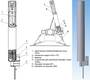

# ЛБ-10
> 2019.05.12 ┊ **🚀 [despace](index.md)** → **[ГЗУ](sss.md)**

[TOC]

---

> <small>*Термины:* **ЛБ-10** — русскоязычный термин, не имеющий аналога в английском языке. **LB-10** — дословный перевод с русского на английский.</small>

**ЛБ‑10** — грунтозаборное устройство (каротажно‑буровая установка, КБУ).  
*Разработчик:* КБОМ. Разработано в 1976 году 

||
|:--|
|   |

<small>

|*Характеристика*|*[Значение](si.md) <small>(ЛБ-10)</small>*|
|:--|:--|
|[УГТ](trl.md)| 9  |
| Глубина бурения, мм  | 15 000  |
| Диаметр керна, мм  |   |
| Масса забираемого грунта, г  |   |
| Объём забираемого грунта, mm³  |   |
| Скорость бурения, мм/сек, не менее  |   |
|**`Прочее`**||
|[ВБР](rams.md) за САС|   |
|Габариты, Д×Ш×В, мм|  … × … × … |
|Интерфейсы|   |
|Mass, kg|  244  |
|[Voltage](voltage.md), V|     |
|Overload, g|   |
|[Rad.resist](ion_rad.md), Gy (rad)|     |
|Resource, h (y)|   |
|[Lifetime](lifetime.md), h (y)|  |
|[Тепловой режим](tcs.md), °C|   |
|Consumption, W|     |

</small>

 

## Примечания
   1. …

## Применяемость
Прибор нигде не применяется.

 

## Docs & links (TRANSLATEME ALREADY)
|…°·•¹²³±×÷≤≥≈≠ ‑ −— ⎆✉ ❐“”’«»✔→✘☐☑├┕┆ 1 lb = 0.453592 kg; 1 g = 9.80665 m/s²|
|:--|
|<small>**[FAQ](faq.md)**, **[Cable](cable.md)**·БКС, **[Camera](camera.md)**·Камера, **[Comms](comms.md)**·Радиосв., **[Contact](contact.md)**·Контакт, **[Control](control.md)**·Управ., **[Doc](doc.md)**·Док., **[Doppler](doppler.md)**·ИСР, **[DS](ds.md)**·ЗУ, **[EB](eb.md)**·ХИТ, **[ECO](ecology.md)**·Экол., **[EF](ef.md)**·ВВФ, **[ElC](elc.md)**·ЭКБ, **[EMC](emc.md)**·ЭМС, **[Errors](error.md)**·Ошибки, **[Events](event.md)**·События, **[FS](fs.md)**·ТЭО, **[Fuel](fuel.md)**·Топливо, **[GNC](gnc.md)**·БКУ, **[GS](scs.md)**·НС, **[HF&E](hfe.md)**·Эргоном., **[IMU](imu.md)**·Гироскоп, **[Incubator](incubator.md)**·Инкуб., **[KT](kt.md)**·КТЕХ, **[LAG](lag.md)**·ПУC, **[LES](les.md)**·САСП, **[LS](ls.md)**·СЖО, **[LV](lv.md)**·РН, **[MAG](mag.md)**·Магнитом., **[MCC](mcc.md)**·ЦУП, **[Model](model.md)**·Модель, **[MSC](sc.md)**·ПКА, **[N&B](nnb.md)**·БНО, **[NR](nr.md)**·ЯР, **[OBC](obc.md)**·ЦВМ, **[OE](oe.md)**·БА, **[Patent](патент.md)**·Патент, **[Project](project.md)**·Проект, **[PS](ps.md)**·ДУ, **[QA](quality.md)**·QA, **[R&D](rnd.md)**·НИОКР, **[RAMS](rams.md)**·НиБ, **[Risk](risk.md)**·Риск, **[Robot](robotics.md)**·Робот, **[Rover](rover.md)**·Планетоход, **[RTG](rtg.md)**·РИТЭГ, **[RW](rw.md)**·ДМ, **[SARC](sarc.md)**·ПСК, **[Sensor](sensor.md)**·Датчик, **[SC](sc.md)**·КА, **[SCS](scs.md)**·КК, **[SGM](sgm.md)**·КММ, **[SI](si.md)**·СИ, **[Soft](soft.md)**·ПО, **[SP](sp.md)**·БС, **[Spaceport](spaceport.md)**·Космодром, **[SPS](sps.md)**·СЭС, **[SSS](sss.md)**·ГЗУ, **[TCS](tcs.md)**·СОТР, **[Test](test.md)**·ЭО, **[Timeline](timeline.md)**·Циклограмма, **[TMS](tms.md)**·ТМС, **[TOR](tor.md)**·ТЗ, **[TRL](trl.md)**·УГТ</small>|
|*Sections & pages*|
|**`Грунтозаборное устройство (ГЗУ):`**  [Каротаж](logging.md) ┊ [Стратификация](stratification.md) • • •  **РФ:** [ГЗУ-ЛР1](гзу_лр1.md) ┊ [ЛБ-15](lb_15.md) *([ВБ02](vb02.md) ┊ [ЛБ-09](lb_09.md) ┊ [ЛБ-10](lb_10.md))*|

**Docs:**

   1. 3D‑модель <mark>TBD</mark>
   1. Чертёж <mark>TBD</mark>
   1. [Презентация по КА «Луна‑Грунт» ❐](f/sss/2018_ikiran_sluta.djvu) (Москва, ИКИ РАН, 2018, Е.Н. Слюта)

**Links:**

   1. Notable interwikies — …
   1. <…>
