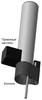
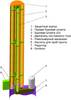
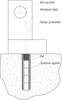

# LB-15
> 2019.05.12 [🚀](../index/index.md) [despace](index.md) → [SSS](sss.md)

[TOC]

---

**LB‑15** *(ru. ЛБ-15)* — soil sampling system (logging‑drilling rig) by GEOKHI RAS, TSNIIRTK. Designed in 2017.

|*Characteristics*|*[Value](si.md)  (LB‑15)*|
|:--|:--|
|Composition| |
|Consumption, W| |
|Dimensions, ㎜|2 000 × … × 2 000|
|[Interfaces](interface.md)| |
|[Lifetime](lifetime.md)/Resource, h(y)|… / …|
|Mass, ㎏|50 ‑ 70|
|[Overload](vibration.md), Grms| |
|[Rad.resist](ion_rad.md), ㏉ (㎭)| |
|[Reliability](qm.md) per [lifetime](lifetime.md)| |
|[Thermal range](tcs.md), ℃| |
|[TRL](trl.md)|1|
|[Voltage](voltage.md), V| |
|**【Specific】**|• • •|
|Core sample ⌀, ㎜|20|
|Drilling depth, ㎜|1 500 ‑ 6 000|
|Drilling speed, ㎜/s, ≥| |
|Soil sample mass, g|・840 (core sample length 1 500 ㎜)  ・1 680 (core sample length 3 000 ㎜)  ・2 520 (core sample length 4 500 ㎜)  ・3 360 (core sample length 6 000 ㎜)|
|Soil sample volume, ㎜³| |
| ||||

**Notes:**

   1. …
   1. **Applicability:** none.

## Docs & links
|Navigation|
|:--|
|**[FAQ](faq.md)**【**[SCS](scs.md)**·КК, **[SC (OE+SGM)](sc.md)**·КА】**[CON](contact.md)·[Pers](person.md)**·Контакт, **[Ctrl](control.md)**·Упр., **[Doc](doc.md)**·Док., **[EF](ef.md)**·ВВФ, **[Error](error.md)**·Ошибки, **[Event](event.md)**·События, **[FS](fs.md)**·ТЭО, **[HF&E](hfe.md)**·Эрго., **[KT](kt.md)**·КТ, **[Model](model.md)**·Модель, **[N&B](nnb.md)**·БНО, **[Patent](патент.md)**·Пат., **[Project](project.md)**·Проект, **[QM](qm.md)**·БКНР, **[R&D](rnd.md)**·НИОКР, **[SI](si.md)**·СИ, **[Test](test.md)**·ЭО, **[TRL](trl.md)**·УГТ, **[Way](way.md)**·Пути|
|*Sections & pages*|
|**【Soil sampling system (SSS)】**  [Logging](sss.md)・ [Stratification](sss.md) • • •  **RU:** [GZU-LR1](гзу_лр1.md)・ [LB-15](lb_15.md) *([VB02](vb02.md)・ [LB-09](lb_09.md)・ [LB-10](lb_10.md))*|

   1. Docs: [A part of Slyuta’s presentation ❐](f/sss/l/lb-15_presentation_2018_sluta.pdf) (Moscow, IKI RAS, 2018)
   1. Notable interwikies — …
   1. <…>
