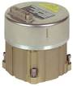

# LN-200
> 2019.05.12 [🚀](../index/index.md) [despace](index.md) → **[Гироскоп](iu.md)**

[TOC]

---

> <small>**LN-200** — англоязычный термин, не имеющий аналога в русском языке. **ЛН-200** — дословный перевод с английского на русский.</small>

**LN‑200** — волоконно‑оптический [гироскоп](iu.md) (ВОГ) в составе [КА](sc.md), предназначенный для определения положения КА в инерциальной системе отсчёта.  
*Разработчик:* [Northrop Grumman](zz_northrop_grumman.md). Разработано в 1994 году 

||
|:--|
||

<small>

|*Характеристика*|*[Значение](si.md) <small>(LN‑200)</small>*|*[Значение](si.md) <small>(LN‑200c)</small>*|*[Значение](si.md) <small>(LN‑200s)</small>*|
|:--|:--|:--|:--|
|Диапазон измерения лин. ускорения|± 100 °/с²;  ± 392 ㎧²|± 100 °/с²;  ± 148 ㎧²|± 392 ㎧²|
|Диапазон измерения угл. скорости|± 11.4 °/с|± 490 °/с|± 1 °/с|
|Исполнение|Моноблок, герметичный|Моноблок, герметичный|Моноблок, герметичный|
|Количество|—|—|—|
|<small>• акселерометров в приборе</small>||||
|<small>• ВОГ в приборе</small>||||
|<small>• приборов в БКУ</small>||||
|Нестабильность угл. положения осей чувств‑ти, не более:|
|<small>• в канале акселерометров</small>|||0.0057°|
|<small>• в углоизмерительном канале</small>||||
|Случайная составляющая погрешности нулевого сигнала, не более|—|—|—|
|<small>• в запуске после калибровки в углоизмерительном канале</small>|1 °/ч (1 σ)|0.65 °/ч (1 σ)|1 °/ч (1 σ)|
|<small>• от запуска к запуску в канале акселерометров</small>|0.03 ㎧² (1 σ)|0.2 ‑ 0.0003 ㎧² (1 σ)||
|<small>• от запуска к запуску в углоизмерительном канале</small>|3 °/ч (1 σ)|1 ‑ 2 °/ч (1 σ)||
|<small>• в запуске после калибровки в канале акселерометров</small>|0.00003 ㎧² (1 σ)||0.0003 ㎧² (1 σ)|
|Стабильность цены импульса, не более|—|—|—|
|<small>• в канале акселерометров</small>|0.0003 ‑ 0.005 % (1 σ)|0.001 ‑ 0.0003 %  (1 σ)|0.0003 %  (1 σ)|
|<small>• в углоизмерительном канале</small>|0.0001 ‑ 0.0005 % (1 σ)|0.0001 % (1 σ)|0.0001 % (1 σ)|
|[TRL](trl.md)|9|9|9|
|Цена импульса (масштабный  коэффициент), не более|—|—|—|
|<small>• в канале акселерометров</small>||||
|<small>• в углоизмерительном канале</small>||||
|Шумовая составляющая в выходной информации, не более|—|—|—|
|<small>• в канале акселерометров</small>||0.000035 ㎧²·Гц|0.000035 ㎧²·Гц|
|<small>• в углоизмерительном канале</small>||||
|**`Прочее`**||||
|[ВБР](srrq.md) за САС||||
|Габариты, ⌀ × в, ㎜|89 × 85|89 × 85|89 × 85|
|Интерфейсы|RS-485|RS-485|RS-422/485|
|Масса, кг, ≤|от 0.75 до 1.25|0.75|0.75|
|[Voltage](voltage.md), V|+5, ± 15;  от +13 до +35|+5, ± 15|+5, ± 15|
|Overload, g||||
|[Rad.resist](ion_rad.md), Gy (rad)|||100 (10 000)|
|Resource, h (y)|20 000 (2.3)|20 000 (2.3)|20 000 (2.3)|
|[Lifetime](lifetime.md), h (y)||||
|[Temp. range](tcs.md), ℃|от –54 до +71 ℃|от –54 до +71 ℃|от –54 до +71 ℃ (вкл);  от –62 до +85 ℃ (выкл)|
|Consumption, W|от 12 до 16|12|12|

</small>

 

## Примечания
   1. …

## Применяемость
По состоянию на 2018.03.26 прибор LN‑200 применяется много где, выпущено более 30 000 LN‑200, например:

   1. [Falcon 9](falcon.md)
   1. [Dragon V1](dragon.md)

 

## Docs & links (TRANSLATEME ALREADY)
|Navigation|
|:--|
|**[FAQ](faq.md)**, **[Cable](cable.md)**·БКС, **[Camera](cam.md)**·Камера, **[Comms](comms.md)**·Радио, **[Contact](contact.md)**·Контакт, **[Control](control.md)**·Упр., **[Doc](doc.md)**·Док., **[Doppler](doppler.md)**·ИСР, **[DS](ds.md)**·ЗУ, **[EB](eb.md)**·ХИТ, **[ECO](ecology.md)**·Экол., **[EF](ef.md)**·ВВФ, **[ElC](elc.md)**·ЭКБ, **[EMC](emc.md)**·ЭМС, **[Error](error.md)**·Ошибки, **[Event](event.md)**·События, **[FS](fs.md)**·ТЭО, **[Fuel](fuel.md)**·Топливо, **[GNC](gnc.md)**·БКУ, **[GS](scs.md)**·НС, **[HF&E](hfe.md)**·Эрго., **[IU](iu.md)**·Гиро., **[KT](kt.md)**·КТЕХ, **[LAG](lag.md)**·ПУC, **[LES](les.md)**·САСП, **[LS](ls.md)**·СЖО, **[LV](lv.md)**·РН, **[MCC](mcc.md)**·ЦУП, **[Model](model.md)**·Модель, **[MSC](sc.md)**·ПКА, **[N&B](nnb.md)**·БНО, **[NR](nr.md)**·ЯР, **[OBC](obc.md)**·ЦВМ, **[OE](oe.md)**·БА, **[Pat.](патент.md)**·Патент, **[Proj.](project.md)**·Проект, **[PS](ps.md)**·ДУ, **[R&D](rnd.md)**·НИОКР, **[Robot](robotics.md)**·Робот, **[Rover](rover.md)**·Ровер, **[RTG](rtg.md)**·РИТЭГ, **[SARC](sarc.md)**·ПСК, **[Sensor](sensor.md)**·Датчик, **[SC](sc.md)**·КА, **[SCS](scs.md)**·КК, **[SGM](sgm.md)**·КММ, **[SI](si.md)**·СИ, **[Soft](soft.md)**·ПО, **[SP](sp.md)**·БС, **[Spaceport](spaceport.md)**·Космодр., **[SPS](sps.md)**·СЭС, **[SRRQ](srrq.md)**·БКНР, **[SSS](sss.md)**·ГЗУ, **[TCS](tcs.md)**·СОТР, **[Test](test.md)**·ЭО, **[Timeline](timeline.md)**·ЦГМ, **[TMS](tms.md)**·ТМС, **[TOR](tor.md)**·ТЗ, **[TRL](trl.md)**·УГТ|
|*Sections & pages*|
|**`Гироскоп:`**  … • • •  **Европа:** [Astrix 1090](astrix_1090.md) (4.8)  ▮  **РФ:** [ИУС-ВОА](ius_voa.md) (15.1) ┊ [БИУС-Л](bius_l.md) (10) ┊ [БИУС-М](bius_m.md) (5.1) ┊ [БИБ-ФГ](bib_fg.md) (1.36) ┊ [㎆ИНС](mbins.md) (1.34) ··· *([БИБ-ИГ](bib_ig.md) (3.6))*  ▮  **США:** [LN-200](ln_200.md) (1.25)|

   1. Docs:
      - [Брошюры от Northrop Grumman ❐](f/iu/l/ln-200_doc1.djvu)
   1. Notable interwikies — …
   1. <http://www.northropgrumman.com/Capabilities/LN200FOG/Pages/default.aspx> — [archive ❐](f/iu/l/ln-200_northropgrumman_com.djvu) of 2018.03.26)
