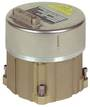

# LN-200
> 2019.05.12 ┊ **🚀 [despace](index.md)** → **[Гироскоп](imu.md)**

[TOC]

---

> <small>*Термины:* **LN-200** — англоязычный термин, не имеющий аналога в русском языке. **ЛН-200** — дословный перевод с английского на русский.</small>

**LN‑200** — волоконно‑оптический [гироскоп](imu.md) (ВОГ) в составе [КА](sc.md), предназначенный для определения положения КА в инерциальной системе отсчёта.  
*Разработчик:* [Northrop Grumman](03_northrop_grumman.md). Разработано в 1994 году 

||
|:--|
|   |

<small>

|*Характеристика*|*[Значение](si.md) <small>(LN‑200)</small>*|*[Значение](si.md) <small>(LN‑200c)</small>*|*[Значение](si.md) <small>(LN‑200s)</small>*|
|:--|:--|:--|:--|
| Диапазон измерения лин. ускорения  |± 100 °/с²;  ± 392 м/с²  |± 100 °/с²;  ± 148 м/с²  |± 392 м/с²  |
| Диапазон измерения угл. скорости  |± 11.4 °/с  |± 490 °/с  |± 1 °/с  |
|Исполнение|  Моноблок, герметичный  | Моноблок, герметичный  | Моноблок, герметичный  |
| Количество  |—|—|—|
| <small>• акселерометров в приборе</small>  |  |  |  |
| <small>• ВОГ в приборе</small>  |  |  |  |
| <small>• приборов в БКУ</small>  |  |  |  |
|Нестабильность угл. положения осей чувств‑ти, не более: |
| <small>• в канале акселерометров</small>  |  |  |0.0057°  |
| <small>• в углоизмерительном канале</small>  |  |  |  |
| Случайная составляющая погрешности нулевого сигнала, не более  |—|—|—|
| <small>• в запуске после калибровки в углоизмерительном канале</small>  |1 °/ч (1 σ)  |0.65 °/ч (1 σ)  |1 °/ч (1 σ)  |
| <small>• от запуска к запуску в канале акселерометров</small>  |0.03 м/с² (1 σ)  |0.2 ‑ 0.0003 м/с² (1 σ)  |  |
| <small>• от запуска к запуску в углоизмерительном канале</small>  |3 °/ч (1 σ)  |1 ‑ 2 °/ч (1 σ)  |  |
| <small>• в запуске после калибровки в канале акселерометров</small>  |0.00003 м/с² (1 σ)  |  |0.0003 м/с² (1 σ)  |
| Стабильность цены импульса, не более  |—|—|—|
| <small>• в канале акселерометров</small>  |0.0003 ‑ 0.005 % (1 σ)  |0.001 ‑ 0.0003 %  (1 σ)  |0.0003 %  (1 σ)  |
| <small>• в углоизмерительном канале</small>  |0.0001 ‑ 0.0005 % (1 σ)  |0.0001 % (1 σ)  |0.0001 % (1 σ)  |
|[УГТ](trl.md)|9  |9  |9  |
| Цена импульса (масштабный  коэффициент), не более  |—|—|—|
| <small>• в канале акселерометров</small>  |  |  |  |
| <small>• в углоизмерительном канале</small>   |  |  |  |
| Шумовая составляющая в выходной информации, не более  |—|—|—|
|<small>• в канале акселерометров</small>  |  |0.000035 м/с²·Гц  |0.000035 м/с²·Гц  |
|<small>• в углоизмерительном канале</small>  |  |  |  |
|**`Прочее`**||||
|[ВБР](rams.md) за САС|   |  |  |
| Габариты, ∅ × в, мм  |  89 × 85  | 89 × 85  | 89 × 85  |
|Интерфейсы| RS-485  |RS-485  |RS-422/485  |
| Масса, кг, не более  |от 0.75 до 1.25  |0.75  |0.75  |
|[Напряжение](voltage.md), В| +5, ± 15;  от +13 до +35  |+5, ± 15  |+5, ± 15  |
|Перегрузки, g|   |  |  |
|[Радстойкость](ion_rad.md), Гр (рад)|   |  |100 (10 000)  |
|Ресурс, ч (лет)|   20 000 (2.3)  | 20 000 (2.3)  | 20 000 (2.3)  |
|[САС](lifetime.md), ч (лет)|   |  |  |
|[Тепловой режим](tcs.md), °C| от –54 до +71 °C  |от –54 до +71 °C  |от –54 до +71 °C (вкл);  от –62 до +85 °C (выкл)  |
|Эл. потребление, Вт| от 12 до 16  |12  |12  |

</small>

 

## Примечания
   1. …

## Применяемость
По состоянию на 2018.03.26 прибор LN‑200 применяется много где, выпущено более 30 000 LN‑200, например:

   1. [Falcon 9](falcon.md)
   1. [Dragon V1](dragon.md)

---

## Docs & links (TRANSLATEME ALREADY)
|…°·•¹²³±×÷≤≥≈≠ ‑ −— ⎆✉ ❐“”’«»✔→✘☐☑├┕┆ 1 lb = 0.453592 kg; 1 g = 9.80665 m/s²|
|:--|
|<small>**[FAQ](faq.md)**, **[Cable](cable.md)**·БКС, **[Camera](camera.md)**·Камера, **[Comms](comms.md)**·Радиосв., **[Contact](contact.md)**·Контакт, **[Control](control.md)**·Управ., **[Doc](doc.md)**·Док., **[Doppler](doppler.md)**·ИСР, **[DS](ds.md)**·ЗУ, **[EB](eb.md)**·ХИТ, **[ECO](ecology.md)**·Экол., **[EF](ef.md)**·ВВФ, **[ElC](elc.md)**·ЭКБ, **[EMC](emc.md)**·ЭМС, **[Errors](error.md)**·Ошибки, **[Events](event.md)**·События, **[FS](fs.md)**·ТЭО, **[Fuel](fuel.md)**·Топливо, **[GNC](gnc.md)**·БКУ, **[GS](scs.md)**·НС, **[HF&E](hfe.md)**·Эргоном., **[IMU](imu.md)**·Гироскоп, **[Incubator](incubator.md)**·Инкуб., **[KT](kt.md)**·КТЕХ, **[LAG](lag.md)**·ПУC, **[LES](les.md)**·САСП, **[LS](ls.md)**·СЖО, **[LV](lv.md)**·РН, **[MAG](mag.md)**·Магнитом., **[MCC](mcc.md)**·ЦУП, **[Model](model.md)**·Модель, **[MSC](sc.md)**·ПКА, **[N&B](nnb.md)**·БНО, **[NR](nr.md)**·ЯР, **[OBC](obc.md)**·ЦВМ, **[OE](oe.md)**·БА, **[Patent](патент.md)**·Патент, **[Project](project.md)**·Проект, **[PS](ps.md)**·ДУ, **[QA](quality.md)**·QA, **[R&D](rnd.md)**·НИОКР, **[RAMS](rams.md)**·НиБ, **[Risk](risk.md)**·Риск, **[Robot](robotics.md)**·Робот, **[Rover](rover.md)**·Планетоход, **[RTG](rtg.md)**·РИТЭГ, **[RW](rw.md)**·ДМ, **[SARC](sarc.md)**·ПСК, **[Sensor](sensor.md)**·Датчик, **[SC](sc.md)**·КА, **[SCS](scs.md)**·КК, **[SGM](sgm.md)**·КММ, **[SI](si.md)**·СИ, **[Soft](soft.md)**·ПО, **[SP](sp.md)**·БС, **[Spaceport](spaceport.md)**·Космодром, **[SPS](sps.md)**·СЭС, **[SSS](sss.md)**·ГЗУ, **[TCS](tcs.md)**·СОТР, **[Test](test.md)**·ЭО, **[Timeline](timeline.md)**·Циклограмма, **[TMS](tms.md)**·ТМС, **[TOR](tor.md)**·ТЗ, **[TRL](trl.md)**·УГТ</small>|

**Docs:**

   1. 3D-модель <mark>TBD</mark>
   1. Чертёж <mark>TBD</mark>
   1. [Брошюры от Northrop Grumman ❐](f/imu/l/ln-200_doc1.djvu)

**Links:**

   1. Notable interwikies — …
   1. <http://www.northropgrumman.com/Capabilities/LN200FOG/Pages/default.aspx> — [archive ❐](f/imu/l/ln-200_northropgrumman_com.djvu) of 2018.03.26)

|*Sections & pages*|
|:--:|
|**`Гироскоп:`**  … • • •  **Европа:** [Astrix 1090](astrix_1090.md) (4.8)  ▮  **РФ:** [ИУС-ВОА](ius_voa.md) (15.1) ┊ [БИУС-Л](bius_l.md) (10) ┊ [БИУС-М](bius_m.md) (5.1) ┊ [БИБ-ФГ](bib_fg.md) (1.36) ┊ [МБИНС](mbins.md) (1.34) ··· *([БИБ-ИГ](bib_ig.md) (3.6))*  ▮  **США:** [LN-200](ln_200.md) (1.25) |
