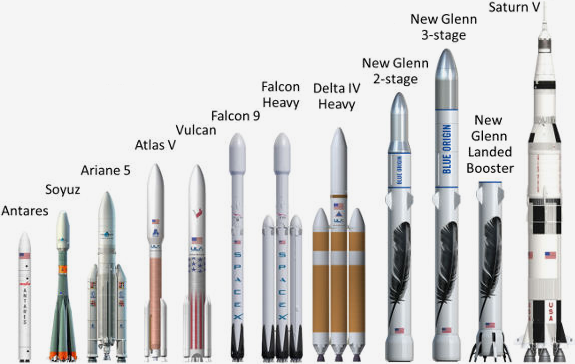

# Ракета‑носитель сотоварищи
> 2019.07.01 [🚀](../index/index.md) [despace](index.md) → [LV](lv.md)

[TOC]

---

> <small> ・**Ракета‑носитель (РН)** — русскоязычный термин. **Launch vehicle (LV) / Launcher / Carrier rocket / Expendable launch vehicle** — англоязычный эквивалент.  ・**Разгонный блок (РБ)** — русскоязычный термин. **Upper stage (UST)** — англоязычный эквивалент.  ・**Головной обтекатель (ГО)** — русскоязычный термин. **Payload fairing (PLF) / Fairing** — англоязычный эквивалент. **Nose cone (NC)** — примерный англоязычный эквивалент.  ・**Переходный отсек (ПхО)** — русскоязычный термин. **Spacecraft adapter (SCA)** — англоязычный эквивалент.</small>

**Раке́та‑носи́тель** (**РН**, также **[раке́та косми́ческого назначе́ния, РКН](lv.md)**) — ракета, предназначенная для выведения полезной нагрузки в космическое пространство.

Обычно включает в свой состав [РБ](lv.md) и стартует с [космодрома](spaceport.md). Иногда термин «ракета‑носитель» применяется в широком значении: ракета для доставки в заданную точку (космос, район Земли) полезной нагрузки — например, ИСЗ, КА, боевых блоков. В такой трактовке термин объединяет термины «[ракета космического назначения](lv.md)» и «[межконтинентальная баллистическая ракета](icbm.md)».

**Разгонный блок (РБ)** — часть [РКН](lv.md), предназначенная для доставки одного или нескольких [КА](sc.md) на орбиты или траектории назначения после отделения от [LV](lv.md).

Также ㎝. [Контейнеры для транспортировки](ship_contain.md) и [Космическая головная часть](lv.md).

**Тенденции.**

   - **У России:**
      - вывести из употребления «Союз‑2» и «Протон»;
      - ввести в употребление «Союз‑5» как замену «Союз‑2», «Протон‑М», «Зенит», «Ангара»;
      - создать и употребить сверхтяжёлую РН в пику США с их «Falcon Heavy», «SLS», «New Glenn».

**Launch services:**

| | |
|:--|:--|
|**AE**|…|
|**AU**|…|
|**CA**|・[C6 Launch](contact/c6_launch.md) — for small sats  ・[Columbiad](contact/columbiad.md)  ・[MLS](contact/mls.md)  ・[SpaceRyde](contact/spaceryde.md) — dedicated launch for CubeSats using balloons  ・[Space Concordia](contact/space_concordia.md) — (Student community) Small rockets|
|**CN**|…|
|**EU**|…|
|**IL**|…|
|**IN**|…|
|**JP**|…|
|**KR**|…|
|**RU**|…|
|**SA**|…|
|**SG**|…|
|**US**|…|
|**VN**|…|

 

## РН

|*Наименование*|*ПН на  [НОО](nnb.md)-200, т*|*ПН на  [ГПО](nnb.md), т*|*[Цена](fs.md),  млн \$*|*[Цена](fs.md) ([НОО](nnb.md)),  тыс.\$/кг*|*Страна  (дата оценки)*|*% ПН от  ст.массы*|
|:--|:--|:--|:--|:--|:--|:--|
|[Antares](antares.md)|8|2.8|80 ‑ 85|10.6 ‑ 10.0|США (2019)| |
|[Arian 5](arian.md)|16 ‑ 20|6.1 ‑ 10.8|165 ‑ 220|10.3|Европа (2017)| |
|[Atlas 5](atlas.md)|9.8 ‑ 18.8|4.7 ‑ 8.9|109 ‑ 153|8.1|США (2017)| |
|[Delta 4](delta.md)|9.4 ‑ 28.8|4.4 ‑ 14.2|375|40 ‑ 13|США (2017)| |
|[Electron](electron.md)|0.25|—|6|21.8|Н.Зел. (2017)|1.99|
|[Epsilon](epsilon.md)|1.5|0.4|39|26|Япония (2019)|1.57|
|[Falcon 9](falcon.md)|18.5 ‑ 22.8|5.5 ‑ 8.3|52 ‑ 62|2.8 ‑ 2.7|США (2019)|3.36 ‑ 4.15|
|[Falcon Heavy](falcon.md)|30 ‑ 63.8|8 ‑ 26.7|90 ‑ 150|3 ‑ 2.35|США (2019)|2.11 ‑ 4.49|
|[H-IIA](h2.md)|10 ‑ 15|4.1 ‑ 6|90|9 ‑ 6|Япония (2019)|3.37 ‑ 3.50|
|[H-IIB](h2.md)|16.5|8|112.5|5.9|Япония (2019)|3.01|
|[GSLV Mk.II](gslv.md)|5|2.5|47|9.4|Индия (2019)|1.20|
|[GSLV Mk.III](gslv.md)|8|4|46 ‑ 62|7.7 ‑ 5.8|Индия (2019)|1.24|
|[Long March 5](long_march.md)|25|14| | |Китай (2017)| |
|[Long March 6](long_march.md)|1.5|0.4| | |Китай (2017)| |
|[Long March 7](long_march.md)|13.5|7| | |Китай (2017)| |
|[Minotaur 4 и 5](minotaur.md)|1.7|0.34|50|34.7|США (2017)| |
|[Momo](momo.md)|0.02|—|0.44|22|Japan (2017)|2|
|[Nuri](nuri.md)|3.0|—|—|—|Корея Юж. (2020)|—|
|[Pegasus](pegasus.md)|0.45|—|56.3|140.8|США (2017)| |
|[PSLV](pslv.md)|3.8|1.3|15|4|Индия (2017)| |
|[Safir](safir.md)|0.065|—| | |Иран (2019)|0.25|
|[Shavit](shavit.md)|0.38|—|25|65.7|Израиль (2005)|1.24|
|[Simorgh](simorgh.md)|0.15|—| | |Иран (2019)|0.17|
|[Smart Dragon 1](smart_dragon.md)|0.25|—| | |Китай (2019)|1.08|
|[Unha](unha.md)|0.2|—| | |Корея Сев. (…)| |
|[Vega](vega.md)|2|0.5|25|12.5|Европа (2017)| |
|[Ангара](angara.md)|3.8 ‑ 25.8|3.6 ‑ 12.5|100|26.3 ‑ 3.9|Россия (2017)| |
|[Протон‑М](proton.md)|23|7.1|65|2.9|Россия (2017)|3.03 ‑ 3.26|
|[Союз‑2](soyuz.md)|9|3.2|48|5.3|Россия (2017)| |
| | | | | | | |
|**Планируемые**|• • •|• • •|• • •|• • •|• • •|• • •|
|[Arian 6](arian.md)|20|4.5 ‑ 12|90|4.5|Европа (2017)| |
|[BFR](bfr.md)|100|29| | |США (2019)| |
|[Blue Whale 1](blue_whale.md)|0.065|0.05| | |Корея Юж. (2020)| |
|[Firefly Alpha](firefly_alpha.md)|0.4|—|9|22.5|США (2017)| |
|[Hyperbola-1](hyperbola.md)| | | | |Китай (2019)| |
|[Arian 6](arian.md)|20|4.5 ‑ 12|90|4.5|Европа (2017)| |
|[LauncherOne](launcherone.md)|0.3 ‑ 0.5|—|10 ‑ 12|33.3 ‑ 24|США (2019)| |
|[MIURA](miura.md)|0.3 ‑ 0.5| | | |EU (2020)| |
|[New Armstrong](new_armstrong.md)| | | | |США (…)| |
|[New Glenn](new_glenn.md)|45|13| | |США (2017)| |
|[Omega](omega.md)|18 ‑ 37|4.9 ‑ 10| | |США (2019)| |
|[SLS](sls.md)|70 ‑ 130| |1 100|3.8|США (2017)| |
|[Stardust](stardust.md)|0.15| | | |Индия (2020)| |
|[Vulcan](vulcan.md)|15 ‑ 23| |100|4.3|США (2017)| |
|[Zero](zero.md)|0.1| | | |Japan (2017)| |
|[Зенит‑3SL](zenit.md)|21|6.1|67 ‑ 72|3.4 ‑ 3.2|Россия (2018)| |
|[Союз‑5](soyuz.md)| | | | |Россия (…)| |
|[СТК](yenisei.md)|70 ‑ 140|26 ‑ 29| | |Россия (2019)|3.15 ‑ 4.86|
| | | | | | | |
|**Исторические**|• • •|• • •|• • •|• • •|• • •|• • •|
|[Naro-1](naro_1.md)| | | | |Корея Юж. (…)| |
|[Saturn](saturn_lv.md)| | | | |США (…)| |
|[Sea Dragon](sea_dragon.md)| | | | | | |
|[Shuttle](shuttle.md)| | | | |США (…)| |
|[Корона](korona.md)| | | | |Россия (…)| |
|[Н-1](n_1.md)|90 ‑ 100|—|—|—|СССР (2019)|3.29 ‑ 3.39|
|[Р-1](r_7.md)| | | | |СССР (…)| |
|[Энергия](energia.md)| | | | |СССР (…)| |

**Классификация**

В отличие от некоторых горизонтально‑стартующих [авиационно‑космических систем (АКС)](sc.md), РН используют вертикальный тип старта и (много реже) воздушный старт.

   1. **Количество ступеней.** Одноступенчатых РН, выводящих ПН в космос, до настоящего времени не создано, хотя имеются проекты ([КОРОНА](korona.md), HEAT‑1X и др.). Иногда как одноступенчатая может классифицироваться РН, имеющая в качестве первой ступени воздушный носитель, либо ускорители. Среди баллистических ракет, способных достичь космоса, немало одноступенчатых, в т.ч. и первая баллистическая ракета «Фау‑2»; но ни одна из них не способна выйти на ОИСЗ.
   1. **Компоновка.** Конструктивное исполнение РН может быть следующим:
      - продольная (тандемная) — ступени расположены одна за другой и работают в полёте поочерёдно (РН «[Зенит‑2](zenit.md)», «[Протон](proton.md)», «[Delta-4](delta.md)»);
      - параллельная (пакетная) — несколько блоков, расположенных параллельно и относящихся к разным ступеням, работают в полёте одновременно (РН «[Союз](soyuz.md)»);
      - условно‑пакетная (полутораступенчатая) — используются общие баки для всех ступеней, от них питаются стартовые и маршевые двигатели, запускающиеся и работающие одновременно; по завершении работы стартовых двигателей сбрасываются только они.
   1. **Двигатели.** В качестве маршевых двигателей могут использоваться:
      - [жидкостные ракетные двигатели](engine_type.md);
      - [твердотопливные ракетные двигатели](engine_type.md);
      - различные комбинации на разных ступенях.
   1. **Повторное использование.** Распространены одноразовые многоступенчатые РН пакетной и продольной схем. Одноразовые РН высоконадёжны из‑за упрощения СЧ. Одноступенчатой РН для достижения орбитальной скорости нужна конечная масса ≤ 7‑10 % стартовой, что труднореализуемо и неэффективно из‑за малой массы ПН. Такие РН почти не создавались, только полутораступенчатые («[Atlas](atlas.md)» со сбрасываемыми двигателями). Ступени увеличивают отношение массы ПН к начальной массе РН, но требуют отчуждения территорий для своего падения. Полностью многоразовых РН пока не существует (за 1990‑2000 гг были попытки: ROTON, Kistler K‑1, VentureStar и др.). Частично многоразовые: «[Спейс шаттл](shuttle.md)» и «Энергия‑Буран», и нереализованные («Спираль», МАКС и др.) и новые («Байкал‑Ангара») проекты. «Спейс шаттл» не снизил стоимость ПН. Пилотируемые [МТКС](sc.md) имеют сложную и длительную подготовку для высокой надёжности и безопасности.
   1. **Присутствие человека.** РН для пилотируемых полётов должны обладать бо́льшей надёжностью (также на них устанавливается система аварийного спасения); допустимые перегрузки для них ограничены (обычно не более 3‑4.5 единиц). При этом сама РН является полностью автоматической системой, выводящей в космос КА с людьми на борту.
   1. **Масса ПН.** Классификация ракет по массе ПН, выводимой на НОО:

|*Класс ракеты‑носителя*|*Масса полезной нагрузки на [НОО](nnb.md)*|
|:--|:--|
|Нано‑носитель|До нескольких десятков ㎏|
|Сверхлёгкая ракета‑носитель|До нескольких сотен ㎏|
|Лёгкая ракета‑носитель|До 5 тонн|
|Ракета‑носитель среднего класса|От 5 до 20 тонн|
|Тяжёлая ракета‑носитель|От 20 до 50 тонн|
|Сверхтяжёлая ракета‑носитель|Свыше 50 тонн|

 

### РБ
**РБ** включает в свой состав:

   1. <mark>TBD</mark>
   1. **нижний переходник** — часть РБ, остающаяся на РН после отделения.

|*Страна*|*Актуальные*|*Исторические*|
|:--|:--|:--|
|**Европа**| | |
|**Индия**| | |
|**Китай**| | |
|**Корея северная**| | |
|**Корея южная**| | |
|**РФ, СНГ**|[Бриз](бриз.md)・ [Блок Д](блок_д.md)・ [Волга](волга.md)・ [КВТК](квтк.md)・ [Фрегат](fregat.md)| |
|**США**| | |
|**Япония**| | |
|**Прочие**| | |

**Manufacturers**

| | |
|:--|:--|
|**AU**|…|
|**CA**|…|
|**CN**|…|
|**EU**|…|
|**IN**|…|
|**IL**|…|
|**JP**|・[IHI](contact/ihi.md)  ・[Interstellar Technologies](contact/interstellar_tech.md)  ・[Kawasaki HVI](contact/kawasaki_hvi.md) — fairings  ・[Mitsubishi HVI](contact/mitsubishi.md)|
|**KR**|・[KAI](contact/kai.md)  ・[KARI](contact/kari.md)  ・[Perigee Aerospace](contact/perigee_as.md) — small suborbital LV|
|**RU**|…|
|**SA**|…|
|**SG**|…|
|**US**|…|
|**AE**|…|
|**VN**|…|

### Головной блок
> <small>**Головной блок (ГБ)** — русскоязычный термин, не имеющий аналога в английском языке. **Space head unit (SHU)** — дословный перевод с русского на английский.</small>

**Головной блок (ГБ)** — неофициальной название связки [КА](sc.md) и [РБ](lv.md).

 

### Головной обтекатель
**Головной обтекатель** (ГО) предназначен для защиты КА и РБ от аэродинамических и тепловых нагрузок во время прохождения РКН плотных слоев атмосферы, а также от внешних воздействий при транспортировании КГЧ автономно, в составе РН на стартовый комплекс (СК) и нахождении на нём.  
Головной обтекатель представляет тело вращения, состоящее из носовой части в виде двойного конуса и цилиндрической части. ГО состоит из двух одинаковых по конструкции створок, соединенных между собой по продольному стыку механическими замками.  
Каждая створка представляет панель, содержащую продольный и поперечный силовой набор (стрингеры, шпангоуты и диафрагмы) и обшивку, которые соединяются между собой при помощи заклёпок, болтов, соединительных фитингов и кронштейнов.

В среднем стоимость ГО в 2017 ‑ 2018 гг составляла 6 ‑ 7 млн $.

**Список известных ГО**

|*Разработчик*|*Наименование*|*Для РН, РБ*|*Диаметр, ㎜*|*Длина, ㎜*|*Масса, кг*|*Документы*|*Применение*|
|:--|:--|:--|:--|:--|:--|:--|:--|
|НПО Лавочкина|**1.750**|Союз, Фрегат|3 715|8 450|1 180| |[Луна‑Глоб](луна_25.md), [Луна‑Ресурс‑1 (ОА)](луна_26.md), [Луна‑Ресурс‑1 (ПА)](луна_27.md)	|
|НПО Лавочкина|**14С737**|Союз, Фрегат|3 715|10 400|1 400| | |
|НПО Лавочкина|**АМГЭ**, **465ГК.Г**|Зенит, Фрегат‑СБ;  Протон‑М, Блок‑ДМ|4 100|10 400|1 670| |[Спектр‑Р](спектр_р.md), [Фобос‑Грунт](фобос‑грунт.md), [Электро‑Л](электро_л.md)|
|НПО Лавочкина|**АМГ**|Зенит, Фрегат‑СБ|4 100|11 350|1 870|[Чертёж ❐](f/lv/npol-amg.dwg);  [Картинка ❐](f/lv/npol-amg.pdf)| |
|[РКЦ Прогресс](contact/progress_rsc.md)|**81КС**|Союз‑2, Фрегат|4 100|11 433|1 500|[Чертёж ❐](f/lv/progress-81ks.pdf);  [Картинка ❐](f/lv/progress-81ks.png)| |

### Переходный отсек
**Переходный отсек** (ПхО) обеспечивает стыковку космической головной части с блоком предыдущей ступени ракеты‑носителя и установку головного обтекателя, а также транзит электрических и газовых связей систем РБ, КА и ГО с системами РН и наземной аппаратурой на СК через транзитные электрические цепи и газовые магистрали РН. Состыкованный с ГО корпус ПхО обеспечивает пылевлаго‑защищенность РБФ и КА от воздействия окружающей среды при подготовке к запуску и в полёте (до сброса ГО).

**Список известных ПхО**

|*Разработчик*|*Наименование*|*Для ГО*|*Диаметр, ㎜*|*Длина, ㎜*|*Масса, кг*|*Документы*|*Применение*|
|:--|:--|:--|:--|:--|:--|:--|:--|
|НПО Лавочкина|**14С227**|1.750;  14С737| | |345| | |
|НПО Лавочкина|**РБФСТМ**|81КС| | |465| | |
|НПО Лавочкина|**РБФЗТ**|АМГ;  АМГЭ;  465ГК.Г| | |390| | |
|НПО Лавочкина| | | | | | | |

### Средство выведения
> <small>**Средства выведения (СВ)** — русскоязычный термин. **Launch vehicle (LV) / Launcher / Carrier rocket / Expendable launch vehicle** — примерный англоязычный эквивалент.</small>

**Средство выведения** — по ГОСТ Р 52925 п.3.4 — космическое средство, предназначенное для доставки орбитальных средств с поверхности [Земли](earth.md) в заданные области космического пространства с заданными параметрами движения.

Описание средств выведения и их состав описан в ГОСТ Р 53802.

В частности, средства выведения включают в себя: [ракету‑носитель](lv.md), [разгонный блок](lv.md), [космическую головную часть](lv.md), головной обтекатель, [переходной отсек](lv.md), [переходной отсек](lv.md).

### РКК
> <small>**Ракетно‑космический комплекс (РКК)** — русскоязычный термин, не имеющий аналога в английском языке. **Rocket and space complex** — дословный перевод с русского на английский.</small>

**Ракетно‑космический комплекс (РКК)** — это совокупность ракеты или [РКН](lv.md) с функционально взаимосвязанными техническими средствами и сооружениями, предназначенными для обеспечения транспортирования, хранения, приведения и содержания в готовности, технического обслуживания, подготовки, пуска и контроля полёта РКН на участке выведения.

### РКН
> <small>**Ракета космического назначения** — русскоязычный термин. **Launch vehicle** — примерный англоязычный эквивалент.</small>

**Ракета космического назначения (РКН)** — совокупность [LV](lv.md) с [КГЧ](lv.md).

### КРБ
> <small>**Комплекс разгонного блока (КРБ)** — русскоязычный термин, не имеющий аналога в английском языке. **Upper stage complex (USTC)** — дословный перевод с русского на английский.</small>

**Комплекс разгонного блока (КРБ)** — совокупность [разгонного блока](lv.md), технологического оборудования, сооружений с техническими системами технической и стартовой позиций, предназначенных для транспортирования, хранения, приведения и содержания в готовности разгонного блока, его технического обслуживания и подготовки к пуску.

### КРК
> <small>**Космический ракетный комплекс (КРК)** — русскоязычный термин, не имеющий аналога в английском языке. **Space rockets complex** — дословный перевод с русского на английский.</small>

**Космический ракетный комплекс (КРК)** — комплекс, включающий [LV](lv.md) конкретного типа с её возможными модификациями, совокупность технических средств, сооружений и коммуникаций, предназначенных для проведения заданной технологии работ с РН и/или [РКН](lv.md), собранными на базе данной РН, по их подготовке к пуску, содержанию в установленных готовностях, пуску и управлению на участке выведения.

### КРН
> <small>**Комплекс ракеты‑носителя (КРН)** — русскоязычный термин, не имеющий аналога в английском языке. **Launch vehicle complex (LVCO)** — дословный перевод с русского на английский.</small>

**Комплекс ракеты‑носителя (КРН)** — совокупность [LV](lv.md), технологического оборудования, сооружений с техническими системами технической и стартовой позиций, предназначенных для транспортирования, хранения, приведения и содержания в готовности РН, её технического обслуживания и подготовки к пуску.

### КГЧ
> <small>**Космическая головная часть (КГЧ)** — русскоязычный термин. **Integrated payload unit** — англоязычный эквивалент.</small>

**Космическая головная часть (КГЧ)** — это совокупность полезного груза, [головного обтекателя](lv.md) с [переходным отсеком](lv.md) и [разгонного блока](lv.md). Разгонный блок в отдельных случаях может отсутствовать.

 

## Docs & links (TRANSLATEME ALREADY)
|Navigation|
|:--|
|**[FAQ](faq.md)**【**[SCS](scs.md)**·КК, **[SC (OE+SGM)](sc.md)**·КА】**[CON](contact.md)·[Pers](person.md)**·Контакт, **[Ctrl](control.md)**·Упр., **[Doc](doc.md)**·Док., **[EF](ef.md)**·ВВФ, **[Error](error.md)**·Ошибки, **[Event](event.md)**·События, **[FS](fs.md)**·ТЭО, **[HF&E](hfe.md)**·Эрго., **[KT](kt.md)**·КТ, **[Model](model.md)**·Модель, **[N&B](nnb.md)**·БНО, **[Project](project.md)**·Проект, **[QM](qm.md)**·БКНР, **[R&D](rnd.md)**·НИОКР, **[SI](si.md)**·СИ, **[Test](test.md)**·ЭО, **[TRL](trl.md)**·УГТ, **[Way](way.md)**·Пути|
|*Sections & pages*|
|**`Разгонный блок (РБ):`**  [Выводимая масса](throw_weight.md)・ [Космическая головная часть](lv.md)  • • •  **РФ, СНГ:** [Бриз](бриз.md)・ [Блок Д](блок_д.md)・ [Волга](волга.md)・ [КВТК](квтк.md)・ [Фрегат](fregat.md)|
|**【[Launch vehicle (LV)](lv.md)】**  [ICBM](icbm.md)・ [Integrated payload unit](lv.md)・ [Non‑rocket spacelaunch](nrs.md)・ [Throw weight](throw_weight.md) • • •  **China:** [Long March](long_march.md) ┊ **EU:** [Arian](arian.md), [Vega](vega.md) ┊ **India:** [GSLV](gslv.md), [PSLV](pslv.md) ┊ **Israel:** [Shavit](shavit.md) ┊ **Japan:** [Epsilon](epsilon.md), [H2](h2.md), [H3](h3.md) ┊ **Korea N.:** [Unha](unha.md) ┊ **Korea S.:** *([Naro‑1](naro_1.md))* ┊ **RF,CIF:** [Angara](angara.md), [Proton](proton.md), [Soyuz](soyuz.md), [Yenisei](yenisei.md), [Zenit](zenit.md) *([Energia](energia.md), [Korona](korona.md), [N‑1](n_1.md), [R‑1](r_7.md))* ┊ **USA:** [Antares](antares.md), [Atlas](atlas.md), [BFR](bfr.md), [Delta](delta.md), [Electron](electron.md), [Falcon](falcon.md), [Firefly Alpha](firefly_alpha.md), [LauncherOne](launcherone.md), [New Armstrong](new_armstrong.md), [New Glenn](new_glenn.md), [Minotaur](minotaur.md), [Pegasus](pegasus.md), [Shuttle](shuttle.md), [SLS](sls.md), [Vulcan](vulcan.md) *([Saturn](saturn_lv.md), [Sea Dragon](sea_dragon.md))*|

   1. Docs:
      - РН
         1. [РН, template](templates.md)
         1. [ГОСТ 53802](гост_53802.md), п.66
         1. РБ: [ГОСТ 53802](гост_53802.md), п.76
         1. РКК: [ГОСТ 53802](гост_53802.md), п. 12
         1. РКН: [ГОСТ 53802](гост_53802.md), п. 65
         1. КРБ: [ГОСТ 53802](гост_53802.md), п. 16, [СхД КРБ «Фрегат» на космодроме «Восточный» ❐](f/doc/sd_krb_fregat_vostochniy.djvu)
         1. КРН: [ГОСТ 53802](гост_53802.md), п. 14
         1. КГЧ: [ГОСТ 53802](гост_53802.md), п. 78
      - ГО и ПхО
         1. <https://en.wikipedia.org/wiki/Nose_cone>
         1. <https://ru.wikipedia.org/wiki/Головной_обтекатель>
      - СВ
         1. ГОСТ Р 52925-2008 «Изделия космической техники. Общие требования к космическим средствам по ограничению техногенного засорения околоземного космического пространства».
         1. ГОСТ Р 53802-2010 «Системы и комплексы космические. Термины и определения.»
   1. Notable interwikies — …
   1. РН
      1. <https://ru.wikipedia.org/wiki/Ракета‑носитель>
      1. <https://en.wikipedia.org/wiki/Launch_vehicle>
      1. <https://en.wikipedia.org/wiki/Comparison_of_orbital_launch_systems>
      1. <http://silverbirdastronautics.com/LVperform.html>
      1. 2017.07.10 [Хабр: Насколько SpaceX сбила цены запусков ракет ⎆](https://geektimes.ru/post/290153/) — [archive ❐](f/archive/20170710_1.pdf) of 2019.02.08)
   1. РБ
      1. <https://en.wikipedia.org/wiki/Space_tug>
      1. <https://ru.wikipedia.org/wiki/Разгонный_блок>
