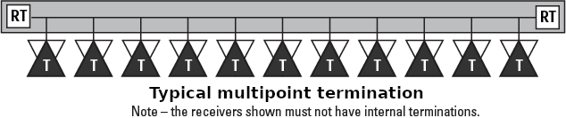

# LVDS
> 2021.01.18 [🚀](../index/index.md) [despace](index.md) → [Cable](cable.md), [GNC](gnc.md)

**Table of contents:**

[TOC]

---

> <small>**Low‑voltage differential signaling (LVDS)** — EN term. **Низковольтная дифференциальная передача сигналов (ЛВДС)** — literal RU translation.</small>

**Low‑voltage differential signaling (LVDS)**, also known as **TIA/EIA‑644**, is a technical standard that specifies electrical characteristics of a differential, serial signaling standard, but it is not a protocol. LVDS operates at low power & can run at very high speeds using inexpensive twisted‑pair copper cables. LVDS is a physical layer specification only; many data communication standards & applications use it & add a data link layer as defined in the OSI model on top of it.

More examples of LVDS used in computer buses are HyperTransport & FireWire, both of which trace their development back to the post‑Futurebus work, which also led to SCI. In addition, LVDS is the physical layer signaling in SCSI standards (Ultra‑2 SCSI & later) to allow higher data rates & longer cable lengths. Serial ATA (SATA), RapidIO, & [SpaceWire](spacewire.md) use LVDS to allow high speed data transfer.

|*Standard*|*TIA/EIA‑644*|
|:-|:-|
|Connector types|not specified|
|Creation date|1994|
|Max. Binary Rate|655 Mbit/s (rates up to 1 ‑ 3 Gbit/s possible)|
|Max. Devices|10|
|Max. Distance|5 ‑ 40 m|
|Network Topology|differential, serial or parallel, point‑to‑point or multipoint, master‑slave|
|Physical Media|twisted pair|
|Voltage Levels|1 ‑ 3.3 V|

**Standards:**

   - The ANSI/TIA/EIA‑644‑A (published in 2001) standard defines LVDS. This standard originally recommended a maximum data rate of 655 Mbit/s over twisted‑pair copper wire, but data rates from 1 to 3 Gbit/s are common today on high quality transmission mediums. Today, technologies for broadband digital video signal transmission such as LVDS are also used in vehicles, in which the signal transmitted as a differential signal helps for EMC reasons. However, high‑quality shielded twisted pair cables must be used together with elaborate connector systems for cabling. An alternative is the use of coaxial cables. Studies have shown that it is possible in spite of the simplified transfer medium dominate both emission & immunity in the high frequency range. Future high‑speed video connections can be smaller, lighter & cheaper to realize.
   - Serial video transmission technologies are widely used in the automobile for linking cameras, displays & control devices. The uncompressed video data has some advantages for certain applications. Serial communication protocols now allow the transfer of data rates in the range of 3 to 4 Gbit/s & thus the control of displays with up to full HD resolution. The integration of the serializer & deserializer components in the control unit due to low demands on additional hardware & software simple & inexpensive. In contrast, require bus solutions for video transmission connection to a corresponding network controller and, if necessary resources for data compression. Since for many applications a full function network is not required throughout the video architecture & for some compounds, data compression is not feasible due to image quality loss & additional latency, bus oriented video transmission technologies are currently only partially attractive.

**Differential vs. single‑ended signaling**

LVDS is a differential signaling system, meaning that it transmits information as the difference between the voltages on a pair of wires; the two wire voltages are compared at the receiver. In a typical implementation, the transmitter injects a constant current of 3.5 mA into the wires, with the direction of current determining the digital logic level. The current passes through a termination resistor of about 100 to 120 ohms (matched to the cable’s characteristic impedance to reduce reflections) at the receiving end, & then returns in the opposite direction via the other wire. From Ohm's law, the voltage difference across the resistor is therefore about 350 mV. The receiver senses the polarity of this voltage to determine the logic level.

As long as there is tight electric‑ & magnetic‑field coupling between the two wires, LVDS reduces the generation of electromagnetic noise. This noise reduction is due to the equal & opposite current flow in the two wires creating equal & opposite electromagnetic fields that tend to cancel each other. In addition, the tightly coupled transmission wires will reduce susceptibility to electromagnetic noise interference because the noise will equally affect each wire & appear as a common‑mode noise. The LVDS receiver is unaffected by common mode noise because it senses the differential voltage, which is not affected by common mode voltage changes.

The fact that the LVDS transmitter consumes a constant current also places much less demand on the power supply decoupling & thus produces less interference in the power & ground lines of the transmitting circuit. This reduces or eliminates phenomena such as ground bounce which are typically seen in terminated single‑ended transmission lines where high & low logic levels consume different currents, or in non‑terminated transmission lines where a current appears abruptly during switching.

The low common‑mode voltage (the average of the voltages on the two wires) of about 1.2 V allows using LVDS with a wide range of integrated circuits with power supply voltages down to 2.5 V or lower. In addition, there are variations of LVDS that use a lower common mode voltage. One example is sub‑LVDS (introduced by Nokia in 2004) that uses 0.9 V typical common mode voltage. Another is Scalable Low Voltage Signaling for 400 mV (SLVS‑400) specified in JEDEC JESD8‑13 October 2001 where the power supply can be as low as 800 mV & common mode voltage is about 400 mV.

The low differential voltage, about 350 mV, causes LVDS to consume very little power compared to other signaling technologies. At 2.5 V supply voltage the power to drive 3.5 mA becomes 8.75 mW, compared to the 90 mW dissipated by the load resistor for an [RS-422](rs_xxx.md) signal.

Logic levels:

|*Vee*|*VOL*|*VOH*|*Vcc*|*VCMO*|
|:-|:-|:-|:-|:-|
|GND|1.0 V|1.4 V|2.5 ‑ 3.3 V|1.2 V|

**Comparing serial & parallel data transmission.**  
LVDS works in both parallel & serial data transmission. In parallel transmissions multiple data differential pairs carry several signals at once including a clock signal to synchronize the data. In serial communications, multiple single‑ended signals are serialized into a single differential pair with a data rate equal to that of all the combined single‑ended channels. For example, a 7‑bit wide parallel bus serialized into a single pair that will operate at 7 times the data rate of one single‑ended channel. The devices for converting between serial & parallel data are the serializer & deserializer, abbreviated to SerDes when the two devices are contained in one integrated circuit.

**Multipoint LVDS.**  
The original LVDS standard only envisioned driving a digital signal from one transmitter to one receiver in a point‑to‑point topology. However, engineers using the first LVDS products soon wanted to drive multiple receivers with a single transmitter in a multipoint topology. As a result, NSC invented Bus LVDS (BLVDS) as the first variation of LVDS designed to drive multiple LVDS receivers. It uses termination resistors at each end of the differential transmission line to maintain the signal integrity. Double termination is necessary because it is possible to have one or more transmitters in the center of the bus driving signals toward receivers in both directions. The difference from standard LVDS transmitters was increasing the current output in order to drive the multiple termination resistors. In addition, the transmitters need to tolerate the possibility of other transmitters simultaneously driving the same bus.  
Bus LVDS & LVDM (by TI) are de facto multipoint LVDS standards. Multipoint LVDS (MLVDS) is the TIA standard (TIA‑899). The AdvancedTCA standard specified MLVDS for clock distribution across the backplane to each of the computing module boards in the system. MLVDS has two types of receivers. Type‑1 is compatible with LVDS & uses a +/− 50 mV threshold. Type‑2 receivers allow Wired‑Or signalling with M‑LVDS devices.  

## (RU) ЛВДС
**Низковольтная дифференциальная передача сигналов** (англ. low-voltage differential signaling или **LVDS**) — способ передачи электрических сигналов и стандарт ANSI/TIA/EIA-644-A 2001 года, позволяющий передавать информацию на высоких частотах при помощи дешёвых соединений на основе медной витой пары. Стандарт разрабатывался и продвигался компанией Texas Instruments. Начиная с 1994 года низковольтная дифференциальная передача сигналов используется в компьютерной отрасли, где нашла широкое применение для создания высокоскоростных вычислительных сетей и компьютерных шин.

**Отличия от несимметричной передачи сигналов.**  
При дифференциальной передаче для передачи одного сигнала используется дифференциальная пара (сигналов); это означает, что передающая сторона подаёт на проводники пары различные уровни напряжения, которые сравниваются на приёмной стороне: для декодирования информации используется разница напряжений на проводниках пары. Передатчик направляет небольшой ток (порядка 3.5 мА) в один из сигнальных проводников в зависимости от того, какой логический уровень надо передать. На приёмной стороне ток проходит через резистор сопротивлением 100 ‑ 120 Ом (равным волновому сопротивлению кабеля для уменьшения отражённого сигнала) и возвращается к отправителю сигнала по другому проводнику, образуя таким образом замкнутую электрическую цепь. В соответствии с законом Ома напряжение на резисторе будет составлять около 350 мВ. Принимающая сторона определяет полярность этого напряжения для того, чтобы определить логический уровень. Такой тип передачи называется токовая петля.  
Небольшая амплитуда сигнала LVDS, а также высокая электромагнитная связь проводов дифференциальной пары друг с другом позволяют уменьшить излучаемые вовне помехи и рассеиваемую мощность.  
Синфазное напряжение (среднее напряжение двух проводников) обычно составляет около 1.25 В, что позволяет использовать LVDS во многих СБИС с напряжением питания 2.5 В и ниже. Как упоминалось выше, напряжение между проводниками пары составляет 350 мВ, что позволяет по сравнению с другими способами передачи сигналов значительно снизить потребляемую мощность. Например, статическая мощность, рассеиваемая на нагрузочном резисторе LVDS, составляет всего 1.2 мВт, по сравнению с 90 мВт, рассеиваемыми на нагрузочном резисторе интерфейса [RS‑422](rs_xxx.md). Без нагрузочного резистора для каждого бита данных приходилось бы нагружать и разгружать весь проводник. Использование нагрузочного резистора и высоких частот передачи приводит к тому, что бит покрывает лишь часть проводника (в процессе передачи со скоростью электромагнитных колебаний в среде), что является более энергоэффективным.  
LVDS — не единственная используемая дифференциальная система. Но она остается единственной, сочетающей в себе высокие скорости и небольшое рассеивание энергии.

 

## Docs & links
|Navigation|
|:-|
|**[FAQ](faq.md)**【**[SCS](scs.md)**·КК, **[SC (OE+SGM)](sc.md)**·КА】**[CON](contact.md)·[Pers](person.md)**·Контакт, **[Ctrl](control.md)**·Упр., **[Doc](doc.md)**·Док., **[Drawing](drawing.md)**·Чертёж, **[EF](ef.md)**·ВВФ, **[Error](error.md)**·Ошибки, **[Event](event.md)**·Событ., **[FS](fs.md)**·ТЭО, **[HF&E](hfe.md)**·Эрго., **[KT](kt.md)**·КТ, **[N&B](nnb.md)**·БНО, **[Project](project.md)**·Проект, **[QM](qm.md)**·БКНР, **[R&D](rnd.md)**·НИОКР, **[SI](si.md)**·СИ, **[Test](test.md)**·ЭО, **[TRL](trl.md)**·УГТ|
|*Sections & pages*|
|**【[Cable](cable.md)】**  [CAN](can.md)・ LVDS・ [MIL‑STD‑1553](mil_std_1553.md)・ [RS‑232, 422, 485](rs_xxx.md)・ [SpaceWire](spacewire.md)・ [ОТБКС](cable.md)|
|**【[Guidance, Navigation & Control (GNC)](gnc.md)】**  [CAN](can.md)・ LVDS・ [MIL‑STD‑1553](mil_std_1553.md) (МКО)・ [RS‑232, 422, 485](rs_xxx.md)・ [SpaceWire](spacewire.md)・ [АСН, САН](ans.md)・ [БНО](nnb.md)[MIL‑STD‑1553](mil_std_1553.md) (МКО)[БАППТ](eas.md)・ [БКС](cable.md)・ [БУ](eas.md)・ [БШВ](time.md)・ [Гироскоп](iu.md)・ [Дальномер](doppler.md) (ИСР)・ [ДМ](iu.md)・ [ЗД](sensor.md)・ [Компьютер](obc.md) (ЦВМ, БЦВМ)・ [Магнитометр](sensor.md)・ [МИХ](mic.md)・ [МКО](mil_std_1553.md)・ [ПО](soft.md)・ [ПНА, ПОНА, ПСНА](devd.md)・ [СД](sensor.md)・ [Система координат](coord_sys.md)・ [СОСБ](devd.md)|

   1. Docs: …
   1. <https://en.wikipedia.org/wiki/Low-voltage_differential_signaling>
