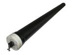
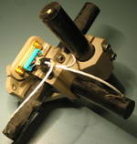

# Магнитометр
> 2019.05.12 ┊ **[🚀](../index/index.md) [despace](index.md)** → [GNC](gnc.md), **[Магнитометр](mag.md)**

[TOC]

---

> <small>*Термины:* **Магнитометр** — русскоязычный термин. **Magnetometer** — англоязычный эквивалент.</small>

**Магнито́метр** — *(от гр. μαγνητό — магнит + гр. μετρεω измеряю)*, прибор для измерения характеристик магнитного поля и магнитных свойств материалов. В зависимости от измеряемой величины различают приборы для измерения напряжённости поля (эрстедметры), направления поля (инклинаторы и деклинаторы), градиента поля (градиентометры), магнитной индукции (тесламетры), магнитного потока (веберметры или флюксметры), коэрцитивной силы (коэрцитиметры), магнитной проницаемости (мю‑метры), магнитной восприимчивости (каппа‑метры), магнитного момента.

## Описание
Магнитометры применяются в геологии, археологии, магнитной геохронологии, навигации на море, в космосе и авиации, разведке и сейсмологии, биологии и медицине.

Магнитометры используются для навигации КА по магнитному полю Земли, а также для определения высоты. Впервые магнитометр был использован на КА «Спутник‑3» (1958 г).

Современные магнитометры для навигации сделаны в виде трёх перпендикулярных друг другу трубок, с помощью которых может быть построена 3‑осная ориентация и определено направление магнитного поля. В случае применения одной или двух трубок вместо трёх измерения могут проводиться путём поворота КА или помещения магнитометра на привод.

| В космосе применяются  индукционные магнитометры.  | Магнитометр КА [THEMIS](themis.md).  |
|:--|:--|
|   |   |

## Разновидности

|*Страна*|*Произв.*|*Актуальные (масса, г)*|*Исторические (масса, г)*|
|:--|:--|:--|:--|
|**Россия**| [Спутникс](zz_sputnix.md)  | <small>[SX-MAGWR](sx_magwr.md) (100)</small>  |  |

## Производители
   - **Россия**
      1. [Спутникс](zz_sputnix.md)

 

## Docs & links (TRANSLATEME ALREADY)
|…°·•¹²³±×÷≤≥≈≠ ‑ −— ⎆✉ ❐“”’«»✔→✘☐☑├┕┆ 1 lb = 0.453592 kg; 1 g = 9.80665 m/s²|
|:--|
|<small>**[FAQ](faq.md)**, **[Cable](cable.md)**·БКС, **[Camera](camera.md)**·Камера, **[Comms](comms.md)**·Радиосв., **[Contact](contact.md)**·Контакт, **[Control](control.md)**·Управ., **[Doc](doc.md)**·Док., **[Doppler](doppler.md)**·ИСР, **[DS](ds.md)**·ЗУ, **[EB](eb.md)**·ХИТ, **[ECO](ecology.md)**·Экол., **[EF](ef.md)**·ВВФ, **[ElC](elc.md)**·ЭКБ, **[EMC](emc.md)**·ЭМС, **[Errors](error.md)**·Ошибки, **[Events](event.md)**·События, **[FS](fs.md)**·ТЭО, **[Fuel](fuel.md)**·Топливо, **[GNC](gnc.md)**·БКУ, **[GS](scs.md)**·НС, **[HF&E](hfe.md)**·Эргоном., **[IMU](imu.md)**·Гироскоп, **[Incubator](incubator.md)**·Инкуб., **[KT](kt.md)**·КТЕХ, **[LAG](lag.md)**·ПУC, **[LES](les.md)**·САСП, **[LS](ls.md)**·СЖО, **[LV](lv.md)**·РН, **[MAG](mag.md)**·Магнитом., **[MCC](mcc.md)**·ЦУП, **[Model](model.md)**·Модель, **[MSC](sc.md)**·ПКА, **[N&B](nnb.md)**·БНО, **[NR](nr.md)**·ЯР, **[OBC](obc.md)**·ЦВМ, **[OE](oe.md)**·БА, **[Patent](патент.md)**·Патент, **[Project](project.md)**·Проект, **[PS](ps.md)**·ДУ, **[QA](quality.md)**·QA, **[R&D](rnd.md)**·НИОКР, **[RAMS](rams.md)**·НиБ, **[Risk](risk.md)**·Риск, **[Robot](robotics.md)**·Робот, **[Rover](rover.md)**·Планетоход, **[RTG](rtg.md)**·РИТЭГ, **[RW](rw.md)**·ДМ, **[SARC](sarc.md)**·ПСК, **[Sensor](sensor.md)**·Датчик, **[SC](sc.md)**·КА, **[SCS](scs.md)**·КК, **[SGM](sgm.md)**·КММ, **[SI](si.md)**·СИ, **[Soft](soft.md)**·ПО, **[SP](sp.md)**·БС, **[Spaceport](spaceport.md)**·Космодром, **[SPS](sps.md)**·СЭС, **[SSS](sss.md)**·ГЗУ, **[TCS](tcs.md)**·СОТР, **[Test](test.md)**·ЭО, **[Timeline](timeline.md)**·Циклограмма, **[TMS](tms.md)**·ТМС, **[TOR](tor.md)**·ТЗ, **[TRL](trl.md)**·УГТ</small>|
|*Sections & pages*|
|**`Бортовой комплекс управления (БКУ):`**  [АСН, САН](ans.md) ┊ [БНО](nnb.md) ┊ [БАППТ](acup.md) ┊ [БКС](cable.md) ┊ [БУ](sp.md) ┊ [БШВ](time.md) ┊ [Гироскоп](imu.md) ┊ [Дальномер](doppler.md) (ИСР) ┊ [ДМ](rw.md) ┊ [ЗД](sensor.md) ┊ [Компьютер](obc.md) (ЦВМ, БЦВМ) ┊ [Магнитометр](mag.md) ┊ [МИХ](mic.md) ┊ [МКО](mil_std_1553b.md) ┊ [ПО](soft.md) ┊ [ПНА, ПОНА, ПСНА](aiad.md) ┊ [СД](sensor.md) ┊ [Система координат](coord_sys.md) ┊ [СОСБ](spos.md) |
|**`Магнитометр:`**  …  • • •  **РФ:** [SX-MAGWR](sx_magwr.md) (100) |

   1. Docs: …
   1. Notable interwikies — …
   1. <https://en.wikipedia.org/wiki/Magnetometer>
   1. <https://en.wikipedia.org/wiki/Spacecraft_magnetometer>
   1. <https://ru.wikipedia.org/wiki/Магнитометр>

