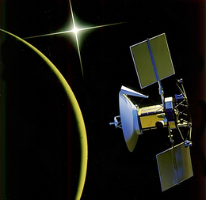
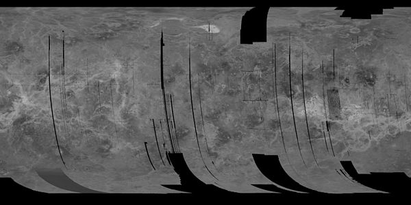
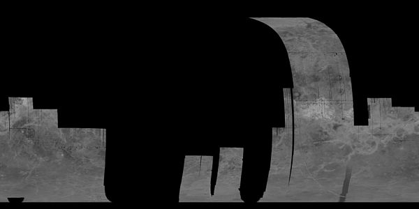
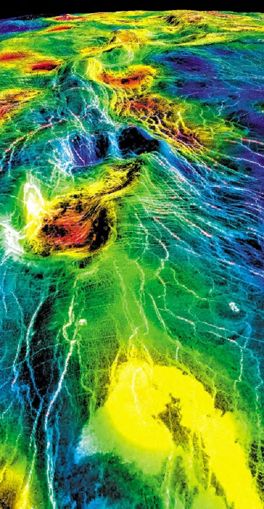
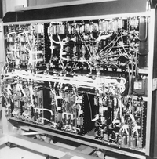

# Magellan
> 2019.12.22 **[🚀](../index/index.md) [despace](index.md)** → [Venus](venus.md), **[Project](project.md)**

[TOC]

---

> <small>*Terms:* **Magellan** — English term with no analogues in Russian. **Магеллан** — Russian equivalent.</small>

The **Magellan** spacecraft, also referred to as the ***Venus Radar Mapper***, was a 1 035 kg ([EVN‑073](venus.md)) robotic space probe launched by [NASA](zz_nasa.md) on 1989.05.04, to map the surface of Venus by using [synthetic aperture radar](synthetic_aperture_radar.md) and to measure the planetary gravitational field ([EVN‑089](venus.md)).

The Magellan probe was the first interplanetary mission to be launched from the Space Shuttle, the 1st one to use the Inertial Upper Stage booster for launching, and the 1st SC to test aerobraking as a method for circularizing its orbit. Magellan was the fifth successful NASA mission to Venus.

 

|*Type*|*[Param.](si.md)*|
|:--|:--|
|**Mission:**|• • •|
|Cost| … or … of [gold](sc_price.md) |
|Development| 1983 ‑ 1989 |
|Duration| 4 years 5 months 8 days 13 hours 18 minutes |
|Launch| May 4, 1989, 18:47:00 UTC, Rocket: Space Shuttle Atlantis STS-30 / IUS |
|Operator| NASA / JPL |
|Programme| Magellan |
|Similar to| • Proposed: …  • Current: …  • Past: [Pioneer-Venus-1](pioneer_venus_1.md) [Venera 15 and 16](venera_15_16.md) |
|Target| Radar mapping of Venus |
|[Type](sc.md)| Orbiter spacecraft |
|**Spacecraft:**|• • •|
|Comms| 3.7 m HGA (Voyager) and a medium‑gain antenna (Mariner 9)  S‑band — receiving data  X‑band — transmission |
|Composition| Orbiter |
|Contractor| … |
|[ID](spaceid.md)| NSSDC ID (COSPAR ID): [1989-033B ⎆](https://nssdc.gsfc.nasa.gov/nmc/spacecraft/display.action?id=1978-033B), SCN: [19969 ⎆](http://www.n2yo.com/satellite/?s=12927), [15599 ⎆](http://www.n2yo.com/satellite/?s=19969) |
|Manufacturer| Martin Marietta  Hughes Aircraft |
|Mass| Dry 1 035 kg ([large satellite](sc.md)) |
|Orbit / Site| The initial orbit (after the corrections): Cytherocentric 297 x 8 463 km, T = 3.25 h, i = 85.5° |
|Payload| Radar System |
|Power| 1 200 W |

Achieved targets & investigations:

   - **T** — technical; **C** — contact research; **D** — distant research; **F** — fly‑by; **H** — manned; **S** — soil sample return; **X** — technology demonstration
   - **Sections of measurement and observation:**
      - Atmospheric/climate — **Ac** composition, **Ai** imaging, **Am** mapping, **Ap** pressure, **As** samples, **At** temperature, **Aw** wind speed/direction.
      - General — **Gi** planet’s interactions with outer space.
      - Soil/surface — **Sc** composition, **Si** imaging, **Sm** mapping, **Ss** samples.

<small>

|*EVN‑XXX*|*T*|*EN*|*Section of m&o*|*D*|*C*|*F*|*H*|*S*|
|:--|:--|:--|:--|:--|:--|:--|:--|:--|
|EVN‑002||Surface: preliminary map|  |C|D||||
|EVN‑005|T|Exploration: from Venusian orbit.|  |D||F|||
|EVN‑014||Atmosphere: composition.|  |D|||F||
|EVN‑020||Inner structure of the planet.|  |D|||||
|EVN‑021||Surface: map, 3D.|  |D|C||||
|EVN‑022||Surface: map, precise.|  |D|||||
|EVN‑025||Surface: structure.|  ||C||||
|EVN‑029||Is Venus geologically active?|  |D|C|F|||
|EVN‑042||History & causes of the planet’s volcanic & tectonic evolution.|  |D|||||
|EVN‑044||Surface: nature & causes of forming of the current rocks & soils.|  ||C||||
|EVN‑045||Surface: nature of the tessera|  ||D||||
|EVN‑046||Surface: causes of the changes during the last billion years.|  |D|C|F|||
|EVN‑052||Role of water (fluids) in planetary geology.|  |D|C|F|||
|EVN‑073|T|Exploration with [satellites](sc.md): large satellites.|  |D||F|||
|EVN‑076||Surface: volcanoes, their presence.|  |D||F|||
|EVN‑078|T|Atmosphere: radiography.|  |D|||||
|EVN‑079||Precise duration of the Venusian day.|  |D|||||
|EVN‑085|T|Surface: tessera investigations, remote|  ||D|F|||
|EVN‑089||Measuring the planetary gravitational field.|  |D||F|||
|EVN‑093|T|Atmosphere/surface imaging|  ||D|F|||

</small>

 

## Mission
Beginning in the late 1970s, scientists pushed for a radar mapping mission to Venus. They first sought to construct a spacecraft named the Venus Orbiting Imaging Radar (VOIR), but it became clear that the mission would be beyond the budget constraints during the ensuing years. The VOIR mission was canceled in 1982.

A simplified radar mission proposal was recommended by the Solar System Exploration Committee, and this one was submitted and accepted as the Venus Radar Mapper program in 1983. The proposal included a limited focus and a single primary scientific instrument. In 1985, the mission was renamed Magellan, in honor of the sixteenth-century Portuguese explorer Ferdinand Magellan, known for his exploration, mapping, and circumnavigation of the Earth.

Magellan was launched on May 4, 1989, at 18:46:59 UTC by the National Aeronautics and Space Administration from KSC Launch Complex 39B at the Kennedy Space Center in Florida, aboard Space Shuttle Atlantis during mission STS-30. Once in orbit, the Magellan and its attached Inertial Upper Stage booster were deployed from Atlantis and launched on May 5, 1989 01:06:00 UTC, sending the spacecraft into a Type IV heliocentric orbit where it would circle the Sun 1.5 times, before reaching Venus 15 months later on August 10, 1990.

**Orbital encounter of Venus**

After three en route trajectory corrections (May 21, 1989, March 13, 1990, and July 25, 1990), Magellan arrived in Venus orbit Aug. 10, 1990. Orbital parameters were 297 × 8 463 km at 85.5 ° inclination ([EVN‑005](venus.md)).

During each orbit, the space probe captured radar data while the spacecraft was closest to the surface, and then transmit it back to Earth as it moved away from Venus. This maneuver required extensive use of the reaction wheels to rotate the spacecraft as it imaged the surface for 37 minutes and as it pointed toward Earth for two hours. The primary mission intended for the spacecraft to return images of at least 70 % of the surface during one Venusian day, which lasts 243 Earth days ([EVN‑079](venus.md)) as the planet slowly spins. To avoid overly-redundant data at the highest and lowest latitudes, the Magellan probe alternated between a Northern-swath, a region designated as 90 ° north latitude to 54 ° south latitude, and a Southern-swath, designated as 76 ° north latitude to 68 degrees south latitude. However, due to periapsis being 10 ° north of the equatorial line, imaging the South Pole region was unlikely.

**Mapping cycle 1**

   - Goal: Complete primary objective.
   - September 15, 1990 — May 15, 1991

The spacecraft began returning high‑quality radar images of the Venusian terrain that showed evidence of volcanism, tectonic movement, turbulent surface winds, kilometers of lava channels, and pancake‑shaped domes ([EVN‑025](venus.md)). During cycle 1, the altitude of the spacecraft varied from 2000 km to 290 km near periapsis. Magellan completed its first 243 day cycle of radar mapping, providing the first clear views of 83.7 percent of the surface with a resolution between 120 and 300 m/px ([EVN‑022](venus.md)). The spacecraft returned 1 200 Gb of data.

||
|:--|
|***Mosaic of the «left-looking» data collected during cycle 1***|

**Mission extension**

**Mapping cycle 2**

   - Goal: Image the south pole region and gaps from Cycle 1.
   - May 15, 1991 — January 15, 1992

Beginning immediately after the end of cycle 1, cycle 2 was intended to provide data for the existing gaps in the map collected during first cycle, including a large portion of the southern hemisphere. To do this, Magellan had to be reoriented, changing the gathering method to «right-looking». Upon completion during cycle 2 provided data for 54.5 % of the surface, and combined with the previous cycle, a map containing 96 % of the surface could be constructed ([EVN‑022](venus.md)).

||
|:--|
|***Mosaic of the «right-looking» data collected during cycle 2***|

**Mapping cycle 3**

   - Goal: Fill remaining gaps and collect stereo imagery.
   - January 15, 1992 — September 13, 1992

Immediately after cycle 2, cycle 3 began collecting data for stereo imagery on the surface that would later allow the ground team to construct, clear, three-dimensional renderings of the surface ([EVN‑021](venus.md)). Approximately 21.3 % of the surface was imaged in stereo by the end of the cycle 3, increasing the overall coverage of the surface to 98 % ([EVN‑022](venus.md)).

||
|:--|
|***Map of the stereo imaging collected by Magellan during cycle 3***|
 

||
|:--|
|***Sedna Plain. The three dimensional picture is based on data from the Magellan spacecraft***|

**Mapping cycle 4**

   - Goal: Measure Venus’ gravitational field.
   - September 14, 1992 — May 23, 1993

Upon completing cycle 3, Magellan ceased imaging the surface. Instead the Magellan maintained pointing of the high‑gain antenna toward Earth where the Deep Space Network began recording a constant stream of telemetry. This constant signal allowed the DSN to collect information on the gravitational field ([EVN‑089](venus.md)) of Venus by monitoring the velocity of the spacecraft. Areas of higher gravitation would slightly increase the velocity of the spacecraft, registering as a Doppler shift in the signal. The space craft completed 1 878 orbits until completion of the cycle; a loss of data at the beginning of the cycle necessitated an additional 10 days of gravitational study.

**Mapping cycle 5**

   - Goal: Aerobraking to circular orbit and global gravity measurements.
   - May 24, 1993 — August 29, 1994

At the end of the fourth cycle, the orbit of Magellan was circularized using a technique known as aerobraking. The circularized orbit allowed a much higher resolution of gravimetric data to be acquired when cycle 5 began. The spacecraft performed 2 855 orbits and provided high‑resolution gravimetric data for 94 % of the planet ([EVN‑089](venus.md)), before the end of the cycle.

**Aerobraking**

   - Goal: To enter a circular orbit.
   - May 24, 1993 — August 2, 1993

Aerobraking had long been sought as a method for slowing the orbit of interplanetary spacecraft. Previous suggestions included the need for aeroshells that proved too complicated and expensive for most missions. Testing a new approach to the method, a plan was devised to drop the orbit of Magellan into the outermost region of the Venusian atmosphere. Slight friction on the spacecraft slowed the velocity over a period, slightly longer than two months, bringing the spacecraft into an approximately circular orbit 180 km height. The method has since been used extensively on later interplanetary missions.

**Mapping cycle 6**

   - Goal: Collect high‑resolution gravity data and conduct radio science experiments.
   - April 16, 1994 — October 13, 1994

The sixth and final orbiting cycle was another extension to the two previous gravimetric studies. Toward the end of the cycle, a final experiment was conducted, known as the «Windmill» experiment to provide data on the composition of the upper atmosphere of Venus ([EVN‑014](venus.md)). Magellan performed 1 783 orbits before the end of the cycle, when the spacecraft entered the atmosphere and disintegrated.

**Windmill experiment**

   - Goal: Collect data on atmospheric dynamics.
   - September 6, 1994 — September 14, 1994

In September 1994, the orbit of Magellan was lowered to begin the «Windmill experiment». During the experiment, the spacecraft was oriented with the solar arrays broadly, perpendicular to the orbital path, where they could act as paddles as they impacted molecules of the upper-Venusian atmosphere. Countering this force, the thrusters fired to keep the spacecraft from spinning. This provided data on the basic oxygen gas‑surface interaction. This was useful for understanding the impact of upper-atmospheric forces which aided in designing future Earth‑orbiting satellites, and methods for aerobraking during future planetary spacecraft missions.

**RESULTS**

   - The most important result of the mission was a map of 98 % of the surface with a record resolution of up to 100 m/px. For the first time, information was obtained about the South pole of the planet. Its imagery contributed to the best high‑resolution radar maps of Venus’ surface to date, improving on the images returned by the Soviet [Venera 15 and 16](venera_15_16.md) in the 1980s ([EVN‑022](venus.md)).
   - Study of the Magellan high‑resolution global images is providing evidence to better understand Venusian geology and the role of impacts, volcanism, and tectonics in the formation of Venusian surface structures ([EVN‑044](venus.md)). The spacecraft found that such phenomena as continental drift are not evident on the planet.
   - Magellan found that at least 85 % of the Venusian surface is covered with volcanic flows ([EVN‑076](venus.md)). The spacecraft’s data suggested that despite the high surface temperatures or 475 degrees Celsius and high atmospheric pressures 92 atm, the complete lack of water makes erosion an extremely slow process on the planet ([EVN‑052](venus.md)). Magellan’s maps show no telltale signs of past major water bodies such as shorelines or ocean basins. As a result, surface features can persist for hundreds of millions of years.
   - From the craters visible in Magellan’s Venus maps, scientists believe they are looking at a relatively young planetary surface, perhaps about 500 million years old. Since Venus formed at the same time as Earth 4.6 billion years ago, some event or events 500 million years ago must have resurfaced the planet. Scientists believe that this may have been the work of massive outpourings of lava from planet-wide volcanic eruptions ([EVN‑042](venus.md), [EVN‑046](venus.md)). Although Venus may still have active volcanoes, no visible outpourings of lava have yet been detected in comparisons of Magellan images between one eight-month orbital cycle and another ([EVN‑029](venus.md), [EVN‑076](venus.md)).
   - Venus seems to lack an «asthenosphere», a buffer layer within Earth between the outer part of the planet and the mantle beneath. As a result, the gravity signature of featurs on Venus closely reflect surface topography, whereas on Earth such a correspondence does not always occur ([EVN‑089](venus.md)).
   - Large pancake‑shaped volcanic domes suggest the presence of a type of lava produced by extensive evolution of crustal rocks.
   - The typical signs of terrestrial plate tectonics — continental drift and basin floor spreading — are not evident on Venus. The planet’s tectonics is dominated by a system of global rift zones and numerous broad, low domical structures called coronae, produced by the upwelling and subsidence of magma from the mantle ([EVN‑029](venus.md), [EVN‑042](venus.md)).
   - Although Venus has a dense atmosphere, the surface reveals no evidence of substantial wind erosion, and only evidence of limited wind transport of dust and sand. This contrasts with Mars, where there is a thin atmosphere, but substantial evidence of wind erosion and transport of dust and sand.

**End of mission**

On October 11, 1994, moving at a velocity of 7 km/s, the final orbital trim maneuver was performed, placing the spacecraft 139.7 km above the surface, well within the atmosphere.

On October 13, 1994 at 10:05:00 UTC, communication was lost when the spacecraft entered radio occultation behind Venus. The team continued to listen for another signal from the spacecraft until 18:00:00 UTC, when the mission was determined to have concluded.

 

## Science goals & payload
The objectives of the mission included:

   - Obtain near‑global radar images of the Venusian surface with a resolution equivalent to optical imaging of 1.0 km per line pair (primary).
   - Obtain a near‑global topographic map with 50 km spatial and 100 m vertical resolution.
   - Obtain near‑global gravity field data with 700 km resolution and two to three milligals of accuracy.
   - Develop an understanding of the geological structure of the planet, including its density distribution and dynamics ([EVN‑020](venus.md)).

Thick and opaque, the atmosphere of Venus required a method beyond optical survey, to map the surface of the planet. The resolution of conventional radar depends entirely on the size of the antenna. Magellan addressed this problem by using a method known as synthetic aperture, where a large antenna is imitated by processing the information gathered by ground computers ([EVN‑078](venus.md)).

The Magellan high‑gain parabolic antenna, oriented 28 ‑ 78 ° to the right or left of nadir, emitted thousands of microwave pulses that passed through the clouds and to the surface of Venus, illuminating a swath of land. The Radar System then recorded the brightness of each pulse as it reflected back off the side surfaces of rocks, cliffs, volcanoes ([EVN‑076](venus.md)) and other geologic features, as a form of backscatter ([EVN‑078](venus.md)). To increase the imaging resolution, Magellan recorded a series of data bursts for a particular location during multiple instances called, «looks». Each «look» slightly overlapped the previous, returning slightly different information for the same location, as the spacecraft moved in orbit. After transmitting the data back to Earth, Doppler modeling was used to take the overlapping «looks» and combine them into a continuous, high resolution image of the surface ([EVN‑022](venus.md)).

Radar System (RDRS)

|*Instrument*|*Description*|
|:--|:--|
|  | The Radar System functioned in three modes: synthetic aperture radar (SAR), altimetry (ALT), and radiometry (RAD). The instrument cycled through the three modes while observing the surface geology, topography, and temperature of Venus using the 3.7 m parabolic, high‑gain antenna and a small fan-beam antenna, located just to the side.   • In the Synthetic Aperture Radar mode, the instrument transmitted several thousand long-wave, 12.6 cm microwave pulses every second through the high‑gain antenna, while measuring the doppler shift of each hitting the surface.  • In Altimetry mode, the instrument interleaved pulses with SAR, and operating similarly with the altimetric antenna, recording information regarding the elevation of the surface on Venus.  • In Radiometry mode, the high‑gain antenna was used to record microwave radiothermal emissions from Venus. This data was used to characterize the surface temperature.  The data was collected at 750 Kb/s to the tape recorder and later transmitted to Earth to be processed into usable images, by the Radar Data Processing Subsystem (RDPS), a collection of ground computers operated by JPL. |

In addition to the radar data, Magellan collected several other types of scientific measurements. These included detailed measurements of the Venus gravitational field ([EVN‑089](venus.md)), measurements of the atmospheric density, and radio occultation data on the atmospheric profile.

 

## Spacecraft
The spacecraft was designed and built by the Martin Marietta Company, and the Jet Propulsion Laboratory (JPL) managed the mission for NASA.

To save costs, most of the Magellan probe was made up of spare parts from various missions, including the Voyager program, Galileo, Ulysses, and Mariner 9. The total number of borrowed parts reached 70 %. The overall design of the spacecraft together with the thrusters (from the Voyager missions), was a 10-sided aluminum bus, containing the computers, data recorders, and other subsystems. The height of the spacecraft was 6.4 m, taking into account the solid‑fuel propulsion system, or 4.6 m without it. The mass of the spacecraft at launch was equal to 3 600 kg.

|*Parameter*|*Value*|
|:--|:--|
| Launch mass | 3 600 kg |
| Dry mass | 1 035 kg |
| The altitude of the spacecraft | 6.4 m |
| The altitude of the spacecraft (without the solid‑fuel propulsion) | 4.6 m |
| The outer diameter of the spacecraft (the diameter of the antenna) | 3.6 m |

**Attitude control and propulsion**

The spacecraft’s attitude control (orientation) was designed to be three‑axis stabilized. Magellan design did not lend itself to spinning, so the resulting propulsion system design had to accommodate the challenging control issues with the large solid rocket motor «Star 48B». Due to high thrust, even a 0.5 % SRM alignment error could generate side forces of 445 N. Final conservative estimates of worst‑case side forces resulted in the need for eight 445 N thrusters, two in each quadrant, located out on booms at the maximum radius that the Space Shuttle Orbiter Payload Bay would accommodate (4.4 m diameter).

|*Parameter of Star 48B*|*Value*|
|:--|:--|
| Mass of solid propellant propulsion system | 2 145 kg |
| Mass of solid propellant | 2 014 kg |
| Thrust  SRM | 89 000 N |

The actual propulsion system design consisted of a total of 24 monopropellant hydrazine thrusters.

Other hardware regarding orientation of the spacecraft consists of a set of gyroscopes and a star scanner.

**Communications**

For communications, the spacecraft included a lightweight graphite/aluminum, 3.7 m high‑gain antenna left over from the Voyager Program and a medium‑gain antenna spare from the Mariner 9 mission. The high‑gain antenna was also used to perform mapping of Venus. A low‑gain antenna attached to the high‑gain antenna, was also included for contingencies. When communicating with the Deep Space Network, the spacecraft was able to simultaneously receive commands at 1.2 Kb/s in the S‑band and transmit data at 268.8 Kb/s in the X‑band.

**Power**

Magellan was powered by two square solar arrays, each measuring 2.5 m across. Together, the arrays supplied 1 200 W of power at the beginning of the mission.

**Computers and data processing**

The computing system on the spacecraft, partially modified equipment from the Galileo, included two ATAC-16 computers, as one redundant system, located in the attitude-control subsystem, and four RCA 1802 microprocessors, as two redundant systems, to control the command and data subsystem (CDS). The CDS was able to store commands for up to three days, and also to autonomously control the spacecraft if problems were to arise while mission operators were not in contact with the spacecraft.

 

## Community, library, links

**PEOPLE:**

   1. Elizabeth E. Beyer — The program manager.
   1. Dr. Joseph M. Boyce — The lead program scientist for the NASA headquarters.
   1. Douglas Griffith — The Magellan project manager.
   1. Dr. R. Stephen Saunders — The lead project scientist.
   1. Gordon Pettengill — [Principal investigator](principal_investigator.md) of RDRS  / MIT

**COMMUNITY:**

<mark>TBD</mark>

 

## Docs & links
|…°·•¹²³±×÷≤≥≈≠ ‑ −— ⎆✉ ❐“”’«»✔→✘☐☑├┕┆ 1 lb = 0.453592 kg; 1 g = 9.80665 m/s²|
|:--|
|<small>**[FAQ](faq.md)**, **[Cable](cable.md)**·БКС, **[Camera](camera.md)**·Камера, **[Comms](comms.md)**·Радио, **[Contact](contact.md)**·Контакт, **[Control](control.md)**·Управ., **[Doc](doc.md)**·Док., **[Doppler](doppler.md)**·ИСР, **[DS](ds.md)**·ЗУ, **[EB](eb.md)**·ХИТ, **[ECO](ecology.md)**·Экол., **[EF](ef.md)**·ВВФ, **[ElC](elc.md)**·ЭКБ, **[EMC](emc.md)**·ЭМС, **[Errors](error.md)**·Ошибки, **[Events](event.md)**·События, **[FS](fs.md)**·ТЭО, **[Fuel](fuel.md)**·Топливо, **[GNC](gnc.md)**·БКУ, **[GS](scs.md)**·НС, **[HF&E](hfe.md)**·Эрго., **[IU](iu.md)**·Гиро., **[KT](kt.md)**·КТЕХ, **[LAG](lag.md)**·ПУC, **[LES](les.md)**·САСП, **[LS](ls.md)**·СЖО, **[LV](lv.md)**·РН, **[MCC](mcc.md)**·ЦУП, **[Model](model.md)**·Модель, **[MSC](sc.md)**·ПКА, **[N&B](nnb.md)**·БНО, **[NR](nr.md)**·ЯР, **[OBC](obc.md)**·ЦВМ, **[OE](oe.md)**·БА, **[Pat.](патент.md)**·Патент, **[Project](project.md)**·Проект, **[PS](ps.md)**·ДУ, **[QA](quality.md)**·QA, **[R&D](rnd.md)**·НИОКР, **[RAMS](rams.md)**·НиБ, **[Risk](risk.md)**·Риск, **[Robot](robotics.md)**·Робот, **[Rover](rover.md)**·Планетоход, **[RTG](rtg.md)**·РИТЭГ, **[SARC](sarc.md)**·ПСК, **[Sensor](sensor.md)**·Датчик, **[SC](sc.md)**·КА, **[SCS](scs.md)**·КК, **[SGM](sgm.md)**·КММ, **[SI](si.md)**·СИ, **[Soft](soft.md)**·ПО, **[SP](sp.md)**·БС, **[Spaceport](spaceport.md)**·Космодром, **[SPS](sps.md)**·СЭС, **[SSS](sss.md)**·ГЗУ, **[TCS](tcs.md)**·СОТР, **[Test](test.md)**·ЭО, **[Timeline](timeline.md)**·Циклограмма, **[TMS](tms.md)**·ТМС, **[TOR](tor.md)**·ТЗ, **[TRL](trl.md)**·УГТ</small>|
|*Sections & pages*|
|**··•  •··**  <mark>NOCAT</mark> |

   1. Docs:
      - П. С. Шубин — Венера. Неукротимая планета. Издание второе, расширенное и дополненное. М.: Издательство «Голос‑Пресс»; Кемерово: издатель П. С. Шубин, 2018. – 352 стр.
   1. Notable interwikies — …
   1. <https://en.wikipedia.org/wiki/Magellan_(spacecraft)>
   1. <http://galspace.spb.ru/index504.html> — archive [2019.12.22 ❐](f/project/m/magellan/doc001.pdf)
   1. <https://solarsystem.nasa.gov/missions/magellan/in-depth/>
   1. <https://www2.jpl.nasa.gov/magellan/fact1.html>
