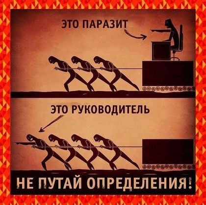

# Руководитель
> 2019.05.12 [🚀](../index/index.md) [despace](index.md) → [Оргструктура](orgstruct.md), **[Control](control.md)**

[TOC]

---

> <small>**Русский** — русскоязычный термин. **Executive / Manager** — англоязычный эквивалент.</small>

**Руководитель** (также **начальник**, **менеджер**) — тот, кто умеет:

   1. определить работы;
   1. подобрать персонал;
   1. распределить работы;
   1. создать персоналу комфортные условия для продуктивной работы;
   1. не мешать персоналу работать;
   1. поддерживать и изменять существующую систему;
   1. отстаивать интересы своих сотрудников.

 

## Менеджер
**Ме́неджер** *(англ. manager, происхождение от manage «управлять»)* руководи́тель, управля́ющий — начальник, занятый управлением процессами и персоналом на определённом участке предприятия: может быть её владелец, но часто наёмный работник.

Менеджер, как правило, является должностным лицом в организации, в которой работает, и входит в средний и высший руководящий состав предприятия. Определяющим признаком управляющего является наличие подчинённых. Основная функция менеджера — управление, включающее процесс планирования, организации, мотивации и контроля. В зависимости от величины и количества объектов управления различают уровни управления, а, следовательно, и менеджеров.

Подвержены действию [принципа Питера](peter_principle.md) — подняться по карьерной лестнице до уровня своей [некомпетентности](competence.md) и оттуда некомпетентно руководить.

Общепринято выделять менеджеров младшего звена (в мировой практике — операционных управляющих), менеджеров среднего звена и менеджеров высшего звена:

   - **Менеджеры младшего звена** — управленцы начального уровня, находящиеся непосредственно над другими работниками (не управленцами). К ним относятся заведующие отделом (магазинов, учреждений), складом, кафедрой и лабораторией в учебных и научных заведениях, начальники участков и смен, менеджеры продаж, которым подчиняются специалисты по продажам, торговые консультанты, торговые представители, агенты и т.п. Вообще, большая часть менеджеров — это менеджеры младшего, т.е. начального звена. Большинство специалистов становятся управленцами именно в этом качестве.
   - **Менеджеры среднего звена** — управленцы среднего звена, руководящие менеджерами младшего звена. В зависимости от величины и структуры организации может быть несколько уровней таких менеджеров. Менеджерами среднего звена, как правило, являются руководители отделений, подразделений, департаментов, деканы факультетов, начальники цехов, складов, хозяйства.
   - **Менеджеры высшего звена** — топ‑менеджеры, высший административно‑управленческий состав. Это малочисленная группа менеджеров. Даже в самых крупных организациях их всего несколько человек. Типичными должностями здесь является генеральный директор предприятия, управляющий банком, ректор университета, председатель правления, председатель совета директоров.

 

## Docs & links (TRANSLATEME ALREADY)
|Navigation|
|:--|
|**[FAQ](faq.md)**, **[Cable](cable.md)**·БКС, **[Camera](cam.md)**·Камера, **[Comms](comms.md)**·Радио, **[CON](contact.md)·[Pers](person.md)**·Контакт, **[Control](control.md)**·Упр., **[Doc](doc.md)**·Док., **[Doppler](doppler.md)**·ИСР, **[DS](ds.md)**·ЗУ, **[EB](eb.md)**·ХИТ, **[ECO](ecology.md)**·Экол., **[EF](ef.md)**·ВВФ, **[ElC](elc.md)**·ЭКБ, **[EMC](emc.md)**·ЭМС, **[Error](error.md)**·Ошибки, **[Event](event.md)**·События, **[FS](fs.md)**·ТЭО, **[Fuel](fuel.md)**·Топливо, **[GNC](gnc.md)**·БКУ, **[GS](scs.md)**·НС, **[HF&E](hfe.md)**·Эрго., **[IU](iu.md)**·Гиро., **[KT](kt.md)**·КТЕХ, **[LAG](lag.md)**·ПУC, **[LES](les.md)**·САСП, **[LS](ls.md)**·СЖО, **[LV](lv.md)**·РН, **[MCC](mcc.md)**·ЦУП, **[Model](model.md)**·Модель, **[MSC](sc.md)**·ПКА, **[N&B](nnb.md)**·БНО, **[NR](nr.md)**·ЯР, **[OBC](obc.md)**·ЦВМ, **[OE](oe.md)**·БА, **[Pat.](патент.md)**·Патент, **[Proj.](project.md)**·Проект, **[PS](ps.md)**·ДУ, **[QM](qm.md)**·БКНР, **[R&D](rnd.md)**·НИОКР, **[Robot](robotics.md)**·Робот, **[Rover](rover.md)**·Ровер, **[RTG](rtg.md)**·РИТЭГ, **[SARC](sarc.md)**·ПСК, **[SE](se.md)**·СЭ, **[Sens.](sensor.md)**·Датч., **[SC](sc.md)**·КА, **[SCS](scs.md)**·КК, **[SGM](sgm.md)**·КММ, **[SI](si.md)**·СИ, **[Soft](soft.md)**·ПО, **[SP](sp.md)**·БС, **[Spaceport](spaceport.md)**·Космодр., **[SPS](sps.md)**·СЭС, **[SSS](sss.md)**·ГЗУ, **[TCS](tcs.md)**·СОТР, **[Test](test.md)**·ЭО, **[Timeline](timeline.md)**·ЦГМ, **[TMS](tms.md)**·ТМС, **[TOR](tor.md)**·ТЗ, **[TRL](trl.md)**·УГТ|
|*Sections & pages*|
|**【[Control](Control.md)】**  [Ad hoc](ad_hoc.md)・ [Business travel](business_travel.md)・ [Chief designers council](cocd.md)・ [CML](cml.md)・ [Competence](competence.md)・ [Confident](confident.md)・ [Consp.theory](consp_theory.md)・ [Control sys. (CS)](cs.md)・ [Coordinate system](coord_sys.md)・ [Curator](curator.md)・ [Designer’s supervision](des_spv.md)・ [E‑sig](esig.md)・ [Engineer](se.md)・ [Errand](errand.md)・ [Federal law](fed_law.md)・ [Federal TP](fed_tp.md)・ [Federal SP](fed_sp.md)・ [GNC](gnc.md)・ [Gravity assist](gravass.md)・ [Industrial archaeology](ind_arch.md)・ [Instruction](instruction.md)・ [Lean manuf.](lean_man.md)・ [Lifetime](lifetime.md)・ [Manager](manager.md)・ [MBSE](mbse.md)・ [Meeting](meeting.md)・ [MCC](mcc.md)・ [MIC](mic.md)・ [MML](mml.md)・ [MoU](mou.md)・ [Nav. & ballistics (NB)](nnb.md)・ [Nonprofit org.](nonprof_org.md)・ [NX](nx.md)・ [Oberth effect](oberth_eff.md)・ [Org.structure](orgstruct.md)・ [Outcomes commission](outccom.md)・ [Patent](patent_res.md)・ [Peter prin.](peter_principle.md)・ [Plan](plan.md)・ [PMBok](pmbok.md)・ [Quorum](quorum.md)・ [R&D management](mgmt.md)・ [R&D support](rnd_support.md)・ [Recursion](recurs.md)・ [Schulze_method](schulze_method.md)・ [Sci'N'Tech activities](st_act.md)・ [Sci'N'Tech council](satc.md)・ [Single-window system](sw_sys.md)・ [Situ.leadership](situ_leadership.md)・ [Skunk works](skunk_works.md)・ [State arm. plan](plan_sa.md)・ [Swamp](swamp.md)・ [Teamcenter](teamcenter.md)・ [Tennis racket theorem](tr_theorem.md)・ [TRIZ](triz.md)・ [TRL](trl.md)・ [V‑model](v_model.md)・ [Veto](veto.md)・ [Workflow](workflow.md)・ [Workgroup](wg.md)|

   1. Docs: …
   1. Notable interwikies — …
   1. <https://ru.wikipedia.org/wiki/Руководство>
   1. <https://ru.wikipedia.org/wiki/Менеджер>
   1. <http://lurkmore.to/Армейский_способ>
   1. [Ситуационное лидерство](situ_leadership.md)
   1. 2011.11.29 [Хабр: О микроменеджменте ⎆](https://habr.com/ru/post/133601/) — [archive ❐](f/archive/20111129_1.pdf) of 2019.02.16)
   1. 2015.10.13 [Хабр: Вертикаль корпоративной власти, трилогия ⎆](https://habr.com/ru/post/295314/) — [archive ❐](f/archive/20151013_1.pdf) of 2019.02.16)
   1. 2017.10.04 [Почему заниженные зарплаты и переработки сотрудников неэффективны для стартапов ⎆](https://habr.com/ru/company/wirex/blog/407025/) — [archive ❐](f/archive/20171004_2.pdf) of 2019.02.16)
