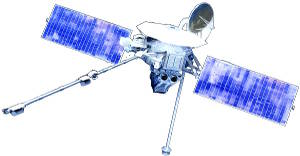
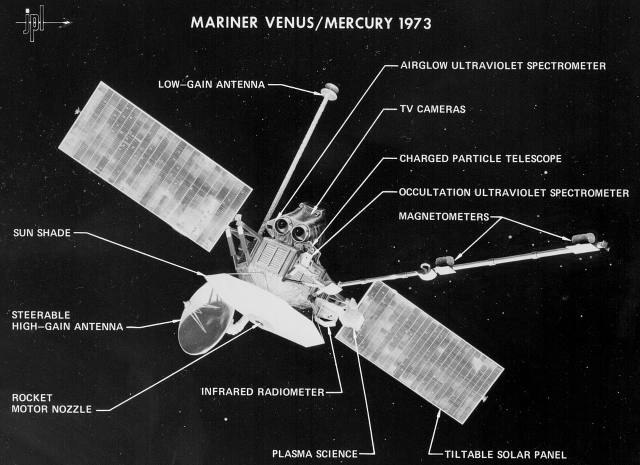

# Mariner 10
> Ver. . ┊ **🚀 [despace](index.md)** → **** <mark>NOCAT</mark>

[TOC]

---

> <small>*Terms:* **Mariner 10** — English term with no analogues in Russian. **Маринер‑10** — rough Russian equivalent.</small>

**Mariner 10** was an American spacecraft launched by NASA on November 3, 1973, to fly by the planets Mercury & Venus. It was the first spacecraft to perform flybys of multiple planets. Mariner 10 was the last spacecraft in the Mariner program.

 

|*Type*|*[Param.](si.md)*|
|:--|:--|
|**Mission:**|• • •|
|Cost| $100 million or 19 312 kg of [gold](sc_price.md) |
|Development| 1969 — 1973 |
|Duration| 1 year 4 months 21 days |
|Launch| November 3, 1973, 05:45:00 UTC, Rocket Atlas SLV-3D Centaur-D1A |
|Operator| NASA / JPL |
|Programme| Mariner |
|Similar  missions| • Proposed: [BepiColombo](bepicolombo.md), [Messenger](messenger.md), Mercury-P (2031)  • Current: …   • Past: [Mariner 2](mariner_2.md) |
|Target| Measurement Mercury's environment, atmosphere, surface, & body characteristics & to make similar investigations of Venus |
|[Type](sc.md)| Flyby spacecraft |
|**Spacecraft:**|• • •|
|Comms| S-Band |
|Composition| Orbiter |
|Contractor| … |
|[ID](spaceid.md)| NSSDC ID (COSPAR ID): [1973-085A ⎆](https://nssdc.gsfc.nasa.gov/nmc/spacecraft/display.action?id=1973-085A), SCN: 06919 |
|Manufacturer| Jet Propulsion Laboratory |
|Mass| 502.9 kilograms ([medium satellite](sc.md), [EVN‑072](venus.md))|
|Orbit / Site| … |
|Payload| 2 Telescopes, Infrared radiometer, Ultraviolet spectrometers, Plasma detectors, Charged particle telescopes, Magnetometers |
|Power| 820 W (at Venus encounter) |

Achieved targets & investigations:

   - **T** — technical; **Draft** — minimum for working with object. **D** — distant exploration; **C** — contact exploration; **F** — fly‑by; **H** — manned flight; **S** — soil sampe return; **X** — technology demonstration
   - **Sections of measurement and observation:**
      - Atmospheric/climate — **Ac** composition, **Ai** imaging, **Am** mapping, **Ap** pressure, **As** samples, **At** temperature, **Aw** wind speed/direction.
      - General — **Gi** planet’s interactions with outer space.
      - Soil/surface — **Sc** composition, **Si** imaging, **Sm** mapping, **Ss** samples.

<small>

|*EVN‑XXX*|*T*|*EN*|*Section of m&o*|*D*|*C*|*F*|*H*|*S*|
|:--|:--|:--|:--|:--|:--|:--|:--|:--|
|EVN‑001||Atmosphere: model, draft.|  |D|C|F|||
|EVN‑005|T|Exploration: from Venusian orbit.|  |D||F|||
|EVN‑008||Atmosphere: flashing on the night side.|  |D|||||
|EVN‑010||Atmosphere: vertical model.|  |D|||||
|EVN‑011||Atmosphere: common circulation model.|  |D|||||
|EVN‑014||Atmosphere: composition.|  |D|||F||
|EVN‑016||Atmosphere: clouds, their structure.|  |D||F|||
|EVN‑017||Atmosphere: structure.|  |D|||||
|EVN‑028||Magnetosphere structure.|  |D||F|||
|EVN‑035||Atmosphere: nature of the UF‑absorber.|  |D|||||
|EVN‑041||Correlation between the atmosphere & the surface.|  |D|||||
|EVN‑067||Atmosphere: nature of the polar turbulence.|  |D|||||
|EVN‑072|T|Exploration with [satellites](sc.md): medium satellites.|  |D||F|||
|EVN‑074||Meteorological model.|  |D||F|||
|EVN‑077||Atmosphere: chemical elements distribution.|  |D||F|||
|EVN‑078|T|Atmosphere: radiography.|  |D|||||
|EVN‑093|T|Atmosphere/surface imaging.|  |D||F|||
|EVN‑097||Atmosphere: effect of solar Rad & interplanetary space on the atmo.|  |D||F|||

</small>

 

## Mission
Mariner 10 was the first spacecraft to make use of an interplanetary gravitational slingshot maneuver, using Venus to bend its flight path & bring its perihelion down to the level of Mercury's orbit. This maneuver put the spacecraft into an orbit that repeatedly brought it back to Mercury. Mariner 10 used the solar radiation pressure on its solar panels & its high-gain antenna as a means of attitude control during flight, the first spacecraft to use active solar pressure control.

Mariner 10 conducted seven experiments at Venus & Mercury. Six of these experiments had a dedicated scientific instrument to collect data. JPL selected seven experiments on the basis of maximizing science return without exceeding cost guidelines: together, the seven scientific experiments cost 12.6 million dollars, about one-eighth of the total mission budget.

During its first week of flight, the Mariner 10 camera system was tested by taking five photographic mosaics of the Earth & six of the Moon. It also obtained photographs of the north polar region of the Moon where prior coverage was poor.

**Venus flyby**

The spacecraft passed Venus on February 5, 1974, the closest approach being 5 768 km at 17:01 UTC ([EVN‑005](venus.md)). Mariner 10 had a camera. As Mariner 10 veered around Venus, from the planet's night side to daylight, the cameras snapped the probe's first image of Venus, showing an illuminated arc of clouds over the north pole emerging from darkness ([EVN‑008](venus.md)).

Earth occultation occurred between 17:07 UT & 17:11 UTC, during which the spacecraft transmitted X-band radio waves through Venus' atmosphere ([EVN‑078](venus.md)), gathering data on cloud structure ([EVN‑016](venus.md)) & temperature. Although Venus's cloud cover is nearly featureless in visible light, it was discovered that extensive cloud detail could be seen through Mariner's ultraviolet camera filters. The spacecraft continued photographing Venus until February 13 ([EVN‑093](venus.md)). Among the encounter's 4 165 acquired photographs, one resulting series of images captured a thick & distinctly patterned ([EVN‑017](venus.md)) atmosphere making a full revolution every four days ([EVN‑011](venus.md)), just as terrestrial observations had suggested.

The mission revealed the composition ([EVN‑014](venus.md)) & meteorological nature ([EVN‑074](venus.md)) of Venus’ atmosphere. Data from the radio science experiment measured the extent to which radio waves passing through the atmosphere were refracted, which was used to calculate the density, pressure, & temperature of the atmosphere at any given altitude ([EVN‑010](venus.md)). Overall, atmospheric temperature is higher closer to the planet's surface, but Mariner 10 found four altitudes where the pattern was reversed, which could signify the presence of a layer of clouds. The inversions occurred at the 56, 61, 63, & 81 km levels. The ultraviolet spectrometers identified the chemical substances that comprise Venus’ atmosphere ([EVN‑077](venus.md)). The elevated concentration of atomic oxygen in the upper atmosphere showed that the atmosphere is stratified into upper & lower layers that do not mix with each other; photographs of the upper & lower cloud layers corroborated this hypothesis. Mariner 10's ultraviolet photographs were an invaluable information source for studying the churning clouds of Venus’ atmosphere ([EVN‑016](venus.md)). The mission researchers believed the cloud features they photographed were located in the stratosphere & upper troposphere, created by condensation; they also concluded that the contrast between darker & lighter features was due to differences in the cloud's absorptivity of UV light ([EVN‑035](venus.md)). The subsolar region was of particular interest: as the sun is straight overhead, it imparts more solar energy to this area than other part of the planet. Compared to the rest of the planet's atmosphere, the subsolar region was highly active & irregular. "Cells" of air lifted by convection, each up to 500 km wide, were observed forming & dissipating within the span of a few hours; some had polygonal outlines ([EVN‑011](venus.md)).

According to Mariner 10, the atmosphere consisted of a giant vortex encircling the entire planet. Along the equator, areas of high pressure were found where solar heating generated convective flows that disrupted the main movement of clouds & created vortices tending toward the poles ([EVN‑011](venus.md), [067](venus.md)). At the equator, the speed of clouds was about 100 m/s, in the polar regions it reached 200 m/s, at the poles it could be transonic ([EVN‑001](venus.md)).

The gravity assist was also a success, coming well within the acceptable margin for error. In the four hours between 16:00 UTC & 20:00 UTC on February 5, Mariner 10's heliocentric velocity dropped from 37.008 km/s to 32.283 km/s. This changed the shape of the spacecraft's elliptical orbit around the Sun, so that the perihelion now coincided with the orbit of Mercury.

It was also possible to determine the mass of Venus even more precisely from the trajectory measurements of the station.

**First Mercury flyby**

The spacecraft flew past Mercury three times. The first Mercury encounter took place at 20:47 UTC on March 29, 1974, at a range of 703 km, passing on the shadow side.

**Second Mercury flyby**

After looping once around the Sun while Mercury completed two orbits, Mariner 10 flew by Mercury again on September 21, 1974, at a more distant range of 48 069 km below the southern hemisphere.

**Third Mercury flyby**

After losing roll control in October 1974, a third & final encounter, the closest to Mercury, took place on March 16, 1975, at a range of 327 km, passing almost over the north pole.

**Discoveries**

During its flyby of Venus, Mariner 10 discovered evidence of rotating clouds ([EVN‑011](venus.md)) & a very weak magnetic field ([EVN‑028](venus.md)). Using a near-ultraviolet filter, it photographed Venus's chevron clouds & performed other atmospheric studies ([EVN‑093](venus.md)).

The spacecraft flew past Mercury three times. Owing to the geometry of its orbit — its orbital period was almost exactly twice Mercury's — the same side of Mercury was sunlit each time, so it was only able to map 40 – 45% of Mercury's surface, taking over 2 800 photos. It revealed a more or less Moon-like surface. It thus contributed enormously to our understanding of Mercury, whose surface had not been successfully resolved through telescopic observation.

Mariner 10 also discovered that Mercury has a tenuous atmosphere consisting primarily of helium, as well as a magnetic field & a large iron-rich core. Its radiometer readings suggested that Mercury has a night time temperature of −183 °C & maximum daytime temperatures of 187 °C.

Planning for MESSENGER, a spacecraft that surveyed Mercury until 2015, relied extensively on data & information collected by Mariner 10.

 

## Science goals & payload
The mission objectives were to measure Mercury's environment, atmosphere, surface, & body characteristics & to make similar investigations of Venus. Secondary objectives were to perform experiments in the interplanetary medium & to obtain experience with a dual-planet gravity assist mission.

**Television photography**

The imaging system, the Television Photography Experiment, consisted of two 15 cm Cassegrain telescopes feeding vidicon tubes. The main telescope could be bypassed to a smaller wide angle optic, but using the same tube. It had an 8-position filter wheel, with one position occupied by a mirror for the wide-angle bypass.

Mass of cameras were 43.6 kg & 67 W of electricity, the cameras were the most weight & power than the other five instruments combined. The system returned about 7 000 photographs of Mercury & Venus during Mariner 10's flybys ([EVN-093](venus.md)).

**Infrared radiometer**

The infrared radiometer detected infrared radiation given off by Mercury's surface & Venus' atmosphere, from which the temperature could be calculated. How quickly the surface lost heat as it rotated into the planet's dark side revealed aspects about the surface's composition, such as whether it was made out of rocks, or out of finer particles ([EVN‑041](venus.md)). The infrared radiometer contained a pair of Cassegrain telescopes fixed at an angle of 120 degrees to each other, & a pair of detectors made from antimony-bismuth thermopiles. The instrument was designed to measure temperatures as cold as -193 °C & as hot as 427 °C. Stillman C. Chase, Jr. of the Santa Barbara Research Center headed the infrared radiometer experiment.

**Ultraviolet spectrometers**

Two ultraviolet spectrometers were involved in this experiment, one to measure UV absorption ([EVN‑035](venus.md)), the other to sense UV emissions. The occultation spectrometer scanned Mercury's edge as it passed in front of the Sun, & detected whether solar ultraviolet radiation was absorbed at certain wavelengths, which would indicate the presence of gas particles, & therefore an atmosphere. The airglow spectrometer detected extreme ultraviolet radiation emanating from atoms of gaseous hydrogen, helium, carbon, oxygen, neon, & argon. Unlike the occultation spectrometer, it did not require backlighting from the Sun, & could move along with the rotatable scan platform on the spacecraft. The experiment's most important goal was to ascertain whether Mercury had an atmosphere, but would also gather data at Earth & Venus & study the interstellar background radiation.

**Plasma detectors**

The plasma experiment's goal was to study the ionized gases (plasma) of the solar wind, the temperature & density of its electrons, & how the planets affected the velocity of the plasma stream. The experiment contained two components, facing in opposite directions. The Scanning Electrostatic Analyzer was aimed toward the Sun, & could detect positive ions & electrons, which were separated by a set of three concentric hemispherical plates. The Scanning Electron Spectrometer was aimed away from the Sun, & detected only electrons, using just one hemispherical plate. The instruments could be rotated about 60 degrees to either side. By gathering data on the solar wind's movement around Mercury, the plasma experiment could be used to verify the magnetometer's observations of Mercury's magnetic field. Using the plasma detectors, Mariner 10 gathered the first in situ solar wind data from inside Venus' orbit ([EVN‑097](venus.md)).

**Charged particle telescopes**

The goal of the charged particles experiment was to observe how the heliosphere interacted with cosmic radiation. In connection with the plasma detectors & magnetometers, this experiment had the potential to provide additional evidence of a magnetic field around Mercury, by showing whether such a field had captured charged particles. Two telescopes were used to collect highly energetic electrons & atomic nuclei, specifically oxygen nuclei or less massive. These particles then passed through a set of detectors & were counted.

**Magnetometers**

Two fluxgate magnetometers were entrusted with discerning whether Mercury produced a magnetic field, & studying the interplanetary magnetic field between flybys. In designing this experiment, scientists had to account for interference from the magnetic field generated by Mariner 10's many electronic parts. For this reason, the magnetometers had to be situated on a long boom, one closer to the octagonal hub, the other one further away. Data from the two magnetometers would be cross-referenced to filter out the spacecraft's own magnetic field.

**Celestial Mechanics & Radio Science experiment**

This experiment investigated the mass & gravitational characteristics of Mercury. It was of particular interest because of the planet's closeness to the Sun, large orbital eccentricity, & unusual spin-orbit resonance.

As the spacecraft passed behind Mercury on the first encounter there was an opportunity to probe the atmosphere & to measure the radius of the planet. By observing phase changes in the S-band radio signal, measurements of the atmosphere could be made. The atmosphere was assessed as having a density of about 10¹⁶ molecules per cm³.

 

## Spacecraft
The components on Mariner 10 can be categorized into four groups based on their common function. The solar panels, power subsystem, attitude control subsystem, & computer kept the spacecraft operating properly during the flight. The navigational system, including the hydrazine rocket, would keep Mariner 10 on track to Venus & Mercury. Several scientific instruments would collect data at the two planets. Finally, the antennas would transmit this data to the Deep Space Network back on Earth, as well as receive commands from Mission Control. Mariner 10's various components & scientific instruments were attached to a central hub, which was roughly the shape of an octagonal prism. The hub stored the spacecraft's internal electronics.

Mariner 10 determined its attitude using two optical sensors, one pointed at the Sun, & the other at a bright star, usually Canopus; additionally, the spacecraft's three gyroscopes provided a second option for calculating the attitude. Nitrogen gas thrusters were used to adjust Mariner 10's orientation along three axes.

The spacecraft's electronics were intricate & complex. Resistors, capacitors, diodes, microcircuits, & transistors were the most common devices.

The power subsystem used two redundant sets of circuitry, each containing a booster regulator & an inverter, to convert the panels' DC output to AC & alter the voltage to the necessary level. The subsystem could store up to 20 Ah of electricity on a 39 V nickel-cadmium battery.

Thermal blankets & a sunshade were installed on the main body. After evaluating different choices for the sunshade cloth material, mission planners chose beta cloth, a combination of aluminized Kapton & glass-fiber sheets treated with Teflon.

 

## Community, library, links

**PEOPLE:**

   - **Leaders:**
      1. Bruce C. Murray — led science team at the Jet Propulsion Laboratory. 
      1. Stillman C. Chase, Jr. — headed the infrared radiometer experiment.
   - **Scientists:**
      1. Giuseppe «Bepi» Colombo — Italian scientist, mathematician & engineer. He studied the planet Mercury, & it was his calculations which showed how to get a spacecraft into the solar orbit which would encounter Mercury multiple times, using a gravity assist maneuver with Venus.

**COMMUNITY:**

<mark>TBD</mark>

 

## Docs & links
|…°·•¹²³±×÷≤≥≈≠ ‑ −— ⎆✉ ❐“”’«»✔→✘☐☑├┕┆ 1 lb = 0.453592 kg; 1 g = 9.80665 m/s²|
|:--|
|<small>**[FAQ](faq.md)**, **[Cable](cable.md)**·БКС, **[Camera](camera.md)**·Камера, **[Comms](comms.md)**·Радиосв., **[Contact](contact.md)**·Контакт, **[Control](control.md)**·Управ., **[Doc](doc.md)**·Док., **[Doppler](doppler.md)**·ИСР, **[DS](ds.md)**·ЗУ, **[EB](eb.md)**·ХИТ, **[ECO](ecology.md)**·Экол., **[EF](ef.md)**·ВВФ, **[ElC](elc.md)**·ЭКБ, **[EMC](emc.md)**·ЭМС, **[Errors](error.md)**·Ошибки, **[Events](event.md)**·События, **[FS](fs.md)**·ТЭО, **[Fuel](fuel.md)**·Топливо, **[GNC](gnc.md)**·БКУ, **[GS](scs.md)**·НС, **[HF&E](hfe.md)**·Эргоном., **[IMU](imu.md)**·Гироскоп, **[Incubator](incubator.md)**·Инкуб., **[KT](kt.md)**·КТЕХ, **[LAG](lag.md)**·ПУC, **[LES](les.md)**·САСП, **[LS](ls.md)**·СЖО, **[LV](lv.md)**·РН, **[MAG](mag.md)**·Магнитом., **[MCC](mcc.md)**·ЦУП, **[Model](model.md)**·Модель, **[MSC](sc.md)**·ПКА, **[N&B](nnb.md)**·БНО, **[NR](nr.md)**·ЯР, **[OBC](obc.md)**·ЦВМ, **[OE](oe.md)**·БА, **[Patent](патент.md)**·Патент, **[Project](project.md)**·Проект, **[PS](ps.md)**·ДУ, **[QA](quality.md)**·QA, **[R&D](rnd.md)**·НИОКР, **[RAMS](rams.md)**·НиБ, **[Risk](risk.md)**·Риск, **[Robot](robotics.md)**·Робот, **[Rover](rover.md)**·Планетоход, **[RTG](rtg.md)**·РИТЭГ, **[RW](rw.md)**·ДМ, **[SARC](sarc.md)**·ПСК, **[Sensor](sensor.md)**·Датчик, **[SC](sc.md)**·КА, **[SCS](scs.md)**·КК, **[SGM](sgm.md)**·КММ, **[SI](si.md)**·СИ, **[Soft](soft.md)**·ПО, **[SP](sp.md)**·БС, **[Spaceport](spaceport.md)**·Космодром, **[SPS](sps.md)**·СЭС, **[SSS](sss.md)**·ГЗУ, **[TCS](tcs.md)**·СОТР, **[Test](test.md)**·ЭО, **[Timeline](timeline.md)**·Циклограмма, **[TMS](tms.md)**·ТМС, **[TOR](tor.md)**·ТЗ, **[TRL](trl.md)**·УГТ</small>|
|*Sections & pages*|
|**··•  •··**  <mark>NOCAT</mark> |

**Docs:**

   1. П. С. Шубин — Венера. Неукротимая планета. Издание второе, расширенное и дополненное. М.: Издательство «Голос‑Пресс»; Кемерово: издатель П. С. Шубин, 2018. — 352 стр.: ил.

**Links:**

   1. Notable interwikies — …
   1. <https://en.wikipedia.org/wiki/mariner_10>

