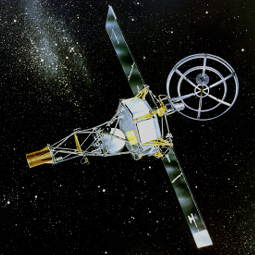

# Mariner 2
> 2019.12.10 ┊ **🚀 [despace](index.md)** → [Venus](venus.md), **[Project](project.md)**

[TOC]

---

> <small>*Terms:* **Mariner 2** — English term with no analogues in Russian. **Маринер‑2** — rough Russian equivalent.</small>

**Mariner 2** — american automatic interplanetary station, launched on August 27, 1962 to explore Venus. The first spacecraft to successfully explore another planet.

 

|*Type*|*[Param.](si.md)*|
|:--|:--|
|**Mission:**|• • •|
|Cost| … or … of [gold](sc_price.md) |
|Development| … |
|Duration| 4 months 7 days |
|Launch| August 27, 1962, 06:53:14 UTC, Rocket: Atlas Agena B |
|Operator| NASA / JPL |
|Programme| Space program Mariner |
|Similar  missions| • Proposed: [Mariner 5](mariner_5.md)  • Current: …  • Past: Luna 1 |
|Target| The Exploration Of Venus |
|[Type](sc.md)| Flyby spacecraft |
|**Spacecraft:**|• • •|
|Comms| Pointed parabolic antenna, 1.2 m in diameter |
|Composition| Orbiter |
|Contractor| … |
|[ID](spaceid.md)| NSSDC ID (COSPAR ID): [1962-041A ⎆](https://nssdc.gsfc.nasa.gov/nmc/spacecraft/display.action?id=1962-041A), SCN: 00374 |
|Manufacturer| JPL |
|Mass| 202.8 kg ([minisatellite](sc.md), [EVN‑070](venus.md)) |
|Orbit / Site| Heliocentric, apocenter 1.0 AU; pericenter 0.72 AU |
|Payload| Instruments for measuring magnetic fields, infrared and microwave radiation, detecting high-energy particles, and meteor-dust |
|Power| 220 W |

Achieved targets & investigations:

   - **T** — technical; **Draft** — minimum for working with object. **D** — distant exploration; **C** — contact exploration; **F** — fly‑by; **H** — manned flight; **S** — soil sampe return; **X** — technology demonstration
   - **Sections of measurement and observation:**
      - Atmospheric/climate — **Ac** composition, **Ai** imaging, **Am** mapping, **Ap** pressure, **As** samples, **At** temperature, **Aw** wind speed/direction.
      - General — **Gi** planet’s interactions with outer space.
      - Soil/surface — **Sc** composition, **Si** imaging, **Sm** mapping, **Ss** samples.

<small>

|*EVN‑XXX*|*T*|*EN*|*Section of m&o*|*D*|*C*|*F*|*H*|*S*|
|:--|:--|:--|:--|:--|:--|:--|:--|:--|
|EVN‑001||Atmosphere: model, draft.|  |D|C|F|||
|EVN‑005|T|Exploration: from Venusian orbit.|  |D||F|||
|EVN‑028||Magnetosphere structure.|  |D||F|||
|EVN‑070|T|Exploration with [satellites](sc.md): minisatellites.|  |D||F|||
|EVN‑074||Meteorological model.|  |D||F|||
|EVN‑077||Atmosphere: chemical elements distribution.|  |D||F|||
|EVN‑090||Spin axis.|  |D|||||
|EVN‑097||Atmosphere: effect of solar Rad & interplanetary space on the atmo.|  |D||F|||

</small>

 

## Mission
Mariner-2 (Mariner-Venus 1962), an American Venus exploration spacecraft, was the first spacecraft to conduct a successful planetary rendezvous. It was launched from Cape Canaveral on August 27, 1962.

The main mission was to receive messages from the spacecraft in the vicinity of Venus and conduct radiometric measurements of the planet's temperature. The second task was to measure the interplanetary magnetic field ([EVN‑028](venus.md)) and the environment with charged particles ([EVN‑097](venus.md)).

On the way to Venus, Mariner 2 measured the solar wind ([EVN-097](venus.md)) − a constant stream of charged particles, which confirmed the results of measurements made by Luna 1 in 1959. It also measured interplanetary dust, which was less than predicted. In addition, Mariner 2 detected high-energy charged particles coming from the Sun, including several short solar flares, as well as cosmic rays from outside the solar system. When Mariner 2 flew past Venus on December 14, 1962 ([EVN-005](venus.md)), it scanned the planet with its pair of radiometers, finding that Venus has relatively cool clouds and an extremely hot surface ([EVN-001](venus.md), [EVN‑074](venus.md)).

The last data transmission from Mariner 2 was received on January 3, 1963 at 7:00 UTC, meaning the total time from launch to mission completion was 2 129 days.

The magnetic field of Venus Mariner 2 did not detect ([EVN‑028](venus.md)), which, however, did not mean that the planet did not have one. A radiation belt similar to Earth's was also not found on Venus.

Improved estimates of the mass of Venus were made, as well as studies (later confirmed by other research) that showed that Venus rotates very slowly and in the opposite direction of The Earth's rotation ([EVN-090](venus.md)).

 

## Tasks and payload
The scientific objectives were:

   - Radiometer experiment.
   - Infrared experiment.
   - Magnetometer experiment.
   - Charged particles experiment.
   - Plasma experiment.
   - Micrometeorite experiment.
   
Besides the experiments with the scientific instruments, the objectives of both the Mariner 1 and 2 spacecraft included also engineering objectives:

   - Evaluation of the attitude control system.
   - Evaluation of the environmental control system.
   - Evaluation of the entire power system.
   - Evaluation of the communication system.

The data received during the flight consisted of two categories, namely: tracking data and telemetry. One of the most significant data collected by the spacecraft was information about the high temperature of the atmosphere of Venus ([EVN-074](venus.md)), the value of which was close to 500 °C. For the first time, various properties of the solar wind were measured.

Mariner 2 was equipped with scientific instruments for measuring the magnetic field, infrared and microwave radiation, detecting high-energy particles, and meteor dust. The station did not have a camera.

   - A two-channel microwave radiometer. It was used to determine the absolute temperature of Venus' surface and details concerning its atmosphere through its microwave-radiation characteristics, including the daylight and dark hemispheres, and in the region of the terminator ([EVN‑074](venus.md)). Measurements were performed simultaneously in two frequency bands of 13.5 mm and 19.0 mm.

|*Parameter*|*[Value](si.md)*|
|:--|:--|
|Frequency bands| 13.5 mm and 19.0 mm |
|Mass| 10 kg |
|Average power| 4 W |
|Peak power| 9 W |

   - A two-channel infrared radiometer to measure the effective temperatures of small areas of Venus ([EVN‑074](venus.md)). The radiation that was received could originate from the planetary surface, clouds in the atmosphere, the atmosphere itself or a combination of these. The radiation was received in two spectral ranges: 8 to 9 μm (focused on 8.4 μm) and 10 to 10.8 μm (focused on 10.4 μm). The latter corresponding to the carbon dioxide band ([EVN‑077](venus.md)).

|*Parameter*|*[Value](si.md)*|
|:--|:--|
|Frequency bands| 8 to 9 μm (F = 8.4 μm) and 10 to 10.8 μm (F = 10.4 μm) |
|Mass| 1.3 kg |
|Power| 2.4 W |
|The range of measurement of radiation temperatures| 200 − 500 K |

   - A three-axis fluxgate magnetometer to measure planetary and interplanetary magnetic fields ([EVN‑028](venus.md)). Three probes were incorporated in its sensors, so it could obtain three mutually orthogonal components of the field vector. The field that the magnetometer observed was the super-position of a nearly constant spacecraft field and the interplanetary field. Thus, it effectively measured only the changes in the interplanetary field.
   - An ionization chamber with matched Geiger-Müller tubes (also known as a cosmic ray detector) to measure high-energy cosmic radiation.
   - A cosmic dust detector to measure the flux of cosmic dust particles in space.
   - A solar plasma spectrometer to measure the spectrum of low-energy positively charged particles from the Sun, i.e. the solar wind.
   - A particle detector (implemented through use of an Anton type 213 Geiger-Müller tube) to measure lower radiation (especially near Venus). It detected soft x-rays efficiently and ultraviolet inefficiently.

 

## Космический аппарат
Mariner 2 had a mass of 203 kg and was identical to Mariner 1 (lost at the start). The spacecraft consisted of a hexagonal base, 1.04 m wide and 0.36 m high, containing six magnesium chassis carrying equipment for scientific experiments, communications, calculations, measurements, spatial orientation and power supply monitoring, batteries and their charging, as well as tanks with gas for position correction and a jet engine. A tall pyramid-shaped mast was attached to the base, which also held equipment for scientific experiments. The total height of the spacecraft reached 3.66 m. Rectangular solar panels with a maximum span of 5.05 m and a width of 0.76 m were attached to the sides of the base. A directional parabolic antenna was mounted on a manipulator on one side of the base.

The power system of Mariner 2 consisted of two solar panels supplying the spacecraft directly or charging 1 000 W·h silver-zinc battery. Power and acceleration control devices controlled the power supply. The 3 W transmitter provided continuous telemetry contact, a large high-sensitivity directional parabolic antenna, a cylindrical omni-directional antenna at the top of the instrument mast, and two command antennas, one at the end of each solar array, receiving course change commands and other functions.

Jet power for course maneuvers was provided by a single-fuel (hydrazine) 225 N retro rocket. The hydrazine was ignited using dinitrogen tetroxide and granulated aluminum oxide. The direction of the jet stream was controlled by four gas rudders located in front of the nozzle. Position control in space (with an error of 1°) was carried out by a system of nitrogen jet engines. The Sun and Earth were used to stabilize central computer and a sequence controller. The thermal control was achieved through the use of passive reflecting and absorbing surfaces, thermal shields and the shielding grating.

Scientific experiments were based on the base of the spacecraft and the mast. The magnetometer was mounted on top of the mast above an omnidirectional antenna. The particle detectors were mounted in the middle of the mast, along with the cosmic ray detector. The space dust detector and the space plasma spectrometer were installed on the edges of the base of the spacecraft. The microwave radiometer, infrared radiometer, and radiometer antennas were assembled into a 48 cm parabolic radiometer antenna mounted at the base of the mast.

 

## Community, links, people

**PEOPLE:**

   1. Marcia Neugebauer is an american geophysicist who made contributions to space physics. Neugebauer's research was among the first that yielded the first direct measurements of the solar wind and shed light on its physics and interaction with comets.

**COMMUNITIES:**

<mark>TBD</mark>

 

## Docs & links
|…°·•¹²³±×÷≤≥≈≠ ‑ −— ⎆✉ ❐“”’«»✔→✘☐☑├┕┆ 1 lb = 0.453592 kg; 1 g = 9.80665 m/s²|
|:--|
|<small>**[FAQ](faq.md)**, **[Cable](cable.md)**·БКС, **[Camera](camera.md)**·Камера, **[Comms](comms.md)**·Радиосв., **[Contact](contact.md)**·Контакт, **[Control](control.md)**·Управ., **[Doc](doc.md)**·Док., **[Doppler](doppler.md)**·ИСР, **[DS](ds.md)**·ЗУ, **[EB](eb.md)**·ХИТ, **[ECO](ecology.md)**·Экол., **[EF](ef.md)**·ВВФ, **[ElC](elc.md)**·ЭКБ, **[EMC](emc.md)**·ЭМС, **[Errors](error.md)**·Ошибки, **[Events](event.md)**·События, **[FS](fs.md)**·ТЭО, **[Fuel](fuel.md)**·Топливо, **[GNC](gnc.md)**·БКУ, **[GS](scs.md)**·НС, **[HF&E](hfe.md)**·Эргоном., **[IMU](imu.md)**·Гироскоп, **[Incubator](incubator.md)**·Инкуб., **[KT](kt.md)**·КТЕХ, **[LAG](lag.md)**·ПУC, **[LES](les.md)**·САСП, **[LS](ls.md)**·СЖО, **[LV](lv.md)**·РН, **[MAG](mag.md)**·Магнитом., **[MCC](mcc.md)**·ЦУП, **[Model](model.md)**·Модель, **[MSC](sc.md)**·ПКА, **[N&B](nnb.md)**·БНО, **[NR](nr.md)**·ЯР, **[OBC](obc.md)**·ЦВМ, **[OE](oe.md)**·БА, **[Patent](патент.md)**·Патент, **[Project](project.md)**·Проект, **[PS](ps.md)**·ДУ, **[QA](quality.md)**·QA, **[R&D](rnd.md)**·НИОКР, **[RAMS](rams.md)**·НиБ, **[Risk](risk.md)**·Риск, **[Robot](robotics.md)**·Робот, **[Rover](rover.md)**·Планетоход, **[RTG](rtg.md)**·РИТЭГ, **[RW](rw.md)**·ДМ, **[SARC](sarc.md)**·ПСК, **[Sensor](sensor.md)**·Датчик, **[SC](sc.md)**·КА, **[SCS](scs.md)**·КК, **[SGM](sgm.md)**·КММ, **[SI](si.md)**·СИ, **[Soft](soft.md)**·ПО, **[SP](sp.md)**·БС, **[Spaceport](spaceport.md)**·Космодром, **[SPS](sps.md)**·СЭС, **[SSS](sss.md)**·ГЗУ, **[TCS](tcs.md)**·СОТР, **[Test](test.md)**·ЭО, **[Timeline](timeline.md)**·Циклограмма, **[TMS](tms.md)**·ТМС, **[TOR](tor.md)**·ТЗ, **[TRL](trl.md)**·УГТ</small>|
|*Sections & pages*|
|**··•  •··**  <mark>NOCAT</mark> |

**Docs:**

   1. …

**Links:**

   1. Notable interwikies — …
   1. <https://en.wikipedia.org/wiki/mariner_2>
   1. <https://ru.wikipedia.org/wiki/Маринер-2>
