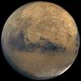
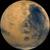
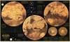
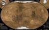
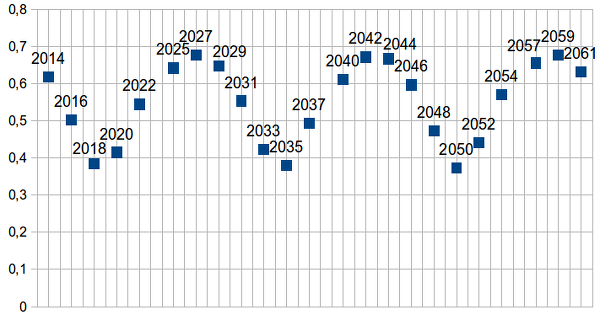
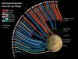

# Марс
> 2019.03.21 [🚀](../index/index.md) [despace](index.md) →  [Space](index.md), **[Марс](mars.md)**

[TOC]

---

> <small>**Марс** — русскоязычный термин. **Mars** — англоязычный эквивалент.</small>

**Марс** (астр. ♂ [ ❐](f/aob/mars/mars_symbol.png)) — четвёртая по удалённости от [Солнца](sun.md) и седьмая по размерам [планета](aob.md) Солнечной системы; масса планеты составляет 10.7 % массы [Земли](earth.md). Названа в честь Марса — древнеримского бога войны, соответствующего древнегреческому Аресу. Иногда Марс называют «красной планетой» из‑за красноватого оттенка поверхности, придаваемого ей оксидом железа.

Марс — планета земной группы с разреженной атмосферой (давление у поверхности в 160 раз меньше [земного](earth.md)). Особенностями рельефа Марса считаются ударные кратеры наподобие лунных, а также вулканы, долины, пустыни и полярные ледниковые шапки наподобие земных.

У Марса два естественных спутника — [Фобос](phobos.md) и [Деймос](deimos.md) (в переводе с древнегреческого — «страх» и «ужас», имена двух сыновей Ареса, сопровождавших его в бою), которые малы (Фобос — 26.8×22.4×18.4 ㎞, Деймос — 15×12.2×10.4 ㎞) и имеют неправильную форму.

Начиная с 1960‑х годов непосредственным исследованием Марса с помощью АМС занимались СССР (программы «Марс» и «Фобос»), США (программы «Маринер», «Викинг», «Mars Global Surveyor» и другие), Европа (программа «Марс‑экспресс») и Индия (программа «Мангальян»). На сегодняшний день, после Земли, Марс — самая подробно изученная планета Солнечной системы.

| | | | |
|:--|:--|:--|:--|
|||||

## Характеристики
|*Characteristic*|*[Value](si.md)*|
|:--|:--|
|Flight from Earth|7 мес на ЖРДУ (~ 210 суток)|
|Signal from Earth|3 ‑ 22 минут|
|Distance from Earth|55.76 ‑ 401 млн ㎞|
|Breaking to the orbit| |
|**【Orbits】**|• • •|
|[Apocentre](apopericentre.md) (Афелий);  [Pericentre](apopericentre.md) (Перигелий)|249 232 000 ㎞ (1.666 [а.e.](si.md));  206 655 000 ㎞ (1.381 [а.e.](si.md))|
|[Argument of periapsis](keplerian.md) (ω)|286.46230°|
|[Semimajor axis](keplerian.md) (a)|2.2794382·10⁸ ㎞ (1.523662 а.e.) <small>(1.524 земной)</small>|
|Day/year|…/… земных|
|[Longit. of asc.node](keplerian.md) (Ω)|49.57854°|
|[Inclination](keplerian.md) (Ⅰ)|1.85061° (относительно эклиптики);  5.65° (относительно солнечного экватора)|
|Orbital velocity (Ⅴ)|24.13 ㎞/s (средн.);  24.077 ㎞/s|
|[Sider. rotat.period](astroperiod.md) (T, day)|1.02595675 дня (24 h 39 min 35.244 s)|
|[Sidereal period](astroperiod.md) (year)|686.98 земных суток <small>(1.8808476 земных лет)</small>|
|[Synodic period](astroperiod.md)|779.94 земных суток|
|Satellites|[Деймос](deimos.md), [Фобос](phobos.md)|
|[Hill sphere](hill_sphere.md)|950 000 ㎞|
|Satellite of|[Солнце](sun.md)|
|[Eccentricity](keplerian.md) (e)|0.0933941|
|**【Physics】**|• • •|
|[Escape velocity](esc_vel.md)|3.546 ㎞/s (v₁, 0.45 земной);  5.03 ㎞/s (v₂, 0.45 земной)|
|[Albedo](albedo.md)|0.250 (Бонд); 0.150 (геом. альбедо); 0.170|
|[Apparent magnitude](app_mag.md) (m)|–2.91m (при макс. сближении с Землёй)|
|[Magnetic field](mag_field.md)|0.0000001 T (0.02 Earth’s)|
|Mass (m)|6.4185·10²³ ㎏ <small>(0.107 земной)</small>|
|Axial tilt|25.1919°|
|Volume (Ⅴ)|1.6318·10¹¹ ㎞³ <small>(0.151 земного)</small>|
|Mean density (ρ)|3.933 g/㎝³ (средняя, <small>0.714 земной</small>)|
|Surface area (S)|144 371 391 ㎞² <small>(0.283 земной)</small>|
|Flattening|0.00589 <small>(1.76 земного)</small>|
|Radius|3 396.2 ㎞ (экватор., <small>0.532 земного</small>);  3 376.2 ㎞ (полярный, <small>0.531 земного</small>);  3 389.5 ㎞ (средний, <small>0.532 земного</small>)|
|Solar constant|586 W/m², 569 ‑ 608 W/m² (0.4308 Earth’s)|
|[Surface gravity](g.md)|3.711 ㎧² (экватор, <small>0.378 земного</small>)|
|Equatorial rotation velocity|868.22 ㎞/h <small>(0.518 земного)</small>|
|**【Temperature & atmo.】**|• • •|
|[Атмосфера](atmosphere.md)|**Давление** 0.4 ‑ 0.87 ㎪ (0.004 ‑ 0.0087 атм).  **Состав:**  95.32 % углекислый газ;  2.7 % азот;  1.6 % аргон;  0.13 % кислород;  0.08 % угарный газ;  0.021 % водяной пар;  0.01 % окись азота|
|[Освещённость](illum.md)| |
|[Radiation](ion_rad.md)| |
|Температура|на поверхности –140 ‑ +20 ℃;  по всей планете Мин. 186 К (−87 ℃);  по всей планете Ср. 210 K (−63 ℃);  по всей планете Макс. 268 К (−5 ℃)|

### Орбитальные
Минимальное расстояние от Марса до Земли составляет 55.76 млн ㎞ (когда Земля находится точно между Солнцем и Марсом), максимальное — около 401 млн ㎞ (когда Солнце находится точно между Землёй и Марсом).

Среднее расстояние от Марса до Солнца составляет 228 млн ㎞ (1.52 а.e.), период обращения вокруг Солнца равен 687 земным суткам. Орбита Марса имеет довольно заметный эксцентриситет (0.0934), поэтому расстояние до Солнца меняется от 206.6 до 249.2 млн ㎞. Наклонение орбиты Марса к плоскости эклиптики равно 1.85°.

Марс ближе всего к Земле во время противостояния, когда планета находится на небе в направлении, противоположном Солнцу. Противостояния повторяются каждые 26 месяцев в разных точках орбиты Марса и Земли. Раз в 15 ‑ 17 лет противостояния приходятся на то время, когда Марс находится вблизи своего перигелия; в этих традиционно называемых великими противостояниях расстояние до планеты минимально (менее 60 млн ㎞), и Марс достигает наибольшего углового размера 25.1″ и яркости −2.88m.

|Расстояние между Землёй и Марсом (в [а.е.](si.md))  во время противостояний 2014 ‑ 2061 гг.|
|:--|
||

### Жизнь
Есть ли жизнь на Мар~~к~~се?:

По словам уважаемого профессора всего на свете [Ксанфомалити](01_ксанфомалити1.md), жизнь на Марсе есть, так как первые советские посадочные аппараты не подвергались требованиям планетарного карантина и дезинфекции и вполне могли завезти туда что‑нибудь живое.

## Developing features
**Литература:**

   1. …

**Орбитальный КА:**

   1. Обычно КА для [Венеры](venus.md) и Марса унифицируют.

**Посадочный КА:**

   1. …

## Освоение Марса

### Зачем исследовать
<mark>TBD</mark>

 

### Краткая хронология
<https://nssdc.gsfc.nasa.gov/planetary/chronology.html>

<mark>TBD</mark>

### Проекты
См. также разделы «[Проекты](project.md)».

**[Марсоходы](robot.md):**

   - [Curiosity](curiosity.md)
   - [ExoMars Rover](exomars_rover.md)
   - [Mars 2020 RV](mars_2020_rv.md)
   - [MSRM](msrm.md)
   - [Opportunity](opportunity.md)
   - [Sojourner](sojourner.md)
   - [Spirit](spirit.md)
   - [Проп_М](проп_м.md)

**Table.** Missions/spacecraft of past & future. (**Ⓛ** — LAV)  (**C** — contact rsrch; **D** — distant rsrch; **F** — fly‑by; **H** — manned; **S** — soil sampe return; **X** — technology demonstr.)

| |*Mission/SC (index)*|*Date (UTC)*|*D*|*C*|*F*|*H*|*S*|*X*|*Notes*|
|:--|:--|:--|:--|:--|:--|:--|:--|:--|:--|
|—|**【Proposed】**|—|•|•|•|•|•|•|—|
| |…| | | | | | | |<mark>TBD</mark>|
|—|**【Developing】**|—|•|•|•|•|•|•|—|
|EU·RU|[Экспедиция‑М](экспедиция_м.md) (Э㎆) Ⓛ|2022|C|D| | |S|X|<mark>TBD</mark>|
|EU·RU|[ЭкзоМарс‑2020](экзомарс_2020.md) (ЭКЗ) Ⓛ|2020|C| | | | | |<mark>TBD</mark>|
|—|**【Active】**|—|•|•|•|•|•|•|—|
|…|…|…| | | | | | |<mark>TBD</mark>|
|—|**【Past】**|—|•|•|•|•|•|•|—|
|US|[MarCO](marco.md)|2018.05.05| |D| | | | |<mark>TBD</mark>|
|EU·RU|[ЭкзоМарс‑2016](экзомарс_2016.md) (ЭКЗ) Ⓛ|2016.03.14| |D| | | | |<mark>TBD</mark>|
|US|[MSL](msl.md)|2011.11.26|C| | | | | |<mark>TBD</mark>|
|RU|[Фобос‑Грунт](фобос_грунт.md) (ФГ) Ⓛ|2011.11.08|C| | | |S|X|<mark>TBD</mark>|
|JP|[Nozomi](nozomi.md)|1998.07.04| |D| | | | |<mark>TBD</mark>|
|RU|[Марс‑96](mars_96.md) Ⓛ|1996.11.16|C| | | | | |<mark>TBD</mark>|

 

## Научные и технические задачи
[Задачи и исследования](project.md) для Марса. (Примечания: **Т** — техническая задача; **Черновая версия** — минимально доступная для работы с предметом.)  
Targets & explorations for Mars. (Comments: **T** — technical; **Draft** — minimum for working with object.)

<small>

|*Number*|*T*|*EN*|*Section of m&o*|*C*|*D*|*F*|*H*|*S*|
|:--|:--|:--|:--|:--|:--|:--|:--|:--|
|•|•|**【Never occurred】**|•|•|•|•|•|•|
|EMA‑…| | | | | | | | |
|•|•|**【Was tried】**|•|•|•|•|•|•|
|EMA‑…| | | | | | | | |
|•|•|**【Mostly done】**|•|•|•|•|•|•|
|EMA‑…| | | | | | | | |

</small>

 

## Docs & links (TRANSLATEME ALREADY)
|Navigation|
|:--|
|**[FAQ](faq.md)**【**[SCS](scs.md)**·КК, **[SC (OE+SGM)](sc.md)**·КА】**[CON](contact.md)·[Pers](person.md)**·Контакт, **[Ctrl](control.md)**·Упр., **[Doc](doc.md)**·Док., **[EF](ef.md)**·ВВФ, **[Error](error.md)**·Ошибки, **[Event](event.md)**·События, **[FS](fs.md)**·ТЭО, **[HF&E](hfe.md)**·Эрго., **[KT](kt.md)**·КТ, **[Model](model.md)**·Модель, **[N&B](nnb.md)**·БНО, **[Project](project.md)**·Проект, **[QM](qm.md)**·БКНР, **[R&D](rnd.md)**·НИОКР, **[SI](si.md)**·СИ, **[Test](test.md)**·ЭО, **[TRL](trl.md)**·УГТ, **[Way](way.md)**·Пути|
|*Sections & pages*|
|**【[Space](index.md)】**  [Apparent magnitude](app_mag.md)・ [Astro.object](aob.md)・ [Blue Marble](earth.md)・ [Cosmic rays](cr.md)・ [Ecliptic](ecliptic.md)・ [Escape velocity](esc_vel.md)・ [Health](health.md)・ [Hill sphere](hill_sphere.md)・ [Information](info.md)・ [Lagrangian points](l_points.md)・ [Near space](near_space.md)・ [Pale Blue Dot](earth.md)・ [Parallax](parallax.md)・ [Point Nemo](earth.md)・ [Silver Snoopy award](silver_snoopy_award.md)・ [Solar constant](solar_const.md)・ [Terminator](terminator.md)・ [Time](time.md)・ [Wormhole](wormhole.md) ┊ ··•·· **Solar system:** [Ariel](ariel.md)・ [Callisto](callisto.md)・ [Ceres](ceres.md)・ [Deimos](deimos.md)・ [Earth](earth.md)・ [Enceladus](enceladus.md)・ [Eris](eris.md)・ [Europa](europa.md)・ [Ganymede](ganymede.md)・ [Haumea](haumea.md)・ [Iapetus](iapetus.md)・ [Io](io.md)・ [Jupiter](jupiter.md)・ [Makemake](makemake.md)・ [Mars](mars.md)・ [Mercury](mercury.md)・ [Moon](moon.md)・ [Neptune](neptune.md)・ [Nereid](nereid.md)・ [Nibiru](nibiru.md)・ [Oberon](oberon.md)・ [Phobos](phobos.md)・ [Pluto](pluto.md)・ [Proteus](proteus.md)・ [Rhea](rhea.md)・ [Saturn](saturn.md)・ [Sedna](sedna.md)・ [Solar day](solar_day.md)・ [Sun](sun.md)・ [Titan](titan.md)・ [Titania](titania.md)・ [Triton](triton.md)・ [Umbriel](umbriel.md)・ [Uranus](uranus.md)・ [Venus](venus.md)|

   1. Docs: …
   1. Notable interwikies — …
   1. <https://en.wikipedia.org/wiki/Astronomical_symbols>
   1. <https://en.wikipedia.org/wiki/Mars>
   1. <https://ru.wikipedia.org/wiki/Марс>
   1. <https://nssdc.gsfc.nasa.gov/planetary/chronology.html>
   1. <http://www.astronet.ru/db/msg/1180522/index.html>
   1. <https://www.lpi.usra.edu/resources/mars_maps/> — Mars maps
