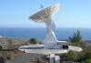
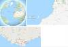

# Maspalomas Station
> 2019.05.12 **[🚀](../index/index.md) [despace](index.md)** → [НК](scs.md), **[НС](scs.md)**

[TOC]

---

> <small>*Термины:* **Maspalomas Station** — англоязычный термин, не имеющий аналога в русском языке. **Станция Маспаломас** — дословный перевод с английского на русский.</small>

**Maspalomas Station** is an INTA‑operated, [ESTRACK](estrack.md) radio antenna station for communication with spacecraft located at the southern area of Gran Canaria island, on the INTA campus. The site hosts a 15‑metre antenna with reception in S‑ and X‑[band](rf.md) and transmission in S‑band.

|*Фото*|*Карта*|
|:--|:--|
|||

## Характеристики
|*Характеристика*|*Описание*|
|:--|:--|
|Антенны|15 м — 1 шт.|
|Дальность связи, км||
|[Диапазоны частот](rf.md)|S, X — ↓;  S — ↑|
|Расстояние до…|3 000 — до экватора;  5 500 — до NASA;  5 800 — до НПОЛ|

 

## Docs & links (TRANSLATEME ALREADY)
|…°·•¹²³±×÷≤≥≈≠ ‑ −— ⎆✉ ❐“”’«»✔→✘☐☑├┕┆ 1 lb = 0.453592 kg; 1 g = 9.80665 m/s²|
|:--|
|<small>**[FAQ](faq.md)**, **[Cable](cable.md)**·БКС, **[Camera](cam.md)**·Камера, **[Comms](comms.md)**·Радио, **[Contact](contact.md)**·Контакт, **[Control](control.md)**·Упр., **[Doc](doc.md)**·Док., **[Doppler](doppler.md)**·ИСР, **[DS](ds.md)**·ЗУ, **[EB](eb.md)**·ХИТ, **[ECO](ecology.md)**·Экол., **[EF](ef.md)**·ВВФ, **[ElC](elc.md)**·ЭКБ, **[EMC](emc.md)**·ЭМС, **[Error](error.md)**·Ошибки, **[Event](event.md)**·События, **[FS](fs.md)**·ТЭО, **[Fuel](fuel.md)**·Топливо, **[GNC](gnc.md)**·БКУ, **[GS](scs.md)**·НС, **[HF&E](hfe.md)**·Эрго., **[IU](iu.md)**·Гиро., **[KT](kt.md)**·КТЕХ, **[LAG](lag.md)**·ПУC, **[LES](les.md)**·САСП, **[LS](ls.md)**·СЖО, **[LV](lv.md)**·РН, **[MCC](mcc.md)**·ЦУП, **[Model](model.md)**·Модель, **[MSC](sc.md)**·ПКА, **[N&B](nnb.md)**·БНО, **[NR](nr.md)**·ЯР, **[OBC](obc.md)**·ЦВМ, **[OE](oe.md)**·БА, **[Pat.](патент.md)**·Патент, **[Project](project.md)**·Проект, **[PS](ps.md)**·ДУ, **[R&D](rnd.md)**·НИОКР, **[SRRQ](srrq.md)**·БКНР, **[Robot](robotics.md)**·Робот, **[Rover](rover.md)**·Планетоход, **[RTG](rtg.md)**·РИТЭГ, **[SARC](sarc.md)**·ПСК, **[Sensor](sensor.md)**·Датчик, **[SC](sc.md)**·КА, **[SCS](scs.md)**·КК, **[SGM](sgm.md)**·КММ, **[SI](si.md)**·СИ, **[Soft](soft.md)**·ПО, **[SP](sp.md)**·БС, **[Spaceport](spaceport.md)**·Космодром, **[SPS](sps.md)**·СЭС, **[SSS](sss.md)**·ГЗУ, **[TCS](tcs.md)**·СОТР, **[Test](test.md)**·ЭО, **[Timeline](timeline.md)**·ЦГМ, **[TMS](tms.md)**·ТМС, **[TOR](tor.md)**·ТЗ, **[TRL](trl.md)**·УГТ</small>|
|*Sections & pages*|
|**`Наземная станция (НС):`**  …    [CDSN](cdsn.md) ┊ [DSN](dsn.md) ┊ [ESTRACK](estrack.md) ┊ [IDSN](idsn.md) ┊ [SSC_GGSN](ssc_ggsn.md) ┊ [UDSC](udsc.md)|

   1. Docs: …
   1. Notable interwikies — …
   1. <http://en.wikipedia.org/wiki/Maspalomas_Station>
   1. <https://www.esa.int/Our_Activities/Operations/Estrack/Maspalomas_station>

