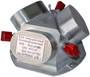

# МБИНС
> 2019.05.12 **[🚀](../index/index.md) [despace](index.md)** → **[Гироскоп](iu.md)**

[TOC]

---

> <small>*Термины:* **МБИНС** — русскоязычный термин, не имеющий аналога в английском языке. **MBINS** — дословный перевод с русского на английский.</small>

**МБИНС** — волоконно‑оптический [гироскоп](iu.md) (ВОГ) в составе [КА](sc.md), предназначенный для определения положения КА в инерциальной системе отсчёта. По заявлению разработчика, не уступает [LN-200](ln_200.md).  
*Разработчик:* [НПО ИТ](zz_npoit.md). Разработано  

||
|:--|
||

<small>

|*Характеристика*|*[Значение](si.md) <small>(МБИНС)</small>*|
|:--|:--|
|Диапазон измерения лин. ускорения||
|Диапазон измерения угл. скорости||
|Исполнение|Моноблок|
|Количество|—|
|<small>• акселерометров в приборе</small>|3|
|<small>• ВОГ в приборе</small>|3|
|<small>• приборов в БКУ</small>||
|Нестабильность угл. положения осей чувств‑ти, не более|—|
|<small>• в канале акселерометров</small>||
|<small>• в углоизмерительном канале</small>||
|Случайная составляющая погрешности нулевого сигнала, не более|—|
|<small>• в запуске после калибровки в канале акселерометров</small>||
|<small>• в запуске после калибровки в углоизмерительном канале</small>||
|<small>• от запуска к запуску в канале акселерометров</small>||
|<small>• от запуска к запуску в углоизмерительном канале</small>||
|Стабильность цены импульса, не более|—|
|<small>• в канале акселерометров</small>||
|<small>• в углоизмерительном канале</small>||
|[TRL](trl.md)||
|Цена импульса (масштабный коэффициент), не более|—|
|<small>• в канале акселерометров</small>||
|<small>• в углоизмерительном канале</small>||
|Шумовая составляющая в выходной информации, не более|—|
|<small>• в канале акселерометров</small>||
|<small>• в углоизмерительном канале</small>||
|**`Прочее`**||
|[ВБР](srrq.md) за САС||
|Габариты, ⌀ × в, мм||
|Интерфейсы|Манчестер‑2|
|Масса, кг, не более|1.34|
|[Voltage](voltage.md), V||
|Overload, g||
|[Rad.resist](ion_rad.md), Gy (rad)||
|Resource, h (y)|от 50 000 до 100 000 (от 5.7 до 11.4)|
|[Lifetime](lifetime.md), h (y)||
|[Temp. range](tcs.md), ℃||
|Consumption, W||

</small>

 

## Примечания
   1. …

## Применяемость
   1. …

 

## Docs & links (TRANSLATEME ALREADY)
|…°·•¹²³±×÷≤≥≈≠ ‑ −— ⎆✉ ❐“”’«»✔→✘☐☑├┕┆ 1 lb = 0.453592 kg; 1 g = 9.80665 m/s²|
|:--|
|<small>**[FAQ](faq.md)**, **[Cable](cable.md)**·БКС, **[Camera](cam.md)**·Камера, **[Comms](comms.md)**·Радио, **[Contact](contact.md)**·Контакт, **[Control](control.md)**·Упр., **[Doc](doc.md)**·Док., **[Doppler](doppler.md)**·ИСР, **[DS](ds.md)**·ЗУ, **[EB](eb.md)**·ХИТ, **[ECO](ecology.md)**·Экол., **[EF](ef.md)**·ВВФ, **[ElC](elc.md)**·ЭКБ, **[EMC](emc.md)**·ЭМС, **[Error](error.md)**·Ошибки, **[Event](event.md)**·События, **[FS](fs.md)**·ТЭО, **[Fuel](fuel.md)**·Топливо, **[GNC](gnc.md)**·БКУ, **[GS](scs.md)**·НС, **[HF&E](hfe.md)**·Эрго., **[IU](iu.md)**·Гиро., **[KT](kt.md)**·КТЕХ, **[LAG](lag.md)**·ПУC, **[LES](les.md)**·САСП, **[LS](ls.md)**·СЖО, **[LV](lv.md)**·РН, **[MCC](mcc.md)**·ЦУП, **[Model](model.md)**·Модель, **[MSC](sc.md)**·ПКА, **[N&B](nnb.md)**·БНО, **[NR](nr.md)**·ЯР, **[OBC](obc.md)**·ЦВМ, **[OE](oe.md)**·БА, **[Pat.](патент.md)**·Патент, **[Project](project.md)**·Проект, **[PS](ps.md)**·ДУ, **[R&D](rnd.md)**·НИОКР, **[SRRQ](srrq.md)**·БКНР, **[Robot](robotics.md)**·Робот, **[Rover](rover.md)**·Планетоход, **[RTG](rtg.md)**·РИТЭГ, **[SARC](sarc.md)**·ПСК, **[Sensor](sensor.md)**·Датчик, **[SC](sc.md)**·КА, **[SCS](scs.md)**·КК, **[SGM](sgm.md)**·КММ, **[SI](si.md)**·СИ, **[Soft](soft.md)**·ПО, **[SP](sp.md)**·БС, **[Spaceport](spaceport.md)**·Космодром, **[SPS](sps.md)**·СЭС, **[SSS](sss.md)**·ГЗУ, **[TCS](tcs.md)**·СОТР, **[Test](test.md)**·ЭО, **[Timeline](timeline.md)**·ЦГМ, **[TMS](tms.md)**·ТМС, **[TOR](tor.md)**·ТЗ, **[TRL](trl.md)**·УГТ</small>|
|*Sections & pages*|
|**`Гироскоп:`**  … • • •  **Европа:** [Astrix 1090](astrix_1090.md) (4.8)  ▮  **РФ:** [ИУС-ВОА](ius_voa.md) (15.1) ┊ [БИУС-Л](bius_l.md) (10) ┊ [БИУС-М](bius_m.md) (5.1) ┊ [БИБ-ФГ](bib_fg.md) (1.36) ┊ [МБИНС](mbins.md) (1.34) ··· *([БИБ-ИГ](bib_ig.md) (3.6))*  ▮  **США:** [LN-200](ln_200.md) (1.25)|

   1. Docs: …
   1. Notable interwikies — …
   1. <http://www.npoit.ru/products/telemetricheskie-sistemy/miniatyurnaya-besplatformennaya-inertsialnaya-navigatsionnaya-sistema-mbins> — [archive ❐](f/iu/m/mbins_npoit_ru.djvu) of 2018.03.26)

