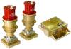

# мБОКЗ-2
> 2021.09.20 [🚀](../index/index.md) [despace](index.md) → **[ЗД](sensor.md)**

[TOC]

---

> <small>**мБОКЗ‑2** — RU term w/o analogues in English. **mBOKZ‑2** — literal EN translation.</small>

**мБОКЗ‑2** — звёздный датчик, предназначенный для определения ориентации [КА](sc.md) относительно звёздного неба.  
Разработчик [ИКИ РАН](zz_iki_ras.md), RU. Разработано в 2016 году, покупное изделие.

|*Characteristics*|*[Value](si.md)  (мБОКЗ-2)*|*[Value](si.md)  (мБОКЗ-2Р)*|
|:--|:--|:--|
|Composition|1 блок электроники (БЭ), 2 блока оптических (БО)|1 блок электроники, резервированный (БЭ), 2 блока оптических (БО)|
|Consumption, W|5|11|
|Dimensions, ㎜|БО 184 × 170 × 66; БЭ 200 × 135.5 × 126| |
|[Interfaces](interface.md)|[МКО](mil_std_1553.md) (МПИ) по ГОСТ Р 52070|[МКО](mil_std_1553.md) (МПИ) по ГОСТ Р 52070|
|[Lifetime](lifetime.md)/Resource, h(y)|46 000 (5.25) / 46 000 (5.25) / …| |
|Mass, ㎏|1.5 *(1 БЭ, 2 БО)*|3.6 *(1.4 БЭ, 2×1.1 БО)*|
|[Overload](vibration.md), Grms| | |
|[Rad.resist](ion_rad.md), ㏉ (㎭)| | |
|[Reliability](qm.md) per [lifetime](lifetime.md)|0.96 (5 лет), 0.98 (3 года), 0.991 (1 год)| |
|[Thermal range](tcs.md), ℃| | |
|[TRL](trl.md)|9|9|
|[Voltage](voltage.md), V|27 ± 5|27|
|**【Specific】**|• • •|• • •|
|Accept. ang. speed, °/s|0.8 при начальной ориентации, 5 в режиме слежения|3|
|Accuracy|3″ — по направлению оптической оси;  20″ — вокруг направления оптической оси|0.8″ — по направлению оптической оси;  6″ — вокруг направления оптической оси|
|Back. brightn., ㏅/m²|… для света с солнечным спектром| |
|Delay, s, ≤|0.25 (от середины интервала экспонирования до момента начала считывания БКУ)| |
|[FOV](fov.md), °|20 × 20|… (30 — засветка бленды) |
|Identification time, s|3| |
|Lens|матрица КМОП 2048 × 2048; размер пикселя 5.5 мкм; f / D: 32 / 1.7|матрица КМОП 2048 × 2048; f / D: 32 / 1.5|
|Output data| | |
|Ready mode| | |
|Refresh rate, ㎐|4|4|
| || |

**Notes:**

   1. …
   1. **Applicability:**
      - КА Аист‑2Д (старт 2016.04.28, ДЗЗ, полярная ОИСЗ 500 км)

 

## Docs & links (TRANSLATEME ALREADY)
|Navigation|
|:--|
|**[FAQ](faq.md)**【**[SCS](scs.md)**·КК, **[SC (OE+SGM)](sc.md)**·КА】**[CON](contact.md)·[Pers](person.md)**·Контакт, **[Ctrl](control.md)**·Упр., **[Doc](doc.md)**·Док., **[EF](ef.md)**·ВВФ, **[Error](error.md)**·Ошибки, **[Event](event.md)**·События, **[FS](fs.md)**·ТЭО, **[HF&E](hfe.md)**·Эрго., **[KT](kt.md)**·КТ, **[Model](model.md)**·Модель, **[N&B](nnb.md)**·БНО, **[Patent](патент.md)**·Пат., **[Project](project.md)**·Проект, **[QM](qm.md)**·БКНР, **[R&D](rnd.md)**·НИОКР, **[SI](si.md)**·СИ, **[Test](test.md)**·ЭО, **[TRL](trl.md)**·УГТ, **[Way](way.md)**·Пути|
|*Sections & pages*|
|**`Звёздный датчик (ЗД):`**  [Видимая звёздная величина](app_mag.md)・ [ПЗр](fov.md) • • •  **Европа:** [ASTRO 15](astro_15.md) (6.15)・ [Hydra](hydra.md) (4.6)・ [ASTRO 10](astro_10.md) (3.8)・ [A-STR](a_str.md) (3.55)・ [AA-STR](aa_str.md) (2.6)・ [HE-5AS](he_5as.md) (2.2)・ [ASTRO APS](astro_aps.md) (2)・ [Horus](horus.md) (1.6)・ [T2](t2.md) (0.8)・ [T1](t1.md) (0.6 ‑ 1)・ [Auriga](auriga.md) (0.21)  ▮  **РФ:** [348К](348k.md) (3.45)・ [360К](360k.md) ()・ [АД-1](ad_1.md) (3.8)・ [БОКЗ-МФ](bokz_mf.md) (2.8)・ [мБОКЗ-2](мбокз_2.md) (1.5)・ [SX-SR-MicroBOKZ](sx_sr_microbokz.md) (0.5)  ▮  **США:** [HAST](hast.md) (7.7)・ [CT-2020](ct_2020.md) (3)・ [µSTAR](mustar.md) (2.1)・ [MIST](mist.md) (0.55) |

   1. Docs:
      - [Отчёт о НИР «ВЕКТОР» ❐](f/sensor/m/2016_nir_vektor.pdf) (Москва, 2016)
   1. Notable interwikies — …
   1. <http://ofo.ikiweb.ru/razrabotki/mbokz-2.html>
   1. <https://ru.wikipedia.org/wiki/Аист‑2Д>

