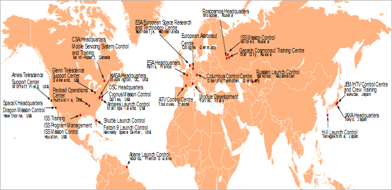

# Mission control center
> 2019.05.12 [🚀](../index/index.md) [despace](index.md) → [Control](control.md), [MCC](mcc.md), [SCS](scs.md)

[TOC]

---

> <small>**Mission control center (MCC), Launch control center (LCC)** — EN term. **Центр управления полётами (ЦУП)** — RU analogue.</small>

A **mission control center** (**MCC**, sometimes called a **flight control center** or **operations center**) — a part of a [SCS](scs.md) — is a facility that manages space flights, usually from the point of launch until landing or the end of the mission. It is part of the ground segment of spacecraft operations. A staff of flight controllers & other support personnel monitor all aspects of the mission using telemetry, & send commands to the vehicle using ground stations. Personnel supporting the mission from an MCC can include representatives of the attitude control system, power, propulsion, thermal, attitude dynamics, orbital operations & other subsystem disciplines. The training for these missions usually falls under the responsibility of the flight controllers, typically including extensive rehearsals in the MCC.

## (RU) ЦУП

**Центр управле́ния полётами (ЦУП)** — сооружения с техническими системами и технологическими средствами командно‑программного, телеметрического и [баллистико‑навигационного обеспечения](nnb.md), вешних информационных обменов, магистральных и специальных связей, отображения, предназначенными для обеспечения деятельности обслуживающего персонала по формированию, передаче, приёму, обработке, хранению, документированию информации при непрерывном процессе управления полётами [космических аппаратов](sc.md) в период проведения [лётных испытаний](rnd_e.md) и эксплуатации [космических систем](scs.md).

Согласно типовой [схеме деления](draft_model.md) ЦУП входит в состав [НКУ](scs.md). Часто в состав ЦУП входят также [баллистические центры](scs.md).

В мире существует несколько агентств, среди которых крупнейшими являются следующие:

   - [Европейское космическое агентство](zz_esa.md) (ЕКА)
      1. Европейский центр управления космическими объектами — Дармштадт, Германия
      1. ATV Control Centre — Тулуза, Франция
      1. Columbus Control Center — Оберпфаффенхофен, Германия
   - [Китайское национальное космическое управление](zz_cnsa.md) (CNSA)
      1. Пекинский центр управления космическими полётами
   - [Роскосмос](zz_roskosmos.md)
      1. Центр управления полётами [ЦНИИмаш](zz_tsniimash.md) — Королёв, Московская область
      1. Главный испытательный центр испытаний и управления космическими средствами имени Г.С. Титова — Краснознаменск, Московская область
      1. Центр управления спутниками народно‑хозяйственного назначения (ЦУП-НХ) — ОАО «Информационные спутниковые системы» имени академика М.Ф. Решетнёва, Железногорск, Красноярский край
      1. ЦУП‑Л — [LAV](zz_lav.md), Химки, Московская область
      1. ЦУП Бонум (ЦКС Сколково) — ФГУП «Космическая связь», Сколково, Московская область
   - [NASA](zz_nasa.md) (НАСА)
      1. Центр управления полётами (НАСА) — Хьюстон, Техас
      1. [JPL](zz_jpl.md) — Пасадина, Калифорния
   - Япония
      1. NEC Satellite Operation Center ([NEC](zz_nec.md)).

 

## Docs & links
|Navigation|
|:--|
|**[FAQ](faq.md)**, **[Cable](cable.md)**·БКС, **[Camera](cam.md)**·Камера, **[Comms](comms.md)**·Радио, **[CON](contact.md)·[Pers](person.md)**·Контакт, **[Control](control.md)**·Упр., **[Doc](doc.md)**·Док., **[Doppler](doppler.md)**·ИСР, **[DS](ds.md)**·ЗУ, **[EB](eb.md)**·ХИТ, **[ECO](ecology.md)**·Экол., **[EF](ef.md)**·ВВФ, **[ElC](elc.md)**·ЭКБ, **[EMC](emc.md)**·ЭМС, **[Error](error.md)**·Ошибки, **[Event](event.md)**·События, **[FS](fs.md)**·ТЭО, **[Fuel](fuel.md)**·Топливо, **[GNC](gnc.md)**·БКУ, **[GS](scs.md)**·НС, **[HF&E](hfe.md)**·Эрго., **[IU](iu.md)**·Гиро., **[KT](kt.md)**·КТЕХ, **[LAG](lag.md)**·ПУC, **[LES](les.md)**·САСП, **[LS](ls.md)**·СЖО, **[LV](lv.md)**·РН, **[MCC](mcc.md)**·ЦУП, **[Model](model.md)**·Модель, **[MSC](sc.md)**·ПКА, **[N&B](nnb.md)**·БНО, **[NR](nr.md)**·ЯР, **[OBC](obc.md)**·ЦВМ, **[OE](oe.md)**·БА, **[Pat.](патент.md)**·Патент, **[Proj.](project.md)**·Проект, **[PS](ps.md)**·ДУ, **[QM](qm.md)**·БКНР, **[R&D](rnd.md)**·НИОКР, **[Robot](robotics.md)**·Робот, **[Rover](rover.md)**·Ровер, **[RTG](rtg.md)**·РИТЭГ, **[SARC](sarc.md)**·ПСК, **[SE](se.md)**·СЭ, **[Sens.](sensor.md)**·Датч., **[SC](sc.md)**·КА, **[SCS](scs.md)**·КК, **[SGM](sgm.md)**·КММ, **[SI](si.md)**·СИ, **[Soft](soft.md)**·ПО, **[SP](sp.md)**·БС, **[Spaceport](spaceport.md)**·Космодр., **[SPS](sps.md)**·СЭС, **[SSS](sss.md)**·ГЗУ, **[TCS](tcs.md)**·СОТР, **[Test](test.md)**·ЭО, **[Timeline](timeline.md)**·ЦГМ, **[TMS](tms.md)**·ТМС, **[TOR](tor.md)**·ТЗ, **[TRL](trl.md)**·УГТ|
|*Sections & pages*|
|**`Наземный комплекс управления (НКУ):`**  [БЦ](scs.md)・ [КИС](scs.md)・ [КСИСО](scs.md)・ [НИК](lm_sys.md)・ [НИП](scs.md)・ [НС](scs.md)・ [ПОЗ](fp.md)・ [СГК](cd_segm.md)・ [ССПД](mcntd.md)・ [ЦУП](mcc.md)|
|**··• [Control](Control.md) •··**  [Ad hoc](ad_hoc.md)・ [Business travel](business_travel.md)・ [Chief designers council](cocd.md)・ [CML](cml.md)・ [Competence](competence.md)・ [Confident](confident.md)・ [Consp.theory](consp_theory.md)・ [Control sys. (CS)](cs.md)・ [Coordinate system](coord_sys.md)・ [Curator](curator.md)・ [Designer’s supervision](des_spv.md)・ [E‑sig](esig.md)・ [Engineer](se.md)・ [Errand](errand.md)・ [Federal law](fed_law.md)・ [Federal TP](fed_tp.md)・ [Federal SP](fed_sp.md)・ [GNC](gnc.md)・ [Gravity assist](gravass.md)・ [Industrial archaeology](ind_arch.md)・ [Instruction](instruction.md)・ [Lean manuf.](lean_man.md)・ [Lifetime](lifetime.md)・ [Manager](manager.md)・ [MBSE](mbse.md)・ [Meeting](meeting.md)・ [MCC](mcc.md)・ [MIC](mic.md)・ [MML](mml.md)・ [MoU](mou.md)・ [Nav. & ballistics (NB)](nnb.md)・ [Nonprofit org.](nonprof_org.md)・ [NX](nx.md)・ [Oberth effect](oberth_eff.md)・ [Org.structure](orgstruct.md)・ [Outcomes commission](outccom.md)・ [Patent](patent_res.md)・ [Peter prin.](peter_principle.md)・ [Plan](plan.md)・ [PMBok](pmbok.md)・ [Quorum](quorum.md)・ [R&D management](mgmt.md)・ [R&D support](rnd_support.md)・ [Recursion](recurs.md)・ [Schulze_method](schulze_method.md)・ [Sci'N'Tech activities](st_act.md)・ [Sci'N'Tech council](satc.md)・ [Single-window system](sw_sys.md)・ [Situ.leadership](situ_leadership.md)・ [Skunk works](skunk_works.md)・ [State arm. plan](plan_sa.md)・ [Swamp](swamp.md)・ [Teamcenter](teamcenter.md)・ [Tennis racket theorem](tr_theorem.md)・ [TRIZ](triz.md)・ [TRL](trl.md)・ [V‑model](v_model.md)・ [Veto](veto.md)・ [Workflow](workflow.md)・ [Workgroup](wg.md)|
|**··• [Mission control center (MCC)](mcc.md) •··**  …|

   1. Docs:
      - [ГОСТ 53802](гост_53802.md), п. 41‑42
   1. Notable interwikies — …
   1. <https://en.wikipedia.org/wiki/Mission_control_center>
   1. <https://ru.wikipedia.org/wiki/Центр_управления_полётами_(организация)>
