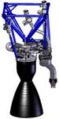
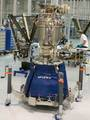
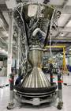
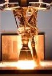

# Merlin
> 2019.05.12 ┊ **🚀 [despace](index.md)** → **[ДУ](ps.md)**

[TOC]

---

**Merlin** — семейство 2‑компонентных [двигателей](ps.md) производства [SpaceX](03_spacex.md).

<small>

Характеристики указаны для вакуума и номинальных условий работы в непрерывном режиме. Режим работы считать установившимся со 2‑й секунды подачи напряжения на электроклапаны.

|*Характеристика*|*[Значение](si.md) <small>(Merlin 1A)</small>*|*[Значение](si.md) <small>(Merlin 1B)</small>*|*[Значение](si.md) <small>(Merlin 1C)</small>*|*[Значение](si.md) <small>(Merlin 1C Vac)</small>*|
|:--|:--|:--|:--|:--|
|Габариты, длина × ∅ среза сопла, мм  |    |    |  2 920 × ┊  |    |
|Давление: вход в двигатель, МПа (кгс/cm²)  |    |    |    |    |
|Давление: камера сгорания, МПа (кгс/cm²)  |    |    |  6.77 (66.4)  |    |
|Давление: срез сопла, МПа (кгс/cm²)  |    |    |    |    |
|Длительность одного включения, с  |    |    |    |    |
|[ИПТ](ing.md), Н·с (кгс·с), не более  |    |    |    |    |
|Макс. расход, кг/с, не более  |    |  141.3189771  |  160.4278075  |  122.2056632  |
|Макс. частота включений, Гц  |    |    |    |    |
|Масса, кг, не более  |    |    |  630  |    |
|Массовое соотношение КРТ  |  2.17  |  2.17  |  2.17  |  2.17  |
|Мощность потребляемая, Вт  |    |    |    |    |
|Обороты ТНА  |—|
|Продукты горения  |    |    |    |    |
|[Топливо](fuel.md)  |  <small>[Кислород + Керосин](o_plus.md)</small>  | <small>[Кислород + Керосин](o_plus.md) | <small>[Кислород + Керосин](o_plus.md) | <small>[Кислород + Керосин](o_plus.md) |
|Раствор пучка, °  |  |
|Ресурс: количество включений, не менее  |    |    |    |    |
|Ресурс: сумм. длит. включений, c, не менее  |    |    |  1 620  |  330  |
|Ресурс: сумм. импульс, Н·с (кгс·с), не менее  |   |
|Ресурс: сумм. тяга, Н (кгс), не менее  |    |   |   |   |
|Ресурс: топливо, кг, не менее  |    |    |    |    |
|[САС](lifetime.md) в космосе, ч (лет)  |    |    |    |    |
|Температура: камера сгорания, тыс. К (°C)  |    |    |    |    |
|Температура: срез сопла, тыс. К (°C)  |    |    |    |    |
|Тяга: номинальная, Н (кгс)  |  340 000 (34 658)  |  420 000 (42 813)  |  480 000 (49 930)  |  410 000 (41 896)  |
|Тяга: отклонение, %  |    |    |  60 ‑ 100  |    |
|[УГТ](trl.md)|    |    |  9  |  9  |
|[УИ тяги](isp.md), Н·с/кг (с), не менее  |    |  2 972 (303)  |  2 992 (305)  |  3 355 (342)  |
|Число Маха / [Показатель адиабаты](heat_cr.md)  |    |    |    |    |
|Изображение  |   |    |   |   |

**Продолжение:**

|*Характеристика*|*[Значение](si.md)  (Merlin 1D)*|*[Значение](si.md)  (Merlin 1D Vac)*|
|:--|:--|:--|
|Габариты, длина × ∅ среза сопла, мм  |  … × 1 000  |    |
|Давление: вход в двигатель, МПа (кгс/cm²)  |    |    |
|Давление: камера сгорания, МПа (кгс/cm²)  |  9.7 (95.2)  |    |
|Давление: срез сопла, МПа (кгс/cm²)  |    |    |
|Длительность одного включения, с  |    |    |
|[ИПТ](ing.md), Н·с (кгс·с), не более  |    |    |
|Макс. частота включений, Гц  |    |    |
|Масса, кг, не более  |  470  |  470  |
|Массовое соотношение КРТ  |  2.34  |  2.36  |
|Мощность потребляемая, Вт  |    |    |
|Обороты ТНА  |  |  |
|Продукты горения  |    |    |
|[Топливо](fuel.md)  |  <small>[Кислород + Керосин](o_plus.md)</small>  | <small>[Кислород + Керосин](o_plus.md) |
|Раствор пучка, °  |  |  |
|Ресурс: количество включений, не менее  |    |    |
|Ресурс: сумм. длит. включений, c, не менее  |    |    |
|Ресурс: сумм. импульс, Н·с (кгс·с), не менее  |   |
|Ресурс: сумм. тяга, Н (кгс), не менее  |   |   |
|Ресурс: топливо, кг, не менее  |    |    |
|[САС](lifetime.md) в космосе, ч (лет)  |    |    |
|Температура: камера сгорания, тыс. К (°C)  |    |    |
|Температура: срез сопла, тыс. К (°C)  |    |    |
|Тяга: номинальная, Н (кгс)  |  914 000 (93 170)  |  934 000 (95 208)  |
|Тяга: отклонение, %  |  40 ‑ 100  |  39 ‑ 100  |
|[УГТ](trl.md)|  9  |  7  |
|[УИ тяги](isp.md), Н·с/кг (с), не менее  |  3 051 (311)  |  3 413 (348)  |
|Число Маха / [Показатель адиабаты](heat_cr.md)  |    |    |
|Изображение  |   |    |

</small>

 

## Примечания
   1. Имеют [ТНА](turbopump.md).
   1. Существует в 6 вариациях:
      - **Merlin 1A**. Было сделано 2 штуки.
      - **Merlin 1B**. Был развитием 1A, была сделана 1 штука, но так и не летала.
      - **Merlin 1C**.
      - **Merlin 1C Vac**.
      - **Merlin 1D**.
      - **Merlin 1D Vac**.
   1. **[1]** — см. <mark>TBD</mark>

|Сравнение [BE‑4](be_4.md), [Raptor](raptor.md), Merlin 1D  |
|:--|
|   |

## Применяемость
   - **Merlin 1A**. [Falcon 1](falcon.md) (2006 ‑ 2007)
   - **Merlin 1B**. [Falcon 1](falcon.md) (никогда)
   - **Merlin 1C**. [Falcon 1](falcon.md) (2008) ┊ [Falcon 9](falcon.md) (2010 ‑ 2013)
   - **Merlin 1C Vac**. [Falcon 9](falcon.md) (2010 ‑ 2013)
   - **Merlin 1D**. [Falcon 9 v.1.1](falcon.md) (2013 ‑ 2018) ┊ [Falcon Heavy](falcon.md) (2018 ‑ 2018)
   - **Merlin 1D Vac**. [Falcon 9 v.1.1](falcon.md) (2015 ‑ 2018) ┊ [Falcon Heavy](falcon.md) (2018 ‑ 2018)

 

## Docs & links (TRANSLATEME ALREADY)
|…°·•¹²³±×÷≤≥≈≠ ‑ −— ⎆✉ ❐“”’«»✔→✘☐☑├┕┆ 1 lb = 0.453592 kg; 1 g = 9.80665 m/s²|
|:--|
|<small>**[FAQ](faq.md)**, **[Cable](cable.md)**·БКС, **[Camera](camera.md)**·Камера, **[Comms](comms.md)**·Радиосв., **[Contact](contact.md)**·Контакт, **[Control](control.md)**·Управ., **[Doc](doc.md)**·Док., **[Doppler](doppler.md)**·ИСР, **[DS](ds.md)**·ЗУ, **[EB](eb.md)**·ХИТ, **[ECO](ecology.md)**·Экол., **[EF](ef.md)**·ВВФ, **[ElC](elc.md)**·ЭКБ, **[EMC](emc.md)**·ЭМС, **[Errors](error.md)**·Ошибки, **[Events](event.md)**·События, **[FS](fs.md)**·ТЭО, **[Fuel](fuel.md)**·Топливо, **[GNC](gnc.md)**·БКУ, **[GS](scs.md)**·НС, **[HF&E](hfe.md)**·Эргоном., **[IMU](imu.md)**·Гироскоп, **[Incubator](incubator.md)**·Инкуб., **[KT](kt.md)**·КТЕХ, **[LAG](lag.md)**·ПУC, **[LES](les.md)**·САСП, **[LS](ls.md)**·СЖО, **[LV](lv.md)**·РН, **[MAG](mag.md)**·Магнитом., **[MCC](mcc.md)**·ЦУП, **[Model](model.md)**·Модель, **[MSC](sc.md)**·ПКА, **[N&B](nnb.md)**·БНО, **[NR](nr.md)**·ЯР, **[OBC](obc.md)**·ЦВМ, **[OE](oe.md)**·БА, **[Patent](патент.md)**·Патент, **[Project](project.md)**·Проект, **[PS](ps.md)**·ДУ, **[QA](quality.md)**·QA, **[R&D](rnd.md)**·НИОКР, **[RAMS](rams.md)**·НиБ, **[Risk](risk.md)**·Риск, **[Robot](robotics.md)**·Робот, **[Rover](rover.md)**·Планетоход, **[RTG](rtg.md)**·РИТЭГ, **[RW](rw.md)**·ДМ, **[SARC](sarc.md)**·ПСК, **[Sensor](sensor.md)**·Датчик, **[SC](sc.md)**·КА, **[SCS](scs.md)**·КК, **[SGM](sgm.md)**·КММ, **[SI](si.md)**·СИ, **[Soft](soft.md)**·ПО, **[SP](sp.md)**·БС, **[Spaceport](spaceport.md)**·Космодром, **[SPS](sps.md)**·СЭС, **[SSS](sss.md)**·ГЗУ, **[TCS](tcs.md)**·СОТР, **[Test](test.md)**·ЭО, **[Timeline](timeline.md)**·Циклограмма, **[TMS](tms.md)**·ТМС, **[TOR](tor.md)**·ТЗ, **[TRL](trl.md)**·УГТ</small>|
|*Sections & pages*|
|**`Двигательная установка (ДУ):`**  [HTAE](htae.md) ┊ [TALOS](talos.md) ┊ [Баки топливные](fuel_tank.md) ┊ [Варп‑двигатель](warp_drive.md) ┊ [Газовый двигатель](cgt.md) ┊ [Гибридный двигатель](гбрд.md) ┊ [Двигатель Бассарда](bussard_ramjet.md) ┊ [ЖРД](lpr.md) ┊ [ИПТ](ing.md) ┊ [Ионный двигатель](иод.md) ┊ [Как считать топливо?](si.md) ┊ [КЗУ](cinu.md) ┊ [КХГ](cgs.md) ┊ [Номинал](nominal.md) ┊ [Мятый газ](exhsteam.md) ┊ [РДТТ](spr.md) ┊ [Сильфон](сильфон.md) ┊ [СОЗ](соз.md) ┊ [СОИС](соис.md) ┊ [Солнечный парус](солнечный_парус.md) ┊ [ТНА](turbopump.md) ┊ [Топливные мембраны](топливные_мембраны.md) ┊ [Топливные мешки](топливные_мешки.md) ┊ [Топливо](fuel.md) ┊ [Тяговооружённость](ttwr.md) ┊ [ТЯРД](тярд.md) ┊ [УИ](isp.md) ┊ [Фотонный двигатель](фотонный_двигатель.md) ┊ [ЭРД](epsp.md) ┊ [Эффект Оберта](oberth_eff.md) ┊ [ЯРД](ntr.md) |

**Docs:**

   1. …

**Links:**

   1. Notable interwikies — …
   1. <https://en.wikipedia.org/wiki/Merlin_(rocket_engine_family)>
   1. <https://ru.wikipedia.org/wiki/Мерлин_(ракетный_двигатель)>
   1. 2014.10.05 [Хабр: Превосходство Маска. О магии «Мерлина» замолвим слово ⎆](https://habr.com/ru/post/236761/) — [archive ❐](f/archive/20141005_1.pdf) of 2014.10.05)
   1. 2014.11.21 [Why is the Merlin 1D specific impulse so low? ⎆](https://www.reddit.com/r/spacex/comments/2my35n/why_is_the_merlin_1d_specific_impulse_so_low/) — [archive ❐](f/archive/20141121_1.pdf) of 2014.11.21)

