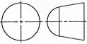
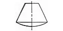
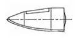
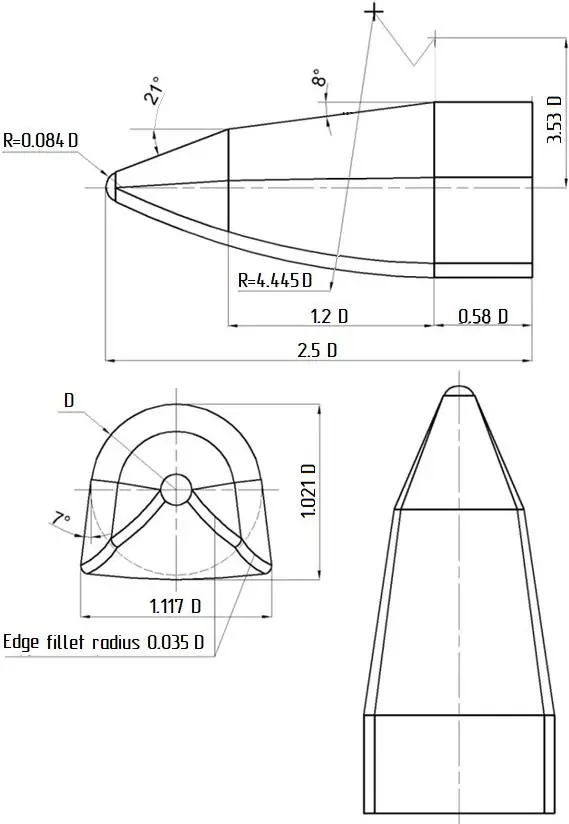

# Maneuverable Entry and Landing Vehicle (MEVC)
> 2020.05.07 [🚀](../index/index.md) [despace](index.md) → **** <mark>NOCAT</mark>

[TOC]

---

> <small>**Maneuverable Entry and Landing Vehicle (MEVC)** — EN term. **Маневренный Входной и Посадочный Аппарат (МЕВК)** — literal RU translation.</small>

This paper considers various types of a lander for the possibility of making maneuverable descent to the Venus surface, conducts a comparative analysis of these landers and determines their design characteristics, namely,  maneuverability and mass characteristics.

 

## Introduction

After a long break, there are several projects on resuming the exploration of Venus being considered. Scientists and technical specialists are mostly interested in the landing areas, where there are traces of tectonic processes occurred in the past. In this connection the task of creating landers, including consideration of using ones with the alternative configuration, capable of making maneuverable descent to the Venus surface, is becoming important.

## Description

Currently, there is a project «Venera-D» being developed to resume the fundamental Venus research. The structure of the lander is similar to the landers «Venera» and «Vega», which have a spherical form and belong to the ballistic type of a lander and do not provide the possibility of maneuvering during the descent in the Venus atmosphere.

The use of spherical (for example, the Venera) and conical (for example, Pioneer Venus 2) landers at the initial stages of the Venus exploration was related to the simplicity and reliability of their structure, as the primary task for the lander was to reach the surface with working equipment. To choose the needed landing area, a lander capable of making maneuvers is required, i.e., it must have a certain lift-to-drag ratio. 

However, ensuring a required lift-to-drag ratio means that the lander mass increases and its structure becomes more complex. A trade-off solution would be to use landers of the «lifting body» type. The complication of the structure of such landers is permissible, but they have a lift-to-drag ratio sufficient for solving the existing maneuvering tasks in the Venus atmosphere.

**Table 1** presents the comparative characteristics of various lander types.

|Comparative parameters and criteria estimates|Lander type I: Ballistic landers |Lander type II: «Gliding descent» |Lander type III: «Lifting body» |
|:--|:--|:--|:--|
|Lift-to-drag ratio for hypersonic velocity (M > 6)|0|0.15 … 0.5|0.8 … 1.5|
|Volume efficiency (fill factor)|1 … 0.85|0.95 … 0.75|0.75 … 0.6|
|Comparative mass characteristics (relative to a ballistic-class lander)|1|1.2|1.5|
|Lateral maneuver in the atmosphere, km|0|80 … 100|1 000 … 2 000|

The proposed lander types equipped with the instruments for Venus research must first be tested for the entry in the Earth atmosphere. During this testing, the control tasks during the entry stage are deal with, the thermal modes of operation are elaborated, and the landing regime is studied.

The «lifting body» type of lander has the highest ratio of lift-to-drag, has the greatest maneuverability, and increases of mass and structural complexity are permissible.

## Lander characteristics

The aerodynamic characteristics of the lander are calculated using a numerical method using Newton’s flow theory. The real mechanism of the interaction between the gas molecules and the solid body boundaries differs from Newton’s theory. However, the flow pattern for extremely large and hypersonic velocities is similar to the one proposed by Newton for the inelastic collision between the gas particles and the body.

The analysis considers the «lifting body» lander type shown below.

||
|:--|
|*Layout and general dimension of the «lifting body» type of a lander.*|

Based on the analysis of the volume and mass of the target equipment, the diameter is set to 1.1 m, the lander length for this diameter is 2.75 m. The center of mass of the lander is assumed to be the average value of the centers of mass of the volume and center of mass of the surface.

The aerodynamic characteristics of the lander determine the lander control action at the descent stage and also determine the parameters of the actuating mechanisms of the control system (engines, aerodynamic rudders, and trim panels).

The calculations indicate that the lander of the chosen configuration (without additional surfaces) is unstable for the lift-to-drag ratio. In this design, the lander is balanced by adding an aft shield with the opening angle 17°. The trimmed angle of attack can be chosen in the range of 16° … 24°. In this range, the aft shield ensures lander stability.

The estimated parameters of the lander:

<small>

|*Characteristic*|*Value*|
|:--|:--|
|Diameter|1.1 m|
|Length|2.75 m|
|Khyp − lift-to-drag ratio for hypersonic velocities|1.4|
|Coordinate of the center of mass Xc|1 803 ㎜|
|Coordinate of the center of mass Yc|− 61.6 ㎜|
|Coordinate of the center of pressure Xcop|1 916 ㎜|
|Coordinate of the center of pressure Ycop|330 ㎜|
|The opening angle of the aft shield γ|17°|
|The trimmed angle of attack α|18° (can be chosen in the range of 16° … 24°)|

</small>

The lander shape investigated can be easily balanced for the given   by simply adding the aft shield. Besides, rearrangement of the systems inside the lander can achieve even greater lift-to-drag ratio.

 

## Docs & links
|Navigation|
|:--|
|**[FAQ](faq.md)**【**[SCS](scs.md)**·КК, **[SC (OE+SGM)](sc.md)**·КА】**[CON](contact.md)·[Pers](person.md)**·Контакт, **[Ctrl](control.md)**·Упр., **[Doc](doc.md)**·Док., **[Drawing](drawing.md)**·Чертёж, **[EF](ef.md)**·ВВФ, **[Error](error.md)**·Ошибки, **[Event](event.md)**·События, **[FS](fs.md)**·ТЭО, **[HF&E](hfe.md)**·Эрго., **[KT](kt.md)**·КТ, **[N&B](nnb.md)**·БНО, **[Project](project.md)**·Проект, **[QM](qm.md)**·БКНР, **[R&D](rnd.md)**·НИОКР, **[SI](si.md)**·СИ, **[Test](test.md)**·ЭО, **[TRL](trl.md)**·УГТ, **[Way](way.md)**·Пути|
|*Sections & pages*|
|**【】**  <mark>NOCAT</mark>|

   1. Docs:
      - [Kosenkova A.V. Investigation of the Possibilities of Aerodynamic Forms of a Lander Capable of Maneuverable Descent in the Venus Atmosphere ❐](f/project/m/mevc/doc_20191115.pdf) (2019.11.15)
   1. <…>
