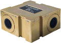

# MIST
> 2019.07.31 **[🚀](../index/index.md) [despace](index.md)** → **[ЗД](sensor.md)**

[TOC]

---

> <small>*Термины:* **MIST** — англоязычный термин, не имеющий аналога в русском языке. **МИСТ** — дословный перевод с английского на русский.</small>

**MIST** — звёздный датчик для определения и выдачи в [GNC](gnc.md) информации о положении и угловых скоростях системы координат (СК) изделия относительно геоцентрической СК.  
*Разработчик:* [Space Micro](space_micro.md). Разработано ранее 2017 года активное применение

<small>

|*•    Характеристика    •*|*[Значение](si.md) <small>(MIST)</small>*|
|:--|:--|
|[TRL](trl.md)|9|
|Время опознавания, с|1|
|Вых. информация||
|Допуст. угл. скор., °/с|5|
|Запаздывание, с, ≤||
|Исполнение|Моноблок (2 ОБ, 1 БЭ)|
|Объектив|High QE CMOS FPA|
|Поле зрения, °||
|Режим готовности||
|Точность|10″|
|Частота обновл., Гц|10|
|Яркость фона, кд/m²||
|**Etc:**|• • •|
|[ВБР](srrq.md) за САС|0.99|
|Dimensions, L×W×H, mm|100 × 100 × 50|
|Интерфейсы|RS-422, SpaceWire, CAN|
|Mass, kg|0.55|
|[Voltage](voltage.md), V||
|Overload, g||
|[Rad.resist](ion_rad.md), Gy (rad)|300 (30 000)|
|Resource, h (y)||
|[Lifetime](lifetime.md), h (y)|НОО: 17 520 (2),  ГСО: 87 600 (10)|
|[Temp. range](tcs.md), ℃||
|Consumption, W|4|
|||

</small>

 

## Примечания
   1. …

## Применяемость
   1. …

 

## Docs & links (TRANSLATEME ALREADY)
|…°·•¹²³±×÷≤≥≈≠ ‑ −— ⎆✉ ❐“”’«»✔→✘☐☑├┕┆ 1 lb = 0.453592 kg; 1 g = 9.80665 m/s²|
|:--|
|<small>**[FAQ](faq.md)**, **[Cable](cable.md)**·БКС, **[Camera](cam.md)**·Камера, **[Comms](comms.md)**·Радио, **[Contact](contact.md)**·Контакт, **[Control](control.md)**·Упр., **[Doc](doc.md)**·Док., **[Doppler](doppler.md)**·ИСР, **[DS](ds.md)**·ЗУ, **[EB](eb.md)**·ХИТ, **[ECO](ecology.md)**·Экол., **[EF](ef.md)**·ВВФ, **[ElC](elc.md)**·ЭКБ, **[EMC](emc.md)**·ЭМС, **[Error](error.md)**·Ошибки, **[Event](event.md)**·События, **[FS](fs.md)**·ТЭО, **[Fuel](fuel.md)**·Топливо, **[GNC](gnc.md)**·БКУ, **[GS](scs.md)**·НС, **[HF&E](hfe.md)**·Эрго., **[IU](iu.md)**·Гиро., **[KT](kt.md)**·КТЕХ, **[LAG](lag.md)**·ПУC, **[LES](les.md)**·САСП, **[LS](ls.md)**·СЖО, **[LV](lv.md)**·РН, **[MCC](mcc.md)**·ЦУП, **[Model](model.md)**·Модель, **[MSC](sc.md)**·ПКА, **[N&B](nnb.md)**·БНО, **[NR](nr.md)**·ЯР, **[OBC](obc.md)**·ЦВМ, **[OE](oe.md)**·БА, **[Pat.](патент.md)**·Патент, **[Project](project.md)**·Проект, **[PS](ps.md)**·ДУ, **[R&D](rnd.md)**·НИОКР, **[SRRQ](srrq.md)**·БКНР, **[Robot](robotics.md)**·Робот, **[Rover](rover.md)**·Планетоход, **[RTG](rtg.md)**·РИТЭГ, **[SARC](sarc.md)**·ПСК, **[Sensor](sensor.md)**·Датчик, **[SC](sc.md)**·КА, **[SCS](scs.md)**·КК, **[SGM](sgm.md)**·КММ, **[SI](si.md)**·СИ, **[Soft](soft.md)**·ПО, **[SP](sp.md)**·БС, **[Spaceport](spaceport.md)**·Космодром, **[SPS](sps.md)**·СЭС, **[SSS](sss.md)**·ГЗУ, **[TCS](tcs.md)**·СОТР, **[Test](test.md)**·ЭО, **[Timeline](timeline.md)**·ЦГМ, **[TMS](tms.md)**·ТМС, **[TOR](tor.md)**·ТЗ, **[TRL](trl.md)**·УГТ</small>|
|*Sections & pages*|
|**··•  •··**  <mark>NOCAT</mark>|

   1. Docs:
      - [MIST datasheet ❐](f/sensor/m/mist_datasheet.pdf)
   1. Notable interwikies — …
   1. <…>
