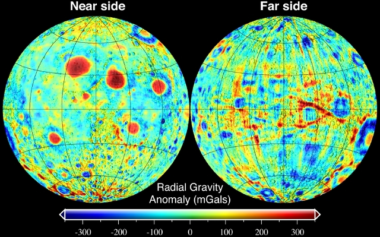

# Луна
> 2019.03.21 **[🚀](../index/index.md) [despace](index.md)** → [Space](index.md), **[Moon](moon.md)**

[TOC]

---

> <small>*Термины:* **Луна** — русскоязычный термин. **Moon** — англоязычный эквивалент.</small>

**Луна́** (астр. ☾ [ ❐](f/aob/moon/moon_symbol_svg.png), лат. *Luna*) — естественный спутник [Земли](earth.md). Самый близкий к [Солнцу](sun.md) спутник планеты, так как у ближайших к Солнцу планет, [Меркурия](mercury.md) и [Венеры](venus.md), спутников нет. Второй по яркости объект на земном небосводе после Солнца и пятый по величине естественный спутник планеты [Солнечной системы](солнечная_система.md). Среднее расстояние между центрами Земли и Луны — 384 467 км (~30 диаметров Земли).  
Имеет огромные запасы [гелия‑3](helium3.md).  
Символы Луны: ☽︎🌛︎ 🌕︎ 🌝︎ ☾ 🌜︎ 🌑︎ 🌚︎ 🌑🌒🌓🌔🌕🌖🌗🌘

|*Луна*|*Луна*|*Луна*|*Карта*|
|:--|:--|:--|:--|
|||||

## Характеристики
|*Characteristic*|*[Value](si.md)*|
|:--|:--|
|Flight from Earth|4.5 ‑ 5.5 суток на ЖРДУ|
|Signal from Earth|1.17 ‑ 1.36 секунды|
|Distance from Earth|356 ‑ 407 тыс. км|
|Breaking to the orbit||
|**Orbits:**|• • •|
|[Apocentre](apopericentre.md) (Апогей);  [Pericentre](apopericentre.md) (Перигей)|405 696 км (404 000 ‑ 406 700 км);  363 104 км (356 400 ‑ 370 400 км)|
|[Argument of periapsis](keplerian.md) (ω)|(возрастание) 1 оборот за 8.85 лет|
|[Semimajor axis](keplerian.md) (a)|384 399 км (0.00257 [а.е.](si.md))|
|Day/year|14 сут 18 ч / … земных|
|[Longit. of asc.node](keplerian.md) (Ω)|(убывание) 1 оборот за 18.6 лет|
|[Inclination](keplerian.md) (Ⅰ)|5.145° (относительно эклиптики)|
|Orbital velocity (Ⅴ)|1.023 km/s (средняя)|
|[Sider. rotat.period](astroperiod.md) (T, day)|27.321661 дня, синхронизирован  (всегда повёрнута к Земле одной стороной)|
|[Sidereal period](astroperiod.md) (year)|27.321582 дней (27 д 7 ч 43 мин 1 с)|
|[Synodic period](astroperiod.md)|29.530588 дней (29 д 12 ч 44 мин 0 с)|
|Satellites|нет|
|[Hill sphere](hill_sphere.md)|66 000|
|Satellite of|[Земля](earth.md)|
|[Eccentricity](keplerian.md) (e)|0.0549 (средний)|
|**Physics:**|• • •|
|[1st escape velocity](esc_vel.md) (v₁)|1.68 km/s <small>(0.212 земной)</small>|
|[2nd escape velocity](esc_vel.md) (v₂)|2.38 km/s <small>(0.212 земной)</small>|
|[Albedo](albedo.md)|0.12|
|[Apparent magnitude](app_mag.md) (m)|−2.5/−12.9 (−12.74 при полной Луне)|
|[Magnetic field](mag_field.md)|0.02785 А/м <small>(0.0007 земного)</small>|
|Mass (m)|7.3477·10²² кг <small>(0.0123 земной)</small>|
|Axial tilt|1.5424° (относительно плоскости эклиптики)|
|Volume (Ⅴ)|2.1958·10¹⁰ km³ <small>(0.020 земного)</small>|
|Mean density (ρ)|3.3464 г/cm³ (средняя, <small>0.607 земной</small>)|
|Surface area (S)|3.793·10⁷ km² <small>(0.074 земной, 2.2 РФ)</small>|
|Flattening|0.00125 <small>(0.372 земного)</small>|
|Radius|1 738.14 км (экватор., <small>0.273 земного</small>);  1 735.97 км (полярный, <small>0.273 земного</small>);  1 737.10 км (средний, <small>0.273 земного</small>)|
|[Surface gravity](g.md)|1.62 m/s² (экватор, <small>0.165 земного</small>)|
|Equatorial rotation velocity|16.657 км/ч <small>(0.0099 земной)</small>|
|**Temperature & atmosph.:**|• • •|
|[Атмосфера](atmosphere.md)|крайне разрежена,  имеются следы водорода, гелия, неона и аргона.|
|[Освещённость](illum.md)||
|Радиация||
|Температура|Мин. 100 К (−173 ℃);  Ср. 220 К (−53 ℃);  Макс. 390 К (+117 ℃);  на экваторе Мин. 33 К (−240 ℃);  на экваторе Ср. 130 К (−143 ℃);  на экваторе Макс. 230 К (−43 ℃)|

---

 

## Общее описание

  
*Радиосигнал от Земли до Луны.*

  
*Скорости торможения по годам.*

### Маскон
**Маскон** (от англ. *mass concentration* — «концентрация массы») — регион литосферы планеты или естественного спутника, вызывающий положительные гравитационные аномалии. Масконы были обнаружены и локализованы по возмущениям в движениях искусственных спутников Луны. Чаще всего масконы расположены под лунными морями, имеющими округлую форму.

### Лунный заяц

**Лунный заяц** — в фольклоре разных народов мира заяц или кролик, обитающий на Луне. Это представление возникло в силу парейдолической зрительной иллюзии — тёмные пятна на поверхности Луны воспринимались в виде фигуры зайца или кролика.

Наверное, наиболее ранним упоминанием о Лунном зайце является поэтический сборник «Чуские строфы», написанный в древнем Китае во времена династии Западная Хань: там говорится, что в Лунном дворце живёт белый лунный заяц, который, сидя в тени коричного дерева гуйхуа, круглый год толчёт в ступе снадобье бессмертия. Другие поэты того времени часто называли лунного зайца «нефритовым зайцем» или «золотым зайцем», и эти фразы стали часто использоваться для обозначения Луны.

Чуть позднее в Китае появился миф о Чанъэ, жене стрелка Хоу И, которая украла снадобье бессмертия, улетела на Луну и превратилась там в жабу. В более поздних версиях предания о Чанъэ и лунном зайце постепенно слились воедино, и стали говорить, что Чанъэ стала богиней Луны и живёт в Лунном дворце вместе с лунным зайцем.

В индийском фольклоре говорилось, что зайца на Луну поместил бог Индра: заяц, принимая божественного гостя в образе нищего, не нашёл для него никакой еды и зажарил себя сам. Восхищённый таким поступком Индра воскресил зайца и поместил его на Луну, сделав таким образом бессмертным.

В доколумбовой Месоамерике тоже бытовало представление о лунном зайце. Так, ацтекский миф о начале пятой, современной эпохи мира представляет появление светил таким образом: боги Нанауацин и Теккистекатль сожгли себя на жертвенном костре, став соответственно Солнцем и Луной. Луна‑Теккистекатль был почти таким же ярким, как Солнце‑Нанауацин, поэтому один из богов схватил с земли зайца и швырнул его в Теккистекатля, что умерило свет луны.

Первый китайский луноход, успешно прилунившийся 15.12.2013, назван «Юйту» — «Нефритовый заяц».

## Особенности проектирования
**Литература:**

   1. …

**Орбитальный КА:**

   1. Не забывайте про масконы.

**Посадочный КА:**

   1. Не забывайте про масконы.

## Освоение Луны

### Зачем исследовать
<mark>TBD</mark>

 

### Краткая хронология
<https://nssdc.gsfc.nasa.gov/planetary/chronology.html>

<mark>TBD</mark>

 

### Проекты
См. также раздел «[Проекты](project.md)».

**Гипотетические и исторические:**

   - [MEAEM](hptc_meaem.md)
   - [Лунагрузик](hptc_lunagruzik.md)
   - [ОЧБПЛИЕГ](hptc_ochbplieg.md)

**[Луноходы](rover.md):**

   - [Chandrayaan-2-rover](chandrayaan_2_rover.md) <mark>TBD</mark>
   - [LRV](lrv.md) <mark>TBD</mark>
   - [Yutu](yutu.md) <mark>TBD</mark>
   - [Yutu-2](yutu_2.md) <mark>TBD</mark>
   - [Луноход‑1](луноход_1.md) <mark>TBD</mark>
   - [Луноход‑2](луноход_2.md) <mark>TBD</mark>
   - [Робот‑геолог](робот_геолог.md) <mark>TBD</mark>

**Список прилунений:**

**Table.** Missions/spacecraft of past and future. <small>(**Ⓛ** — LAV)  (**C** — contact rsrch; **D** — distant rsrch; **F** — fly‑by; **H** — manned; **S** — soil sampe return; **X** — technology demonstr.)</small>

<small>

|*✔*|*Mission/SC (index)*|*Date (UTC)*|*D*|*C*|*F*|*H*|*S*|*X*|*Notes*|
|:--|:--|:--|:--|:--|:--|:--|:--|:--|:--|
|—|**Proposed:**|—|—|—|—|—|—|—|—|
|CN|[Chang'e-5](chang_e_5.md)||||||||<mark>TBD</mark>|
|CN|[Chang'e-4](chang_e_4.md)|||C|||||<mark>TBD</mark>|
|RU|[Луна‑29](луна_29.md) Ⓛ|||C|||S||<mark>TBD</mark>|
|—|**Developing:**|—|—|—|—|—|—|—|—|
|RU|[Луна‑28](луна‑28.md) (ЛГР) Ⓛ|2025||C|||||<mark>TBD</mark>|
|RU|[Луна‑27](луна_27.md) (ЛР1) Ⓛ|2025||C|||||<mark>TBD</mark>|
|RU|[Луна‑26](луна_26.md) (ЛРОА) Ⓛ|2021|D||||||<mark>TBD</mark>|
|RU|[Луна‑25](луна_25.md) (ЛГ) Ⓛ|2021||C|||||<mark>TBD</mark>|
|—|**Active:**|—|—|—|—|—|—|—|—|
|…|…|…|||||||<mark>TBD</mark>|
|`—`|**`Разработанные:`**|—|—|—|—|—|—|—|—|
|IL|[Beresheet](beresheet.md)|2019.02.22||C||||X|<mark>TBD</mark>|
|JP|[SELENE-2](selene_2.md)|2018|D|C|||||<mark>TBD</mark>|
|EU|[Lunar Lander](lunar_lander.md)|2018||C|||||<mark>TBD</mark>|
|IN|[Chandrayaan-2](chandrayaan_2.md)|2018|D|C|||||<mark>TBD</mark>|
|CN|[Chang'e-3](chang_e_3.md)|2013.12.01||C|||||<mark>TBD</mark>|
|US|[LADEE](ladee.md)|2013.09.07|D|||||X|<mark>TBD</mark>|
|US|[GRAIL](grail.md)|2011.09.10|D||||||<mark>TBD</mark>|
|CN|[Chang'e-2](chang_e_2.md)|2010.10.01|D||||||<mark>TBD</mark>|
|US|[LRO](lunar_reconnaissance_orbiter.md)|2009.06.19|D||||||<mark>TBD</mark>|
|US|[LCROSS](lcross.md)|2009.06.19|D||||||<mark>TBD</mark>|
|IN|[Chandrayaan-1](chandrayaan_1.md)|2008.10.22|D|C||||X|<mark>TBD</mark>|
|CN|[Chang'E-1](chang_e_1.md)|2007.10.24|D|C|||||<mark>TBD</mark>|
|JP|[SELENE](selene.md)|2007.09.14|D||||||<mark>TBD</mark>|
|US|[THEMIS](themis.md)|2007.02.17|D||||||<mark>TBD</mark>|
|EU|[SMART-1](smart_1.md)|2003.09.27|D|||||X|<mark>TBD</mark>|
|US|[Clementine](clementine.md)|1998.01.07|D||||||<mark>TBD</mark>|
|US|[Lunar Prospector](lunar_prospector.md)|1994.01.25|D||||||<mark>TBD</mark>|
|JP|[Hiten](hiten.md)|1990.01.24|D|C|||||<mark>TBD</mark>|
|SU|[Луна‑24](луна_24.md) Ⓛ|1976.08.09||C|||||<mark>TBD</mark>|
|SU|[Луна‑23](луна_23.md) Ⓛ|1974.10.28||C|||S||<mark>TBD</mark>|
|SU|[Луна‑22](луна_22.md) Ⓛ|1974.04.29|D||||||<mark>TBD</mark>|
|SU|[Луна‑21](луна_21.md) Ⓛ|1973.01.08||C|||||<mark>TBD</mark>|
|SU|[Луна‑20](луна_20.md) Ⓛ|1972.02.14|D|C|||S||<mark>TBD</mark>|
|US|[Apollo 17](apollo_17.md)|1972.12.07||||H|||<mark>TBD</mark>|
|US|[Apollo 16](apollo_16.md)|1972.04.16||||H|||<mark>TBD</mark>|
|SU|[Луна‑19](луна_19.md) Ⓛ|1971.09.28|D||||||<mark>TBD</mark>|
|SU|[Луна‑18](луна_18.md) Ⓛ|1971.09.02||C|||||<mark>TBD</mark>|
|US|[Apollo 15](apollo_15.md)|1971.07.26||||H|||<mark>TBD</mark>|
|US|[Apollo 14](apollo_14.md)|1971.01.31||||H|||<mark>TBD</mark>|
|SU|[Луна‑17](луна_17.md) Ⓛ|1970.11.10||C|||||<mark>TBD</mark>|
|SU|[Луна‑16](луна_16.md) Ⓛ|1970.09.12||C|||S||<mark>TBD</mark>|
|US|[Apollo 13](apollo_13.md)|1970.04.11||||H|||<mark>TBD</mark>|
|US|[Apollo 12](apollo_12.md)|1969.11.14||||H|||<mark>TBD</mark>|
|US|[Apollo 11](apollo_11.md)|1969.07.16||||H|||<mark>TBD</mark>|
|SU|[Луна‑15](луна_15.md) Ⓛ|1969.07.13||C|||S||<mark>TBD</mark>|
|US|[Apollo 10](apollo_10.md)|1969.05.18||||H|||<mark>TBD</mark>|
|US|[Apollo 9](apollo_9.md)|1969.03.03|D||||||<mark>TBD</mark>|
|US|[Apollo 8](apollo_8.md)|1968.12.21|D||||||<mark>TBD</mark>|
|SU|[Луна‑14](луна_14.md) Ⓛ|1968.04.07|D||||||<mark>TBD</mark>|
|US|[Surveyor 7](surveyor_7.md)|1968.01.07||C|||||<mark>TBD</mark>|
|US|[Explorer 35](explorer_35.md)|1967.07.19|D||||||<mark>TBD</mark>|
|SU|[Луна‑13](луна_13.md) Ⓛ|1966.12.21||C|||||<mark>TBD</mark>|
|SU|[Луна‑12](луна_12.md) Ⓛ|1966.10.22|D||||||<mark>TBD</mark>|
|SU|[Луна‑11](луна_11.md) Ⓛ|1966.08.27|D||||||<mark>TBD</mark>|
|SU|[Луна‑10](луна_10.md) Ⓛ|1966.03.31|D||||||<mark>TBD</mark>|
|SU|[Луна‑9](луна_9.md) Ⓛ|1966.01.31||C|||||<mark>TBD</mark>|
|SU|[Луна‑8](луна_8.md) Ⓛ|1965.12.03||C|||||<mark>TBD</mark>|
|SU|[Луна‑7](луна_7.md) Ⓛ|1965.10.04||C|||||<mark>TBD</mark>|
|SU|[Луна‑6](луна_6.md) Ⓛ|1965.06.08||C|||||<mark>TBD</mark>|
|SU|[Луна‑5](луна_5.md) Ⓛ|1965.05.09||C|||||<mark>TBD</mark>|
|SU|[Луна‑4](луна_4.md) Ⓛ|1963.04.02||C|||||<mark>TBD</mark>|
|SU|[Луна‑3](луна_3.md) Ⓛ|1959.10.04|D||||||<mark>TBD</mark>|
|SU|[Луна‑2](луна_2.md) Ⓛ|1959.09.12||C|||||<mark>TBD</mark>|
|SU|[Луна‑1](луна_1.md) Ⓛ|1959.01.02|D|C|||||<mark>TBD</mark>|

</small>

 

## Science & tech targets
Just a preliminary list of the targets and explorations for the Venus. Based on the investigations of VEXAG (<https://www.lpi.usra.edu/vexag/>), Venera-D mission work-group (LAV, IKI RAS, NASA, etc.) and anyone who can.

The main idea is to prepare a brief (sic!) systematized list of the Venusian targets and explorations of the retired/active/proposed spacecraft suitable both for scientists, and engineers, and managers, and passers by. The one which is able in the same time to tell about what was done and in what volume, what is processing now and why it’s cool, what is proposed and why it’s so important. Something like a bridge between scientists and other humanity just to show that all of these complex scientific terms can be described with some statistic terms without need to read a lot of literature or trust their words.

Soon there will be something new, for example, links between targets/explorations, spacecraft, and a couple of brief description of the current state of each one.

### Intro
Comments:

   - **T** — technical; **Draft** — minimum for working with object. **C** — contact exploration; **D** — distant exploration; **F** — fly‑by; **H** — manned; **S** — soil sample return; **X** — technology demonstration
   - **Sections of measurement and observation:**
      - Atmospheric/climate — **Ac** composition, **Ai** imaging, **Am** mapping, **Ap** pressure, **As** samples, **At** temperature, **Aw** wind speed/direction.
      - General — **Gi** planet’s interactions with outer space.
      - Soil/surface — **Sc** composition, **Si** imaging, **Sm** mapping, **Ss** samples.

In brief — 97 targets in total (33 technical, 64 scientific) consisting of: <mark>TBD</mark> never occured (<mark>TBD</mark> technical, <mark>TBD</mark> scientific), <mark>TBD</mark> was tried (<mark>TBD</mark> technical, <mark>TBD</mark> scientific), <mark>TBD</mark> mostly done (<mark>TBD</mark> technical, <mark>TBD</mark> scientific).

<small>

|*Number*|*T*|*EN*|*Section of m&o*|*C*|*D*|*F*|*H*|*S*|
|:--|:--|:--|:--|:--|:--|:--|:--|:--|
|•|•|**Never occurred:**|•|•|•|•|•|•|
|EMN‑…|||||||||
|•|•|**Was tried:**|•|•|•|•|•|•|
|EMN‑…|||||||||
|•|•|**Mostly done:**|•|•|•|•|•|•|
|EMN‑…|||||||||

</small>

<mark>TBD</mark> 

|•|•|**Never occurred:**|•|•|•|•|•|•|
|EMN‑080||Albedo: changes in time|Gi||D|F|||
|EMN‑036||Atmosphere: cause & influence of geological & chemical activity on the climate & clouds|||D||||
|EMN‑037||Atmosphere: cause of the retrograde moving|||D||||
|EMN‑032||Atmosphere: characteristics of the CO₂ & N₂ in state of the lower layers supercritical fluid|Ac, Ai, Am, At||D||||
|EMN‑007||Atmosphere: connection between the topography & the atmo circulation|||D||||
|EMN‑033||Atmosphere: nature/rate of its escape|||D||||
|EMN‑038||Atmosphere: processes of the atmospheric parts dissipation|||D||||
|EMN‑082|T|Atmosphere: prolonged investigations on the H = 0 ‑ 10 km|All A||||||
|EMN‑083|T|Atmosphere: prolonged investigations on the H = 10 ‑ 30 km|All A||||||
|EMN‑054|T|Atmosphere: sample return|As|C|||||
|EMN‑015||Atmosphere: structure of the mesosphere|All A||D||||
|EMN‑030||Atmosphere: was it lost during some cataclysm or event|||D||||
|EMN‑095||Climate: history & causes of changes|||D||||
|EMN‑087||Crustal support mechanisms|||D||||
|EMN‑051||Dimensions & characteristics of the mantle & the core|||D||||
|EMN‑057|T|Exploration with [satellites](sc.md): microsatellites|||D|F|||
|EMN‑071|T|Exploration with [satellites](sc.md): nanosatellites|||D|F|||
|EMN‑058|T|Exploration: directed seismoexperiment|||D|F|||
|EMN‑056|T|Exploration: from L1/L2|Ai, Am, At, Gi||D||||
|EMN‑059|T|Exploration: with [rover](rover.md)|All A/S|C|||||
|EMN‑081|T|Extreme environment electronics||C|D|F|||
|EMN‑094|T|High temperature electronics||C|D|F|||
|EMN‑066|T|Human: on the surface||C|||H||
|EMN‑065|T|Human: on the orbit|||D||H||
|EMN‑060|T|Human: manned fly‑by|||D|F|H||
|EMN‑043||Mechanisms of the mantle’s convection|||D|F|||
|EMN‑048||Nature & sources of the greenhouse effect|||D|F|||
|EMN‑049||Nature & characteristics of the thermal tides|||D||||
|EMN‑069|T|Prolonged surface‑spacecraft functioning||C|||||
|EMN‑064|T|Planetary terraforming||C|||H||
|EMN‑045||Surface: nature of the tessera|||D||||
|EMN‑061|T|Surface: sample return||C||||S|
|EMN‑088|T|Surface: subsurface investigations||C|||||
|EMN‑086|T|Surface: tessera investigations, in‑situ||C|||||
|EMN‑047||Surface: structure‑composition connection of different regions & planet’s evolution||C|||||
|EMN‑039||Was the planet inhabited & for how long||C|D||||
|EMN‑040||Were there oceans & why have they gone||C|D|F|||
|•|•|**Was tried:**|•|•|•|•|•|•|
|EMN‑093|T|Atmosphere/surface imaging|||D|F|||
|EMN‑077||Atmosphere: chemical elements distribution|||D|F|||
|EMN‑018||Atmosphere: clouds, their chemistry|||D|F|||
|EMN‑075||Atmosphere: clouds, their nature|||D|F|||
|EMN‑016||Atmosphere: clouds, their structure|||D|F|||
|EMN‑011||Atmosphere: common circulation model|||D||||
|EMN‑014||Atmosphere: composition|||D||F||
|EMN‑019||Atmosphere: energetic balance|||D||||
|EMN‑008||Atmosphere: flashing on the night side|||D||||
|EMN‑013||Atmosphere: illumination of the surface & the atmo layers|||D||||
|EMN‑096||Atmosphere: ionosphere|||D|F|||
|EMN‑012||Atmosphere: lightnings|||D||||
|EMN‑031||Atmosphere: long‑term variations of the surface meteo characteristics|||D||||
|EMN‑067||Atmosphere: nature of the polar dipole & turbulence|||D||||
|EMN‑034||Atmosphere: nature of the superrotation|||D||||
|EMN‑035||Atmosphere: nature of the UV‑absorber|||D||||
|EMN‑084|T|Atmosphere: prolonged investigations on the H = 30 ‑ 60 km|||D||||
|EMN‑078|T|Atmosphere: radiography|||D||||
|EMN‑055|T|Atmosphere: sample obtaining & analysis||C|||||
|EMN‑009||Atmosphere: SO₂ concentration & nature of its variations|||D||||
|EMN‑017||Atmosphere: common structure|||D||||
|EMN‑097||Atmosphere: effect of solar Rad & interplanetary space on the atmo|||D|F|||
|EMN‑010||Atmosphere: vertical model|||D||||
|EMN‑050||Causes of the water loss|||D||||
|EMN‑041||Common connection between the atmosphere & the surface|||D||||
|EMN‑073|T|Exploration with [satellites](sc.md): large satellites|||D|F|||
|EMN‑072|T|Exploration with [satellites](sc.md): medium satellites|||D|F|||
|EMN‑070|T|Exploration with [satellites](sc.md): minisatellites|||D|F|||
|EMN‑042||History & causes of the planet’s volcanic & tectonic evolution|||D||||
|EMN‑020||Inner structure of the planet|||D||||
|EMN‑029||Is Venus geologically active?||C|D|F|||
|EMN‑028||Magnetosphere structure|||D|F|||
|EMN‑089||Measuring the planetary gravitational field|||D|F|||
|EMN‑074||Meteorological model|||D|F|||
|EMN‑079||Precise duration of the Venusian day|||D||||
|EMN‑052||Role of water (fluids) in planetary geology||C|D|F|||
|EMN‑092|T|Serve as a relay to Earth for stand‑alone SC/instruments|||D||||
|EMN‑046||Surface: causes of the changes during the last billion years||C|D|F|||
|EMN‑024||Surface: common composition||C|||||
|EMN‑026||Surface: elemental composition||C|||||
|EMN‑021||Surface: map, 3D||C|D||||
|EMN‑022||Surface: map, precise|||D||||
|EMN‑023||Surface: mineralogical composition||C|||||
|EMN‑044||Surface: nature & causes of forming of the current rocks & soils||C|||||
|EMN‑062|T|Surface: samples obtaining & analysis, incl. in different places||C||||S|
|EMN‑063|T|Surface: panoramic imaging||C|||||
|EMN‑025||Surface: morphology||C|||||
|EMN‑085|T|Surface: tessera investigations, remote|||D|F|||
|EMN‑076||Surface: volcanoes, their presence|||D|F|||
|EMN‑027||The causes why Venus evolved in a planet so different from Earth||C|D|F|||
|EMN‑091||The loss rate of water from Venus|||D|F|||
|EMN‑053||Traces of life in the atmosphere & on the surface||C|||||
|•|•|**Mostly done:**|•|•|•|•|•|•|
|EMN‑001||Atmosphere: preliminary model||C|D|F|||
|EMN‑004|T|Exploration: from Earth|||D||||
|EMN‑003|T|Exploration: from inside of atmosphere||C|D||||
|EMN‑006|T|Exploration: from surface||C|||||
|EMN‑005|T|Exploration: from Venusian orbit|||D|F|||
|EMN‑090||Spin axis|||D||||
|EMN‑002||Surface: preliminary map||C|D||||

 

## Docs & links (TRANSLATEME ALREADY)
|…°·•¹²³±×÷≤≥≈≠ ‑ −— ⎆✉ ❐“”’«»✔→✘☐☑├┕┆ 1 lb = 0.453592 kg; 1 g = 9.80665 m/s²|
|:--|
|<small>**[FAQ](faq.md)**, **[Cable](cable.md)**·БКС, **[Camera](cam.md)**·Камера, **[Comms](comms.md)**·Радио, **[Contact](contact.md)**·Контакт, **[Control](control.md)**·Упр., **[Doc](doc.md)**·Док., **[Doppler](doppler.md)**·ИСР, **[DS](ds.md)**·ЗУ, **[EB](eb.md)**·ХИТ, **[ECO](ecology.md)**·Экол., **[EF](ef.md)**·ВВФ, **[ElC](elc.md)**·ЭКБ, **[EMC](emc.md)**·ЭМС, **[Error](error.md)**·Ошибки, **[Event](event.md)**·События, **[FS](fs.md)**·ТЭО, **[Fuel](fuel.md)**·Топливо, **[GNC](gnc.md)**·БКУ, **[GS](scs.md)**·НС, **[HF&E](hfe.md)**·Эрго., **[IU](iu.md)**·Гиро., **[KT](kt.md)**·КТЕХ, **[LAG](lag.md)**·ПУC, **[LES](les.md)**·САСП, **[LS](ls.md)**·СЖО, **[LV](lv.md)**·РН, **[MCC](mcc.md)**·ЦУП, **[Model](model.md)**·Модель, **[MSC](sc.md)**·ПКА, **[N&B](nnb.md)**·БНО, **[NR](nr.md)**·ЯР, **[OBC](obc.md)**·ЦВМ, **[OE](oe.md)**·БА, **[Pat.](патент.md)**·Патент, **[Project](project.md)**·Проект, **[PS](ps.md)**·ДУ, **[R&D](rnd.md)**·НИОКР, **[SRRQ](srrq.md)**·БКНР, **[Robot](robotics.md)**·Робот, **[Rover](rover.md)**·Планетоход, **[RTG](rtg.md)**·РИТЭГ, **[SARC](sarc.md)**·ПСК, **[Sensor](sensor.md)**·Датчик, **[SC](sc.md)**·КА, **[SCS](scs.md)**·КК, **[SGM](sgm.md)**·КММ, **[SI](si.md)**·СИ, **[Soft](soft.md)**·ПО, **[SP](sp.md)**·БС, **[Spaceport](spaceport.md)**·Космодром, **[SPS](sps.md)**·СЭС, **[SSS](sss.md)**·ГЗУ, **[TCS](tcs.md)**·СОТР, **[Test](test.md)**·ЭО, **[Timeline](timeline.md)**·ЦГМ, **[TMS](tms.md)**·ТМС, **[TOR](tor.md)**·ТЗ, **[TRL](trl.md)**·УГТ</small>|
|*Sections & pages*|
|**··• [Space](index.md) •··**  [Apparent magnitude](app_mag.md) ┊ [Astro.object](aob.md) ┊ [Blue Marble](blue_marble.md) ┊ [Cosmic rays](cr.md) ┊ [Ecliptic](ecliptic.md) ┊ [Escape velocity](esc_vel.md) ┊ [Health](health.md) ┊ [Hill sphere](hill_sphere.md) ┊ [Information](info.md) ┊ [Lagrangian points](l_points.md) ┊ [Near space](near_sys.md) ┊ [Pale Blue Dot](pale_blue_dot.md) ┊ [Parallax](parallax.md) ┊ [Point Nemo](point_nemo.md) ┊ [Silver Snoopy award](silver_snoopy_award.md) ┊ [Solar constant](solar_const.md) ┊ [Terminator](terminator.md) ┊ [Time](time.md) ┊ [Wormhole](wormhole.md) ┊ ··•·· **Solar system:** [Ariel](ariel.md) ┊ [Callisto](callisto.md) ┊ [Ceres](ceres.md) ┊ [Deimos](deimos.md) ┊ [Earth](earth.md) ┊ [Enceladus](enceladus.md) ┊ [Eris](eris.md) ┊ [Europa](europa.md) ┊ [Ganymede](ganymede.md) ┊ [Haumea](haumea.md) ┊ [Iapetus](iapetus.md) ┊ [Io](io.md) ┊ [Jupiter](jupiter.md) ┊ [Makemake](makemake.md) ┊ [Mars](mars.md) ┊ [Mercury](mercury.md) ┊ [Moon](moon.md) ┊ [Neptune](neptune.md) ┊ [Nereid](nereid.md) ┊ [Nibiru](nibiru.md) ┊ [Oberon](oberon.md) ┊ [Phobos](phobos.md) ┊ [Pluto](pluto.md) ┊ [Proteus](proteus.md) ┊ [Rhea](rhea.md) ┊ [Saturn](saturn.md) ┊ [Sedna](sedna.md) ┊ [Solar day](solar_day.md) ┊ [Sun](sun.md) ┊ [Titan](titan.md) ┊ [Titania](titania.md) ┊ [Triton](triton.md) ┊ [Umbriel](umbriel.md) ┊ [Uranus](uranus.md) ┊ [Venus](venus.md)|

   1. Docs:
      - [Модели грунта ❐](f/aob/moon/moon_soil_model.7z)
   1. Notable interwikies — …
   1. <https://en.wikipedia.org/wiki/Astronomical_symbols>
   1. <http://ru.wikipedia.org/wiki/Луна>
   1. <https://en.wikipedia.org/wiki/Moon>
   1. <http://ru.wikipedia.org/wiki/Маскон>
   1. <http://ru.wikipedia.org/wiki/Список_прилунений>
   1. <http://ru.wikipedia.org/wiki/Исследование_Луны>
   1. <https://ru.wikipedia.org/wiki/Лунный_заяц>
   1. <http://www.galactic.name/library/starmaps.php>
   1. <http://dsastro.ru/2018/02/01/moon_map/>
   1. <http://clrn.uwo.ca/>
   1. <https://nssdc.gsfc.nasa.gov/planetary/chronology.html>

