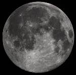
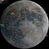
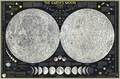
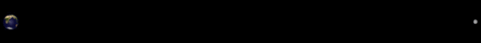
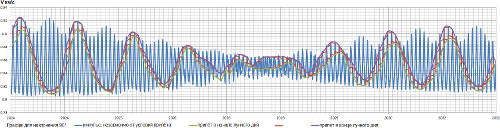
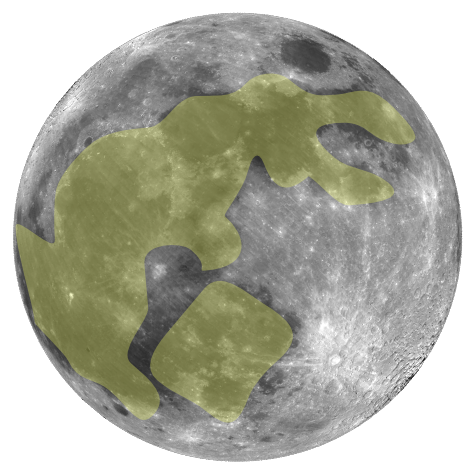
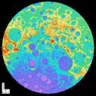
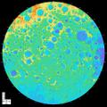
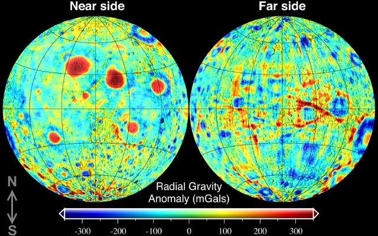
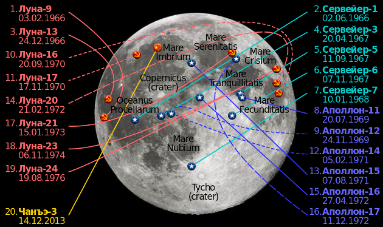

# Moon
> 2019.03.21 [🚀](../index/index.md) [despace](index.md) → [Moon](moon.md), [Space](index.md)

[TOC]

---

> <small>**Moon** — EN term. **Луна** — RU analogue.</small>

**Moon** (astr. ☾ [❐](f/aob/moon/moon_symbol_svg.png), lat. *Luna*) is a natural satellite [of the Earth](earth.md). The closest satellite to the [Sun](sun.md) planet, since the planets closest to the Sun, [Mercury](mercury.md) & [Venus](venus.md), have no satellites. The second brightest object in the Earth’s firmament after the Sun & the fifth largest natural satellite of the planet [solar system](solar_system.md). The average distance between the centers of the Earth & the Moon is 384 467 ㎞ (~30 Earth diameters). Has huge reserves of [helium‑3](helium3.md). Moon Symbols: ☽︎🌛︎ 🌕︎ 🌝︎ ☾ 🌜︎ 🌑︎ 🌚︎ 🌑🌒🌓🌔🌕🌖🌗🌘

|*Moon*| | |*Map*|
|:--|:--|:--|:--|
|||||

## Description & Characteristics
|*Characteristic*|*[Value](si.md)*|
|:--|:--|
|Breaking to the orbit|…|
|Distance from Earth|356 000 ‑ 407 000 ㎞, flight for 4.5 ‑ 5.5 days w/ [LPS](ps.md), signal is 1.17 ‑ 1.36 s|
|Velocity from Earth|… ㎞/s|
|**Orbits:**|• • •|
|[Apocentre](apopericentre.md) (Apogee);  [Pericentre](apopericentre.md) (Perigee)|405 696 ㎞ (404 000 ‑ 406 700 ㎞);  363 104 ㎞ (356 400 ‑ 370 400 ㎞)|
|[Argument of periapsis](keplerian.md) (ω)|Progressing by one revolution in 8.85 years|
|Day/year|14 d 18 h (29.530 6 d or 708.734 4 h) / … Earth’s|
|[Eccentricity](keplerian.md) (e)|0.054 9 (average)|
|[Hill sphere](hill_sphere.md)|66 000 ㎞|
|[Inclination](keplerian.md) (Ⅰ)|5.145° (to ecliptic)|
|[Longit. of asc.node](keplerian.md) (Ω)|Regressing by one revolution in 18.61 years|
|Orbital velocity (Ⅴ)|1.023 ㎞/s (average)|
|Satellite of|[Earth](earth.md)|
|Satellites|none|
|[Semimajor axis](keplerian.md) (a)|384 399 ㎞ (0.002 57 [au](si.md))|
|[Sider. rotat.period](astroperiod.md) (T, day)|27.321 661 days (synced w/ Earth)|
|[Sidereal period](astroperiod.md) (year)|27.321 582 days (27 d 7 h 43 min 1 s)|
|[Synodic period](astroperiod.md)|29.530 588 days (29 d 12 h 44 min 0 s)|
|**Physics:**|• • •|
|[Albedo](albedo.md)|0.12|
|[Apparent magnitude](app_mag.md) (m)|−2.5/−12.9 (−12.74 full Moon)|
|Axial tilt|1.542 4° (to ecliptic)|
|Equatorial rotation velocity|16.657 ㎞/h (0.009 9 Earth’s)|
|[Escape velocity](esc_vel.md)|1.68 ㎞/s (v₁, 0.212 Earth’s);  2.38 ㎞/s (v₂, 0.212 Earth’s)|
|Flattening|0.001 25 (0.372 Earth’s)|
|[Magnetic field](mag_field.md)|0.000 005 T (0.1 Earth’s)|
|Mass (m)|7.347 7·10²² ㎏ (0.012 3 Earth’s)|
|Mean density (ρ)|3.346 4 g/㎝³ (average, 0.607 Earth’s)|
|Radius|1 738.14 ㎞ (equator, 0.273 Earth’s);  1 735.97 ㎞ (polar, 0.273 Earth’s);  1 737.10 ㎞ (average, 0.273 Earth’s)|
|Solar constant|1 360 W/m², 1 321 ‑ 1 412 W/m² (1.0 Earth’s)|
|Surface area (S)|3.793·10⁷ ㎞² (0.074 Earth’s, 2.2 RU)|
|[Surface gravity](g.md)|1.62 ㎧² (equator, 0.165 Earth’s)|
|Volume (Ⅴ)|2.195 8·10¹⁰ ㎞³ (0.020 Earth’s)|
|**Temperature & atmosph.:**|• • •|
|[Atmosphere](atmosphere.md)|**Composition:** He, Ar, Ne, Na, K, H, Rn.  **Density:** 1.2·10⁻¹³ ㎏/m³ (10⁻¹³ Earth’s).  **Pressure:** 10⁻⁷ ㎩ (1 pico㍴, day), 10⁻¹⁰ ㎩ (1 femto㍴, night).  **Winds:** none.|
|[Illumination](illum.md)|200 (5.5°) ‑ 3 000 (90°) ㏓ (surface, 0.2 Earth’s)|
|[Radiation](ion_rad.md)|(285 Earth’s):  285 ㏜ / y (surface, 0.37 ㎜ aluminum);  21.5 ㏜ / y (surface, 3.7 ㎜ aluminum);  1.25 ㏜ / y (surface, 37 ㎜ aluminum);  0.05 ㏜ / y (surface, 450 ㎜ thick aluminum shield)|
|Temperature|Min. 100 K (−173 ℃)・ Aver. 220 K (−53 ℃)・ Max. 390 K (+117 ℃);  Equator: Min. 33 K (−240 ℃)・ Aver. 130 K (−143 ℃)・ Max. 230 K (−43 ℃)|

  
*Signal Earth → Moon.*

  
*Breaking velocity depending on the year (straight flight).*

The **moon rabbit** or **moon hare** is a mythical figure who lives on the Moon in Far Eastern folklore, based on pareidolia interpretations that identify the dark markings on the near side of the Moon as a rabbit or hare. The folklore originated in China & then spread to other Asian cultures. In East Asian folklore, the rabbit is seen as pounding with a mortar & pestle, but the contents of the mortar differ among Chinese, Japanese & Korean folklore. In Chinese folklore, the rabbit often is portrayed as a companion of the Moon goddess Chang'e, constantly pounding the elixir of life for her & some show the making of cakes or rice cakes; but in Japanese & Korean versions, the rabbit is pounding the ingredients for mochi or some other type of rice cakes. In some Chinese versions, the rabbit pounds medicine for the mortals & some include making of mooncakes. Unrelated moon folklore from certain native cultures of the Americas also has rabbit themes & characters.

### Atmosphere & climate

The [radiation dose](ion_rad.md) for the lunar surface is 285 higher than for Earth (5.95 ㏜ / 24 h) which means that without protection an inhabitant in 25 minutes will obtain the radiation dose that will dramatically increase the risk of cancer, & will be possibly dead in a couple of days after the 8 hours of exposure. In addition to this, the cosmic ionizing radiation & heavy particles (that are almost completely blocked by the Van Allen belts & Earth’s atmosphere) are not blocked at all on the lunar surface.

The possible acceptable dose for the surface operations can be assumed as 0.05 ‑ 0.1 ㏜/y. The average absorbed dose of solar & cosmic rays during the 5‑ 14 days of flight from Earth to the Lunar surface is 9.74 ㏜/y for the 3.7 ㎜ thick aluminum shield (45 % of the dose per year with the same shielding on the lunar surface). The major contribution (~99.986 %) is coming from the solar radiation while the aluminum shielding does not make any sufficient effect for cosmic rays. The average absorbed dose on the surface is:

|*Solar & cosmic rays, ㏜/y*|*Cosmic rays only, ㏜/y*|*Aluminum shield thickness, ㎜*|
|:--|:--|:--|
|285|0.037 5|0.37|
|21.5|0.038|3.7|
|1.25|0.034 7|37|
|0.05|0.031|450|

Meteorites are moving with a speed up to 72 ㎞/s & have a mass from 0.000 001 to 0.01 g. Their distribution is almost even & their activity is almost constant. Meteorites with higher mass are eventual & not described here.

### Magnetic field & core
<mark>TBD</mark>

### Surface & Maps

|*South pole*|*North pole*|
|:--|:--|
|||

**Links:**

   1. <http://dsastro.ru/2018/02/01/moon_map/>
   1. <http://www.galactic.name/library/starmaps.php>
   1. <http://galspace.spb.ru/index333.html>
   1. <https://www.lpi.usra.edu/resources/mapcatalog/>
   1. <http://wms.lroc.asu.edu/lroc> — LRO camera
   1. <https://www.nasa.gov/feature/moon-s-south-pole-in-nasa-s-landing-sites> — NASA South Pole landing sites
   1. <https://trek.nasa.gov/moon/>

<mark>TBD</mark> The text in this section is a bit bulky.

The lunar surface consists mostly of basalt & basalt rocks of different dimensions & forms & is covered by a thin layer of dust that has an electrical charge & magnetic characteristics. Due to the lack of atmosphere dust, particles, & rocks were not eroded, so they are sharp.

Other extremes at the Moon’s South Pole are not so dark & cold ­— there are also areas, near Shackleton crater for instance, that are bathed in sunlight for extended periods of time, over 200 Earth days of constant illumination. This happens also because of the Moon’s tilt & is a phenomenon that we experience at our own polar regions on Earth. Unrelenting sunlight is a boon to Moon missions, allowing explorers to harvest sunlight in order to light up a lunar base & power its equipment.

The composition of the lunar regolith: fragments of stones, minerals, agglutination (connected by arrow‑shaped binder by ground elements), breccias & glasses (amorphous substances). Less different types of minerals have been found on the surface of the lunar surface (there are several thousand on Earth). The sample taken from the surface of the seas mainly consists of fragments of basalt stones. These stones contain minerals: pyroxenes (a group of minerals with the formula ABSi₂O₄, where A — magnesium / iron / calcium / sodium, B — magnesium / iron / aluminum), olivine, ilmenite FeTiO₃. The sample taken from the surface of heights (lands) mainly consists of plagioclases. Special properties: has an electric charge & magnetic properties.

Even with a non‑military eye, the contrast of the lunar surface is noticeable — it is from dark & light areas. Areas are taken to be called, respectively, seas & lands (terrae / terra, also “hills”).

The seas are lower in height than the hills, & their surface is really dark — it consists of hardened lava, indicative of a former volcanic moon. Seas make up ~16 % & lands ~84 % of the lunar surface. The hemisphere of the Moon, observed from the Earth, is called the near one. In the near hemisphere, the sea makes up 30 % of the entire surface of the hemisphere. Various studies (among studies based on data obtained from Soviet lunar missions) show that in the far hemisphere (the dark side of the moon) the seas make up only 2 % of the surface. At the same time, there are more seas in the southern region of the far hemisphere than in the southern region of the near one.

Both seas & lands have a large number of craters that appeared from impacts of meteorites. Most of the seas are rounded, edged with ring or arched mountains. The closed surface structures that are inside are called pools. The main difference between craters & pools is size. A depression formed from a meteorite impact is considered a basin if its diameter is at least 300 ㎞.

The internal shape of the crater is influenced by its size. Small craters (less than 15 ㎞ in diameter) are bowl‑shaped. Medium craters (20 to 175 ㎞) have a flat niche with a small hill in the center of the crater. Craters with a diameter of more than 175 ㎞ have complex concentric structures — with an increase in the diameter of the crater, ring ridges replace hills.

By the number of craters, one can judge the geological age of the surface — the more craters, the older the surface (young surfaces have not yet had time to acquire craters). For example, the Earth’s surface is considered young because it contains few craters. A consequence of the planet’s geological activity is a constant change in its surface, due to which ancient craters disappear. At the same time, the surface of the Moon is very old — there are many craters on it. Moreover, the surface of the moon is uneven — the seas are considered younger, since there are fewer craters on their surface. The oldest surfaces in the solar system are those with the highest density in terms of the number of craters. This means that there are so many craters on the surface of a celestial body that no meteorite will any longer change their number in any collision with the surface. Some areas of the lunar surface are close to this state.

The lunar surface is covered with a moderately moving layer of powdery soil, along given stones — regolith. Regolith is formed from dust, sand & debris ejected from the crater during its formation when struck by a meteorite. Each self‑respecting crater is surrounded by a layer of “discarded” material — “discarded canvas”. When leaving the collision site, large stones follow a hyperbolic trajectory.

The average surface temperature during a lunar day (about a month by Earth standards) varies in the range from 400 K to 100 K at a rate of 5 K/h. Many craters in the polar regions are in constant shadow, so their surface temperature is low (about 40 ‑ 80 K) & almost does not change.

Based on various observations (missions Apollo, Surveyor‑3, etc.), statistics were formed on the observed number of microcraters (pits) per year per square meter.

Expected number of microcraters

|*Crater’s diameter, 10⁻⁶ m*|*Quantity, 1/(m²·year)*|
|:--|:--|
|≥ 0.1|30 000|
|≥ 1.0|1 200|
|≥ 10|300|
|≥ 100|0.6|
|≥ 1 000|0.001|

**Geological composition**

It’s believed that a layer in the first few hundred from the surface to the interior of the moon was created by bombardment by meteorites over many years. The impact of micrometeorites alone mixes the entire regolith every 40 million years. The process of soil formation is accompanied by the effects of radiation & solar wind, which causes erosion (literally weathering) of the surface, due to which the surface has a relatively fine‑grained structure.

Composition of grains of a soil sample taken during the Apollo 11 mission

|*Grain size, mm*|*Percentage (by weight),%*|
|:--|:--|
|10 ‑ 4|1.67|
|4 ‑ 2|2.39|
|2 ‑ 1|3.20|
|1 ‑ 0.5|4.01|
|0.5 ‑ 0.25|7.72|
|0.25 ‑ 0.15|8.23|
|0.15 ‑ 0.090|11.51|
|0.090 ‑ 0.075|4.01|
|0.075 ‑ 0.045|12.40|
|0.045 ‑ 0.020|18.02|
|≤ 0.020|26.85|

The biggest difference between materials on the surface of the Earth & the Moon is in the form of stones on it. Most of the rocks on Earth are sedimentary — the result of atmospheric & water erosion. There are many volcanic rocks on the moon.

The seas are composed primarily of dark basaltic rocks formed by the rapid cooling of lava flows. Uplands (land) for the most part of the Anorthosite rock is a rock of volcanic origin, but formed in the process of a slower cooling of lava than in the case of basalt. The fact that the stones of the seas & lands, originally in the same molten state, cooled at different rates, proves their occurrence in different conditions.

In both areas there are breccias — fragments of several stones connected together by a meteorite impact. At higher elevations, breccias are more common. Also, the lunar soil contains glassy particles that are not found on Earth. Most likely they were formed by the heat & pressure from the impact of meteorites.

**Chemical composition**

Lunar regolith consists of various chemical elements & compounds. The most common elements — carbon, hydrogen & nitrogen — are distributed over the entire lunar surface by solar winds. Compared to the Earth’s soil, the lunar soil contains high concentrations of sulfur, iron, magnesium, manganese, calcium & nickel. Many of them are found in the oxides FeO, MnO, MgO, etc. The largest source of oxygen is ilmenite (FeTiO₃), which is mainly found in the “seas”.

The stones on the lunar surface contain a large number of refractory elements that form compounds with a high melting point, such as: calcium, aluminum, titanium. At the same time, there are few lightweight elements in them, for example, hydrogen, but they are rich in silicon & oxygen.

High concentrations of rare metals (such as titanium) & abundant amounts of silicon & oxygen make the Moon attractive in terms of mining & production.

**Material age**

The age of a material can be judged by its saturation with radioactive elements. The method for determining the age of an object from its radioactive content is called radiometric dating.

Some of the results of such studies:

   - The age of samples taken from the surfaces of the Sea of ​​Rains & the Ocean of Storms (brought to Earth by the Apollo 11 & Apollo 12 missions) is about 3.5 billion years. This is comparable to the oldest stones found on Earth.
   - Samples of the “discarded canvas” lying near the basin of the Sea of ​​Rains (delivered by the Apollo 14 expedition) are more ancient — their age is about 3.9 billion years.
   - Stones from the surface of the “earth” (Apollo 16) are about 4 billion years old.
   - The age of the oldest stone (discovered during the Apollo 17 mission) of all investigated is about 4.5 billion years.

The above results allow us to conclude that the study of the lunar soil & stones will allow us to learn more about the history of the development of the solar system, since the age of the most ancient samples corresponds to the estimated age of the solar system itself. With the help of samples from the Earth, it is impossible to carry out such fundamental research — it is constantly renewed, destroying such old materials.

## Developing features

**Literature:**

   1. …

**Orbiter:**

   - **Constraints:**
      1. Do not forget maskons.
      1. Solar & cosmic rays may damage electronic/mechanical/bio elements.

**Lander:**

   - **Constraints:**
      1. Common [external factors](ef.md).
      1. **Do not forget maskons.** Through, the lunar gravity is ⅙ of Earth’s.
      1. **Almost no atmosphere.**
      1. **Lack of the Sun.** Completely no sunlight for a couple of Earth days or weeks. Thus, no solar power, low temperature, & significant temperature range during the day‑night change.
      1. **Solar & cosmic rays** may damage electronic/mechanical/bio elements.
      1. **Dust.** Has sharp corners, electrical & magnetic characteristics. May damage lungs & moving mechanical parts, conduct short circuits, adhere to metallic & magnetic surfaces. On the other hand, the dust can be removed using a generated electromagnetic field.
      1. **The communication** with Earth may not be constant or direct.
      1. **Meteorites** are moving at speeds of 3 ‑ 72 ㎞/s, not blocked by an atmosphere, have mostly small dimensions. Thus, there has to be protection or availability to maintain damages.
   - **Possible [energy](sps.md) & [heat](tcs.md) solutions** (gather, store, convert):
      1. Electro‑mechanical accumulators
      1. Fueled sources
      1. Heat‑to‑electricity converters
      1. Lunar surface ionized by cosmic rays
      1. Mirror systems. E.g. [NASA NIAC Light Bender ⎆](https://www.nasa.gov/directorates/spacetech/niac/2021_Phase_I/Light_Bender/).
      1. [Nuclear reactors](nr.md)
      1. [Rechargeable electrical](eb.md) & [heat](heat_bank.md) accumulators
      1. [Solar panels](sp.md)
      1. [RTG](RTG.MD)
   - **Possible [communications](comms.md) solutions:**
      1. High/medium/low gained antennas to trace Earth & Orbiters
      1. Radio repeaters (passive & active)
   - **Possible [external factors](ef.md) protection solutions** (meteorites, radiation, thermal, vacuum, dust):
      1. Ballistic covers
      1. Electromagnetic fields to get rid of a dust
      1. Hermetic seals
      1. Thick man‑made constructions
      1. Thin structures covered in the lunar soil

**Effects of Lunar conditions to Earthlings** by Low gravity, Radiation, Isolation, Working in a small group, Small & sealed rooms, Not seeing Earth — Behavioural ・ Cognitive ・ Neurological ・ Physiological ・ Psychological ・ Sociological.

Required [average ΔV](nnb.md):

   - Earth → Low Earth orbit: 9.5 ㎞/s
   - Low Earth orbit → Moon surface: 5.9 ㎞/s
      - Low Earth orbit → Low lunar orbit: 4.0 ㎞/s
      - Low lunar orbit → Lunar surface: 1.9 ㎞/s
   - Moon surface → Earth re‑entry: 2.7 ㎞/s
      - Lunar surface → Low lunar orbit: 1.9 ㎞/s
      - Low lunar orbit → Low Earth orbit: 0.9 ㎞/s
      - Replacing LEO with immediate re‑entry reduces ΔV
   - To reach polar regions, a lunar polar orbit is required. This would increase the ΔV only marginally (~0.1 ㎞/s). However, polar orbits need specific launch windows, achievable only every ~2 weeks.

Retrieval of ”space materials” (e.g., lunar, asteroidal, etc.) to Earth is not feasible for economic gain. As of 2021, no minerals, molecules, elements, or isotopes are worth fetching from space. H₂O has space applications. Retrieving it from space sources would be immediately economically beneficial. May be used for spacecraft propulsion, life‑support.

In astronomy & astrophysics, a **mass concentration** (or **mascon**) is a region of a planet or moon’s crust that contains a large positive gravitational anomaly. In general, the word “mascon” can be used as a noun to refer to an excess distribution of mass on or beneath the surface of an astronomical body (with respect to some suitable average), such as is found around Hawaii on Earth. However, this term is most often used to describe a geologic structure that has a positive gravitational anomaly associated with a feature (e.g. depressed basin) that might otherwise have been expected to have a negative anomaly, such as the “mascon basins” on the Moon.

The Moon is the most gravitationally “lumpy” major body known in the solar system. Its largest mascons can cause a plumb bob to hang about ⅓ of a degree off vertical, pointing toward the mascon, & increase the force of gravity by one‑half percent.

**Q&A.**

   - **“For the small lunar lander, which propulsion system is recommended? And what will be the recommended thruster configuration for braking, landing, & attitude control?”**  If there is a plan to land on a precise place then the chemical engines are the preferred ones. The more thrust & Isp you can reach, the more precise you can land. Surely, there can be used solid‑fueled or electric thrusters with deep modifications of the landing system, but this will lead to some kind of new technology for landing & possibly a pretty complex GNC system, but everything is possible.  The chemical thruster configuration depends on thruster manufacture possibilities, flight program (especially, requirements for the solar orientation), dealing with malfunctions leading to spacecraft destabilization, the GNC system possibilities, and, maybe the most important point, is how spacecraft designers can deal with this configuration, because, for example, Beresheet team had used, let’s say, the common configuration, but the spacecraft still failed. There can be marked out 3 major variants.  ➀ A single powerful thruster for everything with a deep regulation of thrust with(out) a small number of tiny thrusters for minor orientation. This allows to simplify a propulsion system but you have to deal with lowering the Isp during the non‑nominal thrusts. But that may lead to high demands to a GNC, & possibly the spacecraft has the lowest possibilities to handle failures. But possibly the most effective way.  ➁ A small number of not‑so‑powerful thrusters for major burns with several small thrusters for orientation & stabilization. Seems to be classic & the most used variant. Results may vary but looks like it may be pretty simple & can handle almost all possible failures even if the manufacturing quality is low.  ➂ A large number of low‑powerful thrusters for major burns with several small thrusters for orientation & stabilization. For the situation when you have high‑quality unified thrusters this can be a way to reduce time, cost. May lead to a pretty complex & heavy propulsion system design, but can be leveled by good characteristics of proven thrusters.
   - **“What should be considered in designing the landing leg & footpad?”**  The spacecraft’s mass, dimensions, the position of CoM, supposed position after landing, landing speeds, overloads, surface relief, obstacles, payload, & other onboard equipment requirements possible risks, & other specific mission requirements.
   - **“What will be the mandatory & optional sensors for the navigation during the landing phase? And for a high accurate land on the Moon.”**  Depending on the way you want to land, propulsion system configuration, GNC abilities, & the precision you can acquire on the lunar orbit, there can be 3 major variants.  ➀ LIDAR is mandatory, the camera is optional. Classic variant. Using the precise positioning on the lunar orbit, precise GNC, & propulsion, the landing can be performed using the only LIDAR. If all of these systems will be able to perform their duties with high quality then the LIDAR’s major role will be only to control the landing near the surface to avoid major obstacles. This variant may be the most complex to demonstrate a highly accurate land, but possibly it’s the most effective way, especially with cameras onboard.  ➁ Camera is mandatory, LIDAR is optional. Have less strict requirements for a spacecraft’s systems, but binded to the landing sites & dates due to the possibility to recognize obstacles only using shadows. It would be useful to obtain a high‑resolution 3D map of a landing site to perform a precise landing. Without a LIDAR there risks of not recognizing obstacles, but surely the precision of positioning is higher than ➀. Adding a LIDAR will place this variant on the same level with ➀.  ➂ Camera & LIDAR are mandatory. The most effective way, which can lower requirements for other systems.
   - **“What should be considered in determining landing location on the Moon?”**  That depends on the design of a lander & landing device, acceptable overloads, & regions. If we’re talking about a classic 4‑legged soft landing then matters that have to be taken into account are: dimensions & distribution of obstacles & slopes which can damage a spacecraft or let it lose its stability, distribution of inclinations which a spacecraft can handle, possible risks of a slight missing of the supposed region, GNC’s & propulsion’s abilities, payload requirements, power requirements, Earth’s accessibility, & other specific mission requirements.

## Moon exploration

### What for?

<mark>TBD</mark>

### Timeline

<mark>TBD</mark>

<https://nssdc.gsfc.nasa.gov/planetary/chronology.html>

### Communities & persons

<mark>TBD</mark>

   - **Conferences.** ([List of meetings and conferences ⎆](https://www.hou.usra.edu/meetings/calendar/) by Lunar and Planetary Institute)
      1. [AAS Division for Planetary Sciences Annual meeting ⎆](https://dps.aas.org/meetings/future)
      1. [Earth and Planetary Science Conference ⎆](https://www.meetingsint.com/conferences/earthscience)
      1. [Lunar and Planetary Science Conference ⎆](https://www.hou.usra.edu/meetings/lpsc2021/)
      1. [Lunar Exploration Analysis Group ⎆](https://www.hou.usra.edu/meetings/leag2020/)
      1. [Lunar Surface Science Workshop ⎆](https://www.hou.usra.edu/meetings/lunarsurface2020/)

 

### Projects
See also “[Projects](project.md)”.

**Hypothetical & Historical:**

   - [MEAEM](hptc_meaem.md)
   - [Lunagruzik](hptc_lunagruzik.md)
   - [OCHBPLIEG](hptc_ochbplieg.md)

**[Lunar rovers](robot.md):**

   - [Chandrayaan-2-rover](chandrayaan_2_rover.md) <mark>TBD</mark>
   - [LRV](lrv.md) <mark>TBD</mark>
   - [Yutu](yutu.md) <mark>TBD</mark>
   - [Yutu-2](yutu_2.md) <mark>TBD</mark>
   - [Lunokhod‑1](луноход_1.md) <mark>TBD</mark>
   - [Lunokhod‑2](луноход_2.md) <mark>TBD</mark>
   - [Robot‑geolog](робот_геолог.md) <mark>TBD</mark>

**List of lunar lands:**

**Table.** Missions/spacecraft of past & future. (**Ⓛ** — LAV)  (**C** — contact rsrch; **D** — distant rsrch; **F** — fly‑by; **H** — manned; **S** — soil sampe return; **X** — technology demonstr.)

| |*Mission/SC (index)*|*Date (UTC)*|*D*|*C*|*F*|*H*|*S*|*X*|*Notes*|
|:--|:--|:--|:--|:--|:--|:--|:--|:--|:--|
|—|**・Proposed・**|—|•|•|•|•|•|•|—|
|CN|[Chang'e-5](chang_e_5.md)| | | | | | | |<mark>TBD</mark>|
|CN|[Chang'e-4](chang_e_4.md)| | |C| | | | |<mark>TBD</mark>|
|RU|[Луна‑29](луна_29.md) Ⓛ| | |C| | |S| |<mark>TBD</mark>|
|—|**・Developing・**|—|•|•|•|•|•|•|—|
|RU|[Луна‑28](луна‑28.md) (ЛГР) Ⓛ|2025| |C| | | | |<mark>TBD</mark>|
|RU|[Luna‑27](луна_27.md) (ЛР1) Ⓛ|2025| |C| | | | |<mark>TBD</mark>|
|RU|[Луна‑26](луна_26.md) (ЛРОА) Ⓛ|2021|D| | | | | |<mark>TBD</mark>|
|RU|[Luna‑25](луна_25.md) (ЛГ) Ⓛ|2021| |C| | | | |<mark>TBD</mark>|
|—|**・Active・**|—|•|•|•|•|•|•|—|
|…|…|…| | | | | | |<mark>TBD</mark>|
|—|**・Past・**|—|•|•|•|•|•|•|—|
|IL|[Beresheet](beresheet.md)|2019.02.22| |C| | | |X|<mark>TBD</mark>|
|JP|[SELENE-2](selene_2.md)|2018|D|C| | | | |<mark>TBD</mark>|
|EU|[Lunar Lander](lunar_lander.md)|2018| |C| | | | |<mark>TBD</mark>|
|IN|[Chandrayaan-2](chandrayaan_2.md)|2018|D|C| | | | |<mark>TBD</mark>|
|CN|[Chang'e-3](chang_e_3.md)|2013.12.01| |C| | | | |<mark>TBD</mark>|
|US|[LADEE](ladee.md)|2013.09.07|D| | | | |X|<mark>TBD</mark>|
|US|[GRAIL](grail.md)|2011.09.10|D| | | | | |<mark>TBD</mark>|
|CN|[Chang'e-2](chang_e_2.md)|2010.10.01|D| | | | | |<mark>TBD</mark>|
|US|[LRO](lunar_reconnaissance_orbiter.md)|2009.06.19|D| | | | | |<mark>TBD</mark>|
|US|[LCROSS](lcross.md)|2009.06.19|D| | | | | |<mark>TBD</mark>|
|IN|[Chandrayaan-1](chandrayaan_1.md)|2008.10.22|D|C| | | |X|<mark>TBD</mark>|
|CN|[Chang'E-1](chang_e_1.md)|2007.10.24|D|C| | | | |<mark>TBD</mark>|
|JP|[SELENE](selene.md)|2007.09.14|D| | | | | |<mark>TBD</mark>|
|US|[THEMIS](themis.md)|2007.02.17|D| | | | | |<mark>TBD</mark>|
|EU|[SMART-1](smart_1.md)|2003.09.27|D| | | | |X|<mark>TBD</mark>|
|US|[Clementine](clementine.md)|1998.01.07|D| | | | | |<mark>TBD</mark>|
|US|[Lunar Prospector](lunar_prospector.md)|1994.01.25|D| | | | | |<mark>TBD</mark>|
|JP|[Hiten](hiten.md)|1990.01.24|D|C| | | | |<mark>TBD</mark>|
|SU|[Луна‑24](луна_24.md) Ⓛ|1976.08.09| |C| | | | |<mark>TBD</mark>|
|SU|[Луна‑23](луна_23.md) Ⓛ|1974.10.28| |C| | |S| |<mark>TBD</mark>|
|SU|[Луна‑22](луна_22.md) Ⓛ|1974.04.29|D| | | | | |<mark>TBD</mark>|
|SU|[Луна‑21](луна_21.md) Ⓛ|1973.01.08| |C| | | | |<mark>TBD</mark>|
|SU|[Луна‑20](луна_20.md) Ⓛ|1972.02.14|D|C| | |S| |<mark>TBD</mark>|
|US|[Apollo 17](apollo_17.md)|1972.12.07| | | |H| | |<mark>TBD</mark>|
|US|[Apollo 16](apollo_16.md)|1972.04.16| | | |H| | |<mark>TBD</mark>|
|SU|[Луна‑19](луна_19.md) Ⓛ|1971.09.28|D| | | | | |<mark>TBD</mark>|
|SU|[Луна‑18](луна_18.md) Ⓛ|1971.09.02| |C| | | | |<mark>TBD</mark>|
|US|[Apollo 15](apollo_15.md)|1971.07.26| | | |H| | |<mark>TBD</mark>|
|US|[Apollo 14](apollo_14.md)|1971.01.31| | | |H| | |<mark>TBD</mark>|
|SU|[Луна‑17](луна_17.md) Ⓛ|1970.11.10| |C| | | | |<mark>TBD</mark>|
|SU|[Луна‑16](луна_16.md) Ⓛ|1970.09.12| |C| | |S| |<mark>TBD</mark>|
|US|[Apollo 13](apollo_13.md)|1970.04.11| | | |H| | |<mark>TBD</mark>|
|US|[Apollo 12](apollo_12.md)|1969.11.14| | | |H| | |<mark>TBD</mark>|
|US|[Apollo 11](apollo_11.md)|1969.07.16| | | |H| | |<mark>TBD</mark>|
|SU|[Луна‑15](луна_15.md) Ⓛ|1969.07.13| |C| | |S| |<mark>TBD</mark>|
|US|[Apollo 10](apollo_10.md)|1969.05.18| | | |H| | |<mark>TBD</mark>|
|US|[Apollo 9](apollo_9.md)|1969.03.03|D| | | | | |<mark>TBD</mark>|
|US|[Apollo 8](apollo_8.md)|1968.12.21|D| | | | | |<mark>TBD</mark>|
|SU|[Луна‑14](луна_14.md) Ⓛ|1968.04.07|D| | | | | |<mark>TBD</mark>|
|US|[Surveyor 7](surveyor_7.md)|1968.01.07| |C| | | | |<mark>TBD</mark>|
|US|[Explorer 35](explorer_35.md)|1967.07.19|D| | | | | |<mark>TBD</mark>|
|SU|[Луна‑13](луна_13.md) Ⓛ|1966.12.21| |C| | | | |<mark>TBD</mark>|
|SU|[Луна‑12](луна_12.md) Ⓛ|1966.10.22|D| | | | | |<mark>TBD</mark>|
|SU|[Луна‑11](луна_11.md) Ⓛ|1966.08.27|D| | | | | |<mark>TBD</mark>|
|SU|[Луна‑10](луна_10.md) Ⓛ|1966.03.31|D| | | | | |<mark>TBD</mark>|
|SU|[Луна‑9](луна_9.md) Ⓛ|1966.01.31| |C| | | | |<mark>TBD</mark>|
|SU|[Луна‑8](луна_8.md) Ⓛ|1965.12.03| |C| | | | |<mark>TBD</mark>|
|SU|[Луна‑7](луна_7.md) Ⓛ|1965.10.04| |C| | | | |<mark>TBD</mark>|
|SU|[Луна‑6](луна_6.md) Ⓛ|1965.06.08| |C| | | | |<mark>TBD</mark>|
|SU|[Луна‑5](луна_5.md) Ⓛ|1965.05.09| |C| | | | |<mark>TBD</mark>|
|SU|[Луна‑4](луна_4.md) Ⓛ|1963.04.02| |C| | | | |<mark>TBD</mark>|
|SU|[Луна‑3](луна_3.md) Ⓛ|1959.10.04|D| | | | | |<mark>TBD</mark>|
|SU|[Луна‑2](луна_2.md) Ⓛ|1959.09.12| |C| | | | |<mark>TBD</mark>|
|SU|[Луна‑1](луна_1.md) Ⓛ|1959.01.02|D|C| | | | |<mark>TBD</mark>|

#### Artemis

Content: <mark>TBD</mark>

   1. Need, targets, major participants
   1. Links (NASA site, news sites, groups in Facebook/Linkedin, etc.)
   1. Gerenal description of Artemis
   1. Current status of major elements (based on point 2)

**Links:**

   - [LinkedIn: Artemis Lunar Base Development & Human Lunar Exploration ⎆](https://www.linkedin.com/groups/13941062/)

 

## Science & tech targets
Just a preliminary list of the targets & explorations for the Moon.

The main idea is to prepare a brief (sic!) systematized list of the Lunar targets & explorations of the retired/active/proposed spacecraft suitable both for scientists, & engineers, & managers, & passers‑by. The one which is able in the same time to tell about what was done & in what volume, what is processing now & why it’s cool, what is proposed & why it’s so important. Something like a bridge between scientists & other humanity just to show that all of these complex scientific terms can be described with some statistic terms without need to read a lot of literature or trust their words.

Soon there will be something new, for example, links between targets/explorations, spacecraft, & a couple of brief description of the current state of each one.

### What was & what will be
Comments:

   - **T** — technical; **Draft** — minimum for working with object. **C** — contact exploration; **D** — distant exploration; **F** — fly‑by; **H** — manned; **S** — soil sample return; **X** — technology demonstration
   - **Sections of measurement & observation:**
      - Atmospheric/climate — **Ac** composition, **Ai** imaging, **Am** mapping, **Ap** pressure, **As** samples, **At** temperature, **Aw** wind speed/direction.
      - General — **Gi** planet’s interactions with outer space.
      - Soil/surface — **Sc** composition, **Si** imaging, **Sm** mapping, **Ss** samples.

In brief — 97 targets in total (33 technical, 64 scientific) consisting of: <mark>TBD</mark> never occurred (<mark>TBD</mark> technical, <mark>TBD</mark> scientific), <mark>TBD</mark> was tried (<mark>TBD</mark> technical, <mark>TBD</mark> scientific), <mark>TBD</mark> mostly done (<mark>TBD</mark> technical, <mark>TBD</mark> scientific).

<small>

|*Number*|*T*|*EN*|*Section of m&o*|*C*|*D*|*F*|*H*|*S*|
|:--|:--|:--|:--|:--|:--|:--|:--|:--|
|•|•|**Never occurred:**|•|•|•|•|•|•|
|EMN‑…| | | | | | | | |
|•|•|**Was tried:**|•|•|•|•|•|•|
|EMN‑…| | | | | | | | |
|•|•|**Mostly done:**|•|•|•|•|•|•|
|EMN‑…| | | | | | | | |

</small>

<mark>TBD</mark> 

|•|•|**Never occurred:**|•|•|•|•|•|•|
|EMN‑080| |Albedo: changes in time|Gi| |D|F| | |
|EMN‑036| |Atmosphere: cause & influence of geological & chemical activity on the climate & clouds| | |D| | | |
|EMN‑037| |Atmosphere: cause of the retrograde moving| | |D| | | |
|EMN‑032| |Atmosphere: characteristics of the CO₂ & N₂ in state of the lower layers supercritical fluid|Ac, Ai, Am, At| |D| | | |
|EMN‑007| |Atmosphere: connection between the topography & the atmo circulation| | |D| | | |
|EMN‑033| |Atmosphere: nature/rate of its escape| | |D| | | |
|EMN‑038| |Atmosphere: processes of the atmospheric parts dissipation| | |D| | | |
|EMN‑082|T|Atmosphere: prolonged investigations on the H = 0 ‑ 10 ㎞|All A| | | | | |
|EMN‑083|T|Atmosphere: prolonged investigations on the H = 10 ‑ 30 ㎞|All A| | | | | |
|EMN‑054|T|Atmosphere: sample return|As|C| | | | |
|EMN‑015| |Atmosphere: structure of the mesosphere|All A| |D| | | |
|EMN‑030| |Atmosphere: was it lost during some cataclysm or event| | |D| | | |
|EMN‑095| |Climate: history & causes of changes| | |D| | | |
|EMN‑087| |Crustal support mechanisms| | |D| | | |
|EMN‑051| |Dimensions & characteristics of the mantle & the core| | |D| | | |
|EMN‑057|T|Exploration with [satellites](sc.md): microsatellites| | |D|F| | |
|EMN‑071|T|Exploration with [satellites](sc.md): nanosatellites| | |D|F| | |
|EMN‑058|T|Exploration: directed seismoexperiment| | |D|F| | |
|EMN‑056|T|Exploration: from L1/L2|Ai, Am, At, Gi| |D| | | |
|EMN‑059|T|Exploration: with [rover](robot.md)|All A/S|C| | | | |
|EMN‑081|T|Extreme environment electronics| |C|D|F| | |
|EMN‑094|T|High temperature electronics| |C|D|F| | |
|EMN‑066|T|Human: on the surface| |C| | |H| |
|EMN‑065|T|Human: on the orbit| | |D| |H| |
|EMN‑060|T|Human: manned fly‑by| | |D|F|H| |
|EMN‑043| |Mechanisms of the mantle’s convection| | |D|F| | |
|EMN‑048| |Nature & sources of the greenhouse effect| | |D|F| | |
|EMN‑049| |Nature & characteristics of the thermal tides| | |D| | | |
|EMN‑069|T|Prolonged surface‑spacecraft functioning| |C| | | | |
|EMN‑064|T|Planetary terraforming| |C| | |H| |
|EMN‑045| |Surface: nature of the tessera| | |D| | | |
|EMN‑061|T|Surface: sample return| |C| | | |S|
|EMN‑088|T|Surface: subsurface investigations| |C| | | | |
|EMN‑086|T|Surface: tessera investigations, in‑situ| |C| | | | |
|EMN‑047| |Surface: structure‑composition connection of different regions & planet’s evolution| |C| | | | |
|EMN‑039| |Was the planet inhabited & for how long| |C|D| | | |
|EMN‑040| |Were there oceans & why have they gone| |C|D|F| | |
|•|•|**Was tried:**|•|•|•|•|•|•|
|EMN‑093|T|Atmosphere/surface imaging| | |D|F| | |
|EMN‑077| |Atmosphere: chemical elements distribution| | |D|F| | |
|EMN‑018| |Atmosphere: clouds, their chemistry| | |D|F| | |
|EMN‑075| |Atmosphere: clouds, their nature| | |D|F| | |
|EMN‑016| |Atmosphere: clouds, their structure| | |D|F| | |
|EMN‑011| |Atmosphere: common circulation model| | |D| | | |
|EMN‑014| |Atmosphere: composition| | |D| |F| |
|EMN‑019| |Atmosphere: energetic balance| | |D| | | |
|EMN‑008| |Atmosphere: flashing on the night side| | |D| | | |
|EMN‑013| |Atmosphere: illumination of the surface & the atmo layers| | |D| | | |
|EMN‑096| |Atmosphere: ionosphere| | |D|F| | |
|EMN‑012| |Atmosphere: lightnings| | |D| | | |
|EMN‑031| |Atmosphere: long‑term variations of the surface meteo characteristics| | |D| | | |
|EMN‑067| |Atmosphere: nature of the polar dipole & turbulence| | |D| | | |
|EMN‑034| |Atmosphere: nature of the superrotation| | |D| | | |
|EMN‑035| |Atmosphere: nature of the UV‑absorber| | |D| | | |
|EMN‑084|T|Atmosphere: prolonged investigations on the H = 30 ‑ 60 ㎞| | |D| | | |
|EMN‑078|T|Atmosphere: radiography| | |D| | | |
|EMN‑055|T|Atmosphere: sample obtaining & analysis| |C| | | | |
|EMN‑009| |Atmosphere: SO₂ concentration & nature of its variations| | |D| | | |
|EMN‑017| |Atmosphere: common structure| | |D| | | |
|EMN‑097| |Atmosphere: effect of solar Rad & interplanetary space on the atmo| | |D|F| | |
|EMN‑010| |Atmosphere: vertical model| | |D| | | |
|EMN‑050| |Causes of the water loss| | |D| | | |
|EMN‑041| |Common connection between the atmosphere & the surface| | |D| | | |
|EMN‑073|T|Exploration with [satellites](sc.md): large satellites| | |D|F| | |
|EMN‑072|T|Exploration with [satellites](sc.md): medium satellites| | |D|F| | |
|EMN‑070|T|Exploration with [satellites](sc.md): minisatellites| | |D|F| | |
|EMN‑042| |History & causes of the planet’s volcanic & tectonic evolution| | |D| | | |
|EMN‑020| |Inner structure of the planet| | |D| | | |
|EMN‑029| |Is Venus geologically active?:| |C|D|F| | |
|EMN‑028| |Magnetosphere structure| | |D|F| | |
|EMN‑089| |Measuring the planetary gravitational field| | |D|F| | |
|EMN‑074| |Meteorological model| | |D|F| | |
|EMN‑079| |Precise duration of the Venusian day| | |D| | | |
|EMN‑052| |Role of water (fluids) in planetary geology| |C|D|F| | |
|EMN‑092|T|Serve as a relay to Earth for stand‑alone SC/instruments| | |D| | | |
|EMN‑046| |Surface: causes of the changes during the last billion years| |C|D|F| | |
|EMN‑024| |Surface: common composition| |C| | | | |
|EMN‑026| |Surface: elemental composition| |C| | | | |
|EMN‑021| |Surface: map, 3D| |C|D| | | |
|EMN‑022| |Surface: map, precise| | |D| | | |
|EMN‑023| |Surface: mineralogical composition| |C| | | | |
|EMN‑044| |Surface: nature & causes of forming of the current rocks & soils| |C| | | | |
|EMN‑062|T|Surface: samples obtaining & analysis, incl. in different places| |C| | | |S|
|EMN‑063|T|Surface: panoramic imaging| |C| | | | |
|EMN‑025| |Surface: morphology| |C| | | | |
|EMN‑085|T|Surface: tessera investigations, remote| | |D|F| | |
|EMN‑076| |Surface: volcanoes, their presence| | |D|F| | |
|EMN‑027| |The causes why Venus evolved in a planet so different from Earth| |C|D|F| | |
|EMN‑091| |The loss rate of water from Venus| | |D|F| | |
|EMN‑053| |Traces of life in the atmosphere & on the surface| |C| | | | |
|•|•|**Mostly done:**|•|•|•|•|•|•|
|EMN‑001| |Atmosphere: preliminary model| |C|D|F| | |
|EMN‑004|T|Exploration: from Earth| | |D| | | |
|EMN‑003|T|Exploration: from inside of atmosphere| |C|D| | | |
|EMN‑006|T|Exploration: from surface| |C| | | | |
|EMN‑005|T|Exploration: from Venusian orbit| | |D|F| | |
|EMN‑090| |Spin axis| | |D| | | |
|EMN‑002| |Surface: preliminary map| |C|D| | | |

 

### EMN‑001 ‑ 009

 

## Docs & links
|Navigation|
|:--|
|**[FAQ](faq.md)**【**[SCS](scs.md)**·КК, **[SC (OE+SGM)](sc.md)**·КА】**[CON](contact.md)·[Pers](person.md)**·Контакт, **[Ctrl](control.md)**·Упр., **[Doc](doc.md)**·Док., **[EF](ef.md)**·ВВФ, **[Error](error.md)**·Ошибки, **[Event](event.md)**·События, **[FS](fs.md)**·ТЭО, **[HF&E](hfe.md)**·Эрго., **[KT](kt.md)**·КТ, **[Model](model.md)**·Модель, **[N&B](nnb.md)**·БНО, **[Patent](патент.md)**·Пат., **[Project](project.md)**·Проект, **[QM](qm.md)**·БКНР, **[R&D](rnd.md)**·НИОКР, **[SI](si.md)**·СИ, **[Test](test.md)**·ЭО, **[TRL](trl.md)**·УГТ, **[Way](way.md)**·Пути|
|*Sections & pages*|
|**【[Space](index.md)】**  [Apparent magnitude](app_mag.md)・ [Astro.object](aob.md)・ [Blue Marble](earth.md)・ [Cosmic rays](cr.md)・ [Ecliptic](ecliptic.md)・ [Escape velocity](esc_vel.md)・ [Health](health.md)・ [Hill sphere](hill_sphere.md)・ [Information](info.md)・ [Lagrangian points](l_points.md)・ [Near space](near_space.md)・ [Pale Blue Dot](earth.md)・ [Parallax](parallax.md)・ [Point Nemo](earth.md)・ [Silver Snoopy award](silver_snoopy_award.md)・ [Solar constant](solar_const.md)・ [Terminator](terminator.md)・ [Time](time.md)・ [Wormhole](wormhole.md) ┊ ··•·· **Solar system:** [Ariel](ariel.md)・ [Callisto](callisto.md)・ [Ceres](ceres.md)・ [Deimos](deimos.md)・ [Earth](earth.md)・ [Enceladus](enceladus.md)・ [Eris](eris.md)・ [Europa](europa.md)・ [Ganymede](ganymede.md)・ [Haumea](haumea.md)・ [Iapetus](iapetus.md)・ [Io](io.md)・ [Jupiter](jupiter.md)・ [Makemake](makemake.md)・ [Mars](mars.md)・ [Mercury](mercury.md)・ [Moon](moon.md)・ [Neptune](neptune.md)・ [Nereid](nereid.md)・ [Nibiru](nibiru.md)・ [Oberon](oberon.md)・ [Phobos](phobos.md)・ [Pluto](pluto.md)・ [Proteus](proteus.md)・ [Rhea](rhea.md)・ [Saturn](saturn.md)・ [Sedna](sedna.md)・ [Solar day](solar_day.md)・ [Sun](sun.md)・ [Titan](titan.md)・ [Titania](titania.md)・ [Triton](triton.md)・ [Umbriel](umbriel.md)・ [Uranus](uranus.md)・ [Venus](venus.md)|

   1. Docs:
      - [Модели грунта ❐](f/aob/moon/moon_soil_model.7z)
   1. Notable interwikies — …
   1. <https://en.wikipedia.org/wiki/Astronomical_symbols>
   1. <https://en.wikipedia.org/wiki/Moon>
   1. <https://en.wikipedia.org/wiki/Mass_concentration_(astronomy)>
   1. <http://ru.wikipedia.org/wiki/Список_прилунений>
   1. <http://ru.wikipedia.org/wiki/Исследование_Луны>
   1. <https://ru.wikipedia.org/wiki/Лунный_заяц>
   1. <http://clrn.uwo.ca/>
   1. <https://nssdc.gsfc.nasa.gov/planetary/chronology.html>
   1. <http://www.astronet.ru/db/msg/1180522/index.html>
   1. <http://luna26.cosmos.ru/>
   1. <https://www.lpi.usra.edu/expmoon/> — LPI, exploring the Moon
   1. <https://trek.nasa.gov/moon/>
