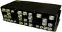
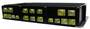

# МПК-003
> 2019.05.12 [🚀](../index/index.md) [despace](index.md) → **[ЦВМ](obc.md)**

[TOC]

---

> <small>**МПК-003** — RU term w/o analogues in English. **MPK-003** — literal EN translation.</small>

**МПК‑003** — цифровая вычислительная машина ([компьютер](obc.md)), предназначенная для использования в составе [КА](sc.md).  
Разработчик [НПП Антарес](zz_npp_antares.md). Разработано в 2005 году 

|*Characteristics*|*[Value](si.md)  (ДКШГ.468332.003)*|*[Value](si.md)  (ДКШГ.468332.003-01)*|
|:--|:--|:--|
|Composition|Single unit|Single unit|
|Consumption, W|52|26|
|Dimensions, ㎜|454 × 268 × 172|454 × 268 × 104|
|[Interfaces](interface.md)|[МКО](mil_std_1553.md)|[МКО](mil_std_1553.md)|
|[Lifetime](lifetime.md)/Resource, h(y)|43 800 (5) / 50 000 (5.7)|43 800 (5) / 50 000 (5.7)|
|Mass, ㎏|12|8.9|
|[Overload](vibration.md), Grms| | |
|[Rad.resist](ion_rad.md), ㏉ (㎭)| | |
|[Reliability](qm.md) per [lifetime](lifetime.md)|0.995|0.995|
|[Thermal range](tcs.md), ℃| | |
|[TRL](trl.md)|9|9|
|[Voltage](voltage.md), V|27 (23 ‑ 32)|27 (23 ‑ 32)|
|**【Specific】**|• • •|• • •|
|Bit depth| | |
|Commands,  sensors,  inputs|… — команд управления;  … — релейных матричных команд управления;  … — ТМ‑датчиков;  … — входов прерываний от контактных датчиков;  … — входов прерываний от импульсных датчиков| |
|CPU type| | |
|Performance| | |
|Recovery time, s|20 (с момента фиксирования отказа автоматикой)|20 (с момента фиксирования отказа автоматикой)|
|Volume, ㎅|… — ОЗУ;  … — ЭППЗУ;  … — защищённой памяти| |
| |  ДКШГ.468332.003|  ДКШГ.468332.003-01|

**Notes:**

   1. …
   1. **Applicability:** «Персона» (индекс ГУКОС — 14Ф137)

 

## Docs & links (TRANSLATEME ALREADY)
|Navigation|
|:--|
|**[FAQ](faq.md)**【**[SCS](scs.md)**·КК, **[SC](sc.md)**·КА, **[OE](oe.md)**·БА, **[SGM](sgm.md)**·КММ】**[CON](contact.md)·[Pers](person.md)**·Контакт, **[Ctrl](control.md)**·Упр., **[Doc](doc.md)**·Док., **[EF](ef.md)**·ВВФ, **[Error](error.md)**·Ошибки, **[Event](event.md)**·События, **[FS](fs.md)**·ТЭО, **[HF&E](hfe.md)**·Эрго., **[KT](kt.md)**·КТ, **[Model](model.md)**·Модель, **[N&B](nnb.md)**·БНО, **[Patent](патент.md)**·Патент, **[Project](project.md)**·Проект, **[QM](qm.md)**·БКНР, **[R&D](rnd.md)**·НИОКР, **[SI](si.md)**·СИ, **[Test](test.md)**·ЭО, **[Timeline](timeline.md)**·ЦГМ, **[TRL](trl.md)**·УГТ|
|*Sections & pages*|
|**【[On-board computer (OBC)](obc.md)】**  …  • • •  **RU:** [МПК-003](mpk_003.md) (9)・ [БИВК-МР](bivk_mr.md) (8)・ [МАРС 4](mars_4.md) (8)・ [БИВК-Р](bivk_r.md) (7.1)・ [МАРС 7](mars_7.md) (6)・ [МПК-002](mpk2.md) (3.9)・ [ЦВМ-12](cvm_12.md) (2.2)・ [БКУ_SXPA](bku_sxpa.md) (0.35)・ [БИВК-МН](бивк‑мн.md) () *([ЦВМ22](cvm22.md) (2.1))*|

   1. Docs: …
   1. Notable interwikies — …
   1. <http://npp-antares.ru/index.php/equipment.html>
