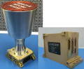

# µSTAR
> 2019.07.29 **[🚀](../index/index.md) [despace](index.md)** → **[ЗД](sensor.md)**

[TOC]

---

> <small>*Термины:* **µSTAR** — англоязычный термин, не имеющий аналога в русском языке. **мюСТАР** — дословный перевод с английского на русский.</small>

**µSTAR** — звёздный датчик для определения и выдачи в [GNC](gnc.md) информации о положении и угловых скоростях системы координат (СК) изделия относительно геоцентрической СК.  
*Разработчик:* [Space Micro](space_micro.md). Разработано в 2017 году. Активное применение.

<small>

<small>
|*•    Характеристика    •*|*[Значение](si.md) (µSTAR-100M)*|*[Значение](si.md) (µSTAR-200M)*|*[Значение](si.md) (µSTAR-200H)*|*[Значение](si.md) (µSTAR-400M)*|
|:--|:--|:--|:--|:--|
|[TRL](trl.md)|||||
|Время опознавания, с|||||
|Вых. информация|||||
|Допуст. угл. скор., °/с|||||
|Запаздывание, с, ≤|||||
|Исполнение|||||
|Объектив|HAS2|HAS2|HAS2|HAS2|
|Поле зрения, °|||||
|Режим готовности|||||
|Точность|5″|5″|1″|5″|
|Частота обновл., Гц|1|10|10|100|
|Яркость фона, кд/m²|||||
|**Etc:**|• • •|• • •|• • •|• • •|
|[ВБР](srrq.md) за САС|0.99971 (140 [FIT](fit.md))|0.99971 (140 [FIT](fit.md))|0.99971 (140 [FIT](fit.md))|0.99971 (140 [FIT](fit.md))|
|Dimensions, L×W×H, mm|ОБ 150×150×232,  БЭ 179×75×112||||
|Интерфейсы|SpaceWire|SpaceWire|SpaceWire|SpaceWire|
|Mass, kg|1.8 (0.9 ОБ, 0.9 БЭ)|2.1 (0.9 ОБ, 1.2 БЭ)|2.7 (1.5 ОБ, 1.2 БЭ)|3.3 (2.1 ОБ, 1.2 БЭ)|
|[Voltage](voltage.md), V|||||
|Overload, gRMS|10|10|10|10|
|[Rad.resist](ion_rad.md), Gy (rad)|1 000 (100 000)||||
|Resource, h (y)|||||
|[САС](lifetime.md) в космосе, ч (лет)|НОО: 157 680 (18)|НОО: 157 680 (18)|НОО: 157 680 (18)|НОО: 157 680 (18)|
|[Temp. range](tcs.md), ℃|−24 ‑ +61|−24 ‑ +61|−24 ‑ +61|−24 ‑ +61|
|Consumption, W|5|10|10|18|
||||||

</small>

 

## Примечания
   1. …

## Применяемость
   1. …

 

## Docs & links (TRANSLATEME ALREADY)
|…°·•¹²³±×÷≤≥≈≠ ‑ −— ⎆✉ ❐“”’«»✔→✘☐☑├┕┆ 1 lb = 0.453592 kg; 1 g = 9.80665 m/s²|
|:--|
|<small>**[FAQ](faq.md)**, **[Cable](cable.md)**·БКС, **[Camera](cam.md)**·Камера, **[Comms](comms.md)**·Радио, **[Contact](contact.md)**·Контакт, **[Control](control.md)**·Упр., **[Doc](doc.md)**·Док., **[Doppler](doppler.md)**·ИСР, **[DS](ds.md)**·ЗУ, **[EB](eb.md)**·ХИТ, **[ECO](ecology.md)**·Экол., **[EF](ef.md)**·ВВФ, **[ElC](elc.md)**·ЭКБ, **[EMC](emc.md)**·ЭМС, **[Error](error.md)**·Ошибки, **[Event](event.md)**·События, **[FS](fs.md)**·ТЭО, **[Fuel](fuel.md)**·Топливо, **[GNC](gnc.md)**·БКУ, **[GS](scs.md)**·НС, **[HF&E](hfe.md)**·Эрго., **[IU](iu.md)**·Гиро., **[KT](kt.md)**·КТЕХ, **[LAG](lag.md)**·ПУC, **[LES](les.md)**·САСП, **[LS](ls.md)**·СЖО, **[LV](lv.md)**·РН, **[MCC](mcc.md)**·ЦУП, **[Model](model.md)**·Модель, **[MSC](sc.md)**·ПКА, **[N&B](nnb.md)**·БНО, **[NR](nr.md)**·ЯР, **[OBC](obc.md)**·ЦВМ, **[OE](oe.md)**·БА, **[Pat.](патент.md)**·Патент, **[Project](project.md)**·Проект, **[PS](ps.md)**·ДУ, **[R&D](rnd.md)**·НИОКР, **[SRRQ](srrq.md)**·БКНР, **[Robot](robotics.md)**·Робот, **[Rover](rover.md)**·Планетоход, **[RTG](rtg.md)**·РИТЭГ, **[SARC](sarc.md)**·ПСК, **[Sensor](sensor.md)**·Датчик, **[SC](sc.md)**·КА, **[SCS](scs.md)**·КК, **[SGM](sgm.md)**·КММ, **[SI](si.md)**·СИ, **[Soft](soft.md)**·ПО, **[SP](sp.md)**·БС, **[Spaceport](spaceport.md)**·Космодром, **[SPS](sps.md)**·СЭС, **[SSS](sss.md)**·ГЗУ, **[TCS](tcs.md)**·СОТР, **[Test](test.md)**·ЭО, **[Timeline](timeline.md)**·ЦГМ, **[TMS](tms.md)**·ТМС, **[TOR](tor.md)**·ТЗ, **[TRL](trl.md)**·УГТ</small>|
|*Sections & pages*|
|**··•  •··**  <mark>NOCAT</mark>|

   1. Docs:
      - [µSTAR datasheet ❐](f/sensor/m/mustar_datasheet.pdf)
   1. Notable interwikies — …
   1. <…>
