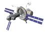

# Nautilus-X
> 2019.03.20 [🚀](../index/index.md) [despace](index.md) → [косм.города‑бублики.md](rwss.md), **[Project](project.md)**

[TOC]

---

> <small>**Nautilus-X** — англоязычный термин, не имеющий аналога в русском языке. **Наутилус‑Икс** — дословный перевод с английского на русский.</small>

**Nautilus-X** *(Non‑Atmospheric Universal Transport Intended for Lengthy United States Exploration)* rotating wheel space station concept developed by engineers Mark Holderman and Edward Henderson of the Technology Applications Assessment Team of NASA.

The concept was first proposed in 2011.01 for long‑duration (1 to 24 months) exo‑atmospheric space journeys for a six‑person crew. In order to limit the effects of microgravity on human health, the spacecraft would be equipped with a centrifuge. The Nautilus-X design concept did not advance beyond the initial drawings and proposal.

|<small>*Nautilus-X spacecraft*</small>|
|:--|
||

## Objectives
The original goal of Nautilus-X was to be a stopover to long‑term missions for the Moon or Mars. To ease route planning of the whole mission, the station would be placed at the Lagrange point L1 or L2 of the Moon or Mars, depending on which location is to be visited.

It would also have served as an emergency station and hospital for current mission crews.

Other objectives included:

   - Self‑sustained for long‑duration missions with crews as large as 6.
   - Support manned landing missions.
   - Satisfy requirements of NASA Authorization Act of 2010.

## Description
**Design**

The proposal notionally included a 6.5 by 14 metre main corridor, a rotating habitable centrifuge, inflatable modules for logistical stores and crew use, solar power arrays, and a reconfigurable thrust structure.

The design was modular, enabling it to accommodate any of a number of mission specific propulsion modules, manipulator arms, docking port for an Orion or commercial crew capsule, and landing craft for destination worlds. In theory the engines and fuel could be swapped out depending on the mission. The proposal also had an industrial slide‑out airlock unit and a command, control and observation deck.

On the other end of the docking port would have been the spacecraft’s centrifuge equipped with an external dynamic ring‑flywheel. Behind the centrifuge would be water and slush hydrogen tanks, which could mitigate the dangers of cosmic radiation for the crew, to a certain degree. In the aft of the craft are the communication and propulsion systems.

The standard version of Nautilus-X had only three inflatable modules. The Extended Duration Explorer variant on the Nautilus-X design concept would have several more, plus docking bays for science payloads and away‑mission vehicles.

**Technologies**

In order to deploy this massive spacecraft as easily as possible, it would consist of a variety of rigid and inflatable modules and solar dynamic arrays. The expandable modules are based on the technology used by the inflatable living quarters proposed by Bigelow Aerospace, which has continued the development of inflatable modules initially designed and developed by NASA.

**Attributes:**

   - Robust Environmental Control and Life Support and communication suite
   - Large storage volumes (for food, mechanical parts or medical supplies)
   - Real‑time visual command & observe capability for crew
   - Low crew irradiation
   - Semi‑autonomous integration of multiple mission specific propulsion units

 

## Docs & links (TRANSLATEME ALREADY)
|Navigation|
|:--|
|**[FAQ](faq.md)**【**[SCS](scs.md)**·КК, **[SC (OE+SGM)](sc.md)**·КА】**[CON](contact.md)·[Pers](person.md)**·Контакт, **[Ctrl](control.md)**·Упр., **[Doc](doc.md)**·Док., **[EF](ef.md)**·ВВФ, **[Error](error.md)**·Ошибки, **[Event](event.md)**·События, **[FS](fs.md)**·ТЭО, **[HF&E](hfe.md)**·Эрго., **[KT](kt.md)**·КТ, **[Model](model.md)**·Модель, **[N&B](nnb.md)**·БНО, **[Patent](патент.md)**·Пат., **[Project](project.md)**·Проект, **[QM](qm.md)**·БКНР, **[R&D](rnd.md)**·НИОКР, **[SI](si.md)**·СИ, **[Test](test.md)**·ЭО, **[TRL](trl.md)**·УГТ, **[Way](way.md)**·Пути|
|*Sections & pages*|
|**【】**  <mark>NOCAT</mark>|

   1. Docs: …
   1. Notable interwikies — …
   1. <https://en.wikipedia.org/wiki/Nautilus-X>
