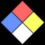
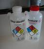

# NFPA 704
> 2019.05.12 ┊ **🚀 [despace](index.md)** → **[Безопасность](rams.md)**

[TOC]

---

**NFPA 704** — стандарт, поддерживаемый американской Национальной ассоциацией противопожарной защиты *(англ. National Fire Protection Association, NFPA)*. Он определяет т.н. «**fire diamond**», используемый персоналом аварийных служб для быстрого определения рисков, связанных с рядом [опасных материалов](rams.md). Это помогает определить, какое специальное оборудование, процедуры и меры предосторожности следует использовать при первой помощи и чрезвычайных ситуациях.

|*fire diamond*   |*Две бутылки, помеченные кодом NFPA 704*  |
|:--|:--|
|   |   |

## Система обозначений
Четыре поля, обычно обозначенные цветом, из которых синее обозначает опасность для здоровья, красное — огнеопасность, жёлтое — химическую стабильность и белое выделено для специальных кодов отдельных опасностей. Первые три категории оцениваются по шкале от 0 (нет опасности, стабильное вещество) до 4 (серьёзный риск вплоть до летального исхода).

|*Цвет*|*№*|*Описание*|
|:--|:--|:--|
|**Опасность для здоровья (синее)**  |  4  |Очень кратковременное воздействие может вызвать смерть или крупные остаточные повреждения (например, синильная кислота, фосфин)  |
|  |  3  |Кратковременное воздействие может привести к серьёзным временным или умеренным остаточным последствиям (например, хлор, серная кислота)  |
|  |  2  |Интенсивное или продолжительное, но не хроническое воздействие может привести к временной потере трудоспособности или возможным остаточным повреждениям (например, диэтиловый эфир)  |
|  |  1  |Воздействие может вызвать лишь раздражение с минимальными остаточными повреждениями (например, ацетон)  |
|  |  0  |Не представляет опасности для здоровья, не требует мер предосторожности (например, ланолин, пищевая сода)  |
||||
|**Огнеопасность (красное)**  |  4  |Быстро или полностью испаряется при нормальном атмосферном давлении и температуре или легко рассеивается в воздухе и легко возгорается (например, пропан). Температура вспышки ниже 23 °C (73 °F)  |
|  |  3  |Жидкости и твёрдые вещества, способные воспламеняться почти при температуре внешней среды (например, бензин). Температура вспышки между 23 °C (73 °F) и 38 °C (100 °F)  |
|  |  2  |Для воспламенения необходим некоторый нагрев или относительно высокая температура воздуха (например, дизельное топливо). Температура вспышки между 38 °C (100 °F) и 93 °C (200 °F)  |
|  |  1  |Следует нагреть перед воспламенением (например, соевое масло). Температура вспышки выше 93 °C (200 °F)  |
|  |  0  |Негорючее вещество (например, вода)  |
||||
|**Нестабильность, реакционно‑способность (жёлтое)**  |  4  |Способно к детонации или взрывному разложению при нормальной температуре и давлении (например, нитроглицерин, гексоген)  |
|  |  3  |Способно к детонации или взрывному разложению, но требует начального источника, должно быть нагрето в замкнутом пространстве, реагирует с водой со взрывом или детонирует при сильном ударе. (например, нитрат аммония)  |
|  |  2  |Подвергается серьёзным химическим изменениям при повышенной температуре и давлении, бурно реагирует с водой или может образовывать взрывчатые смеси с водой (например, фосфор, калий, натрий)  |
|  |  1  |Обычно стабильное, но может стать неустойчивым при повышенных температуре и давлении (например, пероксид водорода, гидрокарбонат натрия)  |
|  |  0  |Стабильно даже при действии открытого пламени и не реагирует с водой. (например, гелий)  |

**Белое — Специальное.**  
Белое поле «специальных обозначений» может содержать некоторые символы. Следующие символы определены стандартом NFPA 704:

   - W: реагирует с водой необычным или опасным образом (например, цезий, натрий, рубидий)
   - OX или OXY: окислитель (например, перхлорат калия, нитрат аммония)
   - SA: просто удушающий (не поддерживающий дыхание) газ (включая азот, гелий, неон, аргон, криптон, ксенон)

**Нестандартные символы:**  
Примечание: Эти символы не являются частью стандарта NFPA 704, но иногда используются на неофициальной основе. Использование неофициальных символов может требоваться, быть разрешено или запрещено полномочными органами (например, пожарными).
   - COR (англ. Corrosive): Едкое; сильная кислота/основание (серная кислота, гидроксид калия и пр.)
   - ACID (англ. Acid) и ALK (англ. Alkali) для большей конкретики.
   - BIO: Биологическая опасность (например, вирус натуральной оспы)
   - POI: (англ. Poison): Ядовито (например, пчелиный яд),
   - ☢ Трилистник радиации: Радиоактивно (например, плутоний, уран)
   - CRY или CRYO (англ. Cryogenic): Низкая температура (например, жидкий азот)

 

## Docs & links (TRANSLATEME ALREADY)
|…°·•¹²³±×÷≤≥≈≠ ‑ −— ⎆✉ ❐“”’«»✔→✘☐☑├┕┆ 1 lb = 0.453592 kg; 1 g = 9.80665 m/s²|
|:--|
|<small>**[FAQ](faq.md)**, **[Cable](cable.md)**·БКС, **[Camera](camera.md)**·Камера, **[Comms](comms.md)**·Радиосв., **[Contact](contact.md)**·Контакт, **[Control](control.md)**·Управ., **[Doc](doc.md)**·Док., **[Doppler](doppler.md)**·ИСР, **[DS](ds.md)**·ЗУ, **[EB](eb.md)**·ХИТ, **[ECO](ecology.md)**·Экол., **[EF](ef.md)**·ВВФ, **[ElC](elc.md)**·ЭКБ, **[EMC](emc.md)**·ЭМС, **[Errors](error.md)**·Ошибки, **[Events](event.md)**·События, **[FS](fs.md)**·ТЭО, **[Fuel](fuel.md)**·Топливо, **[GNC](gnc.md)**·БКУ, **[GS](scs.md)**·НС, **[HF&E](hfe.md)**·Эргоном., **[IMU](imu.md)**·Гироскоп, **[Incubator](incubator.md)**·Инкуб., **[KT](kt.md)**·КТЕХ, **[LAG](lag.md)**·ПУC, **[LES](les.md)**·САСП, **[LS](ls.md)**·СЖО, **[LV](lv.md)**·РН, **[MAG](mag.md)**·Магнитом., **[MCC](mcc.md)**·ЦУП, **[Model](model.md)**·Модель, **[MSC](sc.md)**·ПКА, **[N&B](nnb.md)**·БНО, **[NR](nr.md)**·ЯР, **[OBC](obc.md)**·ЦВМ, **[OE](oe.md)**·БА, **[Patent](патент.md)**·Патент, **[Project](project.md)**·Проект, **[PS](ps.md)**·ДУ, **[QA](quality.md)**·QA, **[R&D](rnd.md)**·НИОКР, **[RAMS](rams.md)**·НиБ, **[Risk](risk.md)**·Риск, **[Robot](robotics.md)**·Робот, **[Rover](rover.md)**·Планетоход, **[RTG](rtg.md)**·РИТЭГ, **[RW](rw.md)**·ДМ, **[SARC](sarc.md)**·ПСК, **[Sensor](sensor.md)**·Датчик, **[SC](sc.md)**·КА, **[SCS](scs.md)**·КК, **[SGM](sgm.md)**·КММ, **[SI](si.md)**·СИ, **[Soft](soft.md)**·ПО, **[SP](sp.md)**·БС, **[Spaceport](spaceport.md)**·Космодром, **[SPS](sps.md)**·СЭС, **[SSS](sss.md)**·ГЗУ, **[TCS](tcs.md)**·СОТР, **[Test](test.md)**·ЭО, **[Timeline](timeline.md)**·Циклограмма, **[TMS](tms.md)**·ТМС, **[TOR](tor.md)**·ТЗ, **[TRL](trl.md)**·УГТ</small>|
|*Sections & pages*|
|**`Безопасность:`**  [NFPA 704](nfpa_704.md) ┊ [Класс опасности](danger_goods.md) ┊ [Класс чистоты](clean_lvl.md) |

**Docs:**

   1. …

**Links:**

   1. Notable interwikies — …
   1. <https://en.wikipedia.org/wiki/NFPA_704>
   1. <https://ru.wikipedia.org/wiki/NFPA_704>

