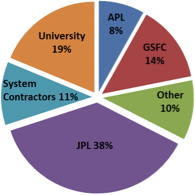

# NICM
> 2019.11.26 ┊ **🚀 [despace](index.md)** → **[ТЭО](fs.md)**

[TOC]

---

> <small>*Термины:* **NASA Instrument Cost Model (NICM)** — англоязычный термин, не имеющий аналога в русском языке. **Модель стоимость инструментов НАСА** — дословный перевод с английского на русский.</small>

The **NASA Instrument Cost Model (NICM)** is a probabilistic cost estimation tool that contains a system model, a subsystem model, & a database search engine. NICM is an MS Excel based tool & utilizes VBA macros.

## Описание
NICM is a proven [NASA](03_nasa.md) cost estimation tool that enhances current instrument cost modeling capabilities by providing cost estimates at both the system & subsystem level. NICM is sponsored by CAD & co‑sponsored by [JPL](03_jpl.md). The JPL Development Team provides the core analysis support for NICM including data collection, methodology development, maintenance, & training. Since 2004, NICM has grown to include data on more than 260 instruments. Version 2 released in 2007, Version 7 Rev 2 Released 2016. NICM also:

   - Contains an normalized instrument database (for civil servants)
   - Estimates cost and schedule phase breakdowns
   - Estimates schedule
   - Supports JCL

NICM is in wide use across many NASA centers (and any organization proposing instruments for NASA Instruments, and proposal evaluators) & is available under access release restrictions to external organizations. NICM is available for download from ONCE for NASA Civil Servants & NASA Contractors on a current NASA contract.  New users can request NICM or learn more by emailing: <NICM@jpl.nasa.gov>

|*Figure 1 The NICM Database of Normalized Instruments by Instrument Lead Org*|*Figure 2 Cluster Analysis Example of NICM Instrument Dataset*|
|:--|:--|
|  |  |

 

## Docs & links (TRANSLATEME ALREADY)
|…°·•¹²³±×÷≤≥≈≠ ‑ −— ⎆✉ ❐“”’«»✔→✘☐☑├┕┆ 1 lb = 0.453592 kg; 1 g = 9.80665 m/s²|
|:--|
|<small>**[FAQ](faq.md)**, **[Cable](cable.md)**·БКС, **[Camera](camera.md)**·Камера, **[Comms](comms.md)**·Радиосв., **[Contact](contact.md)**·Контакт, **[Control](control.md)**·Управ., **[Doc](doc.md)**·Док., **[Doppler](doppler.md)**·ИСР, **[DS](ds.md)**·ЗУ, **[EB](eb.md)**·ХИТ, **[ECO](ecology.md)**·Экол., **[EF](ef.md)**·ВВФ, **[ElC](elc.md)**·ЭКБ, **[EMC](emc.md)**·ЭМС, **[Errors](error.md)**·Ошибки, **[Events](event.md)**·События, **[FS](fs.md)**·ТЭО, **[Fuel](fuel.md)**·Топливо, **[GNC](gnc.md)**·БКУ, **[GS](scs.md)**·НС, **[HF&E](hfe.md)**·Эргоном., **[IMU](imu.md)**·Гироскоп, **[Incubator](incubator.md)**·Инкуб., **[KT](kt.md)**·КТЕХ, **[LAG](lag.md)**·ПУC, **[LES](les.md)**·САСП, **[LS](ls.md)**·СЖО, **[LV](lv.md)**·РН, **[MAG](mag.md)**·Магнитом., **[MCC](mcc.md)**·ЦУП, **[Model](model.md)**·Модель, **[MSC](sc.md)**·ПКА, **[N&B](nnb.md)**·БНО, **[NR](nr.md)**·ЯР, **[OBC](obc.md)**·ЦВМ, **[OE](oe.md)**·БА, **[Patent](патент.md)**·Патент, **[Project](project.md)**·Проект, **[PS](ps.md)**·ДУ, **[QA](quality.md)**·QA, **[R&D](rnd.md)**·НИОКР, **[RAMS](rams.md)**·НиБ, **[Risk](risk.md)**·Риск, **[Robot](robotics.md)**·Робот, **[Rover](rover.md)**·Планетоход, **[RTG](rtg.md)**·РИТЭГ, **[RW](rw.md)**·ДМ, **[SARC](sarc.md)**·ПСК, **[Sensor](sensor.md)**·Датчик, **[SC](sc.md)**·КА, **[SCS](scs.md)**·КК, **[SGM](sgm.md)**·КММ, **[SI](si.md)**·СИ, **[Soft](soft.md)**·ПО, **[SP](sp.md)**·БС, **[Spaceport](spaceport.md)**·Космодром, **[SPS](sps.md)**·СЭС, **[SSS](sss.md)**·ГЗУ, **[TCS](tcs.md)**·СОТР, **[Test](test.md)**·ЭО, **[Timeline](timeline.md)**·Циклограмма, **[TMS](tms.md)**·ТМС, **[TOR](tor.md)**·ТЗ, **[TRL](trl.md)**·УГТ</small>|
|*Sections & pages*|
|**`Технико‑экономическое обоснование (ТЭО):`**  [NICM](nicm.md) ┊ [Невозвратные затраты](sunk_cost.md) ┊ [Номинал](nominal.md) ┊ [Оценка стоимости работ на НПОЛ](03_lav.md) ┊ [Секвестр](budget_seq.md) ┊ [Стоимость аппарата в граммах](sc_price.md) |

**Docs:**

   1. [Cost systems comparison ❐](f/fs/cost_systems_comparison_2004.pdf) (2004, ESA)
   1. [NICM, impact of mission class on cost ❐](f/fs/nicm_2016symposium.pdf) (2016, NASA JPL)

**Links:**

   1. Notable interwikies — …
   1. <https://www.nasa.gov/offices/ocfo/functions/models_tools/nicm>
