# Баллистико‑навигационное обеспечение
> 2019.05.02 ┊ **🚀 [despace](index.md)** → [GNC](gnc.md), **[БНО](nnb.md)**, [ДУ](ps.md), [Control](control.md)

[TOC]

---

> <small>*Термины:* **Баллистико‑навигационное обеспечение (БНО)** — русскоязычный термин. **Navigation & ballistics (NB)** — англоязычный эквивалент.</small>

**Баллистико‑навигационное обеспечение (БНО)** — математическая модель и комплекс мероприятий по построению траектории движения [космического аппарата](sc.md).

## Описание
Включает в себя вопросы:

   - [Апоцентр и перицентр](apopericentre.md)
   - орбит;
   - траекторий взлёта;
   - траекторий посадки.

<mark>TBD</mark> Перелёт через L2 к Луне:

   1. Перелёт Земля‑L2 — 25 суток;
   1. L2 (может быть без подпунктов вообще, тогда время пребывания равно 7);
      1. 1 виток по галоорбите — 14 суток;
      1. сход с галоорбиты в сторону Луны — 7 суток;
   1. Перелёт L2-Луна — 11 суток.

### Скорости
[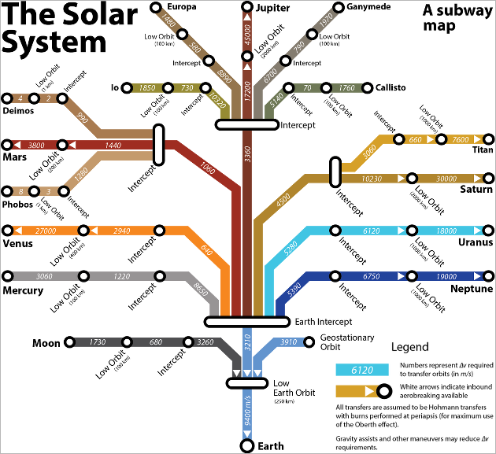](f/nav/solar_system_subway_map.png)

### Производители
   - **РФ:**
      1. [ИПМ Келдыша](03_keldysh_ipm.md)

---

## Орбиты
> <small>*Термины:* **Орбита** — русскоязычный термин. **Orbit** — англоязычный эквивалент.</small>

**Орби́та** *(от лат. orbita — колея, дорога, путь)* — траектория движения материальной точки в наперёд заданной системе пространственных координат для заданной в этих координатах конфигурации поля сил, которые на неё действуют.

В небесной механике это траектория небесного тела в гравитационном поле другого тела, обладающего значительно большей массой (планеты, кометы, астероида в поле звезды). В прямоугольной системе координат, начало которой совпадает с центром масс, траектория может иметь форму конического сечения (окружности, эллипса, параболы или гиперболы); его фокус совпадает с центром масс системы.

**Классификация:**

   - По геометрической форме делятся на круговые и эллиптические, с тем или иным эксцентриситетом. Также существует разделение на замкнутые и незамкнутые орбиты, в особенности для КЛА.
   - По углу наклонения i плоскости орбиты к плоскости земного экватора — на экваториальные (i = 0°), полярные (i = 90°) и наклонные (i — любое, кроме 0° и 90°).
   - По соотношению периода обращения Тоб вокруг земного шара с земными или солнечными сутками — на не синхронные, квазисинхронные, синхронно‑суточные (геосинхронные), солнечно‑синхронные.

|*№*|*Страница*|
|:--|:--|
| | [Апоцентр и перицентр](apopericentre.md) ┊ [Грав.манёвр](gravass.md) ┊ Кеплеровы элементы (аргумент перицентра ┊ большая полуось ┊ долгота восходящего узла ┊ наклонение ┊ средняя аномалия ┊ эксцентриситет)
|**В:**  | Высокая эллиптическая орбита (ВЭО)  |
|**Г:**  | Гелиоцентрическая орбита ┊ Геосинхронная орбита (ГСО) ┊ Геопереходная орбита (ГПО) ┊ Геостационарная орбита (ГСО) ┊ Геоцентрическая орбита (ГЦО)  |
|**К:**  | Квази‑геостационарная орбита (КГО)  |
|**Н:**  | Низкая опорная орбита (НОО)  |
|**С:**  | Синхронная орбита (СО) ┊ Солнечно‑синхронная орбита (ССО)  |
|| [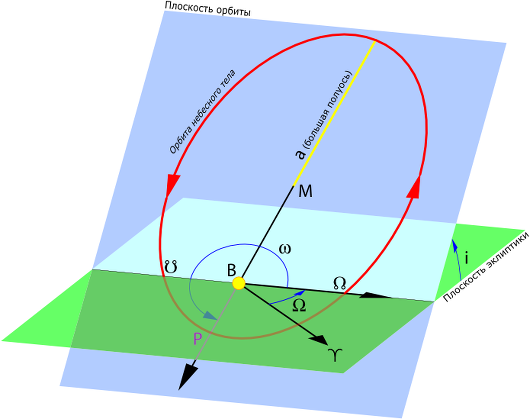 |

### Кеплеровы орбиты
Долго считалось, что планеты должны иметь круговую орбиту. После долгих и безуспешных попыток подобрать круговую орбиту для Марса, Кеплер отверг данное утверждение и, впоследствии, используя данные измерений Тихо Браге сформулировал 3 закона, описывающих орбитальное движение тел.

[Кеплеровыми элементами орбиты](keplerian.md) являются:

   1. большая полуось (**a**)
   1. эксцентриситет (**e**)
   1. наклонение (**i**)
   1. долгота восходящего узла (**Ω**)
   1. аргумент перицентра (**ω**)
   1. средняя аномалия (**Mₒ**)

Первые два определяют форму орбиты, третий, четвёртый и пятый — ориентацию плоскости орбиты по отношению к базовой системе координат, шестой — положение тела на орбите.  
Эти элементы однозначно определяют орбиту независимо от её формы (эллиптической, параболической или гиперболической). Основной координатной плоскостью может быть плоскость эклиптики, галактики, земного экватора и т.д. Тогда элементы орбиты задаются относительно выбранной плоскости.

### Узел орбиты
> <small>*Термины:* **Узел орбиты** — русскоязычный термин. **Orbital node** — англоязычный эквивалент.</small>

**Узел орбиты** — одна из двух диаметрально противоположенных точек небесной сферы, в которых орбита какого‑либо небесного тела пересекается с некоторой условной плоскостью, выступающей как система отсчёта, а также геоцентрическая проекция этой точки на небесную сферу. Таковой плоскостью для планет Солнечной системы и Луны является плоскость эклиптики. Для отслеживания ИСЗ обычно используют экваториальную систему координат и, соответственно, плоскость небесного экватора. Поскольку таких точек две, различают восходящий и нисходящий узлы орбиты.
   - **Восходящий узел орбиты** (северный) — точка, в которой движущееся по орбите тело пересекает условную плоскость в северном направлении (то есть переходит из южного полушария небесной сферы в северное). Название связано с тем, что для наблюдателя в северном полушарии движение происходит снизу вверх, то есть является «восходящим».
   - **Нисходящий узел орбиты** (южный) — точка, в которой движущееся по орбите тело пересекает условную плоскость в южном направлении (то есть переходит из северного полушария небесной сферы в южное), он обозначается перевёрнутым символом знака Льва, или (чаще) исторически производным от него символом ☋. Название связано с тем, что для наблюдателя в северном полушарии движение происходит сверху вниз, то есть является «нисходящим».

||
|:--|
|   |
|Плоскости орбиты и эклиптики с надписанным восходящим узлом орбиты, нисходящий узел орбиты — дальняя точка пересечения этих плоскостей.  |

Условной плоскостью здесь в большинстве случаев является эклиптика, реже небесный экватор. Относительно избранной плоскости в обоих случаях определяются и небесные полушария. Иногда саму эклиптику, то есть годовой путь Солнца по небесной сфере, фактически являющийся проекцией орбиты самой Земли, рассматривают в отношении небесного экватора, в этом смысле иногда называют точку весеннего равноденствия «восходящим узлом эклиптики», а осеннего — «заходящим».

В астрономии планетные узлы имеют большое значение. Долгота восходящего узла — один из шести физических элементов орбиты, определяющих положение в пространстве тела, обладающего орбитальным движением. Такое явление, как прохождение Меркурия или Венеры по диску Солнца, имеет место при нижнем соединении соответствующей планеты с Солнцем, когда оно происходит в непосредственной близости от одного из узлов этой планеты. Солнечное затмение имеет место, когда геоцентрическое соединение Луны и Солнца (то есть новолуние) происходит вблизи одного из лунных узлов, а лунное затмение — когда вдоль оси этих узлов происходит их противостояние (то есть полнолуние). Все перечисленные явления оказываются возможны потому, что в этих ситуациях три небесных тела выстраиваются в пространстве практически точно в одну линию.

 

## Trans-Mars injection
> <small>*Термины:* **Trans-Mars injection (TMI)** — англоязычный термин, не имеющий аналога в русском языке. **Выход на орбиту Марса** — дословный перевод с английского на русский.</small>

||
|:--|
| 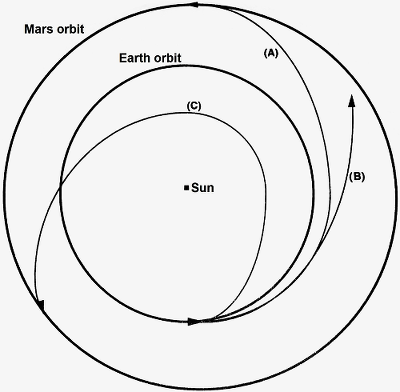 |
|Trans-Mars injection diagram.  A = Hohmann transfer orbit.  B = Conjunction mission.  C = Opposition mission |

A **trans-Mars injection (TMI)** is a heliocentric orbit in which a propulsive maneuver is used to set a spacecraft on a trajectory, also known as Mars transfer orbit, which will cause it to arrive at Mars.

Every two years, low-energy transfer windows open up which allow movement between planets with the lowest possible delta-v requirements. Transfer injections can place spacecraft into either a Hohmann transfer orbit or bi-elliptic transfer orbit. Trans-Mars injections can be either a single maneuver burn, such as that used by the NASA MAVEN orbiter, or a series of perigee kicks, such as that used by the ISRO Mars Orbiter Mission.

 

## Высокая эллиптическая орбита
**Высокая эллиптическая орбита (ВЭО)**, англ. **highly elliptical orbit (HEO)** — также «Квази‑геостационарная орбита» — это тип эллиптической орбиты, у которой высота в апогее во много раз превышает высоту в перигее.

||
|:--|
|  |
|Типичная орбита КА «Молния». Красными точками отмечено  время движения спутника по орбите в часах  |

**Предназначение.**

По законам Кеплера спутники, использующие высокие эллиптические орбиты, двигаются с очень высокой скоростью в перигее, а затем сильно замедляются в апогее. Когда КА находится близко от апогея, у наземного наблюдателя создаётся впечатление, что спутник почти не двигается в течение нескольких часов, то есть его орбита становится квази‑геостационарной. В течение 3.5 часов сигнал с него можно принимать на антенну диаметром 0.6 м без использования поворотного устройства. С другой стороны, точка квази‑геостационара может быть расположена над любой точкой земного шара, а не только над экватором, как у геостационарных спутников. Это свойство используется в северных и южных широтах, сильно удалённых от экватора (выше 76—78° с.ш./ю.ш.), где угол места геостационарных спутников может быть очень низким, или даже отрицательным. В этих зонах приём с геостационарного спутника сильно затруднён или вовсе невозможен, и спутники на высокоэллиптических орбитах являются единственной возможностью обеспечить обслуживание. Углы мест у высокоэллиптических спутников превышают 40° на краях зоны обслуживания и достигают 90° в её центре.

Орбиты ВЭО могут иметь любое наклонение, но часто имеют наклонение близкое к 63.435° для обнуления возмущения вызванного неправильной формой Земли, похожей на сплюснутый эллипсоид. При использовании такого наклонения орбита стабилизируется.

У эллиптических орбит аргумент перигея, находящийся между 180° и 360°, означает, что апогей находится над Северным полушарием. Напротив, аргумент перигея между 0° и 180° означает, что апогей находится над Южным полушарием. Апогей орбиты с аргументом перигея 0° или 180° будет находиться точно над экватором, что с практической точки зрения не имеет смысла, поскольку в этом случае дешевле и проще использовать КА на геостационарной орбите (понадобится всего лишь один спутник вместо трёх).

**Достоинства и недостатки.**

Спутники на ВЭО обладают следующими достоинствами:

   - возможность обслуживания очень большой территории. Так, например, такая система может обслуживать всю территорию России;
   - обслуживание в высоких широтах. Угол места в этих зонах у систем на ВЭО гораздо больше, чем у геостационарных спутников;
   - широкое использование различных частотных диапазонов на ВЭО без регистрации (в отличие от геостационарной орбиты, где уже практически не осталось свободного места и частот);
   - более дешевый вывод на орбиту (примерно в 1.8 раза).

В то же время, в настоящее время у систем на высокоэллиптических орбитах больше недостатков чем достоинств. К недостаткам относятся:

   - необходимость иметь по крайней мере три спутника на орбите (вместо одного геостационарного) для создания квази‑геостационарной системы. В случае обеспечения круглосуточного непрерывного вещания, количество КА возрастает до семи;
   - приемная антенна должна обладать функцией слежения (привод). Поэтому стоимость такой антенны и стоимость её обслуживания будут выше, чем у фиксированной антенны;
   - в высоких широтах плотность населения гораздо ниже чем в средних районах, поэтому вопрос окупаемости такой системы очень сомнителен;
   - апогей спутников на ВЭО выше, чем у ГСО, поэтому мощность передатчиков должна быть выше, до 400—500 Вт. Это удорожает спутники;
   - орбита спутников на ВЭО обычно пересекает радиационные пояса, что сильно сокращает срок службы КА. Для того чтобы избавиться от этой проблемы, необходимо иметь орбиту с апогеем около 50 000 км и перигеем около 20 000 км то есть использовать орбиту «Тундра»;
   - так как КА движутся по орбите, эффект Доплера создает трудности для приемников на Земле;
   - из‑за большого времени распространения сигнала, возникают сложности при использовании приложений, работающих в реальном масштабе времени, такими как телефония.

 

## Гелиоцентрическая орбита
**Гелиоцентрическая орбита**, англ. **heliocentric orbit или circumsolar orbit** — эллиптическая траектория движения небесного тела вокруг [Солнца](солнца.md). Один из двух фокусов эллипса, по которому движется небесное тело, совпадает с центром Солнца.

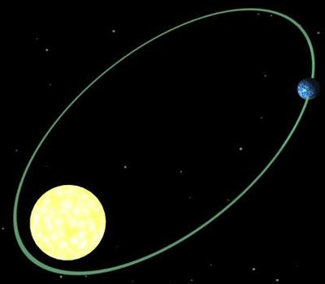

При движении небесного тела под действием силы притяжения звезды его полная энергия E и момент импульса L относительно этой звезды сохраняются:

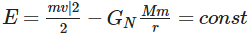

где v — скорость тела, r — радиус‑вектор, проведённый из центра звезды к телу, M — масса звезды, m — масса небесного тела. В полярной системе координат эти уравнения имеют вид:

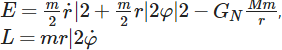

где использованы следующие представления для скорости и момента импульса:

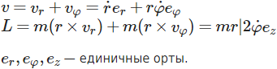

 

## Геопереходная орбита
**Геопереходная орбита (ГПО)**, англ. **geosynchronous transfer orbit** или **geostationary transfer orbit (GTO)** — орбита, являющаяся переходной между НОО (высота порядка 200 км) и геостационарной орбитой (ГСО) (35 786 км). В отличие от НОО и ГСО, которые в первом приближении являются круговыми, переходная орбита — это сильно вытянутая эллиптическая траектория движения КА, перигей которой лежит на расстоянии НОО от Земли, а апогей на расстоянии ГСО (орбита Гомана — Ветчинкина).

Завершение вывода КА на ГСО происходит, когда он достигает апогея при движении по геопереходной орбите. В этот момент разгонный блок сообщает аппарату разгонный импульс, который превращает его эллиптическое движение в круговое с периодом обращения вокруг Земли, равным одним суткам.

**Использование.**

ГПО используется для исследовательских спутников, таких как [Спектр‑Р](спектр_р.md), а также для телекоммуникационных спутников и мультимедиа передачи данных. Вытянутая элипсовидная орбита даёт долгое время нахождения над определённой территорией, апогей выбирается, исходя из времени прохождения сигнала до спутника и обратно, обычно не превышает 40 000 км для телекоммуникационных спутников, для спутника *Спектр‑Р* апогей равен 340 000 км, это сделано для получения снимков высокого разрешения, при помощи метода радиолокационного синтезирования апертуры.

Для беспрерывного покрытия Земли сигналами спутников требуется минимум 3 спутника, запущенных с интервалом обращения по орбите 8 часов.

 

## Геосинхронная орбита
**Геосинхро́нная орби́та (ГСО)**, англ. **geosynchronous orbit (GSO)** — орбита вращающегося вокруг Земли КА, на которой период обращения равен звёздному периоду вращения Земли — 23 час. 56 мин. 4.1 с.

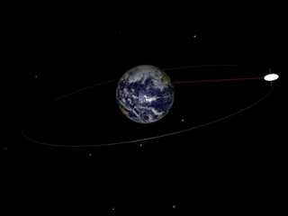

Частным случаем является Геостационарная орбита — круговая орбита, лежащая в плоскости земного экватора, для которой спутник в небе (для земного наблюдателя) практически неподвижен. Геостационарная орбита имеет радиус 42 164 км с центром, совпадающим с центром Земли, что соответствует высоте над уровнем моря 35 786 км.

Если орбита имеет отличное от нуля наклонение и нулевой эксцентриситет, то при наблюдении с Земли спутник в течение суток описывает на небе восьмёрку. Если же наклонение и эксцентриситет отличны от нуля, то восьмёрка может, в зависимости от конкретных величин наклонения и эксцентриситета выродиться в эллипс (спутники серии Canyon) или в отрезок прямой, лежащий в плоскости экватора (при ненулевом эксцентриситете и нулевом наклонении, например такая орбита у разгонных блоков DM-SL).

Первым спутником связи на геосинхронной орбите являлся «Syncom-2», запущенный США 26 июля 1963 года. Иногда вывод на геосинхронную орбиту вызван тем, что у ракеты‑носителя, которым был запущен спутник, не хватает энергии для того, чтобы вывести этот КА прямо на Геостационарную орбиту.

**Характеристики орбиты.**

У всех геосинхронных орбит (как у круговых, так и у эллиптических) большая полуось равна 42 164 км. Для любого орбитального периода P размер большой полуоси a вычисляется по формуле:

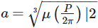

где μ = G·M — Геоцентрическая гравитационная постоянная (англ.), равная 398 600,4418 km³/с², произведение массы Земли на гравитационную постоянную.

В частном случае ГСО, треком ИСЗ является единственная точка на экваторе. В общем случае ГСО с ненулевым наклонением или эксцентриситетом, трек представляет собой более‑менее искажённую «8».

 

## Геостационарная орбита
**Геостациона́рная орби́та (ГСО)**, англ. **geostationary orbit, geostationary Earth orbit или geosynchronous equatorial orbit (GEO)** — круговая орбита, расположенная над экватором Земли (0° широты), находясь на которой, искусственный спутник обращается вокруг планеты с угловой скоростью, равной угловой скорости вращения Земли вокруг оси. В горизонтальной системе координат направление на спутник не изменяется ни по азимуту, ни по высоте над горизонтом, спутник «висит» в небе неподвижно. Поэтому спутниковая антенна, однажды направленная на такой спутник, всё время остаётся направленной на него. Геостационарная орбита является разновидностью геосинхронной орбиты и используется для размещения искусственных спутников (коммуникационных, телетрансляционных и т.п.).

Геостационарная орбита (GEO) — это круговая геосинхронная орбита в плоскости земного экватора с радиусом около 42 164 км (измеряется от центра Земли). Спутник на такой орбите находится на высоте около 35 786 км от среднего уровня моря. Подобная орбита иногда также называется орбитой Кларка в честь Артура Кларка. Данные орбиты удобны для телекоммуникационных спутников.

Идеальная геостационарная орбита практически не достижима, так как ИСЗ находится на ней под действием нескольких дополнительных сил, например, солнечный ветер, давление электромагнитного излучения, притяжение со стороны Луны и Солнца; влиянием неоднородности гравитационного поля Земли. ИСЗ приходится производить различные маневры, чтобы оставаться на геостационарной орбите.

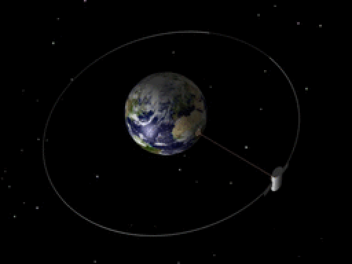

Спутник должен обращаться в направлении вращения Земли, на высоте 35 786 км над уровнем моря. Именно такая высота обеспечивает спутнику период обращения, равный периоду вращения Земли относительно звёзд (Звёздные сутки: 23 ч 56 мин 4.091 сек).

Преимущества геостационарной орбиты получили широкую известность после выхода в свет научно‑популярной статьи Артура Кларка в журнале «Wireless World» в 1945 году, поэтому на Западе геостационарная и геосинхронные орбиты иногда называются «орбитами Кларка», а «поясом Кларка» называют область космического пространства на расстоянии 36 000 км над уровнем моря в плоскости земного экватора, где параметры орбит близки к геостационарной. Первым спутником, успешно выведенным на ГСО, был Syncom‑3, запущенный NASA в августе 1964 года.

**Точка стояния.**  
Спутник на ГСО неподвижен относительно поверхности Земли, поэтому его положение на орбите называется точкой стояния. В результате, сориентированная на спутник и неподвижно закреплённая направленная антенна может сохранять постоянную связь с этим спутником длительное время.

**Недостатки геостационарной орбиты:**

   - **Задержка сигнала.** Связь через геостационарные КА характеризуется большими задержками в распространении сигнала. При высоте орбиты 35 786 км и скорости света около 300 000 km/s ход луча «Земля‑КА» требует около 0.12 с. Ход луча «Земля (передатчик) → КА → Земля (приемник)» ≈0.24 с. Полная задержка (измеряемая утилитой Ping) при использовании спутниковой связи для приёма и передачи данных составит почти полсекунды. С учётом задержки сигнала в аппаратуре ИСЗ, в аппаратуре и в кабельных системах передач наземных служб общая задержка сигнала на маршруте «источник сигнала → КА → приёмник» может достигать 2‑4 секунд. Такая задержка затрудняет применение КА на ГСО в телефонии и делает невозможной применение спутниковой связи с использованием ГСО в различных сервисах реального времени (например в онлайн‑играх).
   - **Солнечная интерференция.** Одним из самых неприятных недостатков ГСО является уменьшение и полное отсутствие сигнала в ситуации, когда солнце и КА‑передатчик находятся на одной линии с приёмной антенной (положение «Солнце за КА»). Данное явление присуще и другим орбитам, но именно на геостационарной, когда КА «неподвижен» на небе, проявляется особенно ярко. В средних широтах северного полушария солнечная интерференция проявляется в периоды с 22 февраля по 11 марта и с 3 по 21 октября, с максимальной длительностью до десяти минут. В такие моменты в ясную погоду солнечные лучи сфокусированные светлым покрытием антенны могут повредить (расплавить или перегреть) приёмо‑передающую аппаратуру спутниковой антенны.
   - **Невидимость ГСО с высоких широт.** Так как ГСО не видна с высоких широт (приблизительно от 81° до полюсов), а на широтах выше 75° наблюдается очень низко над горизонтом (в реальных условиях КА просто скрываются выступающими объектами и рельефом местности) и виден лишь небольшой участок орбиты (см. таблицу), то невозможна связь и телетрансляция с использованием ГСО в высокоширотных районах Крайнего Севера (Арктики) и Антарктиды. К примеру, американские полярники на станции Амундсен‑Скотт для связи с внешним миром (телефония, интернет) используют оптоволоконный кабель длиной 1 670 км до расположенной на 75° ю.ш. французской станции Конкордия, с которой уже видно несколько геостационарных спутников США.

Таблица наблюдаемого сектора ГСО в зависимости от широты места. Данные приведены в ° и их долях.

|*Широта  местности*| <small>*Видимый сектор  орбиты  теоретический*| <small>*Видимый сектор  орбиты реальный  (с учётом рельефа)*|
|:--|:--|:--|
|  90  |  —  |  —  |
|  82  |  —  |  —  |
|  81  |  29.7  |  —  |
|  80  |  58.9  |  —  |
|  79  |  75.2  |  —  |
|  78  |  86.7  |  26.2  |
|  75  |  108.5  |  77  |
|  60  |  144.8  |  132.2  |
|  50  |  152.8  |  143.3  |
|  40  |  157.2  |  149.3  |
|  20  |  161.5  |  155.1  |
|  0  |  162.6  |  156.6  |

Из вышележащей таблицы видно, например, что если на широте Санкт‑Петербурга (~60°) видимый сектор орбиты (и соответственно количество принимаемых спутников) равен 84 % от максимально возможного (на экваторе), то на широте полуострова Таймыр (~75°) видимый сектор составляет 49 %, а на широте Шпицбергена и мыса Челюскина (~78°) — лишь 16 % от наблюдаемого на экваторе. В этот сектор орбиты в районе Сибири попадает 1‑2 спутника (не всегда необходимой страны).

---

 

## Геоцентрическая орбита
**Геоцентрическая орбита** — траектория движения небесного тела по эллиптической траектории вокруг Земли. Один из двух фокусов эллипса, по которому движется небесное тело, совпадает с Землёй. Для того, чтобы космический корабль оказался на этой орбите, ему необходимо сообщить скорость, которая меньше второй космической скорости, но не меньше чем первая космическая скорость.

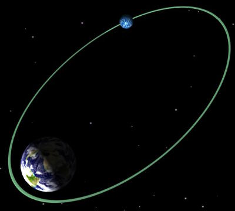

---

 

## Лиссажу
**Орбита Лиссажу** — квазипериодическая орбитальная траектория, по которой тело может двигаться вокруг [точки Лагранжа](l_points.md) в рамках задачи трёх тел без включения двигателей. Орбиты Ляпунова вокруг точек Лагранжа являются кривыми, лежащими в одной плоскости с двумя главными телами в системе трёх тел. Орбиты Лиссажу, напротив, включают участки как в этой плоскости, так и в перпендикулярной к ней, и следуют кривым Лиссажу. Гало‑орбиты также включают компоненты в перпендикулярной плоскости, но гало‑орбиты, в отличие от орбит Лиссажу, являются периодическими.

На практике, любая орбита вокруг точек Лагранжа L1, L2, L3 динамически неустойчива, и малые возмущения орбиты со временем возрастают. В результате космический аппарат должен включать двигатели для коррекции орбиты. В отсутствие других воздействий орбиты вокруг точек L4 и L5 (при отношении масс главных тел более 25) устойчивы, причём в случае возникновения отклонений от траектории возникает сила, возвращающая тело на орбиту вблизи точки Лагранжа. Такие орбиты могут всё же быть выведены из состояния устойчивости при наличии поблизости других массивных тел. Было выявлено, что точки L4 и L5 в системе Земля‑Луна будут устойчивы в течение миллиардов лет даже при учёте возмущений от Солнца; но при учёте возмущений от планет орбиты вокруг этих точек могут существовать только в течение нескольких миллионов лет.

**КА, использующие орбиты Лиссажу.**

Несколько космических миссий используют орбиты Лиссажу: ACE в точке Лагранжа L1 системы Солнце ‑ Земля, SOHO в точке Лагранжа L1 системы Солнце ‑ Земля, DSCOVR в точке Лагранжа L1 системы Солнце ‑ Земля, WMAP в точке Лагранжа L2 системы Солнце ‑ Земля и миссия Genesis, исследующая солнечные частицы, в точке Лагранжа L1. 14 мая 2009 года Европейское космическое агентство (ЕКА) осуществило запуск обсерваторий Herschel и Planck, находящихся на орбитах Лиссажу вокруг точки L2 системы Солнце ‑ Земля. Миссия Gaia также использует орбиту Лиссажу вокруг точки L2 системы Солнце ‑ Земля. В 2011 году НАСА перевело два из аппаратов THEMIS с орбиты вокруг Земли на орбиту вокруг Луны через две орбиты Лиссажу вокруг точек L1 и L2 системы Земля ‑ Луна. Китайский лунный модуль Чанъэ‑2 8 июня 2011 года покинул лунную орбиту и был переведён на орбиту Лиссажу вокруг точки L2 системы Солнце ‑ Земля до середины 2012 года, когда модуль должен был отправиться к астероиду Тутатис.

|*Пример траектории от Земли к орбите Лиссажу вокруг точки Лагранжа L2 в системе Солнце‑Земля. На нижней части иллюстрации, представляющей вид сбоку, Земля и Луна убраны для лучшего обзора траектории.*|
|:--|
| 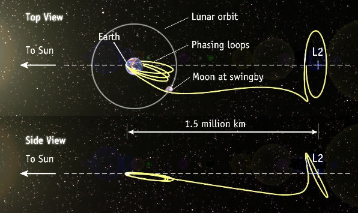 |
|···|
|**SC WMAP, Oblique view**|
| 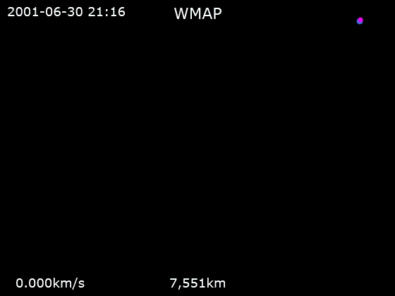 |
|···|
|**SC WMAP, Viewed from Earth**|
| 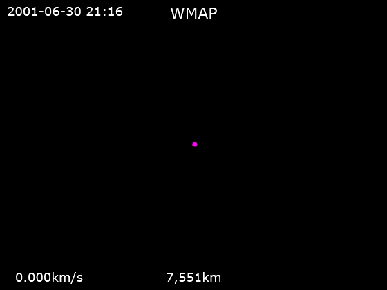 |

---

 

## «Молния»

**Орбита «Молния»** — один из типов высокой эллиптической орбиты с наклонением в 63,4°, аргументом перицентра −90° и периодом обращения в половину звёздных суток. Данный тип орбиты получил название по серии советских космических аппаратов «Молния» двойного назначения, впервые использовавших эту орбиту в своей работе.

Большую часть времени на орбите спутник проводит у апогея, который для орбиты «Молнии» проходит над северным полушарием. В точке апогея высота может достигать 40 тысяч километров, благодаря чему в сочетании с достаточно долгим нахождением вокруг апогея спутник прекрасно видим в северном полушарии, особенно на территории России и Канады. Данная особенность использовалась для построения сети ретрансляционных узлов «Орбита», покрывавшая всю территорию СССР. Чтобы покрыть всю территорию северного полушария, требуется по крайней мере три космических аппарата, в реальности использовалось четыре пары спутников «Молния», орбиты которых были смещены на 90° относительно друг друга.

||
|:--|
|  |
|Типичная орбита КА «Молния». Красными точками отмечено  время движения спутника по орбите в часах  |

**Особенности орбиты.**

Большая территория бывшего СССР и нынешней России расположена в высоких северных широтах. Организация телерадиовещания со спутников, расположенных на геостационарной орбите, для такой территории требует передатчиков бо́льшей мощности из‑за низкого угла наклонения. Напротив, орбита «Молнии» подходит гораздо лучше для таких регионов — угол наклонения для любой точки севернее 54,1° северной широты будет гарантированно больше 10°. Также вывод на данную орбиту требует меньше топлива, чем на геостационарную орбиту. Недостатком данного подхода является то, что для наземных станций необходима сложная система слежения за спутниками. Также космический аппарат четырежды за сутки проходит сквозь радиационный пояс ван Аллена, что в случае космических аппаратов «Молния» отрицательно сказалось на солнечных батареях и общем сроке службы аппарата.

Для полного покрытия территории РФ необходимо по крайней мере три КА, каждый из которых работает в течение восьми часов во время прохождения апогея. Так как Земля за 12 часов делает половину оборота вокруг своей оси, получается, что каждое второе прохождение апогея приходится на обслуживание Евразии, а другое — Северной Америки. Долгота апогея всех трёх аппаратов должна быть 90° западной и 90° восточной долготы, но каждый из них должен проходить точку спустя 8 часов после прохода предыдущего. В этом случае, когда аппарат проходит точку апогея +4 часа и покидает зону наиболее благоприятного вещания, следующий аппарат как раз входит в точку апогея −4 часа и продолжает вещание для обслуживаемого региона. Расстояние между аппаратами во время этой смены составляет 1500 километров (в угловых координатах — несколько градусов), поэтому ретрансляционной станции достаточно немного повернуть антенну, чтобы продолжить приём с нового спутника.

Из‑за приплюснутости земного эллипсоида в аргумент перицентра вносятся искажения, из‑за которых орбита спутника без корректировки будет постоянно меняться. Чтобы избежать лишней траты топлива, в орбите «Молния» используется угол наклонения в 63,4°, при котором искажения равны нулю.

**Использование.**

Впервые орбита с подобными параметрами была использована серией телекоммуникационных спутников «Молния‑1». После двух неудачных запусков в 1964 году на орбиту была выведена «Молния 1-01», запущенная 23 апреля 1965 года. Спутники первых серий использовались в качестве дальнодействующей военной системы связи, однако они имели малый срок службы и требовали постоянной замены. Космические аппараты следующей серии «Молния‑2» уже имели двойное назначение: помимо военной связи они обеспечивали гражданское вещание телерадиосети «Орбита» по территории всего Советского Союза. Последние поколения серии «Молния‑3» и «Молния‑3К» имели повышенный срок службы и пропускную способность ретранслятора. На смену им в строй должна встать космическая группировка спутников «Меридиан», также использующая высокую эллиптическую орбиту.

Орбиту, схожую с «Молнией» также использовали советские спутники‑шпионы системы раннего обнаружения стартов МБР «Око», точка апогея которых располагалась над США.

---

 

## Низкая околоземная орбита
**Низкая околоземная орбита** (НОО, англ. low-Earth orbit, LEO) — орбита КА вокруг Земли, имеющая высоту над поверхностью планеты в диапазоне от 160 км (период обращения около 88 минут) до 2 000 км (период около 127 минут). Объекты, находящиеся на более низких высотах, чем 160 км, испытывают сильное влияние атмосферы и нестабильны. За исключением пилотируемых полётов к Луне (программа Аполлон, США), все космические полеты человека проходили либо в области НОО, либо являлись суборбитальными. Наибольшую высоту среди пилотируемых полётов в области НОО имел КА Gemini 11 с апогеем в 1 374 км. Ныне все обитаемые космические станции и большая часть ИСЗ используют или использовали НОО. Также, на НОО сосредоточена большая часть космического мусора.

**Низкая опорная орбита** *(НОО)* — орбита КА около Земли. Орбиту правомерно называть «опорной», если предполагается её значительное изменение — увеличение высоты или изменение наклонения. Если же маневры не предусмотрены или КА вообще не имеет собственной ДУ, предпочтительно использование названия «низкая околоземная орбита». В общем случае считается, что КА находится на опорной орбите, если он движется с первой космической скоростью, и находится на высоте, где соответствующая плотность верхних слоёв атмосферы, в первом приближении, допускает круговое или эллиптическое движение. При этом на орбите такого типа КА может находиться не менее одного витка. Типичные параметры опорной орбиты, на примере космического корабля «Союз‑ТМА», могут составлять:

   - Минимальная высота над уровнем моря (в перигее) — 193 км,
   - Максимальная высота над уровнем моря (в апогее) — 220 км,
   - Наклонение — 51.6°,
   - Период обращения — около 88.3 минуты.

При определении высоты НОО важно указывать, от какой модели Земли она отсчитывается. Российские баллистики традиционно указывают высоту над эллипсоидом, а американские — над сферой, в результате разница может достигать 20 км (примерно соответствует разнице экваториального и полярного радиусов Земли), а положения апогея и перигея — смещаться.

Так как суточное вращение Земли участвует в выведении полезной нагрузки на орбиту, то грузоподъёмность ракеты‑носителя зависит от наклонения орбиты к плоскости экватора. Наилучшие условия достигаются, если НОО имеет наклон к экватору, который совпадает с широтой стартовой площадки, с которой был осуществлён запуск. Другие наклонения орбиты ведут к уменьшению параметров ракеты‑носителя по способности вывода груза на орбиту. Однако, не для всех космодромов возможен запуск в наиболее энергетически выгодном направлении, так, например, для Байконура с широтой около 46 градусов невозможен запуск на наклонения меньше 48.5° из‑за ограничений по расположению территорий падения отделяющихся частей ракет (зон отчуждения). Наиболее часто используемое наклонение при запусках с Байконура — 51.6°, меньшие наклонения используются редко.

Время жизни, или время нахождения КА на НОО, зависят от баллистических параметров искусственного небесного тела и от активности Солнца, которая влияет на высоту верхних слоёв атмосферы Земли.

Чем ниже орбита, тем больше масса груза, который может вывести на неё РН при прочих равных условиях. Поэтому опорную орбиту выгодно делать низкой. На практике время орбитального полёта (до вхождения в плотные слои атмосферы) менее одних суток может вызвать проблемы при отказах на борту КА, поэтому такие низкие орбиты практически не используются. Кроме того, на минимальную высоту опорной орбиты влияет величина погрешности выведения, так как при неблагоприятном сочетании ошибок измерительных приборов, органов управления и внешних факторов орбита может оказаться слишком низкой и КА вернётся в атмосферу Земли и сгорит, прежде чем успеет сманеврировать. Тем не менее, известны случаи выведения аппаратов на орбиты с периодом обращения менее 88 минут и высотой перигея 121—150 км. Например, на опорную орбиту с перигеем 129 км была выведен АКА [Луна‑7](луна‑7.md). На похожие орбиты выводились спутники семейства KH-7 Gambit.

Понятие «опорная орбита» вошло в обиход с началом запусков четырёхступенчатой ракеты 8К78 «Молния», четвёртая ступень которой запускалась в невесомости после совершения примерно 3/4 оборота вокруг Земли, как требовалось для межпланетных и лунных АКА.

**Использование:**

   - НОО может использоваться не только как опорная, но и как рабочая. В общем случае низкими считаются орбиты с высотой апогея до 2 000 км. Особой разновидностью НОО является солнечно‑синхронная орбита. На такие орбиты запускаются спутники ДЗЗ.
   - На НОО находилась МКС. После завершения в 1972 году программы «Аполлон» все пилотируемые полёты в космосе происходят по НОО. В связи с интенсивным использованием на низких орбитах обращается много космического мусора, что приводит к осложнениям в эксплуатации МКС.

**Срок существования спутника на НОО.**

Время нахождения спутника на НОО зависит от многих факторов, особенно сильно зависит от влияния Луны и высоты над плотными слоями атмосферы. Например, орбита ИСЗ «Эксплорер‑6» (США) менялась каждые 3 месяца от 250 до 160 км, что привело к сроку службы спутника в 2 года вместо 20 запланированных, также первый спутник Земли просуществовал 3 месяца (перигей 215 км, апогей 939 км). Другие факторы влияющие на срок службы: высота плотных слоев атмосферы может меняться в зависимости от времени суток и от орбиты спутника, например, в полдень разогретые слои атмосферы на высоте в 300 км имеют плотность в 2 раза больше чем в полночь, а прохождение спутника над экватором Земли также снижает высоту перигея спутника. Возросшая солнечная активность может привести к резкому увеличению плотности верхней атмосферы - в результате спутник тормозится сильнее, а высота его орбиты снижается быстрее. Существенную роль играет и форма спутника, а именно площадь его миделя (поперечного сечения); для спутников, специально предназначенных к работе на низких орбитах, зачастую выбирают стреловидную, аэродинамически обтекаемую форму корпуса.

---

 

## Синхронная орбита
**Синхро́нная орби́та (СО)**, англ. synchronous orbit (SO) — такая орбита, на которой период обращения спутника равен периоду осевого вращения центрального тела. Если СО круговая и её плоскость совпадает с плоскостью экватора центрального тела, то такую орбиту называют стационарной. Спутник на стационарной орбите кажется неподвижным с точки зрения наблюдателей, находящихся на центральном теле. Соответствующие орбиты Земли называют геосинхронной и геостационарной.

---

 

## Солнечно‑синхронная орбита
**Со́лнечно‑синхро́нная орби́та** *(иногда гелиосинхронная)*, англ. **Sun-synchronous orbit (SSO)** — геоцентрическая орбита с такими параметрами, что объект на ней проходит над любой точкой земной поверхности примерно в одно и то же местное солнечное время. Т.е. угол освещения земной поверхности будет примерно одинаковым на всех проходах КА. Такие постоянные условия освещения хорошо подходят для КА, получающих изображения земной поверхности (в т.ч. спутников ДЗЗ, метеоспутников). Однако присутствуют годовые колебания солнечного времени, вызванные эллиптичностью земной орбиты.

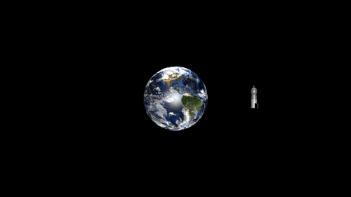

Например, спутник LandSat-7, находящийся на ССО, может пересекать экватор 15 раз в сутки, каждый раз в 10:00 местного времени. Для достижения подобных характеристик параметры выбираются так, чтобы орбита прецессировала в восточном направлении на 360° в год (~1°/день), компенсируя вращение Земли вокруг Солнца. Прецессия происходит за счёт взаимодействия КА с несферичной Землёй; её скорость зависит от наклонения орбиты. Нужной скорости прецессии можно достичь лишь для определённого диапазона высот орбит (обычно выбирают 600 ‑ 800 км с периодами 96 ‑ 100 мин.), необходимое наклонение для упомянутого диапазона высот около 98°. Для орбит с бо́льшими высотами требуются большие наклонения, из‑за чего в зону посещений КА перестают попадать полярные области.

Данный тип орбит может иметь вариации. Например, возможны ССО с большим эксцентриситетом. В этом случае солнечное время прохода будет зафиксировано только для одной точки орбиты (обычно перигея).

Период обращения выбирается в соответствии с необходимым периодом проходов над точкой поверхности. Хотя спутник на круговой солнечно‑синхронной орбите пересекает экватор в одно и то же местное время, это происходит в разных точках экватора (на разной долготе) из‑за того, что Земля поворачивается на некоторый угол между проходами спутника. Предположим, период обращения составляет 96 мин. Это значение нацело делит солнечные сутки на пятнадцать. Т.е., за сутки КА пройдёт над 15 разными точками экватора на дневной стороне орбиты и ещё 15 — на ночной, через сутки вернётся к первой точке. Подбором более сложных (нецелых) отношений, число посещаемых точек может быть увеличено за счёт увеличения периода посещения одной и той же точки.

Специальный случай ССО — орбита, на которой экватор посещается в полдень/полночь, а также орбита в [плоскости терминатора](terminator.md), т.е. полосе закатов и восходов. Последний вариант не имеет смысла для КА оптической фотосъёмки, но хорош для радарных КА, т.к. обеспечивает отсутствие участков, где КА попадает в тень Земли. Т.е., на такой орбите солнечные батареи КА постоянно освещаются Солнцем.

---

 

## «Тундра»
Орбиты «Тундра» являются эллиптическими геосинхронными орбитами, их типичный эксцентриситет от 0,25 до 0,4. Наклонение таких орбит составляет от 62,15° до 63,4°;

Такие орбиты используется, в частности, компанией «Sirius XM Radio» (система «Sirius XM» из трёх КА) и японской навигационной системой QZSS.

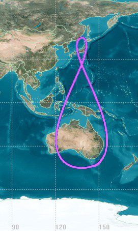

 

## Docs & links (TRANSLATEME ALREADY)
|…°·•¹²³±×÷≤≥≈≠ ‑ −— ⎆✉ ❐“”’«»✔→✘☐☑├┕┆ 1 lb = 0.453592 kg; 1 g = 9.80665 m/s²|
|:--|
|<small>**[FAQ](faq.md)**, **[Cable](cable.md)**·БКС, **[Camera](camera.md)**·Камера, **[Comms](comms.md)**·Радиосв., **[Contact](contact.md)**·Контакт, **[Control](control.md)**·Управ., **[Doc](doc.md)**·Док., **[Doppler](doppler.md)**·ИСР, **[DS](ds.md)**·ЗУ, **[EB](eb.md)**·ХИТ, **[ECO](ecology.md)**·Экол., **[EF](ef.md)**·ВВФ, **[ElC](elc.md)**·ЭКБ, **[EMC](emc.md)**·ЭМС, **[Errors](error.md)**·Ошибки, **[Events](event.md)**·События, **[FS](fs.md)**·ТЭО, **[Fuel](fuel.md)**·Топливо, **[GNC](gnc.md)**·БКУ, **[GS](scs.md)**·НС, **[HF&E](hfe.md)**·Эргоном., **[IMU](imu.md)**·Гироскоп, **[Incubator](incubator.md)**·Инкуб., **[KT](kt.md)**·КТЕХ, **[LAG](lag.md)**·ПУC, **[LES](les.md)**·САСП, **[LS](ls.md)**·СЖО, **[LV](lv.md)**·РН, **[MAG](mag.md)**·Магнитом., **[MCC](mcc.md)**·ЦУП, **[Model](model.md)**·Модель, **[MSC](sc.md)**·ПКА, **[N&B](nnb.md)**·БНО, **[NR](nr.md)**·ЯР, **[OBC](obc.md)**·ЦВМ, **[OE](oe.md)**·БА, **[Patent](патент.md)**·Патент, **[Project](project.md)**·Проект, **[PS](ps.md)**·ДУ, **[QA](quality.md)**·QA, **[R&D](rnd.md)**·НИОКР, **[RAMS](rams.md)**·НиБ, **[Risk](risk.md)**·Риск, **[Robot](robotics.md)**·Робот, **[Rover](rover.md)**·Планетоход, **[RTG](rtg.md)**·РИТЭГ, **[RW](rw.md)**·ДМ, **[SARC](sarc.md)**·ПСК, **[Sensor](sensor.md)**·Датчик, **[SC](sc.md)**·КА, **[SCS](scs.md)**·КК, **[SGM](sgm.md)**·КММ, **[SI](si.md)**·СИ, **[Soft](soft.md)**·ПО, **[SP](sp.md)**·БС, **[Spaceport](spaceport.md)**·Космодром, **[SPS](sps.md)**·СЭС, **[SSS](sss.md)**·ГЗУ, **[TCS](tcs.md)**·СОТР, **[Test](test.md)**·ЭО, **[Timeline](timeline.md)**·Циклограмма, **[TMS](tms.md)**·ТМС, **[TOR](tor.md)**·ТЗ, **[TRL](trl.md)**·УГТ</small>|
|*Sections & pages*|
|**`Баллистико‑навигационное обеспечение (БНО):`**  [SPICE](spice.md) ┊ [Апоцентр и перицентр](apopericentre.md) ┊ [Гравманёвр](gravass.md) ┊ [Кеплеровы элементы](keplerian.md) ┊ [Космическая скорость](esc_vel.md) ┊ [Сфера Хилла](hill_sphere.md) ┊ [Терминатор](terminator.md) ┊ [Точки Лагранжа](l_points.md) ┊ [Эффект Оберта](oberth_eff.md) |
|**··• [Control](Control.md) •··**  [Ad hoc](ad_hoc.md) ┊ [Business travel](business_travel.md) ┊ [Chief designers council](cocd.md) ┊ [CML](cml.md) ┊ [Competence](competence.md) ┊ [Confident](confident.md) ┊ [Consp.theory](consp_theory.md) ┊ [Control sys. (CS)](cs.md) ┊ [Coordinate system](coord_sys.md) ┊ [Curator](curator.md) ┊ [Designer's supervision](des_spv.md) ┊ [E‑sig](esig.md) ┊ [Engineer](engineer.md) ┊ [Errand](errand.md) ┊ [Federal law](fed_law.md) ┊ [Federal TP](fed_tp.md) ┊ [Federal SP](fed_sp.md) ┊ [GNC](gnc.md) ┊ [Gravity assist](gravass.md) ┊ [Industrial archaeology](ind_arch.md) ┊ [Instruction](instruction.md) ┊ [Lean manuf.](lean_man.md) ┊ [Lifetime](lifetime.md) ┊ [Manager](manager.md) ┊ [Meeting](meeting.md) ┊ [MCC](mcc.md) ┊ [MIC](mic.md) ┊ [MML](mml.md) ┊ [MoU](mou.md) ┊ [Nav. & ballistics (NB)](nnb.md) ┊ [Nonprofit org.](nonprof_org.md) ┊ [NX](nx.md) ┊ [Oberth effect](oberth_eff.md) | ┊ [Org.structure](orgstruct.md) ┊ [Outcomes commission](outccom.md) ┊ [Patent](patent_res.md) ┊ [Peter prin.](peter_principle.md) ┊ [Plan](plan.md) ┊ [PMBok](pmbok.md) ┊ [Quorum](quorum.md) ┊ [R&D management](rnd_mgmt.md) ┊ [R&D support](rnd_support.md) ┊ [Recursion](recurs.md) ┊ [Schulze_method](schulze_method.md) ┊ [Sci'N'Tech activities](st_act.md) ┊ [Sci'N'Tech council](satc.md) ┊ [Single-window system](sw_sys.md) ┊ [Situ.leadership](situ_leadership.md) ┊ [Skunk works](skunk_works.md) ┊ [State arm. plan](plan_sa.md) ┊ [Swamp](swamp.md) ┊ [Teamcenter](teamcenter.md) ┊ [TRIZ](triz.md) ┊ [TRL](trl.md) ┊ [Veto](veto.md) ┊ [Workflow](workflow.md) ┊ [Workgroup](wg.md)|

**Docs:**

   1. …

**Links:**

   1. Notable interwikies — …
   1. <https://ru.wikipedia.org/wiki/Орбита>
   1. <https://ru.wikipedia.org/wiki/Узел_орбиты>
   1. <https://ru.wikipedia.org/wiki/Высокая_эллиптическая_орбита>
   1. <https://en.wikipedia.org/wiki/Highly_elliptical_orbit>
   1. <https://ru.wikipedia.org/wiki/Гелиоцентрическая_орбита>
   1. <https://en.wikipedia.org/wiki/Heliocentric_orbit>
   1. <https://ru.wikipedia.org/wiki/Геопереходная_орбита>
   1. <https://en.wikipedia.org/wiki/Geostationary_transfer_orbit>
   1. <https://ru.wikipedia.org/wiki/Геосинхронная_орбита>
   1. <https://en.wikipedia.org/wiki/Geosynchronous_orbit>
   1. <https://ru.wikipedia.org/wiki/Геостационарная_орбита>
   1. <https://en.wikipedia.org/wiki/Geostationary_orbit>
   1. <https://ru.wikipedia.org/wiki/Геоцентрическая_орбита>
   1. <https://en.wikipedia.org/wiki/Geocentric_orbit>
   1. <https://ru.wikipedia.org/wiki/Низкая_опорная_орбита>
   1. <https://ru.wikipedia.org/wiki/Низкая_околоземная_орбита>
   1. <https://en.wikipedia.org/wiki/Low_Earth_orbit>
   1. <https://ru.wikipedia.org/wiki/Синхронная_орбита>
   1. <https://en.wikipedia.org/wiki/Synchronous_orbit>
   1. <https://ru.wikipedia.org/wiki/Солнечно‑синхронная_орбита>
   1. <https://en.wikipedia.org/wiki/Sun-synchronous_orbit>
   1. <https://ru.wikipedia.org/wiki/Орбита_Лиссажу>
   1. <https://en.wikipedia.org/wiki/Lissajous_orbit>
