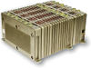
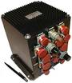

# On-board computer (a list)
> 2019.07.31 [🚀](../index/index.md) [despace](index.md) → [ЦВМ](obc.md)

[TOC]

---

A list of [On-board computers](obc.md).

## Current

 

### CPU — GR712RC
**GR712RC** — процессор, предназначенный для использования в составе [КА](sc.md).  
Разработчик [Cobham](cobham.md). Разработано в 2019 году.

|*Characteristics*|*[Value](si.md)  (GR712RC)*|
|:--|:--|
|Composition|Single unit|
|Consumption, W| |
|Dimensions, ㎜|75 × 75 × 3.5|
|[Interfaces](interface.md)|・Four [SpaceWire](spacewire.md) ports, maximum 200 Mbps full-duplex data rate;  ・Redundant [MIL-STD-1553B](mil_std_1553.md) BRM (BC/RT/BM) interface;  ・Two CAN 2.0B bus controllers;  ・Six UART ports, with 8-byte FIFO;  ・Ethernet MAC with RMII 10/100 Mbps port;  ・SPI master serial port;  ・I2C master serial port;  ・ASCS16 (STR) serial port;  ・SLINK 6 ㎒ serial port;  ・CCSDS/ECSS 5‑channel Telecommand decoder, 10 Mbps input rate;  ・CCSDS/ECSS Telemetry encoder, 50 Mbps output rate;  ・26 input and 38 input/output general purpose ports|
|[Lifetime](lifetime.md)/Resource, h(y)|… / …|
|Mass, ㎏|0.017|
|[Overload](vibration.md), Grms| |
|[Rad.resist](ion_rad.md), ㏉ (㎭)|3 000 (300 000)|
|[Reliability](qm.md) per [lifetime](lifetime.md)| |
|[Thermal range](tcs.md), ℃|−55 ‑ +125|
|[TRL](trl.md)|9|
|[Voltage](sps.md), V|1.8 или 3.3|
|**【Specific】**|• • •|
|Bit depth|32 бит|
|Capacity, ㎅|16 — multi-way instruction cache; 16 — multi-way data cache; 192 — memory block with EDAC|
|Commands,  sensors,  inputs|… — команд управления; … — релейных матричных команд управления; … — ТМ‑датчиков; … — входов прерываний от контактных датчиков; … — входов прерываний от импульсных датчиков|
|CPU type|dual-core LEON3FT SPARC V8, 180 nm standard CMOS, Tower Semiconductors Ltd|
|Performance|100 ㎒ (200 MIPS, 200 MFLOPS)|
|Recovery time, s| |
| ||

**Notes:**

   1. <https://www.gaisler.com/index.php/products/components/gr712rc>
   1. <https://www.gaisler.com/index.php/products/components/gr712rc>
   1. **Applicability:** [Beresheet](beresheet.md)

 

### BIVK‑MR (RU)
> <small>**БИВК‑МР** — русскоязычный термин, не имеющий аналога в английском языке. **BIVK‑MR** — дословный перевод с русского на английский.</small>

**Комплекс бортовой интегрированный вычислительный (БИВК‑МР)** — [цифровая вычислительная машина](obc.md)), предназначенная для использования в составе [КА](sc.md).  
Разработчик [НТЦ Модуль](contact/ntc_module.md). Разработано в рамках ОКР «[Аракс](araks.md)» в 2017 году. разработка. (по состоянию на 27.06.2017)

Предшественник: [БИВК-Р](obc_lst.md). Отличается от предшественника [БИВК-Р](obc_lst.md) тем, что ряд иностранных компонентов заменён на отечественные [аналоги](analogue.md), также отсутствует горячее резервирование.

|*Characteristics*|*[Value](si.md)  (БИВК-МР)*|
|:--|:--|
|Composition|Single unit, включающий в себя 2 независимых полукомплекта|
|Consumption, W|не более 20 Вт в режиме холодного резерва (экономичном);  не более 33 Вт в режиме горячего резерва (активном)|
|Dimensions, ㎜|280×135×147 (без учёта жгутов собственной кабельной сети устройства, со жгутами — 260 ㎜)|
|[Interfaces](interface.md)|1. два независимых резервированных интерфейса обмена по [МКО](mil_std_1553.md), ГОСТ Р 52070‑2003;   2. интерфейс приёма внешних прерываний;   3. интерфейс для выдачи релейных команд на БА КА;   4. интерфейс приёма внешних релейных команд управления;   5. интерфейс технологического канала ([RS232](rs_xxx.md));   6. интерфейс приёма внешнего сигнала с частотой 1 ㎑;   7. интерфейс сигнала сверки времени;   8. интерфейс опроса ТМ‑датчиков;   9. интерфейс регистра программной телеметрии (канал контроля состояния);   10. интерфейс синхронизации «1с» ([RS422](rs_xxx.md)).|
|[Lifetime](lifetime.md)/Resource, h(y)|… / …|
|Mass, ㎏|7.1|
|[Overload](vibration.md), Grms| |
|[Rad.resist](ion_rad.md), ㏉ (㎭)| |
|[Reliability](qm.md) per [lifetime](lifetime.md)|0.99966 за 3 года|
|[Thermal range](tcs.md), ℃| |
|[TRL](trl.md)|8|
|[Voltage](sps.md), V|24 ‑ 34|
|**【Specific】**|• • •|
|Bit depth|32 бит, 64 бит с плавающей запятой|
|Capacity, ㎅|4 096 — ОЗУ (с кодом Хемминга)  8 192 — ЭППЗУ  32 — защищённой памяти|
|Commands,  sensors,  inputs|20 (по факту 10) — команд управления;  304 (матрица 19×16), из них для потребности БИВК‑МР — 32 — релейных матричных команд управления;  40 — ТМ‑датчиков;  12 — входов прерываний от контактных датчиков;  6 — входов прерываний от импульсных датчиков|
|CPU type|IDT79RC64V474  MIPS‑I Microprocessor IC — 1 Core, 64‑Bit 200㎒ 128‑PQFP (28×28)  Разработчик IDT, Integrated Device Technology Inc|
|Performance|10 млн операций смеси DAIS;  время выполнения команд с плавающей запятой для операндов 64 разряда: сложение, вычитание — не более 3,5 мкс, умножение — не более 5 мкс.|
|Recovery time, s|С момента фиксирования отказа аппаратурой автоматической реконфигурации:  не более 30 сек в режиме холодного резерва (экономичном);   не более 150 ㎳ в режиме горячего резерва (активном)|
| | [❐](f/cpu/b/bivk.webp)|

**Notes:**

   1. <https://www.digikey.com/product-detail/en/idt-integrated-device-technology-inc/IDT79RC64V474-200DZ/IDT79RC64V474-200DZ-ND/2018290>
   1. **Applicability:** «[Аракс](araks.md)»

 

### BIVK‑R (RU)
> <small>**БИВК‑Р** — русскоязычный термин, не имеющий аналога в английском языке. **BIVK‑R** — дословный перевод с русского на английский.</small>

**Комплекс бортовой интегрированный вычислительный (БИВК‑Р)** — [цифровая вычислительная машина](obc.md)), предназначенная для использования в составе [КА](sc.md).  
Разработчик [НТЦ Модуль](contact/ntc_module.md). Разработано в рамках ОКР «[Luna‑25](луна_25.md)» в 2015 году. активное использование. Заимств. с КА «[Luna‑25](луна_25.md)». (по состоянию на 17.06.2017)

Преемник: [БИВК-М](бивк_м.md), [БИВК-МР](obc_lst.md)

|*Characteristics*|*[Value](si.md)  (БИВК-Р)*|
|:--|:--|
|Composition|Single unit, включающий в себя 2 независимых полукомплекта|
|Consumption, W|не более 20 Вт в режиме холодного резерва (экономичном);  не более 35 Вт в режиме горячего резерва (активном)|
|Dimensions, ㎜|280×135×147 (без учёта жгутов собственной кабельной сети устройства, со жгутами — 260 ㎜)|
|[Interfaces](interface.md)|1. два независимых резервированных интерфейса обмена по [МКО](mil_std_1553.md), ГОСТ Р 52070‑2003;   2. интерфейс приёма внешних прерываний;   3. интерфейс для выдачи релейных команд на БА КА;   4. интерфейс приёма внешних релейных команд управления;   5. интерфейс технологического канала ([RS232](rs_xxx.md));   6. интерфейс приёма внешнего сигнала с частотой 1 ㎑;   7. интерфейс сигнала сверки времени;   8. интерфейс опроса ТМ‑датчиков;   9. интерфейс регистра программной телеметрии (канал контроля состояния);   10. интерфейс синхронизации «1с» ([RS422](rs_xxx.md)).|
|[Lifetime](lifetime.md)/Resource, h(y)|61 320 (7) / …|
|Mass, ㎏|7.1|
|[Overload](vibration.md), Grms| |
|[Rad.resist](ion_rad.md), ㏉ (㎭)| |
|[Reliability](qm.md) per [lifetime](lifetime.md)|0.99966 за 3 года|
|[Thermal range](tcs.md), ℃| |
|[TRL](trl.md)|9|
|[Voltage](sps.md), V|24 ‑ 34|
|**【Specific】**|• • •|
|Bit depth|32 бит, 64 бит с плавающей запятой|
|Capacity, ㎅|4 096 — ОЗУ (с кодом Хемминга)  8 192 — ЭППЗУ  32 — защищённой памяти|
|Commands,  sensors,  inputs|20 (по факту 10) — команд управления;  304 (матрица 19×16), из них для потребности БИВК‑Р — 32 — релейных матричных команд управления;  40 — ТМ‑датчиков;  12 — входов прерываний от контактных датчиков;  6 — входов прерываний от импульсных датчиков|
|CPU type|IDT79RC64V474  MIPS‑I Microprocessor IC — 1 Core, 64‑Bit 200㎒ 128‑PQFP (28×28)  Разработчик IDT, Integrated Device Technology Inc|
|Performance|10 млн операций смеси DAIS;  время выполнения команд с плавающей запятой для операндов 64 разряда: сложение, вычитание — не более 3,5 мкс, умножение — не более 5 мкс.|
|Recovery time, s|С момента фиксирования отказа аппаратурой автоматической реконфигурации:  не более 30 сек в режиме холодного резерва (экономичном);   не более 150 ㎳ в режиме горячего резерва (активном)|
| | [❐](f/cpu/b/bivk.webp)|

**Notes:**

   1. <https://www.digikey.com/product-detail/en/idt-integrated-device-technology-inc/IDT79RC64V474-200DZ/IDT79RC64V474-200DZ-ND/2018290>
   1. Не может работать на [нестабилизированной шине](sps.md) в связи со входом в циклическую перезагрузку.
   1. **Applicability:** [Венера‑Д](венера‑д.md)・ [Luna‑25](луна_25.md)・ [Luna‑26](луна_26.md)・ [Luna‑27](луна_27.md)

 

### BKU‑SxPA (RU)
> <small>**БКУ‑SxPA** — русскоязычный термин, не имеющий аналога в английском языке. **BKU‑SxPA** — дословный перевод с русского на английский.</small>

**БКУ‑SxPA** — цифровая вычислительная машина ([компьютер](obc.md)), предназначенная для использования в составе [КА](sc.md). Разработчик [Спутникс](contact/sputnix.md). Разработано  

|*Characteristics*|*[Value](si.md)  (BKU‑SxPA)*|
|:--|:--|
|Composition|2 блока (процессорный блок; маршрутизатор)|
|Consumption, W| |
|Dimensions, ㎜|179 × 167 × 30 — процессорный блок; 119 × 107 × 30 — маршрутизатор|
|[Interfaces](interface.md)|Space Plug-and-Play Architecture Standard; [SpaceWire](spacewire.md); [CAN2B](can.md)|
|[Lifetime](lifetime.md)/Resource, h(y)|… / …|
|Mass, ㎏|0.35 (0.2 — процессорный блок; 0.15 — маршрутизатор)|
|[Overload](vibration.md), Grms| |
|[Rad.resist](ion_rad.md), ㏉ (㎭)| |
|[Reliability](qm.md) per [lifetime](lifetime.md)| |
|[Thermal range](tcs.md), ℃| |
|[TRL](trl.md)| |
|[Voltage](sps.md), V| |
|**【Specific】**|• • •|
|Bit depth| |
|Capacity, ㎅|… — ОЗУ;  … — ЭППЗУ;  … — защищённой памяти|
|Commands,  sensors,  inputs|… — команд управления;  … — релейных матричных команд управления;  … — ТМ‑датчиков;  … — входов прерываний от контактных датчиков;  … — входов прерываний от импульсных датчиков|
|CPU type|LEON3|
|Performance| |
|Recovery time, s|<small>(from the moment the failure was detected by the automatic reconfiguration OE)</small>|
| ||

**Notes:**

   1. [Чертёж процессорного блока ❐](f/cpu/b/bku-sxpa_sketch_bku1.pdf)・ [Чертёж маршрутизатора ❐](f/cpu/b/bku-sxpa_sketch_router1.pdf)
   1. <http://www.sputnix.ru/ru/products/microsatellites-systems/obc-pnp/item/245-bku_sxpa_ru>
   1. **Applicability:** …

 

### CVM-12 (RU)
**ЦВМ‑12** — цифровая вычислительная машина ([компьютер](obc.md)), предназначенная для использования в составе [КА](sc.md).  
Разработчик [НТЦ Модуль](contact/ntc_module.md). Разработано в 2004 году. Покупное изделие.

|*Characteristics*|*[Value](si.md)  (ЦВМ-12)*|
|:--|:--|
|Composition|Single unit из 2 полукомплектов.|
|Consumption, W|20|
|Dimensions, ㎜| |
|[Interfaces](interface.md)| |
|[Lifetime](lifetime.md)/Resource, h(y)|… / …|
|Mass, ㎏|2.2|
|[Overload](vibration.md), Grms| |
|[Rad.resist](ion_rad.md), ㏉ (㎭)| |
|[Reliability](qm.md) per [lifetime](lifetime.md)| |
|[Thermal range](tcs.md), ℃| |
|[TRL](trl.md)|9|
|[Voltage](sps.md), V|27|
|**【Specific】**|• • •|
|Bit depth|64|
|Capacity, ㎅|4 096 — ОЗУ (с кодом Хэмминга);  8 192 — ЭППЗУ (с кодом Хэмминга);  … — защищённой памяти|
|Commands,  sensors,  inputs|… — команд управления;  … — релейных матричных команд управления;  … — ТМ‑датчиков;  … — входов прерываний от контактных датчиков;  … — входов прерываний от импульсных датчиков|
|CPU type|R4000 (MIPS)|
|Performance|50 ㎒|
|Recovery time, s|<small>… (from the moment the failure was detected by the automatic reconfiguration OE)</small>|
| ||

**Notes:**

   1. [Брошюра от НТЦ «Модуль» ❐](f/cpu/t/cvm-12_doc1.djvu)
   1. <https://www.module.ru/catalog/space/central_naya_vichislitel_naya_mashina_cvm12/>
   1. **Applicability:** …

 

### MARS 4 (RU)
**Марс‑4** — цифровая вычислительная машина ([компьютер](obc.md)), предназначенная для использования в составе [КА](sc.md).  
Разработчик [МОКБ Марс](contact/mars_mokb.md). Разработано в рамках ОКР <mark>TBD</mark> в 2002 году. Активное использование (на 2017 год).

|*Characteristics*|*[Value](si.md)  (Марс-4)*|
|:--|:--|
|Composition|Single unit. 4‑кратное резервирование.|
|Consumption, W|30|
|Dimensions, ㎜|156 × 205 × 214|
|[Interfaces](interface.md)| |
|[Lifetime](lifetime.md)/Resource, h(y)|… / …|
|Mass, ㎏|8|
|[Overload](vibration.md), Grms| |
|[Rad.resist](ion_rad.md), ㏉ (㎭)| |
|[Reliability](qm.md) per [lifetime](lifetime.md)| |
|[Thermal range](tcs.md), ℃| |
|[TRL](trl.md)|9|
|[Voltage](sps.md), V| |
|**【Specific】**|• • •|
|Bit depth| |
|Capacity, ㎅|240 — ОЗУ;  2 048 — ЭППЗУ;  … — защищённой памяти|
|Commands,  sensors,  inputs|… — команд управления; … — релейных матричных команд управления; … — ТМ‑датчиков; … — входов прерываний от контактных датчиков; … — входов прерываний от импульсных датчиков|
|CPU type|2 × 20 ㎒;  первый выполняет функции ЦП, второй — функции ввода‑вывода|
|Performance|2 × 2 500 000 оп/с|
|Recovery time, s|(с момента фиксирования отказа автоматикой)|
| ||

**Notes:**

   1. …
   1. **Applicability:** (2005) Монитор‑Э・ (2006) Казсат・ (2009) Экспресс‑МД

 

### MARS 7 (RU)
**Марс‑7** — цифровая вычислительная машина ([компьютер](obc.md)), предназначенная для использования в составе [КА](sc.md).  
Разработчик [МОКБ Марс](contact/mars_mokb.md). Разработано в рамках ОКР <mark>TBD</mark> в <mark>TBD</mark> году.

|*Characteristics*|*[Value](si.md)  (Марс-7)*|
|:--|:--|
|Composition|Single unit; 4‑кратное резервирование|
|Consumption, W|20|
|Dimensions, ㎜|147 × 204 × 158|
|[Interfaces](interface.md)| |
|[Lifetime](lifetime.md)/Resource, h(y)|… / …|
|Mass, ㎏|6|
|[Overload](vibration.md), Grms| |
|[Rad.resist](ion_rad.md), ㏉ (㎭)| |
|[Reliability](qm.md) per [lifetime](lifetime.md)| |
|[Thermal range](tcs.md), ℃| |
|[TRL](trl.md)| |
|[Voltage](sps.md), V| |
|**【Specific】**|• • •|
|Bit depth| |
|Capacity, ㎅|4 096 — ОЗУ;  8 192 — ЭППЗУ;  … — защищённой памяти|
|Commands,  sensors,  inputs|… — команд управления;  … — релейных матричных команд управления;  … — ТМ‑датчиков;  … — входов прерываний от контактных датчиков;  … — входов прерываний от импульсных датчиков|
|CPU type|2 × 50 ㎒;  первый выполняет функции ЦП, второй — функции ввода‑вывода|
|Performance|2 × 50 000 000 оп/с|
|Recovery time, s|(с момента фиксирования отказа автоматикой)|
| ||

**Notes:**

   1. …
   1. **Applicability:** …

 

### MPK-002 (RU)
> <small>**МПК-002** — RU term w/o analogues in English. **MPK-002** — literal EN translation.</small>

**МПК‑002** — цифровая вычислительная машина ([компьютер](obc.md)), предназначенная для использования в составе [КА](sc.md).  
Разработчик [НПП Антарес](contact/npp_antares.md). Разработано в 1983 году прошёл ЛИ в КА «Фотон‑М» №1,2,3.

|*Characteristics*|*[Value](si.md)  (MPK-002)*|
|:--|:--|
|Composition|Single unit|
|Consumption, W|14|
|Dimensions, ㎜|174 × 185 × 191|
|[Interfaces](interface.md)| |
|[Lifetime](lifetime.md)/Resource, h(y)|… / 50 000 (5.7)|
|Mass, ㎏|3.85|
|[Overload](vibration.md), Grms| |
|[Rad.resist](ion_rad.md), ㏉ (㎭)| |
|[Reliability](qm.md) per [lifetime](lifetime.md)| |
|[Thermal range](tcs.md), ℃| |
|[TRL](trl.md)|9|
|[Voltage](sps.md), V|27 (23 ‑ 32)|
|**【Specific】**|• • •|
|Bit depth| |
|Capacity, ㎅|2 048 — ОЗУ;  16 896 — ЭППЗУ;  … — защищённой памяти|
|Commands,  sensors,  inputs|… — команд управления;  … — релейных матричных команд управления;  … — ТМ‑датчиков;  … — входов прерываний от контактных датчиков;  … — входов прерываний от импульсных датчиков|
|CPU type|AMD 5x86 с рабочей частотой 100 ㎒|
|Performance|10 млн операций в секунду|
|Recovery time, s|20 (с момента фиксирования отказа автоматикой)|
| ||

**Notes:**

   1. <http://npp-antares.ru/index.php/mpk.html>
   1. **Applicability:** Фотон‑М №1,2,3

 

### MPK-003 (RU)
> <small>**МПК-003** — RU term w/o analogues in English. **MPK-003** — literal EN translation.</small>

**МПК‑003** — цифровая вычислительная машина ([компьютер](obc.md)), предназначенная для использования в составе [КА](sc.md).  
Разработчик [НПП Антарес](contact/npp_antares.md). Разработано в 2005 году 

|*Characteristics*|*[Value](si.md)  (ДКШГ.468332.003)*|*[Value](si.md)  (ДКШГ.468332.003-01)*|
|:--|:--|:--|
|Composition|Single unit|Single unit|
|Consumption, W|52|26|
|Dimensions, ㎜|454 × 268 × 172|454 × 268 × 104|
|[Interfaces](interface.md)|[МКО](mil_std_1553.md)|[МКО](mil_std_1553.md)|
|[Lifetime](lifetime.md)/Resource, h(y)|43 800 (5) / 50 000 (5.7)|43 800 (5) / 50 000 (5.7)|
|Mass, ㎏|12|8.9|
|[Overload](vibration.md), Grms| | |
|[Rad.resist](ion_rad.md), ㏉ (㎭)| | |
|[Reliability](qm.md) per [lifetime](lifetime.md)|0.995|0.995|
|[Thermal range](tcs.md), ℃| | |
|[TRL](trl.md)|9|9|
|[Voltage](sps.md), V|27 (23 ‑ 32)|27 (23 ‑ 32)|
|**【Specific】**|• • •|• • •|
|Bit depth| | |
|Capacity, ㎅|… — ОЗУ;  … — ЭППЗУ;  … — защищённой памяти| |
|Commands,  sensors,  inputs|… — команд управления;  … — релейных матричных команд управления;  … — ТМ‑датчиков;  … — входов прерываний от контактных датчиков;  … — входов прерываний от импульсных датчиков| |
|CPU type| | |
|Performance| | |
|Recovery time, s|20 (с момента фиксирования отказа автоматикой)|20 (с момента фиксирования отказа автоматикой)|
| |  ДКШГ.468332.003|  ДКШГ.468332.003-01|

**Notes:**

   1. <http://npp-antares.ru/index.php/equipment.html>
   1. **Applicability:** «Персона» (индекс ГУКОС — 14Ф137)

 

## Archive

 

### CVM22 (RU)
**ЦВМ22** — цифровая вычислительная машина ([компьютер](obc.md)), предназначенная для использования в составе [КА](sc.md).  
Разработчик АНО "НТИЦ "ТЕХКОМ". Разработано в рамках ОКР [Фобос‑Грунт](фобос_грунт.md) в 2009 году.

|*Characteristics*|*[Value](si.md)  (ЦВМ22)*|
|:--|:--|
|Composition|Single unit|
|Consumption, W|7.1 ‑ 12|
|Dimensions, ㎜|122 × 121 × 121|
|[Interfaces](interface.md)|1 [МКО](mil_std_1553.md); 2 [RS-232](rs_xxx.md)|
|[Lifetime](lifetime.md)/Resource, h(y)|23 880 (2.72) / 41 610 (4.75)|
|Mass, ㎏|2.1|
|[Overload](vibration.md), Grms| |
|[Rad.resist](ion_rad.md), ㏉ (㎭)|100 (10 000)|
|[Reliability](qm.md) per [lifetime](lifetime.md)|0.999|
|[Thermal range](tcs.md), ℃|–20 ‑ +50|
|[TRL](trl.md)|9|
|[Voltage](sps.md), V|27 (23 ‑ 34)|
|**【Specific】**|• • •|
|Bit depth|32 бит|
|Capacity, ㎅|2 048 — ОЗУ;  4 096 — ЭППЗУ;  … — защищённой памяти|
|Commands,  sensors,  inputs|… — команд управления;  … — релейных матричных команд управления;  … — ТМ‑датчиков;  … — входов прерываний от контактных датчиков;  … — входов прерываний от импульсных датчиков|
|CPU type|1890ВМ2Т (KOMDIV-32), аналог MIPS R3000|
|Performance|84 ㎒|
|Recovery time, s| |

**Notes:**

   1. <https://en.wikipedia.org/wiki/KOMDIV-32>
   1. <https://ru.wikipedia.org/wiki/KOMDIV-32>
   1. **Опыт использования:** Согласно заключению аварийной комиссии, расследовавшей обстоятельства выхода из строя КА [Фобос‑Грунт](фобос_грунт.md), основной версией являлся выход из строя ЦВМ22 из‑за ТЗЧ. Было отмечено, что принципы построения печатных плат, а также выбранная ЭКБ не обеспечивали необходимую рад.стойкость.
   1. **Applicability:** [Фобос‑Грунт](фобос_грунт.md)

 

## Docs & links (TRANSLATEME ALREADY)
|Navigation|
|:--|
|**[FAQ](faq.md)**【**[SCS](scs.md)**·КК, **[SC (OE+SGM)](sc.md)**·КА】**[CON](contact.md)·[Pers](person.md)**·Контакт, **[Ctrl](control.md)**·Упр., **[Doc](doc.md)**·Док., **[Drawing](drawing.md)**·Чертёж, **[EF](ef.md)**·ВВФ, **[Error](error.md)**·Ошибки, **[Event](event.md)**·События, **[FS](fs.md)**·ТЭО, **[HF&E](hfe.md)**·Эрго., **[KT](kt.md)**·КТ, **[N&B](nnb.md)**·БНО, **[Project](project.md)**·Проект, **[QM](qm.md)**·БКНР, **[R&D](rnd.md)**·НИОКР, **[SI](si.md)**·СИ, **[Test](test.md)**·ЭО, **[TRL](trl.md)**·УГТ, **[Way](way.md)**·Пути|
|*Sections & pages*|
|**【[On-board computer (OBC)](obc.md)】**  …  • • •  **RU:** [МПК-003](obc_lst.md) (9)・ [БИВК-МР](obc_lst.md) (8)・ [МАРС 4](obc_lst.md) (8)・ [БИВК-Р](obc_lst.md) (7.1)・ [МАРС 7](obc_lst.md) (6)・ [МПК-002](obc_lst.md) (3.9)・ [ЦВМ-12](obc_lst.md) (2.2)・ [БКУ_SXPA](obc_lst.md) (0.35)・ [БИВК-МН](бивк‑мн.md) () *([ЦВМ22](obc_lst.md) (2.1))*|

   1. Docs: …
   1. …
