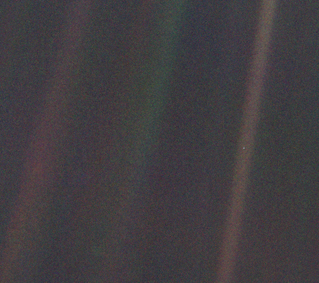

# Pale Blue Dot
> 2019.08.23 ┊ **🚀 [despace](index.md)** → **[Space](index.md)**, [Земля](earth.md)

[TOC]

---

> <small>*Термины:* **Pale Blue Dot** — англоязычный термин, не имеющий аналога в русском языке. **Бледно‑голубая точка** — дословный перевод с английского на русский.</small>

**Pale Blue Dot (с англ. — «бледно‑голубая точка»)** — фотография планеты Земля, сделанная зондом «Вояджер‑1» с рекордного расстояния, показывающая её на фоне космоса. Идея сделать снимок и это название были предложены Карлом Саганом, который также написал одноимённую книгу в 1994 году.

## Описание

|*Крошечная точка посередине коричневатой полосы справа —  Земля с расстояния 6 миллиардов километров.*|
|:--|
||

1990.02.14 НАСА отправило зонду, к тому моменту завершившему свою основную миссию, команду развернуться и сделать фотографии планет Солнечной системы. Одной из фотографий, полученных между 14 февраля и 6 июня 1990 года, было изображение Земли, представленной «бледно‑голубой точкой» на зернистом снимке.

**Таблица.** Удаление зонда «Вояджер‑1» от Земли

|*Мера измерения*|*14 февраля 1990*|*9 июня 1990*|
|:--|:--|:--|
|Астрономические единицы| 40.4722269111071 | 40.6835761263791 |
|мили| 3 762 136 324.748 | 3 781 782 502.403 |
|Километры| 6 054 558 968.024 | 6 086 176 360.601 |

Снимок был сделан с помощью длиннофокусной камеры с 32° выше плоскости эклиптики и создан с использованием синего, зелёного и фиолетового фильтров. Светлая полоса, в которой находится Земля, — ореол, возникший из‑за солнечного света, рассеянного в оптике камеры в связи с малым углом между Землёй и Солнцем (положение Солнца определяется схождением лучей, пересекающих снимок). Изображение Земли на фотографии занимает меньше одного пикселя (по данным НАСА, 0.12 пикселя).

## Воспоминания Сагана

Карл Саган пишет: «Хотя почти все мы знаем, что Земля — это шар, на котором нас каким‑то образом удерживает сила тяготения, осознание этого пришло к нам лишь со [знаменитой фотографией Земли](blue_marble.md), сделанной астронавтами „Аполлона‑17“ во время последнего полёта человека к Луне». Помня о значимости той фотографии, Саган настоял на том, чтобы «Вояджер» сделал снимок Земли с окраины Солнечной системы.

Во вступительной речи от 11 мая 1996 года Саган поделился своими мыслями о значении этой фотографии:

> Взгляните ещё раз на эту точку. Это здесь. Это наш дом. Это мы. Все, кого вы любите, все, кого вы знаете, все, о ком вы когда‑либо слышали, все когда‑либо существовавшие люди прожили свои жизни на ней. Множество наших наслаждений и страданий, тысячи самоуверенных религий, идеологий и экономических доктрин, каждый охотник и собиратель, каждый герой и трус, каждый созидатель и разрушитель цивилизаций, каждый король и крестьянин, каждая влюблённая пара, каждая мать и каждый отец, каждый способный ребёнок, изобретатель и путешественник, каждый преподаватель этики, каждый лживый политик, каждая «суперзвезда», каждый «величайший лидер», каждый святой и грешник в истории нашего вида жили здесь — на соринке, подвешенной в солнечном луче.  
> Земля — очень маленькая сцена на безбрежной космической арене. Подумайте о реках крови, пролитых всеми этими генералами и императорами, чтобы, в лучах славы и триумфа, они могли стать кратковременными хозяевами части песчинки. Подумайте о бесконечных жестокостях, совершаемых обитателями одного уголка этой точки над едва отличимыми обитателями другого уголка. О том, как часты меж ними разногласия, о том, как жаждут они убивать друг друга, о том, как горяча их ненависть.  
> Наше позёрство, наша воображаемая значимость, иллюзия о нашем привилегированном статусе во вселенной — все они пасуют перед этой точкой бледного света. Наша планета — лишь одинокая пылинка в окружающей космической тьме. В этой грандиозной пустоте нет ни намёка на то, что кто‑то придёт нам на помощь, дабы спасти нас от нас же самих.  
> Земля — пока единственный известный мир, способный поддерживать жизнь. Нам больше некуда уйти — по крайней мере, в ближайшем будущем. Побывать — да. Поселиться — ещё нет. Нравится вам это или нет — Земля сейчас наш дом.  
> Говорят, астрономия прививает скромность и укрепляет характер. Наверное, нет лучшей демонстрации глупого человеческого зазнайства, чем эта отстранённая картина нашего крошечного мира. Мне кажется, она подчёркивает нашу ответственность, наш долг быть добрее друг к другу, хранить и лелеять бледно‑голубую точку — наш единственный дом.

**Оригинальный текст (англ.)**

> Look again at that dot. That’s here. That’s home. That’s us. On it everyone you love, everyone you know, everyone you ever heard of, every human being who ever was, lived out their lives. The aggregate of our joy and suffering, thousands of confident religions, ideologies, and economic doctrines, every hunter and forager, every hero and coward, every creator and destroyer of civilization, every king and peasant, every young couple in love, every mother and father, hopeful child, inventor and explorer, every teacher of morals, every corrupt politician, every «superstar,» every «supreme leader,» every saint and sinner in the history of our species lived there — on a mote of dust suspended in a sunbeam.  
> The Earth is a very small stage in a vast cosmic arena. Think of the rivers of blood spilled by all those generals and emperors so that, in glory and triumph, they could become the momentary masters of a fraction of a dot. Think of the endless cruelties visited by the inhabitants of one corner of this pixel on the scarcely distinguishable inhabitants of some other corner, how frequent their misunderstandings, how eager they are to kill one another, how fervent their hatreds.  
> Our posturings, our imagined self‑importance, the delusion that we have some privileged position in the Universe, are challenged by this point of pale light. Our planet is a lonely speck in the great enveloping cosmic dark. In our obscurity, in all this vastness, there is no hint that help will come from elsewhere to save us from ourselves.  
> The Earth is the only world known so far to harbor life. There is nowhere else, at least in the near future, to which our species could migrate. Visit, yes. Settle, not yet. Like it or not, for the moment the Earth is where we make our stand.
It has been said that astronomy is a humbling and character‑building experience. There is perhaps no better demonstration of the folly of human conceits than this distant image of our tiny world. To me, it underscores our responsibility to deal more kindly with one another, and to preserve and cherish the pale blue dot, the only home we’ve ever known.

 

## Docs & links (TRANSLATEME ALREADY)
|…°·•¹²³±×÷≤≥≈≠ ‑ −— ⎆✉ ❐“”’«»✔→✘☐☑├┕┆ 1 lb = 0.453592 kg; 1 g = 9.80665 m/s²|
|:--|
|<small>**[FAQ](faq.md)**, **[Cable](cable.md)**·БКС, **[Camera](camera.md)**·Камера, **[Comms](comms.md)**·Радиосв., **[Contact](contact.md)**·Контакт, **[Control](control.md)**·Управ., **[Doc](doc.md)**·Док., **[Doppler](doppler.md)**·ИСР, **[DS](ds.md)**·ЗУ, **[EB](eb.md)**·ХИТ, **[ECO](ecology.md)**·Экол., **[EF](ef.md)**·ВВФ, **[ElC](elc.md)**·ЭКБ, **[EMC](emc.md)**·ЭМС, **[Errors](error.md)**·Ошибки, **[Events](event.md)**·События, **[FS](fs.md)**·ТЭО, **[Fuel](fuel.md)**·Топливо, **[GNC](gnc.md)**·БКУ, **[GS](scs.md)**·НС, **[HF&E](hfe.md)**·Эргоном., **[IMU](imu.md)**·Гироскоп, **[Incubator](incubator.md)**·Инкуб., **[KT](kt.md)**·КТЕХ, **[LAG](lag.md)**·ПУC, **[LES](les.md)**·САСП, **[LS](ls.md)**·СЖО, **[LV](lv.md)**·РН, **[MAG](mag.md)**·Магнитом., **[MCC](mcc.md)**·ЦУП, **[Model](model.md)**·Модель, **[MSC](sc.md)**·ПКА, **[N&B](nnb.md)**·БНО, **[NR](nr.md)**·ЯР, **[OBC](obc.md)**·ЦВМ, **[OE](oe.md)**·БА, **[Patent](патент.md)**·Патент, **[Project](project.md)**·Проект, **[PS](ps.md)**·ДУ, **[QA](quality.md)**·QA, **[R&D](rnd.md)**·НИОКР, **[RAMS](rams.md)**·НиБ, **[Risk](risk.md)**·Риск, **[Robot](robotics.md)**·Робот, **[Rover](rover.md)**·Планетоход, **[RTG](rtg.md)**·РИТЭГ, **[RW](rw.md)**·ДМ, **[SARC](sarc.md)**·ПСК, **[Sensor](sensor.md)**·Датчик, **[SC](sc.md)**·КА, **[SCS](scs.md)**·КК, **[SGM](sgm.md)**·КММ, **[SI](si.md)**·СИ, **[Soft](soft.md)**·ПО, **[SP](sp.md)**·БС, **[Spaceport](spaceport.md)**·Космодром, **[SPS](sps.md)**·СЭС, **[SSS](sss.md)**·ГЗУ, **[TCS](tcs.md)**·СОТР, **[Test](test.md)**·ЭО, **[Timeline](timeline.md)**·Циклограмма, **[TMS](tms.md)**·ТМС, **[TOR](tor.md)**·ТЗ, **[TRL](trl.md)**·УГТ</small>|
|*Sections & pages*|
|**··• [Space](index.md) •··**  [Apparent magnitude](app_mag.md) ┊ [Astro.object](aob.md) ┊ [Blue Marble](blue_marble.md) ┊ [Cosmic rays](cr.md) ┊ [Ecliptic](ecliptic.md) ┊ [Escape velocity](esc_vel.md) ┊ [Health](health.md) ┊ [Hill sphere](hill_sphere.md) ┊ [Information](info.md) ┊ [Lagrangian points](l_points.md) ┊ [Near space](near_sys.md) ┊ [Pale Blue Dot](pale_blue_dot.md) ┊ [Parallax](parallax.md) ┊ [Point Nemo](point_nemo.md) ┊ [Silver Snoopy award](silver_snoopy_award.md) ┊ [Solar constant](solar_const.md) ┊ [Terminator](terminator.md) ┊ [Time](time.md) ┊ [Wormhole](wormhole.md) ┊ ··•·· **Solar system:** [Ariel](ariel.md) ┊ [Callisto](callisto.md) ┊ [Ceres](ceres.md) ┊ [Deimos](deimos.md) ┊ [Earth](earth.md) ┊ [Enceladus](enceladus.md) ┊ [Eris](eris.md) ┊ [Europa](europa.md) ┊ [Ganymede](ganymede.md) ┊ [Haumea](haumea.md) ┊ [Iapetus](iapetus.md) ┊ [Io](io.md) ┊ [Jupiter](jupiter.md) ┊ [Makemake](makemake.md) ┊ [Mars](mars.md) ┊ [Mercury](mercury.md) ┊ [Moon](moon.md) ┊ [Neptune](neptune.md) ┊ [Nereid](nereid.md) ┊ [Nibiru](nibiru.md) ┊ [Oberon](oberon.md) ┊ [Phobos](phobos.md) ┊ [Pluto](pluto.md) ┊ [Proteus](proteus.md) ┊ [Rhea](rhea.md) ┊ [Saturn](saturn.md) ┊ [Sedna](sedna.md) ┊ [Solar day](solar_day.md) ┊ [Sun](sun.md) ┊ [Titan](titan.md) ┊ [Titania](titania.md) ┊ [Triton](triton.md) ┊ [Umbriel](umbriel.md) ┊ [Uranus](uranus.md) ┊ [Venus](venus.md)|

**Docs:**

   1. …

**Links:**

   1. Notable interwikies — …
   1. <https://en.wikipedia.org/wiki/Pale_Blue_Dot>
   1. <https://ru.wikipedia.org/wiki/Pale_Blue_Dot>

