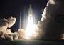
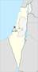
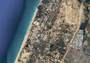

# Palmachim
> 2019.04.30 ┊ **🚀 [despace](index.md)** → **[Spaceport](spaceport.md)**

[TOC]

---

> <small>*Terms:* **Palmachim** — English term with no analogues in Russian. **Пальмахим** — literal translation to Russian.</small>

**The Palmachim Airbase** (Hebrew: בָּסִיס **חֵיל-הַאֲוִויר פַּלְמַחִים**) is an Israeli military facility and [spaceport](spaceport.md) located near the cities of Rishon LeZion and Yavne on the Mediterranean coast. It is named after nearby Kibbutz Palmachim.

Palmachim is used to launch the «Shavit» space launch vehicle into retrograde orbit by launching over the Mediterranean, acting as Israel’s primary spaceport. The launchpad is situated at 31°53′04″N 34°40′49″E. This ensures that rocket debris falls into water, and that the rocket does not fire over regional neighboring countries near Israel that could use the technology. Palmachim is also used to test ballistic missiles, such as the Jericho.

|*Characteristic*|*[Value](si.md)*|
|:--|:--|
| Activity  |**Active** (1971 ‑ …)  |
| [Launch vehicles](lv.md)  | [Shavit](shavit.md)  |
| Operator  | Israeli Air Force |
| Location  | 31°53′04″N 34°40′49″E  kibbutz Palmachim, Israel  |
| Distance  | 3 700 km — to the equator;  2 600 km — to [NPO Lavochkin](03_lav.md);  16 100 km — to [JPL](03_jpl.md);  25 km — to [ISA](03_isa.md)  |
| Launch pad  | 1  |
||        |
||  <small>*World map of spaceports*</small>  |

 

## Docs & links
|…°·•¹²³±×÷≤≥≈≠ ‑ −— ⎆✉ ❐“”’«»✔→✘☐☑├┕┆ 1 lb = 0.453592 kg; 1 g = 9.80665 m/s²|
|:--|
|<small>**[FAQ](faq.md)**, **[Cable](cable.md)**·БКС, **[Camera](camera.md)**·Камера, **[Comms](comms.md)**·Радиосв., **[Contact](contact.md)**·Контакт, **[Control](control.md)**·Управ., **[Doc](doc.md)**·Док., **[Doppler](doppler.md)**·ИСР, **[DS](ds.md)**·ЗУ, **[EB](eb.md)**·ХИТ, **[ECO](ecology.md)**·Экол., **[EF](ef.md)**·ВВФ, **[ElC](elc.md)**·ЭКБ, **[EMC](emc.md)**·ЭМС, **[Errors](error.md)**·Ошибки, **[Events](event.md)**·События, **[FS](fs.md)**·ТЭО, **[Fuel](fuel.md)**·Топливо, **[GNC](gnc.md)**·БКУ, **[GS](scs.md)**·НС, **[HF&E](hfe.md)**·Эргоном., **[IMU](imu.md)**·Гироскоп, **[Incubator](incubator.md)**·Инкуб., **[KT](kt.md)**·КТЕХ, **[LAG](lag.md)**·ПУC, **[LES](les.md)**·САСП, **[LS](ls.md)**·СЖО, **[LV](lv.md)**·РН, **[MAG](mag.md)**·Магнитом., **[MCC](mcc.md)**·ЦУП, **[Model](model.md)**·Модель, **[MSC](sc.md)**·ПКА, **[N&B](nnb.md)**·БНО, **[NR](nr.md)**·ЯР, **[OBC](obc.md)**·ЦВМ, **[OE](oe.md)**·БА, **[Patent](патент.md)**·Патент, **[Project](project.md)**·Проект, **[PS](ps.md)**·ДУ, **[QA](quality.md)**·QA, **[R&D](rnd.md)**·НИОКР, **[RAMS](rams.md)**·НиБ, **[Risk](risk.md)**·Риск, **[Robot](robotics.md)**·Робот, **[Rover](rover.md)**·Планетоход, **[RTG](rtg.md)**·РИТЭГ, **[RW](rw.md)**·ДМ, **[SARC](sarc.md)**·ПСК, **[Sensor](sensor.md)**·Датчик, **[SC](sc.md)**·КА, **[SCS](scs.md)**·КК, **[SGM](sgm.md)**·КММ, **[SI](si.md)**·СИ, **[Soft](soft.md)**·ПО, **[SP](sp.md)**·БС, **[Spaceport](spaceport.md)**·Космодром, **[SPS](sps.md)**·СЭС, **[SSS](sss.md)**·ГЗУ, **[TCS](tcs.md)**·СОТР, **[Test](test.md)**·ЭО, **[Timeline](timeline.md)**·Циклограмма, **[TMS](tms.md)**·ТМС, **[TOR](tor.md)**·ТЗ, **[TRL](trl.md)**·УГТ</small>|
|*Sections & pages*|
|**··• [Spaceport](spaceport.md) •··**  …  • • •  **Brazil:** ... ··· inactive: [Whalers Way](whalers_way.md) (3 900), [Woomera](woomera.md) (3 300) ┊ **Brazil:** [Alcantara](alcantara.md) (260) ┊ **Canada:** [Canso](canso.md) (5 000) ┊ **China:** [Jiuquan](jiuquan.md) (5 000), [Taiyuan](taiyuan.md) (4 500), [Wenchang](wenchang.md) (2 200), [Xichang](xichang.md) (3 200) ┊ **EU:** [Esrange](esrange.md) (7 550), [Guiana (Kourou)](kourou.md) (650) ··· inactive: [Hammaguir](hammaguir.md) (3 450), [San Marco](san_marco.md) (300), [Spaceport Cornwall](sp_cornwall.md) (5 600), [Shetland](shetland_sc.md) (6 800) ┊ **India:** [Sriharikota](sriharikota.md) (1 600) ┊ **Int.:** … ··· inactive: [Sea Launch](sea_launch.md) (0) ┊ **Iran:** [Semnan](semnan.md) (4 300)) ┊ **Iraq:** … ··· inactive: [Al Anbar](al_anbar.md) (3 700) ┊ **Israel:** [Palmachim](palmachim.md) (3 700) ┊ **Japan:** [Taiki](taiki.md) (4 700), [Tanegashima](tanegashima.md) (3 400), [Uchinoura](uchinoura.md) (3 700) ┊ **Korea N.:** [Sohae](sohae.md) (4 900), [Tonghae](tonghae.md) (4 700) ┊ **Korea S.:** [Naro](naro.md) (4 000) ┊ **RF,CIF:** [Baikonur](baikonur.md) (5 200), [Dombarovsky](dombarovsky.md) (5 500), [Kapustin Yar](kapustin_yar.md) (5 400), [Plesetsk](plesetsk.md) (7 400), [Vostochny](vostochny.md) (5 500) ··· inactive: [Svobodny](svobodny.md) (5 500) ┊ **USA:** [America](america.md) (3 900), [Canaveral](canaveral.md) (3 400), [Kennedy](kennedy.md) (3 400), [Kodiak](kodiak.md) (6 600), [Kwajalein](kwajalein.md) (1 000), [Rocket Lab LC1](rocket_lab_lc1.md) (4 700), [SpaceX STLS](spacex_stls.md) (2 800), [Vandenberg](vandenberg.md) (4 200), [Wallops](wallops.md) (4 500)|

**Docs:**

   1. …

**Links:**

   1. Notable interwikies — …
   1. <https://en.wikipedia.org/wiki/Palmachim_Airbase>
   1. <https://ru.wikipedia.org/wiki/Пальмахим_(авиабаза)>

