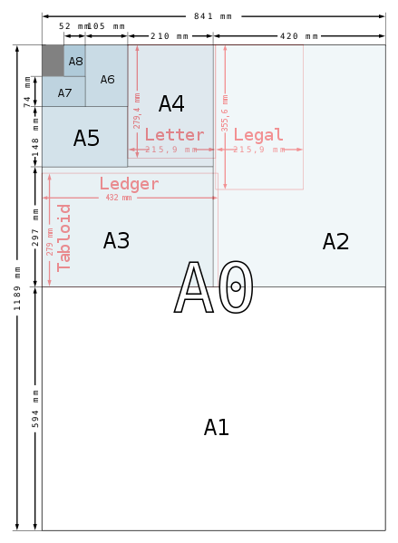

# Paper size
> 2020.08.19 **🚀 [despace](index.md) → **[Doc](doc.md)**

[TOC]

---

> <small>*Terms:* **Paper size** — English term. **Формат бумаги** — Russian equivalent.</small>

**Paper size** standards govern the size of sheets of paper used as writing paper, stationery, cards, and for some printed documents.

The ISO 216 standard, which includes the commonly used A4 size, is the international standard for paper size. It is used across the world except in North America and parts of Central and South America, where North American paper sizes such as “Letter” and “Legal” are used. The international standard for envelopes is the C series of ISO 269.

## Standart sizes
Some major paper sizes in portrait view.

|*Size*|*A mm × mm*|*B mm × mm*|*C mm × mm*|*D mm × mm*|*Unusual mm × mm*|
|:--|:--|:--|:--|:--|:--|
|0|841 × 1 189|1 000 × 1 414|917 × 1 297|771 × 1 090||
|1|594 × 841|707 × 1 000|648 × 917|545 × 771||
|2|420 × 594|500 × 707|458 × 648|385 × 545||
|3|297 × 420|353 × 500|324 × 458|272 × 385|Ledger — 297 × 420|
|4|210 × 297|250 × 353|229 × 324|192 × 272|Letter — 216 × 280 Legal — 216 × 356|
|5|148 × 210|176 × 250|162 × 229|136 × 192||
|6|105 × 148|125 × 176|114 × 162|96 × 136||
|7|74 × 105|88 × 125|81 × 114|68 × 96||
|8|52 × 74|62 × 88|57 × 81|48 × 68||
|9|37 × 52|44 × 62|40 × 57|—||
|10|26 × 37|31 × 44|28 × 40|—||

 

## Docs & links
|Navigation|
|:--|
|<small>**[FAQ](faq.md)**, **[Cable](cable.md)**·БКС, **[Camera](cam.md)**·Камера, **[Comms](comms.md)**·Радио, **[Contact](contact.md)**·Контакт, **[Control](control.md)**·Упр., **[Doc](doc.md)**·Док., **[Doppler](doppler.md)**·ИСР, **[DS](ds.md)**·ЗУ, **[EB](eb.md)**·ХИТ, **[ECO](ecology.md)**·Экол., **[EF](ef.md)**·ВВФ, **[ElC](elc.md)**·ЭКБ, **[EMC](emc.md)**·ЭМС, **[Error](error.md)**·Ошибки, **[Event](event.md)**·События, **[FS](fs.md)**·ТЭО, **[Fuel](fuel.md)**·Топливо, **[GNC](gnc.md)**·БКУ, **[GS](scs.md)**·НС, **[HF&E](hfe.md)**·Эрго., **[IU](iu.md)**·Гиро., **[KT](kt.md)**·КТЕХ, **[LAG](lag.md)**·ПУC, **[LES](les.md)**·САСП, **[LS](ls.md)**·СЖО, **[LV](lv.md)**·РН, **[MCC](mcc.md)**·ЦУП, **[Model](model.md)**·Модель, **[MSC](sc.md)**·ПКА, **[N&B](nnb.md)**·БНО, **[NR](nr.md)**·ЯР, **[OBC](obc.md)**·ЦВМ, **[OE](oe.md)**·БА, **[Pat.](патент.md)**·Патент, **[Project](project.md)**·Проект, **[PS](ps.md)**·ДУ, **[R&D](rnd.md)**·НИОКР, **[SRRQ](srrq.md)**·БКНР, **[Robot](robotics.md)**·Робот, **[Rover](rover.md)**·Планетоход, **[RTG](rtg.md)**·РИТЭГ, **[SARC](sarc.md)**·ПСК, **[Sensor](sensor.md)**·Датчик, **[SC](sc.md)**·КА, **[SCS](scs.md)**·КК, **[SGM](sgm.md)**·КММ, **[SI](si.md)**·СИ, **[Soft](soft.md)**·ПО, **[SP](sp.md)**·БС, **[Spaceport](spaceport.md)**·Космодром, **[SPS](sps.md)**·СЭС, **[SSS](sss.md)**·ГЗУ, **[TCS](tcs.md)**·СОТР, **[Test](test.md)**·ЭО, **[Timeline](timeline.md)**·ЦГМ, **[TMS](tms.md)**·ТМС, **[TOR](tor.md)**·ТЗ, **[TRL](trl.md)**·УГТ</small>|
|*Sections & pages*|
|**··• [Documents](doc.md) •··**  **Схема:** [КСС](ксс.md) ┊ [ПГС](пгс.md) ┊ [ПЛИС](плис.md) ┊ [СхД](wbs.md) ┊ [СхО](draft_model.md) ┊ [СхПЗ](draft_model.md) ┊ [СхЧ](unit_decd.md) ┊ [СхЭ](ei_diagram.md)|

   1. Docs: …
   1. Notable interwikies — …
   1. <https://en.wikipedia.org/wiki/Paper_size>
