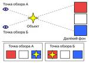
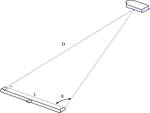

# Параллакс
> 2019.05.12 ┊ **🚀 [despace](index.md)** → [Space](index.md), **[СИ, формулы](si.md)**

[TOC]

---

> <small>*Термины:* **Параллакс** — русскоязычный термин. **Parallax** — англоязычный эквивалент.</small>

**Паралла́кс** *(греч. παραλλάξ, от παραλλαγή, «смена, чередование»)* — изменение видимого положения объекта относительно удалённого фона в зависимости от положения наблюдателя.

## Описание

Зная расстояние между точками наблюдения **L** (база) и угол смещения **α**, можно определить расстояние до объекта:  
`D = L / (2·sinα/2)`

Для малых углов (α — в радианах):  
`D = L / α`

Параллакс используется в геодезии и астрономии для измерения расстояния до удалённых объектов (в частности в [[глоссарий:международная_система_единиц_си|специальных единицах> — [парсеках](parsec.md)). На явлении параллакса основано бинокулярное зрение.

|  Схема параллакса  |  Измерение расстояния при помощи параллакса  |
|:--|:--|
|   |   |

 

---

## Docs & links (TRANSLATEME ALREADY)
|…°·•¹²³±×÷≤≥≈≠ ‑ −— ⎆✉ ❐“”’«»✔→✘☐☑├┕┆ 1 lb = 0.453592 kg; 1 g = 9.80665 m/s²|
|:--|
|<small>**[FAQ](faq.md)**, **[Cable](cable.md)**·БКС, **[Camera](camera.md)**·Камера, **[Comms](comms.md)**·Радиосв., **[Contact](contact.md)**·Контакт, **[Control](control.md)**·Управ., **[Doc](doc.md)**·Док., **[Doppler](doppler.md)**·ИСР, **[DS](ds.md)**·ЗУ, **[EB](eb.md)**·ХИТ, **[ECO](ecology.md)**·Экол., **[EF](ef.md)**·ВВФ, **[ElC](elc.md)**·ЭКБ, **[EMC](emc.md)**·ЭМС, **[Errors](error.md)**·Ошибки, **[Events](event.md)**·События, **[FS](fs.md)**·ТЭО, **[Fuel](fuel.md)**·Топливо, **[GNC](gnc.md)**·БКУ, **[GS](scs.md)**·НС, **[HF&E](hfe.md)**·Эргоном., **[IMU](imu.md)**·Гироскоп, **[Incubator](incubator.md)**·Инкуб., **[KT](kt.md)**·КТЕХ, **[LAG](lag.md)**·ПУC, **[LES](les.md)**·САСП, **[LS](ls.md)**·СЖО, **[LV](lv.md)**·РН, **[MAG](mag.md)**·Магнитом., **[MCC](mcc.md)**·ЦУП, **[Model](model.md)**·Модель, **[MSC](sc.md)**·ПКА, **[N&B](nnb.md)**·БНО, **[NR](nr.md)**·ЯР, **[OBC](obc.md)**·ЦВМ, **[OE](oe.md)**·БА, **[Patent](патент.md)**·Патент, **[Project](project.md)**·Проект, **[PS](ps.md)**·ДУ, **[QA](quality.md)**·QA, **[R&D](rnd.md)**·НИОКР, **[RAMS](rams.md)**·НиБ, **[Risk](risk.md)**·Риск, **[Robot](robotics.md)**·Робот, **[Rover](rover.md)**·Планетоход, **[RTG](rtg.md)**·РИТЭГ, **[RW](rw.md)**·ДМ, **[SARC](sarc.md)**·ПСК, **[Sensor](sensor.md)**·Датчик, **[SC](sc.md)**·КА, **[SCS](scs.md)**·КК, **[SGM](sgm.md)**·КММ, **[SI](si.md)**·СИ, **[Soft](soft.md)**·ПО, **[SP](sp.md)**·БС, **[Spaceport](spaceport.md)**·Космодром, **[SPS](sps.md)**·СЭС, **[SSS](sss.md)**·ГЗУ, **[TCS](tcs.md)**·СОТР, **[Test](test.md)**·ЭО, **[Timeline](timeline.md)**·Циклограмма, **[TMS](tms.md)**·ТМС, **[TOR](tor.md)**·ТЗ, **[TRL](trl.md)**·УГТ</small>|

**Docs:**

   1. …

**Links:**

   1. Notable interwikies — …
   1. <https://en.wikipedia.org/wiki/Parallax>
   1. <https://ru.wikipedia.org/wiki/Параллакс>

|*Sections & pages*|
|:--:|
|**`СИ, формулы:`**  [Атмосфера](atmosphere.md) ┊ [Квази](quasi.md) ┊ [Параллакс](parallax.md) ┊ [Парсек](parsec.md) ┊ [Ускорение свободного падения](g.md) |
|**··• [Space](index.md) •··**  [Apparent magnitude](app_mag.md) ┊ [Blue Marble](blue_marble.md) ┊ [Cosmic rays](cr.md) ┊ [Ecliptic](ecliptic.md) ┊ [Escape velocity](esc_vel.md) ┊ [Health](health.md) ┊ [Hill sphere](hill_sphere.md) ┊ [Information](info.md) ┊ [Lagrangian points](l_points.md) ┊ [Near space](near_sys.md) ┊ [Pale Blue Dot](pale_blue_dot.md) ┊ [Parallax](parallax.md) ┊ [Point Nemo](point_nemo.md) ┊ [Silver Snoopy award](silver_snoopy_award.md) ┊ [Solar constant](solar_const.md) ┊ [Terminator](terminator.md) ┊ [Time](time.md) ┊ [Timezones](timezone.md) ┊ [Wormhole](wormhole.md)  ▮  **Solar system:** [Ariel](ariel.md) ┊ [Callisto](callisto.md) ┊ [Ceres](ceres.md) ┊ [Deimos](deimos.md) ┊ [Earth](earth.md) ┊ [Enceladus](enceladus.md) ┊ [Eris](eris.md) ┊ [Europa](europa.md) ┊ [Ganymede](ganymede.md) ┊ [Haumea](haumea.md) ┊ [Iapetus](iapetus.md) ┊ [Io](io.md) ┊ [Jupiter](jupiter.md) ┊ [Makemake](makemake.md) ┊ [Mars](mars.md) ┊ [Mercury](mercury.md) ┊ [Moon](moon.md) ┊ [Neptune](neptune.md) ┊ [Nereid](nereid.md) ┊ [Nibiru](nibiru.md) ┊ [Oberon](oberon.md) ┊ [Phobos](phobos.md) ┊ [Pluto](pluto.md) ┊ [Proteus](proteus.md) ┊ [Rhea](rhea.md) ┊ [Saturn](saturn.md) ┊ [Sedna](sedna.md) ┊ [Solar day](solar_day.md) ┊ [Sun](sun.md) ┊ [Titan](titan.md) ┊ [Titania](titania.md) ┊ [Triton](triton.md) ┊ [Umbriel](umbriel.md) ┊ [Uranus](uranus.md) ┊ [Venus](venus.md)|
