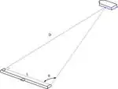

# Параллакс
> 2019.05.12 [🚀](../index/index.md) [despace](index.md) → [Space](index.md), **[СИ, формулы](si.md)**

[TOC]

---

> <small>**Параллакс** — русскоязычный термин. **Parallax** — англоязычный эквивалент.</small>

**Паралла́кс** *(греч. παραλλάξ, от παραλλαγή, «смена, чередование»)* — изменение видимого положения объекта относительно удалённого фона в зависимости от положения наблюдателя.

Зная расстояние между точками наблюдения **L** (база) и угол смещения **α**, можно определить расстояние до объекта:  
`D = L / (2·sinα/2)`

Для малых углов (α — в радианах):  
`D = L / α`

Параллакс используется в геодезии и астрономии для измерения расстояния до удалённых объектов (в частности в [[глоссарий:международная_система_единиц_си|специальных единицах> — [парсеках](parsec.md)). На явлении параллакса основано бинокулярное зрение.

|Схема параллакса|Измерение расстояния при помощи параллакса|
|:--|:--|
|||

## Docs & links (TRANSLATEME ALREADY)
|Navigation|
|:--|
|**[FAQ](faq.md)**【**[SCS](scs.md)**·КК, **[SC (OE+SGM)](sc.md)**·КА】**[CON](contact.md)·[Pers](person.md)**·Контакт, **[Ctrl](control.md)**·Упр., **[Doc](doc.md)**·Док., **[Drawing](drawing.md)**·Чертёж, **[EF](ef.md)**·ВВФ, **[Error](error.md)**·Ошибки, **[Event](event.md)**·События, **[FS](fs.md)**·ТЭО, **[HF&E](hfe.md)**·Эрго., **[KT](kt.md)**·КТ, **[N&B](nnb.md)**·БНО, **[Project](project.md)**·Проект, **[QM](qm.md)**·БКНР, **[R&D](rnd.md)**·НИОКР, **[SI](si.md)**·СИ, **[Test](test.md)**·ЭО, **[TRL](trl.md)**·УГТ, **[Way](way.md)**·Пути|
|*Sections & pages*|
|**`СИ, формулы:`**  [Атмосфера](atmosphere.md)・ [Квази](quasi.md)・ [Параллакс](parallax.md)・ [Парсек](parsec.md)・ [Ускорение свободного падения](g.md)|
|**【[Space](index.md)】**  [Apparent magnitude](app_mag.md)・ [Astro.object](aob.md)・ [Blue Marble](earth.md)・ [Cosmic rays](ion_rad.md)・ [Ecliptic](ecliptic.md)・ [Escape velocity](esc_vel.md)・ [Health](health.md)・ [Hill sphere](hill_sphere.md)・ [Information](info.md)・ [Lagrangian points](l_points.md)・ [Near space](near_space.md)・ [Pale Blue Dot](earth.md)・ [Parallax](parallax.md)・ [Point Nemo](earth.md)・ [Silver Snoopy award](silver_snoopy_award.md)・ [Solar constant](solar_const.md)・ [Terminator](terminator.md)・ [Time](time.md)・ [Wormhole](wormhole.md) ┊ ··•·· **Solar system:** [Ariel](ariel.md)・ [Callisto](callisto.md)・ [Ceres](ceres.md)・ [Deimos](deimos.md)・ [Earth](earth.md)・ [Enceladus](enceladus.md)・ [Eris](eris.md)・ [Europa](europa.md)・ [Ganymede](ganymede.md)・ [Haumea](haumea.md)・ [Iapetus](iapetus.md)・ [Io](io.md)・ [Jupiter](jupiter.md)・ [Makemake](makemake.md)・ [Mars](mars.md)・ [Mercury](mercury.md)・ [Moon](moon.md)・ [Neptune](neptune.md)・ [Nereid](nereid.md)・ [Nibiru](nibiru.md)・ [Oberon](oberon.md)・ [Phobos](phobos.md)・ [Pluto](pluto.md)・ [Proteus](proteus.md)・ [Rhea](rhea.md)・ [Saturn](saturn.md)・ [Sedna](sedna.md)・ [Solar day](solar_day.md)・ [Sun](sun.md)・ [Titan](titan.md)・ [Titania](titania.md)・ [Triton](triton.md)・ [Umbriel](umbriel.md)・ [Uranus](uranus.md)・ [Venus](venus.md)|

   1. Docs: …
   1. <https://en.wikipedia.org/wiki/Parallax>
   1. <https://ru.wikipedia.org/wiki/Параллакс>

