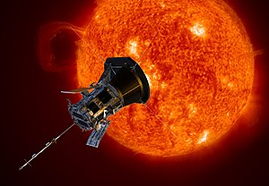
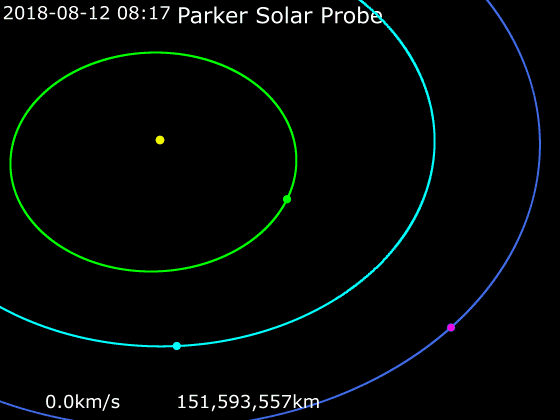

# Parker Solar Probe
> Ver. . ┊ **🚀 [despace](index.md)** → **** <mark>NOCAT</mark>

[TOC]

---

> <small>*Terms:* **Parker Solar Probe (Solar Probe, Solar Probe Plus, Solar Probe+, PSP)** — English term with no analogues in Russian. **Солнечный зонд «Паркер»** — literal translation to Russian.</small>

**Parker Solar Probe** is a NASA robotic spacecraft launched in 2018, with the mission of repeatedly probing and making observations of the outer corona of the Sun. 

 

|*Type*|*[Param.](si.md)*|
|:--|:--|
||**`Mission properties`**|
|Cost| US$1.5 billion or 36 780 kg of [gold](sc_price.md) |
|Development| 2008-2018 |
|Duration| Planned: 6 years, 321 days |
|Launch| August 12, 2018, 07:31 UTC, Rocket Delta IV Heavy / Star-48BV |
|Operator| NASA · Applied Physics Laboratory |
|Programme| Parker Solar Probe |
|Similar  missions| • Proposed: Solar Orbiter (planned for 2020)   • Current: … • Past: [MESSENGER](messnger.md) |
|Target| Trace the flow of energy that heats the corona and accelerates the solar wind. Determine the structure and dynamics of the magnetic fields at the sources of solar wind. Determine what mechanisms accelerate and transport energetic particles. |
|[Type](sc.md)| Flyby spacecraft; orbiter spacecraft |
||**`Spacecraft properties`**|
|Composition| Probe |
|Contractor| United Launch Alliance |
|Manufacturer| Applied Physics Laboratory |
||**`…`**|
|Comms| Ka band, X-Band |
|[ID](spaceid.md)| NSSDC ID (COSPAR ID): 2018-065A, SCN: 43592 |
|Mass| Dry: 555 kg ([Medium satellite](спутник.md), [EVN‑072](evn_072.md)) |
|Orbit / Site| Heliocentric; 0.046 × 0.73 AU; T = 88 days |
|Payload| Electromagnetic Fields Investigation, Integrated Science Investigation of the Sun, Wide-field Imager for Solar Probe, Solar Wind Electrons Alphas and Protons, Heliospheric Origins with Solar Probe Plus |
|Power| 343 W |

Targets & investigations:

   - **T** — technical; **Draft** — minimum for working with object. **D** — distant exploration; **C** — contact exploration; **F** — fly‑by; **H** — manned flight; **S** — soil sampe return; **X** — technology demonstration
   - **Sections of measurement and observation:**
      - Atmospheric/climate — **Ac** composition, **Ai** imaging, **Am** mapping, **Ap** pressure, **As** samples, **At** temperature, **Aw** wind speed/direction.
      - General — **Gi** planet’s interactions with outer space.
      - Soil/surface — **Sc** composition, **Si** imaging, **Sm** mapping, **Ss** samples.

<small>

|*EVN‑XXX*|*T*|*EN*|*Section of m&o*|*D*|*C*|*F*|*H*|*S*|
|:--|:--|:--|:--|:--:|:--:|:--:|:--:|:--:|
|EVN‑072|T|Exploration with [satellites](sc.md): medium satellites.|  |D||F|||

</small>

 

## Mission
It will approach to within 9.86 solar radii from the center of the Sun and by 2025 will travel, at closest approach, as fast as 690 000 km/h, or 0.064% the speed of light.

The Parker Solar Probe will be the first spacecraft to fly into the low solar corona. It will assess the structure and dynamics of the Sun's coronal plasma and magnetic field, the energy flow that heats the solar corona and impels the solar wind, and the mechanisms that accelerate energetic particles.

The Parker Solar Probe mission design uses repeated gravity assists at Venus to incrementally decrease its orbital perihelion to achieve a final altitude (above the surface) of approximately 8.5 solar radii, or about 6 millions km.

The spacecraft trajectory will include seven Venus flybys over nearly seven years to gradually shrink its elliptical orbit around the Sun, for a total of 24 orbits.

After the first Venus flyby, the probe will be in an elliptical orbit with a period of 150 days (two-thirds the period of Venus), making three orbits while Venus makes two. On the second flyby, the period shortens to 130 days. After less than two orbits (only 198 days later) it encounters Venus a third time at a point earlier in the orbit of Venus. This encounter shortens its period to half of that of Venus, or about 112.5 days. After two orbits it meets Venus a fourth time at about the same place, shortening its period to about 102 days. After 237 days it meets Venus for the fifth time and its period is shortened to about 96 days, three-sevenths that of Venus. It then makes seven orbits while Venus makes three. The sixth encounter, almost two years after the fifth, brings its period down to 92 days, two-fifths that of Venus. After five more orbits (two orbits of Venus) it meets Venus for the seventh and last time, decreasing its period to 88 or 89 days and allowing it to approach closer to the Sun.

||
|:--|
|***The trajectory of the probe***|

   - Launch occurred on 12 August 2018, at 3:31 a.m. EDT, 7:31 a.m. GMT. The spacecraft operated nominally after launching. During its first week in space it deployed its high-gain antenna, magnetometer boom, and electric field antennas.
   - Instrument activation and testing began in early September 2018. On 9 September, the two WISPR telescopic cameras performed a successful first-light test, transmitting wide-angle images of the background sky towards the galactic center.
   - The probe successfully performed the first of the seven planned Venus flybys on 3 October 2018.
   - The first scientific observations were transmitted in December 2018.
   - NASA announced that on January 19, 2019, the Parker Solar Probe reached its first aphelion, thus completing its first full orbit.

On December 4, 2019, the first four research papers were published describing findings during the spacecraft's first two dives near the Sun. They reported the direction and strength of the Sun's magnetic field, and described the unusually frequent and short-lived changes in the direction of the Sun's magnetic field. These measurements confirm the hypothesis that Alfvén waves are the leading candidates for understanding the mechanisms that underlie the coronal heating problem. The probe observed approximately a thousand «rogue» magnetic waves in the solar atmosphere that instantly increase solar winds by as much as 480 000 km/h and in some cases completely reverse the local magnetic field. They also reported that, using the «beam of electrons that stream along the magnetic field», they were able to observe that «the reversals in the Sun's magnetic field are often associated with localized enhancements in the radial component of the plasma velocity (the velocity in the direction away from the Sun's centre)». The researchers found a «surprisingly large azimuthal component of the plasma velocity (the velocity perpendicular to the radial direction). This component results from the force with which the Sun's rotation slingshots plasma out of the corona when the plasma is released from the coronal magnetic field».

Parker discovered evidence of a cosmic dust free zone of 5.6 million km radius from the Sun, due to vaporisation of cosmic dust particles by the Sun's radiation.

 

## Science goals & payload
The goals of the mission are:

   - Trace the flow of energy that heats the corona and accelerates the solar wind.
   - Determine the structure and dynamics of the magnetic fields at the sources of solar wind.
   - Determine what mechanisms accelerate and transport energetic particles.
   - Study of plasma particles near the Sun and their impact on the solar wind and the formation of energy particles.
   - Study of Alfven's solar waves.

To achieve these goals, the mission will perform five major experiments or investigations (inc. instruments):

   - Electromagnetic Fields Investigation (FIELDS) − This investigation will make direct measurements of electric and magnetic fields, radio waves, Poynting flux, absolute plasma density, and electron temperature. It consists of two flux-gate magnetometers, a search-coil magnetometer, and 5 plasma voltage sensors.
   - Integrated Science Investigation of the Sun (IS☉IS) − This investigation will measure energetic electrons, protons and heavy ions. The instrument suite comprises two independent Energetic Particle Instruments, the EPI-Hi and EPI-Lo studying higher and lower energy particles.
   - Wide-field Imager for Solar Probe (WISPR) − These optical telescopes will acquire images of the corona and inner heliosphere.
   - Solar Wind Electrons Alphas and Protons (SWEAP) − This investigation will count the electrons, protons and helium ions, and measure their properties such as velocity, density, and temperature. Its main instruments are the Solar Probe Analyzers (SPAN, two electrostatic analyzers) and the Solar Probe Cup (SPC, a Faraday cup).
   - Heliospheric Origins with Solar Probe Plus (HeliOSPP) − A theory and modeling investigation to maximize the scientific return from the mission.

 

## Spacecraft
The spacecraft's systems are protected from the extreme heat and radiation near the Sun by a solar shield. Incident solar radiation at perihelion is approximately 650 kW/m², or 475 times the intensity at Earth orbit. The solar shield is hexagonal, mounted on the Sun-facing side of the spacecraft, 2.3 m in diameter, 11.4 cm thick, and is made of reinforced carbon–carbon composite, which is designed to withstand temperatures outside the spacecraft of about 1 370 °C.

A white reflective alumina surface layer minimizes absorption. The spacecraft systems and scientific instruments are located in the central portion of the shield's shadow, where direct radiation from the Sun is fully blocked. As radio communication with Earth will take about eight minutes in each direction, the Parker Solar Probe will have to act autonomously and rapidly to protect itself. This will be done using four light sensors to detect the first traces of direct sun light coming from the shield limits and engaging movements from reaction wheels to reposition the spacecraft within the shadow again.

The primary power for the mission is a dual system of solar panels (photovoltaic arrays). A primary photovoltaic array, used for the portion of the mission outside 0.25 AU, is retracted behind the shadow shield during the close approach to the Sun, and a much smaller secondary array powers the spacecraft through closest approach. This secondary array uses pumped-fluid cooling to maintain operating temperature of the solar panels and instrumentation.

 

## Community, library, links

**PEOPLE:**

   - Eugene Parker − professor emeritus at the University of Chicago
   - Stuart Bale − principal investigator of FIELDS (the University of California)
   - David McComas − principal investigator of IS☉IS (the Princeton University)
   - Russell Howard − principal investigator of WISPR (Naval Research Laboratory)
   -  Justin Kasper − principal investigator of SWEAP (the University of Michigan and the Smithsonian Astrophysical Observatory)
   - Marco Velli − principal investigator of HeliOSPP (UCLA and the Jet Propulsion Laboratory)

**COMMUNITY:**

<mark>TBD</mark>

---

## Docs & links
|…°·•¹²³±×÷≤≥≈≠ ‑ −— ⎆✉ ❐“”’«»✔→✘☐☑├┕┆ 1 lb = 0.453592 kg; 1 g = 9.80665 m/s²|
|:--|
|**R**|— [DON'T PANIC!](dont_panic.md) ┊ [АНАЛИТИКА](incubator.md) ┊ [АРХИВ](faq.md) ┊ [БЕЗОПАСНОСТЬ](rams.md) ┊ [ИСПЫТАНИЯ](test.md) ┊ [ИССЛЕДОВАНИЯ](project.md) ┊ [ДОК.](doc.md) ┊ [КАЧЕСТВО](quality.md) ┊ [КОНТАКТЫ](contact.md) ┊ [КООПЕРАЦИЯ](contact.md) ┊ [КТЕХ](kt.md) ┊ [МОДЕЛЬ](model.md) ┊ [НАДЁЖНОСТЬ](rams.md) ┊ [R&D](rnd.md) ┊ [ОШИБКИ](error.md) ┊ [ПАТЕНТ](патент.md) ┊ [ПЗ](report.md) ┊ [ПОЗ](fp.md) ┊ [ПРОЕКТЫ](project.md) ┊ [РАБ.ПРОЦЕСС](workflow.md) ┊ [РИСК](risk.md) ┊ [СИ/ФОРМУЛЫ](si.md) ┊ [СОБЫТИЯ](event.md) ┊ [СУ](cs.md) ┊ [СХЕМА](doc.md) ┊ [ТЗ](tor.md) ┊ [ТЭО](fs.md) ┊ [УГТ](trl.md) ┊ [УПРАВЛЕНИЕ](control.md) ┊ [ЦГМ](obc.md) ┊ **[ЧАВО](dont_panic.md)** ┊ [ЭКОЛОГИЯ](ecology.md) ┊ [ЭРГОНОМИКА](hfe.md); — **[КК](scs.md), [КА](sc.md):** [БА, КНА](oe.md) ┊ [БАС](acuer.md) ┊ [БКС](cable.md) ┊ [GNC](gnc.md) ┊ [БНО](nnb.md) ┊ [БС](sp.md) ┊ [БУ](sp.md) ┊ [БЦ](scs.md) ┊ [ВВФ](ef.md) ┊ [Гироскоп](imu.md) ┊ [ГЗУ](sss.md) ┊ [ГО/ПхО](lv.md) ┊ [Датчик](sensor.md) ┊ [ДМ](rw.md) ┊ [ДУ](ps.md) ┊ [ЗД](sensor.md) ┊ [ЗУ](ds.md) ┊ [ИСР](doppler.md) ┊ [Камера](camera.md) ┊ [КММ](sgm.md) ┊ [Космодром](spaceport.md) ┊ [Магнитометр](mag.md) ┊ [НКУ](scs.md) ┊ [ННК](scs.md) ┊ [НС](scs.md) ┊ [Планетоход](rover.md) ┊ [ПО](soft.md) ┊ [ПСК](sarc.md) ┊ [ПУC](lag.md) ┊ [Радиосвязь](comms.md) ┊ [РБ](lv.md) ┊ [РИТЭГ](rtg.md) ┊ [РН](lv.md) ┊ [Робот](robotics.md) ┊ [СД](sensor.md) ┊ [СОТР](tcs.md) ┊ [СЭА](ea_sys.md) ┊ [СЭС](sps.md) ┊ [ТМС](tms.md) ┊ [Топливо](fuel.md) ┊ [ХИТ](eb.md) ┊ [ЦВМ](obc.md) ┊ [ЦУП](mcc.md) ┊ [ЭКБ](elc.md) ┊ [ЭМС](emc.md) ┊ [ЯР](nr.md)  ▮  **ПКП:** [ПКА](sc.md) ┊ [САСП](les.md) ┊ [СЖО](ls.md); |

**Docs:**

   1. …

**Links:**

   1. Notable interwikies — …
   1. <https://en.wikipedia.org/wiki/Parker_Solar_Probe>
   1. <https://ru.wikipedia.org/wiki/%D0%9F%D0%B0%D1%80%D0%BA%D0%B5%D1%80_(%D1%81%D0%BE%D0%BB%D0%BD%D0%B5%D1%87%D0%BD%D1%8B%D0%B9_%D0%B7%D0%BE%D0%BD%D0%B4)>
   
<mark>NOCAT</mark>
