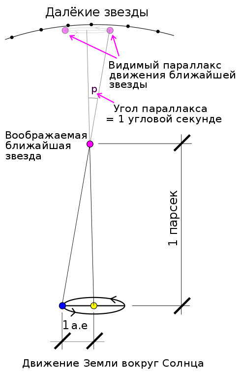

# Парсек
> 2019.05.12 **[🚀](../index/index.md) [despace](index.md)** → **[СИ, формулы](si.md)**

[TOC]

---

> <small>*Термины:* **Парсек** — русскоязычный термин. **Parsec** — англоязычный эквивалент.</small>

**Парсе́к** *(русское обозначение: **пк**; международное: **pc**)* — распространённая в астрономии [внесистемная единица измерения расстояний](si.md), равная расстоянию до объекта, годичный тригонометрический [параллакс](parallax.md) которого равен одной угловой секунде. Название образовано из сокращений слов «**пар**аллакс» и «**сек**унда».

## Описание

Согласно эквивалентному определению, парсек — это расстояние, с которого отрезок длиной в одну астрономическую единицу (практически равный среднему радиусу орбиты Земли), перпендикулярный лучу зрения, виден под углом в одну угловую секунду (1″). Из этого определения вытекает, что парсек равен длине катета прямоугольного треугольника с прилежащим углом 1 угловая секунда и другим катетом длиной 1 астрономическая единица.

1 пк ≈ 206 264.8 а.е. = 3.0856776·10¹⁶ м = 30.8568 трлн км (петаметров) = 3.2616 светового года.

Также используются и кратные единицы: килопарсек (кпк, kpc), мегапарсек (Мпк, Mpc), гигапарсек (Гпк, Gpc). Дольные единицы, как правило, не используются, поскольку вместо них применяются астрономические единицы.

В Российской Федерации парсек допущен к использованию в качестве внесистемной единицы без ограничения срока с областью применения «астрономия». При этом, однако, парсек и его обозначение не допускается применять вместе с дольными и кратными приставками СИ, несмотря на то, что использование кратных единиц килопарсек, мегапарсек и гигапарсек общепринято в астрономии.

## Некоторые расстояния
   - 1 астрономическая единица (а.е.) составляет приблизительно 4,848·10⁻⁶ парсека;
   - по состоянию на 13 февраля 2015 года, космический аппарат «Вояджер‑1» находился на расстоянии 0.000630 пк (19.4 млрд км, или 130 а.е.) от Солнца, удаляясь по 17.5 микропарсека за год (3.6 а.е./год);
   - диаметр облака Оорта ≈0.62 пк;
   - расстояние от Солнца до ближайшей звезды (Проксима Центавра) составляет 1.3 парсека;
   - расстояние в 10 пк свет проходит за 32 года 7 месяцев и 6 дней;
   - на расстоянии около 10 пк вероятно возможно найти нейтронную звезду, а на расстоянии в несколько десятков парсеков — чёрную дыру.
   - расстояние от Солнца до ближайшего шарового скопления, M 4, составляет 2.2 кпк;
   - расстояние от Солнца до центра нашей Галактики — около 8 кпк;
   - диаметр нашей Галактики — около 30 кпк;
   - расстояние до туманности Андромеды — 0.77 Мпк;
   - ближайшее крупное скопление галактик, скопление Девы, находится на расстоянии 18 Мпк;
   - в масштабах порядка 300 Мпк Вселенная практически однородна;
   - расстояние до первого открытого, самого яркого и одного из ближайших квазаров, 3C 273, составляет 734 Мпк;
   - до горизонта наблюдаемой Вселенной — около 4 Гпк (если измерять расстояние, пройденное регистрируемым на Земле светом), или, если оценивать современное расстояние — с учётом расширения Вселенной (то есть до удалившихся объектов, это излучение когда‑то испустивших) ≈14 Гпк.

 

## Docs & links (TRANSLATEME ALREADY)
|…°·•¹²³±×÷≤≥≈≠ ‑ −— ⎆✉ ❐“”’«»✔→✘☐☑├┕┆ 1 lb = 0.453592 kg; 1 g = 9.80665 m/s²|
|:--|
|<small>**[FAQ](faq.md)**, **[Cable](cable.md)**·БКС, **[Camera](cam.md)**·Камера, **[Comms](comms.md)**·Радио, **[Contact](contact.md)**·Контакт, **[Control](control.md)**·Упр., **[Doc](doc.md)**·Док., **[Doppler](doppler.md)**·ИСР, **[DS](ds.md)**·ЗУ, **[EB](eb.md)**·ХИТ, **[ECO](ecology.md)**·Экол., **[EF](ef.md)**·ВВФ, **[ElC](elc.md)**·ЭКБ, **[EMC](emc.md)**·ЭМС, **[Error](error.md)**·Ошибки, **[Event](event.md)**·События, **[FS](fs.md)**·ТЭО, **[Fuel](fuel.md)**·Топливо, **[GNC](gnc.md)**·БКУ, **[GS](scs.md)**·НС, **[HF&E](hfe.md)**·Эрго., **[IU](iu.md)**·Гиро., **[KT](kt.md)**·КТЕХ, **[LAG](lag.md)**·ПУC, **[LES](les.md)**·САСП, **[LS](ls.md)**·СЖО, **[LV](lv.md)**·РН, **[MCC](mcc.md)**·ЦУП, **[Model](model.md)**·Модель, **[MSC](sc.md)**·ПКА, **[N&B](nnb.md)**·БНО, **[NR](nr.md)**·ЯР, **[OBC](obc.md)**·ЦВМ, **[OE](oe.md)**·БА, **[Pat.](патент.md)**·Патент, **[Project](project.md)**·Проект, **[PS](ps.md)**·ДУ, **[R&D](rnd.md)**·НИОКР, **[SRRQ](srrq.md)**·БКНР, **[Robot](robotics.md)**·Робот, **[Rover](rover.md)**·Планетоход, **[RTG](rtg.md)**·РИТЭГ, **[SARC](sarc.md)**·ПСК, **[Sensor](sensor.md)**·Датчик, **[SC](sc.md)**·КА, **[SCS](scs.md)**·КК, **[SGM](sgm.md)**·КММ, **[SI](si.md)**·СИ, **[Soft](soft.md)**·ПО, **[SP](sp.md)**·БС, **[Spaceport](spaceport.md)**·Космодром, **[SPS](sps.md)**·СЭС, **[SSS](sss.md)**·ГЗУ, **[TCS](tcs.md)**·СОТР, **[Test](test.md)**·ЭО, **[Timeline](timeline.md)**·ЦГМ, **[TMS](tms.md)**·ТМС, **[TOR](tor.md)**·ТЗ, **[TRL](trl.md)**·УГТ</small>|
|*Sections & pages*|
|**`СИ, формулы:`**  [Атмосфера](atmosphere.md) ┊ [Квази](quasi.md) ┊ [Параллакс](parallax.md) ┊ [Парсек](parsec.md) ┊ [Ускорение свободного падения](g.md) |

   1. Docs: …
   1. Notable interwikies — …
   1. <https://en.wikipedia.org/wiki/Parsec>
   1. <https://ru.wikipedia.org/wiki/Парсек>

